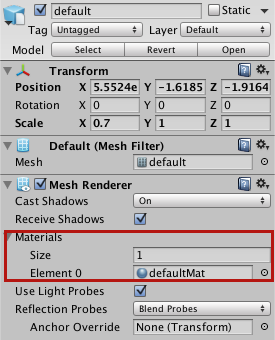
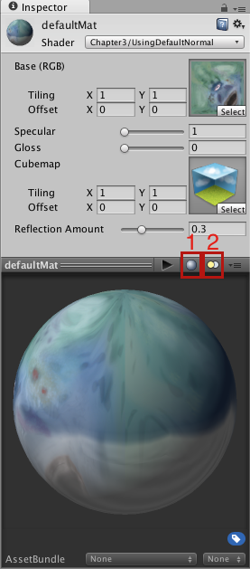
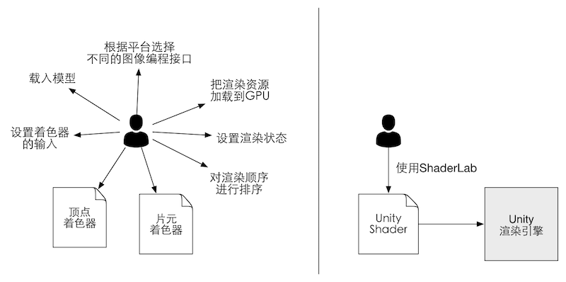

# 《UnityShadow》

# 目录

# UnityShader基础

## UnityShader概述

### 材质 和 Unity Shader

> #### 材质和UnityShader关系：流程

- (1) 创建一个材质
- (2) 创建一个Unity Shader，并把它赋给上一步创建的材质（即材质有Shader属性）
- (3) 把材质复给要渲染的对象
- (4) 在材质面板中调整Unity Shader的属性，以得到满意的效果

> #### 材质和UnityShader的职责

- UnityShader：定义渲染需要
    - 代码（如顶点着色器和片元着色器）
    - 属性（如使用那些纹理）
    - 指令（渲染和标签设置等）
- 材质：调节UnityShader所定义的属性

> #### 图解

图3.1 Unity Shader和材质。首先创建需要的Unity Shader和材质，然后把Unity Shader赋给材质，并在材质面板上调整属性（如使用的纹理、漫反射系数等）。最后，将材质赋给相应的模型来查看最终的渲染效果 

### Unity中的 材质

- 创建
    -  
    - 

图3.2 将材质直接拖曳到模型的Mesh Renderer组件中 

图3.3 材质提供了一种可视化的方式来调整着色器中使用的参数 

### Unity中的 Shader

图3.4 Unity Shader的导入设置面板 

图3.5 Gompile and show code下拉列表 

图3.6 Unity Shader为控制渲染过程提供了一层抽象。如果没有使用Unity  Shader（左图），开发者需要和很多文件和设置打交道，才能让画面呈现出想要的效果；而在Unity  Shader的帮助下（右图），开发者只需要使用ShaderLab来编写Unity Shader文件就可以完成所有的工作 

图3.7 在Unity Shader的名称定义中利用
斜杠来组织在材质面板中的位置

图3.8 不同属性类型在材质
面板中的显示结果 

图3.9 在Unity Shader的导入设置面板中可以通过Compile and show  code按钮来查看Unity对CG片段编译后的代码。通过单击Compile and show  code按钮右端的倒三角可以打开下拉菜单，在这个下拉菜单中可以选择编译的平台种类，如只为当前的显卡设备编译特定的汇编代码，或为所有的平台编译汇编代码，我们也可以自定义选择编译到哪些平台上

