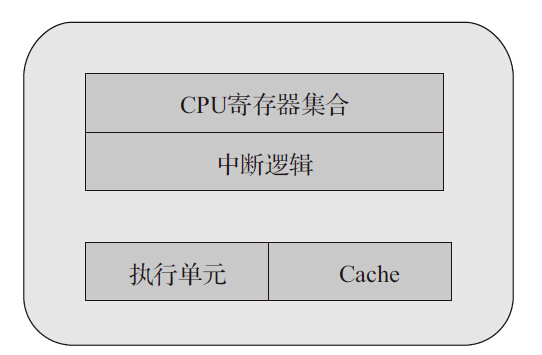

# 多核性能和可扩展性

处理器性能提升主要有两个途径，一个是提高IPC（每个时钟周期内可以执行的指令条数），另一个是提高处理器主频率。每一代微架构的调整可以伴随着对IPC的提高，从而提高处理器性能，只是幅度有限。而提高处理器主频率对于性能的提升作用是明显而直接的。但一味地提高频率很快会触及频率墙，因为处理器的功耗正比于主频的三次方。

所以，最终要取得性能提升的进一步突破，还是要回到提高IPC这个因素。经过处理器厂商的不懈努力，我们发现可以通过提高指令执行的并行度来提高IPC。而提高并行度主要有两种方法，一种是提高微架构的指令并行度，另一种是采用多核并发。这一章主要就分享这两种方法在DPDK中的实践，并在指令并行方法中上进一步引入数据并发的介绍。

## 追求性能水平扩展

多核处理器是指在一个处理器中集成两个或者多个完整的内核（及计算引擎）。如果把处理器性能随着频率的提升看做是垂直扩展，那多核处理器的出现使性能水平扩展成为可能。原本在单核上顺序执行的任务，得以按逻辑划分成若干子任务，分别在不同的核上并行执行。在任务粒度上，使指令执行的并行度得到提升。

那随着核数的增加，性能是否能持续提升呢？Amdahl定律告诉我们，假设一个任务的工作量不变，多核并行计算理论时延加速上限取决于那些不能并行处理部分的比例。换句话说，多核并行计算下时延不能随着核数增加而趋于无限小。该定律明确告诉我们，利用多核处理器提升固定工作量性能的关键在于降低那些不得不串行部分占整个任务执行的比例。更多信息可以参考［Ref3-1］。

对于DPDK的主要应用领域——数据包处理，多数场景并不是完成一个固定工作量的任务，更主要关注单位时间内的吞吐量。Gustafson定律对于在固定工作时间下的推导给予我们更多的指导意义。它指出，多核并行计算的吞吐率随核数增加而线性扩展，可并行处理部分占整个任务比重越高，则增长的斜率越大。带着这个观点来读DPDK，很多实现的初衷就豁然开朗。资源局部化、避免跨核共享、减少临界区碰撞、加快临界区完成速率（后两者涉及多核同步控制，将在下一章中介绍）等，都不同程度地降低了不可并行部分和并发干扰部分的占比。

## 多核处理器

在数据包处理领域，多核架构的处理器已经广泛应用。本节以英特尔的至强主流多核处理器为例，介绍DPDK中用到的一些概念，比如物理核、逻辑核、CPU node等。

下面结合图形详细介绍了单核、多核以及超线程的概念。

通过单核结构（见图3-1），我们先认识一下CPU物理核中主要的基本组件。为简化理解，将主要组件简化为：CPU寄存器集合、中断逻辑（Local APIC）、执行单元和Cache。一个完整的物理核需要拥有这样的整套资源，提供一个指令执行线程。

