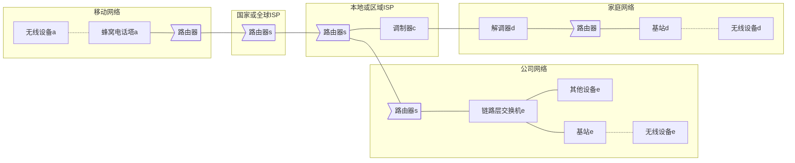
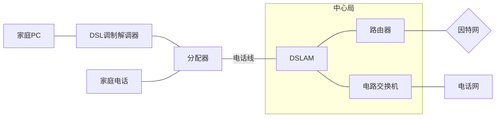
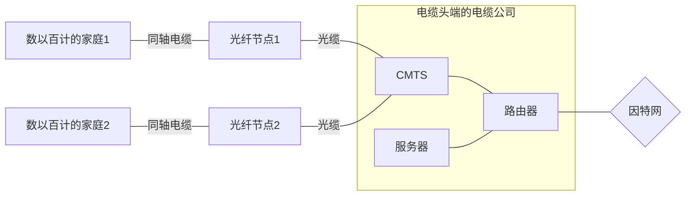
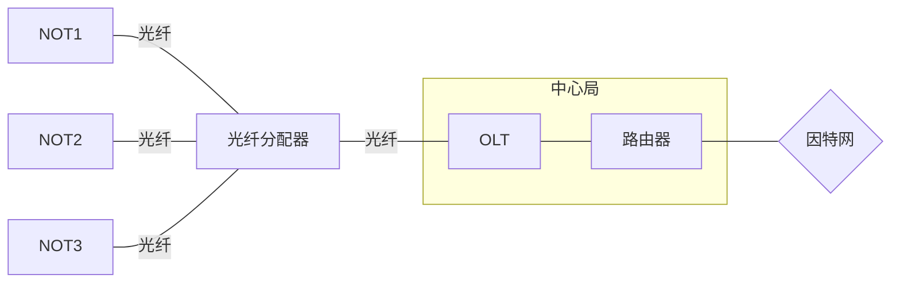
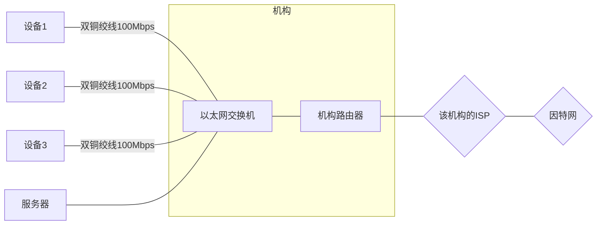
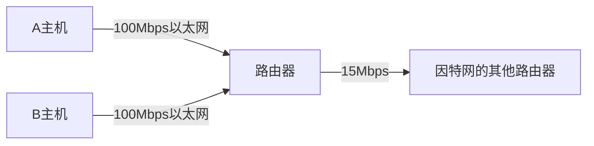
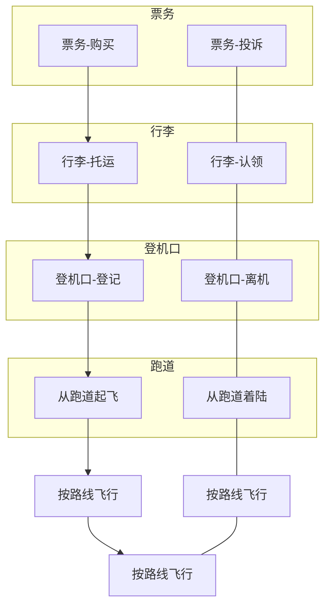

# 《计算机网络——自顶向下方法》

计算机科学丛书，机械工业出版社华章教育

- 学习顺序：

    - 第1章
    - 2-6章依赖于第一章
    - 最后三章之间无相关性

# 目录

[toc]

# 计算机网络和因特网

## 什么是因特网

两种回答方式

- 具体构成：基本硬件和软件组件
- 根据分布式应用提供服务的联网基础设施来描述

### 具体构成描述

非传统设备连接到因特网，因特网并非只有`计算机网络（computernet work）`

端系统

> - 连接的设备称为`主机（host）`或`端系统（end system）`

端系统的链接

> - 端系统通过`通信链路（communication link）`和`分组交换机（packet switch）`连接到一起
>
> - 通信链路
>
>     - 物理媒体：同轴电缆、铜线、光纤、无线电频谱
>
>     - 参数：`传输速率（transmission rate）`以`比特/秒（bit/s，或bps）`度量
>
> - 分组交换机
>
>     - 物理媒体：
>         - `路由器（router）`：通常用于`网络核心`中
>         - `链路层交换机（link-layer switch）`：通常用于`接入网`中
>
> - 路径（route或path）：一个分组所经历的一系列通信链路和分组交换机

其他补充

> 过程
>
> - 分组 > 传输 > 装配（可以用长途运货的模型来类比，道路岔道选择是分组交换机）
>
> ISP
>
> - 概念：端系统通过`因特网服务提供商（Internet Service Provider,ISP）`接入因特网
> - ISP也必须互联，低层ISP通过高层ISP互联，高层ISP通过高速光纤链路互联的高速路由器组成
> - ISP均独立管理，运行IP协议

### 服务描述

使用因特网的端系统应用被称为`分布式用用程序（distributed application）`，将因特网描述为应用程序的平台

与因特网相连的端系统提供一个`套接字接口（socket interface）`，发送数据的程序必须遵循套接字接口

### 什么是协议

协议（Protocol）

> 定义：协议定义了再两个或多个通信实体之间交换的报文的格式和顺序，以及报文发送和/或接受一条报文或其他时间所采取的动作
>
> 因特网的主要协议：TCP/IP
>
> - TCP（transmission Control Protocol，传输控制协议）
> - IP（Internet Protocol，网络协议）
>
> 制定：因特网标准（Internet standart）由因特网工程任务组（Internet Engineering Task Force，IFTF）研发，其标准文档称为请求评论（REC）

## 网络位置——网络边缘

主机=端系统，因为位于因特网的边缘，故而称为端系统

有时被进一步分为两类：

- 客户端（client）

- 服务器（server）

    Google拥有50~100个数据中心，其中15个大型数据中心每个都有10万台以上服务器

### 接入网

接入网

- 定义：将端系统物理连接到其边缘路由器（edge router）的网络
- 特征：是端系统到任何其他远程端系统的路径上的第一台路由器

> #### 家庭接入：DSL、电缆、FTTH、拨号和卫星

宽带连接有可能是：ADSL、DSL、VDSL、光纤、FTTH、FTTX+LAN、ISDN、DDN、分组交换网、WEB VOD、ADSL虚拟拨号、ADSL专线之一

> ##### 数字用户线（Digital Subscriber Line，DSL）

设备：DSL利用电话公司现有的本地电话基础设施

物理媒体：电话线即双绞铜线，同时继承数据和传统电话信号，用不同频率进行编码，使得看起来像有3根单独的线路一样（频分复用技术）

- 高速下行信道：位于`50kHz~1MHz`频段
- 中速上行信道：位于`4kHz~50kHz`频段
- 普通的双向电话信道：位于`0~4kHz`频段

DSL因特网接入：（住宅位于本地中心局的5~10英里）

> ##### 电缆（HFC）

设备：利用有线电视公司现有的有线电视基础设施，需要特殊的调制解调器——电缆调制解调器

物理媒体：这个系统应用`光纤和同轴电缆`，所以也被称为`混合光纤同轴系统（HFC）`

混合光纤同轴系统：

> ##### 光纤到户（FTTH）

又分为`主动光纤网络（AON）`和`被动光纤网络（PON）`

AON本质是交换因特网，下图为PON分布体系结构的FTTH：（ONT是光纤网络端接器，每个家庭都有，即光猫）

> ##### 卫星链路

无法提供DSL、电缆和FTTH的地方（某些乡村环境），使用卫星链路以超过1Mbps速率与互联网相连

> ##### 拨号

传统电话线的拨号接入与DSL基于相同模式，但56kbps的慢速率是令人痛苦的

> #### 企业（和家庭）接入：以太网和WiFi

> ##### 以太网

经典以太网（原始形式）用一个长电缆蜿蜒围绕着建筑物，这根电缆连接着所有的计算机

交换式以太网（广泛应用）如下

> ##### wifi

在几十米范围内

> #### 广域无线接入：3G和LTE

> ##### 3G

> ##### LTE（Long-Term Evolution）

### 接入网的物体媒体

物理媒体分两种类型

- **导引型媒体（guided media）**：电波沿固体媒体前行

    劳动力成本高于材料成本几个数量级，建筑商一般会同时铺设双绞线、光缆和同轴电缆，方便替换

- **非导引型媒体（unguided media）**：电波在空气或外层空间传播

| 传输媒体       | 描述                                                         | 优缺点                                                       | 速率          | 应用                            |
| -------------- | ------------------------------------------------------------ | ------------------------------------------------------------ | ------------- | ------------------------------- |
| 双绞铜线       | 两根绝缘铜线绞合，绞合目的是抗干扰                           | 最便宜最常用                                                 | 10Mbps~10Gbps | 电话网、局域网 DSL、以太网 |
| 同轴电缆       | 同心导体，许多端系统能直接和电缆相连                         |                                                              | 数十Mbps      | 导引型共享媒体                  |
| 光纤           | 利用全反射，二氧化硅 传播的是光脉冲，每个脉冲表示一个比特 | 不受电磁影响 衰减低 难窃听 但光设备成本高，短途运输不用 | 数十~数百Gbps | 长途导引型                      |
| 陆地无线电通信 | 承载电磁频谱信号，无需安装物理线路 分三类：短距离、局域、广域 |                                                              | 数百Mbps      | 无法使用DSL或电缆的地区         |
| 卫星无线电通道 | 连接地面站。分同步卫星和近地轨道卫星                         | 同步卫星36000km有280ms时延                                   |               | 近地未来也许能用于因特网        |

## 网络位置——网络核心

与网络边缘对应的，即网络核心：由因特网端系统的分组交换机和链路构成的网状网络

分组交换机的物理媒体：

- **网络核心**：常用`路由器（router）`
- **网络边缘接入网**：常用`链路层交换机（link-layer switch）`

通过网络链路和交换机移动数据有两种方法：（可用用餐厅是否需要预订来类比二者）

- **电路交换**：如下
- **分组交换**：如下

### 移动数据方法——分组交换

**分组**：源将长报文划分为较小的数据块

**分组交换机**：源和目的地之间，每个分组都通过`通信链路`和`分组交换机`传送

> #### 存储转发传输

**存储转发传输**：指在交换机在接收到整个分组前，不会开始向输出链路传输该分组的比特

**存储转发时延**：公式见下
$$
源和目的地之间有N-1台路由器（串联），一分组L比特，链路传输速率为Rbps，则端对端时间延迟为：\\
d_{端对端}=N\frac L R
$$

> #### 排队时延和分组丢失

**分组交换机的输出缓存**：用于存储路由器准备发往那条链路的分组

**排队时延**：取决于网络的堵塞程度（可以用人多/人少时银行柜台前排队类比）

**排队丢包**：缓存空间是有限的，新到达的分组发现缓存已被其他分组充满，则会发生分组丢失（丢包）

**分组交换图解**：（路由器1等待输出链路的分组队列）

> #### 转发表和路由选择协议

**转发表**：每台路由器具有一个转发表，将目的地址（的一部分）映射为输出链路，可用多次问路理解，解释了：路由器如何选择向哪条链路进行转发？

**路由选择协议**：用于自动地设置转发表——解释了：转发表是乳环进行设置的？

### 移动数据方法——电路交换

交换电路预留了一条专用的端到端连接电路（此非彼）

> #### 电路交换网络中的复用

电路复用：`频分复用`和`时分复用`

> #### 分组交换与电路交换的对比

| 移动数据方法 | 优点                                     | 缺点                                                   |
| ------------ | ---------------------------------------- | ------------------------------------------------------ |
| 分组交换     | 更好的带宽共享，更简单、更高效、成本更低 | 端到端时延是可变和不可预测的（排队时延变动和不可预测） |
| 电路交换     |                                          | 在静默期专用电路空闲而不够经济                         |

如今均普遍使用，趋势为分组交换。现电话网也正向分组交换迁移、特别是昂贵的海外电话。

### 网络的网络

ISP（因特网服务提供商）：必须互联

接入ISP：不必是电信局或电缆公司，还可以是大学公司，有数十万个。能提供有线或无线连接，端系统通过接入ISP与因特网相连

网络结构：（递进）

> - 幼稚想法
>     - 描述：`接入ISP`直接与每个其他`接入ISP`连接
>
> - 网络结构1
>     - 描述：`单一的全球传输ISP`互联所有`接入ISP`。全球ISP是提供商、接入ISP是客户
> - 网络结构2（两层结构）
>     - 演化：其他公司建立全球ISP并竞争
>     - 描述：`多个全球传输ISP`中选择其一连接`接入ISP`。全球ISP之间互联（选择不同全球ISP的接入ISP之间能通信），且之间竞争（价格、服务等因素）
> - 网络结构3（多层结构）
>     - 演化：没有哪个ISP无处不在，在给定区域增加区域ISP
>     - 描述：`第一层ISP`->`区域ISP`->`接入ISP`。这里的第一层ISP为之前的全球传输ISP
> - 网络结构4
>     - 演化：在网络结构3上增加存在点（PoP）、多宿、对等和因特网交换点（IXP）
>         - `PoP`：存在于接入ISP以外的ISP。不太懂【?】
>         - `多宿`：第一层ISP以外的ISP可以多宿。当一个ISP多宿时，计时他的提供商值一出现故障，仍然能正常工作
>         - `对等`：同登记结构层次的一对ISP之间对等，不付费结算
>         - `IXP`：汇合点，多个ISP能够在这里一起对等
>     - 描述：由接入ISP、区域ISP、第一层ISP、PoP、多宿、对等和IXP组成
> - 网络结构5
>     - 演化：在结构4顶部增加内容提供商网络（如谷歌，但其专用网络仅承载出入谷歌服务器的流量）
>     - 内容提供商通过与低层ISP对等来绕开高层，减少了向顶层ISP支付的费用

## 分组交换网中的时延、丢包和吞吐量

### 分组交换网中的时延概述

分组层一个节点（主机或路由器）到另一节点（主机或路由器）经受的不同类型时延：

| 时延类型     | 描述                                                         | 时延时间                                   | 时延量级   |
| ------------ | ------------------------------------------------------------ | ------------------------------------------ | ---------- |
| 节点处理时延 | 检查分组首部 + 决定将该分组导向何处 + 检查比特级的差错等 所需时间 | d~proc~                                    | 微秒或更低 |
| 排队时延     | 分组在链路上等待传输，取决于排队分组数量                     | d~queue~                                   | 毫秒到微秒 |
| 传输时延     | 将所有分组的比特推向链路（发射）的时间，取决`链路传输速率`   | d~trans~=L/R=比特/链路传输速率             | 毫秒到微秒 |
| 传播时延     | 比特在从链路到达下个节点的时间，取决于链路物理媒体（光纤、双绞等） | d~prop~=距离/速率，速率(2~3)*10^8^m/s      | 广域网毫秒 |
| 节点总时延   | 以上时延之和                                                 | d~nodal~=d~proc~+d~queue~+d~trans~+d~prop~ |            |

要区分传输时延和传播时延：从计算方式和速度单位（bps和km/h）可以区分（前者可以理解为公路模型的车加速时间、车距。或炮(bit)弹模型的发射间隔）

### 排队时延和丢包

$流量强度(平均)=La/R=分组到达队列的平均速率*分组比特/传输速率$

La/R>1时，队列趋向于无穷大。流量工程金科玉律：设计系统时流量强度不能大于1

平均排队时延和流量强度（平均）成类指数性正相关，La/R接近于0时平均排队时延接近于0，La/R接近于1时平均排队时延接近于无穷

### 端到端时延

$d_{end-end}=N(d_{proc}+d_{queue}+d_{trans}+d_{prop})，~d_{trans}=L/R$

> #### Tranceroute

Tranceroute程序网站：（搜索关键词“Tranceroute在线”就有）

- http://tool.chinaz.com/Tracert/
- https://tools.ipip.net/traceroute.php

原理：发送N个特殊分组，当路由器n接收到标号n的第n个分组时会向源返回一个报文，目的主机也会返回报文

报文携带信息：从发送第一个分组到它接收对应返回报文所经历的时间，返回该报文的路由器（或目的主机）的名字和地址

> #### 端系统、应用程序和其他时延

- 共享媒体协议的故意时延：协议相关、故意的
- 媒体分组化时延：传递分组前必须先用编码的数字化语音填充一个分组，可能会比较大

### 计算机网络中的吞吐量

$平均吞吐量=min\{R_1,R_2,\cdots,R_N\}=瓶颈链路的传输速率，也会受干扰流量的影响$

如今因特网中对吞吐量限制因素通常是接入网，有时会在共享链路

## 协议层次及其服务模型

因特网是个极为复杂的系统（各种程序协议、各种端系统和分组交换机、各种链路级媒体），难以组织网络体系结构

### 分层的体系结构

分层体系结构——坐飞机的奇妙比喻：

> #### 协议分层

`因特网协议栈（5层）`

| 协议栈 | 描述                                                         | 协议                 | 补充                     |
| ------ | ------------------------------------------------------------ | -------------------- | ------------------------ |
| 应用层 | 应用程序及它们应用层协议存留的地方                           | HTTP、SMTP、FTP、DNS | 应用层信息分组称为`报文` |
| 运输层 | 应用程序之间传输应用层`报文`                                 | TCP、UDP             | 运输层分组称为`报文段`   |
| 网络层 | （又称IP层）把`数据段`从一台主机移动到另一台主机             | IP、路由转发协议     | 网络层分组称为`数据段`   |
| 链路层 | 传输下传的`数据报`再上传，网络层可能受不同链路层协议的不同服务 | 特定链路层协议       | 链路层分组称为`帧`       |
| 物理层 | 将`帧`中的一个个`比特`进行移动，不同链路的比特以不同方式进行跨越 | 特定链路层协议       | `比特`                   |

协议补充：

- HTTP：Web文档请求和传送
- SMTP：电子邮件报文传输
- FTP：两个端系统文件传送
- DNS：域名系统

- TCP：将长报文分为短报文，提供拥塞控制机制
- UDP：无连接服务、无可靠性、无流量控制、无拥塞控制
- IP：定义了数据包中各个字段以及端系统和路由器如何作用这些字段，IP只有一个，所有网络层的因特网组件必须运行IP
- 路由转发协议：能设置路由表的
- 特定链路层协议：与链路有关：以太网、Wifi和电缆接入网的DOCSIS协议、PPP

> #### OSI模型

上面的因特网协议栈不是唯一的协议栈，20世纪70年代后期，国际标准化组织（ISO）提出7层来组织成为开放系统（OSI）模型

当时还没有互联网，协议还处于襁褓中，==但基于早期影响，当时许多学校都围绕七层模型来教学，直到现在还保留==。本书大纲用的是新模型而非OSI

`ISO OSI参考模型（7层）`

| OSI模型 | 描述                                                         |
| ------- | ------------------------------------------------------------ |
| 应用层  | （同因特网协议栈）                                           |
| 表示层  | 使通信的应用程序能解释交换数据的含义，服务：数据压缩、数据加密（自解释）、数据描述 |
| 会话层  | 提供数据交换的定界和同步功能                                 |
| 运输层  | （同因特网协议栈）                                           |
| 网络层  | （同因特网协议栈）                                           |
| 链路层  | （同因特网协议栈）                                           |
| 物理层  | （同因特网协议栈）                                           |

因特网缺少OSI的两个层次，都交给应用层应用程序开发者了，若需要则自己构建该功能

### 封装

补充：

- 物理路径：从端系统协议栈向下，沿着中间的链路层交换机和路由器协议栈上上下下，然后向上到达接收端系统协议栈
- 路由器和链路层交换机：不实现协议栈所有层次
    - 链路层交换机实现第1\~2层、路由器实现第1\~3层
    - 路由器能实现IP协议、链路层交换机不能而只能识别第二层地址（如以太网地址）
- 封装（如图和表）
    - 每一层有两种类型字段：首部字段和有效载荷字段（有效载荷通常来自上一层分组）
    - 差错检测位信息：让接收方能判断报文中的比特是否在途中已被改变

| 封装过程                                                     | 首部   | 首部信息                                               |
| ------------------------------------------------------------ | ------ | ------------------------------------------------------ |
| `应用层报文`下传给`运输层`，附上首部信息形成`运输层报文段`   | H~t~   | 允许接收端运输层向上向适当程序交付报文、差错检测位信息 |
| `运输层报文段`下传给`网络层`，附上首部信息形成`网络层数据报` | H~n~， | 源和目的端系统地址、等                                 |
| `网络数据报`下传给`链路层`，附上首部信息形成`链路层帧`       | H~1~   |                                                        |

## 面对攻击的网络

其他：嗅探、端点假冒、中间人工具、DDoS攻击、恶意软件等

> #### 黑客能够经因因特网将有害程序放入的计算机中

Keyword：恶意软件、僵尸网络、自我复制、病毒（virus）、蠕虫（worm）

> #### 黑客能攻击服务器核网络基础设施

拒绝服务攻击（Denial-al-service（DoS）attack），分布式DoS（Distributed Dos，DDos）

- 弱点攻击：发送精细的报文给一个易受攻击的应用程序或操作系统，使目标服务器停止运行或崩溃
- 带宽洪泛：发送大量分组，使目标接入链路拥塞
- 连接洪泛：创建大量的半开或全开TCP连接，使目标停止接受合法连接

> #### 黑客能嗅探分组

Keyword：无线和有线均可嗅探、分组嗅探器（如Wireshark）、防范：通过加密

> #### 黑客能伪装成你信任的人

Keyword：IP哄骗（IP spoofing，将虚假源地址的分组注入因特网）等方式、加密：端点鉴别

## 计算机网络和因特网络的历史

### 分组交换的发展：1961~1972

| 时间         | 描述                                                         |
| ------------ | ------------------------------------------------------------ |
| 20世纪60年代 | 电话网是主要通信网络，使用的是电路交换                       |
|              | 发明了分组交换以取代电路交换                                 |
| 1967         | ARPAnet计划、第一台分组交换机                                |
| 1972         | ARPAnet端系统之间的第一台主机到主机协议——网络控制协议，同时意味着可编程 |
| 1972         | 第一个电子邮件程序                                           |

### 专用网络和网络互连：1972~1980

| 时间                   | 描述                                                         |
| ---------------------- | ------------------------------------------------------------ |
| 1972                   | ARPAnet是一个单一封闭的网络                                  |
| 20世纪70年代早期和中期 | 其他分组交换网络问世                                         |
|                        | 创建一个网络的网络，术语网络互联                             |
|                        | 概念上完成TCP、UDP和IP协议（IP从早期TCP中分离出来，并研制了UDP） |

### 网络的激增：1980~1990

研制出了DNS（域名系统）、因特网出现

### 因特网爆炸：20世纪90年代

万维网（World Wide Web）应用程序将因特网带入生活中，里面又各种应用

1995：大学生们每天都在用Netscape浏览器在Web上冲浪

### 最新发展

