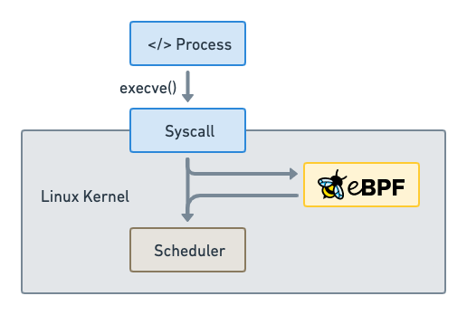

# eBPF

# 目录

# What is eBPF?

## 什么是 eBPF？

>   #### 是什么

>   eBPF 是一项革命性技术，起源于 Linux 内核，可以在特权上下文（例如操作系统内核）中运行沙盒程序，应用程序开发人员可以运行 eBPF  程序以在运行时向操作系统添加其他功能。
>   它用于安全有效地扩展内核的功能，而无需更改内核源代码或加载内核模块。

>   #### 为什么需要

>   操作系统的一些特点：
>
>   -   由于内核具有监督和控制整个系统的特权能力，操作系统一直是**实现可观察性、安全性和网络功能的理想场所**
>   -   但操作系统内核由于其核心地位，**对稳定性和安全性要求较高，演化难度较大**。因此，与外部实现的功能相比，**操作系统级别的创新率传统上较低**
>
>   **而eBPF 从根本上改变了这个公式**

>   #### 使用逻辑


图的文本结构化*：

-   用例
    -   现代网络、安全、可观察性和追踪

-   用户空间
    -   Projects：BCC (包括 python Go C Lua)、cilium、Faico、Katran、PIXIE
    -   SDKs：bcc、bpftrace、GO、C++、Rust
-   核心：核心运行时
    -   检验器 & 运行时编译
    -   映射表
    -   核心帮助API
    -   Linux、Windows 系统运行时

>   #### 用例

如今，eBPF  被广泛用于驱动各种用例：

-   在现代数据中心和云原生环境中提供高性能网络和负载平衡，以低开销提取细粒度的安全可观察性数据
-   帮助应用程序开发人员跟踪应用程序，提供性能故障排除、预防性应用程序和容器运行时安全实施等方面的见解、

可能性是无限的，eBPF 所释放的创新才刚刚开始。

>   #### 什么是 eBPF.io？
>

eBPF.io 是每个人就 eBPF 主题进行学习和协作的地方。 eBPF是一个开放的社区，每个人都可以参与和分享。无论您是想阅读 eBPF  的初步介绍、查找进一步的阅读材料，还是迈出成为主要 eBPF 项目贡献者的第一步，eBPF.io 都将一路为您提供帮助。

>   #### eBPF 和 BPF 代表什么？
>

BPF 最初代表伯克利数据包过滤器，但现在 eBPF（扩展 BPF）可以做的不仅仅是数据包过滤，这个缩写词不再有意义。eBPF  现在被认为是一个独立的术语，不代表任何东西。

在 Linux 源代码中，术语 BPF 仍然存在，并且在工具和文档中，术语 BPF 和 eBPF  通常可以互换使用。最初的BPF有时被称为cBPF（经典BPF）以区别于eBPF。

>   #### 蜜蜂叫什么名字？
>

蜜蜂是 eBPF 的官方标志，最初由 Vadim Shchekoldin 创建。在第一届 eBPF 峰会上进行了投票，这只蜜蜂被命名为 eBee。 
（有关徽标可接受用途的详细信息，请参阅 Linux 基金会品牌指南。）

## eBPF简介

以下章节是对 eBPF 的快速介绍。如果您想了解有关 eBPF 的更多信息，请参阅 eBPF 和 XDP 参考指南。无论您是希望构建 eBPF 程序的开发人员，还是有兴趣利用使用 eBPF 的解决方案，了解基本概念和架构都非常有用。

### 钩子概述

eBPF 程序是**事件驱动**的，当内核或应用程序通过某个挂钩点时运行。预定义的挂钩包括系统调用、函数入口/出口、内核跟踪点、网络事件等。


如果不存在满足特定需求的预定义挂钩，则可以创建 `内核探针 (kprobe)` 或 `用户探针 (uprobe)` 来将 eBPF 程序附加到**内核或用户应用程序中的几乎任何位置**


### eBPF程序是如何编写的？

两种方式：（更详细的分类和说明见 [[##开发工具链]]）

-   **在很多场景中，eBPF 并不直接使用，而是通过 Cilium、bcc 或 bpftrace 等项目间接使用**。

    这些项目在 eBPF 之上提供抽象，不需要直接编写程序，而是提供指定基于意图的定义的能力，这些定义是然后用eBPF实现。

-   **但如果不存在更高级别的抽象，则需要直接编写程序**。

    Linux 内核期望 eBPF 程序以字节码的形式加载。虽然直接编写字节码当然是可能的，但更常见的开发实践是利用 LLVM 等编译器套件将伪 C 代码编译为 eBPF 字节码。

    

### 加载器和验证架构

当识别出所需的钩子后，可以使用 bpf 系统调用将 eBPF 程序加载到 Linux 内核中。这通常是使用可用的 eBPF 库之一来完成的。
下一节将介绍可用的开发工具链。


当程序加载到 Linux 内核中时，它在附加到请求的钩子之前要经过两个步骤：

#### 验证器

验证步骤确保 eBPF 程序可以安全运行。它验证程序是否满足多个条件，例如：

-   加载 eBPF 程序的进程拥有所需的能力（特权）。除非启用非特权 eBPF，否则只有特权进程才能加载 eBPF 程序。
-   该程序不会崩溃或以其他方式损害系统。
-   程序总是运行到完成（即程序不会永远处于循环中，从而阻止进一步的处理）。

#### 即时编译

即时 (JIT) 编译步骤将程序的通用字节码转换为机器特定的指令集，以优化程序的执行速度。
这使得 eBPF 程序的运行效率与本机编译的内核代码或作为内核模块加载的代码一样高效。

### eBPF 映射

eBPF 程序的一个重要方面是共享收集的信息和存储状态的能力。为此，eBPF 程序可以利用 eBPF 映射的概念来存储和检索各种数据结构中的数据。 eBPF 映射可以通过系统调用从 eBPF 程序以及用户空间中的应用程序访问。


以下是支持的映射类型的不完整列表，以帮助您了解数据结构的多样性。对于各种地图类型，可以使用共享版本和每个 CPU 版本。

-   Hash tables, Arrays
    哈希表、数组
-   LRU (Least Recently Used)
    LRU (最近最少使用)
-   Ring Buffer
    环形缓冲器
-   Stack Trace
    堆栈跟踪
-   LPM (Longest Prefix match)
    LPM (最长前缀匹配)
-   ...

### 助手调用

eBPF 程序无法调用任意内核函数。允许这样做会将 eBPF 程序绑定到特定的内核版本，并使程序的兼容性变得复杂。相反，eBPF 程序可以对辅助函数进行函数调用，辅助函数是内核提供的众所周知且稳定的 API。


可用的助手调用集在不断发展。可用助手调用的示例：

-   生成随机数
-   获取当前时间和日期
-   eBPF 地图访问
-   获取进程/cgroup 上下文
-   操纵网络数据包和转发逻辑

### 尾部和函数调用

eBPF 程序可以通过尾部和函数调用的概念进行组合。函数调用允许在 eBPF 程序中定义和调用函数。尾部调用可以调用并执行另一个 eBPF 程序并替换执行上下文，类似于常规进程的 execve() 系统调用的操作方式。


### eBPF安全

>   *With great power there must also come great responsibility.
>   权力越大，责任也越大。*

eBPF 是一项极其强大的技术，现在运行在许多关键软件基础设施组件的核心。在eBPF的开发过程中，当考虑将eBPF纳入Linux内核时，eBPF的安全性是最重要的方面。 eBPF 的安全性通过多个层面来确保：

#### 所需权限

除非启用非特权 eBPF，否则所有打算将 eBPF 程序加载到 Linux 内核中的进程都必须在特权模式（root）下运行，或者需要 CAP_BPF 功能。这意味着不受信任的程序无法加载 eBPF 程序。

如果启用非特权 eBPF，非特权进程可以加载某些 eBPF 程序，但功能集会减少，并且对内核的访问受到限制。

#### Verifier 验证器

如果允许进程加载eBPF程序，则所有程序仍然通过eBPF验证器。 eBPF验证器保证了程序本身的安全。这意味着，例如：

-   程序经过验证以确保它们始终运行完成，例如eBPF 程序可能永远不会阻塞或永远处于循环中。 eBPF 程序可能包含所谓的有界循环，但只有当验证者可以确保循环包含保证为真的退出条件时，该程序才会被接受。
-   程序不得使用任何未初始化的变量或越界访问内存。
-   程序必须符合系统的大小要求。不可能加载任意大的 eBPF 程序。
-   程序必须具有有限的复杂性。验证者将评估所有可能的执行路径，并且必须能够在配置的复杂性上限范围内完成分析。

验证器是一种安全工具，用于检查程序是否可以安全运行。它不是检查程序正在做什么的安全工具。

#### Hardening

成功完成验证后，eBPF 程序将根据程序是从特权进程还是非特权进程加载来运行强化过程。该步骤包括：

-   **程序执行保护**

    保存 eBPF 程序的内核内存受到保护并变为只读。如果由于任何原因，无论是内核错误还是恶意操纵，试图修改 eBPF 程序，内核将崩溃，而不是允许它继续执行损坏/操纵的程序。

-   **针对 Spectre 的缓解措施**

    据推测，CPU 可能会错误预测分支并留下可通过侧通道提取的可观察到的副作用。举几个例子：eBPF  程序屏蔽内存访问，以便将瞬态指令下的访问重定向到受控区域，验证器还遵循仅在推测执行下可访问的程序路径，并且 JIT  编译器在尾调用无法转换为直接调用的情况下发出 Retpolines 。

-   **常量致盲**

    代码中的所有常量都被致盲，以防止 JIT 喷射攻击。这可以防止攻击者将可执行代码作为常量注入，在存在另一个内核错误的情况下，可能允许攻击者跳转到 eBPF 程序的内存部分来执行代码。

#### 抽象运行时上下文

eBPF 程序无法直接访问任意内核内存。对程序上下文之外的数据和数据结构的访问必须通过 eBPF  助手进行访问。这保证了数据访问的一致性，并使任何此类访问都受到 eBPF  程序特权的约束。

例如运行中的eBPF程序在保证安全的情况下，可以修改某些数据结构的数据。 eBPF 程序不能随机修改内核中的数据结构。

## 为什么选择eBPF？

### 可编程性的力量

让我们从一个类比开始。你还记得地球城吗？ 20 年前，网页几乎都是用静态标记语言 (HTML)  编写的。网页基本上是一个带有能够显示它的应用程序（浏览器）的文档。看看今天的网页，网页已经成为成熟的应用程序，基于网络的技术已经取代了绝大多数用需要编译的语言编写的应用程序。是什么促成了这种演变？


简而言之，就是通过引入 JavaScript 实现可编程性。它开启了一场巨大的革命，导致浏览器演变成几乎独立的操作系统。

为什么会发生进化？程序员不再受制于运行特定浏览器版本的用户。必要的构建块的可用性并没有让标准机构相信需要新的 HTML 标签，而是将底层浏览器的创新步伐与顶部运行的应用程序脱钩。这当然有点过于简单化了，因为 HTML  确实随着时间的推移而发展并为成功做出了贡献，但 HTML 本身的发展还不够。

在使用这个示例并将其应用到 eBPF 之前，让我们先看一下在介绍 JavaScript 时至关重要的几个关键方面：

-   **安全**：不受信任的代码在用户的浏览器中运行。这是通过对 JavaScript 程序进行沙箱处理并抽象对浏览器数据的访问来解决的。
-   **持续交付**：程序逻辑的演变必须是可能的，而无需不断发布新的浏览器版本。这是通过提供足以构建任意逻辑的正确低级构建块来解决的。
-   **性能**：必须以最小的开销提供可编程性。通过引入即时 (JIT) 编译器解决了这个问题

对于上述所有内容，出于同样的原因，可以在 eBPF 中找到精确的对应项

### eBPF对Linux内核的影响

现在让我们回到 eBPF。为了了解 eBPF 对 Linux 内核的可编程性影响，有助于对 Linux 内核的架构以及它如何与应用程序和硬件交互有一个高层次的了解


>   这图好像前面出现过，前面说这图时是说哪里可以设置钩子
>
>   

**Linux内核的主要目的是抽象硬件或虚拟硬件并提供一致的API（系统调用）**，允许应用程序运行和共享资源。

为了实现这一目标，需要维护大量的子系统和层来分配这些职责。每个子系统通常允许某种级别的配置来满足用户的不同需求。

如果无法配置所需的行为，则需要更改内核，从历史上看有两个选项，而eBPF提供了第三个选项：

-   Native Support 原生支持
    1.  更改内核源代码并说服 Linux 内核社区需要进行更改。

    2.  等待数年新内核版本才能成为商品。

-   Kernel Module 内核模块
    1.  编写内核模块
    2.  定期修复它，因为每个内核版本都可能会破坏它
    3.  由于缺乏安全边界而存在损坏 Linux 内核的风险

-   eBPF (新)

    -   允许对 Linux 内核的行为进行重新编程，而无需更改内核源代码或加载内核模块。

        在许多方面，这与 JavaScript 和其他脚本语言如何解锁已经变得难以或昂贵的系统的演变非常相似。


## 开发工具链

存在多个开发工具链来协助 eBPF 程序的开发和管理。它们都满足用户的不同需求：

### iovisor/BCC (python go lua cpp)

BCC 是一个框架，使用户能够编写嵌入了 eBPF 程序的 python 程序。

该框架主要针对涉及应用程序和系统分析/跟踪的用例，其中 eBPF  程序用于收集统计数据或生成事件，而用户空间中的对应程序则收集数据并以人类可读的形式显示数据。运行python程序将生成eBPF字节码并将其加载到内核中。


### iovisor/bpftrace

这个bpftrace和BCC的仓库作者都是iovisor

**bpftrace 是一种适用于 Linux eBPF 的高级跟踪语言** (一种专用的语言)，可在半新的 Linux 内核 (4.x) 中使用。bpftrace 语言受到 awk、C 和前身跟踪器（例如 DTrace 和 SystemTap）的启发。

bpftrace 使用 **LLVM**  作为后端将脚本编译为 eBPF 字节码，并利用 BCC 与 Linux eBPF 子系统以及现有的 Linux 跟踪功能进行交互：`内核动态跟踪  (kprobes)`、`用户级动态跟踪 (uprobes)` 和跟踪点。 


### eBPF Go 库

eBPF Go 库提供了一个通用的 eBPF 库，它将获取 eBPF 字节码的过程与 eBPF 程序的加载和管理解耦。 eBPF 程序通常是通过编写更高级的语言来创建的，然后使用 clang/LLVM 编译器编译为 eBPF 字节码。


### libbpf C/C++ 库

**libbpf** 库是一个基于 C/C++ 的通用 eBPF 库，有助于将 clang/LLVM 编译器生成的 eBPF 目标文件加载解耦到内核中，并通过提供易于使用的库 API 来抽象与 BPF 系统调用的交互应用程序。


### 其他

话说前面那图里显示的好像不止这几种。有：

-   Projects：BCC、cilium、Faico、Katran、PIXIE
-   SDKs：bcc、bpftrace、GO、C++、Rust?


## 进一步阅读

详细见收集资料的笔记（README.md）

# Lab补充

## 介绍

### 了解 eBPF

BPF 是一项起源于 Linux 内核的革命性技术，可以在操作系统内核中运行沙盒程序。它用于安全有效地扩展内核的功能，而无需更改内核源代码或加载内核模块。

### 内核的 JavaScript

eBPF 是一种内核技术，允许在运行时动态扩展 Linux 内核的功能。

您可以将其视为 JavaScript 之于 Web 浏览器：JavaScript 允许您将回调附加到 DOM 中的事件，以便为您的网页带来动态功能。以类似的方式，eBPF 允许挂钩内核事件并在触发这些事件时扩展其逻辑！



例如，当一个进程创建一个新进程时，它会调用 `execve` 系统调用，这通常会导致在内核中调度新进程的执行。使用 eBPF，您可以将程序附加到该事件并使用它对其进行操作，例如用于可观察性。

### 可观察性示例

在前面的示例中，我们可以将以下 eBPF 代码附加到 `execve` 挂钩：

```c
int syscall__ret_execve(struct pt_regs *ctx)
{
    struct comm_event event = {
		.pid = bpf_get_current_pid_tgid() >> 32,
		.type = TYPE_RETURN,
    };
	bpf_get_current_comm(&event.comm, sizeof(event.comm));
	comm_events.perf_submit(ctx, &event，sizeof(event));
	return 0;
}
```

这将允许观察计划的进程并将命令的 PID 存储到结构中（在本例中为性能缓冲区），稍后可以由用户空间程序检索该结构以用于可观察性目的（JSON 流、指标等）。

### 验证和 JIT 编译

为什么 eBPF 比现有的扩展内核（例如内核模块）的解决方案更好？除了它允许采用事件驱动的方法进行内核开发之外，它本质上也更加安全。

这是因为 eBPF 程序在注入内核时会被验证。


第一步之后，eBPF 代码可以被 JIT 编译为机器代码，然后附加到内核挂钩和 eBPF 映射。当这些钩子被事件触发时，代码就会被执行。

### 您将在本课程中做什么

为了获得 eBPF 的第一手经验，在本实验中我们将：

-   构建并使用 `opensnoop` ，这是一个基于 eBPF 的工具，每当打开文件时都会报告
-   使用 `readelf` 将 BPF 目标文件与其源代码进行比较
-   使用 `bpftool` 查看您的工具如何加载到内核中
-   在源代码中添加额外的“hello world”式跟踪
-   再次构建并运行它以查看您自己的自定义 eBPF 跟踪 我们使用的示例工具 `opensnoop` 是 BCC 项目中基于 eBPF 的工具集合之一。

### 有关 eBPF 的更多信息

如前所述，如果您想更深入地了解 eBPF：请获取 Liz Rice 所著的《What is eBPF》一书，其中更详细地描述了此 `opensnoop` 示例中发生的情况，并查看 eBPF.io。

## 实操

见 “Try the Lab” 笔记


