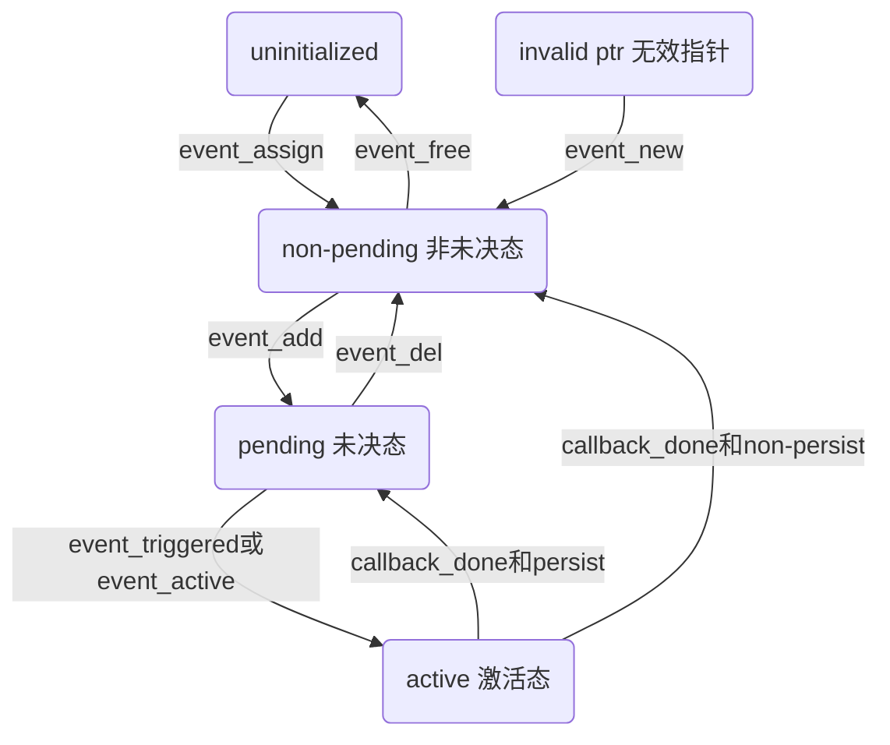

## 事件触发流程

参考：[【B站】【阶段四：Linux高并发服务器开发】2-5 libevent](https://www.bilibili.com/video/BV1jV4y1H7nj)



其中
- 非未决态：是还没有开始监听的意思
- 未决态：还没有被触发
- 激活态：被触发了

结合代码：

```cpp
struct event_base* event_base_new(void); // 创建树根节点
event_new(); // 初始化上树节点
event_add(); // 上树监听
int event_base_dispatch(struct event_base* base); // 循环监听
```

