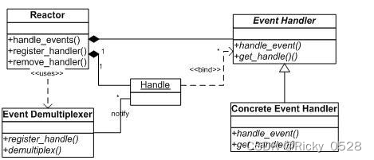
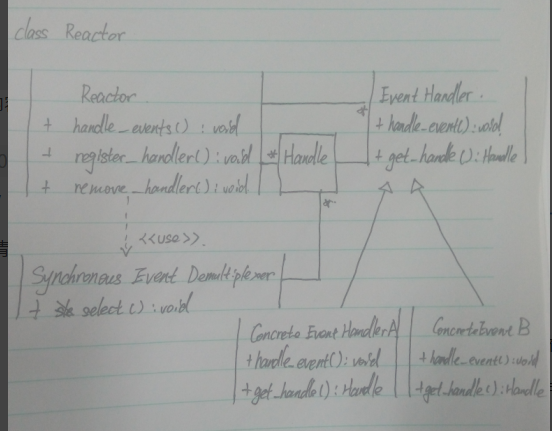
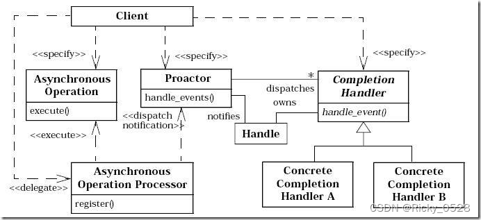
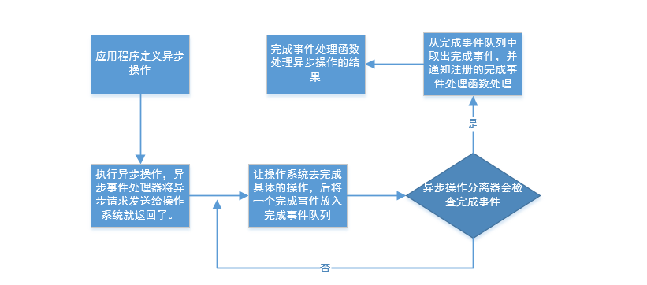
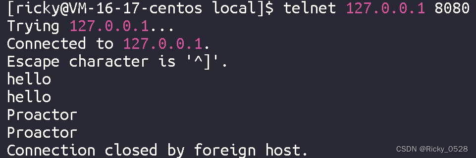

# Reactor vs Proactor模式

参考：

- [boost asio学习笔记1--Reactor与Proactor模式](https://blog.csdn.net/u013246898/article/details/52044091)
- [【网络进阶】服务器模型Reactor与Proactor](https://blog.csdn.net/weixin_52665939/article/details/130404067)

## 概要

### 两种模式

boost asio（异步输入输出）
为什么会想学习asio，起初是想了解c++的网络编程，接着去深入的了解有没有什么实用的网络库，现在网上比较流行的就是ACE， libevent和boost.asio。开始的时候去了解一下ACE，但是明显感觉这是一个重量级的网络通信库，其中有较多的设计模式。相比较而言，libevent和boost.asio相对轻量级一点。

- libevent是基于Reactor（反应器模式）
- boost.asio是基于Proactor（主动器模式）

### 核心思想与原理

在高并发编程和网络连接的消息处理中，通常可分为两个阶段：

- 等待消息就绪
- 消息处理

这两个阶段是否合并，在两种情况：

- **阻塞套接字**：这是默认的处理方式，例如**每个线程专门处理一个连接**。此时**这两个阶段是合并的**。
  因此，处理套接字的线程需要等待消息就绪，这在高并发场景下导致线程频繁地休眠和唤醒，从而影响 CPU 使用效率。

- 为提高高并发编程效率，可将等待消息就绪和消息处理**两个阶段分开**。换言之，等待消息就绪的代码段与处理消息的代码段应分离。

  这就是**非阻套接字**。这要求套接字必须为非阻塞，否则处理消息的代码段可能导致线程在条件不满足时进入等待状态。实现等待消息就绪阶段的方法是线程主动查询，或让单个线程等待所有连接。

  这就引入了 **I/O 多路复用技术**，它可以同时处理多个连接，尽管仍可能需要等待并导致线程休眠，但由于它可以监控所有连接，所以当线程被唤醒时，必定有一些连接已准备好进行处理。

高性能服务器程序通常需要处理三类事件：

- I/O 事件
- 定时事件
- 信号

为实现高效的事件处理，有两种主要模型。这两种模型分别采用不同的策略来解决等待消息就绪和消息处理阶段的问题，以提高服务器在高并发环境下的性能表现：

- Reactor
- Proactor

## Reactor（反应器模式）

### 特点

- 流程
  - 
- 特点
  - 具体的处理程序不调用反应器，而是由反应器通知处理程序处理就绪的事件 
- 缺点
  - 不能支持大量的客户请求与耗时过长的请求，由于select串行化了所有的事件处理过程。
    （select是linux下的只用IO处理我应该会近期写一篇关于select的学习笔记）

### 实现细节

#### 原理：事件驱动、事件注册、事件分发

首先让我们回顾一下常规函数调用的机制：程序调用某个函数，函数执行，程序等待，然后函数将结果和控制权返回给程序，程序继续处理。
与此不同，**Reactor（反应堆）**是一种**事件驱动**的机制。它颠覆了传统的事件处理流程：应用程序不再主动调用某个 API 完成处理，而是将处理逻辑逆置。在这种模式下，应用程序需要提供相应的接口并将其注册到 Reactor 上。当相应的事件发生时，Reactor 会主动调用应用程序注册的接口，这些接口通常被称为**“回调函数”**。通过这种方式，Reactor 实现了事件驱动编程，提高了程序的响应速度和效率。



Reactor 模式是处理并发 I/O 的一种常见模式，适用于**同步 I/O**。其**核心思想**是**将所有待处理的 I/O 事件注册到一个中心 I/O 多路复用器上**，同时让主线程/进程在多路复用器上阻塞。当有 I/O 事件到来或准备就绪（如文件描述符或 socket 可读、写）时，多路复用器返回并将事先注册的相应 I/O **事件分发**到对应的处理器中。这样，Reactor 模式能够实现高效的并发 I/O 处理，提高程序在高并发环境下的性能表现。

#### 三大组件、处理流程

Reactor模型有三个重要的组件：

- Reactor，反射器，核心组件

  负责管理**事件循环和I/O事件分发**。它接收客户端连接，监听I/O事件，并将这些事件分发给相应的事件处理器。Reactor可以是单线程或多线程的，根据具体应用场景和性能要求进行选择。

- Handlers，事件处理器

  是用于处理特定I/O事件的对象。每个处理器通常对应一个客户端连接或一个资源（如文件、套接字等）。处理器负责处理与它们关联的事件，如读取数据、处理业务逻辑、发送响应等。处理器可以是**同步或异步**的，取决于具体的实现方式。

- Demultiplexer，事件分离器

  负责从操作系统中获取I/O事件，并将这些事件传递给Reactor。常见的事件分离器**实现方式有 select, poll, epoll, kqueue 等**。事件分离器使Reactor能够同时处理多个I/O事件，从而实现高并发性能。


1. Reactor 接收客户端连接，将连接的相关I/O事件注册到事件分离器（Demultiplexer）上。同时，Reactor 将事件处理器（Handlers）与这些I/O事件关联起来。
2. 事件分离器（Demultiplexer）负责检测并收集操作系统中发生的I/O事件。当有I/O事件发生时，事件分离器将这些事件通知Reactor。
3. Reactor 将收到的I/O事件与之前注册的事件处理器（Handlers）进行匹配。找到匹配的处理器后，Reactor 将事件分发给相应的处理器。
4. 事件处理器（Handlers）收到分发的I/O事件后，执行相应的操作，如读取数据、处理业务逻辑、发送响应等。
5. 事件处理完成后，Reactor 可以根据需要更新处理器与I/O事件之间的关联，以便继续处理后续事件。

#### 具体类图



### 总结，优缺点

- 高并发性能：Reactor模式通过事件驱动的方式实现了高并发性能。事件分离器可以同时检测多个I/O事件，Reactor可以根据事件分离器的通知并行处理多个I/O事件，从而提高服务器的并发处理能力。
- 良好的可扩展性：Reactor模式可以通过增加线程数量或使用多个Reactor实例来提高系统的可扩展性。在多核处理器环境下，可以利用多线程Reactor模式有效地分摊负载，进一步提高系统性能。
- 资源利用率高：Reactor模式中，事件处理器只在有I/O事件发生时才执行操作。这样可以避免无效的轮询和资源浪费，提高系统资源的利用率。
- 易于管理和维护：Reactor模式将事件处理器和I/O事件分离，使得事件处理逻辑更加清晰和易于管理。此外，Reactor模式还可以实现处理器的动态注册和注销，便于系统的维护和扩展。
- 可适应不同场景：Reactor模式可以根据不同的应用场景和性能要求进行定制。例如，可以选择单线程或多线程Reactor，同步或异步处理器等，以满足特定应用的需求。

Reactor 模型在开发效率方面相较于直接使用 IO 复用有所提高。该模型通常采用单线程设计，目标是让单线程充分利用一颗 CPU 的全部资源。同时，它还带有一个优点，即在处理事件时，很多情况下无需考虑共享资源的互斥访问问题。然而，这个模型也存在明显的缺点。随着硬件的发展，摩尔定律不再适用，CPU 频率由于材料限制无法继续大幅提升，因此提升性能主要依赖于增加核数。在需要利用多核资源的程序中，Reactor 模型的表现可能会受到影响。

对于业务较简单的程序，如仅需访问提供并发访问的服务，可以直接启用多个反应堆，每个反应堆对应一颗 CPU 核心。在这种情况下，运行在各个反应堆上的请求互不相关，从而充分利用多核资源。例如，Nginx 这类的 HTTP 静态服务器就采用了这种策略。

### 代码示例

在C++里使用Reactor模型实现的TCP回显服务器：

需要系统支持epoll，并且编译器支持C++11

```cpp
#include <iostream>
#include <cstdlib>
#include <cstring>
#include <cstdio>
#include <vector>
#include <map>
#include <unistd.h>
#include <sys/epoll.h>
#include <arpa/inet.h>
#include <fcntl.h>
#include <netinet/in.h>
#include <sys/socket.h>

#define MAX_EVENTS 10

class Reactor {
public:
    Reactor() {
        _epoll_fd = epoll_create1(0);
        if (_epoll_fd == -1) {
            perror("epoll_create1");
            exit(EXIT_FAILURE);
        }
    }

    ~Reactor() {
        close(_epoll_fd);
    }

    void add_fd(int fd, uint32_t events) {
        struct epoll_event event;
        event.data.fd = fd;
        event.events = events;
        if (epoll_ctl(_epoll_fd, EPOLL_CTL_ADD, fd, &event) == -1) {
            perror("epoll_ctl");
            exit(EXIT_FAILURE);
        }
    }

    void del_fd(int fd) {
        if (epoll_ctl(_epoll_fd, EPOLL_CTL_DEL, fd, nullptr) == -1) {
            perror("epoll_ctl");
            exit(EXIT_FAILURE);
        }
    }

    void run() {
        std::vector<struct epoll_event> events(MAX_EVENTS);
        while (true) {
            int n = epoll_wait(_epoll_fd, events.data(), MAX_EVENTS, -1);
            if (n == -1) {
                perror("epoll_wait");
                exit(EXIT_FAILURE);
            }

            for (int i = 0; i < n; i++) {
                if (events[i].events & EPOLLIN) {
                    handle_input(events[i].data.fd);
                } else if (events[i].events & EPOLLOUT) {
                    handle_output(events[i].data.fd);
                }
            }
        }
    }

    virtual void handle_input(int fd) = 0;
    virtual void handle_output(int fd) = 0;

private:
    int _epoll_fd;
};

class EchoReactor : public Reactor {
public:
    EchoReactor(int listen_fd) : _listen_fd(listen_fd) {
        add_fd(_listen_fd, EPOLLIN);
    }

    void handle_input(int fd) override {
    if (fd == _listen_fd) {
        struct sockaddr_in addr;
        socklen_t addrlen = sizeof(addr);
        int conn_fd = accept(_listen_fd, (struct sockaddr *)&addr, &addrlen);
        if (conn_fd == -1) {
            perror("accept");
            exit(EXIT_FAILURE);
        }

        make_socket_non_blocking(conn_fd);
        add_fd(conn_fd, EPOLLIN);
    } else {
        char buf[1024];
        ssize_t n = read(fd, buf, sizeof(buf));
        if (n <= 0) {
            if (n < 0) perror("read");
            close(fd);
            del_fd(fd);
        } else {
            _out_buffers[fd] = std::string(buf, n);
            del_fd(fd);
            add_fd(fd, EPOLLOUT);
        }
    }
}

void handle_output(int fd) override {
    auto it = _out_buffers.find(fd);
    if (it != _out_buffers.end()) {
        ssize_t n = write(fd, it->second.c_str(), it->second.size());
        if (n <= 0) {
            if (n < 0) perror("write");
            close(fd);
            del_fd(fd);
        } else {
            it->second.erase(0, n);
            if (it->second.empty()) {
                del_fd(fd);
                add_fd(fd, EPOLLIN);
            }
        }
    }
}

private:
    int make_socket_non_blocking(int sfd) {
        int flags = fcntl(sfd, F_GETFL, 0);
        if (flags == -1) {
            perror("fcntl");
            return -1;
        }

        flags |= O_NONBLOCK;
        if (fcntl(sfd, F_SETFL, flags) == -1) {
            perror("fcntl");
            return -1;
        }

        return 0;
    }

    int _listen_fd;
    std::map<int, std::string> _out_buffers;
};

int main(int argc, char *argv[]) {
    if (argc != 2) {
        std::cerr << "Usage: " << argv[0] << " <port>" << std::endl;
        exit(EXIT_FAILURE);
    }

    int port = std::stoi(argv[1]);

    int listen_fd = socket(AF_INET, SOCK_STREAM, 0);
    if (listen_fd == -1) {
        perror("socket");
        exit(EXIT_FAILURE);
    }

    int optval = 1;
    if (setsockopt(listen_fd, SOL_SOCKET, SO_REUSEADDR, &optval, sizeof(optval)) == -1) {
        perror("setsockopt");
        exit(EXIT_FAILURE);
    }

    struct sockaddr_in addr;
    addr.sin_family = AF_INET;
    addr.sin_port = htons(port);
    addr.sin_addr.s_addr = INADDR_ANY;

    if (bind(listen_fd, (struct sockaddr *)&addr, sizeof(addr)) == -1) {
        perror("bind");
        exit(EXIT_FAILURE);
    }

    if (listen(listen_fd, SOMAXCONN) == -1) {
        perror("listen");
        exit(EXIT_FAILURE);
    }

    EchoReactor echo_reactor(listen_fd);
    echo_reactor.run();

    return 0;
}
```

使用telnet测试：


## Proactor（主动器模式） 

### 实现细节

#### 原理：事件驱动、改进点

与Reactor的区别：

- 在众多网络编程模型中，Reactor模型因其高并发性能、资源利用率高等优点而受到广泛关注。

  Reactor模型基于事件驱动的原理，通过Reactor、事件处理器（Handlers）和事件分离器（Demultiplexer）三个核心组件的协同作用，有效地处理大量并发连接和I/O操作。

  然而，在某些高负载场景下，Reactor模型可能会遇到事件处理**瓶颈**的问题，这使得我们需要寻求其他解决方案来进一步提升系统性能。

- Proactor模型正是在这种背景下应运而生的一种高性能网络编程模型。与Reactor模型类似，Proactor模型同样采用了**事件驱动**的方式，但在事件处理的**实现上有所不同**。

- Proactor模型将异步I/O操作与事件处理器相结合，使得I/O操作可以在后台执行，从而**进一步减少阻塞和提高系统性能**。在Proactor模型中，事件处理的主要责任由操作系统承担，而应用程序则专注于处理业务逻辑。这种分工使得Proactor模型能够更好地应对高负载场景，为构建高性能网络服务器提供了一种有力的解决方案。



#### 三大组件、处理流程

Proactor模型有三个重要的组件：

- Proactor，主动器，核心组件

  负责管理事件循环和I/O事件分发。它接收客户端连接，监听I/O事件，并将这些事件分发给相应的事件处理器。与Reactor模型相比，Proactor将大部分I/O操作的处理交给操作系统，从而进一步减少阻塞和提高系统性能。

- Asynchronous Handlers，异步事件处理器

  用于处理特定I/O事件的对象。每个处理器通常对应一个客户端连接或一个资源（如文件、套接字等）。与Reactor模型中的事件处理器不同，Proactor模型中的处理器通过异步I/O操作与事件处理相结合，使得I/O操作可以在后台执行，进一步提高系统性能。

- Asynchronous Operation Processor，异步操作处理器

  负责执行实际的异步I/O操作的组件。它与事件处理器协同工作，将I/O操作的执行与事件处理解耦，进一步减少阻塞和提高系统性能。

- Completion Dispatcher，完成分发器

  负责在异步I/O操作完成后通知Proactor。当操作系统完成一个异步I/O操作时，它会将完成通知发送给Completion Dispatcher，而后者则将通知传递给Proactor。这样，Proactor可以将事件分发给相应的事件处理器，处理业务逻辑。


事件处理的具体流程：

1. Proactor 接收客户端连接，并将连接的相关I/O事件注册到异步事件处理器（Asynchronous Handlers）上。
2. 异步事件处理器（Asynchronous Handlers）启动异步I/O操作。此时，I/O操作的执行由异步操作处理器（Asynchronous Operation Processor）负责，与事件处理器解耦，使得I/O操作可以在后台执行。
3. 异步操作处理器（Asynchronous Operation Processor）与操作系统协同工作，执行实际的异步I/O操作。这样，事件处理器可以在等待I/O操作完成的过程中处理其他任务，进一步提高系统性能。
4. 当操作系统完成一个异步I/O操作时，它会将完成通知发送给完成分发器（Completion Dispatcher）。
5. 完成分发器（Completion Dispatcher）收到通知后，将通知传递给Proactor。此时，Proactor将事件分发给相应的异步事件处理器（Asynchronous Handlers）。
6. 异步事件处理器（Asynchronous Handlers）收到分发的I/O事件后，执行相应的操作，如读取数据、处理业务逻辑、发送响应等。

从上述处理流程中，我们可以发现 Proactor 模型的最大特点是采用异步 I/O。所有的 I/O 操作都由系统提供的异步 I/O 接口执行，工作线程仅负责处理业务逻辑。在 Proactor 模型中，用户函数启动一个异步文件操作并将其注册到多路复用器上。多路复用器关注的是异步读操作是否完成，而不是文件是否可读或可写。异步操作由操作系统完成，用户程序无需关心。当操作系统完成读文件操作，即将数据复制到用户先前提供的缓冲区后，便通知多路复用器相关操作已完成。多路复用器随后调用相应的处理程序处理数据。

#### 比较

尽管 Proactor 增加了**编程的复杂度**，但它提高了**工作线程的效率**。Proactor 可在系统态优化读写操作，利用 I/O 并行能力，从而实现**高性能单线程模型**。

#### 具体类图

- 流程
  - 
- 类图
  - 

### 代码示例

```cpp
#include <iostream>
#include <memory>
#include <utility>
#include <boost/asio.hpp>

using boost::asio::ip::tcp;

class session : public std::enable_shared_from_this<session> {
public:
    session(tcp::socket socket) : socket_(std::move(socket)) {}

    void start() { read(); }

private:
    void read() {
        auto self(shared_from_this());
        socket_.async_read_some(boost::asio::buffer(data_, max_length),
            [this, self](boost::system::error_code ec, std::size_t length) {
                if (!ec) {
                    write(length);
                }
            });
    }

    void write(std::size_t length) {
        auto self(shared_from_this());
        boost::asio::async_write(socket_, boost::asio::buffer(data_, length),
            [this, self](boost::system::error_code ec, std::size_t /*length*/) {
                if (!ec) {
                    read();
                }
            });
    }

    tcp::socket socket_;
    enum { max_length = 1024 };
    char data_[max_length];
};

class server {
public:
    server(boost::asio::io_context& io_context, short port)
        : acceptor_(io_context, tcp::endpoint(tcp::v4(), port)) {
        accept();
    }

private:
    void accept() {
        acceptor_.async_accept(
            [this](boost::system::error_code ec, tcp::socket socket) {
                if (!ec) {
                    std::make_shared<session>(std::move(socket))->start();
                }
                accept();
            });
    }

    tcp::acceptor acceptor_;
};

int main(int argc, char* argv[]) {
    try {
        if (argc != 2) {
            std::cerr << "Usage: echo_server <port>\n";
            return 1;
        }

        boost::asio::io_context io_context;
        server s(io_context, std::atoi(argv[1]));
        io_context.run();
    } catch (std::exception& e) {
        std::cerr << "Exception: " << e.what() << "\n";
    }

    return 0;
}
```

使用telnet测试：



## ==多平台实现==

### Reactor模拟Proactor

- 在 Windows 上，由于缺乏类似 epoll 的机制，因此采用 **IOCP** 支持高并发。由于操作系统进行了良好的优化，Windows 更常使用**基于完成端口的 Proactor 模型**实现服务器。
- 而在 Linux 上，虽然 2.6 内核引入了 aio 接口，但实际效果并不理想。aio 的出现主要是为了解决 poll 性能不佳的问题，但实际测试表明，**epoll** 的性能高于 poll+aio，且 aio 无法处理 accept。因此，Linux 主要还是以 **Reactor 模型为主**。


在不使用操作系统提供的异步 I/O 接口的情况下，确实可以通过 **Reactor 模拟 Proactor**。区别在于：利用异步接口可以使用系统提供的读写并行能力，而在模拟情况下，这需要在用户态实现。

具体的做法包括以下步骤：

- 注册读事件（同时提供一段缓冲区）。
- 事件分离器等待可读事件。
- 事件到来时，激活分离器，分离器立即读取数据并写入缓冲区，然后调用事件处理器。
- 事件处理器处理数据，删除事件（需要再用异步接口注册）。


值得注意的是，Boost.asio 库采用的是 Proactor 模型。然而，在 Linux 平台上，Boost.asio 使用 epoll 实现的 **Reactor 来模拟 Proactor**，并额外开辟一个线程来完成读写调度。这种做法在一定程度上结合了两种模型的优势，实现了较高的性能和灵活性。

### 同步IO模拟Proactor模型

#### 处理流程


1. 主线程将 socket 上的读就绪事件注册到 epoll 内核事件表中。
2. 主线程调用 epoll_wait 等待 socket 上的数据可读事件。
3. 当 socket 上有数据可读时，epoll_wait 通知主线程。主线程循环读取 socket 上的数据，直到无更多数据可读，然后将读取到的数据封装为请求对象并插入请求队列。
4. 在请求队列上等待的某个工作线程被唤醒，获取请求对象并处理客户请求，然后在 epoll 内核事件表中注册 socket 上的写就绪事件。
5. 主线程调用 epoll_wait 等待 socket 的可写事件。
6. 当 socket 可写时，epoll_wait 通知主线程。主线程将服务器处理客户请求的结果写入 socket。

两种模式的相同之处在于它们都涉及对某个 I/O 事件的通知（即通知某个模块，这个 I/O 操作可以进行或已经完成）。在结构上，两者也有共同点：demultiplexor 负责提交 I/O 操作（异步）、查询设备是否可操作（同步），当条件满足时，回调注册的处理函数。

它们的不同之处在于：在 Proactor（异步）情况下，回调注册的处理函数时，表示 I/O 操作已经完成；而在 Reactor（同步）情况下，回调注册的处理函数时，表示 I/O 设备可以进行某个操作（可读或可写），此时注册的处理函数开始提交操作。

#### 代码示例

在C++中，我们可以使用Boost.Asio库来使用步同步I/O模拟Proactor模型。以下是使用Boost.Asio实现Proactor模型的步骤：

    安装Boost库：首先，确保已经安装了Boost库，并将其包含在项目中。Boost.Asio是Boost库的一部分。
    包含所需的头文件：
    
    #include <boost/asio.hpp>
    #include <boost/bind.hpp>
    #include <iostream>
    #include <vector>
        1
        2
        3
        4
    
    创建异步回调函数：为了模拟Proactor模型，我们需要创建异步回调函数，该函数在异步操作完成时被调用。
    
    void handle_read(const boost::system::error_code& error, std::size_t bytes_transferred) {
        if (!error) {
            std::cout << "Read: " << bytes_transferred << " bytes" << std::endl;
        } else {
            std::cerr << "Error: " << error.message() << std::endl;
        }
    }
        1
        2
        3
        4
        5
        6
        7
    
    使用Boost.Asio创建异步操作：使用Boost.Asio创建一个异步读取操作，并将其与异步回调函数关联。
    
    boost::asio::io_context io_context;
    boost::asio::ip::tcp::socket socket(io_context);
    boost::asio::ip::tcp::endpoint endpoint(boost::asio::ip::address::from_string("127.0.0.1"), 8080);
    
    socket.async_connect(endpoint, boost::bind(&handle_read, boost::asio::placeholders::error, boost::asio::placeholders::bytes_transferred));
        1
        2
        3
        4
        5
    
    运行I/O上下文：运行I/O上下文以处理异步操作。
    
    io_context.run();
        1

完整的代码如下：

#include <boost/asio.hpp>
#include <boost/bind.hpp>
#include <iostream>
#include <vector>

void handle_read(const boost::system::error_code& error, std::size_t bytes_transferred) {
    if (!error) {
        std::cout << "Read: " << bytes_transferred << " bytes" << std::endl;
    } else {
        std::cerr << "Error: " << error.message() << std::endl;
    }
}

int main() {
    try {
        boost::asio::io_context io_context;
        boost::asio::ip::tcp::socket socket(io_context);
        boost::asio::ip::tcp::endpoint endpoint(boost::asio::ip::address::from_string("127.0.0.1"), 8080);

        socket.async_connect(endpoint, boost::bind(&handle_read, boost::asio::placeholders::error, boost::asio::placeholders::bytes_transferred));
    
        io_context.run();
    } catch (std::exception& e) {
        std::cerr << "Exception: " << e.what() << std::endl;
    }
    
    return 0;
}


测试使用的TCP服务器来接受上面客户端的连接：

#include <boost/asio.hpp>
#include <iostream>
#include <array>
#include <memory>

class session : public std::enable_shared_from_this<session> {
public:
    session(boost::asio::ip::tcp::socket socket) : socket_(std::move(socket)) {}

    void start() { read(); }

private:
    void read() {
        auto self(shared_from_this());
        socket_.async_read_some(boost::asio::buffer(data_),
                                [this, self](boost::system::error_code ec, std::size_t length) {
                                    if (!ec) {
                                        read();
                                    }
                                });
    }

    boost::asio::ip::tcp::socket socket_;
    std::array<char, 1024> data_;
};

class server {
public:
    server(boost::asio::io_context& io_context, short port)
        : acceptor_(io_context, boost::asio::ip::tcp::endpoint(boost::asio::ip::tcp::v4(), port)) {
        accept();
    }

private:
    void accept() {
        acceptor_.async_accept([this](boost::system::error_code ec, boost::asio::ip::tcp::socket socket) {
            if (!ec) {
                std::make_shared<session>(std::move(socket))->start();
            }

            accept();
        });
    }
    
    boost::asio::ip::tcp::acceptor acceptor_;
};

int main() {
    try {
        boost::asio::io_context io_context;
        server srv(io_context, 8080);
        io_context.run();
    } catch (std::exception& e) {
        std::cerr << "Exception: " << e.what() << std::endl;
    }

    return 0;
}


## 区别

- Reactor与Proactor区别：真正的操作（读写）是由谁来完成的
  - Reactor模式：需要应用程序自己读写数据
  - Proactor模式：应用程序不需要进行实际的读写操作，操作系统会读取或写入缓冲区到真正的IO设备，应用程序只需从缓冲区中读写即可。


## 补充

一个国内博客经常看到的误区：

很多国内博客会说Reactor是同步的，这其实并不准确。包括说Proactor是异步的也是。这其实取决于


