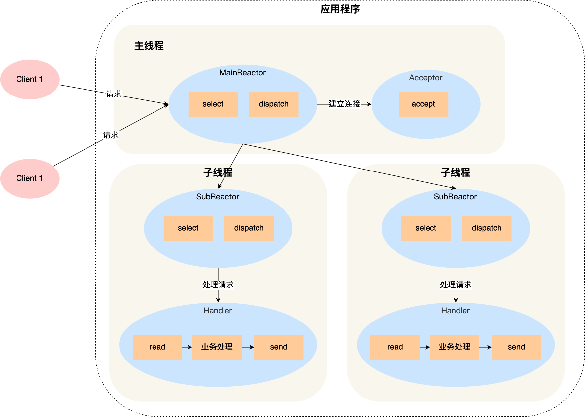
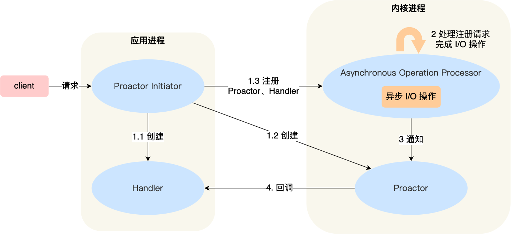

# Reactor vs Proactor模式1

参考：

- [【操作系统】高性能网络模式：Reactor 和 Proactor](https://blog.csdn.net/weixin_63566550/article/details/130479629)
  - [高性能 RPC 通信的实现- 巧用 reactor 模式](https://juejin.cn/post/7217267332658135100)
  - [高性能网络模式：Reactor 和 Proactor](https://www.xiaolincoding.com/os/8_network_system/reactor.html#_9-3-高性能网络模式-reactor-和-proactor)
  - [NIO Reactor模型 ](https://www.jianshu.com/p/38b56531565d)
  - [Netty「基石」之Reactor模式](https://juejin.cn/post/7177175166638620730)
  - [高性能IO模型分析-Reactor模式和Proactor模式](https://zhuanlan.zhihu.com/p/95662364)
  - [【操作系统】IO模型篇之从BIO、NIO、AIO到内核select、epoll剖析](https://blog.csdn.net/weixin_63566550/article/details/129904389)

需要先读：5种IO模型

前面的模型根据线程数、是否异步、是否阻塞 来区分。这里根据更抽象的设计模式，或更具体的做法来分类

大纲：

- Reactor模式
  - 单 Reactor 单进程/线程
  - 单 Reactor 多进程/线程
  - 多 Reactor 多进程/线程
- Proactor模式

## Reactor模式

`Reactor`设计模式是一种事件处理模式，用于同时有一个或多个请求发送到事件处理器（service handler），这个事件处理器会采用多路分离（demultiplexes ）的方式，同步的将这些请求分发到请求处理器（request handlers）。

相应的, 在传统BIO服务上的`Reactor`模型的基本形态如下图所示：

事实上，Reactor 模式也叫 `Dispatcher` 模式，我觉得这个名字更贴合该模式的含义，即 **I/O 多路复用监听事件，收到事件后，根据事件类型分配（Dispatch）给某个进程 / 线程**。

### [Reactor模式](https://so.csdn.net/so/search?q=Reactor模式&spm=1001.2101.3001.7020)思想：分而治之+事件驱动

Reactor 模式主要由 Reactor 和处理资源池这两个**核心组成部分**，它俩负责的事情如下：

- 事件驱动：Reactor 负责监听和分发事件，事件类型包含连接事件、读写事件；
- 分而治之：处理资源池负责处理事件，如 read -> 业务逻辑 -> send；

Reactor 模式是**灵活多变**的，可以应对不同的业务场景，灵活在于：

- Reactor 的数量可以只有一个，也可以有多个；
- 处理资源池可以是单个进程 / 线程，也可以是多个进程 /线程；

以下 **3 个方案**都是比较经典的，且都有应用在实际的项目中：

- 单 Reactor 单进程 / 线程；
- 单 Reactor 多线程 / 进程；
- 多 Reactor 多进程 / 线程；

方案具体使用**进程还是线程**，要看使用的编程语言以及平台有关：

- Java 语言一般使用线程，比如 Netty;
- C 语言使用进程和线程都可以，例如 Nginx 使用的是进程，Memcache 使用的是线程。

接下来，分别介绍这三个经典的 Reactor 方案。

### 单 Reactor 单进程 / 线程

### 单 Reactor 多线程 / 多进程

### 多 Reactor 多进程 / 线程

## Proactor模式

Proactor 正是采用了异步 I/O 技术，所以被称为异步网络模型。

## 区别

现在我们再来理解 Reactor 和 Proactor 的区别，就比较清晰了。

- 区别1

  - Reactor 是**非阻塞同步**网络模式，感知的是就绪可读写事件。在每次感知到有事件发生（比如可读就绪事件）后，就需要应用进程主动调用 read 方法来完成数据的读取，也就是要应用进程主动将 socket 接收缓存中的数据读到应用进程内存中，这个过程是同步的，读取完数据后应用进程才能处理数据。

  - Proactor 是**异步**网络模式， 感知的是已完成的读写事件。在发起异步读写请求时，需要传入数据缓冲区的地址（用来存放结果数据）等信息，这样系统内核才可以自动帮我们把数据的读写工作完成，这里的读写工作全程由操作系统来做，并不需要像 Reactor 那样还需要应用进程主动发起 read/write 来读写数据，操作系统完成读写工作后，就会通知应用进程直接处理数据。

- 区别2
  （这里的「事件」就是有新连接、有数据可读、有数据可写的这些 I/O 事件这里的「处理」包含从驱动读取到内核以及从内核读取到用户空间。）

  - Reactor 可以理解为「来了事件操作系统通知应用进程，让应用进程来处理」

  - Proactor 可以理解为「来了事件操作系统来处理，处理完再通知应用进程」

- 由例子说明区别

  - Reactor 模式就是快递员在楼下，给你打电话告诉你快递到你家小区了，你需要自己下楼来拿快递

  - Proactor 模式就是快递员直接将快递送到你家门口，然后通知你。

- 区别

  - Reactor 模式：基于「事件分发」，但基于「待完成」的 I/O 事件，

  - Proactor 模式：基于「事件分发」，但基于「已完成」的 I/O 事件。

