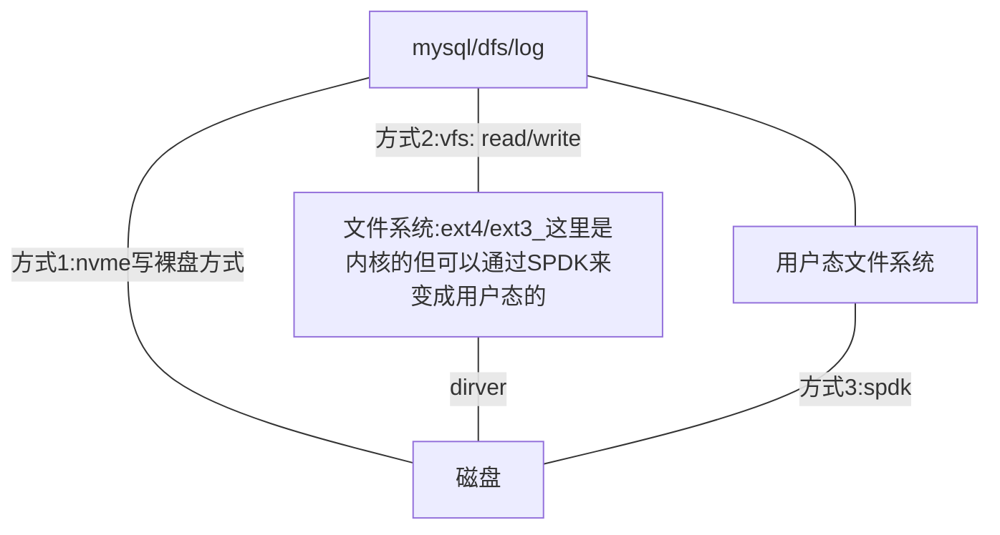

# 存储的三座大山，磁盘，内核文件系统 ，分布式文件系统

## 存储的三座大山

存储的三座大山：

- 磁盘
- 内核文件系统
- 以及分布式文件系统

### 三层结构与三种方式，三山夹两盆



（注脚：FS是FileSystem文件系统，VFS是VirtualFS虚拟文件系统，BIO即Buffer IO而不是Block IO）

### 根据数据结构进行优化

#### 读写模式

- 日志：写多读少
- 写作软件：读写一样
- Blog：读多写少

#### 数据组织结构

- 数组，字符。格式统一
- 存储 Blog，5000个字符
- 地图数据存储
- AIGC

## 三种裸盘读写方式

1. 应用层 NVME
2. 内核里面 读写NVME
3. SPDK

### 方式1：应用层 NVME（不使用文件系统，写裸盘）

#### 写demo

```c
#include <string.h>
#include <stdlib.h>
#include <stdio.h>
#include <unistd.h>
#include <fcntl.h>
#include <linux/nvme_ioctl.h>

int main() {
    // 打开fd
    int fd = open("/dev/nvme0n1", O_RDWR);
    if (fd<0) {
        return -1;
    }
    
    // 准备内存空间
    char* buffer = malloc(4096);
    if (!buffer) {
        perror("malloc\n");
        return -1;
    }
    memset(buffer, 0, 4096);
    
    // 准备参数
    struct nvme_user_io io;
    io.addr = (__u64)buffer;
    io.slba = 0;
    io.nblocks = 1;
    
    // 从buffer写入
    io.opcode = 1; // write
    strcpy(buffer, "ABCDEFGHIJKLMNOPQRSTUVWXYZ");
    if (-1 == ioctl(fd, NVME_IOCTL_SDUBMIT_IO, &io)) {
        perror("ioctl\n");
        close(fd);
        free(buffer);
    }
    printf("write successfully\n")
    
    // 写完后可以这样查看是否写入成功了：
    // 命令: cat /dev/nvme0n1
    // 输出: ABCDEFGHIJKLMNOPQRSTUVWXYZ
}
```

#### 读demo

```c
{
    // ...
    // 在前面main()里面的后面追加：
    memset(buffer, 0, 4096);
    
    // 读至buffer
    io.opcode = 2; // read
    if (-1 == ioctl(fd, NVME_IOCTL_SDUBMIT_IO, &io)) {
        perror("ioctl\n");
        close(fd);
        free(buffer);
    }
    printf("read successfully: %s\n", buffer)
}
```

### 方式2：内核方式

#### demo

```c
#include <linux/bio.h>
#include <linux/module.h>
#include <linux/blkdev.h>

// 内核里对 /dev/nvme0n1 进行读写
#define DISK_NAME "/dev/nvme0n1"
#define SECTOR_SIZE 4096

static int king_nvme_write(struct block_device* bdev, char* buffer, int length) {
    struct page* page;
    
    // 写
    struct bio* bio = bio_alloc(bdev, BIO_MAX_VECS, REQ_OP_WRITE, GFP_NOIO);
    if (!bio) {
        return -1;
    }
    bio->bi_iter.bi_sector = 0;
    // 分配页
    page = alooc_page(GFP_KERNEL);
    if (!page) {
        return -1;
    }
    
    memcpy(page_address(page), buffer, length);
    bio_add_page(bio, page, length, 0);
    submit_bio_wait(bio);
    __free_page();
	bio_put(bio);
    return 0;
}

static int king_nvme_read(struct block_device* bdev, char* buffer, int length) {
    struct page* page;
    
    // 读
    struct bio* bio = bio_alloc(bdev, BIO_MAX_VECS, REQ_OP_READ, GFP_NOIO);
    if (!bio) {
        return -1;
    }
    bio->bi_iter.bi_sector = 0;
    // 分配页
    page = alooc_page(GFP_KERNEL);
    if (!page) {
        return -1;
    }
    
    memcpy(page_address(page), buffer, length);
    bio_add_page(bio, virt_to_page(buffer), length, 0);
    submit_bio_wait(bio);
    __free_page();
	bio_put(bio);
    return 0;
}

// insmod kernel_nvme.ko
static int __init king_nvme_init(void) {
    printk("king_nvme_init\n");
    
    // 准备buffer
    char* buffer = kmalloc(SECTOR_SIZE, GFP_KERNEL);
    if (!buffer) {
        printk("kmalloc failed\n");
        return -1;
    }
    
    // 说一下这个数据结构。网卡叫 struct net_device, 磁盘叫 struct block_device
    struct block_device* bdev = NULL;
    bdev = blkdev_get_by_path("/dev/nvme0n1", FMOOD_READ | FMOOD_WRITE, NULL);
    if (IS_ERR(bdev)) {
        printk("blkev_get_by_path failed\n");
        return -1;
    }
    
    // 写入
    int ret = 0;
    strcpy(buffer, "KING ABCDEFGHIJKLMNOPQRSTUVWXYZ");
    ret = king_nvme_write(bdev, buffer, DISK_SECTOR_SIZE);
    printk("write successfully: %s\n", ret);
    
    // 读取
    memset(buffer, 0 , DISK_SECTOR_SIZE)
    ret = king_nvme_wead(bdev, buffer, DISK_SECTOR_SIZE);
    printk("read successfully: %s\n", ret);
    
    return 0;
}

// rmmod kernel_nvme.ko
static void __exit king_nvme_exit(void) {
    printk("king_nvme_exit\n");
}

module_init(king_nvme_init);
module_exit(king_nvme_exit);
MODULE_LICENSE("GPL");
    
// $ insmod kernel_nvme.ko	# 要先执行这个，才会进入init函数
// $ rmmod kernel_nvme.ko
// $ dmesg	# 查看日志打印，可以分别看到输出打印
// $ cat /dev/nvme0n1  # 查看是否写入成功
```

注脚：

```c
// 说一下这个数据结构。网卡叫 struct net_device, 磁盘叫 struct block_device
// 然后这里带k的是内核函数? 如printk，kmalloc。其中printk可以通过dmesg来查看输出日志
```

### 方式3：SPDK方式

#### 先从DPDK说起

捋一下一些相关概念

- DPDK：消除网卡->内核->用户态的两次拷贝变为一次拷贝，旁路接管网卡的

  ```mermaid
  graph TB
  app--posix api---
  内核网卡协议栈
  --dirver---
  网卡
  ```

- RDMA：一个网络协议，两个机器同步

- 内核网络

- eBpf：一种Hook技术


### 比较三种方式

三种方式都是裸盘读写方式，都可以去做文件系统


## 内核文件系统与 SPDK 文件系统

## 实现媲美 EXT4 读写的文件系统

## BIO 与 NVME 落盘