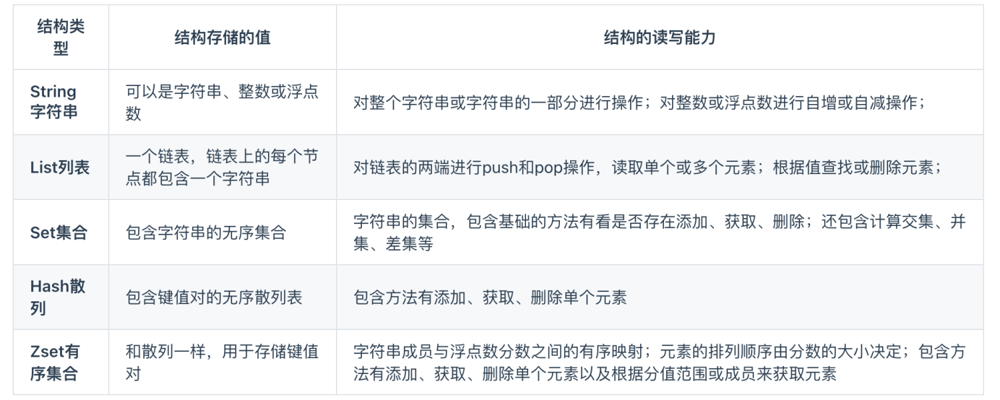
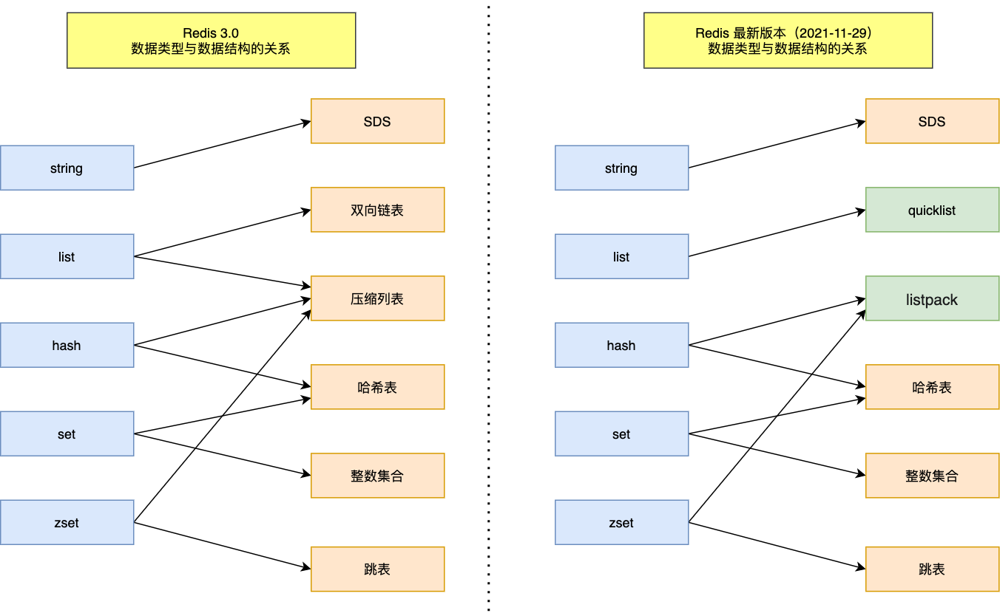

# Redis 数据结构

## Redis 数据结构

### 数据类型 (常见)

Redis 提供了丰富的数据类型，常见的有五种数据类型：**String（字符串），Hash（哈希），List（列表），Set（集合）、Zset（有序集合）**。

随着 Redis 版本的更新，后面又支持了四种数据类型： **BitMap（2.2 版新增）、HyperLogLog（2.8 版新增）、GEO（3.2 版新增）、Stream（5.0 版新增）**。 

### 数据类型 - 使用场景

Redis 前五种基本数据类型，后续版本又支持四种数据类型，它们的应用场景如下：

[table]

- < 基本数据类型 | 作用 | 使用场景
- String： 缓存对象、常规计数、分布式锁、共享 session 信息等
- List： 消息队列等。 （但是有两个问题：1. 生产者需要自行实现全局唯一 ID；2. 不能以消费组形式消费数据）
- Hash： 哈希。 比如缓存对象、购物车等
- Set： 聚合计算（并集、交集、差集）场景。 比如点赞、共同关注、抽奖活动等
- Zset： 排序场景。 比如排行榜、电话和姓名排序等
- BitMap：  (2.2 版新增)  **二值状态统计**的场景。 比如签到、判断用户登陆状态、连续签到用户总数等
- HyperLogLog： (2.8 版新增) 海量数据基数统计的场景。 比如百万级网页 UV 计数等
- GEO： (3.2 版新增) 存储地理位置信息的场景。 比如滴滴叫车
- Stream： (5.0 版新增) 消息队列。 相比于基于 List 类型实现的消息队列，有这两个特有的特性：自动生成全局唯一消息ID，支持以消费组形式消费数据

> [!note]
>
> TIP
>
> 想深入了解这 9 种数据类型，可以看这篇：[2万字 + 20 张图 ｜ 细说 Redis 常见数据类型和应用场景](https://xiaolincoding.com/redis/data_struct/command.html)

### 数据类型 - 底层的数据结构

这里仅介绍五种常见的数据类型的

我画了一张 Redis 数据类型和底层数据结构的对应关图。左边是 Redis 3.0版本的，也就是《Redis 设计与实现》这本书讲解的版本，现在看还是有点过时了。右边是现在 Redis 7.0 版本的。

> String 类型的底层数据结构：
>
> - **SDS（简单动态字符串）**：主要的数据结构
>
>  SDS 和我们认识的 C 字符串不太一样，之所以没有使用 C 语言的字符串表示，因为 SDS 相比于 C 的原生字符串：
>
> - *SDS 不仅可以保存文本数据，还可以保存二进制数据*。因为 SDS 使用 len 属性的值而不是空字符来判断字符串是否结束，并且 SDS 的所有 API 都会以处理二进制的方式来处理 SDS 存放在  buf[] 数组里的数据。所以 SDS 不光能存放文本数据，而且能保存图片、音频、视频、压缩文件这样的二进制数据。
> - *SDS 获取字符串长度的时间复杂度是 O(1)*。因为 C 语言的字符串并不记录自身长度，所以获取长度的复杂度为 O(n)；而 SDS 结构里用 len 属性记录了字符串长度，所以复杂度为 O(1)。
> - *Redis 的 SDS API 是安全的，拼接字符串不会造成缓冲区溢出*。因为 SDS 在拼接字符串之前会检查 SDS 空间是否满足要求，如果空间不够会自动扩容，所以不会导致缓冲区溢出的问题。

> List 类型的底层数据结构：
>
> - ~~压缩列表~~：如果元素个数 *小于512个*（默认值，可由 list-max-ziplist-entries 配置），且所有元素值 *小于64字节*（默认值，可由 list-max-ziplist-value 配置），使用压缩列表
> - ~~双向链表~~：如果不满足上面的条件，则使用双向链表
> - **quicklist**：在 *Redis 3.2 版本之后*，List 数据类型底层数据结构就只由 quicklist 实现了，替代了双向链表和压缩列表。

> Hash 类型的底层数据结构：
>
> - ~~压缩列表~~：如果元素个数 *小于512个*（默认值，可由 hash-max-ziplist-entries 配置），且所有元素值 *小于64字节*（默认值，可由 hash-max-ziplist-value 配置），使用压缩列表
> - **哈希表**：如果不满足上面的条件，则使用哈希表
> - **listpack**：在 *Redis 7.0 及之后*，压缩列表数据结构已经废弃了，交由 listpack 数据结构来实现了

> Set 类型的底层数据结构
>
> - **整数集合**：如果元素个数 *小于512个*（默认值，set-maxintset-entries配置），且所有元素都是 *整数*，使用整数集合
> - **哈希表**：如果不满足上面的条件，则使用哈希表

> ZSet 类型的底层数据结构：
>
> - ~~压缩列表~~：如果元素个数 *小于128个*，且所有元素值 *小于64字节* 时，使用压缩列表
> - **跳表**：如果不满足上面的条件，则使用跳表
> - **listpack**：在 *Redis 7.0 及之后*，压缩列表数据结构已经废弃了，交由 listpack 数据结构来实现了。

TIP

> 想深入了解这 9 种数据结构，可以看这篇：[2万字 + 40 张图 ｜ 细说 Redis 数据结构](https://xiaolincoding.com/redis/data_struct/data_struct.html)

