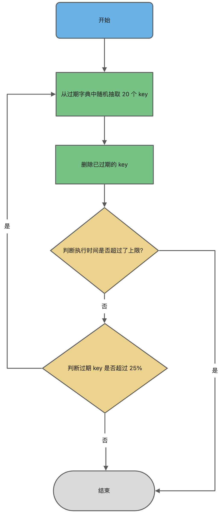

# Redis 内存

## Redis 过期删除

### 过期时间的设置和存储 (过期字典、键值删除策略)

Redis 是可以对 key 设置过期时间的，因此需要有相应的机制将已过期的键值对删除，而做这个工作的就是**过期键值删除策略**。

每当我们对一个 key 设置了过期时间时，Redis 会把该 key 带上过期时间存储到一个**过期字典**（expires dict）中，也就是说「过期字典」保存了数据库中所有 key 的过期时间。

### 过期删除策略

Redis 使用的过期删除策略是「**惰性删除+定期删除**」这两种策略配和使用。

惰性删除策略和定期删除策略都有各自的优点，所以 Redis 选择「惰性删除+定期删除」这两种策略配和使用，以求在合理使用 CPU 时间和避免内存浪费之间取得平衡。

#### 惰性删除策略

惰性删除策略的做法是：**不主动删除过期键，每次从数据库访问 key 时，都检测 key 是否过期，如果过期则删除该 key。**

当我们查询一个 key 时，Redis 首先检查该 key 是否存在于过期字典中：

- 如果不在，则正常读取键值；
- 如果存在，则会获取该 key 的过期时间，然后与当前系统时间进行比对，如果比系统时间大，那就没有过期，否则判定该 key 已过期。

惰性删除的流程图如下：


- 优点

  - 损耗少、性能好，CPU友好。

    因为每次访问时，才会检查 key 是否过期，所以此策略只会使用很少的系统资源，因此，惰性删除策略对 CPU 时间最友好。

- 缺点

  - 内存浪费，内存不友好。

    如果一个 key 已经过期，而这个 key 又仍然保留在数据库中，那么只要这个过期 key 一直没有被访问，它所占用的内存就不会释放，造成了一定的内存空间浪费。所以，惰性删除策略对内存不友好。


#### 定期删除

定期删除策略的做法是，**每隔一段时间「随机」从数据库中取出一定数量的 key 进行检查，并删除其中的过期key。**

Redis 的定期删除的流程：

1. 从过期字典中随机抽取 20 个 key；
2. 检查这 20 个 key 是否过期，并删除已过期的 key；
3. 判断本轮检查的已过期 key 的数量
   - 如果超过 5 个（20/4），也就是「已过期 key 的数量」占比「随机抽取 key 的数量」大于 25%，则继续重复步骤 1
   - 如果已过期的 key 比例小于 25%，则停止继续删除过期 key，然后等待下一轮再检查


可以看到，定期删除是一个循环的流程。那 Redis 为了保证定期删除不会出现循环过度，导致线程卡死现象，为此增加了定期删除循环流程的时间上限，默认不会超过 25ms。

定期删除的流程如下：



- 优点

  - 通过*限制*删除操作执行的*时长和频率*，来减少删除操作对 CPU 的影响，同时也能删除一部分过期的数据减少了过期键对空间的无效占用。

- 缺点

  - 难以确定删除操作执行的时长和频率。

    如果执行的太频繁，就会对 CPU 不友好；

    如果执行的太少，那又和惰性删除一样了，过期 key 占用的内存不会及时得到释放。


TIP

> Redis 的过期删除的内容就暂时提这些，想更详细了解的，可以详细看这篇：[Redis 过期删除策略和内存淘汰策略有什么区别？](https://xiaolincoding.com/redis/module/strategy.html)

### 持久化时，如何处理过期键？

Redis 持久化文件有两种格式：RDB（Redis Database）和 AOF（Append Only File），下面我们分别来看过期键在这两种格式中的呈现状态。


RDB 文件分为两个阶段：

- **RDB 文件生成阶段**：

  从内存状态持久化成 RDB（文件）的时候，会对 key 进行过期检查，过期键*「不会」被保存到新的 RDB 文件中*，因此 Redis 中的过期键不会对生成新 RDB 文件产生任何影响。

- **RDB 加载阶段**：

  RDB 加载阶段时，要看服务器是主服务器还是从服务器，分别对应以下两种情况：

  - 如果 Redis 是「主服务器」运行模式的话，在载入 RDB 文件时，程序会对文件中保存的键进行检查，过期键*「不会」被载入到数据库中*。所以过期键不会对载入 RDB 文件的主服务器造成影响；
  - 如果 Redis 是「从服务器」运行模式的话，在载入 RDB 文件时，*不论键是否过期都会被载入到数据库中*。但由于主从服务器在进行数据同步时，从服务器的数据会被清空。所以一般来说，过期键对载入 RDB 文件的从服务器也不会造成影响。


AOF 文件分为两个阶段：

- **AOF 文件写入阶段**：

  当 Redis 以 AOF 模式持久化时，如果数据库某个过期键还没被删除，那么 AOF 文件会*保留此过期键*

  当此过期键被删除后，Redis 会向 AOF 文件*追加一条 DEL 命令来显式地删除该键值*。

- **AOF 重写阶段**：

  执行 AOF 重写时，会对 Redis 中的键值对进行检查，*已过期的键不会被保存到重写后的 AOF 文件中*，因此不会对 AOF 重写造成任何影响。

### 主从模式中，如何处理过期键？

当 Redis 运行在主从模式下时，**从库不会进行过期扫描，从库对过期的处理是被动的**。也就是即使从库中的 key 过期了，如果有客户端访问从库时，依然可以得到 key 对应的值，像未过期的键值对一样返回。

从库的过期键处理依靠主服务器控制，**主库在 key 到期时，会在 AOF 文件里增加一条 del 指令，同步到所有的从库**，从库通过执行这条 del 指令来删除过期的 key。

## Redis 内存淘汰

什么是内存淘汰？ —— (如下)

内存满了会发生什么？—— 内存淘汰


在 Redis 的运行内存达到了某个阀值，就会触发**内存淘汰机制**，这个阀值就是我们设置的最大运行内存。

此值在 Redis 的配置文件中可以找到，配置项为 maxmemory。


TIP

> Redis 的内存淘汰的内容，想更详细了解的，可以详细看这篇：[Redis 过期删除策略和内存淘汰策略有什么区别？](https://xiaolincoding.com/redis/module/strategy.html)

### 八种内存淘汰策略

Redis 内存淘汰策略共有八种

这些策略可以按淘汰范围分类：

[lt]

- 不进行数据淘汰的策略
  - **noeviction**.  *不淘汰*.  它表示当运行内存超过最大设置内存时，不淘汰任何数据，而是不再提供服务，直接返回错误.  *Redis3.0 之后*，默认的内存淘汰策略
- 进行数据淘汰的策略
  - 在设置了过期时间的数据中进行淘汰
    - **volatile-TTL**.  *Time To Live，早过期淘汰*.  优先淘汰更早过期的键.  
    - **volatile-Random**.  *Random，随机淘汰*.  随机淘汰设置了过期时间的任意键值.  
    - **volatile-LRU**.  *Least Recently Used，最近最少使用*.  淘汰所有设置了过期时间的键值中，最久未使用的键值.  *Redis3.0 之前*，默认的内存淘汰策略
    - **volatile-LFU**.  *Least Frequently Used，最近最不常用*.  淘汰所有设置了过期时间的键值中，最少使用的键值.  *Redis4.0 之后*，新增的内存淘汰策略
  - 在所有数据范围内进行淘汰
    - **allkeys-Random**.  *随机*.  随机淘汰任意键值
    - **allkeys-LRU**.  *Least Recently Used，最近最少使用*.  淘汰整个键值中最久未使用的键值
    - **allkeys-LFU**.  *Least Frequently Used，最近最不常用*.  淘汰整个键值中最少使用的键值.  *Redis4.0 之后*，新增的内存淘汰策略


也可以大致分成 LRU 和 LFU 两种

### LRU 算法和 LFU 算法有什么区别？

#### LRU 算法的概念 (Least Recently Used，最近最少使用)

LRU 全称是 Least Recently Used 翻译为最近最少使用，会选择淘汰**最近最少使用**的数据。

#### LRU 算法的实现

传统 LRU 算法

> 实现：
>
> - 传统 LRU 算法的实现是基于「*链表*」结构，链表中的元素按照操作顺序从前往后排列，最新操作的键会被移动到表头。
> - 当需要内存淘汰时，只需要删除链表尾部的元素即可，因为链表尾部的元素就代表最久未被使用的元素。
>
> 缺点：
>
> - 需要用链表管理所有的缓存数据，这会带来*额外的空间开销*
> - 当有数据被访问时，需要在链表上把该数据移动到头端，如果有大量数据被访问，就会带来很多链表移动操作。存在*高耗时、低性能*问题

由于传统的 LRU 算法存在两个缺点，Redis 并没有使用这样的方式实现 LRU 算法

Redis的 LRU 算法 (近似算法)

> 实现：
>
> - 在 Redis 的对象结构体中添加一个额外的字段，用于记录此数据的最后一次访问时间
>
> - 当 Redis 进行内存淘汰时，会使用*随机采样的方式来淘汰数据*，它是随机取 5 个值（此值可配置），然后淘汰最久没有使用的那个
>
>   这是一种**近似 LRU 算法**，目的是为了更好的节约内存
>
> 优点：
>
> - 不用为所有的数据维护一个大链表，*节省了空间占用*
> - 不用在每次数据访问时都移动链表项，提升了缓存的*性能*
>
> 缺点：
>
> - 无法解决缓存污染问题。比如应用一次读取了大量的数据，而这些数据只会被读取这一次，那么这些数据会留存在 Redis 缓存中很长一段时间，造成缓存污染。
>
> 因此，在 Redis 4.0 之后引入了 LFU 算法来解决这个问题。
>

#### LFU 算法的概念 (Least Frequently Used，最近最不常用)

LFU 全称是 Least Frequently Used 翻译为最近最不常用的，LFU 算法是根据**数据访问次数**来淘汰数据的，它的核心思想是 “如果数据过去被访问多次，那么将来被访问的频率也更高”

所以， LFU 算法会记录每个数据的访问次数。当一个数据被再次访问时，就会增加该数据的访问次数。这样就解决了偶尔被访问一次之后，数据留存在缓存中很长一段时间的问题，相比于 LRU 算法也更合理一些。

#### LFU 算法的实现

LFU 算法相比于 LRU 算法的实现，多记录了「数据的访问频次」的信息。Redis 对象的结构如下：

```c
typedef struct redisObject {
    ...
    // 24 bits，用于记录对象的访问信息
    unsigned lru:24;  
    ...
} robj;
```

#### 总结、区别

Redis 对象头中的 lru 字段，在 LRU 算法下和 LFU 算法下使用方式并不相同。

- LRU 算法中 Redis 对象头的 24 bits 的 lru 字段：

  是用来记录 key 的访问时间戳。因此在 LRU 模式下，Redis可以根据对象头中的 lru 字段记录的值，来比较最后一次 key 的访问时间长，从而淘汰最久未被使用的 key。

- LFU 算法中 Redis对象头的 24 bits 的 lru 字段：

  被分成两段来存储，高 16bit 存储 ldt(Last Decrement Time)，用来记录 key  的访问时间戳；低 8bit 存储 logc(Logistic Counter)，用来记录 key 的访问频次

  

