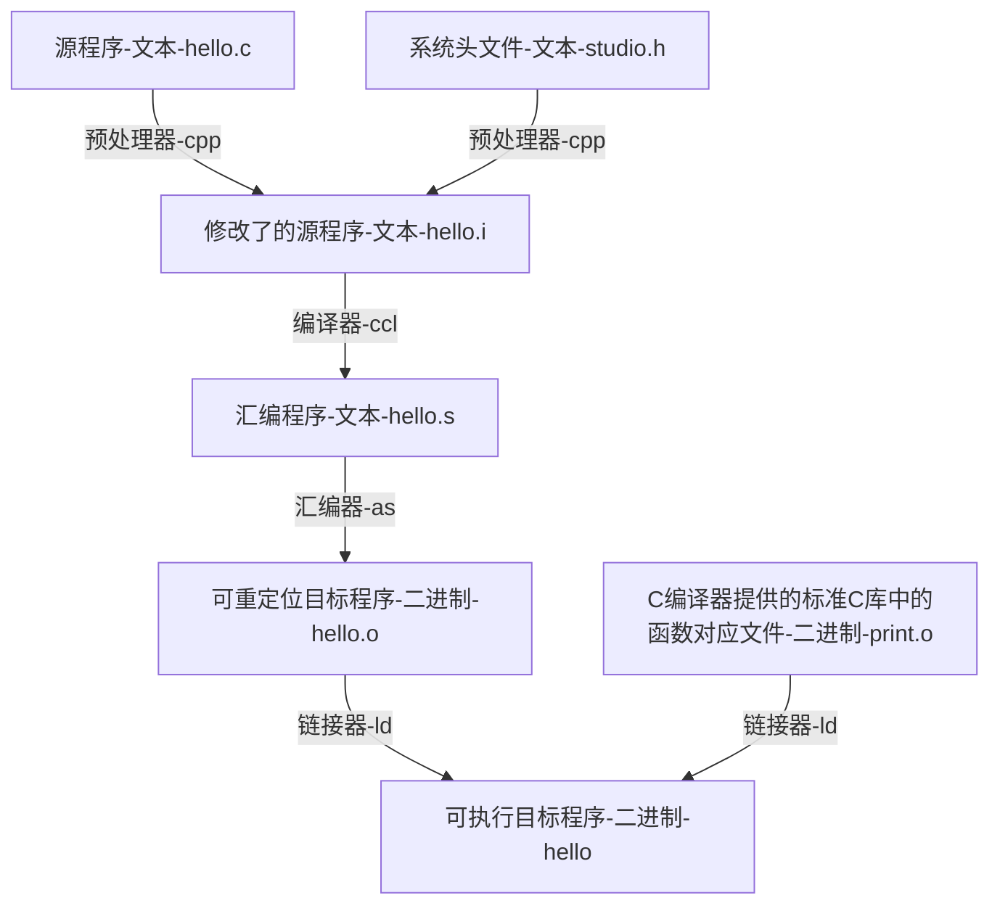
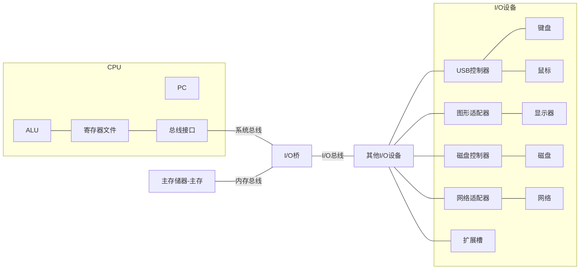
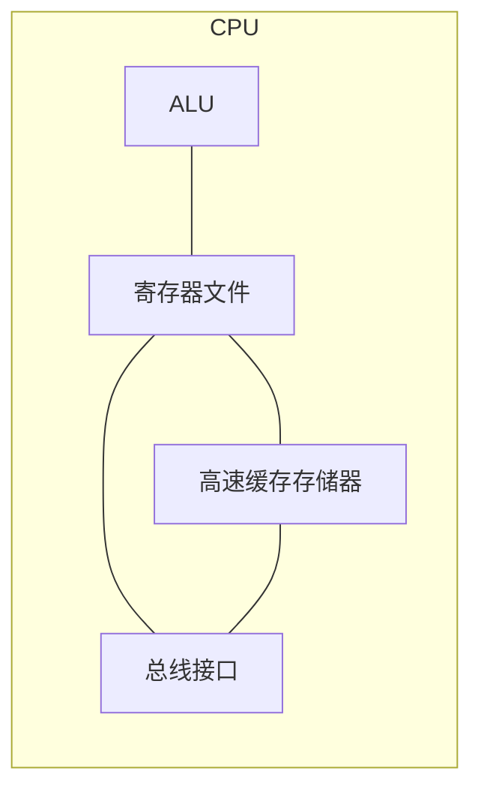

# 《深入了解计算机系统》

这书也叫 `CSAPP`

计算机科学丛书，机械工业出版社华章教育

- 第一部分——程序结构和执行

    2-6章

- 第二部分——在系统上运行程序

    7-9章

- 第三部分——程序间的交互和通信

    10-12章

# 目录

[toc]

# 计算机系统漫游

## 信息 = 位 + 上下文

==位==：源程序实际上就是一个由值0和1组成的位（又称比特）序列

==上下文==：在不同的上下文中，一个同样的字节序列可能表示一个整数、浮点数、字符串或者机器指令

## 程序被其他程序翻译成不同的格式

这个翻译过程可分为四个阶段完成

执行者四个阶段的程序（预编译器、编译器、汇编器和链接器）一起构成了`编译系统（compilation system）`



## 了解汇编系统益处

- 优化程序性能。如：

    - switch语句是否总比一系列的if-else语句高效得多？

    - 一个函数调用的开销有多大？
    - while循环比for循环更有效吗？
    - 指针引用比数组索引更有效吗？
    - 为什么将循环求和的结果放到一个本地变量会比放到一个通过引用传递过来的参数运行起来要快得多？
    - 为什么简单重新排列算术表达式中的括号就能让函数运行得更快？

- 理解链接时出现的错误。如：

    - 链接器报告说它无法解析一个引用，是什么意思？
    - 静态变量和全局变量区别？
    - 在不同C文件定义了名字相同的两个全局变量会发生什么？
    - 静态库和动态库的区别？
    - 命令行上排列库的顺序有什么影响？
    - 更重要的：为什么有些链接错误直到运行时才会出现？

- 避免安全漏洞

    - 多年以来，缓冲区溢出是漏洞主要原因

## 处理器读并解释储存在内存中的指令

要理解运行hello程序时发生了什么，需要先了解一个典型系统的硬件组织

### 系统的硬件组成

Inter系统产品族的模型为例：

> 1. 总线
>
>     通常被设计成传送定长的`字节块`，也就是`字（word）`
>
>     字中的字节数（即字长）是一个基本的系统参数，各个系统不同，现多为4字节（32位）和8字节（64位）
>
> 2. I/O设备
>
>     每个I/O设备都通过一个控制器或适配器与I/O总线相连
>
>     控制器和适配器的区别主要在于封装方式
>
> 3. 主存
>
>     由一组动态随机存取存储器（DRAM）芯片组成
>
> 4. 处理器
>
>     核心是一个大小为`一个字`的存储设备（或寄存器），称为`程序计数器（PC）`
>
>     任何时刻，PC都指向内存中某条机器语言指令（即含有该指令的地址）
>     
>     CPU操作：
>     
>     - 加载：从`主存`复制一个字节或一个字到`寄存器`并覆盖
>     - 存储：从`寄存器`复制一个字节或一个字到`主存`的某个位置并覆盖
>     - 操作：把两个寄存器内容复制到`ALU`运算，结果存放到一个寄存器中并覆盖
>     - 调整：从指令中抽取一个字复制到`PC`中并覆盖
>



> 补充：
>
> - CPU：中央处理单元
> - ALU：算术/逻辑单元
> - PC：程序计数器
> - USB：通用串行总线

### 运行hello程序

要理解运行hello程序时发生了什么，需要先了解硬件组织。了解完再回过头看hello程序的运行：（配合图理解）

```shell
linux> ./hello
hello world
linux>
```

1. 当输入“./hello”

    输入的字符串由USB控制器经总线到达寄存器文件，然后再存储到主存中

2. 当回车

    硬盘中的hello可执行文件经总线到达主存储器（存储数据和程序）

3. 主存储器读取到以后

    可执行文件代码经总线到达寄存器文件，处理后再经总线到达显示器，显示”hello，world“

## 高速缓存至关重要

原因

高速缓存存储器：




## 存储设备形成层次结构

## 操作系统管理硬件

操作系统作用：

- 防止硬件被失控的程序滥用
- 向应用程序提供简单一致的机制来控制复杂而又通常大不相同的低级硬件设备

其通过几个抽象概念（进程、虚拟内存、文件）来实现这两个功能

- 文件：对I/O设备的抽象表示
- 虚拟内存：对主存、磁盘I/O的抽象表示
- 进程：对处理器、主存、I/O设备的抽象表示

### 进程

是操作系统对一个正在运行程序的抽象

> Windows下查看进程
>
> - 任务管理器开启PID显示后，显示有PID（process id）的就是进程，一个应用可以有多个进程
> - cmd使用pslist或tasklist可以查看进程

### 线程

一个进程由多个进程组成，再由多个指令组成。进程 > 线程 > 指令 > 操作

线程是很重要的编程模型，多线程比多进程之间更容易共享数据

> Windows下查看进程
>
> - pslist -dmx pid号可以查看某一进程下的所有线程

### 虚拟内存

为每个进程提供一个假象：每个进程都在独占使用主存

每个进程看到的内存都是一致的，称为`虚拟地址空间`

> 笔者：
>
> > 我以前所以为的：用磁盘空间来增加内存大小的手段，只不过是其的其中一个作用。而并非其本质
>
> 百度百科：
>
> > 虚拟内存是计算机系统内存管理的一种技术。
> >
> > 它使得应用程序认为它拥有连续的可用的内存（一个连续完整的地址空间），而实际上，它通常是被分隔成多个物理内存碎片，还有部分暂时存储在外部磁盘存储器上，在需要时进行数据交换
>
> 其必要性：简书：https://blog.csdn.net/lvyibin890/article/details/82217193
>
> > 操作系统有虚拟内存与物理内存的概念。在很久以前，还没有虚拟内存概念的时候，程序寻址用的都是物理地址。程序能寻址的范围是有限的，这取决于CPU的地址线条数。比如在32位平台下，寻址的范围是2^32也就是4G。并且这是固定的，如果没有虚拟内存，且每次开启一个进程都给4G的物理内存，就可能会出现很多问题：
> >
> > - 因为我的物理内存时有限的，当有多个进程要执行的时候，都要给4G内存，很显然你内存小一点，这很快就分配完了，于是没有得到分配资源的进程就只能等待。当一个进程执行完了以后，再将等待的进程装入内存。这种频繁的装入内存的操作是很没效率的
> > - 由于指令都是直接访问物理内存的，那么我这个进程就可以修改其他进程的数据，甚至会修改内核地址空间的数据，这是我们不想看到的
> > - 因为内存时随机分配的，所以程序运行的地址也是不正确的。
> >
> > 于是针对上面会出现的各种问题，虚拟内存就出来了。

Linux进程的虚拟地址空间设计：（地址从下往上增大）

|              虚拟地址空间              | 补充说明                                                     |
| :------------------------------------: | ------------------------------------------------------------ |
|              内核虚拟内存              | 【顶部区域】不允许应用程序读写和调用，必须通过调用内核来执行这些操作 |
|        用户栈<br />（往下增长）        | 运行时创建<br />【动态大小】每次调用函数栈增长，函数返回时栈会收缩 |
|                   ↕                    |                                                              |
| 共享库的内存映射区域<br />（往上增长） | 【动态大小】存放像C标准库和数学库这样共享库代码和数据的地方  |
|                   ↑                    |                                                              |
|       运行时堆<br />（往上增长）       | 运行时由malloc创建<br />【动态大小】调用malloc和free这样的C标准库函数时可动态扩展和收缩 |
|               读/写数据                | 从hello可执行文件加载进来的程序代码和数据                    |
|            只读的代码和数据            | 【开始区域】从hello可执行文件加载进来的程序代码和数据        |

### 文件

文件就是字节序列

每个I/O设备都可以看成是文件：系统中所有输入输出都是通过使用一小组称为Unix I/O的系统函数调用读写文件来实现的。

## 系统之间利用网络通信

## 重要主题

### Amdahl定律

### 并发和并行

- 线程级并发（同时多个程序（进程）执行）
- 指令级并发（同时多个指令执行）
- 单指令、多数据并发（SIMD并行）（同一指令，多个操作并行执行）
    （特殊硬件允许一条指令产生多个可以并行执行的操作）

### 计算机系统中抽象的重要性

例如：为一组函数规定一个简单的应用程序接口（API）就是一个很好的编程习惯


