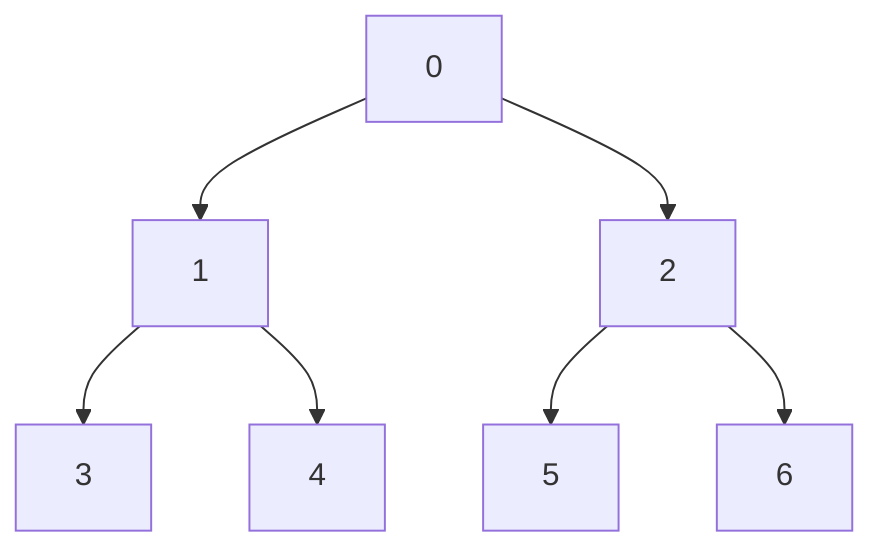

# 排序

## 十大排序算法

### 冒泡排序

### 选择排序

### 插入排序

#### 反向冒泡

#### 真插入排序 (可链表优化)

### 归并排序

归并排序的扩展 —— 小和问题和逆序对问题

这两个问题都很经典

#### 题（小和问题）

在一个数组中，每一个数左边比当前数小的数累加起来，叫做这个数组的小和。求一个数组 的小和。

例子：[1,3,4,2,5]
1左边比1小的数，没有
3左边比3小的数，1
4左边比4小的数，1+3=4
2左边比2小的数，1
5左边比5小的数，1+3+4+2=10

整个数组的小和为 1+1+3+1+1+3+4+2=16

- 暴力解法：全部便利，O(n^2)，但一看就知道有很多额外的比较，浪费了很多信息
- O(nlogn)算法：1的右边有几个比他大，就产生几个1，后面同理。这里有个步骤是求：某个数右边有多少个比他大的数，此时就可以使用归并排序
  - 详细过程：先看最后的结果吧：134和25两个部分，此时左侧的局部小和 和 右侧的局部小和，都已经知道了，此时只需要看这两个部分之间产生的小和就可以了。此时就可以使用归并排序
  - 注意要点，归并merge时，也需要排序，另外需要先拷贝右组的数据（这样才能知道右侧有多少个数比左侧小）

#### 题（逆序对问题）

在一个数组中，左边的数如果比右边的数大，则这两个数构成一个逆序对，请打印所有逆序对。

例子：[3,2,4,5,0]

### 快速排序（快排）

#### 题（荷兰国旗问题）

荷兰国旗问题

- 问题一
  - 给定一个数组arr，和一个数num，请把小于等于num的数放在数组的左边，大于num的数放在数组的右边。
    要求额外空间复杂度O(1)，时间复杂度O(N)
  - 个人做题：O(1) 就不能用额外数组了，而空间O(1)的排序算法基本都要时间O(n^2)，所以这题不全排。感觉简单比较然后排就行了，双指针两端往中间移吧，遍历一遍就行，比较简单
  - 答案：左侧为“小于等于区”，然后有一个小区等于区指针，有一个当前遍历指针。比我想的简洁一点
- 问题二 (荷兰国旗问题，因为荷兰国旗是三色国旗)
  - 给定一个数组arr，和一个数num，请把小于num的数放在数组的左边，等于num的数放在数组的中间，大于num的数放在数组的右边。
    要求额外空间复杂度0(1)，时间复杂度O(N)
  - 个人做题：四指针？
  - 答案：同上，左侧是小于区指针，右侧大于区指针，还有一个遍历中指针。共三指针

#### 快排1.0

类似荷兰国旗问题

也是分治，但与归并有些不同

- 特点是可以找一个中间数
- 从大到小，而不是从小到大。可以理解为反向的归并排序
  - 快排：第一步后，[A数组]+[B数组]，A的所有数均小于等于B的所有数
  - 归并：最后步前：[A数组]+[B数组]，A和B分别内部有序，但A和B无整体大小关系

#### 快排2.0

分三遍，小于、等于、大于，比1.0版本快一些

#### 快排3.0

随机选一个数，避免进入最坏情况

#### 复杂度

空间复杂度 O(log(n))，这个是求概率出来的

最差是log(N)。以快排三为例，最好情况是每次都次都选中间的数且该数不用移动，那么这就是一棵二叉树
（当然，这里是不用递归的情况的空间复杂度，要改递归为迭代，自行压栈）

### 堆排序

#### 堆结构

这里的“堆结构”不等于“堆内存”，是指完全二叉树结构，完全二叉树的“完全”指的是需要按铺满的顺序来铺每一层（例如不能右边还没就将新的元素放左边）

我们可以用堆结构来表示一个数组。例如 0123456 变成二叉树就是：（以此铺满，铺完一层再一层）

分类

- 大根堆：每个子树的头节点都是最大值
- 小根堆：同理

注意堆排序的地位远远没堆结构好

#### 大根堆方法 —— Heap Insert

往堆中插入一个元素（也是如何将一个数组变成一个大根堆的方法）

1. 新增元素时，先正常铺放在新的位置
2. 然后不断与父进行比较交换，直到不比父更大或来到根节点处。

即 —— 新元素先放底部，然后不断上移至合适的位置

#### 大根堆方法 —— Heap Ify

弹出最大的数字

1. 拿出顶部节点，并缩小堆大小并将最后一个数据放在根部，形成heapSize--的一个堆
2. 重新排序。从头节点开始，与左或右中更大的一个数字比较，并交换。不断重复这个过程。

这个过程和HeapInsert是相反的，

即 —— 被临时放在头节点的元素，不断下移至合适的位置

---

如果弹出任意一个节点的数字，也是同理的。将被弹出的节点看作一棵子树来处理

#### 大根堆方法 —— Heap Set

设置某个元素为另一个值

这个过程是 Heap Insert 和 Heap Ify 的结合。看这个数是变大了还是变小了。变大则往上，变小则往下

堆结构中最重要的操作就是 Heap Insert 和 Heap Ify，其他操作都是这两变化来的

#### 复杂度

时间复杂度：完全二叉树，高度是 log(n) 级别

- 那么新增和减少所走的路径自然也是 log(n)
- 而全排序，就是n个元素的增加，就是 nlog(n)

数组 -> 堆 -> 数组，那么就先依次 Heap Insert 数组，再依次 Heap Ify 根节点(最大数)

（弹幕：二叉树的冒泡，太形象了）

#### 整体排序

假如不是一个数组转大根堆，一个元素一个元素地加。而是整体的一个完全二叉树，直接排序，应该怎么做？

1. 最底部两层的多个子树变成大根堆
2. 然后扩展到倒数第三层，此时只有头节点大小不一定对，做个Heap Ify就行

时间复杂度：O(n) ，这个复杂度可以用举例法+错位相减来验证

#### 题 (几乎有序数组，使用小尺寸小根堆)

堆排序扩展题目：

> 已知一个**几乎有序**的数组，几乎有序是指，如果把数组排好顺序的话，每个元素移动的距离可以不超过k，并且k相对于数组来说比较小。
> 请选择一个合适的排序算法针对这个数据进行排序。

答案：

> 假如K=6，那么我们可以做一个HeapSize==6的小根堆。然后沿着数组往右Insert和Ify就行！
>
> 最后复杂度 = $O(N*\log K) = O(N)$
>
> 这个和求 TopN 的算法有点像，复杂度也是 $O(N)$

实现：

> 在Java中，直接用 `PriorityQueue<Integer>` 就好

扩容问题：

> 例如一开始有100个空间，扩容后会分配200空间并将这100个空间复制过去。
>
> 扩容一次的消耗是O(n) (分配完还要复制一遍内存)，扩容次数是O(log(n))，总消耗O(nlog(n))，平均每元素扩容代价O(log(n))。这不会影响最终的复杂度
>
> 当然，也可以提前分别空间，避免扩容代价

为什么需要手写堆

> 例如我们要修改堆的某个元素，像上面的 Heap Set 方法一样，然后你需要用非常轻微的代价去重新调整堆。
>
> 库不一定会支持这种东西，这个时候就需要手写

### 计数排序

全部范围多大，就准备多少个数字

### 基数排序 (桶排)

相较于计数排序，特点是多次进桶，以桶的数量非常少。$N = 桶数^{进出桶次数}$

例如 先个位数字进桶，再十位数字进桶 ……，如果都是三位数，则一共三次进出桶，就排完了
注意要先比较低位再比较高位

局限：要比较的数字需要有 “进制” 这种东西

#### 代码实现细节 (前缀和)

> 入桶时是数组到桶里，出桶时是桶回到数组里，出桶时如何保证出桶的数字放在正确的位置上？
>
> 把 词频数组 变成 **前缀和**数组，从右往左出桶。
> 例如 062 个位桶出桶时，记录了小于等于2的数为4，此时将他放在序号3，并将前缀和减一。
> 此时 061 个位桶出桶时，记录了小于等于2的数还有3，此时将他放在序号2，并将前缀和减一。

很妙，文字可能没法说明白，得看图

> 这个前缀和的精髓，就是出桶时，不需要管其他的片，每个数就能放在对应的位置上了。如果不用前缀和的话，就是这样的：
>
> 例如 062 出桶，你得先看2前面是1，个位数1有2个数，而个位数2有2个数，加起来是4个数，然后再放在序号3上
>
> 其实先用没前缀和的方式写一遍，再优化成前缀和方案，会比较好理解

### 其他排序

排序算法有很多，最重要的是前面那些，其他不是很重要

#### 希尔排序（多轮插入排序）

#### 鸡尾酒排序 

#### 综合排序 —— 小范围优化

- 例如在大样本状态下，可能用快排/归并。时间复杂度 O(nlog(n))
- 但小样本状态下，可能用插入排序。时间复杂度 O(n^2)

这种优化后的排序，叫综合排序

充分利用 O(nlog(n)) 和 O(n^2) 排序各自的优势

#### 综合排序 —— 稳定性优化

像Java的Array.sort方法：

- 如果你元素是基础类型，就给你用快排（更快但无稳定性）
- 如果你是复合类型，就给你用归并排序（稳定性）

充分利用稳定性的排序

各个语言的库的排序算法几乎都是一个缝合了非常多东西的综合排序

## **解题思维总结** / 排序算法总结

### 表

> |                     | 大致操作                                          | 特点       | 时间复杂度                 | 空间复杂度        | 稳定性              | 时间最差 | 时间最好 |
> | ------------------- | ------------------------------------------------- | ---------- | -------------------------- | ----------------- | ------------------- | -------- | -------- |
> | 冒泡排序 (反向)     | **minValue往前**。从右往左进行邻居交换            |            | O(n^2)                     | O(1)              | 是                  |          |          |
> | 选择排序            | **找minIndex**，然后与第一个元素交换              |            | O(n^2)，但**交换次数更低** | O(1)              | **否** (但少了交换) |          |          |
> | 插入排序            | 范围从小到大进行有序，类似打牌，邻居交换/最后交换 |            | O(n^2)                     | O(1)              | 是                  |          | O(N)     |
> | 归并排序            | **两数组合并**。mergeSort，合并两个有序数组       | 分治递归   | O(nlog(n))                 | O(N)              | 是 (小和问题 否)    |          |          |
> | 快速排序 (随机快排) | **两数组各治**。拆分两个数组，数组左均<数组右     | 分治递归   | O(nlog(n))                 | 均O(logN)         | **否**              | O(n^2)   |          |
> | 堆排序              | **维护大/小根堆**                                 |            | O(nlog(n))                 | O(1) (不转回数组) | **否**              |          |          |
> | 计数排序            | 仅记录每个桶有多少个                              | 不基于比较 | O(n)                       |                   | 是                  |          |          |
> | 基数排序 (桶排)     | 多次进桶和出桶                                    | 不基于比较 | O(n)                       |                   | 是                  |          |          |

### 分类与评价

- O(n^2) 类
  - 冒泡排序：略
  - 选择排序：优于冒泡排序，虽然查看和比较复杂度相等，但交换次数少了
  - 插入排序：优于选择/冒泡排序，因为虽然都是O(n^2)，但最好情况可以到O(n)。复杂度与数据状态有关
    反向冒泡和插入排序会有些像
- O(nlog(n)) 类
  - 与之前不同，时间复杂度进入了 O(nlog(n))。为什么以前的差？因为以前的算法浪费了大量比较行为：
    - 例如“选择排序”比较了N个数才确定了最小的位置，然后序号1的位置上又进行了N-1轮比较，这两轮比较是完全独立的，大量的信息被丢弃了
    - 而 O(nlog(n)) 算法没有浪费比较行为，例如 归并行为的最后一轮 的二乘以一，的
  - 归并排序：见上
  - 快速排序：主要是你要取一个数，有最差情况，但那个数是随机取的，如果每次都取到最小/大的数则会很慢，但一般很难进最差情况
- 非**基于比较**排序
  - 与之前的不同，不基于比较了。适用面很窄，只有在特定的数据状况下才能用
  - 基数排序

### **选用**

- 首选快排，虽然都是O(nlogn)，但在常数(实验)指标下，快排是最快的
- 如果限制空间，则堆排
- 如果限制稳定性，则归并

### 常见的坑

是否会有更优的解法？

- 是否有 “基于比较” 的排序算法，时间复杂度低于 NlogN？否
- 是否有 “基于比较” 的排序算法，时间复杂度 NlogN 的同时，还能做到空间复杂度低于 O(N) 且具有稳定性？否

然后就会一些坑：

1. 归并排序的额外空间复杂度可以变成O(1)吗？
   - 可以但是非常难，也没有什么用，不需要掌握，有兴趣可以搜 “归并排序内部缓存法”
   - 而且这会丧失稳定性，还不如用堆排序
2. “原地归并排序” 的帖子都是垃圾
   - 这能把空间复杂度变成O(1)
   - 但会让归并排序的时间复杂度变成O(N^2)，这还不如用插入排序
3. 快速排序可以做到稳定性吗？
   - 可以，但是非常难，不需要掌握。论文搜 “01 stable sort”（这里的01指01标准，要么0要么1，要么放左边要么放右边，大概是这种意思）
   - 但会让快排空间复杂度变成O(N)，那为什么不用归并排序呢
   - 有一道题目，是奇数放在数组左边，偶数放在数组右边，还要求原始的相对次序不变，要求时间O(nlog(n))，空间O(1)。很难，碰到这个问题，可以怼面试官。这类似于将 “01 stable sort”，非常难
4. 上面这几个改进都不重要
   - 因为目前没有找到时间复杂度0(N*logN)，额外空间复杂度0(1)，又稳定的排序。

### 解题思维总结

- **加入一个新数/一组计算过的数后，重新计算是否足够麻烦**
  - 是否有重复比较？[1234]+[5678] 拼接后排序，最少比较一次，不应该再比较n^8次
  - 是否能归并？
  - 例如：求小和问题中，假如已经求完了并排序完数组A，与小和SumA。此时假如给你排序后的数组B和小和SumB。要求得到新的数组C和小和SumC，是否能够不重新计算
  - 通常会使用双指针来归并
- A+B的几种情况
  - 已有数组A，新增数组B，B整体大于A（B元素均比A元素大）。这更类似于快速排序
  - 已有有序数组A
    - 新增元素b，用二分找位置，则合并复杂度O(log(n))
    - 新增有序数组B。这更类似于归并排序，新操作合并复杂度为O(n)
  - 已有有序堆A
    - 新增元素b。这更类似于堆排序，新操作合并复杂度O(log(n))
    - 新增同高的有序堆B。也是堆排序，新操作合并复杂度O(log(n))（方法为拿一个数放在头节点然后做HeapIfy就好）
- 小局部排序到大局部 / 大局部到小局部
  - 分别猜最后一步和第一步

