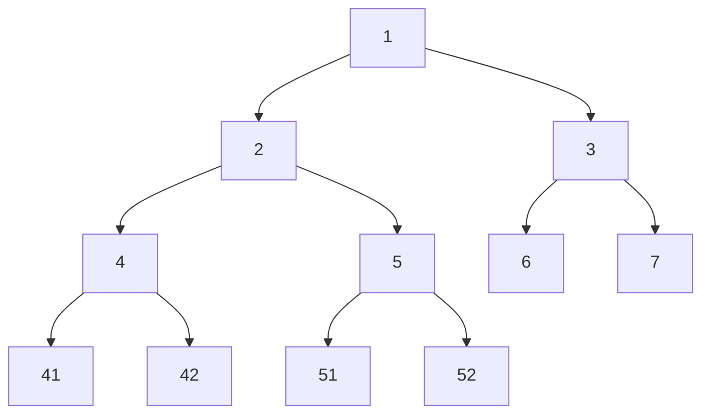
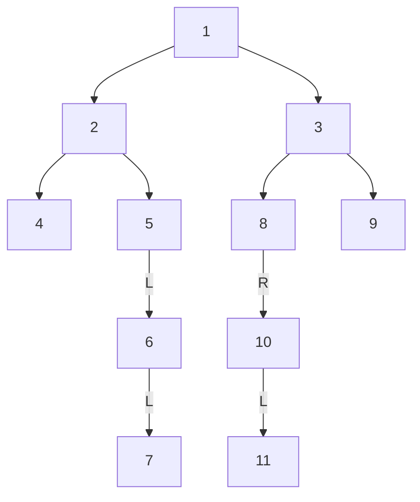
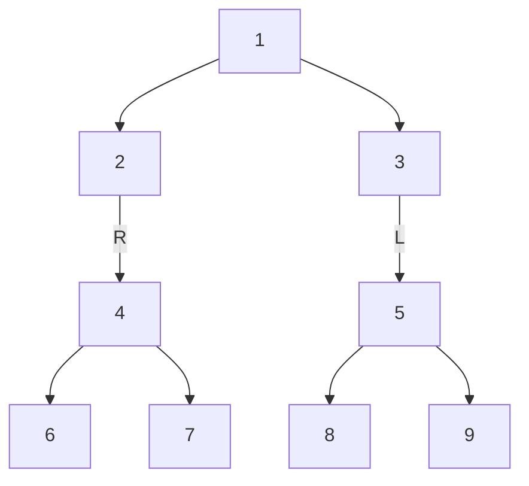
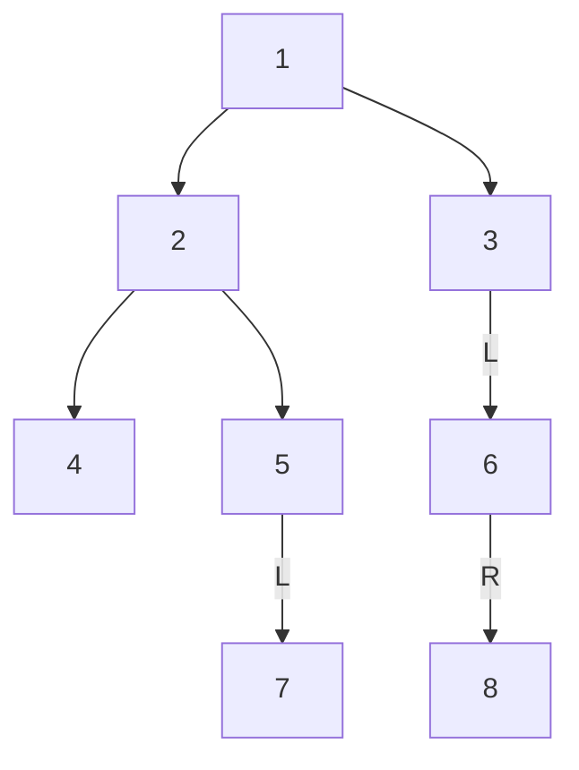
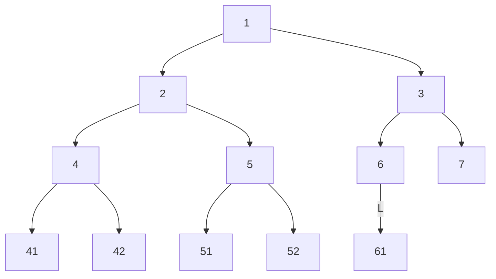
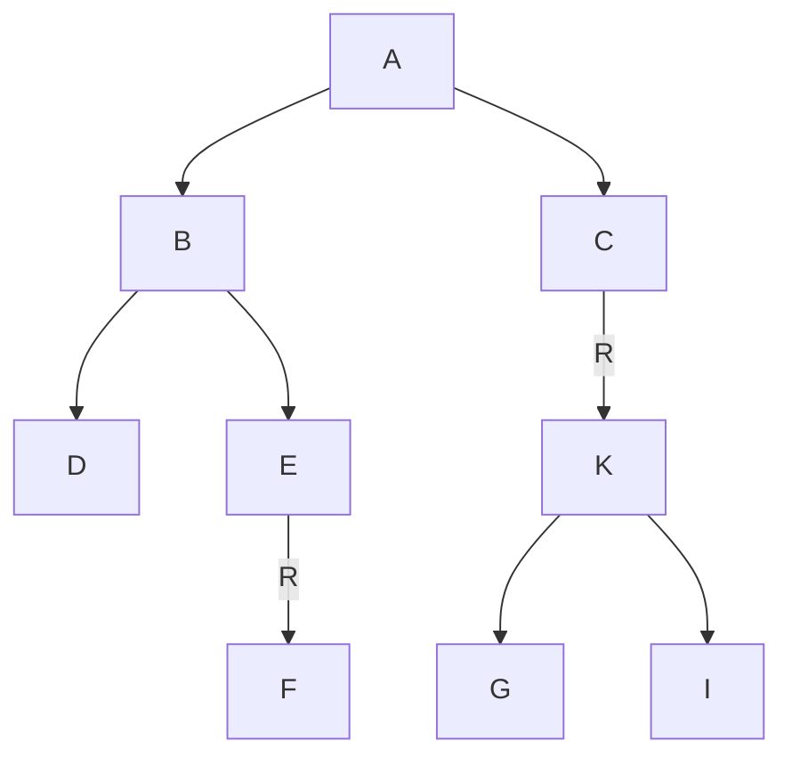

## 二叉树 (BT, BTree, BinaryTree)

### 概念

#### 结构

二叉树节点结构

```cpp
class Node<V> {
    V value;
    Node left;
    Node right;
}
```

一般来讲在面试场上不会考你二叉树coding的难度，或者说很少，但应该要会。他是让你考具体的题目还是考算法居多啊

#### 打印

如何直观的打印一颗二叉树。这个一般也会考和自己写，自己准备一个方便打印debug就行

#### 树的边界

左边界和右边界，就是一个节点不断往左/右节点往下形成的一条路径。

后面讲非递归遍历的中序遍历时，会再提到这个概念

### 遍历

用递归和非递归两种方式实现二叉树的先序、中序、后序遍历

#### 深度遍历概念：递归序，先序/中序/后序

例如：



**递归序**为：1 2 4 4 4 2 5 5 5 2 1 3 6 3 7 3 1 (我们可以发现每个节点都会经过三次)


根据递归序加工的不同，分为：

- **先序**：对于所有子树，都是依次打印 头->左->右。递归序中，第一次到节点打印，第二、三次到这个节点不打印
- **中序**：对于所有子树，都是依次打印 左->头->右。递归序中，第二次到节点打印，第一、三次到这个节点不打印
- **后序**：对于所有子树，都是依次打印 左->右->头。递归序中，第三次到节点打印，第一、二次到这个节点不打印

#### 深度优先遍历 - 递归遍历

递归的先序/中序/后序的代码实现上非常简单，在不同的时机打印就行了

```cpp
public 递归函数 (Node head) {
    if (head == null) return;
    // System.out.print(head.value+" "); // 先序打印
    递归函数(head.left);
    // System.out.print(head.value+" "); // 中序打印
    递归函数(head.right);
    // System.out.print(head.value+" "); // 后序打印
}
```

#### 深度优先遍历 - 非递归遍历

任何递归一定都可以改成非递归。（不让系统压栈，自己压）

有时面试会考这个，就是看你理不理解压栈这个过程

##### 前序/先序 (Pre-order Traversal)

准备一个栈，放入头节点，然后进行以下流程：

1. 弹出一个节点Current
2. 打印/处理Current
3. 以此分别压入右节点和左节点 (如果有) (先压右再压左是为了先左出栈，先处理左)
4. 循环处理

##### 后序

准备两个栈（主栈和收集栈），主栈放入头节点，然后进行以下流程：

1. 主栈弹出一个节点Current
2. 节点放入收集栈
3. 以此分别压入右节点和左节点
4. 循环处理
5. 当全部完成后，收集栈的出栈顺序就是中序遍历处理的顺序（收集栈的入栈顺序是头->右->左，出栈顺序自然是左->右->头）

##### 中序

类似先序打印。左->右->头，思路：子树中整个左树进栈（整个左边界进栈），出栈时对弹出节点的右树进行相同的处理

例如在下面这个图中：



先进124，然后4出栈打印2，看2有右节点5，就压入右节点5和他的整个左树。循环

#### 广度优先遍历

如何完成二叉树的宽度优先遍历 (常见题目：求一棵二叉树的宽度)

用队列（队列先进先出，这次不用栈了。深度用栈，广度用队列）



方法：放入头节点然后执行：

1. 头弹出就打印，并且以此将左节点和右节点入队列

最后打印就是：头->左->右，先序遍历。简单理解：[1]->[32|1]->[32]->[54|32]->[54]->[9876|54]->[9876] (右头左尾)
（注意：这里简化了一些延长了出队列的时间，实际内存不是这样）

实现细节：

先序/中序/后序的切换比较简单。并且这里用队列而非栈，也就是不需要手动递归，只需要 `while(!queue.isEmpty())` 就行，当作普通循环，较好理解

```java
Queue<Node> queue = new LinkedList<>(); // Java的队列
queue.add(head);
while(!queue.isEmpty()) {
    Node cur = queue.poll();
    // System.out.println(cur.value): // 先序
    if(cur.left !=null) {
    	queue.add(cur.left);
    }
    // System.out.println(cur.value): // 中序
    if(cur.right !=null) {
	    queue.add(cur.right);
    }
    // System.out.println(cur.value): // 后序
}
```

##### 题：求一棵二叉树的宽度



例如这里的最大宽度是3，在第三层出现


答案：

要知道最大宽度，还需要知道各个节点分别存在第几层，需要统计每一层的节点数是几。

那么我们可以用 `HashMap<Node, Interget> levelMap = new HashMap<>()` 的哈希表，来记录每个节点在第几层。

遍历打印时去看是第几层（广度深度都有解法），然后分别累加就行


答案：（无hash表方案）

这个说是难很多，但我感觉可以用我前面那个简化版的流程是非常好理解的：[1]->[32|1]->[32]->[54|32]->[54]->[9876|54]->[9876] (右头左尾)

只要几个变量：

- nodeCurEnd 当前层的最后一个节点
- nodeNextEnd 下一层的最后一个节点
- curLevel 当前层的最大宽度
- maxLevel 最大宽度

LeetCode102、LeetCode104，弹幕说那里的解法简单些

### 搜索

#### 广搜

### 题 (二叉树常见题)

下面几个概念可以缝合的，例如：平衡二叉查找树 (Balanced Binary Search Tree)

#### 判断 搜索二叉树 (BST, Binary Search Tree)

也叫二叉查找树 (Binary Search Tree)，更符合英文翻译

搜索二叉树特点：左树小于右树、且没有重复值


方法：中序遍历（深度遍历，是否递归都行），一定是升序输出

#### 判断 完全二叉树 (FBT/CBT)

完全二叉树特点：按顺序从左到右铺（堆就是一棵完全二叉树，不一定是满二叉树）


方法：广度遍历，遍历的过程中。刚开始时的节点，均有左右节点

1. 如果发现一个节点有右孩子但没左孩子，返回false

2. 如果遇到第一个节点有左孩子但无右孩子，那么后面遇到的所有节点都应该是叶子节点（均无左右孩子），否则返回false

   （例如在下图中，节点6就是往后遍历的所有节点都是叶子节点）



#### 判断 满二叉树

满二叉树特点：（满二叉树是特殊的完全二叉树）


方法：在判断完全二叉树的基础上微改一下就行。广度遍历，遍历的过程中。刚开始时的节点，均有左右节点

1. 如果发现一个节点只有一个孩子，返回false
2. 如果遇到第一个节点均无左右孩子，那么后面遇到的所有节点都应该是叶子节点（均无左右孩子），否则返回false

另一个比较麻烦但好理解的方法

1. 分别统计最大深度L和节点个数N，那么满足公式 $N=2^L-1$ (等倍数列求和)

#### 判断 平衡二叉树 (二叉树套路)

平衡二叉树特点：对于任何子树，左树高度与右树高度不相差超过一


二叉树做题套路：基于我可以向我左数要某些信息，右数要某些信息的情况下，我怎么罗列这个可能性。

例如在平衡二叉树的题目中，如果：左树是平衡二叉树、右树是平衡二叉树，且两者高度差不超过一，则通过。

那么就可以想到递归，每个递归返回两个信息：是否平衡、高度多少

#### 寻找 公共祖先节点 (二叉树套路)

题：给定两个二叉树的节点node1和node2，找到他们的最低公共祖先节点

例如下图中，D和F的最低公共祖先是B




解题：

- 找类似题的思路 —— 链表。我开始想到的是链表找相交节点的那个题目，或者有点有向无环图的感觉。链表找相交节点麻烦的做法是逆序，方便点就是快慢指针判断末尾节点，同时加有环判断。但这里有些区别，因为是头节点相同而不是尾节点相同，那么理论上可以逆序然后再求链表相交节点，但很麻烦。

- 遍历方式思路 —— 看能不能从递归序中提取出来。

- 空间 O(n) 哈希表解法思路。D和F节点都存储自己的路径（相当于用哈希表模拟了一条虚拟的倒序链表），再对比

  ```java
  HashMap<Node, Node> fathreMap = new HashMap<>(); // 存储每个节点的父节点
  ......
  HashSet<Node> set01 = new HashSet<>(); // 存储节点一的整条路径，然后再去看另一条节点的路径
  ```

- 解题套路解法尝试递归

  - 往子树需要要的信息：o1和o2在不在你那？然后就有了下面的 O(1) 解法（这个解图思路确实好用）
  - 另外需要注意一下边界问题
    - 情况一：O1是O2的LCA或O2是O1的LCA
    - 情况二：O1和O2不彼此为LCA
  - 答案：

  ```java
  public static Node lowestAncestor(Node head, Node o1, Node o2) {
      // 情况一的到达条件
  	if (head == null || head == o1 || head == o2) {
          return head;
      }
      // 情况二的到达条件
  	Node left = lowestAncestor(head.left, o1, o2);
  	Node right = lowestAncestor(head.right, o1, o2);
  	if (left != null && right != null) {
  		return head;
      }
      // 递归条件，继续递归
  	return left != null ? left : right;
  }
  ```

#### 寻找 后继节点 (简单)

在二叉树中找到一个节点的后继节点

现在有一种新的二叉树节点类型如下

```java
public class Node {
    public int value;
    public Node left:
    public Node right;
    public Node parent;	// 该结构比普通二叉树节点结构多了一个指向父节点的parent指针
    					// 假设有一棵Node类型的节点组成的二叉树，树中每个节点的parent指针都正确地指向自己的父节点，头节点的parent指向null
    public Node(int val) {
	    value = val;
    }
}
```

只给一个在二叉树中的某个节点node，请实现返回node的后继节点的函数。在二叉树的**中序遍历的序列中， node的下一个节点叫作node的后继节点**。


答案：

- 最简单的肯定是中序遍历后，将输出保存起来。缺点是空间和时间复杂度O(n)，代价大
- 但这里我们有父指针这个新特征，也很简单。思考情况：
  - 情况一：该节点有右孩子，则是右孩子的最左节点
  - 情况二：该节点无右孩子，则找一直往上找自己不是右节点的父节点X
  - 情况三：没有后继节点，情况二最后找到根节点也不符合
  - （最左节点：再不断往下找左节点，直到没有左节点则输出）
  - 空间复杂度O(1)，时间复杂度为两个节点的最短路径O(k)

#### 二叉树的序列化和反序列化

（LeetCode 297）

就是内存里的一棵树如何变成字符串形式，又如何从字符串形式变成内存里的树


答案：

- 序列化
  - 不同于遍历打印的一点是，还要求是一一对应关系。但其实大同小异，只要把”空“也用特殊字符打印出来，其实就可以了
  - 用先中后序序列化都是同理的，以先序为例：例如输出结果为：[1,#,2,4,#,#,#] 
- 反序列化
  - 也简单，这里是先序遍历所以先建头节点，再建左/右节点。
  - 先加载头节点，遇到空的就往左/右节点插入空，否则插入对应节点并进入该节点中继续插值。
    左右节点都插满后返回上节点，继续插
- 二叉树这个很简单清晰，也不需要序列化得像标签语言一样的那种形式，而是更扁平的存储方式。但如果B+树就不能用这种方式序列化了

#### 判断 一颗二叉树是不是另一棵二叉树的子树

略

#### 折纸问题 (简单)

题：(一个微软的题，也不难)

请把一段纸条竖着放在桌子上，然后从纸条的下边向上方对折1次，压出折痕后展开。此时折痕是凹下去的，即折痕突起的方向指向纸条的背面。

如果从纸条的下边向上方连续对折2次，压出折痕后展开，此时有三条折痕，从上到下依次是下折痕、下折痕和上折痕。

给定一个输入参数N，代表纸条都从下边向上方连续对折N次。请从上到下打印所有折痕的方向。

例如：N=1时，打印: down，N=2时，打印: down down up


解题：

- 先找规律然后总结规律，数学方式打印。实际解决是可行的，不过如果禁止用数学思维而强制用计算机模拟

- 应该是能用树表示，一棵满二叉树来的，每次对折就深度加一（规定左节点是上面的，右节点是下面的）

  - 特征：每个节点的凹凸状态不会变，每次对折增加左右节点，这新增的两个节点必定左凹右突

    ```mermaid
    graph TB
    1凹-->2凹-->3凹
    2凹-->3凸
    1凹-->2凸-->3凹_
    2凸-->3凸_
    ```

  - 最后构造完后，中序遍历输出就行了

### **解题思维总结** (递归所需信息)

二叉树做题套路：基于我可以向我左数要某些信息，右数要某些信息的情况下，我怎么罗列这个可能性。

- 例如在平衡二叉树的题目中，如果：左树是平衡二叉树、右树是平衡二叉树，且两者高度差不超过一，则通过。

  以此写递归：每个递归返回两个信息：是否平衡、高度多少

- 例如在搜索二叉树题目中，如果：左树是搜索树、右树是搜索树、且左Max<头节点<右min，则通过。

  以此写递归：每个递归返回两个信息：是否搜索二叉树、最大值与最小值多少

这个递归套路非常之好用，可以解决你们面试中一切**树形DP** (树上动态规划) 的问题，树形DP是面试中最难的问题


