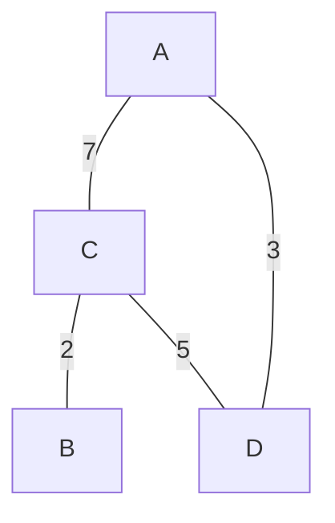
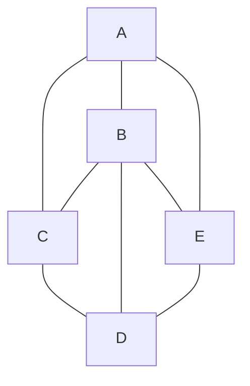
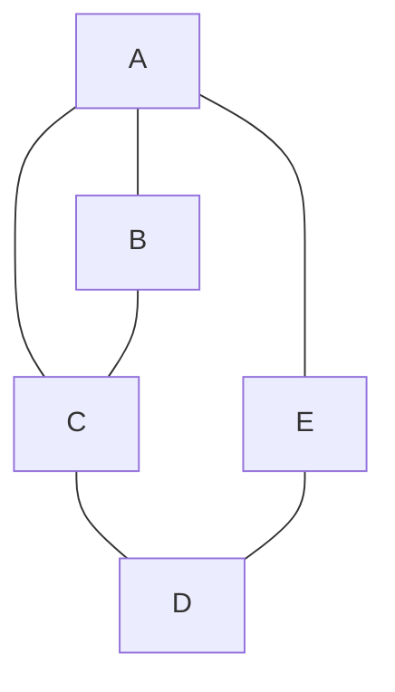
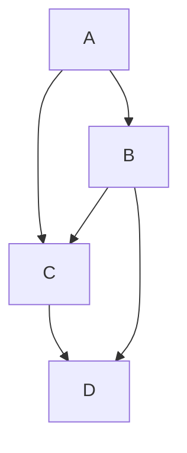
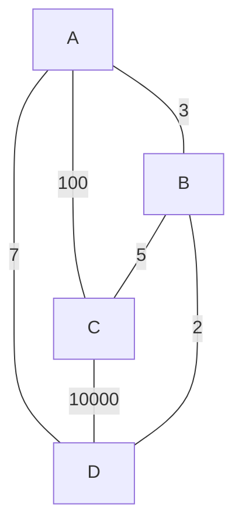
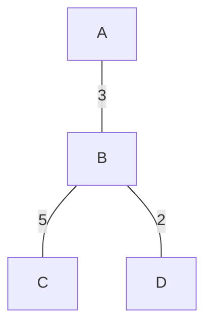
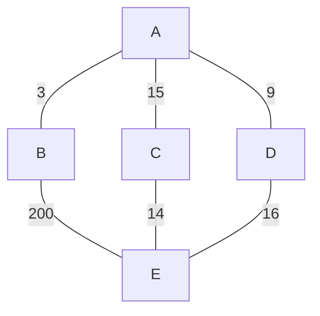
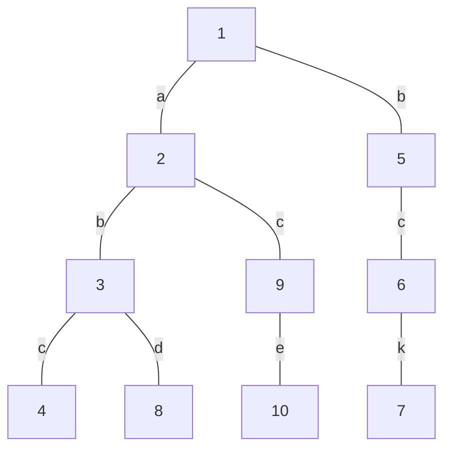

# 图

## 图

图的存储方式

1. 邻接表
2. 邻接矩阵

如何表达图？生成图？

可以用不同的方式表达图，图是不同的，算法是一样的

### 分类



- 存储

  - 邻接表：每个节点记录与他直接相邻的节点（还可以加上相邻的距离等参数）

    - 优点：能直接查出每个节点有多少邻居
    - 例如，上图中，表示为：

    $$
    A: C(7),D(3)\\
    B: C(2)~~~~~~~~~~~\\
    C: A(7),D(3)\\
    D: A(3),C(5)
    $$

  - 邻接矩阵

    - 例如，上图中，表示为：

    $$
    \begin{bmatrix}
      0 & -1 & 7 & 3\\
      -1 & 0 & 2 & -1\\
      7 & 2 & 0 & 5\\
      3 & -1 & 5 & 0\\
    \end{bmatrix}
    $$

  - 其他不常见的

    - 其中二叉树/多叉树是图中的一种
    - 此外还有很多特殊的图
    - 例如用数组表示图：[5, 2, 2, 4, 2, 1]，每个序号的节点指向的父节点id，最后能形成一个倒序的多叉树

- 集合类型

  - 点集
  - 边集

- 是否有向

  - 有向图（类似于单链表）
  - 无向图（类似于双链表），对于无向图来说，节点的**入路**和**出路**是一样的

- 是否有环

  - 有环图
  - 无环图

## 题

### 技巧

面试的问题：最近很少会考图，但每三家可能就会有一个。解决：

那么怎么解决这样一个笔试过程中的痛点呢，推荐一种方式，把图按照你最爱表达的方式实现所有的算法。
然后如果遇到一些自定义的图，只要写一次两种图的转化，就可以不用再实现一遍新图的解决，然后用你自己的图的方法解决

例如可能会遇到这种图：
$$
\begin{bmatrix}
  3 & 0 & 2\\
  7 & 1 & 2
\end{bmatrix}
$$
第一行表示0和2两城市的距离是3。那么没必要再弄一个这个图的新算法，而是转化成自己常用的邻接矩阵，然后再计算就行了

### 常用结构A

话说这个东西的定义好像我之前用 PyQt 实现的那个节点编辑器。那个应该是属于 ”有向有环图 (无回环，无循环依赖)“

#### 三个结构

图类

```java
package class06;
import java.util.HashMap;

public class Graph {
	public HashMap<Integer, Node> nodes;	// 点集 (点编号:实际点)，存储所有创建的节点类
	public HashSet<Edge> edges;				// 边集
	public Graph() {
		nodes = new HashMap<>();
		edges = new HashSet<>();
    }
}
```

节点类

```java
package class06;
import java.util.ArrayList;

public class Node {
	public int value;
	public int in;							// 入路数
	public int out;							// 出路数
	public ArrayList<Node> nexts;			// 出路的点
	public ArrayList<Edge> edges;			// 自己所拥有的边
    
	public Node(int value) {
		this.value = value;
		in =0;
		out = 0;
		nexts = new ArrayList<>();
		edges = new ArrayList<>();
    }
}
```

边类

```java
package class06;
public class Edge {
    public int weight;
    public Node from;
    public Node to;

    public Edge (int weight, Node from, Node to) {
        this.weight = weight;
        this.from = from;
        this.to = to;
    }
}
```

优化：这里是为了兼容所有情况。可以进行优化，如有时可能只是数字，可以将HashMap改成数组

#### 创建方法

```java
public static Graph createGrpht(Integer[][] matrix) {
	……
}
```

### 图的宽度遍历

遍历方法和二叉树的遍历差不多：

1. 利用队列实现
2. 从源节点开始依次按照宽度进队列，然后弹出
3. 每弹出一个点，把该节点所有没有进过队列的邻接点放入队列
4. 直到队列变空


什么是图的宽度遍历



例如上图中的无向图，A为头节点，输出 ACBED、ABCED、AECBD，都属于宽度遍历（CBE都和A直接相连，没权重区分）

### 图的深度遍历

遍历方法和二叉树的遍历差不多。但要注意多准备一个Set，避免重复遍历某个元素：

1. 利用栈实现
2. 从源节点开始把节点按照深度放入栈，然后弹出
3. 每弹出一个点，把该节点下一个没有进过栈的邻接点放入栈
4. 直到栈变空


什么是图的深度遍历



例如上图中的无向图，A为头节点，输出 ABCDE

### 包依赖问题 (**拓扑排序**)

引入包的依赖问题其实也是一种图 ”有向有环图 (无回环，无循环依赖)“

然后包依赖时，我们需要存在一个顺序：先编译谁再编译谁？这需要反向进行打印。

我刚开始以为这类似于后序遍历，但其实这个叫拓扑排序，并且实现简单得多：


方法：



1. 先找入路为0的点，作为起点。例如上图的A
2. 把A及其影响擦掉 (理解成节点和他的线删掉)。此时可以再次找到入路为0的点。循环

## 最小生成树 (MST)

### 概念

什么是最小生成树？保证联通性，且保证边是最少的




例如将上图修改成下图：



如何实现？有两个算法：

- K算法 (kruskal算法)
- P算法

难点：里面有并查集结构（在进阶班将并查集）

### K算法 (kruskal算法、并查集)

- 适用：无向图

- 作用：生成最小生成树

- 特点：以边的角度出发

- 方法：机制很简单。先将边进行升序排序，然后依次加入。每次加入看有无形成环，若有则不加。

- 方法难点 —— 并查集：如何知道加入一条边后，有无形成环。这需要一个集合查询的结构 —— 并查集

  - 并查集就是为每个节点创建一个集合，N个节点就有N个集合。

    如果新增一条边后，如连接AC的边后，看AC的集合是不是同一个，若不是，则说明该边没有形成环，然后将A和C放在同一个集合中

    以此类推，最后的情况是N个节点都在一个集合中

  - 这个并查集的概念其实也很好理解，就是存储一共有多少个离散的部分，每个离散部分的内容有什么

  - 简单代替并查集：这里只是一个简单代替并查集的实现，但没有并查集快，并查集的复杂度是常数级的

    ```java
    public static class MySets{
        public HashMap<Node, List<Node>> setMap; // 每个节点指向一个集合，多个节点可能指向同一个集合
        public MySet(List<Node> nodes);
        public boolean isSameSet(Node from, Node to);
        public void union(Node from, Node to);
    }
    ```

- 实现：略

### P算法 (prim算法)

- 适用：无向图
- 作用：生成最小生成树
- 特点：以点的角度出发
- 方法：
  1. 边集准备一个：已解锁且未使用边集。刚开始所有边为未解锁状态。任意一个点设为已使用。
  2. 与已使用节点相连的边为解锁状态。
     解锁且未被使用的边集中，选最短的一条且两端的点并非均已使用的边，将该边设为已使用。
     并加入新边另一端的新节点。
  3. 重复上一步骤
- 并查集问题：这个题不需要并查集

### Dijkstra算法 (迪杰斯特拉算法)

- 适用：没有累加和为负数的环（不然一直转下去，到所有点的距离都可以无穷小）

- 思想：先找出某个节点到其他节点的最短距离（对于不可达，则看作是距离无穷大）

- 类型：这不是动态规划DP，是典型的贪心算法（不断加迭代已知条件，在迭代最优解）

- 方法：

  - 例如下面的图中，我们先给一个A到(A~E)的距离矩阵是 [0, -1, -1, -1, -1]

  - 然后依次查看节点，看能不能让上面的矩阵的值变得更少

    例如：查看节点A (原点长度为0) 及直接邻居之后，矩阵为 [0, 3, 15, 9, -1]，此后A-A的记录被锁死，后续不再改变和使用。

    接着再看B (原点长度为3，都要加上这个)：那么经B的矩阵是 [6, 3, 5, -1, 203]，因为采取更小值，最后矩阵为 [0, 3, 5, 9, 203]

    以此类推，最后得到：[0, 3, 5, 9, 19]

  - 为什么要锁记录？

  - 堆改写问题：这里可以用堆，但不能用系统给的堆，否则代价比较大。
    因为堆上的某个节点可能会突然变小，并且有些值就后面不会再修改，手动改写堆的话会更快

    



### A* 算法

- 游戏和图形会比较常见

### 总结比较K、P算法 (均贪心算法)

- K算法：从边出发，依次加入边，直至多个离散的图最终变成一个整体的图
  - 根据特征重命名：离散整体生成图算法
- P算法：从点出发，一个整体的图不断扩张，直至连接上所有的点
  - 根据特征重命名：点扩张生成图算法
- Dijkstra算法
  - 根据特征重命名：

这三种算法都是贪心

### 森林问题

有可能给你的图，不是一个整个单一联通的，而是多个离散的不相连的图组成的图。这个就是森林问题。

这种情况需要生成多个最小生成树

## 前缀树 (Trie-tree?)

### 概念

何为前缀树？如何生成前缀树？

（这个名字有点像那个 ”前缀和数组“，但不一样）

例如 ["abc", "bck", "abd", "ace"] 数组，可以建下面的前缀树出来：



这是一个经典的生成，点上没有数据。但一般来说，我们会在点上另存一些数据：（可能方便计算或序列化）

- p：这个节点被使用的次数 (特点：根节点(空串)的p值也同时会标识，你往这个前缀树加入了多少个词)
- e：这个节点作为被结束节点的次数

用处：

- 一篇文章中，可以将每个单词视作一个元素，来进入前缀树。然后可以进行
  - 前缀词频统计
  - 词频统计
  - 其他方法：增加单个元素、删除元素一次、删除整个元素
- 速度超快，查询一个单词时，代价只有一个单词的长度，复杂度 O(k)

### 题

例题：一个字符串类型的数组arr1，另一个字符串类型的数组arr2。arr2中有哪些字符，是arr1中出现的？

请打印。arr2中有哪些字符，是作为arr1中某个字符串前缀出现的? 请打印。arr2中有哪些字符，是作为arr1中某个字符串前缀出现的？请打印 arr2中出现次数最大的前缀。

## 暴力枚举

### 题

#### N皇后问题 (暴力枚举版)

N皇后问题是指在N*N的棋盘上要摆N个皇后，要求任何两个皇后不同行、不同列，也不在同一条斜线上。

给定一个整数n，返回n皇后的摆法有多少种

例如：

- n=1，返回1。
- n=2或3，2皇后和3皇后问题无论怎么摆都不行，返回0。
- n=8，返回92。


答案：最优解很难，先用贪心，暴力枚举

先准备一个 list 存储每次防止的皇后位置，然后要有一个算法判断每次新的位置是否与之前的存在共行列斜线的问题。然后暴力枚举递归

复杂度：O(n^n)，复杂度指标没法优化（有后效性的程序问题），但常数时间可以优化非常多

#### N皇后问题 (位图版)

复杂度：O(n^n)，但常数时间优化非常多。（例如14皇后问题中，该方法229ms，普通方法5055ms。15皇后问题中，这个一秒多，普通方法要一分）

主要是用二进制位图来进行优化，程序：

```java
public static int num2(int n) { // int要求皇后不超过32
	if (n<1 || n>32) return 0; // 取值范围过滤
    
	int limit = n == 32 ? -1 : (1 << n) - 1; // 例如8皇后问题，则前8位是1，其他都是0 (有点类似于掩码)
	return process2(limit, 0, 0, 0);
}

// colLim 列的限制，1的位置不能放皇后，0的位置可以
// leftDiaLim 左斜线的限制，1的位置不能放皇后，0的位置可以
// rightDiaLim 右斜线的限制，1的位置不能放皇后，0的位置可以
public static int process2(
    int limit,
	int colLim,
	int leftDiaLim,
	int rightDiaLim
) {
    // ...
    // 位图可以很位运算很快地进行判断：
    // 例如一个位置位于：列[00001000] 行[00010000] 斜[00000100]
    // 直接用|和已经放置皇后的与集作运算，就能知道有无冲突了！妙啊！
}
```

## 贪心算法

在某一个标准下，优先考虑最满足标准的样本，最后考虑最不满足标准的样本，最终得到一个答案的算法，叫作贪心算法。

也就是说，不从整体最优上加以考虑，所做出的是在某种意义上的局部最优解。

局部最优 -?-> 整体最优


特点：最常用、用得最多的算法。但不一定是最优解


算法举例：

- 最小生成树的 K算法、P算法、Dijkstra算法

### 题

特别难准备，因为每个题的业务和贪心策略都不同。

面试中经常有，但往往篇幅不大只占一部分。没法考coding，有淘汰度但没有区分度

#### 会议占用时间分配

一些项目要占用一个会议室宣讲，会议室不能同时容纳两个项目的宣讲。

给你每一个项目开始的时间和结束的时间(给你一个数组，里面是一个个具体的项目)，你来安排宣讲的日程，要求会议室进行的宣讲的场次最多。

返回这个最多的宣讲场次。

（这种应该是需要用动态规划的，不过这里先用贪心算法）


解题思路：早优先和短优先，都比较容易偏离最优解。早结束优先会好一些

#### 字典序

如果不用对数器，而是用证明的方法，会更麻烦。例如这里的字典序问题

##### 定义

（这个概念有点类似于线性代数中的 ”逆序数“）

将单词从小到大排列，违反这个顺序就字典序加一

##### 字典序 的 有效/无效比较策略

有效要求具有传递性，a<b<c，则a<c

但有些东西不一定有传递性的，例如下棋吃棋就是

##### 证明传递性

这里的 a,b,c 等都表示的是一个单词

如何证明，若 f(a,b) <= f(b,a)，f(b,c) <= f(c,b)，则 f(a,c) <= f(c,a) (f函数表示拼接，如 f("abc","de") = "abcde")，

也可以用进制来理解，将拼接运算变成数学运算。那么 f(a,b) = $a\times k^{b长度}+b$

然后就可以证明了

##### 证明交换换字典序变大

（这跟线性代数里 ”逆序数“ 的证明很像）

- 紧挨的情况：[…… a b ……] < […… b a ……]
- 不挨的情况：[…… a m1 m2 b ……] < […… m1 a m2 b ……] < …… < […… b m1 m2 a ……]

#### 金条分隔问题

题：

一块金条切成两半，是需要花费和长度数值一样的铜板的。比如长度为20的金条，不管切成长度多大的两半，都要花费20个铜板。

一群人想整分整块金条，怎么分最省铜板？输入一个数组，返回分割的最小代价

例如：

给定数组 {10,20,30}，代表一共三个人，整块金条长度为10+20+30=60。金条要分成10,20,30三个部分。

- 如果先把长度60的金条分成10和50，花费60；再把长度50的金条分成20和30，花费50；一共花费110铜板。
- 但是如果先把长度60的金条分成30和30，花费60；再把长度30金条分成10和20花费30；一共花费90铜板。


解答：

- 答案：哈夫曼编码 / 哈夫曼树，不作证明

  例如 [2,3,4,7,9,2]，先放小根堆。每次弹出两个数并相加组树，相加的数再放入小根堆里。重复这个过程，最后得到：

  ```mermaid
  graph TB
  27---11
      11---7
          7---4
            4---2
            4---2_
          7---3
      11---4_
  27---16
      16---7_
      16---7__
  ```
  

#### (花费,利润) 项目分配

输入:

```java
正数数组costs	// costs[i]表示i号项目的花费
正数数组profits	// profits[i]表示i号项目在扣除花费之后还能挣到的钱(利润)
正数k			 // 你只能串行最多做k个项目
正m			  // 初始的资金
```

说明:
你每做完一个项目，马上获得的收益，可以支持你去做下一个项目

输出:
你最后获得的最大钱数

例如：

```java
1 1 2 2 3 4
1 4 3 7 2 10
```


贪心策略：最大利润者优先（不证明），不过感觉有点像背包DM

答案：用堆来做。

- 准备小根堆（按花费排），也叫锁堆。再准备大根堆（按利润排），也叫解锁堆
- 要次小根堆释放、解锁。然后大根堆再去选利润高的去做

### 解题技巧

技巧：准备很多模板，然后就不再需要再去证明贪心最优解问题了

贪心算法的在笔试时的解题套路

1. 实现一个不依靠贪心策略的解法X，可以用最暴力的尝试
2. 脑补出贪心策略A、贪心策略B、贪心策略C..
3. 用解法X和对数器，去验证每一个贪心策略，用实验的方式得知哪个贪心策略正确
4. 不要去纠结贪心策略的证明 (很难，每道题的业务不同，证明方法都不同，且很耗时间)


贪心策略在实现时，经常使用到的技巧:

1. 根据某标准建立一个比较器来排序
2. 根据某标准建立一个比较器来组成堆

## 其他

### 题：设计一个结构。一个数据流中，随时可以取得中位数

准备大根堆，小根堆。第一个数字先入大根堆

后续每次进一个数字，若<大根堆数，则给小根堆，否则入大根堆。
然后比较两个根堆大小，若差大于一，则大弹出一个给更小的那个。

复杂度LogN


