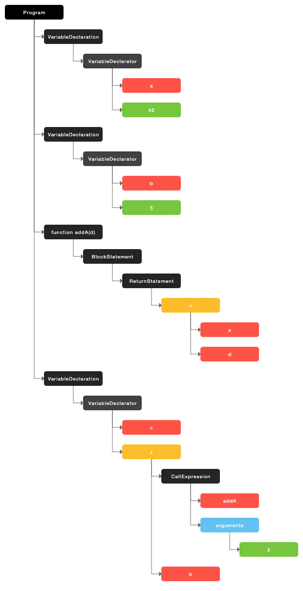

# AST 抽象语法树

# 目录

# AST 抽象语法树

## AST (Abstract Syntax Tree，抽象语法树) 

参考：

- [【简书】AST 介绍](https://www.jianshu.com/p/6fa90ee14d0e)
  资源&文章推荐

  - [Babel 插件手册](https://links.jianshu.com/go?to=https%3A%2F%2Fgithub.com%2Fjamiebuilds%2Fbabel-handbook%2Fblob%2Fmaster%2Ftranslations%2Fzh-Hans%2Fplugin-handbook.md)

  - [透過製作 Babel-plugin 初訪 AST](https://links.jianshu.com/go?to=https%3A%2F%2Fblog.arvinh.info%2F2018%2F08%2F25%2Fvisit-ast-with-babel-plugin%2F)

  - [AST 与前端工程化实战](https://links.jianshu.com/go?to=http%3A%2F%2Fwww.imooc.com%2Farticle%2F290884)


### 什么是AST？

AST (Abstract Syntax Tree，抽象语法树) ，是源代码语法结构的一种抽象表示。它以树状的形式表现编程语言的语法结构。

它由一堆节点（Node）组成，每个节点都表示源代码中的一种结构。不同结构用类型来区分，常见的类型有： Identifier(标识符)，BinaryExpression(二元表达式)，VariableDeclaration(变量定义)，FunctionDeclaration(函数定义)等。

AST是编译器看的。编译器会将源码转化成AST。如下源码:

```js
var a = 42;
var b = 5;
function addA(d) {
    return a + d;
}
var c = addA(2) + b;
```

会换转化成这样的AST:




### AST 的使用场景？

**TypeScript、babel、webpack、vue-cli** 得都是依赖 AST 进行开发的。

通过AST，可以将代码转化后，再输出。比如：

- 代码压缩。删除没用的空格，未使用的语句，变量名替换等。
- 代码高亮。
- 将 ES6 代码转换成 ES5 代码。
- 给 CSS 中的某些属性加浏览器前缀`-webkit-`。
- 将 CSS 中的px转化成rem。
- 生成代码。最近用了[ANT DESIGN PRO](https://links.jianshu.com/go?to=https%3A%2F%2Fpro.ant.design%2Findex-cn)。 ANT DESIGN PRO 中的 [umi](https://links.jianshu.com/go?to=https%3A%2F%2Fumijs.org%2F) 可以在生成页面的代码和路由时，修改路由配置的js。umi 这种方式，用户体验很好。因此，我准备用这种方式来改造我之前做的代码生成工具。修改路由配置需要通过AST来转换代码。


### 需要学习 AST 的哪些知识？

> ##### 了解AST常见节点的结构

了解AST常见节点的结构推荐通读下[AST node 规范](https://links.jianshu.com/go?to=https%3A%2F%2Fgithub.com%2Fbabel%2Fbabel%2Fblob%2Fmaster%2Fpackages%2Fbabel-parser%2Fast%2Fspec.md)。

> ##### 源码解析

将源码转化为AST。该步骤分为词法分析（Lexical Analysis）和 语法分析（Syntactic Analysis）。

解析 JavaScript 可以用[@babel/parser](https://links.jianshu.com/go?to=https%3A%2F%2Fbabeljs.io%2Fdocs%2Fen%2Fnext%2Fbabel-parser.html)(以前叫 [Babylon](https://links.jianshu.com/go?to=https%3A%2F%2Fgithub.com%2Fbabel%2Fbabylon))。

> ##### 转换

在遍历AST时，对指定的AST节点做新增，修改或删除操作。

转换可以用[@babel/traverse](https://links.jianshu.com/go?to=https%3A%2F%2Fbabeljs.io%2Fdocs%2Fen%2Fnext%2Fbabel-traverse.html)。

创建和验证节点可以用[@babel/types](https://links.jianshu.com/go?to=https%3A%2F%2Fbabeljs.io%2Fdocs%2Fen%2Fnext%2Fbabel-types.html)。创建AST节点代码示例见[这里](https://www.jianshu.com/p/b66593151f0f)。

> ##### 生成目标代码

将上一步转换过的AST，转化为目标代码，并生成源码映射（source maps）。

生成目标代码可以用[@babel/generator](https://links.jianshu.com/go?to=https%3A%2F%2Fbabeljs.io%2Fdocs%2Fen%2Fnext%2Fbabel-generator.html)


### 工具

- [AST 浏览器](https://links.jianshu.com/go?to=https%3A%2F%2Fastexplorer.net%2F)
- [AST 可视化工具](https://links.jianshu.com/go?to=https%3A%2F%2Fresources.jointjs.com%2Fdemos%2Frappid%2Fapps%2FAst%2Findex.html)
- npm 包
  - [recast](https://links.jianshu.com/go?to=https%3A%2F%2Fgithub.com%2Fbenjamn%2Frecast) AST工具库。解析AST(parse)，遍历AST，修改AST，生成代码。官方文档太简单了。
  - [@babel/template](https://links.jianshu.com/go?to=https%3A%2F%2Fbabeljs.io%2Fdocs%2Fen%2Fnext%2Fbabel-template.html) 它能让你编写字符串形式且带有占位符的代码来代替手动编码， 尤其是生成的大规模 AST的时候。 在计算机科学中，这种能力被称为准引用（quasiquotes）。


## Md解析原理（Lute工具）

参考：[Markdown 解析原理详解和 Markdown AST 描述](https://88250.b3log.org/articles/2020/04/23/1587637426085.html)

### 这篇文章中涉及的开源项目

- [CommonMark Spec](https://github.com/commonmark/commonmark-spec)
- [Lute](https://github.com/88250/lute) 一款对中文语境优化的 Markdown 引擎，支持 Go 和 JavaScript
- [Vditor](https://github.com/Vanessa219/vditor) 一款浏览器端的 Markdown 编辑器，支持所见即所得、即时渲染（类似 Typora）和分屏预览模式


### 编译原理

我们通过编译原理实现了 Lute ，大致步骤是 ① 预处理、② 词法分析、③ 语法分析、④ 代码生成 这几个步骤。


### 解析

Lute 的使用

```go
// Markdown 将 markdown 文本字节数组处理为相应的 html 字节数组。
// name 参数仅用于标识文本，比如可传入 id 或者标题，也可以传入 ""。
func (lute *Lute) Markdown(name string, markdown []byte) (html []byte) {
	tree := parse.Parse(name, markdown, lute.Options)
	renderer := render.NewHtmlRenderer(tree)
	html = renderer.Render()
	return
}
```

解析过程用于从 Markdown 原文构造抽象语法树。

```go
// Parse 会将 markdown 原始文本字节数组解析为一颗语法树。
func Parse(name string, markdown []byte, options *Options) (tree *Tree) {
	tree = &Tree{Name: name, Context: &Context{Option: options}}
	tree.Context.Tree = tree
	tree.lexer = lex.NewLexer(markdown)
	tree.Root = &ast.Node{Type: ast.NodeDocument}
	tree.parseBlocks()
	tree.parseInlines()
	tree.lexer = nil
	return
}
```


代码结构方面我们分为两部分：解析和渲染

- 渲染过程将遍历语法树生成 HTML 代码，本文略过
- 解析过程下面我们将着重介绍，从预处理阶段开始

#### ① 预处理

预处理阶段主要是将输入的 Markdown 文本字节数组结尾添加换行符 `\n`，以方便后续解析可以统一按行读取。

```go
// NewLexer 创建一个词法分析器。
func NewLexer(input []byte) (ret *Lexer) {
	ret = &Lexer{}
	ret.input = input
	ret.length = len(input)
	if 0 < ret.length && ItemNewline != ret.input[ret.length-1] {
		// 以 \n 结尾预处理
		ret.input = append(ret.input, ItemNewline)
		ret.length++
	}
	return
}
```


#### ② 词法分析

词法分析的目的是将 Markdown 文本转换为 token 数组。标准的编译原理中词法分析产生的 token 将带有如下这样一些属性：

- 类型（token type），比如标识符、操作符、数字、字符等
- 词素（lexeme），原始的文本字节数组
- 位置（pos），该 token 的第一个字节相对于整个文本字节数组的下标

Markdown 的词法分析进行了简化，仅返回词素作为 token，因为：

- Markdown 解析不需要类型信息，使用的标记符（比如 `#`、`*` 等）本身就是 token 类型和词素
- 大部分场景下的 Markdown 解析不需要实现[源码映射](https://88250.b3log.org/articles/2020/04/23/1587637426085.html#sourcemap)
- 提升性能

另外，编译原理教科书中是将词法分析和语法分析完全分开介绍的，即词法分析器产生 token 数组后作为参数传入语法分析器，而实际工程上因为性能考虑，是在语法分析中调用词法分析来按需获得 token 数组，这样可以减少内存分配。

Markdown 词法分析的具体实现是按行进行处理的，每次处理后词法分析器会记录当前读取位置，以便下次继续按行处理。

```go
// Lexer 描述了词法分析器结构。
type Lexer struct {
	input  []byte // 输入的文本字节数组
	length int    // 输入的文本字节数组的长度
	offset int    // 当前读取字节位置
	width  int    // 最新一个字符的长度（字节数）
}

// NextLine 返回下一行。
func (l *Lexer) NextLine() (ret []byte) {
	if l.offset >= l.length {
		return
	}

	var b, nb byte
	i := l.offset
	for ; i < l.length; i += l.width {
		b = l.input[i]
		if ItemNewline == b {
			i++
			break
		} else if ItemCarriageReturn == b {
			// 处理 \r
			if i < l.length-1 {
				nb = l.input[i+1]
				if ItemNewline == nb {
					l.input = append(l.input[:i], l.input[i+1:]...) // 移除 \r，依靠下一个的 \n 切行
					l.length--                                      // 重新计算总长
				}
			}
			i++
			break
		} else if '\u0000' == b {
			// 将 \u0000 替换为 \uFFFD
			l.input = append(l.input, 0, 0)
			copy(l.input[i+2:], l.input[i:])
			// \uFFFD 的 UTF-8 编码为 \xEF\xBF\xBD 共三个字节
			l.input[i], l.input[i+1], l.input[i+2] = '\xEF', '\xBF', '\xBD'
			l.length += 2 // 重新计算总长
			l.width = 3
			continue
		}

		if utf8.RuneSelf <= b { // 说明占用多个字节
			_, l.width = utf8.DecodeRune(l.input[i:])
		} else {
			l.width = 1
		}
	}
	ret = l.input[l.offset:i]
	l.offset = i
	return
}
```


#### ③ 语法分析

CommonMark 规范中介绍了一种[解析算法](https://spec.commonmark.org/0.29/#appendix-a-parsing-strategy)，分为两个阶段：

1. 构造所有块级节点，包括标题、块引用、代码块、分隔线、列表、段落等，还需要构造好链接引用定义映射表
2. 遍历每个块级节点，构造行级节点，包括文本、链接、强调、加粗等，链接的处理可能会需要查找步骤 1 中构造好的链接引用定义映射表

关于 CommonMark 规范的一些实现细节可参考我之前的笔记（[CommonMark 规范要点解读](https://hacpai.com/article/1566893557720)、[Lute 实现后记](https://hacpai.com/article/1567062979327)），这里就不展开了，如果感兴趣欢迎跟帖讨论。


#### ④ 代码生成


### 抽象语法树

Markdown 抽象语法树是由节点构成的树，从包含关系来说节点可以分为四类：

1. 根节点，可以包含所有其他任意节点
2. 块级容器节点，可以包含非根节点的其他任意节点，比如列表项包含段落
3. 块级节点，可以包含行级节点，比如段落包含强调
4. 行级节点，可以包含行级节点，比如强调包含文本

我们在实现 Lute 时做了“最细粒度”的节点结构，比如对于超链接 `[foo](bar)` 形成的节点结构包含了左方括号 `[`、链接文本 `foo`、右方括号 `]`、左圆括号 `(`、链接地址 `bar` 和右圆括号 `)`。这样做的优点是方便处理细致的节点操作，缺点是性能稍差，因为需要构造和遍历更多的节点。

如果你想看到较粗粒度的语法树，可以通过 [Vditor Markdown 编辑器](https://github.com/Vanessa219/vditor)的开发者工具来查看，请[到此](https://hacpai.com/guide/markdown)进行测试（点击编辑器工具栏上的“开发者工具”按钮就可以看到根据输入进行实时渲染的语法树了）。

下面我们按 Lute 源码中的[节点](https://github.com/88250/lute/blob/master/ast/node.go)类型常量顺序来逐一描述。