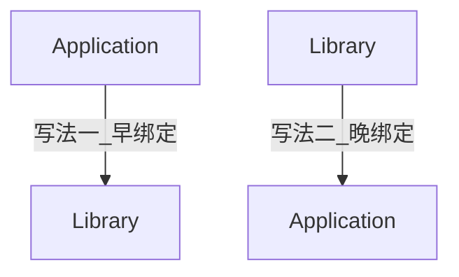
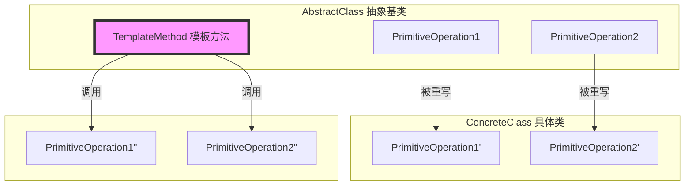

# 模板模式 Template Method

极简一句话：我定义好一个有多项工作的流程，交给你定义这些工作的内容

全程 `模板方法模式`，有时简称 `模板方法`，有时简称 `模板模式`

## 所属分类——“组件协作” 模式

- “组件协作” 模式

  - 现代软件专业分工之后的第一个结果是 “框架与应用程序的划分”

    “组件协作” 模式通过`晚期绑定`，来实现框架与应用程序之间的松耦合，是二者之间协作时常用的模式
    
  - 其实应该是指的是程序库和运行代码之间的协作时的松耦合吧

- 典型模式
  - 模板方法 Template Method
  - 策略模式 Strategy
  - 观察模式 Observer（也叫事件模式 Event） 

## 动机（Motivation）

### 简概

- 在软件构建过程中，对于某一项任务，它常常有**稳定**的整体操作结构，但各个子步骤却有很多**改变**的需求，或者由于固有的原因（比如框架与应用之间的关系）而无法和任务的整体结构同时实现
- 如何在确定稳定操作结构的前提下，来灵活应对各个子步骤的变化或者晚期实现需求？

### 核心：提供模板、早绑定变晚绑定

比较早绑定变晚绑定

- 区别
  - 早绑定：一个晚的东西绑定一个早的东西，即 “晚绑定早”，传统主流写法
  - 晚绑定：一个早的东西绑定一个晚的东西，面向对象的写法、**Template Method的面向对象设计模式**



- 比较
  - 这里是假设 “程序主流程”，是属于相对稳定的东西，是一个Template Method
  - 那么在这个例子中，晚绑定能把变化的东西抽离出来，减少运行代码中需要写的东西
- 形象比喻
  - 早绑定：我打印了一份表格（早对象），里面大多数空格已经自动填好了，让对方将剩下的内容（晚对象）给填上即可
  - 晚绑定：我告诉你你需要提交一个表格，大多数内容告诉你了，让对方将自己要自定义的东西给补充进去再顺便把表格给打出来

### 代码体现

按一定流程分别实现多个函数，这些函数有的是库类提供的，有的是应用程序开发人员提供的

#### 举例 - 写法1

程序库代码

```c++
// 程序库开发人员
class Library{
public:
	void step1(){
		// ...
	}
	void step3(){
		// ...
	}
	void step5(){
        // ...
	}
};
```

应用程序代码

```c++
// 应用程序开发人员
class Application{
public:
	bool step2(){
		// ...
	}
	void step4(){
		//...
	}
}

int main()
{
	Library lib();
    Application app();
    
    lib.Step1();

	if (app.step2()){
		lib.Step3();
	}
    
	for (int i = 0; i < 4; i++){
		app.step4();
	}

    lib.step5();
}
```

#### 举例 - 写法2（**Template Method的设计模式**）

程序库代码

```c++
// 程序库开发人员
class Library{	// 有纯虚函数
public:
	// 稳定template method
    void Run(){
		step1();
        
		if (Step2()){	// 支持变化==>虚函数的多态调用
			step3();
		}
        
		for (int i = 0; i < 4; i++){
			step4();	// 支持变化==>虚函数的多态调用
		}

        step5();
    }
    virtual ~Library(){}
    
protected :
	void Step1() {	// 稳定
		//.....
	}
	void step3() {	// 稳定
		//.....
	}
	void step5(){	// 稳定
		//.....
	}
	virtual bool step2() = 0;	// 变化
    virtual void step4() = 0;	// 变化
}
```

应用程序代码

```c++
//应用程序开发人员
class Application : public Library {
protected :
	virtual bool step2(){
		//...子类重写实现
	}
	virtual void step4(){
		//...子类重写实现
	}
};

int main()
{
	Library* pLib = new Application();	// 注意这里是个多态指针，声明类型为Library但实际类型却是Application
    									// 当调用虚函数时，就会按照虚函数动态绑定的规则来调用
    lib->Run;
    delete qLib;
}
```

#### 比较两种写法

- 写法一：结构化软件设计流程
  - Library开发人员：(1) 开发1、3、5三个步骤
  - Application开发人员：(1) 开发2、4两个步骤，(2) 程序主流程
- 写法二：面向对象软件设计流程（**Template Method的设计模式**）
  - Library开发人员：(1) 开发1、3、5三个步骤，(2) 程序主流程
  - Application开发人员：(1) 开发2、4两个步骤

## 设计模式

### 模式定义

> 定义一个操作中的算法的骨架**（稳定）**，而将一些步骤延迟**（变化）**到子类中。
> Template Method 使得子类可以不改变**（复用）**一个算法的结构即可重定义（override 重写）该算法的某些特定步骤。
>
> ——《设计模式》GoF

### 结构（Structure）

（红色表示稳定）



### 结合程序

- 稳定的代码写成非虚函数，需要变化的代码写成虚函数

类曲同工

- 如果在C中要做到这一点，就是传函数指针了（其实虚函数调用本质也是调用函数指针）
- 如果在js中要做到这一点，可以使用回调函数
- 但无疑C++面向对象的写法更加具有抽象性、简洁

### 要点总结

- Template Method模式是一种非常基础性的设计模式，在面向对象系统中有着**大量的应用**。它用最简洁的机制（**虚函数的多态性**）为很多应用程序框架提供了灵活的扩展点，是代码复用方面的基本实现结构。
- 除了可以灵活应对子步骤的变化外，“不要调用我，让我来调用你” 的**反向控制结构**是Template Method的典型应用。
- 在具体实现方面，被Template Method调用的虚方法可以具有实现，也可以没有任何实现（抽象方法、纯虚方法），但一般**推荐将它们设置为protected方法**


