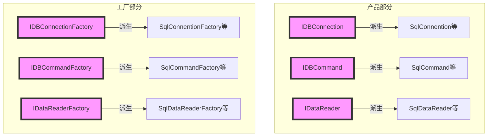
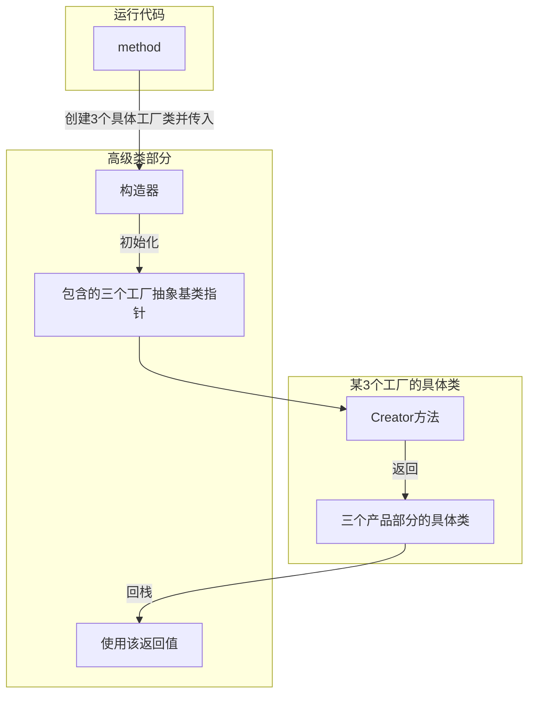
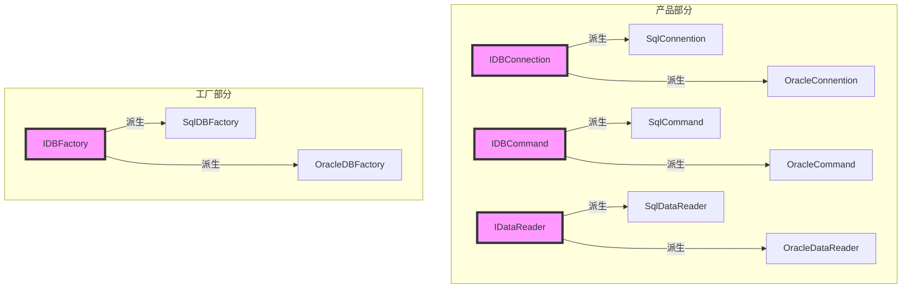
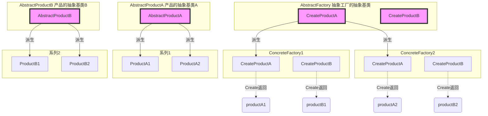

# 《C++设计模式》视频_李建忠

# 目录

[toc]

# 抽象工厂

全程 `工厂方法模式`，有时简称 `工厂方法`，有时简称 `工厂模式`

## 所属分类——“对象创建” 模式

[省略]

## 动机（Motivation）

### 简概

- 在软件系统中，经常面临着 **“一系列相互依赖的对象"** 的创建工作；同时，由于需求的变化，往往存在更多系列对象的创建工作。
- 如何应对这种变化？如何绕过常规的对象创建方法（new），提供一种 “封装机制" 来避免客户程序和这种 “**多系列**具体对象创建工作” 的紧耦合？

### 代码体现2

访问数据、访问数据库

考虑时间轴：可以访问多种数据库

#### 举例 - 写法1

高级类

```c++
class EmployeeDAO{
public:
	vector<EmployeeD0>GetEmployees(){
		sqlConnection* connection = new sqlConnection() ;	// 数据库连接
		connection->ConnectionString("...");
        
        sqlCommand* command = new sqlCommand() ;			// SQL语句
        command->CommandText("...");
        command->SetConnection(connection);	//关联性
        
		sqlDataReader* reader = command->ExecuteReader();	// 数据库数据读取
        while (reader->Read()){

        }
    }
};
```

#### 举例 - 写法2（工厂方法）

抽象基类

```c++
// 数据库访问有关基类
class IDBConnection{		// 数据库连接
    
};

class IDBCommand{			// 数据库SQL语句
    
};

class IDataReader{			// 数据库数据读取
    
};

// 工厂抽象基类
class IDBConnectionFactory{	// 工厂 - 数据库连接
public:
    virtual IDBConnection* CreateDBConnection()=0;
};

class IDBCommandFactory{	// 工厂 - 数据库SQL语句
public:
    virtual IDBCommand* CreateDBCommand()=0;
};

class IDataReaderFactory{	// 工厂 - 数据库数据读取
public:
    virtual IDataReader* CreateDataReader()=0;
};
```

系列扩展

```c++
// 支持SQL Server
class SqlConnention: public IDBConnection{
    
};

class SqlCommand: public IDBCommand{
    
};

class SqlDataReader: public IDataReader{
    
};

// 工厂具体类 - 支持SQL Server
class SqlConnentionFactory: public IDBConnectionFactory{
    
};
class SqlCommandFactory: public IDBCommandFactory{
    
};
class SqlDataReaderFactory: public IDataReaderFactory{
    
};

// 支持Oracle
class OracleConnention: public IDBConnection{
    
};

class OracleCommand: public IDBCommand{
    
};

class OracleDataReader: public IDataReader{
    
};

// 工厂具体类 - 支持Oracle
// [省略]...
// [省略]...
// [省略]...
```

高层类

```c++
// 运行 - 高级类
class EmployeeDAO{
    IDBConnectionFactory* dbConnectionFactory;
    IDBCommandFactory* dbCommandFactory;
    IDataReaderFactory* dbDataReaderFactory;
    
public:
	vector<EmployeeD0>GetEmployees(){
		IDBConnection* connection = dbConnectionFactory->CreateDBConnection;// 【修改】声明为抽象基类的多态指针，且尝试绕过new
		connection->ConnectionString("...");
        
        IDBCommand* command = dbCommandFactory->CreateDBCommand;			// 【修改】声明为抽象基类的多态指针，且尝试绕过new
        command->CommandText("...");
        command->SetConnection(connection);	//关联性
        
		IDBDataReader* reader = command->CreateDataReader;//关联性			  // 【修改】声明为抽象基类的多态指针，且尝试绕过new
        while (reader->Read()){

        }
    }
};
```

#### 分析 - 写法2（工厂方法）

代码结构



运行时



分析，存在的问题

- 工厂之间具有关联性

#### 举例 - 写法3（抽象工厂）

抽象基类

```c++
// 数据库访问有关基类
class IDBConnection{		// 数据库连接
    
};

class IDBCommand{			// 数据库SQL语句
    
};

class IDataReader{			// 数据库数据读取
    
};

// 工厂抽象基类
class IDBFactory{									// 【修改】工厂 - 合并为一个通用的
public:
    virtual IDBConnection* CreateDBConnection()=0;
    virtual IDBCommand* CreateDBCommand()=0;
    virtual IDataReader* CreateDataReader()=0;
};
```

系列扩展

```c++
// 支持SQL Server
class SqlConnention: public IDBConnection{
    
};

class SqlCommand: public IDBCommand{
    
};

class SqlDataReader: public IDataReader{
    
};

// 工厂具体类 - 支持SQL Server
class SqlDBFactory: public IDBFactory{				// 【修改】工厂SQL - 合并为一个通用的
   
};

// 支持Oracle
class OracleConnention: public IDBConnection{
    
};

class OracleCommand: public IDBCommand{
    
};

class OracleDataReader: public IDataReader{
    
};

// 工厂具体类 - 支持Oracle
// 略...
// 略...
// 略...
```

高层类

```c++
// 运行 - 高级类
class EmployeeDAO{
    IDBFactory* dbFactory;							// 【修改】合并为一个通用的，抽象工厂指针。会被传入工厂具体类
													// 传入SqlDBFactory或OracleDBFactory，用来代表一个系列。【妙啊！！！】
public:
	vector<EmployeeD0>GetEmployees(){
		IDBConnection* connection = dbFactory->CreateDBConnection;
		connection->ConnectionString("...");
        
        IDBCommand* command = dbFactory->CreateDBCommand;
        command->CommandText("...");
        command->SetConnection(connection);	//关联性
        
		IDBDataReader* reader = command->CreateDataReader;//关联性
        while (reader->Read()){

        }
    }
};
```

#### 分析 - 写法3（抽象工厂）

代码结构



## 设计模式

### 模式定义

> 提供一个接口,让该接口负责创建一系列 **"相关或者相互依赖的对象”**，无需指定它们具体的类。
>
> ——《设计模式》GoF

### 结构（Structure）

（红色表示稳定）



### 要点总结

- 如果没有应对 “**多系列**对象构建” 的需求变化，则没有必要使用Abstract Factory模式，这时候使用简单的工厂完全可以

- “**系列**对象" 指的是在某一特定系列下的对象之间有相互依赖、或作用的关系。不同系列的对象之间不能相互依赖

  （结合代码就是：SqlConnention和SqlCommand依赖，而不能与OracleConnention依赖）

- Abstract Factory模式主要在于应对 “新**系列**" 的需求变动。其缺点在于难以应对 “新对象” 的需求变动

### 个人体会

#### 【对比】抽象工厂和工厂方法

可以说工厂方法是抽象工厂中的一个特例

#### 怎么理解 “系列” 的变化

比如结合代码：需要增添新的数据库


