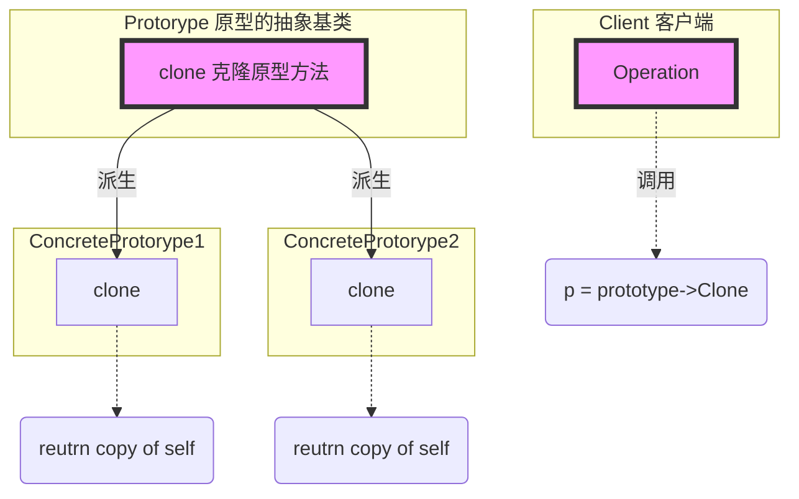

# 《C++设计模式》视频_李建忠

# 目录

[toc]

# 原型模式 Prototype

也有叫克隆模式的

## 所属分类——“对象创建” 模式

[省略]

## 动机（Motivation）

### 简概

- 在软件系统中，经常面临着 “某些结构复杂的对象” 的创建工作；
  由于需求的变化，这些对象经常面临着剧烈的变化，但是它们却拥有比较稳定一致的接口。
- 如何应对这种变化？如何向 “客户程序（使用这些对象的程序）” 隔离出 “这些易变对象” ，从而使得 “依赖这些易变对象的客户程序" 不随着需求改变而改变？

### 代码体现

文件分割器的例子

#### 举例 - 写法1（工厂方法）

抽象基类（产品类和工厂类）ISplitterFactory.cpp

```c++
//抽象类
class ISplitter{
public:
	virtual void split( )=0;
    virtual ~ISplitter(){}
};

//工厂基类
class splitterFactory{
public:
	virtual ISplitter* CreateSplitter( )=0;
    virtual ~SplitterFactory( ){}
};
```

具体类

```c++
/* 具体分割器 */
class BinarySplitter : public ISplitter
{
public:
	void split( ){
		//...
	}
};

class TxtSplitter : public ISplitter{
    
};

class PictureSplitter : public ISplitter{
    
};

class VideoSplitter : public ISplitter{
    
};

/* 具体工厂	*/
class BinarySplitterFactory: public SplitterFactory{
public:
    virtual ISplitter* CreateSplitter(){
        return new BinarySplitter();
    }
}

class TxtSplitterFactory: public SplitterFactory{
public:
    virtual ISplitter* CreateSplitter(){
        return new TxtSplitter();
    }
}

class PictureSplitterFactory: public SplitterFactory{
public:
    virtual ISplitter* CreateSplitter(){
        return new PictureSplitter();
    }
}

class VideoSplitterFactory: public SplitterFactory{
public:
    virtual ISplitter* CreateSplitter(){
        return new VideoSplitter();
    }
}
```

高层类

```c++
class MainForm : public Form
{
    SplitterFactory* factory;
public:
    MainForm(SplitterFactory* factory){
        this->factory=factory;
    }
    
	void Button1_click(){
		string filePath = txtFilePath->getText();
		int number = atoi(txtFileNumber->getText().c_str());
        ISplitter* splitter = factory->CreateSplitter();
		splitter->split();
	}
};
```

#### 举例 - 写法2（原型模式）

抽象基类（合并了产品类和工厂类的抽象基类）

```c++
class ISplitter{								// 【修改】把产品类和工厂类合并起来了，为原型对象的抽象基类
public:
	virtual void split( )=0;
	virtual ISplitter* clone()=0;				// 【修改】更改Create函数名为clone，通过克隆自己来创建对象
    
    virtual ~ISplitter(){}
};
```

具体类（合并了产品类和工厂类的具体类）

```c++
class BinarySplitter : public ISplitter			// 【修改】合并原具体分割器和工厂，为原型对象的具体类
{
public:
	void split( ){
		//...
	}
    virtual ISplitter* clone(){					// 【修改】克隆，通过拷贝构造函数的方式
        return new BinarySplitter(*this);
    }
};

class TxtSplitter : public ISplitter{
    virtual ISplitter* clone(){
        return new TxtSplitter(*this);
    }
};

class PictureSplitter : public ISplitter{
    virtual ISplitter* clone(){
        return new PictureSplitter(*this);
    }
};

class VideoSplitter : public ISplitter{
    virtual ISplitter* clone(){
        return new VideoSplitter(*this);
    }
};
```

高层类

```c++
class MainForm : public Form
{
    ISplitter* prototype;							// 【修改】声明为原型对象（原来是声明为工厂对象）
public:
    MainForm(SplitterFactory* prototype){			// 【修改】传入prototype
        this->factory=factory;
    }
    
	void Button1_click(){
        ISplitter* splitter = prototype->clone();	// 【修改】克隆原型，通过克隆原型得到新对象（原型对象不能直接使用，只是用来克隆的）
		prototype->split();
	}
};
```

## 设计模式

### 模式定义

> 使用**原型实例**指定创建对象的种类，然后通过拷贝（深克隆）这些原型来创建新的对象。
>
> ——《设计模式》GoF

### 结构（Structure）

（红色表示稳定）



### 要点总结

- Prototype模式同样用于隔离类对象的使用者和具体类型（易变类）之间的耦合关系，它同样要求这些 “易变类” 拥有 “稳定的接口” 
  （这点和Factory Method一样）
- Prototype模式对于 “如何创建易变类的实体对象" 采用 “原型克隆" 的方法来做，它使得我们可以非常灵活地动态创建 “拥有某些稳定接口" 的新对象——所需工作仅仅是注册一个新类的对象（即原型），然后在任何需要的地方Clone
  （这点和Factory Method不同）
- Prototype模式中的Clone方法可以利用某些框架中的序列化来实现深拷贝

### 个人体会

#### 【对比】原型模式和工厂方法

当对象结构比较复杂，原型模式只需要定好状态，克隆出来就可以了

用得不如工厂模式多


