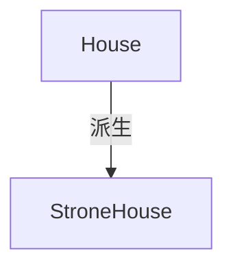
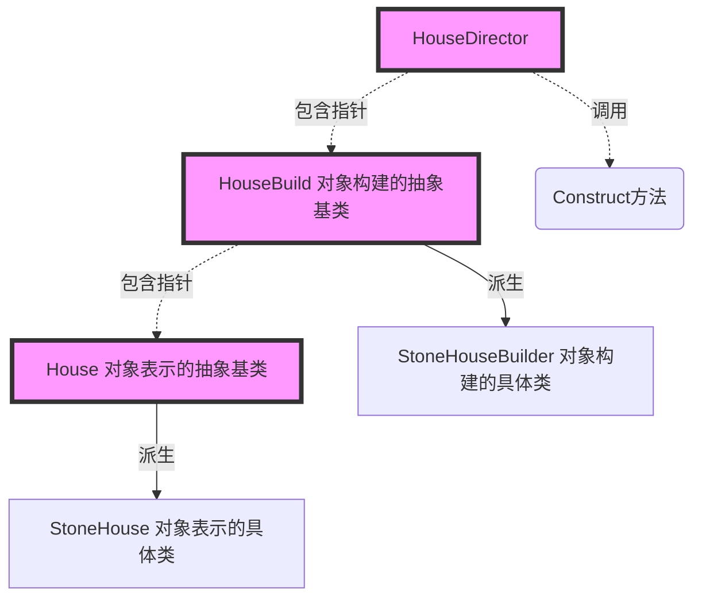
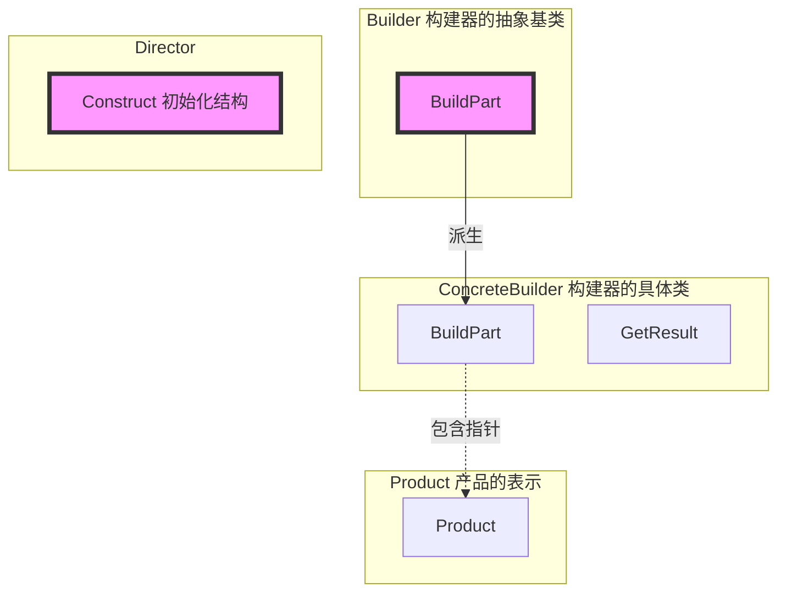

# 《C++设计模式》视频_李建忠

# 目录

[toc]

# 构建器 Builder

==（注意，李建忠视频中关于这集的剪辑有问题。==

==（观看顺序：0:00~9:12  -  13:00~17:00  -  9:12~13:00  -  17:00~END）==

## 所属分类——“对象创建” 模式

[省略]

## 动机（Motivation）

### 简概

- 在软件系统中，有时候面临着 “一个复杂对象" 创建工作，其通常由各个部分的子对象用一定的算法构成；
  由于需求的变化，这个复杂对象的各个部分经常面临着剧烈的变化，但是将它们组合在一起的算法却相对稳定（听起来有点像Template Method）
- 如何应对这种变化？如何提供一种 “封装机制" 来隔离出 “复杂对象的各个部分” 的变化，从而保持系统中的 “稳定构建算法" 不随着需求改变而改变？

### 代码体现

#### 举例 - 写法1

抽象基类

```c++
class House {
public:
    /** 然后注意一下
     *
     * C++比较特殊
     * 这里的Init不能改写成构造函数House()
     * 如果在C++中构造函数调用虚函数，会完成 "静态绑定"
     * 而虚函数还没定义，最后会报错
     * 而且子类构造要先调用父类构造，程序就不对了
     * 
     * 但在Java、C#中，会是 "动态绑定"，可以将这里写成构造函数
     */
	void Init(){						// 初始化，有点像Template Method
		this->BuildPart1();
		for (int i = 0; i < 4; i++){
			this->BuildPart2();
		}
        bool flag=this->BuildPart3();
        if(flag){
			this->BuildPart4();
		}
		this->BuildPart5();
	}
    virtual ~House(){}
    
protected:
	virtual void BuildPart1()=0;
    virtual void BuildPart2()=0;
    virtual void BuildPart3()=0;
    virtual void BuildPart4()=0;
    virtual void BuildPart5()=0;
};
```

具体类

```c++
class StoneHouse: public House{
protected:
    virtual void BuildPart1(){
        
    }
    virtual void BuildPart2(){
        
    }
    virtual void BuildPart3(){
        
    }
    virtual void BuildPart4(){
        
    }
    virtual void BuildPart5(){
        
    }
}
```

运行代码

```c++
int main(){
    House* pHouse=new StoneHouse();
    pHouse->Init();
}
```

#### 分析 - 写法1

代码结构



#### 举例 - 写法2（构建器）

抽象基类

```c++
class House{									// 【分离1】抽象基类，对象的表示
    //...
};

class HouseBuild {								// 【分离2】抽象基类，对象的构建
public:
    House* GetResult(){							// 【新增】返回指针
        return pHouse;
    }
    virtual ~HouseBuild(){}
    
protected:
    House* pHouse;								// 【新增】包含
	virtual void BuildPart1()=0;
    virtual void BuildPart2()=0;
    virtual void BuildPart3()=0;
    virtual void BuildPart4()=0;
    virtual void BuildPart5()=0;
};
```

具体类

```c++
class StoneHouse: public House{					// 【分离1】具体类，对象的表示
	//...
}

class StoneHouseBuilder: public HouseBuilder{	// 【分离2】具体类，对象的构建
protected:
    virtual void BuildPart1(){
        //pHouse->Part1 = ...;
    }
    virtual void BuildPart2(){
        
    }
    virtual void BuildPart3(){
        
    }
    virtual void BuildPart4(){
        
    }
    virtual void BuildPart5(){
        
    }
}

// 高级类
class HouseDirector{							// 【分离】抽离初始化的代码
public:
    HouseBuilder* pHouseBuilder; 				// 【新增】包含
    
    HouseDirector(HouseBuilder* pHouseBuilder){	// 【新增构造函数】
        this->pHouseBuilder=pHouseBuilder
    }
    
    House* Construct(){	// 初始化
		pHouseBuilder->BuildPart1();
		for (int i = 0; i < 4; i++){
			pHouseBuilder->BuildPart2();
		}
        bool flag=pHouseBuilder->BuildPart3();
        if(flag){
			pHouseBuilder->BuildPart4();
		}
		pHouseBuilder->BuildPart5();
        
        return pHouseBuilder->GerResult();		// 【新增】返回House*指针
	}
};
```

运行代码

```c++
int main(){
    House* pHouse=new StoneHouse();
    pHouse->Init();
}
```

#### 分析 - 写法2

代码结构



## 设计模式

### 模式定义

> 将一个复杂对象的**构建与其表示相分离**，使得同样的构建过程（稳定）可以创建不同的表示（变化）。
>
> ——《设计模式》GoF

### 结构（Structure）

（红色表示稳定）




### 要点总结

- Builder模式主要用于 “分步骤构建一个复杂的对象” 。在这其中 “分步骤” 是一个**稳定**的算法，而复杂对象的各个部分则经常**变化**
- 变化点在哪里，封装哪里 —— Builder模式主要在于应对 “复杂对象各个部分" 的**频繁需求变动**。其缺点在于难以应对 “分步骤构建算法” 的需求变动
- 在Builder模式中，要注意不同语言中构造器内调用虚函数的差别（C++ vs C#）

# （说实话不是很懂这个结构）


