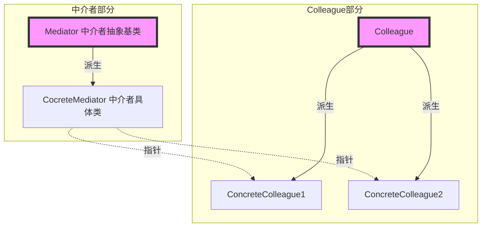
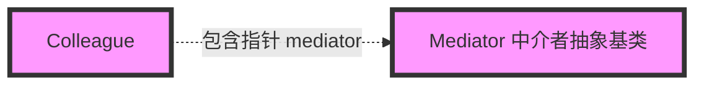

# 《C++设计模式》视频_李建忠

# 目录

[toc]

# 中介者 Mediator

## 所属分类——“接口隔离” 模式

略

## 动机（Motivation）

### 简概

- 在软件构建过程中，经常会出现多个对象互相关联交互的情况，对象之间常常会维持一种复杂的引用关系，如果遇到一些需求的更改，这种直接的引用关系将面临不断的变化。
- 在这种情况下，我们可使用一个 **“中介对象"** 来管理对象间的关联关系，避免相互交互的对象之间的紧耦合引用关系，从而更好地抵御变化

### 应用体现

界面中控件更改影响DataModel，DataModel更改时也能影响控件（即双向绑定），可能会出现双向的互相依赖

类似于MVVM（Model-View-ViewModel，模型-视图-视图模型）本质上就是MVC （Model-View-Controller，模型-视图-控制器 ）的改进版

类似于Vue（Vue中，`v-bind`/` :`应该用的是观察者模式，而`v-model`双向绑定应该是用的中介者模式）

### 代码体现

无

## 设计模式

### 模式定义

> 用一个**中介对象**来**封装（封装变化）**一系列的对象**交互**。
> 中介者使各对象不需要显式的相互引用（编译时依赖 → 运行时依赖），从而使其耦合松散（管理变化），而且可以独立地改变它们之间的交互。
>
> ——《设计模式》GoF

### 结构（Structure）

（红色表示稳定）

其中注意：ConcreteColleague1和CocreteClooeague2之间没有依赖关系

### 要点总结

- 将多个对象间复杂的关联关系解耦，Mediator模式将多个对象间的控制逻辑进行集中管理，
  **变 “多个对象互相关联” 为 “多个对象和一个中介者关联”**，简化了系统的维护，抵御了可能的变化。
- 随着控制逻辑的复杂化，Mediator具体对象的**实现可能相当复杂**。这时候可以对Mediator对象进行分解处理。
- Facade模式是**解耦系统间**（单向）的对象关联关系；Mediator模式是**解耦系统内**各个对象之间（双向）的关联关系。

