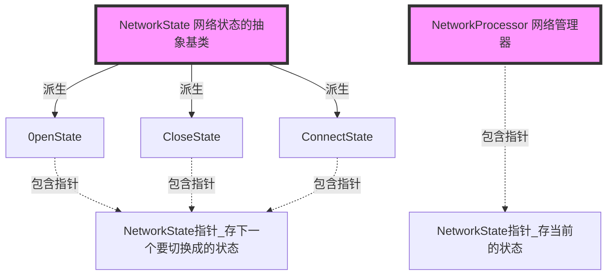
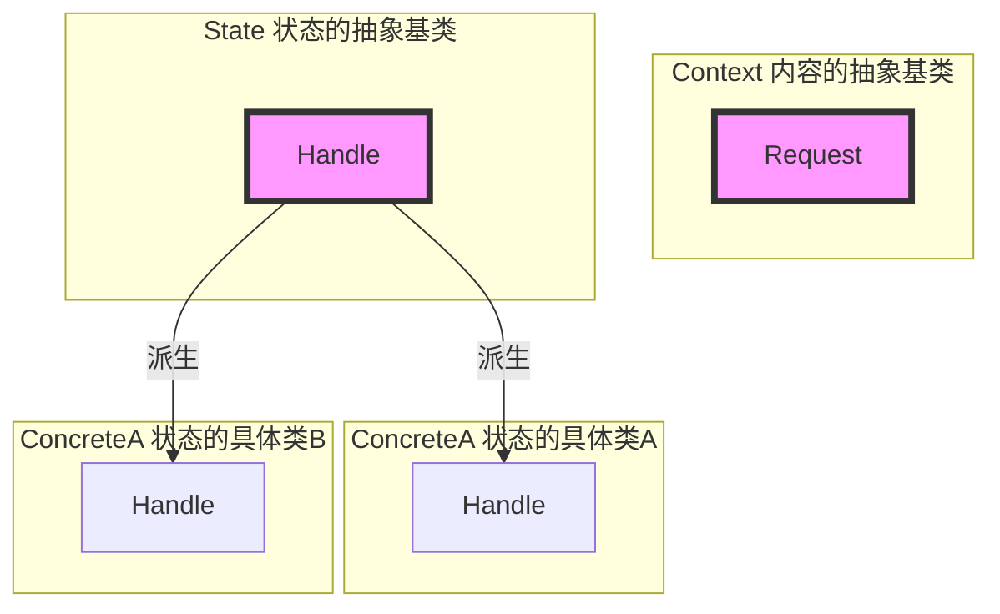
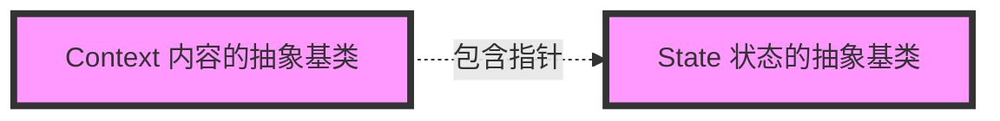

# 《C++设计模式》视频_李建忠

# 目录

[toc]

# 状态模式 State

## 所属分类——“状态变化” 模式

- "状态变化" 模式
  - 在组件构建过程中，**某些对象的状态经常面临变化**，如何对这些变化进行有效的管理？同时又维持高层模块的稳定？
    “状态变化" 模式为这一问题提供了一种解决方案
- 典型模式
  - 状态模式 State
  - 备忘录模式 Memento

## 动机（Motivation）

### 简概

- 在软件构建过程中，某些对象的**状态如果改变，其行为也会随之而发生变化**，
  比如文档处于只读状态，其支持的行为和读写状态支持的行为就可能完全不同。
- 如何在运行时根据对象的状态来透明地更改对象的行为？而不会为对象操作和状态转化之间引入紧耦合？

### 代码体现

网络状态

#### 举例 - 写法1

状态枚举

```c++
enum NetworkState{							// 枚举类型
	Network_Open,
    Network_Close,
    Network_Connect,
    Network_Wait										// 【新增】
};
```

网络管理器类

```c++
class NetworkProcessor{						// 网络管理器类
	NetworkState state;						// 创建枚举实例
public:
	void Operation1(){						// 操作一
		if( state == Network_Open){			// 若打开
			//***
			state = Network_Close;
		}
		else if (state == Network_Close){	// 若关闭
            //...
            state = Network_Connect;
        }
        else if(state == Network_Connect){	// 若连接
            //$$$
            state = Network_Open;
        }
        else if(...){									// 【新增】
            
        }
    }
    void Operation2(){						// 操作二
		if( state == Network_Open){			// 若打开
			//***
			state = Network_Connect;
		}
		else if (state == Network_Close){	// 若关闭
            //...
            state = Network_Open;
        }
        else if(state == Network_Connect){	// 若连接
            //$$$
            state = Network_Close;
        }
    }
    void Operation3(){						// 操作三
		
    }
};
```

就代码而言很像 “策略模式 Strategy”

上面代码所存在的问题也是：违背了开闭原则

而且策略模式也是能够解决if-else

#### 举例 - 写法2

几乎完全换了一种写法

状态对象。不同状态的next指针不同，切换时用自身包含的next指针代替自身指针

```c++
// 【新增】状态的抽象基类（原来是用枚举类型来表示）
class NetworkState{
public:
    NetworkState* pNext;						// 【新增】状态类型指针，用来存储下一个要切换成的状态
    virtual void Operation1()=0;
    virtual void Operation2()=0;
    virtual void Operation3()=0;
    
    virtual ~NetworkState(){}
};

// 状态的具体类
class 0penState: public NetworkState{			// 处于打开状态时，继承NetworkSate
	static NetworkState* m_instance;			// 包含NetworkSate，用来存储下一个要切换成的状态
public:
	static NetworkState* getInstance(){			// getInstace方法，使自身变回下一个要切换成的状态法
		if (m_instance ==nullptr) {				// （如果没有要切换的状态则返回自己）
			m_instance = new 0penState();
		}
		return m_instance;
	}
	void 0peration1(){							// 操作一
		//***
		pNext = CloseState::getInstance();
	}
    void Operation2(){							// 操作二
        //...
        pNext = ConnectState::getInstance();
    }
    void Operation3(){							// 操作三
        //$$$
        pNext = OpenState::getInstance();
    }
};

class CloseState: public NetworkState{			// 处于关闭状态时，继承NetworkSate

};
    
class ConnectState: public NetworkState{		// 处于连接状态时，继承NetworkSate

};
```

网络管理器类

```c++
class NetworkProcessor{						// 网络管理器类
	NetworkState* pState;								// 【修改】创建状态对象抽象基类的指针
public:
    NetworkProcessor(NetworkState* pState){				// 【修改】传入当前状态，即状态对象具体类
        this->pState = pState;
    }
	void Operation1(){						// 操作一
		//...
        pState->Operation1();							// 【修改】变为多态调用
        pState = pState->pNext;							// 【【核心】】切换时用自身包含的next指针代替自身指针
        //...
    }
    void Operation2(){						// 操作二
		//...
        pState->Operation2();							// 【修改】变为多态调用
        pState = pState->pNext;
        //...
    }
    void Operation3(){						// 操作三
		
    }
};
```

#### 举例 - 写法2

重构思路

- 状态可能会增多，而Operation却相对稳定。所以让状态去继承同一个抽象基类，状态去实现Operation，以便进行扩展

代码结构



## 设计模式

### 模式定义

> 允许一个对象在其内部状态改变时改变它的行为。从而使对象看起来似乎修改了其行为。
>
> ——《设计模式》GoF

### 结构（Structure）

（红色表示稳定）





### 要点总结

- State模式将所有与一个特定状态相关的行为都放入一个State的子类对象中，在对象状态切换时，切换相应的对象；
  但同时维持State的接口，这样实现了**具体操作与状态转换之间的解耦**。
- 为不同的状态引入不同的对象使得**状态转换变得更加明确**，而且可以保证不会出现状态不一致的情况，因为**转换是原子性的**——即要么彻底转换过来，要么不转换。
- 如果State对象没有实例变量，那么各个上下文可以共享同一个State对象，从而节省对象开销。

### 个人体会

和策略模式非常相像。感觉是多了 “状态转换” 的需求，通过状态类包含pNext指针来实现


