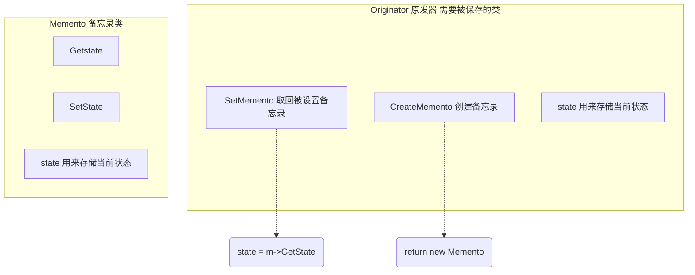
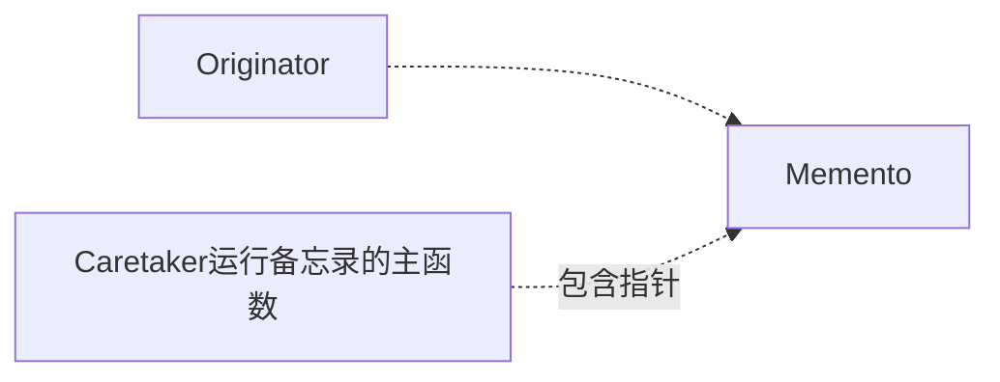

# 《C++设计模式》视频_李建忠

# 目录

[toc]

# 备忘录 Memento

英语小笔记

- -mem-，记录记忆的意思
  - **mem**ento，备忘录，纪念品
  - **mem**ory，记忆，内存
  - **mem**ber，成员、家庭成员
  - re**mem**ber，记得
    - remind，提醒
    - remaid，剩下

## 所属分类——“状态变化” 模式

略

## 动机（Motivation）

### 简概

- 在软件构建过程中，某些对象的状态在转换过程中，可能由于某种需要，要求程序能够**回溯到对象之前处于某个点时的状态**。
  如果使用一些公有接口来让其他对象得到对象的状态，便会暴露对象的细节实现。
- 如何实现对象状态的良好保存与恢复？但同时又不会因此而破坏对象本身的封装性。

### 代码体现

需要给对象拍一个快照

#### 举例 - 代码（备忘录模式）

```c++
class Memento									// 备忘录类
{
	string state;
    //...
public:
	Memento(const string & s) : state(s) {}		// 存入状态
    string getState() const {return state;}		// 取出状态
	void setstate(const string & s){state = s;}	// 存入状态（此处该函数同构造函数）
};

class 0riginator								// 起源，需要被保存的类
{
	string state;
    //...
public:
	0riginator() {}
	Memento createMomento( ) {					// 【快照】
		Memento m(state) ;						// 传入state，并创建备忘录类。这个过程实际中可能会比较复杂
		return m;
	}
	void setMomento(const Memento & m) {		// 【恢复】
        state = m.getState();					// 从备忘录中恢复状态
    }
};

int main()
{
    Originator orginator;
    
    // 存储到备忘录
    Memento mem = orginator.createMomento();
    
    // ... 改变orginator状态
    
    // 从备忘录中恢复
    orginator.setMomento(memento);
}
```

## 设计模式

### 模式定义

> 在不破坏封装性的前提下，捕获一个对象的内部状态，并在该**对象之外保存**这个状态。这样以后就可以将该对象恢复到原先保存的状态。
>
> ——《设计模式》GoF

### 结构（Structure）





### 要点总结

- 备忘录（Memento）存储原发器（Originator）对象的内部状态，在需要时恢复原发器状态
- Memento模式的核心是信息隐藏，即Originator需要向外接隐藏信息，保持其封装性。但同时又需要将状态保持到外界（Memento）
- 由于现代语言运行时（如C#、Java等）都具有相当的对象序列化支持，因此往往采用效率较高、又较容易正确实现的序列化方案来实现Memento模式

### 个人总结

（**有人认为这种模式比较过时**，毕竟这种模式是94年提出来的，95年才有Java。Java好像可以用反射来做？）

这个模式理解起来挺简单的，实现可能会比较复杂。也有点像原型模式


