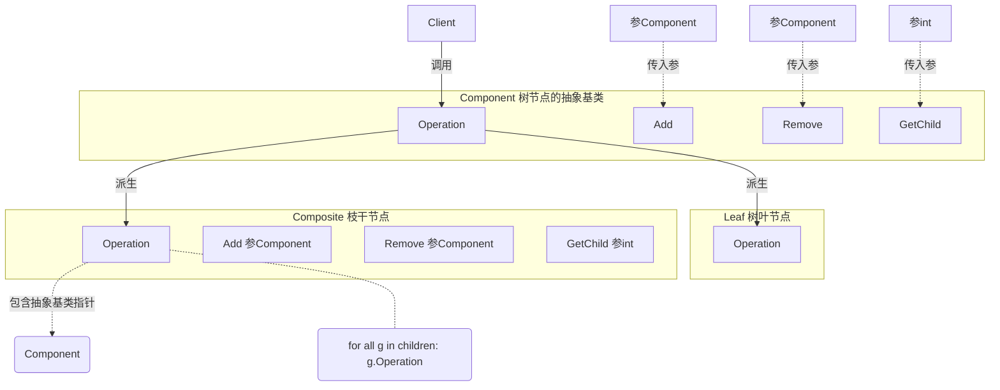

# 《C++设计模式》视频_李建忠

# 目录

[toc]

# 组合模式 Composite

## 所属分类——“数据结构” 模式

- “数据结构” 模式
  - 常常有一些组件在内部具有特定的数据结构，如果让客户程序依赖这些特定的数据结构，将极大地破坏组件的复用。
    这时候，**将这些特定数据结构封装在内部，在外部提供统一的接口**，来实现**与特定数据结构无关的访问**，是一种行之有效的解决方案。
- 典型模式
  - 组合模式 Composite
  - 迭代器模式 Iterator
  - 职责链模式 Chain of Resposibility

## 动机（Motivation）

### 简概

- “数据结构” 模式
  - 常常有一些组件在内部具有特定的数据结构，如果让客户程序依赖这些特定的数据结构，将极大地破坏组件的复用。
    这时候，将这些特定数据结构封装在内部，在外部提供统一的**接口**，来实现**与特定数据结构无关的访问**，是一种行之有效的解决方案。
- 典型模式
  - 组合模式 Composite
  - 迭代器模式 lterator
  - 职责链模式 Chain of Resposibility

### 代码体现

其实就是树结构用多态的方式来实现

#### 举例（组合模式）

```c++
#include <iostream>
#include <list>
#include <string>
#include <algorithm>

using namespace std;

// 定义节点的抽象接口，抽象基类（树节点和叶子节点共同组成树形结构）
class Component
{
public:
	virtual void process()=0;
    virtual ~Component(){}
};

// 枝干节点。继承Component
class Composite : public Component{	
	string name;
	list<Component*> elements;				// 节点，list存储多态指针
public:
    Composite(const string & s):name(s){}	// 构造函数
    void add(Component* element) {			// 添加节点
		elements.push_back(element);
	}
	void remove(Componentx element){		// 移除节点
		elements.remove(element) ;
	}
	void process( ){
		// 1. process current node，处理当前节点
        // 2. process leaf nodes，处理叶子节点
        for (auto &e : elements)			// 这里是C++11的基于范围循环
			e->process();					// 【虚函数调用、多态调用，且为递归调用】
    }
};

// 叶子节点。继承Component
class Leaf : public Component{
    string name;
public:
	Leaf(string s):name(s){}				// 构造函数
    
    void process(){
		//process current node
	}
};

// 客户程序
void Invoke(Component & c){	// 传入树形节点
    //...
	c.process( );			// 调用树形节点（底层会递归遍历处理）
	//...
};

// 运行函数
int main(){
    // 构造枝干节点和叶子节点
	Composite root("root") ;
	Composite treeNode1("treeNode1");
    Composite treeNode2("treeNode2");
    Composite treeNode3("treeNode3");
    Composite treeNode4("treeNode4");
    Leaf left1("left1");
	Leaf left2("left2");

    // 组合枝干节点和叶子节点，组合成为树形结构
    root.add(&treeNode1) ;
	treeNode1.add(&treeNode2);
    treeNode2.add(&leaf1);
	root.add(&treeNode3);
	treeNode3.add(&treeNode4);
    treeNode4.add(&leaf2);
    
    // 开始处理节点
	process(root) ;
}
```

## 设计模式

### 模式定义

> 将对象组合成**树形结构**以表示 “部分-整体” 的层次结构。
> Composite使得用户对单个对象和组合对象的使用具有**一致性（稳定）**。
>
> ——《设计模式》GoF

### 结构（Structure）



题外话：感觉这个结构有些问题

树叶比较尴尬，也不知道要不要实现这几个函数，实现为空的话，又违背接口原则

解决提案：Add、Remove、GetChild不一定要放在抽象基类、可只放在枝干节点中。

### 要点总结

- Composite模式采用树形结构来实现普遍存在的对象容器，从而**将 “一对多” 的关系转化为 “一对一”** 的关系，
  使得客户代码可以一致地（复用）处理对象和对象容器，无需关心处理的是单个的对象，还是组合的对象容器
- **将 “客户代码与复杂的对象容器结构" 解耦**是Composite的核心思想，解耦之后，
  客户代码将**与纯粹的抽象接口（而非对象容器的内部实现结构）发生依赖**，从而更能 “应对变化”
- Composite模式在具体实现中，可以让父对象中的子对象反向追溯；如果父对象有频繁的遍历需求，可使用缓存技巧来改善效率


