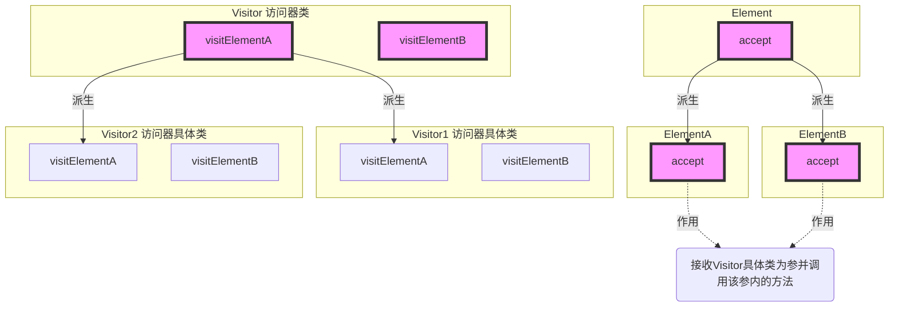
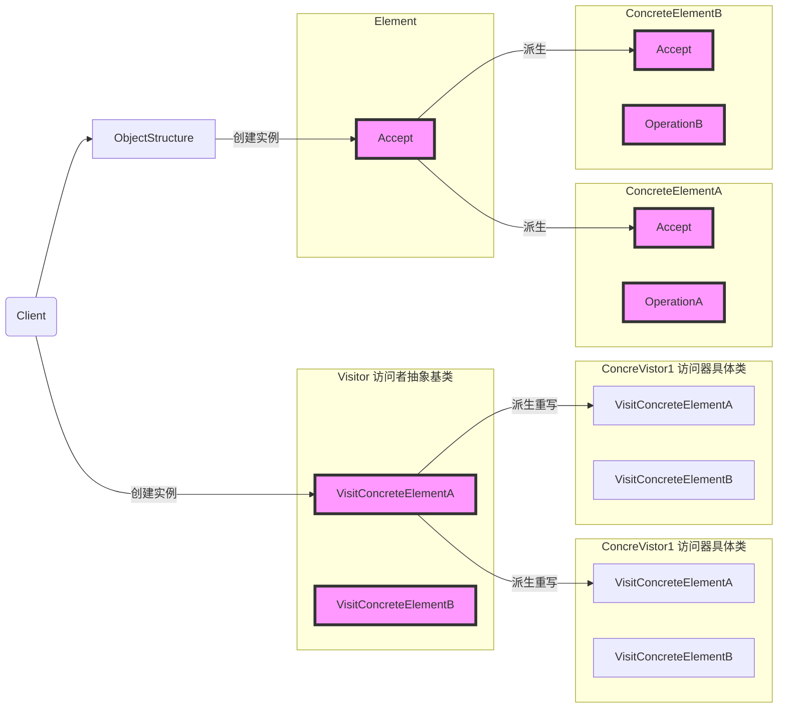

# 《C++设计模式》视频_李建忠

# 目录

[toc]

# 访问器模式 Visitor

## 所属分类——“行为变化” 模式

略

## 动机（Motivation）

### 简概

- 在软件构建过程中，由于需求的改变，某些**类层次结构中常常需要增加新的行为（方法）**，
  如果直接在基类中做这样的更改，将会给子类带来很繁重的变更负担，甚至破坏原有设计
- 如何在**不更改类层次结构的前提下**，在**运行时**根据需要透明地为类层次结构上的各个类动态添加新的操作，从而避免上述问题？

### 代码体现

假设要增加新的行为（方法），而且**不知道要增加新的操作的内容以及数量**

#### 举例 - 普通写法

```c++
#include <iostream>
using namespace std;

class visitor;

// 抽象基类
class Element
{
public:
	virtual void Func1() = 0;
    virtual void Func2(int data) = 0;			// 【新增】
    virtual ~Element(){}
};

// 具体类
class ElementA : public Element
{
public:
	void Func1() override{
		//...
	}
    void Func2(int data) override{				// 【新增】
		//...
	}
};

class ElementB : public Element
{
public:
	void Func1( ) override{
		//***
	}
    void Func2(int data) override{				// 【新增】
		//***
	}
};
```

#### 举例 - 访问器模式写法

稳定的部分

```c++
#include <iostream>
using namespace std;

class visitor;

// 抽象基类
class Element
{
public:
	virtual void accept(Visitor& visitor) = 0;	//【修改】变为accept方法，访问者作为参数传入
    virtual ~Element(){}
};

// 具体类
class ElementA : public Element
{
public:
	void accept(Visitor& visitor) override{		//【修改】变为accept方法
		visitor.visitElementA(*this);
	}
};

class ElementB : public Element
{
public:
	void accept(Visitor& visitor) override{		//【修改】变为accept方法
		visitor.visitElementB(*this);
	}
};

// 访问器类的抽象基类
class Visitor{
public:
	virtual void visitElementA(ElementA& element) = 0;
    virtual void visitElementB(ElementB& element) = 0;
    virtual ~Visitor();
}
```

未来可能需要更改的部分

```c++
// 访问器类的具体类、重写
class Visitor1 : public Visitor		// 增加一个新的行为
{
public:
	void visitElementA(ElementA& element) override{
		cout << "Visitor1 is processing ElementA" << endl;
	}
	void visitElementB(ElementB& element) override{
		cout << "Visitor1 is processing ElementB" << endl;
	}
};

class Visitor2 : public Visitor		// 增加一个新的行为
{
public:
	void visitElementA(ElementA& element) override{
		cout << "Visitor2 is processing ElementA" << endl;
	}
	void visitElementB(ElementB& element) override{
		cout << "Visitor2 is processing ElementB" << endl;
	}
};
```

运行部分

```c++
int main(){
	Visitor2 visitor;
	ElementB elementB;
	elementB.accept(visitor);	// 输出Visitor2 is processing ElementB
    
	ElementA elementA;
	elementA.accept(visitor);	// 输出Visitor2 is processing ElementA
    
	return 0;
}
```

#### 分析 - 访问器模式写法

代码结构

（红色表示稳定）



main从运行到输出，这里有个过程叫`double dispatch`（二次多态辨析 / 双重分发）

- 第一次是在Element的accept方法（需要辨析是ElementA还是ElementB具体类）
- 第二次是在Element具体类的accept方法（需要辨析是Visitor1还是Visitor2具体类）

## 设计模式

### 模式定义

> 表示一个作用于某对象结构中的各元素的操作。使得可以在**不改变（稳定）各元素的类的==前提==下**定义（**扩展**）作用于这些元素的**新操作（变化）**
>
> ——《设计模式》GoF

### 结构（Structure）

（红色表示稳定）

（这个模式最大的缺点就是要求ConcreteElement的**个数稳定**，这个条件难满足）



### 要点总结

- Visitor模式通过所谓双重分发（double dispatch）来实现在不更改（不添加新的操作-编译时）Element类层次结构的==前提==下，在运行时透明地为类层次结构上的各个类动态添加新的操作（支持变化）
- 所谓**双重分发**即Visitor模式中间包括了**两个多态分发**（注意其中的多态机制）：
  - 第一个为accept方法的多态辨析；
  - 第二个为VisitElementX方法的多态辨析。
- Visitor模式的**最大缺点**在于扩展类层次结构（增添新的Element了类），会导致Visitor类的改变。
  因此Mistor模式**适用于 “Element类层次结构稳定，而其中的操作却经常面临频繁改动”**


