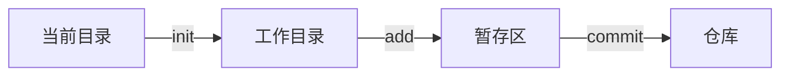

# Git

# 目录

# Git

参考：

- **主要参考（比较全）**：[     git上传命令方式      ](https://www.cnblogs.com/LEPENGYANG/p/15915736.html)
- [【B站】「Coding Master」第13话 如何正确的git代码以及我对Linus大写的服](https://www.bilibili.com/video/BV15K4y1H7SV)
- 《GitHub入门与实践》
- git有中文的官方手册可见
- [Git：从github上克隆、修改和更新项目](https://www.bbsmax.com/A/D854jlZVzE/)


## 入门

版本管理 VCS（Version Control Systems）

- 原始的版本管理

  - 拷贝一份继续写，重复这个过程
  - 缺点：电脑里多个版本的代码

- 本地代码管理工具 RCS（Revision Control System）

  - RCS是记录每一次更新的差异，而不是记录每次更新的完整版本
  - 缺点：使用与个人管理代码，但难以在团队协作上

- CVCS

  - 中央版本控制服务器 CVCS（Centralized Version Control Systems），上面有个版本数据库
    首先由某人新建项目并上传初始代码，员工可将代码拷贝下来再传回去
  - 缺点：团队同时编辑同一份文件时会比较麻烦
    如果大家划分不同模块那相安无事。但往往产品的模块划分通常不太好，藕合严重。又或者有核心代码，几乎所有功能都与之有关，出问题都要去修它。
    团队协作时，经常会同时编辑同一份文件

- Git

  - Bitkeeper不再免费使用，Linus一怒之下撸了个git
    目前被广泛采用，并催生了如github、gitee等代码管理的在线仓库，让开源变得简单
    是个分布式代码版本管理工具

  - 分布式

    - SVN是集中化管理，有中央版本控制服务器 CVCS（Centralized Version Control Systems），如果服务器出了问题那么谁也提交不了代码
    - **git可以在本地化开发，不影响开发**

  - 版本管理

  - git工作流程

    ```mermaid
    graph LR
    当前目录--init-->
    工作目录--add-->
    暂存区--commit-->仓库
    ```

## 一些原理（实现原理与思想原理）

### 本地仓库原理

分为本地仓库和最终push的远程仓库

所以说就算离线也是可以使用git工具的

- commit后，就会将工作的项目传到本地仓库
- push后，则会将本地仓库同步给远程仓库


### 版本管理原理

【注：pull=fetch+merge】


### 多人协同开发原理


### 一些颜色

- 绿色
- 黄色
- 红色
- A
- U
- D


## Git命令

下载：https://git-scm.com/download/win

该软件包括命令行git已经图形化界面的git客户端

### 使用流程

#### 提交到远程

git工作流程：



代码更新（简单记下来就是add commit push）

```shell
git add .
git commit -m "可选的补充说明"
git push
```

#### 远程到本地

需要专业代码托管网站

```shell
# cd到指定路径后clone
git clone https://github.com/...

# 当后续有版本更新时,在同路径下git pull即可。增量同步，不会下载太多东西
# 不要重新clone。1. clone需要退回上一级clone，2. 而且他需要有一个空文件夹，你要把原来的项目给删了或备份，3. 你要重新npm install
git pull

```

`git fetch`和`git pull`的区别：

与git pull相比git fetch相当于是从远程获取最新版本到本地，但不会自动merge。如果需要有选择的合并git fetch是更好的选择。效果相同时git pull将更为快捷。


#### 一些不必要操作

```shell
# 在团队协作开发时，可以知道是谁提交的代码
git config --global user.name "YourName"
git config --global user.email "Email@qq.com"

git init			# 本地仓库初始化。此句后项目文件变绿，有个U字，表示git开始工作了

git add.			# 添加本文件夹下的所有文件
					# 此句后项目文件后有个A字，表示added

git status			# （不必要）查看git状态。可以看到追踪了哪些代码

git commit -m "可选的补充说明"	
					# 本次提交的内容，进入到git仓库

git log				# 可以看到本次提交的日志
					# 会额外显示一个commit id，可以通过git reset --hard commit_id来回退到任意版本
					# commit_id的head是指向版本分支的指针

					# 标签相关，但我没明白有什么用
git tag v0.1.3		# 指定标签
git tag				# 查看标签
```


### 解决冲突

参考：[     git上传命令方式      ](https://www.cnblogs.com/LEPENGYANG/p/15915736.html)

```shell
# 1.查看远程分支
git branch -a

# 2.查看本地分支
git branch

# 3.创建并切换分支 （加-b表示创建并切换）
git checkout -b 分支名

# 4.切换回分支
git checkout 分支名

# 5.从主分支里创建新分支
git checkout master -b 新分支名

# 6.合并某分支到当前分支
git merge 分支名

# 7.删除分支
git branch -d 分支名
git branch -D 分支名 (强行删除分支)
```

三个情景

```shell
# 情景一 提交或拉取时冲突
git stash
git pull
git stash pop

# 情景二 如果你想完全地覆盖本地的代码，只保留服务器端代码，则直接回退到上一个版本，再进行pull
git reset --hard HEAD^
git pull origin master
# 注：origin master表示git的主分支

# 情景三 分支合并时冲突(当我们git merge 分支名 时)
1. git status (查看发生冲突的文)
2. 然后手动合并冲突
3. git add .  (添加更改后的文件)
4. git commit -m 'xj' (提交)
```


### git指令

#### git，列举命令

非常友好，直接列举了常用的命令

```shell
> git
start a working area (see also: git help tutorial)
   clone             Clone a repository into a new directory
   init              Create an empty Git repository or reinitialize an existing one

work on the current change (see also: git help everyday)
   add               Add file contents to the index
   mv                Move or rename a file, a directory, or a symlink
   restore           Restore working tree files
   rm                Remove files from the working tree and from the index
   sparse-checkout   Initialize and modify the sparse-checkout

examine the history and state (see also: git help revisions)
   bisect            Use binary search to find the commit that introduced a bug
   diff              Show changes between commits, commit and working tree, etc
   grep              Print lines matching a pattern
   log               Show commit logs
   show              Show various types of objects
   status            Show the working tree status

grow, mark and tweak your common history
   branch            List, create, or delete branches
   commit            Record changes to the repository
   merge             Join two or more development histories together
   rebase            Reapply commits on top of another base tip
   reset             Reset current HEAD to the specified state
   switch            Switch branches
   tag               Create, list, delete or verify a tag object signed with GPG

collaborate (see also: git help workflows)
   fetch             Download objects and refs from another repository
   pull              Fetch from and integrate with another repository or a local branch
   push              Update remote refs along with associated objects

'git help -a' and 'git help -g' list available subcommands and some
```


#### github强制覆盖本地

```shell
git fetch --all                   # fetch所有分支上的内容，也可以选择只备份一部分内容
git reset --hard origin/master    # 重置本地分支
git pull
```


#### 项目状态

```shell
$ git status

On branch master
Your branch is up to date with 'origin/master'.
 
nothing to commit, working tree clean

可见刚clone下来还是nothing commit的
```


#### 查看历史日志

```shell
$ git log

Enumerating objects: 11, done.
Counting objects: 100% (11/11), done.
Delta compression using up to 16 threads
Compressing objects: 100% (7/7), done.
Writing objects: 100% (7/7), 651 bytes | 651.00 KiB/s, done.
Total 7 (delta 5), reused 0 (delta 0), pack-reused 0
remote: Resolving deltas: 100% (5/5), completed with 4 local objects.
To https://github.com/LincZero/obsidian-chat-view-qq.git
   95fe6c8..556cd64  main -> main

D:\LocalPrivate\Res\Data\Dev\Type\Obsidian_Plugin\obsidian-chat-view-qq>git log
commit 556cd64bf8735973dc0bf9eedaa07cfb81d17d3f (HEAD -> main, origin/main, origin/HEAD)
Author: LincZero <762699299@qq.com>
Date:   Thu Nov 10 22:10:15 2022 +0800

    v0.4.1

commit 47b7d1152efe43b4777c8828ee6abb6ab85f4328
Author: LincZero <762699299@qq.com>
Date:   Thu Nov 10 22:08:18 2022 +0800

    v0.4.1

...
（Enter继续查看，Q退出）
```

每次的版本都有自己唯一的id标识（commit后面的字符），这是系统自动生成的


#### 回到特定版本

```shell
$ git reset id
# 这里的id可以用 git log查看
```


## Github Desktop

这个也很方便，可视化操作，不需要敲任何命令行


## .gitignore 忽略文件

有时可能并不需要同步bin文件夹或者用于单元测试的test文件夹

可以在.gitignore中添加规则，这样`git add.`时就不会自动同步该文件夹的代码。保存后会发现TEST文件夹和bin文件后面的U消失了，颜色也变回了灰色

```shell
TEST/
*bin
```

常见的gitignore内容

```shell
# ide项目 - vscode
.vscode 

# ide项目 - Intellij
*.iml
.idea

# npm
node_modules

# 这个是.ts文件生成的.js文件，不应该被上传
main.js

# Exclude sourcemaps
*.map

# obsidian设置的选项
data.json

# Exclude macOS Finder (System Explorer) View States
.DS_Store

```


## 用git前，用git后

说一下个人的感悟：==不会时觉得麻烦、用熟了觉得太爽了，相见恨晚==


一个网传的笑话：

> [!quote]
>
> 用git前：
> \- 最终版.zip
> \- 最终final版.zip
> \- 最终fianl加班修改版.zip
> \- ..........
> \- 最终fianl凤凰涅槃猝死重生版.zip
>
> 用了git后：
> 把以上内容写在commit里，不愧是我


