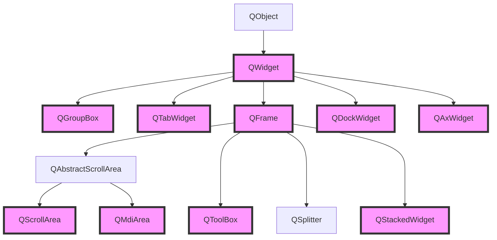
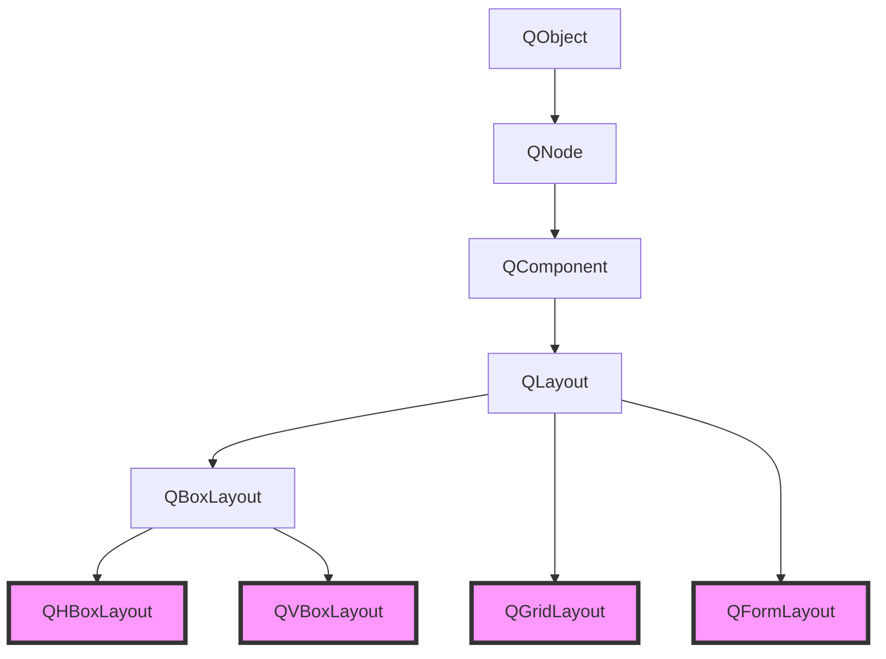
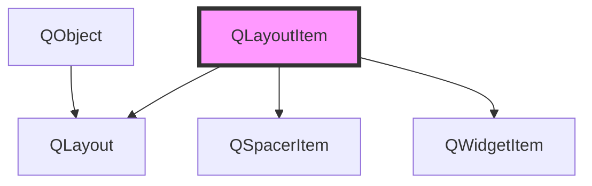

# Qt

# 目录

# 布局类

多窗口布局

《Qt5开发及实例》P56

## Containers，容器（QWidget继承树系列）

### 继承树

继承树



| 设计模式控件名 | 翻译                   | 类名           | 补充                                       |
| -------------- | ---------------------- | -------------- | ------------------------------------------ |
| Group Box      | 按钮组                 | QGroupBox      |                                            |
| Scrool Area    | 滚动区域               | QScrollArea    |                                            |
| Tool Box       | 伸缩区域               | QToolBox       | 类似于标签页+树控件，和max的右侧选项有点像 |
| Tab Widget     | 标签页控件             | QTabWidget     | 插入页、currentTabText                     |
| Stacked Widget | 栈容器                 | QStackedWidget |                                            |
| Frame          | ~~帧~~，编辑框？       | QFrame         | 用得比较少                                 |
| Widget         | 窗口控件               | QWidget        |                                            |
| MDI Area       | MDI区域                | QMdiArea       |                                            |
| Dock Widget    | 铆接容器 / 浮动窗口    | QDockWidget    |                                            |
| QAxWidget      | 封装Flash的ActiveX控件 | QAxWidget      |                                            |

### 普通控件 `Widget`

Widget常用属性

- 基本窗口类QWidget，可进行水平、垂直、栅格布局
- `sizePolicy`属性下的垂直和水平策略，可选Preferred（自动撑大）、Fixed（固定大小）

#### Widget与Layout的区别


#### Widget的Layout属性

Widget的两个重要方法

- `setLayout()`
- `layout()`

#### QT中setLayout无效的问题

原文链接：https://blog.csdn.net/xinzhiyounizhiyouni/article/details/44521501

在QT开发过程中，有时候会遇到这样的问题，当我们自己创建了一个Layout对象以后，使用QWidget的setLayout方法，将这个Layout对象应用到窗口中的时候，发现窗口上没有我们添加的控件，比如，QMainWindow就是一个例子，还有QToolBar也是这样，还有其他的QT预定义的别的窗口类有时候也会遇到这样的情况。

**之所以出现这样的情况，是因为这个窗口类中，已经有了一个Layout对象了**，这时候，当你再setLayout的时候，就是无效的，这是有三个办法，一个办法是调用layout()方法，返回这个窗口内部的Layout的对象，然后删除它，再调用setLayout设置自己的Layout对象，还有一个办法，就是直接使用这个窗口内部的Layout对象，第三个方法，就是直接创建其子窗口，在这个子窗口中使用Layout对象，如，在QMainWindow中，我们通常创建一个继承于QWidget的窗口对象，然后调用setCentralWidget方法来安装这个窗口，然后在这个窗口中使用自己的Layout。

### 铆接部件  `QDockWidget`（浮靠窗口）（可有多个）

详见QMAinWindow

### 堆栈窗体 `QStackedWidget`

（类似于标签页，但没有标签，可下一个或上一个地切换界面，也可用槽函数切）<br />插入页、页 > currentIndex（序列）设置默认页/页：`ui->stackedWidget->setCurrentIndex(1);`

### 分割窗口 `QSplitter`（设计界面里没有）

略

### 编辑框/帧 `QFrame`（设计界面里没有）

- QFrame常用属性
  - QFrame > frameShape（边框） > NoFrame、Box、WinPanel 粗边框
  - QFrame > frameShadow（阴影） > Plain、Raised 凸起、Sunken 下沉

## Layouts，基本布局

### 继承树

`QLayout`，类名与继承树



==（需要注意的是Layouts不继承于QWidget，但是QWidget可以设置Layout属性）==

| 设计模式控件名    | 翻译     | 类名        |
| ----------------- | -------- | ----------- |
| Vertical Layout   | 水平布局 | QVBoxLayout |
| Horizontal Layout | 垂直布局 | QHBoxLayout |
| Grid Layout       | 网格布局 | QGridLayout |
| Form Layout       | 表格布局 | QFormLayout |

### 加弹簧

`layout->addStretch()`

### 一般用法

```c++
QVBoxLayout* pLayout = new QVBoxLayout();//水平布局

QPushButton* p1 = new QPushButton("p1");
QPushButton* p2 = new QPushButton("p2");
QPushButton* p3 = new QPushButton("p3");
QPushButton* p4 = new QPushButton("p4");

pLayout->addWidget(p1);
pLayout->addWidget(p2);
pLayout->addWidget(p3);
pLayout->addWidget(p4);

this->setLayout(pLayout);
```

或

```c++
widget->layout()->addWidget();
```

## Spacers，弹簧

### 继承树



### 简概

底层原理

- 书本上说是类名为`Spacer`，但是话说我好像没看到有这个类，验证后发现实际类名为`QSpacerItem`（这个类挺特殊的，可能是版本改了）
- 在ui文件中表现为：`<spacer name="verticalSpacer">`
- 生成的.h文件中为：`verticalSpacer = new QSpacerItem(20, 40, QSizePolicy::Minimum, QSizePolicy::Expanding);`

| 设计模式控件名    | 翻译     | 类名   | 常用属性                   |
| ----------------- | -------- | ------ | -------------------------- |
| Horizontal Spacer | 水平弹簧 | Spacer | sizeType为Expanding或Fixed |
| Vertical Spacer   | 垂直弹簧 | Spacer | sizeType为Expanding或Fixed |

这个类不以Q开头，略特殊

作用：能用来弄居中，或者固定间距

## 控件变型

- 在设计界面中，一些控件可以相互转换，如：
    - QWidget、QFrame、QGroupBox、QTabWidget、QStackedWidget、QToolBox
        这六个容器类可以互相转换（该操作可逆）
    - QHBoxLayout、QVBoxLayout、QGridLayout、QFormLayout
        这四个布局类可以转换为上面的六个容器（该操作不可逆）。而容器类比布局类的功能更多、应该是上位替代
    - QPushButton、QCheckBox、QRadioBox、QToolBox、QCommandLinkBox
        这些控件可以互相转换
- 总结
    - 应该在设计界面的控件盒中，分为同一类的可以互相转换（QSpacer那个是同一个类，也不例外）
- 选用
    - 简单的仅为切割布局的用Layout布局类，且可以随时变型为Widget，而复杂的用Widget


