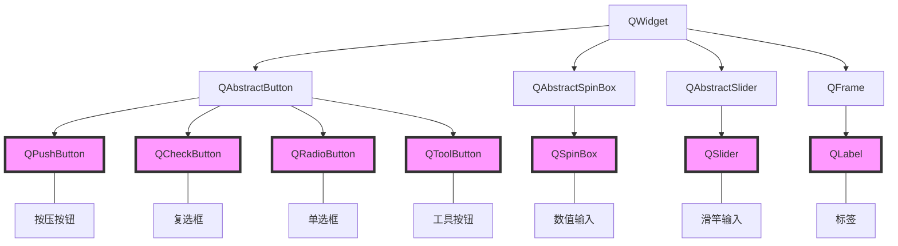

# Qt

# 目录

# 控件类

## QWidget继承树系列

### 继承树



## Buttons，按钮组

- **Push Button**，按压式按钮
- **Tool Button**，工具按钮（主要用来显示图标）
    - icon、text
    - toolButtonStyle属性：ToolButtonInconOnly、ToolButtonTextBesideIcon
    - autoRaise属性：凸起风格，勾选/不勾选
- **Radio Button**，单选框
    - 单选框和复选框要配合按钮组Group Box使用
- **Check Box**，复选框
    - 单选框和复选框要配合按钮组Group Box使用
- **Command Link Button**，命令链接按钮
- **Dialog Button Box**，对话框按钮盒（OK和Cancel组合的按钮）

### QPushButton 按钮控件

- 头文件
    - `#include <QPushButton>`
- 继承
    - 其中`QPushButton`的基类是`QAbstractButton`，基基类是`QWidget`
    - 即一般可使用QWidget的接口方法
- 常用方法
    - `setParent(this);`，设置父对象（一般是窗口类的this）
    - `setText("xxx");`，设置按钮文本
    - `move(x, y);`，设置坐标
- `QWidget`基类的方法
    - `resize(width, height);`，设置宽高

### QLabel 标题控件

- 头文件
    - `#include <QLabel>`
- 使用
    - （基本同按钮）
- 注意
    - 在显示文本的某个字符前面添加一个前缀`&`，就可以定义快捷键
    - 比如`QLabel * ageLabel = new QLabel("&Age",this);`，则ageLabel标签的组合键为`Alt+A`

## Input Widgets，输入控件

- **Combo Box**，下拉框
    - 使用
        - (1) 添加项目，`ui->comboBox->addItem("Item1");`
        - (2) 设置默认值或值，`ui->comboBox->setCurrentIndex(1);`
- **Font Combo Box**，字体下拉框
- **Line Edit**，单行输入框
    - echoMode属性值：Normal、NoEcho不显示、Password密码、PasswordEcho...输入时才可见
- **Text Edit**，多行输入框（富文本编辑框）
- **Plain Text Edit**，多行输入框（纯文本编辑框）
- **Spin Box**，数值输入
- **Double Spin Box**，浮点数值输入
- **Time Eidt**，时间选择
- **Data Eidt**，日期选择
- **Data/Time Edit**，日期与时间选择
- **Dial**，？？？
- **Horizontal Scroll Bar**，水平滑动条
- **Vertical Scroll Bar**，垂直滑动条
- **Horizontal Slider**，水平滑动杆（可配合数值或浮点数值输入使用）
- **Vertical Slider**，垂直滑动杆（可配合数值或浮点数值输入使用）
- **Key Sequence Edit**，输入快捷键

### QTextEdit 文本编辑器

- 头文件

    - `#include <QTextEdit>`

- 使用

    - 比如设置为核心

        `QTextEdit * edit = new QTextEdit(this);`

        `setCentralWidget(edit);`

## Display Widgets，显示控件

- **Label**，标签（能显示文字/图片）
    - 可以在字母前加`&`快速指定快捷键
    - 界面中显示`&`可以通过编辑伙伴来解决
- **Text Browser**，
- **Graphics View**，图形视图
- **Calendar Widget**
- **LCD Number**，LCD数字显示
- **Progress Bar**，进度条
- **Horizontal Line**，水平分割线
- **Vertival Line**，垂直分割线
- **OpenGL Widget**
- **QQuickWidget**，可以嵌入QML代码，为Qt开发者将桌面应用迁移到QtQuick提供方便

## 其他

### 其他

#### QPlainTextEdit

```c++
QPlainTextEdit* te = new QPlainTextEdit();
te->setPlaceholderText("Please enter your text here into this QPlainTextEdit...");	// 提示文本
```


