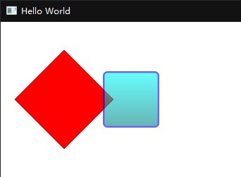

# Qt

# 目录

# QML 基本使用

## 基本语法

- QML文档
  - 由import部分和对象声明部分组成
- 对象和属性
  - 每个QML文档有且只有一个根对象、对象可以嵌套子对象
  - 对象：由他们的类型指定，以大写字母开头
  - 属性：以键值对的形式给出
- 对象标识符
  - 每个对象都可以指定一个唯一的id值，id值在同一个qml文档必须唯一
  - 例如：`id: mouseArea`
- 属性别名
  - alias关键字声明属性别名
  - 作用：能使用外部QML文档也能通过别名访问到该对象
  - 格式：`property alias 别名: 属性名`，其中右侧的属性名一般是id
  - 例如：`property alias mouseArea: mouseArea`
- 注释
  - 同C/C++、JavaScript，单行注释`//`、多行注释`/**/`


## QML常用组件（设计师界面有的）

设计师界面的Components窗口中默认是你QML代码中已经 import 了的模块，如果你没有import模块，则就是空的

**My Components（自定义组件）** 是你自定义组件了之后（可能还需要重置代码模型）就会显示的

除此之外，你可以通过该窗口右上叫的 “+” 号，附加一些其他的自带组件（附加以后你的QML代码就会出现相应的 import 代码），有：

```js
[[Module Name]]						// 界面名
									// 其中 QtQuick 这个基本上是必加的，而且要通过代码加，用设计师界面加可能会出bug
									// 1. My Components
import QtQuick 2.15					// 2. Default Components（默认组件）
import QtQuick.Controls 6.2			// 6. QtQuick Controls
import QtQuick.Layouts 6.0			// 7. QtQuick Layouts
import QtCharts 6.2					// 3. QtCharts
import QtDataVisualization 1.3		// 4. QtDataVisualization
import QtMultimedia 6.0				// 5. QtMultimedia
import QtQuick.Controls.Windows 6.0	// 8. QtQuick Controls Windows
import QtQuick.Window 2.14			// 9. QtQuick Window
```


### My Components（自定义组件）

##### 使用方式

默认只有

- (1) 新建一个qml文件，在里面封装qml组件，如取名Button.qml
- (2) 在主qml文件中复用他，直接`Button{/*...*/}`即可，像使用QML基本元素一样去使用
- (3) 注意在复用会可以重写属性以覆盖自定义组件中的属性


可能会标红错误：`Unknown component`，但是不会影响正常运行

解决方法：菜单 工具 > QML/JS > 重置代码模型


使用示例：

Button.qml（组件）

```js
import QtQuick 2.0
 
Rectangle {
    id: root
 
    property alias text: label.text		// 为了不对外暴露Text元素，我们给了它的text属性一个别名
    signal clicked						// MouseArea的clicked()
 
    width: 116; height: 26
    color: "lightsteelblue"
    border.color: "slategrey"
 
    Text {
        id: label
        anchors.centerIn: parent
        text: "Start"
    }
    MouseArea {
        anchors.fill: parent
        onClicked: {
            root.clicked()
        }
    }
}
```

main.qml（使用上面那个组件）

```js
import QtQuick 2.0
 
Rectangle {
    width: 360
    height: 360
    Button {
        id: button
        x: 12; y: 12
        text: "Start"
        onClicked: {
            status.text = "Button clicked!"
        }
    }
 
    Text {
        id: status
        x: 12; y: 76
        width: 116; height: 26
        text: "waiting ..."
        horizontalAlignment: Text.AlignHCenter
    }
}
```


### 其他组件 %tx

| 主类别                              | 次类别                                    | 项                   | 翻译       |
| ----------------------------------- | ----------------------------------------- | -------------------- | ---------- |
| My Components<br />自定义组件       | .                                         | .                    |            |
| Default Components<br />默认组件    | Basic (11)<br />基本                      | Animated Image       | 动画图片   |
| ^^                                  | ^^                                        | Border Image         | 边框图片   |
| ^^                                  | ^^                                        | Flickable            | 可拖拽的？ |
| ^^                                  | ^^                                        | Focus Scope          | 聚焦区域   |
| ^^                                  | ^^                                        | Image                | 图片       |
| ^^                                  | ^^                                        | Item                 | 项         |
| ^^                                  | ^^                                        | Mouse Area           | 鼠标区域   |
| ^^                                  | ^^                                        | Rectagle             | 矩形       |
| ^^                                  | ^^                                        | Text                 | 文本文字   |
| ^^                                  | ^^                                        | Text Edit            | 单行输入   |
| ^^                                  | ^^                                        | Text Input           | 多行输入   |
| ^^                                  | View (3) <br>视图                         | Grid View            | 网格视图   |
| ^^                                  | ^^                                        | List View            | 列表视图   |
| ^^                                  | ^^                                        | Path View            | 路径视图   |
| ^^                                  | Positioner (4) <br>定位                   | Column               | 纵向       |
| ^^                                  | ^^                                        | Row                  | 横向       |
| ^^                                  | ^^                                        | Flow                 | 流         |
| ^^                                  | ^^                                        | Grid                 | 网格       |
| ^^                                  | Animation (9) <br>动画                    | Color Animation      | 颜色动画   |
| ^^                                  | ^^                                        | Number Animation     | 数字动画   |
| ^^                                  | ^^                                        | Parallel Animation   | 平行动画   |
| ^^                                  | ^^                                        | Pause Animation      | 停顿动画   |
| ^^                                  | ^^                                        | Property Action      | 属性行为   |
| ^^                                  | ^^                                        | Property Animation   | 属性动画   |
| ^^                                  | ^^                                        | Script Action        | 脚本行为   |
| ^^                                  | ^^                                        | Sequential Animation | 序列动画   |
| ^^                                  | ^^                                        | Timer                | 计时器     |
| ^^                                  | Component (3) <br>组件                    |                      |            |
| QtCharts<br />图表                  | Qt Charts - ChartView (12) <br>一般坐标   |                      |            |
| ^^                                  | Qt Charts - PolarChartView (4) <br>极坐标 |                      |            |
| QtDataVisualization<br />数据可视化 | .                                         |                      |            |
| QtMultimedia<br />多媒体            | .                                         |                      |            |
| QtQuick Controls<br />QC            | .                                         |                      |            |
| QtQuick Layouts<br />布局           | .                                         |                      |            |
| QtQuick Controls Window<br />QC窗口 | .                                         | .                    |            |
| QtQuick Window<br />Quick窗口       | .                                         | .                    |            |


%toTable|主类别|次类别|项
- My Components<br />自定义组件
- Default Components<br />默认组件
  - Basic (11)<br />基本
    - Animated Image
    - Border Image
    - Flickable
    - Focus Scope
    - Image
    - Item
    - Mouse Area
    - Rectagle
    - Text
    - Text Edit
    - Text Input
  - View (3) <br>视图
    - Grid View
    - List View
    - Path View
  - Positioner (4) <br>定位
    - Column
    - Row
    - Flow
    - Grid
  - Animation (9) <br>动画
    - Color Animation
    - Number Animation
    - Parallel Animation
    - Pause Animation
    - Property Action Property Animation
    - Script Action
    - Sequential Animation
    - Timer
  - Component (3) <br>组件
- QtCharts<br />图表
  - Qt Charts - ChartView (12) <br>一般坐标
  - Qt Charts - PolarChartView (4) <br>极坐标
- QtDataVisualization<br />数据可视化
- QtMultimedia<br />多媒体
- QtQuick Controls<br />QC
- QtQuick Layouts<br />布局
- QtQuick Controls Window<br />QC窗口
- QtQuick Window
  Quick窗口


| 主类别                              | 次类别                                    | 项                   | 翻译       |
| ----------------------------------- | ----------------------------------------- | -------------------- | ---------- |
| My Components<br />自定义组件       | .                                         | .                    |            |
| Default Components<br />默认组件    | Basic (11)<br />基本                      | Animated Image       | 动画图片   |
| ^^                                  | ^^                                        | Border Image         | 边框图片   |
| ^^                                  | ^^                                        | Flickable            | 可拖拽的？ |
| ^^                                  | ^^                                        | Focus Scope          | 聚焦区域   |
| ^^                                  | ^^                                        | Image                | 图片       |
| ^^                                  | ^^                                        | Item                 | 项         |
| ^^                                  | ^^                                        | Mouse Area           | 鼠标区域   |
| ^^                                  | ^^                                        | Rectagle             | 矩形       |
| ^^                                  | ^^                                        | Text                 | 文本文字   |
| ^^                                  | ^^                                        | Text Edit            | 单行输入   |
| ^^                                  | ^^                                        | Text Input           | 多行输入   |
| ^^                                  | View (3) <br>视图                         | Grid View            | 网格视图   |
| ^^                                  | ^^                                        | List View            | 列表视图   |
| ^^                                  | ^^                                        | Path View            | 路径视图   |
| ^^                                  | Positioner (4) <br>定位                   | Column               | 纵向       |
| ^^                                  | ^^                                        | Row                  | 横向       |
| ^^                                  | ^^                                        | Flow                 | 流         |
| ^^                                  | ^^                                        | Grid                 | 网格       |
| ^^                                  | Animation (9) <br>动画                    | Color Animation      | 颜色动画   |
| ^^                                  | ^^                                        | Number Animation     | 数字动画   |
| ^^                                  | ^^                                        | Parallel Animation   | 平行动画   |
| ^^                                  | ^^                                        | Pause Animation      | 停顿动画   |
| ^^                                  | ^^                                        | Property Action      | 属性行为   |
| ^^                                  | ^^                                        | Property Animation   | 属性动画   |
| ^^                                  | ^^                                        | Script Action        | 脚本行为   |
| ^^                                  | ^^                                        | Sequential Animation | 序列动画   |
| ^^                                  | ^^                                        | Timer                | 计时器     |
| ^^                                  | Component (3) <br>组件                    |                      |            |
| QtCharts<br />图表                  | Qt Charts - ChartView (12) <br>一般坐标   |                      |            |
| ^^                                  | Qt Charts - PolarChartView (4) <br>极坐标 |                      |            |
| QtDataVisualization<br />数据可视化 | .                                         |                      |            |
| QtMultimedia<br />多媒体            | .                                         |                      |            |
| QtQuick Controls<br />QC            | .                                         |                      |            |
| QtQuick Layouts<br />布局           | .                                         |                      |            |
| QtQuick Controls Window<br />QC窗口 | .                                         | .                    |            |
| QtQuick Window<br />Quick窗口       | .                                         | .                    |            |


## QML 可视化元素

奇怪的地方

- QML绘制矩形、图像、文字时，拖拽窗口大小会使这些可视化元素变形

### 一些通用属性

- 基本属性
  - x，水平位置
  - y，垂直位置
  - width，宽度
  - height，高度
  - opacity，透明度（0~1）
  - scale，缩放（0~1）
  - radius，圆角大小
  - border{}，边框
- Anchor 常用属性
  - 锚线：left、horizontalCenter、right、top、verticalCenter、bottom、(Text的baseline)
  - 边距：anchor.margins、leftMargin、rightMargin、topMargin、bottomMargin
  - 偏移：offset、horizontalCenterOffset、verticalCenterOffset、baselineOffset
  - 填充：anchors.fill，等价于使用4个`anchors.top: parent.top`这样的语法
- onClicked，单击的回调函数


### Rectangle  矩形

- gradient:Gradient{/**/}，以垂直方向的渐变色填充矩形

使用例程

```json
import QtQuick 2.7
import QtQuick.Window 2.2
Rectangle{
    property alias mouseArea: mouseArea		// 属性别名
    property alias topRect: topRect
    width:360								// 宽度
    height:360								// 高度
    MouseArea{
        id:mouseArea						// 对象标识符
        anchors.fill:parent					// 布局，填满父对象
    }
    mouseArea.onClicked: {
        topRect.visible = !topRect.visible	// 控制第二个方块是否显示
    }
    /* 添加定义两个Rectangle对象 */
    Rectangle{
        rotation:45
        x:40
        y:60
        width:100
        height:100
        color:"red"							// 颜色
    }
    Rectangle{
        id:topRect
        opacity:0.6
        scale:0.8
        x:135
        y:60
        width:100
        height:100
        radius:8							// 圆角
        gradient:Gradient{					// 以垂直方向的渐变色填充矩形
            GradientStop{position:0.0; color:"aqua"}
            GradientStop{position:1.0; color:"teal"}
        }
        border{width:3; color:"blue"}
    }
}
```



### Image  图像

- fileMode，填充模式
  - Image.Streth，拉伸
  - Image.PreserveAspecFit，等比缩放
  - Image.PreserceAspectCrop，等比缩放 最大化填充 必要时裁剪图片
  - Image.Tile，瓷砖平铺
  - Image.TileVertivally，垂直平铺
  - Image.TileHorizontally，水平平铺
  - Image.Pad，不作变换

使用例程

```json
import QtQuick 2.7
Rectangle{		// 矩形
	Image{                                      // 图片
        x:0
        y:0
        width:977/4; height:1248/4
        source: "21.jpeg"						// 图片源，要先添加进qrc资源里
        fillMode: Image.PreserveAspectCrop      // 填充模式
        clip:true                               // 避免渲染的图片超出元素范围
    }
}
```


### Text  文本

- text，文本内容
  - `"Hello Qt Quick"`，普通文本
  - `"<b>Hello</b> <i>Qt Quick!</i>"`，富文本内容
- style，样式
  - text.Normal，普通
  - Text.Outline，描边
  - Text.Raised，凸起
  - Text.Sunken，凹陷
- styleColor，样式颜色
- elide
  - Text.ElideNone，默认不省略
  - Text.ElideRight，从右侧省略
- wrapMode
  - Text.WrapAnywhere，以字母为界换行
  - Text.WordWrap，以单词为界换行

使用例程

```json
Text{                                       // 【普通纯文本】
    x:0
    y:360
    color:"green"                           // 颜色
    font.family: "Helvetica"                // 字体
    font.pointSize:24                       // 字号
    text:"Hello Qt Quick"                   // 内容
}
Text{                                       // 【html富文本】
    x:0;y:400;color:"green";font.family: "Helvetica";font.pointSize:24;text:"Hello Qt Quick"
    text:"<b>Hello</b> <i>Qt Quick!</i>"    // 富文本内容
}
Text{                                       // 【带样式的文本】
    x:0;y:440;color:"green";font.family: "Helvetica";font.pointSize:24;text:"Hello Qt Quick"
    style:Text.Outline;                     // 文本样式 - 描边
    styleColor: "blue"                      // 文本样式 - 颜色（覆盖color）
}
Text{                                       // 【带缩略的文本】
    x:0;y:480;color:"green";font.family: "Helvetica";font.pointSize:24;text:"Hello Qt Quick"
    width:200                               // 限制文本宽度
    horizontalAlignment:Text.AlignLeft      // 窗口中左对齐
    verticalAlignment: Text.AlignTop        // 窗口中顶对齐
    elide:Text.ElideRight                   // 省略文本，从右侧省略
}
Text{                                       // 【换行的文本】
    x:0;y:520;color:"green";font.family: "Helvetica";font.pointSize:24;text:"Hello Qt Quick"
    width:200                               // 限制文本宽度
    horizontalAlignment:Text.AlignLeft      // 窗口中左对齐
    wrapMode: Text.WrapAnywhere             // 换行模式，哪怕在单词中间，若以单词为界则Text.WordWrap
}
```


## QML 元素布局

### Positioner（定位器）

#### Row（行定位）

行列定位的用法差不多

```json
Row{
    x:25
    y:25
    spacing:10						// 元素间距多少px
    layoutDirection:Qt.RightToLeft	// 从右向左排列
    // 以下添加被定位的元素成员
    RedRectangle{}
    GreenRectangle{}
    BlueRectangle{}
}
```

#### Column（列定位）

行列定位的用法差不多

```json
Column{
    x:25
    y:25
    spacing:2						// 元素间距多少px
    // 以下添加被定位的元素成员
    RedRectangle{}
    GreenRectangle{}
    BlueRectangle{}
}
```

#### Grid（网格定位）

```json
Grid{
    x:25
    y:25
    columns:3						// 每行3个元素，或者也可以设置rows属性
    // rows:3
    spacing:5						// 元素间距多少px
    // 以下添加被定位的元素成员
    BlueRectangle{}
    BlueRectangle{}
    BlueRectangle{}
    BlueRectangle{}
    BlueRectangle{}
}
```

#### Flow（流定位）

与Row、Column等定位器不同的是，里面的元素会根据窗体尺寸动态地调整其布局

```json
Flow{
    anchors.fill:parent
    anchors.margins:15				// 元素与窗口左上角边距为15px
    spacing:5						// 元素间距多少px
    // 以下添加被定位的元素成员
    RedRectangle{}
    GreenRectangle{}
    BlueRectangle{}
}
```

### Repeater（重复器，与其他定位器结合使用）

```c++
Grid{
    x:25
    y:25
    spacing:5						// 元素间距多少px
    // 以下添加被定位的元素成员
    Repeater{						// 重复器
        model:16					// 要创建元素成员的个数
        Rectangle{					// 成员
            Text{					// 显示矩形的编号
                text:index			// Repeater会为每个子元素注入一个index属性
            }
        }
    }
}
```

### Anchor（锚）

- 锚线概念
  - 每个元素都可被认为有一组无形的 “锚线”
  - 元素的6条锚线：left、horizontalCenter、right、top、verticalCenter、bottom
  - Text元素还有一个baseline锚线
- 锚线属性
  - 这些锚线分别对应元素中的 anchors.left、anchors.horizontalCenter、等属性
  - 所有的可视化元素都可以使用锚线来布局
- 注意事项
  - 只能在父子或兄弟之间使用锚，且不能与绝对位置（设置x和y）混合使用
- Anchor 常用属性
  - 锚线：left、horizontalCenter、right、top、verticalCenter、bottom、(Text的baseline)
  - 边距：anchor.margins、leftMargin、rightMargin、topMargin、bottomMargin
  - 偏移：offset、horizontalCenterOffset、verticalCenterOffset、baselineOffset
  - 填充：anchors.fill，等价于使用4个`anchors.top: parent.top`这样的语法
  - anchors.centerIn

## QML 事件处理

### MouseArea  鼠标事件

MouseArea 可以响应鼠标事件的区域，作为子对象它可以使用parent关键字访问其父对象

需要注意qml后声明元素会覆盖前声明元素，包括点击区域

- `mouseArea.onClicked: {/**/}`，鼠标单击事件的回调函数
- drag 拖拽对象属性
  - drag.target，被拖拽的元素id
  - drag.active，获取元素当前是否正在被拖拽
  - drag.axis，指示拖拽的方向
    - Drag.XAxis、Drag.YAxis、Drag.XandYAxis
  - drag.minimumX，拖拽最小范围
  - drag.maximumX，拖拽最大范围
- acceptedButtons，能接受的鼠标键
- mouse 鼠标事件对象属性
  - mouse.button，按下的按钮
  - mouse.modifiers，鼠标的修饰键
- 键的媒体值
  - Qt.LeftButton、Qt.RightButton、Qt.ShiftModifier

```json
Rectangle{
    width:50                            // 宽度
    height:50                           // 高度
    color:"teal"                        // 颜色：蓝绿
    opacity:(360.0-x)/360				// 透明度，且随拖拽而改变
    MouseArea{
        anchors.fill:parent             // 布局，填满父对象
        /* 拖拽属性设置 */
        drag.target: parent             // 指定被拖拽的元素的id
        //drag.active                   // 获取元素当前是否正在被拖拽
        drag.axis:Drag.XAxis            // 指示拖拽的方向（YAxis、XandYAxis）
        drag.minimumX: 0                // 拖拽最小范围
        drag.maximumX: 360-parent.width // 拖拽最大范围
        acceptedButtons: Qt.LeftButton | Qt.RightButton // 能接受的鼠标键
        onClicked: {                    // 鼠标事件。mouse为鼠标事件对象，可获取xy位置和按下的按键
    		// 右击则缩小
            if(mouse.button == Qt.RightButton){
                parent.color = "blue"
                parent.width -= 5
                parent.height -= 5
            }
			// shift右击则重设大小。mouse.modifiers获取修饰键
            else if((mouse.button == Qt.LeftButton) && (mouse.modifiers & Qt.ShiftModifier)){
                parent.color = "teal"
                parent.width = 50
                parent.height = 50
            }
			// 左击则放大，这里有个bug：在右边缘放大会突破位移限制
            else{
                parent.color = "green"
                parent.width += 5
                parent.height += 5
            }
        }
    }
}
```

### 键盘事件

- KeyNavigation 对象属性，可以用来实现使用方向键或Tab键来进行元素的导航，属性设置为要将焦点转移到的id
  - KeyNavigation.tab、backtab
  - down、left、right、up
  - priority
- Keys 对象属性，一般与focus属性配合使用，只有当focus为true时它才起作用
  - Keys.onUpPressed，上方向键
  - Keys.onDownPressed，上方向键
  - Keys.onLeftPressed，上方向键
  - Keys.onRightPressed，上方向键
- focus，是否获取焦点（true/false）

### 输入控件和焦点

QML有两个输入控件：TextInput 和 TextEdit

需要注意的是，他们与`QLineEidt`不同，没有一个可视化显示（边框等），只有一个闪动的光标和用户输入的文本，通常需要一些可视化修饰

#### TextInput  单行文本输入

```json
TextInput{
    id: input
    anchors.fill: parent
    anchors.margins: 4
    focus: true
    text: "请输入内容..."
}
```

#### TextEdit  多行文本编辑

使用几乎完全相同


