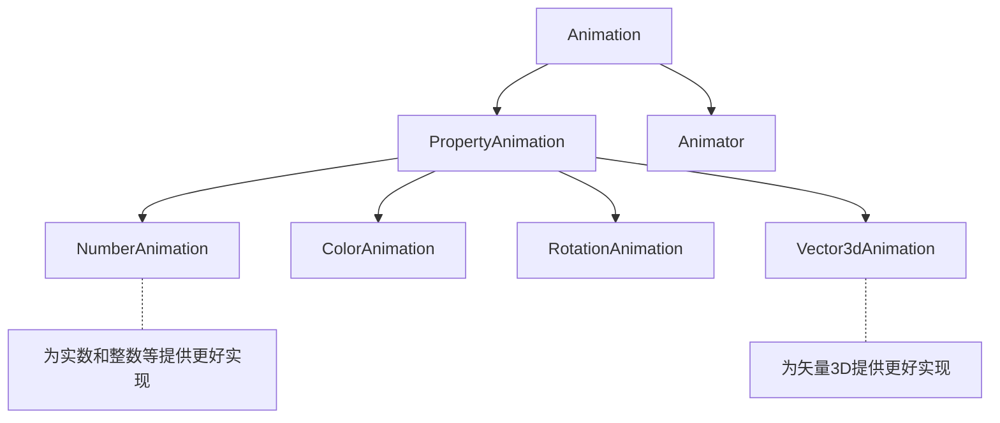

# Qt

# 目录

# QML 动画特效

## QML 动画元素

### Animation  动画元素

Animation，无法直接创建对象，为动画元素提供通用的属性和方法

- running
- start()，控制动画开始
- stop()，控制动画停止
- loops，动画循环次数

继承树，其中大多数动画元素继承自PropertyAnimation



### PropertyAnimation  属性动画元素

PropertyAnimation 属性动画元素，继承于Animation

可以用作动画的属性

- real
- int
- color
- rect
- point
- size
- vector3d

四种使用方式

- 作为属性值的来源
- 在信号处理器中创建一个动画元素
- 独立创建一个动画元素
- 在属性值改变的行为中创建

#### 作为属性值的来源

```json
Rectangle{
    width:60
    height:60
    color:"orange"
    PropertyAnimation on x{             // 【动画被应用为属性来源】
        from:50                         // 起点
        to:500                          // 终点
        duration:2000                   // 运动时间2s
        loops:Animation.Infinite        // 循环无限次
        easing.type: Easing.OutBounce   // 运动曲线 - 反弹
    }
}
```

#### 在信号处理器中创建

```json
Rectangle{
    id: rect2
    width:60
    height:60
    color:"lightgreen"
    MouseArea{
        anchors.fill: parent
        onClicked:PropertyAnimation{    // 【信号处理器中创建一个动画元素】
            target: rect2               // 作用目标
            property:"y"                // 作用属性
            from:50                     // 起点
            to:400                      // 终点
            duration:1000               // 运动时间1s
            loops:3                     // 循环3次
            easing.type: Easing.Linear  // 运动曲线 - 线性
        }
    }
}
```

#### 作为独立动画元素

```json
Rectangle{
    id: rect3
    width:60
    height:60
    color:"aqua"
    PropertyAnimation{                  // 【独立的动画元素】
        id:animation
        target:rect3                    // 作用目标
        properties:"x,y"                // 作用属性
        duration:1000                   // 运动时间1s
        easing.type:Easing.InOutBack    // 运动曲线 - 两边反弹
    }
    MouseArea{
        anchors.fill: parent
        onClicked: {
            animation.from = 20         // 起点
            animation.to = 200          // 终点
            animation.running = true    // 开启动画
        }
    }
}
```

#### 在属性值改变的行为中创建

如果被绑定的属性还绑定到其他属性上，那么这些 属性改变时也都会触发动画

```json
MouseArea{                              // 需要注意qml后声明元素会覆盖前声明元素，包括点击区域
    id:mouseArea
    anchors.fill: parent
    onClicked: {
        rect4.x=mouseArea.mouseX
        rect4.y=mouseArea.mouseY
    }
}
Rectangle{
    id:rect4
    width:60
    height:60
    color:"lightblue"
    Behavior on x{                      // 【定义x属性上的行为动画】
        PropertyAnimation{
            duration:1000               // 运动时间1s
            easing.type:Easing.InQuart  // 运动曲线 - 加速
        }
    }
    Behavior on y{
        PropertyAnimation{
            duration:1000
            easing.type:Easing.InQuart
        }
    }
}
```

### 其他动画元素

大多数动画元素继承自PropertyAnimation

- NumberAnimation，为实数和整数等提供更好实现
- ColorAnimation
- RotationAnimation
- Vector3dAnimation，为矢量3D提供更好实现

### Animator 元素


## 动画流UI界面

### 状态和切换

### 设计组合动画

## 图像特效

### 3D旋转

### 色彩处理

## Qt5.5（Qt Quick Extras 1.4）新增饼状菜单

