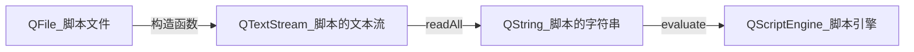
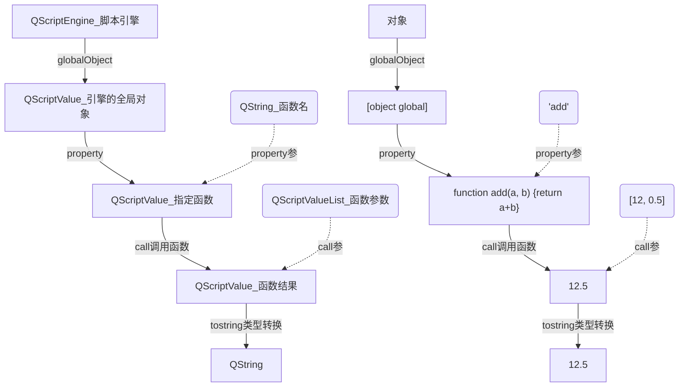

# Qt

# 目录

# .js 应用程序脚本

参考

- 《C++ GUI Qt 4 编程》（第二版）P387
- [【CSDN】Qt调用JS脚本](https://blog.csdn.net/graceland525/article/details/64906354/)，提供完整的简易代码

## 简概

### .py与.js区别

.js用作脚本的话和.py脚本类型，有略微不同

- Qt工程上的区别：
  - .py：==可以直接创建，不用加入到.qrc资源文件当中==，会归类到 “Other files” 当中
  - .js：==无法直接创建，但可以添加进.qrc资源文件中==
- 语言自身性质区别：python可以创建类，面向对象编程
- Qt支持上的区别：python有`PySide2 / PyQt5`模块的支持，这能让Python像C++一样使用Qt框架

### ECMAScript语言概述

略，详见JavaScript笔记

### 原理

Qt4.3开始包含QtScript，这是一个可以使用ECMAScript的模块

## 使用脚本扩展Qt应用程序

### ~~实战 - 书例~~（没法用）

```c++
void Calculaotr::createCustomButtons()
{
    QDir scriptsDir = directoryOf("scripts");										// 访问应用程序的脚本子目录
    QStringList fileNames = scriptsDir.entryList(QStringList("*.js"),QDir::Files);	// 找.js扩展名的文件
    foreach (QString fileName, fileNames){											// 循环脚本文件
        QString text = fileName;
        // ...
        button->setProperty("scriptFileName", scriptsDir.absoluteFilePath(fileName));// 设置属性使用脚本（绝对路径）
        // ...
    }
}
```

书例的吐槽：很多地方和实际生成的空demo不同

比如书上的js文件可以直接在函数外return，而我在项目中在函数外return会报错

比如这里的`directoryOf()`函数会报错，根本没法用

### 实战

#### (1) 准备脚本文件

trans.js

```js
function add(var1,var2)
{
    return var1+var2;
}

function sub(var1,var2)
{
    return var1-var2;
}
```

准备脚本文件并添加进工程的.qrc资源文件

注意：添加进去.qrc后.pro会自动添加一行`DISTFILES +=`，等号后面没内容
不知道干嘛用的，可以填js文件的名字，但不填也行，也能正常运行

#### (2) 使用脚本文件

.pro

```properties
QT       += script
# 需要手动添加：script模块，以使用后面的`<QScriptEngine> <QScriptValue> <QScriptValueList>`

RESOURCES += \dojs.qrc
# 这个是添加qrc文件时自动生成的

DISTFILES += \TransCal.js
# 这个是添加js文件进qrc文件时自动生成的
```

.cpp

```c++
#include <QDebug>
#include <QFile>                    // 文件（打开脚本用）
#include <QTextStream>              // 文件文本流
#include <QScriptEngine>            // 脚本引擎，   (依赖QtScript模块)用来加载和运行脚本
#include <QScriptValue>             // 脚本变量，   (依赖QtScript模块)用来存放脚本引擎的结果，可以得出脚本返回值
#include <QScriptValueList>         // 脚本变量列表，(依赖QtScript模块)用来存放传给脚本的参数
 
// ...

/** 加载脚本*/
void MainWindow::loadJS()
{
    /*读取脚本*/
    QFile scriptFile(":/Assets/trans.js");                  // 读取qrc资源里的js文件
    if (!scriptFile.open(QIODevice::ReadOnly))              // 【只读打开】
    {
        qWarning() << "encodePass.js open failed";
        return;
    }
    QTextStream out(&scriptFile);                           // 文本流
    QString contents = out.readAll();                       // 读到contents中
    scriptFile.close();                                     // 【关闭文件】
	
    /*使用脚本*/
    QString result = "";                                    // 存储脚本运算的返回值
    QScriptValueList args;      							// 调用js方法时传入的参数
    args << 12 << 0.5;
    QScriptEngine engine;                                   // 个人理解：加载js文本到操作引擎（返回QScriptValue对象）
    engine.evaluate(contents);

    QScriptValue func;
    func = engine.globalObject().property("add");           // 指定函数
    result = func.call(QScriptValue(), args).toString();	// 指定参数并调用
    qDebug() << "result1:" << result;                       // 12.5

    func = engine.globalObject().property("sub");           // 指定函数
    result = func.call(QScriptValue(), args).toString();	// 指定参数并调用
    qDebug() << "result2:" << result;                       // 11.5
}
```

### 流程总结 与 机制剖析

> #### 流程与数据流

从资源到创建脚本引擎



从脚本引擎到运算结果



#### 数据类型

数据类型

 * QScriptEngine类：提供了一个评估Qt脚本代码的环境，其大多数方法都是返回QScriptValue的
 * QScriptValue类：充当Qt脚本数据类型的容器
 * QScriptValueList类：（没有找到文档）


这里特别注意一下`QScriptValue类`，QScriptValue类的数据流如下

```c++
engine.globalObject()
// .toString()		"[object global]"
    
engine.globalObject().property("add")
// .toString()		"function add(var1, var2) {\r\n    return var1+var2;\r\n}"
    
engine.globalObject().property("add").call(QScriptValue(), args)
// .toString()		"12.5"
```


注意点

这里有个地方很奇怪，就是这里有三个量都是QScriptValue类型，但toString的结果却不一样

只能将这里当成函数的重载来理解了，**可以理解为是这三处QScriptValue是处于不同的状态当中的同一类型（我猜的）**

三个QScriptValue都是引擎的全局对象，第一个是整个脚本，第二个指定了函数名，第三个再指定了该函数的参数并进行了调用了


> #### 函数作用

函数作用

- `globalObject()`

  > ```c++
  > QScriptValue QScriptEngine::globalObject() const
  > ```
  >
  > 返回此引擎的全局对象
  >
  > 默认情况下，全局对象包含ECMA-262中的内置对象，例如Math、Date和String
  > 此外，您可以设置全局对象的属性，使您自己的扩展对所有脚本代码都可用
  > 脚本代码中的非局部变量将被创建为全局对象的属性，以及全局代码中的局部变量

- `property()`

  > ```c++
  > QScriptValue QScriptValue::property(const QString &name, const QScriptValue::ResolveFlags &mode = ResolvePrototype) const
  > ```
  >
  > 用给定的名称返回该QScriptValue属性的值，使用给定的模式来解析该属性
  >
  > 重载：如果不存在这样的属性，则返回一个无效的QScriptValue
  >
  > 重载：如果属性是使用getter函数实现的(即设置了PropertyGetter标志)，调用property()会对脚本引擎产生副作用，因为getter函数将被调用(可能导致未捕获的脚本异常)
  >
  > 异常：如果发生异常，property()将返回抛出的值(通常是一个Error对象)

- `call()`

  > ```c++
  > QScriptValue QScriptValue::call(const QScriptValue &thisObject = QScriptValue(), const QScriptValueList &args = QScriptValueList())
  > ```
  >
  > 将这个QScriptValue作为函数调用，在函数调用中使用thisObject作为' this'对象，并将args作为参数传递给函数，返回函数返回的值
  >
  > 重载：**如果这个QScriptValue不是一个函数**，那么call()不做任何事情并返回一个无效的QScriptValue
  >
  > 重载：如果thisObject不是一个对象，全局对象(参见QScriptEngine::globalObject())将被用作' this'对象
  >
  > 异常：调用call()会导致脚本引擎中出现异常;在这种情况下，call()返回抛出的值(通常是一个错误对象)。您可以调用QScriptEngine::hasUncaughtException()来确定是否发生了异常

## 使用本实现GUI扩展

作用：

结合ECMAScript代码和Qt设计师创建的窗体开发GUI前端

这一方法对那些不喜欢C++开发中的 “编译、连接、运行” 周期循环，而更喜欢脚本方法的开发者很有吸引力

它可以使那些有JavaScript经验的用户不用学习C++就能够设计功能齐全的用户界面

我们可以在脚本中直接访问应用程序的窗口部件以及其他组件

### 实战

实战项目：两个扩展，Statistics对话框和ReformatText对话框

- Statistics：统计文档中的字符、单词和行的数量
- ReformatText：非模态对话框


`createScriptAction()`，根据脚本创建动作


000000000000000000000000000000000000


## 使用脚本自动化处理任务

如何开发依赖C++组件的脚本


