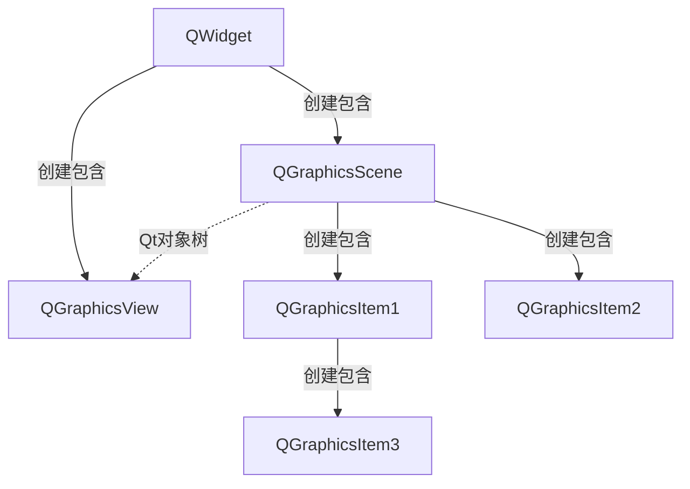
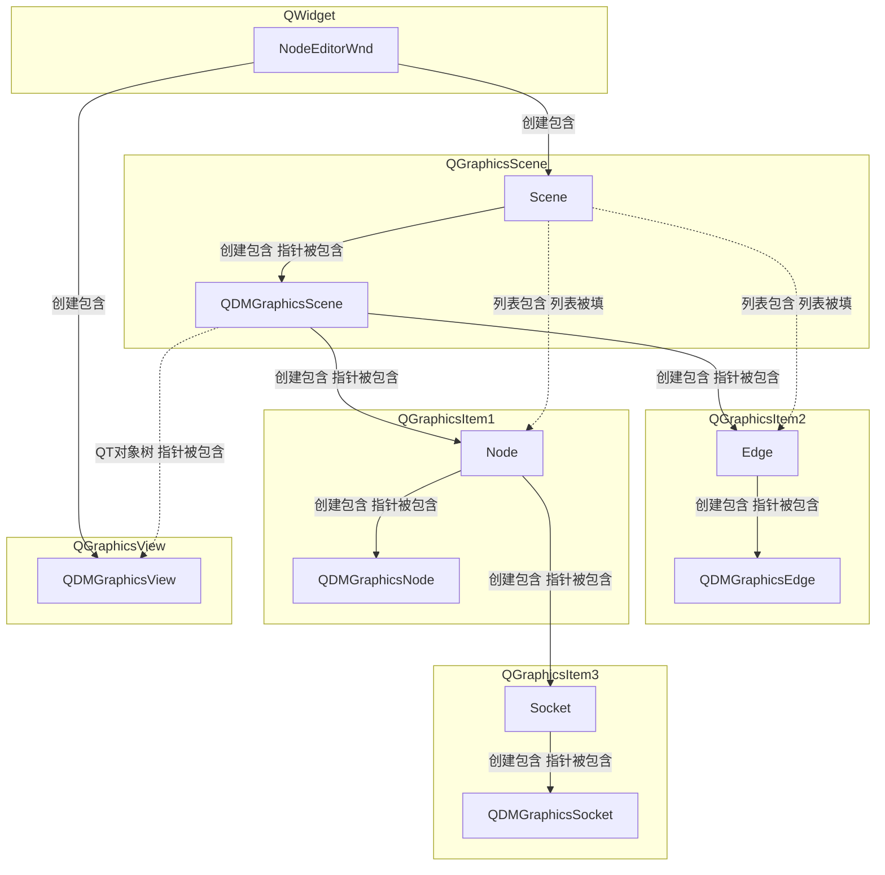
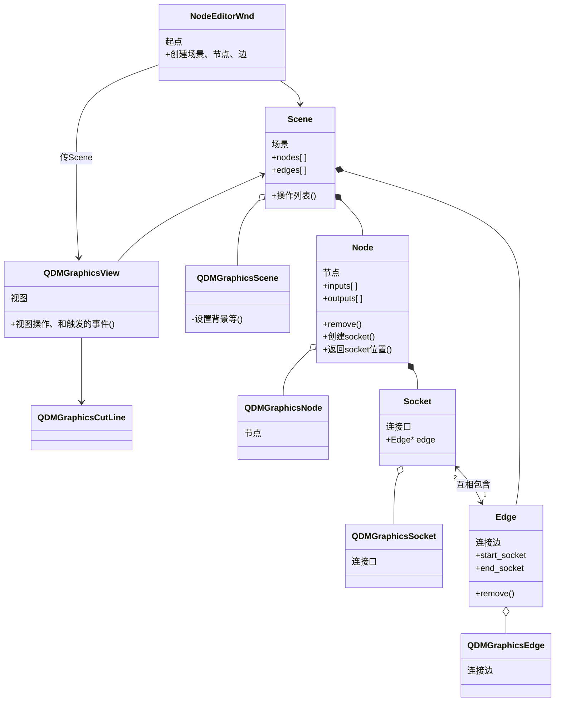

# PyQt_Node_Editor

# 目录

# 类的实现与设计

## 节点编辑器实现

### 使用原理


```c++
ads::CDockWidget* dockWidget = new ads::CDockWidget(i.value());
dockWidget->setWidget(widExport);
menuView->addAction(dockWidget->toggleViewAction());
m_DockManager->addDockWidget(ads::TopDockWidgetArea, dockWidget);

// ——————————————————————————————————————————————————————————————————————————————
// ——————————————————————————————————————————————————————————————————————————————

/** CDockWidget原理 */
class ADS_EXPORT CDockWidget : public QFrame
{
private:
    DockWidgetPrivate* d;  // 用来存储QWidget的东西
public:
    CDockWidget(const QString &title, QWidget* parent = 0);
    void setWidget(QWidget* widget, eInsertMode InsertMode = AutoScrollArea);
...
}

/** DockWidgetPrivate原理（DockWidget.cpp中定义） */
struct DockWidgetPrivate
{
    CDockWidget* _this = nullptr;  // 用来存储QWidget的东西
    ...
}

/** CDockManager原理 */
class ADS_EXPORT CDockManager : public CDockContainerWidget
{
private:
    QMap<QString, CDockWidget*> DockWidgetsMap;
public:
    CDockAreaWidget* addDockWidget(DockWidgetArea area, CDockWidget* Dockwidget,
                                   CDockAreaWidget* DockAreaWidget = nullptr){
        d->DockWidgetsMap.insert(Dockwidget->objectName(), Dockwidget);
    }
...
}

/** DockManagerPrivate原理 (DockManager.cpp中定义) */
struct DockManagerPrivate
{
    CDockManager* _this;
    QMap<QString, CDockWidget*> DockWidgetsMap;  // 存储QDockWidget的容器
    CDockWidget* CentralWidget = nullptr;
    ...
}
```

### QT类包含关系



> 补充：QGraphicsScene和QGraphicsView的关系
>
> 后者相当于摄像机，前者有多个后者，前者也能调用后者
>
> ```python
> self.node.scene.grScene.views()[0]
> ```

### 类包含关系

包含关系



### UML



### 容器管理

对象树容器

对容器的直接管理一览

（宗旨——尽可能不要让同一个容器被多个类影响，当然跨对象间接影响可以被允许）

```python
# Scene::nodes[]，被Node管理
# Scene::edges[]，被Edge管理
def addNode(self, node):
	""" 填充node列表
	方法被Node调用，间接被Scene、View、Window调用
	"""
	pass

def removeNode(self, node):
    """ 删除node列表中的元素
    方法被Node调用，间接被Scene、View、Window调用
    """
    pass

def addEdge(self, edge):
    """ 填充edge列表
    方法被Edge调用，间接被Scene、View、Window调用
    """
    pass

def removeEdge(self, edge):
    """ 删除edge列表中的元素
    方法被Edge调用，间接被Scene、View、Window调用
    """
    pass

# Node::inputs[]，不用被Socket管理，被自己管理
# Node::outputs[]，不用被Socket管理，被自己管理
""" 均被Node管理。这里没必要被Socket管理，这里下层不影响上层，除非你Socket可以自由增加或减少 """

# Socket::edges[]，被Edges管理
# TODO：应该要隐藏容器的
def addEdge(self, edge):
    """
    方法被Edge调用
    """
    pass

def removeEdge(self, edge):
    """
    方法被Edge调用
    """
    pass

def _delete_all_edges(self):
    """
    被self.remove调用
    multi_edges=False时addEdge也会调用
    """
    pass

# Edge::start_socket*
# Edge::end_socket*
# Edge::updatePosions，Node移动时会调用
@start_socket.setter
def start_socket(self, value):
    """ 方法被Edge、View调用 """
    pass

@end_socket.setter
def end_socket(self, value):
    """ 方法Edge、View调用 """
    pass
```

## 创建类

### node系列

#### main

node_editor_wnd.py

```python
class NodeEditorWnd(QWidget):
    """ 起点
    show的对象
    """
    self.scene = Scene()
    self.grScene = self.scene.grScene
    self.view = QDMGraphicsView(self.grScene, self)
```

node_graphics_view.py

```python
class QDMGraphicsView(QGraphicsView):
    """ 视图
    QDMGraphicsView(QGraphicsView)
    """
```

#### node_scene

node_scene.py

```python
class Scene:
    """ 包含节点的场景
    包含成员
        nodes和edges列表，由Node子对象去填充
        GrScene
        场景大小
    """
    
    self.grScene = QDMGraphicsScene(self)
        self.grScene.setGrScene(self.scene_width, self.scene_height)
```

node_graphics_scene.py

```python
class QDMGraphicsScene(QGraphicsScene):
    """ 场景
    """
```

#### node_node

node_node.py

```python
class Node:
    """ 创建节点的工厂
    包含成员
        inputs和outputs
        grNode
    包含方法
        返回socket的位置
        设置节点位置
    父对象操作
    	对scene的Node列表进行填充
    """
    
    def __init__(self, scene, title="Undefined Node"):
    	self.grNode = QDMGraphicsNode(self, self.title)
```

node_graphics_node.py

```python
class QDMGraphicsNode(QGraphicsItem):
    """ 节点
    包含
        节点属性
    补充
        需要注意QGraphicsItem是抽象类
        virtual QRectF boundingRect() const = 0
        virtual void paint(QPainter *painter, const QStyleOptionGraphicsIte, *option, QWidget *widget = nullptr) = 0
    """
```

#### node_socket

node_socket.py

```python
class Socket:
    """ 创建Socket的工厂，包括输入和输出
    包含
        位置
    父对象操作
        这次没有，父对象自己操作了
    """
    
    def __init__(self, node, index=0, position=LEFT_TOP):
    	self.grSocket = QDMGraphicsSocket(self.node.grNode)
```

node_graphics_socket.py

```python
class QDMGraphicsSocket(QGraphicsItem):
    """ 节点的IO口，以小圆点的形式表现
    """
```

#### node_edge

node_edge.py

```python
class Edge:
    """ 创建节点的工厂，通过type决定创建哪一种线
    包含成员
        开始的socket和结束的socket
        grEdge
    父对象操作
        对scene的Node列表进行填充
        对socket的edge进行赋值（当前只能一对一）
    """
    def __init__(self, scene, start_socket, end_socket, type=EDGE_TYPE_DIRECT):
        self.scene = scene
        self.grEdge = QDMGraphicsEdgeDirect(self) if type == EDGE_TYPE_DIRECT else QDMGraphicsEdgeBezier(self)
        self.scene.grScene.addItem(self.grEdge)
```

node_graphics_edge.py

```python
class QDMGraphicsEdge(QGraphicsLineItem):
    """ 连接socket的边
    """
```

## 一些冲突

### 关于循环依赖

> 这里的循环依赖很多，Python是弱类型，循环依赖要好解决得多，不像C++。
>
> C++如果要循环依赖还需变量提前声明，包含指针只需要声明变量即可。
> 创建包含的那个类include，反向包含指针的类则向前声明再包含指针。
>
> C++循环依赖也很常见，像QT的对象树需要传回父指针也是一种

### romove函数冲突

node和edge都有remove

多选以后一起调用remove就有冲突了

甚至都不用多选，你删调一个节点，edge remove，他要删除两边节点的edge信息的

- node remove 调用 edge remove
- edge remove 不用调用 node remove
- 后者要做个 try catch pass


