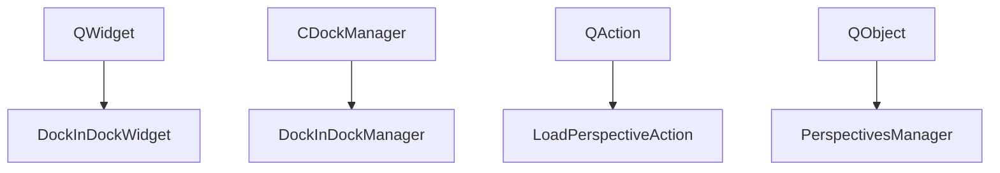
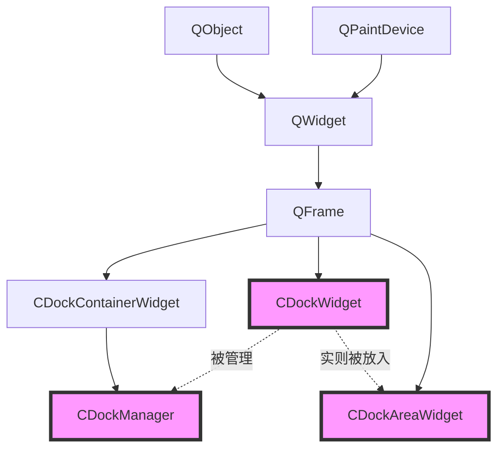

# Qt

# 目录

# Qt_Advanced_Docking_System

- Keyword
  - qt dock window
  - qt 停靠Dock
- Reference
  - ~~[【博客园】高级停靠(Dock)技术的实现](https://www.cnblogs.com/cxp2009/p/3270019.html)~~（非Qt实现）
  - ~~[【博客园】Qt布局管理： 停靠窗口QDockWidget类（纯代码实现）](https://www.cnblogs.com/fuqia/p/9154406.html)~~
  - [【Qt官网】advanced-docking-system](https://marketplace.qt.io/products/advanced-docking-system)
  - [【Github】Qt-Advanced-Docking-System](https://github.com/githubuser0xFFFF/Qt-Advanced-Docking-System#getting-started--example)

## 先进的对接系统

https://marketplace.qt.io/products/advanced-docking-system

advanced-docking-system，简称ADS

使用步骤

- git clone
- 用Qt打开clone文件夹中的abs.pro
- 选择一个子项目构建并运行

### 项目分析

- **【abs子目录项目】**

  - demo项目，综合使用，还能保存布局
  - **【examplesdo子目录】**
    - centralwidget项目，有中心部件
    - deleteonclose，可新建dock
    - dockindock项目，嵌套标签
    - emptydockarea项目，3个dock + 1个dockarea
    - sidebar项目，2个dock + 一个固定的左侧
    - simple项目，1个dock
  - src项目，**DockSystem的关键源码**

- pro依赖

  - ```properties
    demo.depends = src
    examples.depends = src
    ```

### 官方案例 - Example

官方提供了6个小demo以及1个综合demo，可供参考使用，非常nice

- demo项目，综合使用，还能保存布局
- 【examplesdo子目录】
  - centralwidget项目，有中心部件
  - deleteonclose，可新建dock
  - dockindock项目，嵌套标签
  - emptydockarea项目，3个dock + 1个dockarea
  - sidebar项目，2个dock + 一个固定的左侧
  - simple项目，1个dock

### 官方作品 - 展示柜

参考Github中的说明：https://github.com/githubuser0xFFFF/Qt-Advanced-Docking-System#showcase

從 4.12 版本開始，Qt Creator 使用 Advanced Docking Framework Qt 快速設計器。  這提高了使用多個屏幕時的可用性。 

## 接口使用

### 基本使用（接入使用）

#### 接入使用 - 代码增量

原理详见 “接入使用原理” 一节

参考Github中的说明：https://github.com/githubuser0xFFFF/Qt-Advanced-Docking-System#getting-started--example

接入，显示了使用高级 Qt 对接系统所需的最少代码（即以simple为例）

pro

（增量部分）

```properties
## Qt-Advanced-Docking-System
#TEMPLATE = app                  # app模板（默认）
#TARGET = Core                   # 指定目标文件的名称。默认情况下包含项目文件的基本名称
#CONFIG += debug_and_release
#adsBuildStatic {                # 静态绝对路径？宏？
#    DEFINES += ADS_STATIC       # qmake将该变量的值作为编译器C预处理器宏(-D选项)添加
#}
#DEFINES += QT_DEPRECATED_WARNINGS#qmake将该变量的值作为编译器C预处理器宏(-D选项)添加

ADS_OUT_ROOT = $${OUT_PWD}/..   # 定义常量路径 = 指定Makefile的目录的完整路径，的再上一级
LIBS += -L$${ADS_OUT_ROOT}/lib  # 添加LIB搜索路径
#DESTDIR = $${ADS_OUT_ROOT}      # 输出路径（ exe或lib/dll）
#DISTFILES += \                  # 跨平台用pri，缺失会报错error: LNK2019: 无法解析的外部符号
#    abs.pri
include(abs.pri)                # 跨平台用pri，缺失会报错error: LNK2019: 无法解析的外部符号
INCLUDEPATH += ../AdvancedDockingSystem # 包含路径（需要#include "DockManager.h"）
#DEPENDPATH += ../AdvancedDockingSystem  # 依赖路径（好像不写也行会自动判断）
```

abs.pri

（跨平台支持。该文件也可写到pro文件中，这里独立出来，专门为跨平台编译调试适配）

（缺失会报错：一大堆的LNK2019：无法解析的外部符号；LNK1120：19个无法解析的外部符号。是因为找不到qtadvanceddocking.dll的缘故）

```properties
# 指定工程要链接的库（库既可使用绝对路径，也可使用Unix的-L和-l标识符，例`-L/usr/local/lib`和`-ldb_cxx`）
CONFIG(debug, debug|release){               # debug模式
    win32 {
        LIBS += -lqtadvanceddockingd        # windows的debug库名称：最后有个字母d
    }
    else:mac {
        LIBS += -lqtadvanceddocking_debug   # mac的debug库名称：有个后缀_debug
    }
    else {
        LIBS += -lqtadvanceddocking
    }
}
else{                                       # release模式
    LIBS += -lqtadvanceddocking
}

unix:!macx {
    LIBS += -lxcb
}

```

main.cpp

（无需修改）

```c++
#include <QApplication>
#include "../../examples/simple/MainWindow.h"

int main(int argc, char *argv[])
{
    QApplication a(argc, argv);
    MainWindow w;
    w.show();

    return a.exec();
}
```

MainWindow.h

（只需正常include和使用）

```c++
#ifndef MAINWINDOW_H
#define MAINWINDOW_H

#include <QMainWindow>
#include "DockManager.h"                // 核心代码中的类

QT_BEGIN_NAMESPACE
namespace Ui {
class MainWindow;
}
QT_END_NAMESPACE

class MainWindow : public QMainWindow
{
    Q_OBJECT

public:
    explicit MainWindow(QWidget *parent = 0);
    ~MainWindow();

private:
    Ui::MainWindow *ui;
    ads::CDockManager* m_DockManager;   // 核心代码类
};

#endif // MAINWINDOW_H
```

MainWindow.cpp

```c++
#include "../../examples/simple/MainWindow.h"

#include "ui_MainWindow.h"

#include <QLabel>
#include <QTimer>

MainWindow::MainWindow(QWidget *parent) :
    QMainWindow(parent),
    ui(new Ui::MainWindow)
{
    ui->setupUi(this);

    // Dock管理器部分
    m_DockManager = new ads::CDockManager(this);

    // Dock控件部分
    QLabel* l = new QLabel();                       // Dock控件中的内容
    l->setWordWrap(true);                           // 保存标签的换行策略（默认禁用）
    l->setAlignment(Qt::AlignTop | Qt::AlignLeft);  // 对齐方式（默认左对齐+垂直居中）
    l->setText("It's a content text. ");

    ads::CDockWidget* DockWidget = new ads::CDockWidget("Label 1"); // Dock控件
    DockWidget->setWidget(l);                                       // 设置内容

    // 菜单部分
    QMenuBar * bar = new QMenuBar();
    setMenuBar(bar);
    QMenu * view = bar->addMenu("View");
    view->addAction(DockWidget->toggleViewAction());// 切换Action状态（是否显示）

    // 将Dock控件添加进Dock管理器
    m_DockManager->addDockWidget(ads::TopDockWidgetArea, DockWidget);
}

MainWindow::~MainWindow()
{
    delete ui;
}

```

#### 接入使用 - 打包注意项

除了复制lib文件夹，还要将lib文件夹中的qtadvanceddocking.dll拷贝到根目录

否则报错：由于找不到qtadvanceddocking.dll，无法继续执行代码。重新安装程序可能会解决此问题

#### 基本使用  单Dock

ads::CDockManager（Dock管理器）

```c++
m_DockManager = new ads::CDockManager(this);						// 定义Dock管理器（头文件已声明）
// 创建Dock控件
m_DockManager->addDockWidget(ads::TopDockWidgetArea, DockWidget);	// 将Dock控件添加进Dock管理器
```

ads::CDockWidget（Dock控件）

```c++
ads::CDockWidget* DockWidget = new ads::CDockWidget("Tag1");	// Dock控件
DockWidget->setWidget(widget);									// 设置内容
```

#### 基本使用  多Dock

```c++
// Dock管理器
m_DockManager = new ads::CDockManager(this);

// Dock控件1
ads::CDockWidget* DockWidget = new ads::CDockWidget("Label 1");
DockWidget->setWidget(widget1);
ui->menuView->addAction(DockWidget->toggleViewAction());			// 开关切换（Dock窗口的关闭和显示）
m_DockManager->addDockWidget(ads::TopDockWidgetArea, DockWidget);	// 加入管理器（上方）

// Dock控件2
DockWidget = new ads::CDockWidget("Label 2");
DockWidget->setWidget(widget2);
ui->menuView->addAction(DockWidget->toggleViewAction());			// 开关切换（Dock窗口的关闭和显示）
m_DockManager->addDockWidget(ads::BottomDockWidgetArea, DockWidget);// 加入管理器（底部）
```

### 进阶使用

主要使用的类

- ads::CDockManager（Dock管理器）
- ads::CDockWidget（Dock控件）
- ads::CDockAreaWidget（Dock区域）

#### 垃圾回收  DockManager

closeEvent 事件钩子函数介绍

> 当Qt从窗口系统接收到一个顶级小部件的窗口关闭请求时，该事件处理程序将与给定的事件一起调用。
>
> 默认情况下，接受事件并关闭小部件。您可以重新实现这个函数，以更改小部件响应窗口关闭请求的方式。
> 例如，您可以通过对所有事件调用ignore()来**防止窗口关闭**。
>
> 主窗口应用程序通常使用此函数的重新实现来检查用户的工作是否已被保存，并在关闭前请求许可。
> 例如，Application example使用helper函数来**决定是否关闭窗口**。

头文件

```c++
protected:
    virtual void closeEvent(QCloseEvent *event) override;
```

cpp重写虚函数

```c++
void MainWindow::closeEvent(QCloseEvent *event)
{
    QMainWindow::closeEvent(event);		// 原功能不变，增加新措施
    if (m_DockManager)					// 如果该容器还在
    {
        m_DockManager->deleteLater();	// 则销毁容器并释放内存空间
    }
}
```

这样做的原因：

> MainWindow头文件中包含了这个指针，`ads::CDockManager* m_DockManager;`
>
> 如果在cpp中new了`new ads::CDockManager(this);`，并往该容器里放东西了，则最后应该释放这里的空间
>
> 加if是为了防止new了但是没有往该容器里add，此时delete非空指针会导致程序错误

#### 垃圾回收  DockWidget

主要代码

```c++
dockWidget->setFeature(ads::CDockWidget::DockWidgetDeleteOnClose, true);
```

案例代码

（deleteonclose案例）

该案例主要是用来验证了内存的确被回收了：

- new Dock的地址也会一直在变，dock标签的序号也一直在增加。主要观察的是DockArea的地址
- 启用销毁回收时
  - DockArea不销毁后则地址不变，销毁后new DockArea地址改变，证明了DockArea被销毁了！没有被复用！
  - 而DockArea又是dockWidget的容器，也证明了WidgetDock被销毁了！没有复用！
- 不启用销毁回收时
  - DockArea不销毁后则地址不变，销毁后new DockArea地址依然不改变，证明了DockArea没有被销毁而是复用了！

```c++
class MainWindow : public QMainWindow
{
private:
    ads::CDockManager* m_DockManager = nullptr;

protected:
    virtual void closeEvent(QCloseEvent *event) override	// DockManager的垃圾回收
    {
        QMainWindow::closeEvent(event);
        if (m_DockManager)
        {
            m_DockManager->deleteLater();
        }
    }

public:
    void setDockManager(ads::CDockManager* DockManager) {m_DockManager = DockManager;}
};


int main(int argc, char *argv[])
{
    QApplication a(argc, argv);
    MainWindow w;

    /* 初始化部分 */
    auto dockManager = new ads::CDockManager(&w);
    w.setDockManager(dockManager);                                                  // 初始化类中指针

    /* 标签切换部分 */
    QObject::connect(dockManager, &ads::CDockManager::focusedDockWidgetChanged,     // 信号槽：聚焦改变时（切换标签时）
                     [] (ads::CDockWidget* old, ads::CDockWidget* now) {            // old和now都可以是nullptr
        static int Count = 0;                                                       // 静态计数器
    	qDebug() << Count++ << " CDockManager::focusedDockWidgetChanged old: " << (old ? old->objectName() : "-") << " now: " << now->objectName() << " visible: " << now->isVisible();
        now->widget()->setFocus();                                                  // 设置新窗口被聚焦
    });

    /* 工具栏按钮一 */
    int i = 0; // 标签切换次数
    QAction *action = new QAction("New Delete On Close", &w);                       // 新建Dock（关闭销毁）
    w.menuBar()->addAction(action);
    QObject::connect(action, &QAction::triggered, [&]() {                           // 信号槽：新建Dock
        auto dw = new ads::CDockWidget(QStringLiteral("test doc %1").arg(i++), &w); // 新建Dock
        auto editor = new QTextEdit(QStringLiteral("lorem ipsum..."), dw);          // Dock内容
        dw->setWidget(editor);
        dw->setFeature(ads::CDockWidget::DockWidgetDeleteOnClose, true);            // Dock关闭时销毁（按钮二无该功能）
        auto area = dockManager->addDockWidgetTab(ads::CenterDockWidgetArea, dw);   // 将Dock添加到Manager并返回DockArea
        qDebug() << "doc dock widget created!" << dw << area;   // 输出两个地址：后面那个DockArea的地址不变
    });

    /* 工具栏按钮二 */
    action = new QAction("New", &w);                                                // 新建Dock（关闭不销毁）
    w.menuBar()->addAction(action);
    QObject::connect(action, &QAction::triggered, [&]() {                           // 信号槽：新建Dock
        auto dw = new ads::CDockWidget(QStringLiteral("test %1").arg(i++), &w);
        auto editor = new QTextEdit(QStringLiteral("lorem ipsum..."), dw);
        dw->setWidget(editor);
        auto area = dockManager->addDockWidgetTab(ads::CenterDockWidgetArea, dw);
        qDebug() << "dock widget created!" << dw << area;       // 输出两个地址：后面那个DockArea的地址不变
    });

    w.show();
    return a.exec();
}
```

#### 属性设置  DockManager

dockManager设置

```c++
// 看不出来有什么用
CDockManager::setConfigFlag(CDockManager::OpaqueSplitterResize, true);
	// 看到QSplitter::setOpaqueResize()的文档
CDockManager::setConfigFlag(CDockManager::XmlCompressionEnabled, false);
	// 如果启用，XML编写器会自动在元素之间的空白部分(可忽略的空格)添加换行和缩进
CDockManager::setConfigFlag(CDockManager::FocusHighlighting, true);
	// 启用：聚焦选项卡高亮（聚焦和非聚焦分别是蓝灰，不启用则是白灰）
CDockManager::setConfigFlag(CDockManager::AllTabsHaveCloseButton, true);
	// 启用：那么所有可关闭的选项卡将显示关闭按钮（否则只有被聚焦的那一个才有）
```

原理：setConfigFlag方法

```c++
// 声明静态函数(.h)
static void setConfigFlag(eConfigFlag Flag, bool On = true);
// 声明静态成员(.h)
static CDockManager::ConfigFlags StaticConfigFlags = CDockManager::DefaultNonOpaqueConfig;
// 函数实现(.cpp)
void CDockManager::setConfigFlag(eConfigFlag Flag, bool On)
{
	internal::setFlag(StaticConfigFlags, Flag, On);
}
```

DockManager的Flag集

```c++
enum eConfigFlag
{
    ActiveTabHasCloseButton = 0x0001,    //!< If this flag is set, the active tab in a tab area has a close button
    DockAreaHasCloseButton = 0x0002,     //!< If the flag is set each dock area has a close button
    DockAreaCloseButtonClosesTab = 0x0004,//!< If the flag is set, the dock area close button closes the active tab, if not set, it closes the complete dock area
    OpaqueSplitterResize = 0x0008, //!< See QSplitter::setOpaqueResize() documentation
    XmlAutoFormattingEnabled = 0x0010,//!< If enabled, the XML writer automatically adds line-breaks and indentation to empty sections between elements (ignorable whitespace).
    XmlCompressionEnabled = 0x0020,//!< If enabled, the XML output will be compressed and is not human readable anymore
    TabCloseButtonIsToolButton = 0x0040,//! If enabled the tab close buttons will be QToolButtons instead of QPushButtons - disabled by default
    AllTabsHaveCloseButton = 0x0080, //!< if this flag is set, then all tabs that are closable show a close button
    RetainTabSizeWhenCloseButtonHidden = 0x0100, //!< if this flag is set, the space for the close button is reserved even if the close button is not visible
    OpaqueUndocking = 0x0200,///< If enabled, the widgets are immediately undocked into floating widgets, if disabled, only a draw preview is undocked and the real undocking is deferred until the mouse is released
    DragPreviewIsDynamic = 0x0400,///< If opaque undocking is disabled, this flag defines the behavior of the drag preview window, if this flag is enabled, the preview will be adjusted dynamically to the drop area
    DragPreviewShowsContentPixmap = 0x0800,///< If opaque undocking is disabled, the created drag preview window shows a copy of the content of the dock widget / dock are that is dragged
    DragPreviewHasWindowFrame = 0x1000,///< If opaque undocking is disabled, then this flag configures if the drag preview is frameless or looks like a real window
    AlwaysShowTabs = 0x2000,///< If this option is enabled, the tab of a dock widget is always displayed - even if it is the only visible dock widget in a floating widget.
    DockAreaHasUndockButton = 0x4000,     //!< If the flag is set each dock area has an undock button
    DockAreaHasTabsMenuButton = 0x8000,     //!< If the flag is set each dock area has a tabs menu button
    DockAreaHideDisabledButtons = 0x10000,    //!< If the flag is set disabled dock area buttons will not appear on the toolbar at all (enabling them will bring them back)
    DockAreaDynamicTabsMenuButtonVisibility = 0x20000, //!< If the flag is set, the tabs menu button will be shown only when it is required - that means, if the tabs are elided. If the tabs are not elided, it is hidden
    FloatingContainerHasWidgetTitle = 0x40000, //!< If set, the Floating Widget window title reflects the title of the current dock widget otherwise it displays application name as window title
    FloatingContainerHasWidgetIcon = 0x80000, //!< If set, the Floating Widget icon reflects the icon of the current dock widget otherwise it displays application icon
    HideSingleCentralWidgetTitleBar = 0x100000, //!< If there is only one single visible dock widget in the main dock container (the dock manager) and if this flag is set, then the titlebar of this dock widget will be hidden
                                                //!< this only makes sense for non draggable and non floatable widgets and enables the creation of some kind of "central" widget

    FocusHighlighting = 0x200000, //!< enables styling of focused dock widget tabs or floating widget titlebar
    EqualSplitOnInsertion = 0x400000, ///!< if enabled, the space is equally distributed to all widgets in a  splitter

    FloatingContainerForceNativeTitleBar = 0x800000, //!< Linux only ! Forces all FloatingContainer to use the native title bar. This might break docking for FloatinContainer on some Window Managers (like Kwin/KDE).
                                                     //!< If neither this nor FloatingContainerForceCustomTitleBar is set (the default) native titlebars are used except on known bad systems.
                                                     //! Users can overwrite this by setting the environment variable ADS_UseNativeTitle to "1" or "0".
    FloatingContainerForceQWidgetTitleBar = 0x1000000,//!< Linux only ! Forces all FloatingContainer to use a QWidget based title bar.
                                                     //!< If neither this nor FloatingContainerForceNativeTitleBar is set (the default) native titlebars are used except on known bad systems.
                                                     //! Users can overwrite this by setting the environment variable ADS_UseNativeTitle to "1" or "0".

    DefaultDockAreaButtons = DockAreaHasCloseButton
                           | DockAreaHasUndockButton
                           | DockAreaHasTabsMenuButton,///< default configuration of dock area title bar buttons

    DefaultBaseConfig = DefaultDockAreaButtons
                      | ActiveTabHasCloseButton
                      | XmlCompressionEnabled
                      | FloatingContainerHasWidgetTitle,///< default base configuration settings

    DefaultOpaqueConfig = DefaultBaseConfig
                        | OpaqueSplitterResize
                        | OpaqueUndocking, ///< the default configuration with opaque operations - this may cause issues if ActiveX or Qt 3D windows are involved

    DefaultNonOpaqueConfig = DefaultBaseConfig
                  | DragPreviewShowsContentPixmap, ///< the default configuration for non opaque operations

    NonOpaqueWithWindowFrame = DefaultNonOpaqueConfig
                  | DragPreviewHasWindowFrame ///< the default configuration for non opaque operations that show a real window with frame
};
```

#### 属性设置  DockWidget

DockWidget设置

```c++
// 这一组设置好像没用。好像都会背覆盖
dockWidget->setMinimumSizeHintMode(CDockWidget::MinimumSizeHintFromDockWidget);// 设置minimumSizeHint()返回的最小尺寸提示
dockWidget->resize(250, 150);													// 设置尺寸（但会被覆盖）
dockWidget->setMinimumSize(200,150);												// 设置最小尺寸（但会被覆盖）
dockWidget->setFeature(ads::CDockWidget::DockWidgetDeleteOnClose, true); // 在Dock关闭时删除它
```

DockWidget的Flag集

```c++
enum DockWidgetFeature
{
    DockWidgetClosable = 0x01,///< dock widget has a close button
    DockWidgetMovable = 0x02,///< dock widget is movable and can be moved to a new position in the current dock container
    DockWidgetFloatable = 0x04,///< dock widget can be dragged into a floating window
    DockWidgetDeleteOnClose = 0x08, ///< deletes the dock widget when it is closed
    CustomCloseHandling = 0x10, ///< clicking the close button will not close the dock widget but emits the closeRequested() signal instead
    DockWidgetFocusable = 0x20, ///< if this is enabled, a dock widget can get focus highlighting
    DockWidgetForceCloseWithArea = 0x40, ///< dock widget will be closed when the dock area hosting it is closed
    NoTab = 0x80, ///< dock widget tab will never be shown if this flag is set
    DefaultDockWidgetFeatures = DockWidgetClosable | DockWidgetMovable | DockWidgetFloatable | DockWidgetFocusable,
    AllDockWidgetFeatures = DefaultDockWidgetFeatures | DockWidgetDeleteOnClose | CustomCloseHandling,
    DockWidgetAlwaysCloseAndDelete = DockWidgetForceCloseWithArea | DockWidgetDeleteOnClose,
    NoDockWidgetFeatures = 0x00
};
```

#### DockAreaWidget管理

以下方法都会返回CDockAreaWidget类型

```c++
/**
 * 【将dockwidget添加到给定区域】（用枚举类型指定区域）
 * 如果给定区域已有dockWidget：不会合并成一个标签组，而会在下面的区域创建dockWidget
 *
 * 第三个缺省参数是CDockAreaWidget，如果dockarewidget不为空，则area参数表示dockwidget被放置的区域
 */
CDockAreaWidget* CDockManager::addDockWidget(DockWidgetArea area, CDockWidget* Dockwidget,
		CDockAreaWidget* DockAreaWidget = nullptr);

/**
 * 【将dockwidget"作为中心小部件"添加到中心区域】
 * 如果给定区域已有dockWidget：则取代之
 */
CDockAreaWidget* CDockManager::setCentralWidget(CDockWidget* widget);

/**
 * 【将dockwidget"作为一个新选项卡"添加到给定区域】（用枚举类型指定区域）
 * 如果给定区域已有dockWidget：则合并为一个标签组
 *
 * 如果给定区域标识符不存在dockAreaWidget，则创建一个新的dockAreaWidget
 */
CDockAreaWidget* CDockManager::addDockWidgetTab(DockWidgetArea area, CDockWidget* Dockwidget);

/**
 * 【将dockwidget"作为一个新选项卡"添加到给定区域】（用CDockAreaWidget*类型指定区域）
 * 如果给定区域已有dockWidget：则合并为一个标签组
 */
CDockAreaWidget* CDockManager::addDockWidgetTabToArea(CDockWidget* Dockwidget, CDockAreaWidget* DockAreaWidget);
```

技巧

```c++
DockManager->addDockWidgetTabToArea(dockWidget1, dockAreaCentral); 							// 【添加到Dock区域】
auto dockArea = DockManager->addDockWidget(DockWidgetArea::LeftDockWidgetArea, dockWidget1);// 【添加Dock控件】
// 等价于
auto dockArea = DockManager->addDockWidget(DockWidgetArea::LeftDockWidgetArea, dockWidget1, dockAreaCentral);
// 等价于（Manager）
auto dockArea = DockManager->addDockWidget(DockWidgetArea::LeftDockWidgetArea, dockWidget1);
```

#### 添加中心区域

中心区域cpp（版本一），特点：有中心区域、DockWidget**可以**拖至中心区域

```c++
// 【DockManager】
DockManager = new CDockManager(this);

// 【CentralDockWidget】
CDockWidget* dockWidgetCentral = new CDockWidget("CentralWidget");
dockWidgetCentral->setWidget(widget1);
/* 如果参数2为true，则设置这个dockWidget的特性标志；否则清除标志
 * 标志为：如果设置了此标志，dockWidget的标签将永远不会显示
 * 注意：注释掉以后还是可以拖拽，只是没标签，即与其他Dock组成标签列时则不会显示标签
 */
dockWidgetCentral->setFeature(ads::CDockWidget::NoTab, true);
auto* dockAreaCentral = DockManager->setCentralWidget(dockWidgetCentral); // 【设置中心部件】
```

中心区域cpp（版本二），特点：有中心区域、DockWidget**不可**拖至中心区域

```c++
// 【DockManager】
DockManager = new CDockManager(this);

// 【CentralDockWidget】
CDockWidget* dockWidgetCentral = new CDockWidget("CentralWidget");
dockWidgetCentral->setWidget(widget1);
auto* dockAreaCentral = DockManager->setCentralWidget(dockWidgetCentral); // 【设置中心部件】
/* 配置这个特定的dockArea中允许停靠的区域
 * 这里的宏指外部区域，即不允许停靠中间
 * 其他DockWidget拖拽不进来，也不用调用setFeature(ads::CDockWidget::NoTab, true);方法了
 */
dockAreaCentral->setAllowedAreas(DockWidgetArea::OuterDockAreas);
```

围绕中心区域新建Dock（DockAreaWidget进行区域管理）

```c++
// 【Other DockWidgets1】
CDockWidget* dockWidget1 = new CDockWidget("Table 1");
dockWidget1->setWidget(table);
DockManager->addDockWidgetTabToArea(dockWidget1, dockAreaCentral); 							// 【添加到Dock区域】
auto dockArea = DockManager->addDockWidget(DockWidgetArea::LeftDockWidgetArea, dockWidget1);// 【添加Dock控件】

// 【Other DockWidgets2、3】，注意参数3
DockManager2->addDockWidget(DockWidgetArea::BottomDockWidgetArea, dockWidget2, dockArea); 	// 【添加Dock控件】
DockManager3->addDockWidget(DockWidgetArea::RightDockWidgetArea, dockWidget3, dockAreaCentral);// 【添加Dock控件】
```

#### mix ui文件（限制DockManager区域）

在ui文件中直接使用拖拽一个QWidget控件出来，将其命名为“dockContainer”，然后将`ads::CDockManager`放入该控件的Layout里

```c++
QVBoxLayout* Layout = new QVBoxLayout(ui->dockContainer);
Layout->setContentsMargins(QMargins(0, 0, 0, 0));			// 设置布局周围使用的左、上、右、下边距
m_DockManager = new ads::CDockManager(ui->dockContainer);
Layout->addWidget(m_DockManager);							// 将DockManager放入Layout
```

原理：

DockManager本身所在的区域应该存在一个DockAreaWidget（虽然源码中看不出来有包含）布局管理 Properties

（centralwidget和emptydockarea案例）

头文件

```c++
private:
	void createPerspectiveUi();
private slots:
	void savePerspective();
```

cpp

```c++
CMainWindow::CMainWindow(QWidget *parent)
    : QMainWindow(parent)
    , ui(new Ui::CMainWindow)
{
	//...
    createPerspectiveUi();
}

void CMainWindow::createPerspectiveUi()	// 工具栏：保存与切换布局
{
    SavePerspectiveAction = new QAction("Create Perspective", this);                // 创建布局-Action
    connect(SavePerspectiveAction, SIGNAL(triggered()), SLOT(savePerspective()));   // 创建布局-Action的信号槽
    PerspectiveListAction = new QWidgetAction(this);                                // 布局列表-Action
    // QWidgetAction：通过一个接口扩展了QAction，该接口用于将定制小部件插入到基于操作的容器中，比如工具栏
    PerspectiveComboBox = new QComboBox(this);                                      // 下拉框
    PerspectiveComboBox->setSizeAdjustPolicy(QComboBox::AdjustToContents);          // 下拉框：当内容更改时组合框的大小如何更改
    PerspectiveComboBox->setSizePolicy(QSizePolicy::Preferred, QSizePolicy::Preferred);// 下拉框：保存小部件的默认布局行为
    //	connect(PerspectiveComboBox, SIGNAL(activated(const QString&)),				// 原案例的错误写法
	//	DockManager, SLOT(openPerspective(const QString&)));
    connect(PerspectiveComboBox, &QComboBox::activated,                             // 下拉框选择时切换布局
            DockManager, [&](int i){
        DockManager->openPerspective(PerspectiveComboBox->itemText(i));
    });
    PerspectiveListAction->setDefaultWidget(PerspectiveComboBox);                   // 绑定下拉框和布局列表-Action
    ui->toolBar->addSeparator();                                                    // 工具栏：增加分割线
    ui->toolBar->addAction(PerspectiveListAction);                                  // 工具栏：布局列表-Action
    ui->toolBar->addAction(SavePerspectiveAction);                                  // 工具栏：创建布局-Action
}

void CMainWindow::savePerspective()     // 保存布局具体实现
{                                                                   // 弹窗获取布局名
    QString PerspectiveName = QInputDialog::getText(this, "Save Perspective", "Enter unique name:");
    if (PerspectiveName.isEmpty())                                  // 检测是否正确输入了布局名
	{
		return;
	}
    DockManager->addPerspective(PerspectiveName);                   // 添加布局
    QSignalBlocker Blocker(PerspectiveComboBox);                    // 异常安全包装QObject::blockSignals()？？？
    PerspectiveComboBox->clear();                                   // 清除下拉框内容
    PerspectiveComboBox->addItems(DockManager->perspectiveNames()); // 重新填充下拉框
    PerspectiveComboBox->setCurrentText(PerspectiveName);           // 设置显示的文本
}
```

修改

```c++
//	connect(PerspectiveComboBox, SIGNAL(activated(const QString&)),
//		DockManager, SLOT(openPerspective(const QString&)));
/* 上面的写法会报错：
 * QObject::connect: No such signal QComboBox::activated(const QString&) 
 * in ..\..\..\Qt-Advanced-Docking-System\examples\centralwidget\mainwindow.cpp:99
 * 只有 QComboBox::activated(const int&) 方法 
 */
	connect(PerspectiveComboBox, &QComboBox::activated,
            DockManager, [&](int i){
        DockManager->openPerspective(PerspectiveComboBox->itemText(i));
    });
```

原理

```c++
// DockWidget.h
class ADS_EXPORT CDockWidget : public QFrame
{
protected:
    friend struct DockManagerPrivate;	// 私有数据类型
}

// DockManager.cpp
struct DockManagerPrivate
{
	QMap<QString, QByteArray> Perspectives;
    // Perspectives 本质上是一个哈希表，键是布局名，键是用二进制存储的布局（也可以修改为布局文件）
}
```

主要使用方法

```c++
DockManager->addPerspective(PerspectiveName);					// 添加布局到布局列表
DockManager->perspectiveNames();								// 布局列表
DockManager->openPerspective(PerspectiveComboBox->itemText(i));	// 根据布局名启用布局
```

### 高级使用（继承重写）

这个很复杂，引用ADS作者的话就是

> 我不得不承认，我不喜欢这个主意。  在我看来，它为已经很复杂的用户界面增加了额外的复杂性。  因此，我不会实施这个，但我会保留这个问题，以防有人想实施这个。  如果对 ADS 的其他部分没有负面影响，我只会接受此功能的拉取请求。

属于是ADS的扩展，研究的话相当于要看Dock源码，需要的话直接使用就好

#### 嵌套分级Dock（对ads::CDockManager的继承重写）

官方案例demo

项目结构（新增了4个新类）~~  ~~

| 文件                 | 新类                  | 作用             | 继承于                |
| -------------------- | --------------------- | ---------------- | --------------------- |
| ~~mainfram.h~~       | ~~MainWindow~~        |                  | ~~QMainWindow~~       |
| dockindock.h         | DockInDockWidget      | 嵌套dock类       | QWidget               |
| dockindockmanager.h  | DockInDockManager     | 嵌套dock类管理器 | **ads::CDockManager** |
| perspectiveactions.h | LoadPerspectiveAction | 加载布局Action   | QAction               |
| perspectives.h       | PerspectivesManager   | 布局管理器       | QObject               |

新继承树



##### main.cpp

和普通案例一般无疑

倒是这里原案例有个巧妙的bug

```c++
#include <QApplication>
//#include "../../examples/simple/MainWindow.h"		// 原写法，程序正确运行。可能是原作者疏忽了
// 非常奇怪，引用的simple案例里的MainWindow.h时，调试会发现：
// 实际使用的还是该工程下的mainframe.h版本的MainWindow类而不是simple/MainWindow.h里面的MainWindow类
#include "../../examples/dockindock/mainframe.h"	// 正确写法

int main(int argc, char *argv[])
{
    QApplication a(argc, argv);
    MainWindow w;
    w.show();

    return a.exec();
}
```

pro

```properties
SOURCES += \
        dockindock.cpp \
        dockindockmanager.cpp \
        perspectiveactions.cpp \
        perspectives.cpp \
        main.cpp \
        mainframe.cpp				# 【1】
        # ../simple/MainWindow.cpp	# 【2】

HEADERS += \
        dockindock.h \
        dockindockmanager.h \
        perspectiveactions.h \
        perspectives.h \
        mainframe.h					# 【1】
        # ../simple/MainWindow.h	# 【2】
```

实验结果

- 有1无2：项目神奇的正确运行起来了（原demo）
- 无1有2：运行后效果同simple子工程
- 有1有2：报错：error: LNK1169: 找到一个或多个多重定义的符号。因为编译两个相同名称的类（而且他们还处于同一命名空间）

原因猜测

- 作者可能不小心引用错头文件了
- 虽然include了但不包含进编译列表里，然后编译器自动用编译列表里的其他东西来代替了你的include......这种感觉？
 * 巧妙的bug

##### mainframe

mainframe.h

```c++
#pragma once

#include <QMainWindow>
#include <QAction>
#include <QSettings>

#include <memory>
namespace QtAdsUtl								// 向前声明
{
    class DockInDockWidget;						// 包含Dock
    class PerspectivesManager;					// 布局管理器
}

class MainWindow : public QMainWindow
{
    Q_OBJECT

public:
    explicit MainWindow(QWidget *parent = 0);
    ~MainWindow();

    QtAdsUtl::DockInDockWidget* m_dockManager;	// 定义两个指针，其中第二个是智能指针
    std::unique_ptr<QtAdsUtl::PerspectivesManager> m_perspectivesManager;
};

```

mainframe.cpp

```c++
#include "mainframe.h"

#include "dockindock.h"
#include "perspectives.h"

#include <QLabel>
#include <QMenuBar>
#include <QMessageBox>
#include <QSettings>

MainWindow::MainWindow(QWidget *parent) :
    QMainWindow(parent),
    m_perspectivesManager( new QtAdsUtl::PerspectivesManager( "persist" ) )
{
    resize( 400, 400 );

    setCentralWidget( m_dockManager = new QtAdsUtl::DockInDockWidget(this,true,m_perspectivesManager.get()) );

    m_dockManager->attachViewMenu( menuBar()->addMenu( "View" ) );

    ads::CDockAreaWidget* previousDockWidget = NULL;
    for ( int i = 0; i != 3; ++i )
    {
        // Create example content label - this can be any application specific
        // widget
        QLabel* l = new QLabel();
        l->setWordWrap(true);
        l->setAlignment(Qt::AlignTop | Qt::AlignLeft);
        l->setText("Lorem ipsum dolor sit amet, consectetuer adipiscing elit. ");

        previousDockWidget = m_dockManager->addTabWidget( l, "Top label " + QString::number(i), previousDockWidget );
    }

    auto lastTopLevelDock = previousDockWidget;

    for ( int j = 0; j != 2; ++j )
    {
        QtAdsUtl::DockInDockWidget* groupManager = m_dockManager->createGroup( "Group " + QString::number(j), lastTopLevelDock );

        previousDockWidget = NULL;
        for ( int i = 0; i != 3; ++i )
        {
            // Create example content label - this can be any application specific
            // widget
            QLabel* l = new QLabel();
            l->setWordWrap(true);
            l->setAlignment(Qt::AlignTop | Qt::AlignLeft);
            l->setText("Lorem ipsum dolor sit amet, consectetuer adipiscing elit. ");

            previousDockWidget = groupManager->addTabWidget( l, "ZInner " + QString::number(j) + "/" + QString::number(i), previousDockWidget );
        }

        // create sub-group
        auto subGroup = groupManager->createGroup( "SubGroup " + QString::number(j), previousDockWidget );
        previousDockWidget = NULL;
        for ( int i = 0; i != 3; ++i )
        {
            // Create example content label - this can be any application specific
            // widget
            QLabel* l = new QLabel();
            l->setWordWrap(true);
            l->setAlignment(Qt::AlignTop | Qt::AlignLeft);
            l->setText("Lorem ipsum dolor sit amet, consectetuer adipiscing elit. ");

            previousDockWidget = subGroup->addTabWidget( l, "SubInner " + QString::number(j) + "/" + QString::number(i), previousDockWidget );
        }
    }

    m_perspectivesManager->loadPerspectives();
}

MainWindow::~MainWindow()
{
    m_perspectivesManager->savePerspectives();
}


```


## 核心代码分析 - src

### 接入使用原理

QtAdvancedDockingSystem流程

- 观察生成目录：QtAdvancedDockingSystem会在同级目录生成一个lib文件夹，里面装的是`qtadvanceddocking.dll`

  （这个lib文件夹的生成路径可以在QtAdvancedDockingSystem.pro的第一行里进行修改ADS_OUT_ROOT参数）

调用代码的流程

- `LIBS += -L$${ADS_OUT_ROOT}/3rdparty/lib`，即调用QtAdvancedDockingSystem生成的dll文件
- `INCLUDEPATH += ../3rdparty/QtAdvancedDockingSystem`，使工程能直接include其头文件
- `#include "DockManager.h"`，主要要引入的头文件

### 代码

#### QtAdvancedDockingSystem.pro

```properties
ADS_OUT_ROOT = $${OUT_PWD}/..		# 特别注意一下第一行，可以修改lib的生成路径
```

#### 常用类继承树

继承树



#### CDockManager.h（核心类，Dock管理器）

```c++
#include "DockWidget.h"
// ...
namespace ads
{
// ...    
class ADS_EXPORT CDockManager : public CDockContainerWidget	// 继承的是一个存放CDockWidget的容器
{
	Q_OBJECT
private:
    // ...
public:
    // ...
    CDockAreaWidget* addDockWidget(DockWidgetArea area, CDockWidget* Dockwidget,
		CDockAreaWidget* DockAreaWidget = nullptr);
};
} // namespace ads
```

#### CDockWidget.h（核心类，Dock控件）

```c++
namespace ads
{
// ...
class ADS_EXPORT CDockWidget : public QFrame		// 继承于帧QFrame
{
    Q_OBJECT
private:
	// ...
};
} // namespace ads
```

#### CDockAreaWidget.h（核心类，Dock控件的放置区域）


