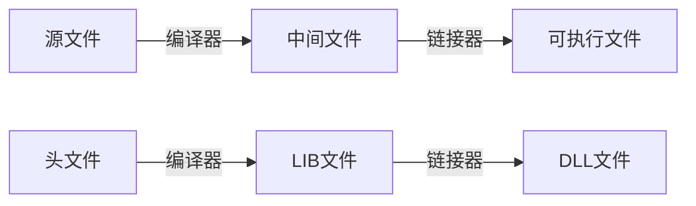

# 动态库与静态库讲解

参考：

- [【B站】动态库与静态库讲解](https://www.bilibili.com/video/BV1XE411k7PN)
- [【B站】C/C++基础教学：动态库和静态库开发](https://www.bilibili.com/video/BV1Kt411775b)
- [【Microsoft官网】在 Visual Studio 中创建 C/C++ DLL](https://docs.microsoft.com/zh-cn/cpp/build/walkthrough-creating-and-using-a-dynamic-link-library-cpp?view=msvc-160)
  基于该文档的视频：[【YouTube】如何使用 C++ MSVC Visual Studio 2019 演练创建和使用 DLL（动态链接库）](https://www.youtube.com/watch?v=auNPlHYB4ss)

# 目录

# 动态库与静态库讲解

## 通用

### 代码的三种分发方式

- 源码
  -  头文件 + 源文件
- 动态库
  - 头文件(可选) + LIB文件(可选) + DLL文件
- 静态库
  - 头文件 + LIB文件

### 区别

#### 体积上和零散性

- 静态库

  - 优点：代码合并到模块中，无零散文件

  - 缺点：模块体积变大。当多个模块使用该库时，内存中有多份代码
    静态库的代码有改动，所有依赖它的文件都要重新编译。动态库不用（某些更改），可以只更新动态库文件

  - ```mermaid
    graph BT
    a.exe-->a[code]
    b.exe-->b[code]
    c.exe-->c[code]
    ```

- 动态库

  - 优点：模块体积几乎不变。当多个模块使用该库时，内存中只存在一份代码

  - 缺点：代码在单独文件中，有零散文件

  - ```mermaid
    graph BT
    x[code]
    a.exe-->x
    b.exe-->x
    c.exe-->x
    ```

#### 动态编译和静态编译

- 静态库
  - 编译时lib文件要进exe里编译，使用的lib越多则exe的体积就越大
- 动态库
  - 动态加载，exe文件会比较小（几个G的大型软件的exe文件很小的原因）

#### 选用

- 选用动态库的理由
  - 考虑是否有多个程序调用一个库，若是则静态库空间浪费严重
  - 考虑是否需要通过升级库而来升级程序，若是则动态库更方便
  - 考虑进程之间是否需要资源共享，若需则使用动态库（共享库）
- 选用静态库的理由
  - [略]

#### 相关报错

- 头文件
  编译时使用
  相关报错：`error C3861: "Add": 找不到标识符`
- LIB文件
  链接时使用
  相关报错：`error LNK2019: 无法解析的外部符号 "int __cdecl Add(int,int)"（?Add@@YAHH@Z）`
  相关报错：`error LNK2019: 无法解析的外部符号 _Add，该符号在函数_main中被引用`
- DLL文件
  运行时使用
  相关报错：弹出窗口：`由于找不到DLL.dll，无法继续执行代码，重新安装程序可能会解决此问题`

## 补充

### 补充 - windows常用dll

windows提供了的三个重要常用的dll

- kernel32.dll（创建事件、创建文件夹等等）
- user32.dll
- gdi32.dll

### 如何查看dll提供的函数

动态库相较于与静态库，可以没有头文件，也就是说无法直接查看库接口

这时可以借用dll查看工具

- ~~例如Dependency（Dependency Walker官网下载：www.dependencywalker.com），将dll拖入该软件即可查看该dll导出的接口，如果查看不了接口则说明该dll没有导出接口（或导出类），没写好~~
- depends那个软件win10兼容不行，推荐使用 Dependencies，下载链接：https://github.com/lucasg/Dependencies/releases

## VS C++  编译库

### 基本流程



（图上下对应）

### 静态库的开发

项目创建

> 新建项目 > Visual C++ > Win32项目 > 输入项目名并确定
> \>  下一步 > 应用程序类型选静态库（默认为Windows应用程序）

testlib.h（相当于接口）

```c++
#ifndef TESTLIB_H
#define TESTLIB_H

int add(int a, int b);

#endif
```

testlib.cpp（会被编译成二进制的lib文件）

```c++
#include "testlib.h"

int add(int a, int b)
{
    return a+b;
}
```

此时编译即可生成lib文件

### 动态库的开发

项目创建

> 新建项目 > Visual C++ > Win32项目 > 输入项目名并确定
> \>  下一步 > 应用程序类型选DLL（默认为Windows应用程序）

testdll.h

```c++
#ifndef TESTDLL_H
#define TESTDLL_H

__declspec(dllexport) int add(int a, int b);	// __declspec()声明这是一个导出函数（也可以导出类），且会生成一个exp文件
__declspec(dllexport) int sub(int a, int b);	// 如果想避免名词修饰，在最前面加上：extern "C"

#endif
```

testdll.cpp

```c++
#include "testdll.h"

int add(int a, int b)
{
    return a+b;
}
```

此时编译即可生成DLL文件

### 开发区别及原理（略）

略

## VS C++  使用库

### 静态库的使用

其中库文件：StaticLib.h

```c++
#pragma once
int Add(int a, int b);
```

#### 偷懒的方式

Test.cpp

```c++
#include <windows.h>
#include <iostream>

#include "F:\\Demo\\Debug\\LIB\\StaticLib.h" 				// 头文件（也可以相对路径）
#pragma comment(lib, "F:\\Demo\\Debug\\LIB\\StaticLib.lib")	// lib文件

int main()
{
    std::cout << Add(1,1) << endl;							// 输出：2
    return 0;
}
```

#### 配置的方式

略

### 动态库的使用

#### 隐式调用 + 导入dll

```c++
#include <windows.h>
#include <iostream>

#include "testdll.h"

__declspec(dllimport) int add(int a, int b);				// 导入（不是导出）

int main()
{
    std::cout << Add(1,1) << endl;							// 输出：2
    return 0;
}
```

#### 隐式调用 + 宏的方式

testdll.h（写法2）

```c++
#ifndef TESTDLL_H
#define TESTDLL_H

#ifndef _DLLAPI								// 导入导出公用
	#define DLLAPI __declspec(dllexport)	// 导出并定义宏
#else
	#define DLLAPI __declspec(dllimport)	// 导入并定义宏
#endif

int DLLAPI add(int a, int b);
int DLLAPI sub(int a, int b);

#endif
```

使用

```c++
#include <iostream>

#pragma comment(lib, "testdll.lib")							// 除了dll还会生成lib，但这个lib不是真正的静态库。隐式调用dll文件
#include "testdll.h"										// 这里做了宏的导入，后面就不用写了

int main()
{
    std::cout << Add(1,1) << endl;							// 输出：2
    return 0;
}
```

#### 显式调用

```c++
#include <windows.h>										// windows
#include <iostream>

// #pragma comment(lib, "testdll.lib")
#include "testdll.h"										// 这里做了宏的导入，后面就不用写了

typedef int (*PADD)(int a, int b);					// 用于接口转换？
typedef int (*PSUB)(int a, int b);

int main()
{
    HMODULE hDLL = LoadLibrary("./testdll.dll");			// 显式加载dll文件
    if(hDLL == NULL){
        printf("加载DLL文件失败");
        return 0;
    }
    
    PADD pAdd = (PADD)GetProcAddress(hDLL, "?add@@YAHHH@Z");// 返回函数指针，后面的名字是用Dependency看的
    PSUB pSub = (PSUB)GetProcAddress(hDLL, "?sub@@YAHHH@Z");// 因为c++编译会把动态库函数名改了，c无此问题（名称修饰）
    														// 解决方案是加关键字extern "C"
    
    std::cout << pAdd(1,1) << endl;							// 输出：2
    std::cout << pSub(1,1) << endl;							// 输出：0
    
    FreeLibrary(hDLL);										// 卸载dll
    
    return 0;
}
```

#### 模块定义文件.def

项目右键 > 添加 > 新建项 > 代码 > 模块定义文件(.def)

```def
LIBRARY testdll
EXPORTS
add
sub
```

#### 配置的方式

如果按静态库的方法配置，能编译通过，但运行时弹窗报错：找不到DLL文件

即还需要一步：将DLL文件复制到exe文件的所在路径（或者放在windows的dll搜索路径里）

## Qt C++  编译流程

详见Qt笔记

# 不同语言调Dll区别

## 动态调用和静态调用

调用Dll有两种方式

| 调用方式 | 需要的文件                                                   | 补充                      |
| -------- | ------------------------------------------------------------ | ------------------------- |
| 静态调用 | 编译时不仅需要头文件、甚至可能还需要lib文件。运行时需要dll文件 | 基本是当作未编译文件来用  |
| 动态调用 | 仅需要dll文件                                                | 一般有个LoadLibrary()函数 |

## 不同语言和调用方式的举例

- Cpp_VS静态调用：编译前需要通过**VS配置**来找到头文件和lib文件，然后将dll文件置于项目根路径下
- EProgram静态调用：编译前需要插入DLL运行时库并添加库的头部信息，相当于重新写了一个易语言版的头文件
- Python动态调用：作为一个动态语言并没有静态调用一说（连编译dll都需要先转化成c语言），动态调用
- Java：未测试


