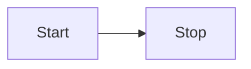
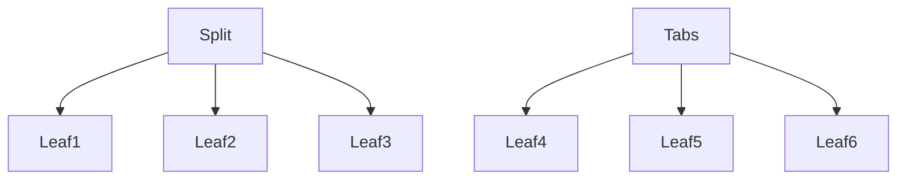
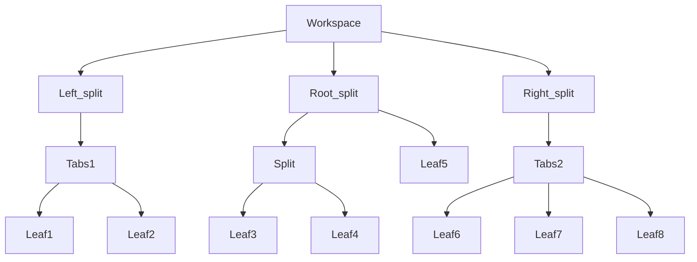
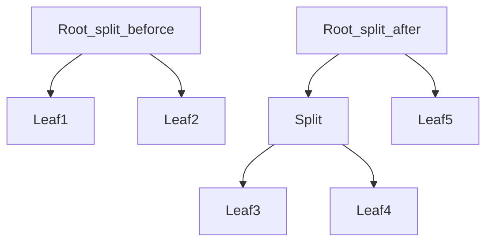
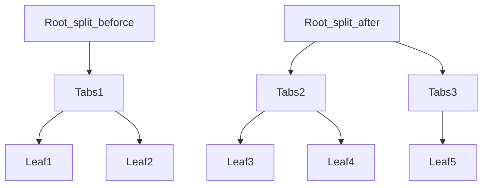

# README

主参考：

- API文档
  （刚开始找来找去找不到，官网好像没文档。后来在论坛找到了，但应该不是官方弄的）
  - 开发者文档：https://marcus.se.net/obsidian-plugin-docs/
  - ==中文社区网友的翻译==：https://luhaifeng666.github.io/obsidian-plugin-docs-zh/zh2.0/（文档）
    https://forum-zh.obsidian.md/t/topic/9352/2（论坛）
    翻译自 [这篇文章](https://marcus.se.net/obsidian-plugin-docs/user-interface/context-menus) / https://marcus.se.net/obsidian-plugin-docs/vault
    （只翻译了一部分，看原文很有必要。像Vault这种东西翻译版就没有）


（202407补充：后来我又看了下，似乎补充了不少内容。想看比较新的可以去看那个。并且文档迁移到了[新地址](https://docs.obsidian.md/Home)，旧文档不再维护，不过这个新地址不提供中文翻译就是了……）


## 开发文档

### 重载插件

一般要编译成js，然后移动到插件目录，再重载插件

也可以热重载：Hot-Reload 插件


### 插件剖析

[`Plugin`](https://luhaifeng666.github.io/obsidian-plugin-docs-zh/zh2.0/reference/typescript/classes/Plugin_2.html) 类中定义了插件的生命周期，并且将操作暴露给其他插件：

```typescript
import { Plugin } from "obsidian";

export default class ExamplePlugin extends Plugin {
  async onload() {
    // 配置插件所需的资源
    // 不过有时我看到其他插件写的是：override async onload(): Promise<void> {}
  }
  async onunload() {
    // 释放插件配置的任何资源
  }
}

```


### 插件生命周期、控制台打印

[`onload()`](https://luhaifeng666.github.io/obsidian-plugin-docs-zh/zh2.0/reference/typescript/classes/Component.html#onload) 生命周期函数在用户激活 Obsidian 插件时触发。这将是您设置插件大部分功能的地方。

[`onunload()`](https://luhaifeng666.github.io/obsidian-plugin-docs-zh/zh2.0/reference/typescript/classes/Component.html#onunload) 生命周期函数在插件被禁用时触发。插件所调用的任何资源必须在这里得到释放，以防止在您的插件被禁用后对 Obsidian 的性能产生影响。

为了更好的理解这些方法会在何时被调用，当插件被加载或者被卸载时，您可以在控制台中打印一条消息。控制台是个很有用的工具，可以让开发者们监控他们代码的状态。

要想打开控制台:

1. 通过在 Windows 和 Linux 系统中按下组合键 Ctrl+Shift+I，或者在 macOS 系统中按下组合键 Cmd-Option-I 的方式打开或关闭开发者工具。
2. 在开发者工具的窗口中点击 Console 标签打开控制台。

```typescript
import { Plugin } from "obsidian";

export default class ExamplePlugin extends Plugin {
  async onload() {
    // highlight-next-line
    console.log('loading plugin')
  }
  async onunload() {
    // highlight-next-line
    console.log('unloading plugin')
  }
}
```


### React

在本指南中，您将配置您的插件以使用 [React](https://reactjs.org/)。假设您已经拥有一个使用 [custom view](https://luhaifeng666.github.io/obsidian-plugin-docs-zh/zh2.0/user-interface/views.html) 的插件，并且想使用 React 来改写它。

虽然您并不需要使用单独的框架来开发一个插件，以下是您想使用 React 的几点原因：

-   您有使用 React 的经验，并且想使用熟悉的技术。
-   您想在插件中重复使用现有的 React 组件。
-   您的插件需要复杂的状态管理，或者有使用常规 [HTML element](https://luhaifeng666.github.io/obsidian-plugin-docs-zh/zh2.0/user-interface/html-elements.html) 无法实现的其他功能。

#### 配置您的插件 

1.  将 React 添加到依赖中:
    ```bash
    npm install react react-dom
    ```
2.  添加 React 的类型声明:
    ```bash
    npm install --save-dev @types/react @types/react-dom
    ```
3.  在 `tsconfig.json` 的 `compilerOptions` 对象中开启 JSX 支持：
	tsconfig.json
    ```tsx
    {
      "compilerOptions": {
        "jsx": "react"
      }
    }
    ```

#### 创建React组件

……


### Svelte

该指南解释了如何配置您的插件以使用 [Svelte](https://svelte.dev/), 一个**轻量级**的可用于替换诸如 React 以及 Vue 这些的框架。

Svelte 是围绕一个可以预编译您的代码为普通 Javascript 的编辑器构建的，这意味着在运行时不需要加载任何类库。这也意味着不需要使用虚拟 DOM 去追踪状态的变化，允许您的插件以最小的额外开销运行。

如果您想学习到更多关于 Svelte 的只是，以及如何去使用它，可以查阅 [tutorial](https://svelte.dev/tutorial/basics) 以及 [documentation](https://svelte.dev/docs) 这两篇文档。

本指南假定您已经阅读完[创建您的第一个插件](https://luhaifeng666.github.io/obsidian-plugin-docs-zh/zh2.0/getting-started/create-your-first-plugin.html) 这篇文档。

#### 配置您的插件 

要想构建一个 Svelte 应用，您需要去安装依赖以及配置您的插件以编译使用 Svelte 编写的代码。

1.  将 Svelte 添加到您插件的依赖中：

    npm

    ```bash
    npm install --save-dev svelte svelte-preprocess @tsconfig/svelte esbuild-svelte
    ```

    yarn
    ```bash
    yarn add --dev svelte svelte-preprocess @tsconfig/svelte esbuild-svelte
    ```

2.  修改 `tsconfig.json` 文件以为常见的 Svelte 问题启用额外的类型检查。`types` 属性非常关键，它可以让 Typescript 识别出 `.svelte` 文件。
    并将`inlineSourceMap`内容从 `tsconfig.json` 中移除，该配置与 Svelte 的配置相冲突。

    ```js
    {
        "extends": "@tsconfig/svelte/tsconfig.json",	// 增加
            "compilerOptions": {
                "types": ["svelte", "node"],			// 增加
                // "inlineSourceMap": true,				// 去除
            }
    }
    ```

3.  在 `esbuild.config.mjs` 文件中引入以下内容：（Import和将 Svelte 添加到插件列表中）

    ```js
    
    import esbuildSvelte from "esbuild-svelte";			// 增加
    import sveltePreprocess from "svelte-preprocess";	// 增加
    
    esbuild.build({
        plugins: [										// 增加
            esbuildSvelte({
                compilerOptions: { css: true },
                preprocess: sveltePreprocess(),
            }),
        ],
        ...
    }).catch(() => process.exit(1));
    ```


#### 创建并加载一个 Svelte 组件

在插件的根目录下，创建一个名为 `Component.svelte` 的新文件

```tsx
<script lang="ts">
  export let variable: number;
</script>

<div class="number">
  <span>My number is {variable}!</span>
</div>

<style>
  .number {
    color: red;
  }
</style>

```

要想使用 Svelte 组件，需要在一个即存的 [HTML element](https://luhaifeng666.github.io/obsidian-plugin-docs-zh/zh2.0/user-interface/html-elements.html). 中加载它。比如，如果在 Obsidian 的自定义 [`ItemView`](https://luhaifeng666.github.io/obsidian-plugin-docs-zh/zh2.0/reference/typescript/classes/ItemView.html) 中进行加载：

[title(view.ts)]

```js
import { ItemView, WorkspaceLeaf } from "obsidian";

import Component from "./Component.svelte";			// Svelte 组件文件

export const VIEW_TYPE_EXAMPLE = "example-view";

export class ExampleView extends ItemView {
  component: Component;

  constructor(leaf: WorkspaceLeaf) {
    super(leaf);
  }

  getViewType() {
    return VIEW_TYPE_EXAMPLE;
  }

  getDisplayText() {
    return "Example view";
  }

  async onOpen() {
    this.component = new Component({				// 创建组件
      target: this.contentEl,							// 需要创建在哪
      props: {											// 组件参数
        variable: 1
      }
    });
  }

  async onClose() {
    this.component.$destroy();						// 销毁组件
  }
}

```


### Vue

文档的该节内容是新增的，Vue弄起来也有点麻烦

#### 第一步：下载插件开发模板

……

载到本地。

1.  跳转到您刚才创建的代码仓库。
2.  点击 **Code** ，并复制代码仓库地址。
3.  打开终端，进入您本地 Obsidian 仓库插件所在的文件夹。

    ```bash
    cd path/to/vault/.obsidian/plugins
    ```

5.  将源码下载到该文件夹下。

    ```bash
    git clone https://github.com/your-username/obsidian-instant-coffee.git
    ```


#### 第二步：安装依赖

1.  打开终端，进入您的插件文件夹。

    ```bash
    cd path/to/vault/.obsidian/plugins/obsidian-instant-coffee
    ```

2.  安装依赖。

    npm

    ```bash
    npm install
    ```
    yarn
    ```bash
    npm install -D naive-ui
    ```


#### 第三步：修改插件的 manifest 配置

可以参照 [创建您的第一个插件 - 修改插件的 manifest 配置](https://luhaifeng666.github.io/obsidian-plugin-docs-zh/zh2.0/getting-started/create-your-first-plugin.html#第四步-修改插件的-manifest-配置) 。


#### 第四步：查看 `src` 文件夹


#### 第五步：编写 Vue 组件


#### 第六步：挂载 Vue 组件


#### 第七步：编译


## 编辑器接口

### 【总结】

不同的扩展 %LT

- Markdown后处理
  - 使用方法：`registerMarkdownPostProcessor()`
  - 运行次序：**在 Markdown 被处理成 HTML ==之后== 运行**
  - 使用场景：如果您想改变**阅读视图下如何将 Markdown 转换为 HTML**，可以考虑构建一个 [Markdown post processor](https://luhaifeng666.github.io/obsidian-plugin-docs-zh/zh2.0/editor/markdown-post-processing.html)（Markdown后处理器）
- 编辑器扩展
  - 使用方法：`registerEditorExtension()`
  - 使用场景：如果您想改变**文档在实时预览时的外观和感觉**，您需要构建一个编辑器扩展。包含 [View plugins](https://luhaifeng666.github.io/obsidian-plugin-docs-zh/zh2.0/editor/extensions/view-plugins.html) 以及 [State fields](https://luhaifeng666.github.io/obsidian-plugin-docs-zh/zh2.0/editor/extensions/state-fields.html)
- 视图插件（`CodeMirror`相关）
  - 使用方法：需要创建一个继承自 [`PluginValue`](https://codemirror.net/docs/ref/#view.PluginValue) 的类，并将它传给 [`ViewPlugin.fromClass()`](https://codemirror.net/docs/ref/#view.ViewPlugin^fromClass) 方法
  - 运行次序：**在视窗被重新计算 ==之后== 运行**
- 状态字段
  - 使用方法：`StateEffect `与`StateField`
  - 使用场景：让您管理自定义编辑器状态的 [编辑器扩展](https://luhaifeng666.github.io/obsidian-plugin-docs-zh/zh2.0/editor/extensions/)（不是很懂）


其他辅助手段

- 状态管理


### 编辑器 `Editor`

```tsx
const view = this.app.workspace.getActiveViewOfType(MarkdownView);
const editor = view.editor;			  // 注意这里的this不能为plugin_this。view的类型分别Any和View|null
const cursor = editor.getCursor();
```

#### 编辑器

[`Editor`](https://luhaifeng666.github.io/obsidian-plugin-docs-zh/zh2.0/reference/typescript/classes/Editor.html) 类透出在编辑模式下读取以及操作 Markdown 文档的操作。

如果您想在命令中访问编辑器，可以使用 [editorCallback](https://luhaifeng666.github.io/obsidian-plugin-docs-zh/zh2.0/user-interface/commands.html#editor-commands)。

如果您想在其他地方使用编辑器，您可以通过 `view` 访问到它。

```tsx
const view = this.app.workspace.getActiveViewOfType(MarkdownView);

// Make sure the user is editing a Markdown file.
if (view) {
  // highlight-next-line
  const cursor = view.editor.getCursor();

  // ...
}

```


> TIP
>
> Obsidian 使用 [CodeMirror](https://codemirror.net/) (CM) 作为底层文本编辑器，并且将 CodeMirror 作为 API 的一部分暴露出来。
> `Editor` 作为CM5（桌面端）和 CM6（移动端）中的桥接功能而被抽象出来。使用 `Editor` 而不是直接访问 CodeMirror，那么您的插件就可以在两个平台上都可以运行。


#### 在光标处插入文本

[`replaceRange()`](https://luhaifeng666.github.io/obsidian-plugin-docs-zh/zh2.0/reference/typescript/classes/Editor.html#replacerange) 方法用于替换选中的文本。如果您没有选中文本，那么文本将会在光标处被插入。

下例中的指令会将当前日期插入光标所在位置：

```tsx
import { Editor, moment, Plugin } from "obsidian";

export default class ExamplePlugin extends Plugin {
  async onload() {
    this.addCommand({
      id: "insert-todays-date",
      name: "Insert today's date",
      editorCallback: (editor: Editor) => {
        // highlight-next-line
        editor.replaceRange(moment().format("YYYY-MM-DD"), editor.getCursor());
      },
    });
  }
}

```


#### 替换当前选中的内容

如果您想编辑选中的文本，使用 [`replaceSelection()`](https://luhaifeng666.github.io/obsidian-plugin-docs-zh/zh2.0/reference/typescript/classes/Editor.html#replaceselection) 方法去替换选中的文本。

下例中的指令读取当前选中的内容并替换成大写：

```tsx
import { Editor, Plugin } from "obsidian";

export default class ExamplePlugin extends Plugin {
  async onload() {
    this.addCommand({
      id: "convert-to-uppercase",
      name: "Convert to uppercase",
      editorCallback: (editor: Editor) => {
        // highlight-start
        const selection = editor.getSelection();
        editor.replaceSelection(selection.toUpperCase());
        // highlight-end
      },
    });
  }
}

```


### Markdown后处理 `registerMarkdownPostProcessor()`

英语：这里的post有 在……之后 的意思

#### Markdown后处理

您知道么，您可以通过类似以下文本创建 `mermaid` 代码块，以在在 Obsidian 中创建 [Mermaid](https://mermaid-js.github.io/) 图表？

如果您想要改变 Markdown 文档在**预览模式下**的渲染方式，您可以添加自己的 **Markdown 后处理器**。
见名知意，该后处理器**在 Markdown 被处理成 HTML ==之后== 运行**。它可以让您添加，删除，或者替换渲染后的文档中的[HTML 元素](https://luhaifeng666.github.io/obsidian-plugin-docs-zh/zh2.0/user-interface/html-elements.html)。

区别 %%LT

- 后处理器：**在 Markdown 被处理成 HTML ==之后== 运行**
- 视图插件：**在视窗被重新计算 ==之后== 运行**

下例搜索包含在两个冒号 `:` 之间的内容，并将其替换为恰当的 emoji 表情：

```js
import { Plugin } from "obsidian";
import { Emoji } from "./emoji";

export default class ExamplePlugin extends Plugin {
  async onload() {
    // highlight-next-line
    this.registerMarkdownPostProcessor((element, context) => {
      const codeblocks = element.querySelectorAll("code");

      for (let index = 0; index < codeblocks.length; index++) {
        const codeblock = codeblocks.item(index);
        const text = codeblock.innerText.trim();
        const isEmoji = text[0] === ":" && text[text.length - 1] === ":";

        if (isEmoji) {
          // highlight-next-line
          context.addChild(new Emoji(codeblock, text));
        }
      }
    });
  }
}

```

`Emoji` 类继承自 [`MarkdownRenderChild`](https://luhaifeng666.github.io/obsidian-plugin-docs-zh/zh2.0/reference/typescript/classes/MarkdownRenderChild.html), 并用带有表情符号的 `span` 元素替换代码块:

```js
import { MarkdownRenderChild } from "obsidian";

// highlight-next-line
export class Emoji extends MarkdownRenderChild {
  static ALL_EMOJIS: Record<string, string> = {
    ":+1:": "👍",
    ":sunglasses:": "😎",
    ":smile:": "😄",
  };

  text: string;

  constructor(containerEl: HTMLElement, text: string) {
    super(containerEl);

    this.text = text;
  }

  onload() {
    // highlight-start
    const emojiEl = this.containerEl.createSpan({
      text: Emoji.ALL_EMOJIS[this.text] ?? this.text,
    });
    this.containerEl.replaceWith(emojiEl);
    // highlight-end
  }
}

```


#### 后处理 Markdown 代码块

您知道么，您可以通过类似以下文本创建 `mermaid` 代码块，以在在 Obsidian 中创建 [Mermaid](https://mermaid-js.github.io/) 图表？

~~~md

~~~

如果更改为预览模式，代码块中的文本变为下图：

【Mermaid效果】

如果您想添加自己的类似以下 Mermaid 的自定义代码块，您可以使用 [`registerMarkdownCodeBlockProcessor`](https://luhaifeng666.github.io/obsidian-plugin-docs-zh/zh2.0/reference/typescript/classes/Plugin_2.html#registermarkdowncodeblockprocessor)。
以下示例**将包含 CSV 数据的代码块呈现为表格**

```js
import { Plugin } from "obsidian";

export default class ExamplePlugin extends Plugin {
  async onload() {
    this.registerMarkdownCodeBlockProcessor("csv", (source, el, ctx) => { // registerMarkdownCodeBlockProcessor
      const rows = source.split("\n").filter((row) => row.length > 0);

      const table = el.createEl("table");
      const body = table.createEl("tbody");

      for (let i = 0; i < rows.length; i++) {
        const cols = rows[i].split(",");

        const row = body.createEl("tr");

        for (let j = 0; j < cols.length; j++) {
          row.createEl("td", { text: cols[j] });
        }
      }
    });
  }
}

```


## CodeMirror相关

学习顺序：

- 状态管理
- 状态字段、视图插件
- 装饰


### 编辑器扩展 `registerEditorExtension()`

编辑器扩展可以让您自行改变在 Obsidian 中编辑文档的体验。本页解释了什么是编辑器扩展，以及在何时使用它们。

==Obsidian 中的 Markdown 编辑器底层使用的是 CodeMirror 6 (CM6)。==
==跟 Obsidian 一样，CM6 也有自己的插件，称之为 **扩展（extensions）**。==
==换句话说，Obsidian 的 **编辑器扩展** 和 **CodeMirror 6 的扩展** 是一回事。==

构建编辑器扩展所用到的 API 有些不合常规，因此在您开始使用之前需要您对其架构有基本的认知。本篇文档旨在为您提供足够的背景信息以及实例以供您入门。如果您想要了解更多关于构建编辑器扩展的内容，可以查阅 [CodeMirror 6 documentation](https://codemirror.net/docs/) 这篇文档。


#### 我是否需要一个编辑器扩展？

构建编辑器扩展可能会是个挑战，因此在您开始构建之前，您需要考虑是否真的需要它。

- 如果您想改变**阅读视图下如何将 Markdown 转换为 HTML**，可以考虑构建一个 [Markdown post processor](https://luhaifeng666.github.io/obsidian-plugin-docs-zh/zh2.0/editor/markdown-post-processing.html)（Markdown后处理器）。
- 如果您想改变**文档在实时预览时的外观和感觉**，您需要构建一个编辑器扩展。


#### 注册编辑器扩展

CodeMirror 6 (CM6) 是使用 web 技术编辑代码的强大引擎。作为它的核心，编辑器本身具有最少的功能集。任何您期望在流行的编辑器上可以获得功能都可以作为 **扩展** 供您挑选。尽管 Obsidian 附带了许多开箱即用的扩展，您依旧可以注册属于您自己的。

要想注册一个编辑器扩展，需要在您的 Obsidian 插件的 `onload` 方法中使用 [registerEditorExtension](https://luhaifeng666.github.io/obsidian-plugin-docs-zh/zh2.0/reference/typescript/classes/Plugin_2.html#registereditorextension)。

```typescript
onload() {
  this.registerEditorExtension([examplePlugin, exampleField]);
}
```

尽管 CM6 支持多种扩展，但其中两个最常见的分别是 [View plugins](https://luhaifeng666.github.io/obsidian-plugin-docs-zh/zh2.0/editor/extensions/view-plugins.html) 以及 [State fields](https://luhaifeng666.github.io/obsidian-plugin-docs-zh/zh2.0/editor/extensions/state-fields.html)。

```typescript
// 这TM又是个什么代码
import DocCardList from '@theme/DocCardList';
import {useCurrentSidebarCategory} from '@docusaurus/theme-common';

<DocCardList items={useCurrentSidebarCategory().items}/>
```


### 与编辑器扩展通信 `EditorView`

您可以从 [Markdown 视图](https://luhaifeng666.github.io/obsidian-plugin-docs-zh/zh2.0/reference/typescript/classes/MarkdownView.html)中访问 CodeMirror 6 编辑器。
但是，由于 Obsidian API 实际上并未公开编辑器
（view.editor.cm会报错：Editor上不存在属性“cm”，因此您需要使用 `@ts-expect-error` 绕过 Typescript 的验证）

```typescript
import { EditorView } from "@codemirror/view";

// @ts-expect-error, not typed
const editorView = view.editor.cm as EditorView;

```


#### 视图插件1

您可以通过 `EditorView.plugin()` 方法访问[视图插件](https://luhaifeng666.github.io/obsidian-plugin-docs-zh/zh2.0/editor/extensions/view-plugins.html)实例。

```typescript
this.addCommand({
  id: "example-editor-command",
  name: "Example editor command",
  editorCallback: (editor, view) => {
    // @ts-expect-error, not typed
    const editorView = view.editor.cm as EditorView;

    const plugin = editorView.plugin(examplePlugin);

    if (plugin) {
      plugin.addPointerToSelection(editorView);
    }
  },
});

```


#### 状态字段

您可以在编辑器视图内直接派发变动以及[state effects](https://luhaifeng666.github.io/obsidian-plugin-docs-zh/zh2.0/editor/extensions/state-fields.html#dispatching-state-effects)。

```typescript
this.addCommand({
  id: "example-editor-command",
  name: "Example editor command",
  editorCallback: (editor, view) => {
    // @ts-expect-error, not typed
    const editorView = view.editor.cm as EditorView;

    editorView.dispatch({
      effects: [
        // ...
      ]
    });
  },
});

```


### 状态管理

#### 状态管理 `view.dispatch`

TIP

> 本页旨在为 Obsidian 插件开发者们精炼 CodeMirror 6 官方文档。要想获取更多关于状态管理的详细信息，请查阅 [State and Updates](https://codemirror.net/docs/guide/#state-and-updates) 这篇文档。


#### 状态变化

在大部分的应用中，您可能会通过为一个属性或者变量分配一个新值的方式来更新状态。这样一来，原先的值就会永远丢失。

```ts
let note = "";
note = "Heading"
note = "# Heading"
note = "## Heading" // How to undo this?
```

为了支持对用户工作区的类似撤销以及重置更改的功能，诸如 Obsidian 的应用会保留所有的历史改动。要撤回改动，您可以返回改动前的时间点。

在 TypeScript 中，您会得到这样的结果：

```ts
const changes: ChangeSpec[] = [];

changes.push({ from: 0, insert: "Heading" });
changes.push({ from: 0, insert: "# " });
changes.push({ from: 0, insert: "#" });
```


#### 举例 Transactions 

试想一个在按下双引号 `"` 后会在选中文本前后加上该标点符号的功能。实现该功能的一种方式是：

1. 在选中的文本前添加 `"`。
2. 在选中的文本后添加 `"`。

注意这种实现包含了 **两次** 操作。如果您将这两个操作添加到了撤销历史记录中，那么用户将需要撤回 **两次**，每次撤回一个双引号。为了避免这个问题，是否可以将这两次改动合并成一次？

在编辑器扩展中，一组发生在一起的状态变化被称之为 **transaction**。

如果结合您到目前为止所学的知识，如果允许 transaction 只包含单个状态更改, 那么可以将状态视为 transaction 的 *历史*。

在编辑器扩展中，将所有这些功能放在一起来实现环绕特性，下面是你如何添加或分派事务到编辑器视图的方法:

```tsx
view.dispatch({
  changes: [
    { from: selectionStart, insert: `"` },
    { from: selectionEnd, insert: `"` }
  ]
});

```


### 状态字段 `StateField` - OB

#### 状态字段

作用

> 状态字段是一个可以让您管理自定义编辑器状态的 [编辑器扩展](https://luhaifeng666.github.io/obsidian-plugin-docs-zh/zh2.0/editor/extensions/)。此页面将引导您通过实现计算器扩展来构建状态字段。
>
> 该计算器需要支持从当前状态中加减数字，并在您想要重新开始时重置状态。
>
> 在本页最后，您将会理解构建状态字段的基本概念。

TIP

> 本页旨在为 Obsidian 插件开发者们精炼 CodeMirror 6 的官方文档。要想获取更多关于状态字段的详细信息，可以参考 [State Fields](https://codemirror.net/docs/guide/#state-fields) 这篇文档


#### 插件

前置准备

- Basic understanding of [State management](https://luhaifeng666.github.io/obsidian-plugin-docs-zh/zh2.0/editor/extensions/state-management.html).

- 对于 [状态管理](https://luhaifeng666.github.io/obsidian-plugin-docs-zh/zh2.0/editor/extensions/state-management.html) 有基本了解。

  

#### 定义状态效果 `StateEffect `

State effect 描述了您想要做出的状态变化。您可以将它们想象成 class 中的 方法。

在计算器的例子中，您需要为每个计算操作定义一个 state effect:

```tsx
const addEffect = StateEffect.define<number>(); 		// 加
const subtractEffect = StateEffect.define<number>(); 	// 减
const resetEffect = StateEffect.define(); 				// 结果
```

`<>` 之间的类型定义了 effect 的输入类型。比如您想要加或减的数字。Reset effect 不需要任何输入，因此您可以不用管它。


#### 定义状态字段 `StateField`

与预料相反的是，状态字段实际上并不 **存储** 状态。而是 **管理** 状态。状态字段获取当前状态，应用任何 state effects, 并返回新的状态。

状态字段包含根据 transaction 中的效果应用数学操作的计算器逻辑。一个 transaction 可以包含多个 effects, 比如两次相加，状态字段需要一个接一个的应用它们。

```tsx
export const calculatorField = StateField.define<number>({
  create(state: EditorState): number {
    return 0;
  },
  update(oldState: number, transaction: Transaction): number {
    let newState = oldState;

    for (let effect of transaction.effects) {
      if (effect.is(addEffect)) {
        newState += effect.value;
      } else if (effect.is(subtractEffect)) {
        newState -= effect.value;
      } else if (effect.is(resetEffect)) {
        newState = 0;
      }
    }

    return newState;
  },
});

```

- `create` 方法返回计算器的初始值。
- `update` 包含应用 effects 的逻辑。
- `effect.is()` 使您可以在使用 effect 之前检查它的类型。


#### 派发 `view.dispatch`

原型

```js
view.dispatch(TransactionSpec[])

// 实例中可以是
let effects: StateEffect<unknown>[]
view.despatch({effects})
```

要想将 state effect 应用到一个状态字段中，您需要将它作为 transaction 的一部分派发到编辑器窗口。

```tsx
view.dispatch({
  effects: [addEffect.of(num)],
});
```

您甚至可以定义一组提供更熟悉的 API 的辅助函数:

```tsx
export function add(view: EditorView, num: number) {
  view.dispatch({
    effects: [addEffect.of(num)],
  });
}

export function subtract(view: EditorView, num: number) {
  view.dispatch({
    effects: [subtractEffect.of(num)],
  });
}

export function reset(view: EditorView) {
  view.dispatch({
    effects: [resetEffect.of(null)],
  });
}
```


### 视图插件 `PluginValue` - OB

#### 视窗 `View`

- ViewPort
  - <img  src="data:image/jpeg;base64, iVBORw0KGgoAAAANSUhEUgAAAqwAAAF0CAYAAADmR2vvAAAAAXNSR0IArs4c6QAAAARnQU1BAACxjwv8YQUAAAAJcEhZcwAADsMAAA7DAcdvqGQAACVvSURBVHhe7d3/j2V3fd9x/yn8DyACraq6IBdobSWBSk2EG5EqNUWN1dIEqYIWSBuUqiGyghSKUVu3FGTyE40l7GACCxjHBq9t1l571/vF4y+sTPjmL6y9uzOze+r3+h74+OPPvXPPmXvPfD53Hg/pJdZzv8y9Mwfdp4/vzlzTAQBAxQQrAABVE6wAAFRNsAIAUDXBCgBA1QQrAABVE6wAAFRNsAIAUDXBCgBA1QQrAABVE6wAAFRNsAIAUDXBCgBA1QQrAABVE6wAAFRNsAIAUDXBCgBA1QQrAABVE6wAAFRNsAIAUDXBCgBA1QQrAABVE6wAAFRNsAIAUDXBCgBA1QQrAABVE6wAAFRNsAIAUDXBCgBA1QQrAABVE6wAAFRNsAIAUDXBCgBA1QQrAABVE6wAAFRNsAIAUDXBCgBA1QQrAABVE6wAAFRNsAIAUDXBCgBA1QQrAABVE6zAYA/fv9195YsXuts+83J3yyfO2wYtvqexI3de7LZO7XbP/+zy7LsOcHAEK7CUiNQImk/c/JIdssW/nAhX4CAJVmChOMsWZ9xKIWOHa3HWVbgCB0GwAnNFoJTCxQ7v4iy7aAWmJliBomXPqkbAxH8ytvbXvye59H1OJ1qBqQlW4A0WxWpcFu9nFSybK7638VaQiNhFAesYAKYiWIHXWfQ2gLiMwyXCdV60OtMKTGWSYL322mvn7gMf+EB32223Xd2RI0dmtwAOQsRJKUzirGpcxuEV/7JSCtc4NgDWbZJgveaaa5beJz/5yW5ra2t2S1oX/xLiX0jaUQqS+BiEeWff4y0iAOtUXbDG3vSmN10NV9oX38v++xpn06nXvBjxn3xJlY4Tbw0A1m3yYI23AfRn3PpFyKRhE4t/dkaufYK1HXmExLxnlZLSmXhnWYF1mjxY5505jbcBxGXpdSN2aJtgbUOcHcsDxHsTmaf0Xuf4iQIA61JNsPbyaI0zsPP0kRtnbeO6EUf9X+Ra9n2w8+5j0eOMy/vNe3zx8fR6qThznF+WPo54DPEc8vuOf47rxOX941zmLHRcJ3+Ocf+LnmN//VgfmvljjM27j/62/fcx/drGFn1fmV7pP/M6Y8YipbOs3hYArEt1wRpRlF4/4qYkIiy9Xr5FMdWLy0u37Rf3UQrC9DrzPkd+36mItfyyPO769fe/6LHOewxh0e1i8RxLcR+R2l8nHlv+fUlX+jqVrpdu0WNmeqWfuwqLxBnV/JjxkySAdakuWEMaWRFDuVKsxvXyj8X6s4O5UiCW7qMUdOnl855PHoqpPFjnxWosPn9+X/lKjzEMeY65PFgXPcZYXJ6K++yXXq//mDOsdcmD1U8GYC9xBj49ZmLOygPrUn2wxvIYyyMojZ+4bnp5/Dk/+5cHb1ynF7fPP38eY+ll855Pfh+pPFhj/f2UPn8sjby4Th6QeQDmzzF/nHtdngZrfp34/PH58u9D/nUO6XXm/csDBy8PD8HKXkrvYxWswLpUGax5TKUhlMdeKZIiqNLr5MGZx15Jep00aEN623nPJz6eXi+VP4c85PLHH8ufZ36d/HGkjz9//r30ceTPMQ/W0vNc5nshWNuQh4efDsAyHDfAVKoM1jyE4p97eUjNs9/g7M8i9kstc/v4eHq91KLn11smqhfFYHrbUkiGPHrjn3v51zm9rLdXNAfB2gbhwRiOG2AqTQRrGkvLBtC8YIx4Sz9eisW9pLdfRbCWYjANxjy4e/O+FvlzjPidt/R6adjmwTpPeh3B2i7hwRiOG2AqVQbrothLP74ogPIo7GNsmVjcS3r7GoM1v/9llz6XGoP13Llz3Q033NC9+c1vvvq/8fnuuOOO2aXsh/BgDMcNMJUqgzU98xd/Ti0bQPOiMD/7mJ5VXFZ6+3nPJz6eXi+17mDNn2NctsxqP8N60003XY3VfBGvcdmtt97aHT16dHZthhAejOG4AaZSXbDmMZdHzqKYTc0LxojD9OPx+YZKbz/vMSwKvnUHa/4cx0T5osefSq9zUMGaz9nX4YQHYzhugKlUFaz5mcFYLg/ReTGWhlIelent5wXnvOANaTQvE5P57dcdrKH/eOmy1LyvX43BGgFaCtS91gess6/zCQ/GcNwAUznwYI1Yi2jKAzFWOvuZnz0sBWceW/n95J+r9JjSy/PQSoM1FrdPozP//LHUFMGa336Zz7HoOcyTXif/Oob0Mc57HkPE+1jj8yx7tjWftw+UCQ/GcNwAU5k8WJfdvDOfIY+pCKH4WIRMGkix0v1EmJWuF/eR33csPwuZB2cs7i8N2fz+U1MEa/4c489xnfjc8XXKozu/ff51mCe9TilY8/vpv87zzuwOEfEaZ13HxmvM2wdes5/w2Nm+0m1fsk3ZEPs5bgCGqC5YI6z2ipmIsYiM0u3TLbqv+HgadPNWirCQB1+6uN88SlNTBGtY9jmW7n9VwTrvMcz7uo4V8RpnTOPM6SoC9rCdfR0THhdeudKdemyne+i+bdug/eD7291zz+7OvsuLjTluAMaoIlgjaCKQhkZMXL90f7Fl7mtR+MZjirCcZ95tI2RDDcEa9nqO875OqwrWEM83fayx/uu0Lv3Z13hMpTBdZv3bB+J+Nj1gx4THE8fF6ibv5z+9PPtOzzfmuAEYY5JgjWiat1WI+4koiu11drakfyz97Yc8rrhu3Cb/vP199kstuqy31+Vhmev0+ust+3VK7zs2zzLX6fVfp9gy118lbx9YbGh4XHr14lLk2ObsqTN7n2UdetwAjDVJsEJNVvn2gU35y1tDwyPeDlCKHNucPXlKsAL1EKwceqt6+0B/9rXFgB0aHoJ18ydYgZoIVsgcxrcPDA0Pwbr5E6xATQQrLNC/fSDic2zARrzW/vaBoeEhWDd/ghWoiWCFATb17QNDw0Owbv4EK1ATwQr7EAG7qp/9ehBvH3jppZe6b3zjG90///Vbul9/z0e7G971ke69//Q/d3/0H/9Pd/z48dm13kiwbv4EK1ATwQorkp593c/bB+K26377wKlTp5Y6S/y+972v+/KXvzy71a/s7PixVpu+Hz7l57AC9RCssCarfvtA3N8qfP7zny9+rkV7//vf3x07dmx2D695+uxuMXRsM/by+b1/TatgBaYiWGECEZurfPvA2LOvH/3oR4v3u+zuvvvu2T295kfndrvTj+10j/9gpzv2/ddC5+SjO9bY4vv26IPb3YlHdrqnTu9251/aO1aDYAWmIljhABzE2wc+/vGPF+9n6O69997ZPXLYCVZgKoIVKtAH7CrOvsb95L70pS8VbzNm73nPe7oXX3xxds8cZoIVmIpghcpEvMYZ01W9feCb3/xm97a3va14nbH79Kc/PXu0HGaCFZiKYIXKpW8fKMXjQe0nP/nJ7BFyWAlWYCqCFRqzircPrGKlH3fF4SJYgakIVmjYqt4+MGYf/vCHZ4+Cw0qwAlMRrLBBpnz7wPXXXz/7rBxWghWYimCFDTbmlwQsu/iLXC8+f7k79/Tlqz+789ktq3nPPLnb/eTv9v7tVUMIVmAqghU22O23316MzVXsrW996+t+M5K1sSeO78yOjv0TrMBUBCtssLvuuqsYm6vYO9/xrmIQWf376Y9Xc6ZVsAJTEaywwU6ePFmMzVXsd278N8UYsvr3w6cFK9AWwQob7rrrrisG5373qT/6H8UYsvonWIHWCFbYcH/2Z39WDM797q6/OluMIat/ghVojWCFDffUU08Vg3M/+9jHPl4MIWtjghVojWCFQ+Czn/1sMTzH7O1vf3t39syzxRCyNiZYgdYIVjgkbr755mKADt1Xv/rV7sIrV4ohZG1MsAKtEaxwSJw/f37fv741fq5rEKxt79zTu1e/j/slWIGpCFY4RK5cudL98R//cTFGF+2d73xn9/Wvf312L6957OGdYgxZ/Xvh51dm38X9EazAVAQrHEL33HNP98EPfrAYp+ni/aq33HJL98ILL8xu+Ssv/Pxy98gDorW1xa9pXRXBCkxFsMIh9sQTT3Rf+MIXuhve9ZHuun/0u907/+H7u3e/8193//b3/2t39913dxcvLg6Qy5e77qUXrnQv/OyyNbCLF2bfuBURrMBUBCsgPBjFcQNMRbACwoNRHDfAVAQrIDwYxXEDTEWwAsKDURw3wFQEKyA8GMVxA0xFsALCg1EcN8BUBCuw7/C4csU2ZUPs97gBWJZgBUaFx/alrjv7xE738P3lH1BvbS5+g9mPn7s8+y4vNua4ARhDsAKjwuP047vF4LHN2ItL/PrWMccNwBiCFRgcHnF2tRQ5tjl7+uzev8J16HEDMJZgBQaHx4VXrhQjxzZnT54SrEA9BCswODwE6+ZPsAI1EazA4PAQrJs/wQrURLACg8NDsG7+BCtQE8EKDA4Pwbr5E6xATQQrMDg8BOvmT7ACNRGswODw2N4WrJu+Z7cEK1APwQqMCo+t035xwCbvFy/t/duuxhw3AGMIVmB0eJx7erd7/Ac73bEHfhU6xx+yltZ/3+JX7B5/aKc7c2K3e+HnfjUrUBfBCggPRnHcAFMRrIDwYBTHDTAVwQoID0Zx3ABTEayA8GAUxw0wFcEKCA9GcdwAUxGsgPBgFMcNMBXBCuwrPC5euHL1N1+1sni8rMZ+jhuAIQQrMCo8Xv7Fle7EIzu//DmeLS1+duyLzwvX/Rpz3ACMIViBUeHRaqz2e/TB7dkzYawxxw3AGIIVGBwel169uBSBre0XLznLuh9DjxuAsQQrMDg84r2gpQBsbS+9IFj3Y+hxAzCWYAUGh4dgJQw9bgDGEqzA4PAQrIShxw3AWIIVGBwegpUw9LgBGEuwAoPDQ7AShh43AGMJVmBweAhWwtDjBmAswQoMDo/dnc34sVYXX5k9IUYZetwAjCVYgVHh8ezWbjECW9nWqd3ZM2GsMccNwBiCFRgdHj/50eXu7Mmd7uQjO92ZE7vVL34715kTO93fnbs8ewbsx9jjBmAowQoID0Zx3ABTEayA8GAUxw0wFcEKCA9GcdwAUxGsgPBgFMcNMBXBCggPRnHcAFMRrHBIPP+zy1d/lNPD929fDYt0n7j5xdfttj8//4brmOXb67iJYy3mR4gB+yVYYYNFpEY43PKJ868GxevPhplNuTgGv/LFC+IVGEWwwgbqQ7UUDmYHvQjXOEYBliVYYcPEf4ItRYJZTYszrvEvVQDLEKywQZxVtdYmWoFlCFbYELf9+cvFIDCrfX/5Py/MjmKAMsEKG8CZVWt9zrQCiwhWaFz8retSAJi1tnj/NUCJYIXG3fYZbwWwzVj8RSyAEsEKDRv7EwE+/bHz3ef+1Gy9Kx17e81ZVqBEsELDhvxCgAiIo9/d7s49s2s2yU4e3756zN1x+yvFY7I0Z1mBEsEKjYofvF56wS8tgqEUFGZTbUi0+m1YQE6wQqOWfTtA/O3rUkCYTb1lf5qFnxgA5AQrNCp+vWXpxT5dvA2gFA5mB7Uv3br3mVZvCwByghUatcz7V51dtdoW72ktHavpBCuQE6zQqGWCNf7SSykazA5qcUyWjtV8ACnBCo0qvcjnKwWD2UEvfqxa6XhNF3+pEKAnWKFRpRf5dBEFpVgwO+gJVmAowQqNKr3IpxOsVusEa/22trZet2Utut1tt93WvelNb+quvfbaQfcJQbBCo0ov8ukEq9U6wVq/iMprrrnmlzty5MjsksU+8IEPvO52EakhAjX9eNw/DCFYoVGlF/l0gtVqnWCtXwTqmMCMM6jp7dIzqelln/zkJ2cfZV3iexjft36tn9UWrNCo0ot8OsFqtU6w1i8/IxqxuZc4m5reJs62piKg4mNidRr590OwAgei9CKfTrBarROsbcj/8/5ebwuY93YADoZgBapQepFPJ1it1gnWNuRvC8jPmObytwOURDT1W0Y8hr2un97nvOvt9zrzPh6Pr3+MYwy5/bzHEP8ccZp+PP4cZ7LT70d/2/R6LRGs0KjSi3w6wWq1TrC2I9772AfPorcFRHSlcVSK2zRoF8VvXJbHb2ze+zCXeYzp/c27Tn95LH186f3Hn0Meg/1ly8Rg3Hbe84uv4zzpdSNQ47rp/fRvtSg9tnwtEqzQqNKLfDrBarVOsLYjj595QRWBt9f10rgqBWvcJo3DecvfahC3Sy/PP3d+eek6+X8+Tz9HHqx7BWH++HoRs8s8v7j/Uvim14nPkd+XYAWqVHqRTzdFsJ56bKf7wfe2r/5++Afvs03Yow/tdM9slb/fq5pgbUeEUxo6886M5mcMS/YK1vw+4joRZhFg+WVp0OWPsQ+3Xh6jy1wnlYZh/hzisvyxxUrBmQdm3G7efeSPL6SXp4vbxn30t4kY7+83vV78c3w81iLBCo0qvcinW3ewPvLATvfNr160Ddw9X7/YPfNk+fu+ignWtqThE3GUy89gzguiNMry60RspfeRnwGNAExvnwdd+hjjz6n4XP1ly1wnf2zpfcficeSPL/8c+ePLn1/+OfLnF8ujN70slj+HXB7hpYhuiWCFRpVe5NOtM1iffWq3O3JnOXZsM3bs6E7xe7+KCda27BWTeazll/cWBWt6+zz2enkYpwGWPsb4PKn0NstcJ0IvlQdrfnkvD85Ueln+uXv588u/Dull8+4jJViBKpRe5NOtM1i3Tju7uul74Lvbxe/9KiZY2xKhk4ZPHpuLQi2VXi+9j/z+I9ziY6Wl14t/7uWx10dzGm3xOdP4LF0nlt5vSG+zKBTzcE/vJ/34vCAP875GIb2P/LISwQpUofQin06w2n4mWEnNi7Y8FBeF1LwYy+9j2eVnOtPL+ihMoy3+nP5z6Tqx3LLBmt9PH4jxv+nH43rzpNEbnzeV3sei6O3NezytEqzQqNKLfDrBavuZYCWVx09/djINrNiiKJoXrPl9L7s8/NKw7GMvfXzx2NJ4LF0nfVy90v2W5OHdf43mfbwk/3qm0o8LVqAZpRf5dILV9jPB2rY77riju/XWW7ujR4/OPrI/aejF+rBLI3RRzIVlz7BGaMXH9loeYPGx/j76M6Hp/fb6AC1dJ4/gsGyw5oEYjyfkX7vS5+iln6t/fL30PgQr0IzSi3w6wWr7mWBtT0TqTTfd1L35zW9+3eLjq5DHVBqIsUUhFuYFax50fegNVYrq9M+9iL3+4+mfY6WoS5/3vOuE/L5S8557btH1+o/HBCvQjNKLfDrBavuZYG3DvEhNt0zcLCMP1GVDrrcoxtLL5j3euP+4LEIsHssycdkvjen8efSbF5L5fZYeXzyW9DrxfFLp84uVHnv+uPLPs+iyEsEKVKH0Ip9OsNp+9sB3LxW/96uYYN2fiNQbbrihGKelxVsDViGPsnSLzhr2FgVrBFh6fxFbeWDlZ3hL8vvpl5r3PNKoTZUiOH188b97RW0p9tPnl19een7p5csEaymA869pSwQrNKr0Ip9uncEaix8uXwod24w99gNnWGsR70ON6BwSqf2WCZshSvEWmxd7qUXBGvKzkPHP8fnyj8fmPa/S2dPS5yo9j3kxl143Hkv6eEqPLT5WEo8jv+6851f6eqaXL/t9Ld13fM4WCVZoVOlFPt26g/WJ49vdt79Wjh1re0fvXV+sxgTr3uIsakTJ2EiN2587d252b6tTCsLYMmfu0ngqRWTcRynq8pVu24v7yK9fir/4GuXXmycN1vhz3LYUgrH4eHyN5lnm+c27fXqdZYO19DxjLZ5pFazQqNKLfLp1B+vVPb3bnT6x0516zDZl8XaP4vd6hROsZbVGaipCJ6It3bLxlN5m0RnZuCyuk0Zh/Dlib1EM9uJ66ecqxVn+PBY9h7i8fxzx5xCPIx5T/xjj44tCOhW3jeunz6+//aKQjOv0W+aMdi//fPG/ghWYTOlFPt0kwWo2YoL1V1YRqaxXxF4alhwMwQqNKr3IpxOsVusOe7CK1LYI1joIVmhU6UU+nWC1WncYg7WP1FKE7jWRerAEax0EKzSq9CKfTrBarTsswbrfSF3Vb6lifwRrHQQrNKr0Ip9OsFqt2+RgjUjd6wf5z5tIrZNgrYNghUaVXuTTCVardZsWrPuN1HX/zX72J/6Wffyt/NgyP6WA9RCs0KjSi3y6qYL12ad2u2e2dmyFK32dN2mbEKwRqWP+0lSEbdxWpMIwghUaVXqRT7fuYN06s9N97zuXij943va3I3dd7B7+3np/eP9BrsVgjf9UH2dDa/4ZqbDJBCs0qvQin27dwXrfEbG67j364GaebW0lWCMyRSrUQbBCo0ov8unWGaxPndkpBpatdve/+i8Fpa9/66s5WEUq1EmwQqNKL/Lp1hms8es7S4Flq9293xCsU1hFpALrJVihUaUX+XSCtf1terD+we8d7z5049e73/utr3QffP+d3b/73aOvfvyFq5etO1j7SC1F6F4TqTA9wQqNSuO0NMHa/jYxWL/zrce63/rN/9L9vbddV4zBt7zl17rr//GHuzu/+q3Zkb46+41UPyMVDo5ghUaVIjWdYG1/mxSsZ0/9ovvYRz9VjMF5+9CHPtSdPHlydsSPE5HqB/lD+wQrNKoUqekEa/vblGC99zsnu9/8jX9WjMJlduedd86O+uWIVNg8ghUaVYrUdIK1/W1CsH7vvjPddde9uxiHQ7ZXtI6N1LhNRKq/2Q91E6zQqFKkpltnsD7zpGCdYt+/p/1fHvDbv/07xVAcs/ztARGpfvwUHA6CFRpVitR06wzW2NG/9YsD1r2Tx9sO1k//t/9eDMaxu/HGG6/GpkiFw0ewQqNKkZpu3cEae+ToztXfeHXP1y9137rrtf+EbeMXX8N7/ubS1TOrrcfqqRPPd29729uL8TjVRCpsDsEKjSpFaropgtVs3j7/uduLEbnuiVTYTIIVGlWK1HSC1Q5yN910czEo17E+UoHNJVihUaVITSdY7SB37bXvKMblqiZS4XARrNCoUqSmE6x2UDvzxEvFyFzVjhw5Mvt/AXBYCFZoVClS0wlWO6idOP7TYmiual/72tdm/y8ADgvBCo0qRWo6wWoHtafOvlIMzVXtnnvumf2/ADgsBCs0qhSp6QSrHeTe8+7ri7G5ij355JOz/xcAh4VghUaVIjXdFMF65uRO9+iDO92xB7at4j1+bPqf6foH//5jxdjc76677rrZ/wOAw0SwQqNKkZpu3cH66EN+PWtL++7fXOye2Sp/L9exv7z9r4vBud/9yZ/8yez/AcBhIlihUaVITbfOYP3h07vdt+7yq1lb27GjO8Xv57p2/fW/UYzO/eyxxx6b/T8AOEwEKzSqFKnp1hmsW6edXW1x37/nUvH7ua598Qt3FKNz7D71qU/Njn7gsBGs0KhSpKYTrJZv6mCNfeQPP16Mz6F773vf250/f3529AOHjWCFRpUiNZ1gtXwHEayxm/7V7xcjdNnFX7Q6efLk7MgHDiPBCo0qRWo6wWr5DipYY3/4B/+pGKN77cYbb+zOnDkzO+qBw0qwQqNKkZpOsFq+gwzW2Bf+9//r/sl7biiGab63vOUt3V/8xV/MjnbgsBOs0KhSpKYTrJbvoIO1383/8q+6G971ke7vv/1dr4vUX3vrP+je9Y6bun/xvv/VbZ396exIBxCs0KxSpKYTrJavlmCNY7M/Tj/2oR91/+GDW91HP3Tudcfv8z+7PDvSAQQrNCt9cS9tncEa+87d5Siyevfog9P/xqvS0mCdN8EKpAQrNKr0Ip9u3cF64pHtYhRZnfved+o4uxoTrMBQghUaVXqRT7fuYI098+Rud/L4Tnfi2LZVvNMn6jiz2k+wAkMJVmhU6UU+3RTBajZmghUYSrBCo0ov8ukEq9U6wQoMJVihUaUX+XSC1WqdYAWGEqzQqNKLfDrBarVOsAJDCVZoVOlFPp1gtVonWIGhBCs0qvQin06wWq0TrMBQghUaVXqRTzdFsJ54dLt78L7t7oF729nRv93uHj9W1495OmwTrMBQghUaVXqRT7fuYP3BA23/etYI7dLzsvVPsAJDCVZoVOlFPt06g/XZp3aLEdjats7sFJ+frXeCFRhKsEKjSi/y6dYZrFun2z672u/044L1ICZYgaEEKzSq9CKfTrDuPcF6MBOswFCCFRpVepFPJ1j3nmA9mAlWYCjBCo0qvcinE6x7T7AezAQrMJRghUaVXuTTCda9J1gPZoIVGEqwQqNKL/LpBOveE6wHM8EKDCVYoVGlF/l0aw3WM5vxY61OnxCsBzHBCgwlWKFRpRf5dOsM1th3/+ZSMQJb2bf/+lL3w6fLz83WO8EKDCVYoVGlF/l06w7WODvZarR++2sXu5PHnV09qAlWYCjBCo0qvcinW3ew9jt7cqc73dDOvLrS87DpJliBoQQrNKr0Ip9uqmA1GzrBCgwlWKFRpRf5dILVap1gBYYSrNCo0ot8OsFqtU6wAkMJVmhU6UU+nWC1WidYgaEEKzSq9CKfTrBarROswFCCFRpVepFPJ1it1glWYCjBCo0qvcinE6xW6wQrMJRghUaVXuTTCVardYIVGEqwQqNKL/LpBKvVOsEKDCVYoVGlF/l0gtVqnWAFhhKs0KjSi3w6wWq1TrACQwlWaFTpRT6dYLVaJ1iBoQQrNOqWT+z9on/0u9vFYDA7yJWO1XwAKcEKjbrtMy8XX+jTCVarbUfuvFg8VtPFv4wBpAQrNGqZYPW2AKttn/vTvf/LwFe+eGF2lAO8RrBCox6+f7v4Yp/vS7e+UgwHs6l3x+2vFI/RfHFsA6QEKzQq/lJK6cW+tIjWk8e9PcAOZnHsLRurMX/hCsgJVmjYMm8L6BdvD4hwjfcQildb9+IYi/dQDwnVmPevAiWCFRq2dWq5v3Ft1srimAbICVZo3JCzrGY1L45lgBLBCo2L9/st8zNZzWqfs6vAPIIVNsCQv4BlVuPEKrCIYIUN8dB9y/2YK7Padu83Ls2OYoAywQobxF/CstbmzCqwDMEKG8Z7Wq2FxTEqVoFlCVbYQBGt8fNWhavVtjgm49gEGEKwwgaLcI1fcxm/m70UD2ZTrI9UoQqMJVjhEImAjcV/ik2XB8ZX/u+FN1zHLN9ex00cawCrIFiBN4SHM2Esw3EDTEWwAsKDURw3wFQEKyA8GMVxA0xFsALCg1EcN8BUBCsgPBjFcQNMRbACwoNRHDfAVAQrMDo8Xnn5Svfj5y53PzpnNe/nP13Pj5cae9wADCVYgVHh8ZMfXe4eum/bGtnJR3e63d0rs+/eaow5bgDGEKzAqPA49v1yGFm9e+7Z1f7u/jHHDcAYghUYHB4XXrlSDCKre2dO7sy+g6sx9LgBGEuwAoPDQ7C2ubOCFWiUYAUGh4dgbXOCFWiVYAUGh4dgbXOCFWiVYAUGh4dgbXOCFWiVYAUGh4dgbXOCFWiVYAUGh4dgbXNnT/qxVkCbBCswKjweeaAcRVbv4rderdKY4wZgDMEKjAqPn/7Yb7pqaace2+2uXPGbroA2CVZgdHhcevVqEa7xa1qt3r34/GpDtTf2uAEYSrACwoNRHDfAVAQrIDwYxXEDTEWwAsKDURw3wFQEKyA8GMVxA0xFsALCg1EcN8BUBCsgPBjFcQNMRbACo8PjhZ9f7p7d2u2eeXL9e+6Hl7tLF9fz45kYZ+xxAzCUYAVGhcdzz07/iwOOPbDTvfKyaK3FmOMGYAzBCgwOj8uXu+7h+3eKUbnuxdlW6jD0uAEYS7ACg8PjwitXijE5xU4d35k9Cg7a0OMGYCzBCgwOD8FKGHrcAIwlWIHB4SFYCUOPG4CxBCswODwEK2HocQMwlmAFBoeHYCUMPW4AxhKswODwEKyEoccNwFiCFRgcHgcZrKcf92OtajH0uAEYS7ACo8LjsYcP5uewPvesYK3FmOMGYAzBCowKjxefv9I9enTaaD17UqzWZMxxAzCGYAVGh8eVK1e6X7x4pXvxhfXvgl/JWp2xxw3AUIIVEB6M4rgBpiJYAeHBKI4bYCqCFRAejOK4AaYiWAHhwSiOG2AqghUQHoziuAGmIlgB4cEojhtgKoIVEB6M4rgBpiJYAeHBKI4bYCqCFRAejOK4AaYiWIE3hMdXvnhhdgmUPf+zy284bgQrsC6CFehu+cT514XHbZ95eXYJlG2d2n3dMRMTrMC6CFbgDcEaizNoME/EaX7MRMQCrINgBa6eUc3jQ7CySLxtJD9mBCuwLoIV6B6+f/sN8REfg3ny4yXO0gOsi2AFin+BJgLEWVZKSv+C4/2rwDoJVuCq0vtYRQi50r/cxJyRB9ZJsAJXlc6axZxlJVV6v7O3AwDrJliBXyqdZfXWAHqlv2gV85etgHUTrMAvRZiWojXmP/kebqUzqzE/sxeYgmAFXqf08zX7xRk2Z1sPl9IvCOjnrQDAVAQr8AaLojUiJcI1rhMxI2A3T5xNj+/vvLOqMbEKTEmwAkURLPPeHpAvrmebsdL3N19cz7+oAFMSrMBccQZ12YixwzHvWQUOgmAFFoozafEWAOF6uBfffz8NADgoghVYSsSKcD18i++5nxABHDTBCgwW8RrvcY1F0MR/Jrb2F9/LWHxfI1K9TxWohWAFAKBqghUAgKoJVgAAqiZYAQCommAFAKBqghUAgKoJVgAAqiZYAQCommAFAKBqghUAgKoJVgAAqiZYAQCommAFAKBqghUAgKoJVgAAqiZYAQCommAFAKBqghUAgKoJVgAAqiZYAQCommAFAKBqghUAgKoJVgAAqiZYAQCommAFAKBqghUAgKoJVgAAqiZYAQCommAFAKBqghUAgKoJVgAAqiZYAQCommAFAKBqghUAgKoJVgAAqiZYAQCommAFAKBqghUAgKoJVgAAqiZYAQCommAFAKBiXff/AaTO/mDroOMzAAAAAElFTkSuQmCC" />
- State Field & View Plugin
  - <img  src="data:image/jpeg;base64, iVBORw0KGgoAAAANSUhEUgAAAq8AAAF5CAYAAACx7sMyAAAAAXNSR0IArs4c6QAAAARnQU1BAACxjwv8YQUAAAAJcEhZcwAADsMAAA7DAcdvqGQAADzdSURBVHhe7d1pkFzlfe/xeeE3rhSIFC9cIS6wixSu4HLgOkWVVQ5GdhI7FULAIY4TL9fytYnje6+NiGOcXC+SwTabHIXVYINlgwGbxSIyIFZrBbSifV9GQrsRCKSRNDM9M8+df08/4t/PPKf79OmzPd3fT9WvEN19Tp/uszy/OdNzuscAAAAAgaC8AgAAIBiUVwAAAASD8goAAIBgUF4BAAAQDMorAAAAgkF5BQAAQDAorwAAAAgG5RUAAADBoLwCAAAgGJRXAAAABIPyCgAAgGBQXgEAABAMyisAAACCQXkFAABAMCivAAAACAblFQAAAMGgvAIAACAYlFcAAAAEg/IKAACAYFBeAQAAEAzKKwAAAIJBeQUAAEAwKK8AAAAIRvDltbe3t/YvzJ0710yePLmaSZMmmWnTpp18f+x9M2fO5D0DAMQm44aMKTKOoDy6eVwPrrzalfWud73L9PT0VCP/7vYdSzZe+37oWPo2eWwaHnzwwep7b9MqKdd2WlmnAID2yTFeH5vjjI3yGN80cpy2Y4fc3o0nPz71qU+dfF++9KUv1W4tXhbjeiiCKq9SUPXK8kUe49u5bOmVyM6YNnlOO/+8i5g8d9R7YclOZ29P6/VLebXz/IM/+IParfHJ+2Sn18sKAEjOHRPiHPPd8dVyy2s3kvJq34MyldcsxvVQBFNeo4qrXnk2UorcAqvPTGaxA0o51suQJ31wkdifmPV7YMt7mj+dUV4BoJz0mBnn+GofK3FPwMgYI7fZsaXblLW8ZjGuhyKI8uoWQ1lZupjJv6MKnNUt5TXPn4wprwBQTs3GRE2PjxL35E+3K2t57WZBlNe45UyfhZVpLPvTiZ6H3GbjIzuv3CfzkR076nHCPs7OX2Ln3Wg6+xzN5h/FTq9fm/zbPq8+ANnHure75D6JLFOz5WqlvMq85D3Sz095BYBsyHHWHl8lekx06bO0vjHWjh2NxgMRd+zQ87PjgSa36ce4mt3v43u8/Nsuq285rEbl1TdfV5zHCN842ei16vvc5fdNYx/fbP2EIIjyGrfkyIrREbKC7LS+yLxdbhG1kZ3aPQDI8/gea+NbXplGF20b3/wb0e+LL3pe+vlkw/WJmp9Ma99PLU559b2Xdn6UVwDIji6ljY6x9jESd3yQ/7f3ybHbJ2qcjRrT9HL5xmA9XvmeU48rvuld+jXIc8v4o5fBvc8VVV7lsXp637Tue+PTaJzU97nrUL9Per3p57TT+MZ3+xwhCqK86g1P4tsZorRaXn0btBs9jbvxunE3Nve1+OLbWX18G6OOfp+iNnIhr0Hf74vcL++l1qy8Nnsv9f3u+wQAaI873viKSrPH6Pt9Y1OSMa3ZPPW0Enfs0WNHkvLaaGyS5XHfgyzLa7NxXN/vjpOyrPY+eY2WW14bPYfv/Q9BEOVVNgi9kiSyQqScyUrybTCW3CeP0T+9yLzkNndadyeUaeR+iZ5eItNa8m93Wt/8hX6MvAb7GPmvfo26eEaxz+Fu3PZ2/dxRG7mQaex98ji53y6T+75pjcqrTGvvk8hzyHzt8urlsfcDANIjx3F9nHWP/UIf/+XY7NJjmzsGuPOX8cKOPTKdPs7rMc2dTv7f0s9n446H+j55vmZ883THJH2f+3xZlVd3ejv+xh0n9f0yneU+p0TmJ4/RY7qNnjYUQZRXIW+uuyJ1ZKU22ohlevtYmY+PPEZWsMSdl2xkeid3N+5GG6ildxD5t0tvyFHL6KM3Rt98RdyN3Ee/bj1to/Kqp/G9FncHcndKAED79LHYd5zVx2F9fLcajZ163u6YKBqNaXpaPd7qcdJGL7deHkkc7jS+cdIdk3QRzaq86tfqGyfd5XbXX9xx3V037nJH9YYyC6a8CnnD5U3WK8yNrFzfBtRoB4xL72zuyo5TAvVy+5ZRRO3QjbRTXvXO4zv4CP3a9GMalVd7uzuNppfJ3SkBAO1rNPa55ajVsbPZtCJqTIsat9xxQf6rn1cvT9R453Jfp48sv35uvaxZlVd9e5JxUt8nr9Fyn9O3XHq9hDj+BlVeNVk5srL1yrOR29yV1WgHdMm0dv6yc+iVbOPuNI02UEvfL/P0JWpjbCTqIKBFzVceb2+XxzRbJvl/K6q8xtmhhX5uPV8AQDrc43HU8T9q7IgaO9356jFDR48fMk5aeszU87W3yfLosc1Oq5c57hgZ9Rpceln1vLMor+60+r3RGo2TUcsb9Zyafm/d+YYg2PKqyYrSK1giK0aLu/HqFdoo7o7ebGNx748T9zVE0cvsLpcVtZHr2+NEv3dR5TXOjiMa7ZQAgHTI8dV3rLW3SfS4oEWNne2Oab7ip59L/q2fw05r/1/iK4s+er6Nxhr9PullzaK8urdHvRY9vrvLHjWu63nrdaY1mm8IOqK8Wo3KUNQOqOkN1z5OVrBENgY9/1bLq7uR2/k2iswzDnmsnW+r5VW/ZpnWXQY3etq45TXJTgkASIevzOgxURIlaux0j/PuWOGLO6bp8Ufu02OsHTfs/8tj44zjPnGn0+OkLK/VTnmNep/jTCtkOexj3HFSL688j+Vb365G8w1BEOVV3nybqBUs9MpwV1icjdfeL9EbrtVOeRX6/kavo1X6dbdaXvVr8r3mRuJ+5jXqteplorwCQDbcoiRjQKPxTIsaO915JqHnLctgxwS9PLbgyn3u4+PS00l8Y5L7enTRjlte3XIu3OfWosZlrdE4GTU95bUk9ApqVLAareRmG2+c8qnn7+447vS+ncPuhJKo1yG3y7LK/Hzz8NEbYdQOHbWR6/claiOXZZHH2eWyGpXXRu+VcHf6EHceAAiFHIf18VYff/WY4Go0Ruj5RM2j0ZimxwE9ZujxUY+t+jF6LGpGvwaJb/zV46hEL2tUeRV6mXzjmPtea3pa+bf7/ujXLnHnr6fX77/7nvno1+tb7rILory6G5W80XZHkMhKczcQd+N0NwK5304v5L/6fnfH0Du+xC1k7vTu/IW7QbnL6L5OPW0jerpWy6s8h77PXSb3delpG5VX97XI/9vX4x5IJCHuPAAQCncM1GlEH6/dIuTep8cPOd6746aPO3ZL9NjnjkE2rfCNOXJb1JjkjkeNyqtefnkP5DXLey3xvTbNXSfyeHkPZXncMdTer0WN627X8NHzd+cbgiDKq9ArqVmiVoRvHnqFuxua3RDtdHp6X0n0zd99nO853Nsk+iDQjN4Ifcsl9LLp1yzcHVce63stcpvWqLwK3zx09OuOWmcAgPZJUfONNVFjhqXHB3cMEO2Oab6S5nLn12yZXe5raDY26fIsGpXXRj8USNzx1eV7/TryWu2/3XFSvw49rlNeS0Q2JlmJzTa6Rhu1rCx3ev34qJ/wJLJy9cr2PY9sMO783Y1CnqPZxir3t6LZcomojdzyLbuO3OdqVl7ltUbNU5ZBL3eIOw8AhMQ39sixvxG3+LnaHdPc8ucbw9z5+8awRtzXEDXe2ftcjcqriHr9crvbK3zkce7yyJgoy6Ln7Y6Tehr9nuj3VB7j02i+IQimvFp2ZcoGLm+4/FciK042kmb09HY6TeYht+n528fYaSXudJbdkaPmb/meR6ZLQi+X/NvH3i+Jep/cZZLI46Neg5TXqVOnnkwU9z23yxjn/QQApMOOTzrN6ON0o8cnHdPcZfKNYe5j5P9bIcvlljk7T3ec99HjXNRYp1+/zNdyl70Ree0S/fpkmqiSqeerp9HPGfW6Qh9/gyuvAAAAcfnKa9no8qlJubTLLv/GGMorAADoWGUtr1JG7a/+5d9ugZX/t8ttH4MxlFcAANCxylpe5Vf3trza2I8xSPTtZT1jXBTKKwAA6Fhl/tiAPvsaFfezrqC8AgCADiZnOO3ZTEkZSYmVkipFVmLPwMqyYzzKKwAAAIJBeQUAAEAwKK8AAAAIBuUVAAAAwaC8AgAAIBiUVwAAAASD8goAAIBgUF4BAAAQDMorAAAAgkF5BQAAQDAorwAAAAgG5RUAAADBoLwCAAAgGJRXAAAABIPyCgAAgGBQXgEAABAMyisAAACCQXkFAABAMCivAAAACAblFQAAAMGgvAIAACAYlFcAAAAEg/IKAACAYFBeAQAAEAzKKwAAAIJBeQUAAEAwKK8AAAAIBuUVAAAAwaC8AgAAIBgdU1737xk2858aMI/+/Lj5+a3HzK3f6zM3X0PKnh9PP2Ye/PFx8/iv+s3a5YNmoH+ktkYBAHnbuqFinnms3zx67wnzs9Gx9I7r+kjJc+cNfeb+O4+b2Q+eMAufGTAH9g7V1mbnCr68yoq69do+M/UrR0iH5IHRMrtzW+fvfABQBr/bP2weu/+Euf4bR73HZBJebvt+n1nw9EBtDXeeYMvr8hcGzX9No7R2cuQs+muvDtfWOAAgTQP9xsx5tN97/CWdkRlT+6p9qdMEWV4ff4idrVtyw38cNVs3cBYWANK0f/dQ9VfOvuMu6bz89wMnamu+MwRVXodGO8x9dxz3rhjJ9G8erX7mY96cAbPixUGzZjkpe16aO2Ce+e9+M/PmY951atOJPzkCQBE2ramY733Nf6yV/Oj6PvObX741lpJyZ8n8AfPs7H4z6xcnzI3/L/qjHzLOHj/WGX9XElR5fXimv7jKCtm2ibNzoes7MmLmPtlvrrnKv/NtWVepPRIAkIT8cXNUcX3ioRPm1QN8VCt0OzYPVf/YzreO77/reO1RYQumvD43+lOFb0VwRq7zHH1zpPqXk+66vv7fj5pXD3JgBYAk5Gout/9g/EcF7rrpmDmwhxNAnWblksFx61ry5CP9tUeEK4jyumfn0Lg3/3tfO2q2b+JMXCd78uET49b7Qz/tjJ8aASBvTz7iP6ZWKlyisFPJlXtu/I/xv83cHvhvq4Mor3LpJPeNX7+K4toNHrhr/LrnhxYAaI1cDss9lsoZV/lbEnQ2uXavu+5n3nKsdm+YSl9ee7eMP+sqH0xGd5APl//g6/U/Nd57e9g7HQDkbdZ948+6dsPF7DFm4bMD49b/hoBPApa+vD716/rPuspFlPtP8CuObiJfRKG3AcnRN/nsKwDE5Z4EeOLhzrp0Epr7r+/Wf95ZfqAJVenLq/vtWfK1degugwOmbhuQyOVBAADNbV0//jeYh/jj166z6Ln6E0FyHfVQlbq8vv7q+M/o9G7l847dyL36wMM/4w+3ACCOp35d/5GBH93QV7sH3eTgvvGdandvmB8dKXV53bW9/qfFaV89UrsH3Ua+o1lvCz+9mc+9AkAcD8+sL69PPMxvMLvVTd+s/212qJ97LXV5Xfdy/TXKpn8r3FPcaM/LL9VvC7dcy5kDAIhj5s31v7la8DTltVvJWXe9Lci3c4Wo1OV16cL6s2133cjZtm7lXupD/nAPANDcbd+vLywrF/M3A93K/Qje3Ccpr6mjvMKivAJAMpRXWJTXHFBeYVFeASAZyissymsOKK+wKK8AkAzlFRblNQeUV1iUVwBIhvIKi/KaA8orLMorACRDeYVFec0B5RUW5RUAkqG8wqK85oDyCovyCgDJUF5hUV5zkKS8yvc1b1xdqe6ccmF7nVVLSNFx18nqpYNmx5aKqTT5kg/KKwAkk6S8yteGrlsxfixds4yUIXqdyDgqvefVA8O1tReN8pqDVsvr0SMjdSuUhJPtmxp/vzLlFQCSabW8vrJjyHucJuXPG681LrCU1xy0Wl73vcIOF3KGGvRXyisAJNNqeZUzeb5jNCl/Xtne+EQQ5TUHrZbXPTspryGH8goA6Wu1vPo+4kXCyM6tlNfCUV67K5RXAEgf5bV7QnktAcprd4XyCgDpo7x2TyivJUB57a5QXgEgfZTX7gnltQQor90VyisApI/y2j2hvJZAq+V13yvD3pVJwshQZaS2JsejvAJAMq2W19VLK95jNCl/dm2jvBau1fJ69E2u8xpqpJw2QnkFgGRaLa+9W/gtZqh57VWu81q4VsurOLhPvhXEv1JJObNtY8UM9NdWYATKKwAk02p5HRwcqX5xjO94TcoZ+ajH3lcan3UVlNccJCmvCMvISPRHBTTKKwAk02p5tYaHTfXjXKT8iYvymgPKKyzKKwAkk7S8ovNQXnNAeYVFeQWAZCivsCivOaC8wqK8AkAylFdYlNccUF5hUV4BIBnKKyzKaw4or7AorwCQDOUVFuU1B5RXWJRXAEiG8gqL8pqDMpbX/XuGzfqVlerOb6+vtmYZ0bHvy8olg2bj6or53f7GF02Og/IKAMmUrbwOjvalnVuHzNoVo+NEbSxdt6JCnFTH0dH3R65d3zv6fvWfiH9JrCiU1xxkXV4PHz5spkyZYiZNmmRmzZpVuzXaqwf4+tmkeeP19gos5RUAkilbed28jq+fTZJNaxt/E2UclNccZFlepbief/755rILeszNk3vMqW/vMStXrqzd6ycFyrdBkeZ5ZXvzb/5ohPIKAMmUqbyeOM7XuLeT48faO/tKec1BVuVVF9d108dywdk91dvkLKzOtGnTalMZs2U9X5eXNPIronZQXgEgmbTK68F9w+N+te3Lwb3Rx/vjfZTXdnJs9P1rB+U1B1mUV1tcJ1/8DrPo1nebA7POrf537h3v82bS+yeYGTNmVKelvCYP5RUAipFmefUd391QXrML5XVMV5XX3t7ek8XVLL6wad54bqK57KLTzdSpU6vTU16Th/IKAMWgvHZOKK9juqK89vT0VHPaKW8zV37yjHEldXjRRHPwoTPNrvveefKxNpdeemn1bK2gvCYP5RUAikF57ZxQXsd0TXl1C2tUqo+NQHlNHsorABSD8to5obyOobyOxj3zGmXLeq42kDS7uNoAABQirfJaGZ0sbqLIX8v7xggSL8eOUl4F5VXlsRvPNWeddVZtqvEO7OU6r0nz+qtc5xUAipBWeU2LfNGPb5wgjSNXcmgX5TUHeZXXw7PPMZvvOaP6uGbXet3dO1Td8X0bFhmf1UsHzb7dfMMWABSlbOX1yJsjZsNq/5hB/NmwatC8ebj9sZTymoM8z7zKWdfzzjuvNkVzw6PbEGmetFBeASCZspVXa3BwxPuRA+KmvY8KaJTXHKRZXptlwoQJsb4iFsWgvAJAMmUtr8gf5TUHaZVXhI/yCgDJUF5hUV5zQHmFRXkFgGQor7AorzmgvMKivAJAMpRXWJTXHFBeYVFeASAZyissymsOKK+wKK8AkAzlFRblNQdlLK8H9w2ZjWsqZs3yty6yvO5l0mrkfZNrwMrFquXauSNNrgRCeQWAZMpWXisVY17ZMTqWrn5rLN2wqkJajLxvK5eMjaMyRr5+qPn1KSmvOci6vB4+fNhMmTLFTJo0KdZlsg4d5Bu2skrvlsZfH0t5BYBkylZet/JV65nlyBuNCyzlNQdZllcprueff7657IIec/PkHnPq25t/u9a2jexwWWZ4KPr0K+UVAJIpU3ntPzHiPf6TdCK/yWyE8pqDrMqrLq7rpo/lgrN7qrfJWVidadOm1aYyZsv6Ie/GQtLJUIN9jvIKAMmkVV4P7hv2/vrazcG90Qfz48cor1lm51bKa+GyKK+2uE6++B1m0a3vNgdmnVv979w73ufNpPdPMDNmzKhOS3nNNpRXAEhfmuXVd+x2Q3ktLpTXEki7vPb29p4srmbxhU3zxnMTzWUXnW6mTp1anZ7ymm0orwCQPspr94TyWgJpldeenp5qTjvlbebKT54xrqQOL5poDj50ptl13ztPPtbm0ksvrZ6tFZTXbEN5BYD0UV67J5TXEkizvLqFNSrVx0agvGYbyisApI/y2j2hvJZAXuXVPfMahct7ZBvKKwCkL63yOtAfP1Eor9lm5zbKa+HyPvP62I3nmrPOOqs21Xj793Cd16yyZV2l9i77UV4BIJm0ymta1q7wjwOk/cj16BuhvOYgr/J6ePY5ZvM9Z1Qf1+xar/JTjW+DIcmzaW2l+tN4I5RXAEimbOX1jdeHq98K5RsPSPLIt5Y1Q3nNQZ5nXuWs63nnnVeborGhoRFTGd33SfsZHGzyvbA1lFcASKZs5dWSLyzwfeSAtJ5GH7vTKK85SLO8NsuECRNifUUsikF5BYBkylpekT/Kaw7SKq8IH+UVAJKhvMKivOaA8gqL8goAyVBeYVFec0B5hUV5BYBkKK+wKK85oLzCorwCQDKUV1iU1xwkLa+vHxqpfhNI2dN3NN5f2oPyCgBJJSmv8hfscs3Q3+0fKnVePzRsRhhKY6O85iBJeZVrhvquf1bWHGjwNXp4C+UVAJJptbweHi2EvvGqrFm/qmIGB2iwcVBec9BqeX119KdE34Zd5qxe2vibpTCG8goAybRaXjetCe8LBPa+0vibpTCG8pqDVsvrnp1hfvvVAD8xNkV5BYBkWi2vq5b4x6oyZ/smTgTFQXnNAeUVFuUVAJKhvMKivOaA8gqL8goAyVBeYVFec0B5hUV5BYBkKK+wKK85oLzCorwCQDKUV1iU1xxQXmFRXgEgGcorLMprDlotr7/bH96lsuQggeYorwCQTKvldcOq8C6VtbuXa6bHQXnNQavldWTYmI2BXZ9u/26uTRcH5RUAkmm1vL56IKwTQauWDprjx/gNZhyU1xy0Wl6FfE2cfKXdvleGSh0prUfeoLjGRXkFgGRaLa/i6JsjZu+uoerH8cqcA3uGql9li3gorzlIUl7RmSivAJBMkvKKzkR5zQHlFRblFQCSobzCorzmgPIKi/IKAMlQXmFRXnNAeYVFeQWAZCivsCivGTj82nBd5j/dX/cm33Fd37jHkO6IXFJMbwvXXX207n4AwBh9bJTcfM3RuuPnC88PjHsM6Y787NZjddvCnEf76+4PRaHlVd6ouU/2m5m31L+ZhCTNjKl9ZtYvTpjeLVzzD0Dnk3FUjncylsrxz3dcJKSV2HG0zGfoCymvsrNRWEnWkR2QX48B6FRSWH3HPkLSioyjsp2VTe7lVdq87w0iJKvID0oA0CnkBBBnWUmeKVuJza28craVFBnZ8WQbBICQyUcEfMc4QvJIWQpsbuX17hkUV1Jspn+LAgsgXBRXUoY89NPjtS2yOLmUV864krJEzsACQGgorqRMKfoMbObllc+4krJFtkkACAmfcSVlimyPRV7VJ9PyKr+i9b1oQopOkTsdALSCqwqQMqbIP4bOtLy28nGB6d/sM/ffddzMfvB4dUclpJXItnPnTfHPTHAFAgCh8B3DoiJjqYyjhLSaVsdRSVEngjItr74X6sbuaHtfGSKk7SxfNFjdpnzbmhvOvgIoO7lWte/45UaOe5vWDXqPi4S0EtmOpJf5tjM3RZ0Iyqy8xtnhZGfzvXGEtBPZ8eL89ChnbAGgzOL8BlOOd75jISHtRMZI3/amU9QfQWdWXuP8oZacJfO9YYS0Gymwvm1Oh48OACg737FLh5NAJMvIRwl8251OEb/FzKy8NvtpUd4Q3xtFSFppttNx2SwAZSalwHfs0pGzY77jHyFpJM6JoCJ+i5lZeW12WQ8+50qyjpzZ9217NpRXAGUW5+N3fM6VZJ1mH8PrqPLqe4E6/LRIsk6cnxgBoKzilFffsY+QNNPst5hFXDu9sPLK511J1olTXvm6WABl1ay88nlXkkcoryqUV5J1KK8AQkZ5JWUI5VWF8kqyDuUVQMgor6QMobyqUF5J1qG8AggZ5ZWUIZRXFcoryTqU1842c+ZMM3nyZDN37tzaLUBnobySMoTyqkJ5JVmH8louvb295l3vetfJxCmd8hg9jRRWIfPq6ek5Gfl/oNNQXkkZQnlVobySrEN5LRe3cMpZ02bkMXoaW1Kl1PpuR3umTZtWfc85o10OlFdShlBeVSivJOtQXstn0qRJJwunnEltRh5jH++WXfuxAXs2Fu3T60eKLIpFeSVlCOVVJcvyunPbkNm6qUICyLbR+NZhGqG8lo97xrTR2T0ppfqxlNTsUV7LpejyumNLxezYTELIzm3ZjaWUV5WsyuuKFwfNb5/oJwFlwdP9Zsv69LcHymv5tPLRAblPP9Ylxdem0ccG5D55jJTfRo+1j4t6jL5f4uO7P2o6WZ5my+Rj52enbSTqueV2Kaf2Nvs490y3na6V5UN6iiqvUlpfeH7Ae7wm5c3yF7LpVZRXlSzK68a1FNdQIwdK3zptJ5TXctKltNFHBxp9ZEDKlL1P4itXcps+k6jjO6sot9n7ZTqXW6bd55Qyqe+39HxlHlHLZe+L4pZLnaizpHqZ5Dll/r7p3NfmxpZc5Kuo8rpkAcU11KxflX63oryqZFFeVy6hvIac3Tv96zVpKK/lJEWoWTFyi6D8v+aWMLf0uc/hi1uc9TS+Uu0WR3e5dQGUf1tueY0q1BJ5Dl+Bdd8PX3zTuuXVfW7Ka7kVVV7nzvEfo0n5s/yF9E8EUV5VKK/EDeW1e+gSpYue5ZYpV7PyqoumPJeUL3mM/Fffp5/bnadb2PR9Ene59Xx12dbl1UamlcfIc7iv1T2L6i6Xfj1uqXWXyVd6ZTnlOezzC/mvxF0v9nYUo6jyOo/yGmyy+OgA5VWF8krcUF67hy50UqZcUQXTcgud/L+l5y1lzNWopOrypktkVAnU9H1RyyPR87XcAqun18vkez2y/Hpa/Xrc5fZNr0W9fhSD8kpaDeW1Tb4XqEN5JW4or+U0e/bsapG56667zN69e2u3tqdRgWxUxix3el32dPH1TSt0WYx6bl309ON907olUdPl1VfUhX5eiX49+nZ5Hp+o0tlouXyyLq/Lly+vzle2qbS2pU5GeSWthvLaJt8L1KG8EjeU1/KwhfWSSy4xf/qnf1qXtEqHLkr67Kp7FtKnUXnVt8tz+KILri5per66aNrHy7LpomnLq1tuNZm/vS+qvAq9TLakNnqdmn4OeX2WLq+NntuSae3j9fuSBimu7rb0z//8zxTZBiivpNVQXtvke4E6lFfihvJarEaFVUdKSBqiSp0ucW4RtKJKnXt7nLjPoQucLaf2/2WZ9XPYoqiX2U5j6dcZ9XqEr7y6Z2SjRL2XZSqvcubetz3ZSJFN8+x+J6C8klZDeW2T7wXqZFFe1y6nvIYc3zptJ5TX5mxh9ZUJX6TYpsUtmlLU3LJmS6nLndY+zr1dXluz2KJoyW16el0A7fPYkmcLob1f4tLzs2XXR8+jnfKqC3KZyqtsa75tyheK7JjCyutT/mM0KX9WLk7/ywoorypZlNfebRV+Ygw0L7+U/vZAefVrtbDayDRplwldlqR0Sez/NypbUeVVyHT2dvcsaBy6MMry6WWy3LKo/+3Sj5XoZbXc12OXO+p2V9QylKm8CjlrL8W02dl9nW4uskWV11XLKt7jNCl/svjWSsqrShblVbJ9dMWtGC1Ci+cOmIXPDpjF80f/TUqX+U+PfTHBkgWDZu3L2XytHeX1Le0U1rQ+JuDjlitdPO3ZR59G5dUtxD4ybxu3TOp56+XR84p6jG+Z3fIa5zFas9fjvhd6/vJve3ur5TXqvUtLO0U2y22yTIoqrxI5LsuxeuGz/dWTQi/NGyAli5TVsbG03ywb7VRb1mczllJeVbIqr4TYdHt5lcIqg72vBEQl77NcbvHScUul5k6nH6vvk8LmnkF0fxXvO5upS5yNWzrd+yW+ZXaLqUSe0z7Wvb/Z8ur7ZR56Wd2C2mp5lcJqHy/xvZ4sJCmyEnkvZNpOPStbZHklxIbyqkJ5JVmnG8trksIqBUCmK6oA+Ipis7N+uqBK3JLlFkIpbr7nkdt8dOmzcZ/DNz8fvSyyHBI9jRsf97mi5uEW8VbLq+91S/IqsULKqLxnrRZZ2e47rchSXkkZQnlVobySrNMt5VWKZ5IzVkUWVs1XmOS2RpqVV/l/t8C6iSquwp2/xOWeEY0q3Ho55Dnl/33lU27znQUWzV5P1LStllfhnn2VNFsfWen2Ikt5JWUI5VWF8kqyTqeW16QDukxTlsKq2WKm45ZRH/34KDIfKV5SyKQ4yn/jzl+ms/P3lTd3uaOKp9xnS6AtzPJYud0uU9xy6L4emUejafUyxn0OYZdPnkcS9dryJNu9fKSlm4os5ZWUIZRXFcoryTqdVF6ldEqZ6JTC2k1kHbjlFe1pp8iGtD9QXkkZQnlVobySrBN6eW23sKIcKK/Z6uQiS3klZQjlVSXk8rpza6V6LbVuyI4t2Vx6I4+EWF4prJ2H8pofW2SlmPr2k6jI4/O8ykZcnV5eZXzplqT9DZJ5hvKqEmJ53TO68S1ZMHZttW7KS3MHzK7t/vekzAmlvNrC6htUG0WmkcEa5UZ5LYYUUdm3pJi28sNgmYpsp5bXzesq1euT+sabTs6aZWGeDKK8qpShvG5cd8hc8YUrzcSJF5l7fvKo9zE63fytI8tfDO+HjTKXVwpr95A/drJ/+CTrD8WQ/SZpkS1qnwulvD7yq+er4+g/fOJz1XHV9xidBU9330kgG/kiJd97UuZQXlWKLq+yg733veeZyy7oMTdP7jGnvr3HPDNnhfexNvYbLbox8i0rvvekzClbebVngXyDZKNI4QnlD0yAELRbZPPaH0MorzN+eE91/JRxVMbTj330b72Ps5FfofvGmG7JupXhnQiivKoUWV51cV03fSwXnN1TvU1+etT52lXfOTndS/MGvRtjN2TRcwN172EIKUN5TVJY5fEyHYUVyF6SIiuxvwXJcj8te3m1xfWRq8bG0Zlf7jGnnnrauHH0rz526cmTQzs2d3d5la/ddd/HsofyqlJUebXFdfLF7zCLbn23OTDr3Op/597xPm8mvX+CmTb1h9VpKa/+97SskfL65c88az5xyXXmox/+gvnQn11mLvqzj5uPfeSK0dtuMP/7s7/NpLwmKawyEFJYgWJJGZV9sdUiK/t7FkX25ZcGzJc+/bi5/OJrq8etD3/oH81fTPqsueRjXzefvfweM3XKRu+xL49IcT3tlLeZx28422x74D1m1d1/ZBbc/h7vODrz2+dUS61MR3mlvKahq8rr4he3nSyuZvGFTfPGcxPNZRedbv61dvaV8up/X8uYn8+cZf76ry/1DjQ6l1/+D2bOnDm1rTYZGbTk14lJztxQWIFyKrrIypdKXHTRn3ufQ+cr//ffzML5G7zHwawiJ3SkuK689394x04380YLrPzBokxLeaW8pqEryqv9S1/Z2a785BnjdqzhRRPNwYfONLvue+fJx9rI53fsB9Apr/73t0zp3XbMXPnVb3gP8o0ig1QrpHQmGdgorEB4kv6AmuQjQNu3b6/+cZ9vfo3yozt+4T0mphU5iWPHxfPP+T1vcT3yxB9Xx9Ibrji9bhx95x+eVT1TK/OhvFJe09A15dXdyaIij/XNQ0J59b8vZYkU18/9zy96D+xx8pWvfKW29fq1W1gBhC/LIrt582bz0Y9+1Dt9nEy/6U7vsTGNSHmd9sUzveOmG3mc/Y2lG8or5TUNlNfRuGdeffOQLBtdZt/G2A158bflL69Trvx37wG9lVxzzTW1LXgMhRVAFFtkW/2MuzxeptNF9sSJE+YTn/iE9/GtRD4y5Ts+tps45VWfeY0qrzu3DXnHmG7JhtXF/L1PO6G8qpTxzOtjN55b/fWGbx6SjWu7t7yW/fIecsD2HciT5Prrr09cWGUwA9B9dJFt5dhhi+x3vvMd7/2t5oMf/DOzbvUB73GyncQ98yp/KyJ/6Gw/JuDLkgXdOZbOf2rAvLKDM69poLyO5vDsc8zme86oPq7ZtV6lwMoZWDkTKR8j6OS88PxA9RvFNqwq/0+Kl1zyce+BPOtQWAH4yG9eWi2yaeV7187wHifbSbPyOjj/gupZ129/+vebXut1986KWbVkdBydO2AWPjNgXhgdTzs18oUMMpYuWzQQ5BcUSCivKmU78ypnXc8990+805NyZ/asBd4DeFahsAJohRwv8iyyF130Ye+xsp3EPfMqf8wV5xsrSTihvKrkXV6b5ZRTJrDDBZprpk33HsDTigw6Uli5QgCAduVVZJ+es8x7vEwaKa++sdPNxA98yDs9CTeUV5U8yyvp7Eye3PpXrjbL3/zN3zT9y2AAaIcU2alTp3qPQe3mrh894D1eEtJqKK8qlFeSVi7928u9B+928vnPf762JQNAdg4dOuQ9BrWbG667zXu8JKTVUF5VKK8krVx26d97D97thPIKIA+UV1L2UF5VKK8krfyvz/+L9+DdTr7+9a/XtmQAyM7w8LD3GNRu7vzR/d7jJSGthvKqEnJ53bV9yPRurZAm8b13WUQuC+M7eLeTu+++u7YlA0C2Pv3pT3uPQ+3kqSeWeI+XZcrObZXqeEqi43vf8g7lVSXU8rp00YD34sNkfBbPHagenHzvY5p54jcveg/e7WTdunW1LRkAsnXbbbd5j0NJc+GFF3mPlWXJ1g0Vs/BZ/7hB6jNvTr9Zs6zYvkR5VSlDed247pC54gtXmokTL4p1mazVy7v7O5mTJK/1/Hcfb/9rFW2+8IUv1LZiAMjejh07vMeipLnmuz/0HiezyiO/er46jv7DJz5XHVd9j9FZ8Ix/vCDRkcLvey/zCOVVpejyKjvYe997nrnsgh5z8+Qec+rbm3+71kvzOOvaauY/3e99L9POA794wnsQT5IFCxbUtmIAyMd1113nPR61mg98YKJZ/fJe73Eyi8jXwMr4KeOojKfNvl2rdwsngZJkzXLKq9aV5VUX13XTx3LB2T3V2+SnR52vXfWdk9PJV6b6NioSnXlP5VNeJVd/vf3rJd544421LRgA8tPX12c+/vH2v+b6nrsf9h4fs4gtro9cNTaOzvxyjzn11NPGjaN/9bFLT54c2rGZ8poka5ZRXrWuK6+2uE6++B1m0a3vNgdmnVv979w73ufNpPdPMNOmjv0KhvLaevIsr5Irvvh/vAf0OLn66qtrWy8A5G/9+vXmIx/5iPf4FCfX53h5LCmup53yNvP4DWebbQ+8x6y6+4/Mgtvf4x1HZ377nGqplekor8lCea3XVeV18YvbThZX33cyu3njuYnmsotOr34tnkxPeW09eZdXyTeunuY9sDfKDTfcUNtyAaA4W7ZsMZ/5zGe8x6lGue2Wn3mPh1lETuhIcV157//wjp1u5o0WWPnqWJmW8poslNd6XVFe7Xcuy8525SfPGLdjDS+aaA4+dKbZdd87Tz7WRj6/Yz+ATnltPUWUV8lDv3za/P3lzS8/89nPft7Mnz+/ttUCQDn85Cc/MR/84Ie8xy2dL//LFDPv+TXe42CakZM4dlw8/5zf8xbXI0/8cXUsveGK0+vG0Xf+4VnVM7UyH8prslBe63VNeXV3sqjIY33zkFBeW09R5VWyad2g+crnFpl/uuwW89d/+VXz55M+Y/5i0mfNxR+dYj718dvMVycvNodfG65tsQBQLssWHTNX/NNj5u8unmb+8sOTzaQLLzcf/tA/Vo9hn/m7u8y3r1zrPfZlESmv0754pnfcdCOPs7+xdEN5TRbKaz3K62jcM6++eUiWji6zb6Mi0Vn47ID3vcwjUl59254O5RVAWa1c3PgYNv2bfd5jXxaJU171mdeo8tq7jfKaJGtXFPN3QhLKq0oZz7w+duO51V9v+OYh2biG8tpq5Nq4vvcyj1BeAYQstPIqkb8VkT90th8T8IXLTraePL+10g3lVaVM5fXw7HPM5nvOqD6u2bVeN6werO54ckZx3pwB88LzREe+DUS+OUXeo7UritvZJJRXACELqbwOzr+getb125/+/abXet21o2JWvDRoFj03OmY8NVZkZUwlY5H3Y2wsHTBLFgwW+gUFEsqrStnOvMpZ13PP/RPv9CTMUF4BhCzEM6/yx1xxvrGShBPKq0re5bVZTjllAjtch4XyCiBkZSuvvrHTzcQPfMg7PQk3lFeVPMsr6c5QXgGErEzllXRvKK8qlFeSdSivAEJGeSVlCOVVhfJKsg7lFUDIKK+kDKG8qlBeSdahvAIIGeWVlCGUV5Wsyuu2TRWz4sWxy1ktLmkWPT/63/nFX0qq00N5BRCyIsurXBZy2cIBs7TEkXFeLrm1dSNjaZahvKpkUV7lmzvmPum/wG9Zs3y0aPteC2k/lFcAISuqvK5eFt4X8lBgswvlVSWL8rp2eZhfO7e7l50ui1BeAYSsqPK64Bn/WFXmvDz6XvleC2k/lFeVLMrryiVhfn3rzu2U1yxCeQUQsqLKq3y7k2+sKnPkYwS+10LaD+VVhfL6Viiv2YTyCiBklNf4obxmF8qrCuX1rVBeswnlFUDIKK/xQ3nNLpRXFcrrW6G8ZhPKK4CQUV7jh/KaXSivKpTXt0J5zSaUVwAho7zGD+U1u1BeVSivb4Xymk0orwBCVlx5HfCOVWUO5TW7UF5VsiivG9eGV14XPccOl1UorwBCVlR5lYv/+8arMmfN8vQ7BRkL5VUli/IqkW/b8G3YZcy8p/rN5nWcdc0qlFcAISuqvG7dVDELnw2nwMo3VvpeB0knlFeVrMqrpHdrpfo1sWXPnl3+5SfphPIKIGRFlVcb+daqLesHS50dmzkBlHUorypZlldCJJRXACErurwSIqG8qlBeSdahvAIIGeWVlCGUVxXKK8k6lFcAIaO8kjKE8qpCeSVZh/IKIGSUV1KGUF5VKK8k61BeAYSM8krKEMqrCuWVZB3KK4CQUV5JGUJ5VaG8kqxDeQUQMsorKUMoryqUV5J1KK8AQkZ5JWUI5VWF8kqyDuUVQMgor6QMobyqUF5J1qG8AggZ5ZWUIZRXFcoryTqyjfm2PR3KK4CyorySMqSryuuMqX3eF2kz+8Hj3jeJkLQy98l+77anAwBl1btlyHvc0vEd+whJM/JDkm/bs5GxNm+ZldeZtxzzvkibO2/iJ0aSbZr9tCg/YAFAWcUpr/wWk2Qd33anI78hyFth5VUibd33RhHSbuJ8ZKCIX3UAQFzysSbfsUuHjw6QLCMnGn3bnU5Hldc4PzHKTid/VON7wwhJGtmmyrrDAUAr4pwIkt8y+Y6FhLSTOCeBJEXIrLzG+YlRIgWWz7+StBLnc642/LEWgLKLe0zjZBBJM9LLfNuZm6J+g5lZeRXyonwv1hfZ8eRsmfwEKW8aIa0kzplWHTmbAQBlF/dEkETGUQnjKEmaVsdS+S17ETItr63sdITkmaJ2OABoVSu/USIkrxR5EijT8irY6UjZwh9qAQiJnAhqdvlJQvJOkSeBMi+vstO18vEBQrIMHxcAECJ+k0nKlKL/4Dnz8ipkp7t7RvO/mCQky0z/Ftd1BRCuZt+4RUge+cl/Fj+W5lJeBWdgSZHhCwkAdAIKLCky8lHQMsitvAopsHwGluQdPioAoJPIWMpnYEneKdMfOudaXi3OwpI8Igd3rioAoBNxMojklbKcbdUKKa+W7HzyKxA5M8ZPkaTdyDYkkR2N0gqgG9hxVE4IMY6SNCLbkfSyMpZWq9Dy6iM7os38p+t/qrzjur66+0n3ZNWS+s95XXf10br7AQBj9LFRcvM1R+uOny88PzDuMaQ78rNb6/94fs6j/XX3h6J05VVbunCg7k2+60Y+u9ittm6o1G0L13/jaO0eAEAjt32//oxs0Zc5QnHuv7P+a1/nPjlQuycslFcEgfIKAMlQXmFRXnNAeYVFeQWAZCivsCivOaC8wqK8AkAylFdYlNccUF5hUV4BIBnKKyzKaw6SltfK6H554tgIKTLHR2prIx2UVwBIJml5HRztNQP9pMiMpHwBAMprDpKU1929Q+bllwZJCbJ5bcX0n0inxFJeASCZVsurHLc3r6t4j+sk38i62rc7vQZLec1Bq+X18Gsj3pVPisuOlL4sgPIKAMm0Wl63baK4li1H3kinwFJec9Bqed27a9i70klxWbO8Uls77aG8AkAyrZZX+VIY3/GcFJf9eyivWkeV1z07+chA2bJmWbzPVjVDeQWAZCiv4Wd/Sh8doLzmgPIafiivAFAsymv4obzWo7ySTEN5BYBiUV7DD+W1HuWVZBrKKwAUi/Iafiiv9SivJNNQXgGgWJTX8EN5rddR5XX/Hspr2bLuZa42AABFarW8rlnGpbLKloP7KK9aR5VX+VYn30onxSWtnxYprwCQTKvlld9ili9pfeEP5TUHrZZXceTNEbNjc8VsWD32K2tZ6ZvWVEhOWb100KxfWTFb1ldS+0lRUF4BIJlWy6vYt3uoekxfs/ytArVh1ejYSjKPvNerl1aqY+n2TUOpfUGBoLzmIEl5RWeivAJAMknKKzoT5TUHlFdYlFcASIbyCovymgPKKyzKKwAkQ3mFRXnNAeUVFuUVAJKhvMKivOaA8gqL8goAyVBeYVFec0B5hUV5BYBkKK+wKK85KGN5ff3QsNm+qWK2rGsz6yupXQO1G1BeASCZMpZX+VKhbRsllbayc5tcSiqda6B2A8prDrIur4cPHzZTpkwxkyZNMrNmzardGk2Kq73eXVrZuXWoNnc0QnkFgGTKVl63b07/G7wosPFQXnOQZXmV4nr++eebyy7oMTdP7jGnvr3HrFy5snav347N2XzryBD9tSnKKwAkU6byOtCfzTdh7trOQBoH5TUHWZVXXVzXTR/LBWf3VG+Ts7A606ZNq01lzJb12ZTXgQF+YmyG8goAyaRVXuVbE32/undzcG90kTzel015lY/zoTnKaw6yKK+2uE6++B1m0a3vNgdmnVv979w73ufNpPdPMDNmzKhOS3ktDuUVAJJJs7z6xjA3lNfyorzmIO3y2tvbe7K4msUXNs0bz000l110upk6dWp1esprcSivAJAM5RUW5TUHaZXXnp6eak475W3myk+eMa6kDi+aaA4+dKbZdd87Tz7W5tJLL62erRWU1+JQXgEgGcorLMprDtIsr25hjUr1sREor8WhvAJAMpRXWJTXHORVXt0zr1Hk2qy+nabdUF6bo7wCQDJpldejb47EThTKa7EorznI+8zrYzeea84666zaVOPtfSX967yuX8kOFwflFQCSSau8pmFktNeuXpb+iaADe/jSnzgorznIq7wenn2O2XzPGdXHNbrW6/DoviGXAfHtOEmyZvmgeeN1zrrGQXkFgGTKVF7FoYPDZtWS9MZSGZcRD+U1B3meeZWzruedd15tisZOHB8xx/razFFKaysorwCQTNnKq5Av5/F93KDVHD/GWNoKymsO0iyvzTJhwoRYXxGLYlBeASCZMpZXFIPymoO0yivCR3kFgGQor7AorzmgvMKivAJAMpRXWJTXHFBeYVFeASAZyissymsOKK+wKK8AkAzlFRblNQeUV1iUVwBIhvIKi/KaA8orLMorACRDeYVFec0B5RUW5RUAkqG8wqK85mCZU17vuI7y2q02rXHK679TXgEgjtt/cKzu+LniRcprt7r39vptYe6T/bV7wlLq8rrRKSw3UFi61rJFg3Xbwu0/6KvdAwBo5Oe31heWeXPCLCxo3x3X1Z+Fl7E1RKUur3t2DdW9yZJKha+C60a/faK/bju49/bjtXsAAI38+t4TdcfP3/yK8tqt5LeWeluQ32qGqNTlte/ISN2bLNm4Osw3Gu25+z/rzxzMfvBE7R4AQCPP/6b+h/9bruE3V91oz87huu1Asn/PcO3esJS6vAq3tDx2P6Wl27zxOj/EAEBSO7fVfwRPsu+VMEsLknv+8fofYmZMDfeHmNKX1wVP17/Zkt/tY6frJr/5Zf2vvK656ogZGuLjIwAQ1/Rv1f+6+OGZnAjqJieOGfP9f3tr/UueeDjcj4+UvrweOjj+NPcjP2en6xa7e8d/7nnWL1j/ANCKOY+OPxG0fdNQ7V50uqcfG7/+d2wJd/2XvryKJx8Z/6bPf4oPnHe6viPD5ubv1p8tkLz2O868A0Ar5Hh67b/WH0unf7PPvH6I32J1Ork0ml7vkl/dE/YfPQdRXo++OWKuvWp8iVn0XJgX10Vzh18bMffMqP+8s+TpWfzQAgBJzH+q/trpkh/fdKz6G050plVLxhdXyb7dYa/zIMqrWL10/AfOJfJ5yL6j/OTYSTasrpjp36q/Fp1EyiwAILn77qj/hiWJXEN9/Sr+CLaTjIzWIvn2LHddSzrhxF8w5VXIN0H4VsS1V8lFlwfMgUAv+QBjKoPGrF9Z8R5YJVJmXz/E+gWAdsglKOVSWb7jrFw/e8NoiR3mo7DBkqvzLF0wYP7zO/513CmXmQyqvIrnZvsLrM2t3+szP7/1uHn03hPmN7/sJyXPgz85bn48/ZiZdqV/fUpu/m6f2d1LcQWANOzfPWRu+76/3EiumXLE/PTmY+ahmcfNU7/uJyWP/Ab6wR8fN3fdFL1OJY910B87B1dehe/Dx6QzI9/DLGcKAADp6R/tMQ+MFh7fcZd0Xjrtj9yDLK/iwN4h88jP6q//STon8jGBJfP5gzwAyNLShYPmh99ufMaOhBv5KMiOLZ33eeZgy6vVu2XI/PcDJ8xN3xx/NQISXuSPshY+O2CGKpxtBYA8DA+b6nHX/UZLEmbk6ky/vPt49e9IOlXw5VXr3TpU/UjBvDn95vFf9VdLLSl3nnms37w0d9CsXVExbx7mc60AUCT5g5+VSwbNgmcGzBMPn6j+hpOUO/I3PjKWvvjbAbNpTcUMdcEf3HVUeQUAAEBno7wCAAAgGJRXAAAABIPyCgAAgGBQXgEAABAMyisAAACCQXkFAABAMCivAAAACAblFQAAAMGgvAIAACAYlFcAAAAEg/IKAACAYFBeAQAAEAzKKwAAAIJBeQUAAEAwKK8AAAAIBuUVAAAAwaC8AgAAIBiUVwAAAASD8goAAIBgUF4BAAAQDMorAAAAgkF5BQAAQDAorwAAAAgG5RUAAADBoLwCAAAgGJRXAAAABIPyCgAAgGBQXgEAABAMyisAAACCQXkFAABAMCivAAAACIQx/x98Bcwf3QkIpAAAAABJRU5ErkJggg==" />

该原理可以解释：

-   为什么不能用CSS计数器实现标题计数
-   为什么块装饰需要使用StateField而不能用ViewPlugin


Obsidian 编辑器支持上万行的 [庞大文件](https://codemirror.net/examples/million/)。其中一个可能的原因是因为编辑器只渲染可见的（多一点点）的内容。

试想下您想编辑一个内容多到一屏无法展示完整的大型文档。Obsidian 编辑器创建了一个可以在文档中移动的 “窗口”，只渲染在这个“窗口”里的内容（而忽略窗口以外的内容）。这个窗口被称之为编辑器的 **视窗**。


无论何时当用户滚动浏览文档，或者是文档内容发生了变化，视图就会过期，需要重新计算。

如果您想构建一个基于视图的编辑器扩展，可以查阅[视图插件](https://luhaifeng666.github.io/obsidian-plugin-docs-zh/zh2.0/editor/extensions/view-plugins.html)这篇文档。

 

#### 视图插件2

前置准备：对[视窗](https://luhaifeng666.github.io/obsidian-plugin-docs-zh/zh2.0/editor/extensions/viewport.html)有基本了解。

视图插件是一个可以让您访问编辑器[视窗](https://luhaifeng666.github.io/obsidian-plugin-docs-zh/zh2.0/editor/extensions/viewport.html)的[编辑器扩展](https://luhaifeng666.github.io/obsidian-plugin-docs-zh/zh2.0/editor/extensions/)。

% TIP

> 本页旨在为 Obsidian 插件开发者们精炼 CodeMirror 6 的官方文档。要想获取更多关于状态管理的详细信息，请查阅 [Affecting the View](https://codemirror.net/docs/guide/#affecting-the-view) 这篇文档。


#### 创建一个视图插件

视图插件是**在视窗被重新计算==后==执行的编辑器扩展**。这意味着它们可以访问视窗，这也意味着视图插件不能对视窗做出任何有巨大影响的改动。比如在文档中插入块或者换行符。

区别 %%LT

- 后处理器：**在 Markdown 被处理成 HTML ==之后== 运行**
- 视图插件：**在视窗被重新计算 ==之后== 运行**

TIP %%

> 如果您想做出影响编辑器垂直布局的变动，比如插入块或者换行符，您需要使用[状态字段](https://luhaifeng666.github.io/obsidian-plugin-docs-zh/zh2.0/editor/extensions/state-fields.html)。


要想创建一个视图插件，需要创建一个继承自 [PluginValue](https://codemirror.net/docs/ref/#view.PluginValue) 的类，并将它传给 [ViewPlugin.fromClass()](https://codemirror.net/docs/ref/#view.ViewPlugin^fromClass) 方法。

```tsx
import {
  ViewUpdate,
  PluginValue,
  EditorView,
  ViewPlugin,
} from "@codemirror/view";

class ExamplePlugin implements PluginValue {
  constructor(view: EditorView) {
    // ...
  }

  update(update: ViewUpdate) {
    // ...
  }

  destroy() {
    // ...
  }
}

export const examplePlugin = ViewPlugin.fromClass(ExamplePlugin);

```

以下三个视图插件的方法控制它的生命周期：

- `constructor()` 方法用于插件的初始化。
- `update()` 方法在发生改变时更新您的插件，比如在用户输入或者选择一些文本时。
- `destroy()` 方法在插件卸载后进行清理操作。

虽然例子中的视图插件生效了，但是它做的事情并不多。如果您想更好地理解导致插件更新的原因，您可以在 `update()` 方法中添加 `console.log(update);` 这行代码以在控制台中打印所有的更新内容。


### 装饰 `Decoration` - OB

==（CM版的会详细一点，推荐看那个）==


先决条件

- 基本了解 状态字段。
- 基本了解 视图插件。


装饰让您控制在编辑器扩展中如何绘制或者展示内容。如果您打算通过在编辑器中添加，替换或者样式化标签来更改外观，您很可能需要使用装饰。

阅读完此指南后，您将会：

- 理解如何使用装饰去改变编辑器的外观。
- 理解使用**状态字段**以及**视图插件**提供装饰之间的区别。


#### 何时使用视图插件或者状态字段

视图插件以及状态字段都可以为编辑器提供装饰，但是他们之间有些区别：

- 如果您可以根据视图内部的内容决定装饰，此时可以使用视图插件。
- 如果您需要在视图外部管理装饰，此时可以使用状态字段。
- 如果您想做出可能改变视图内容的修改，比如添加分割线，此时可以使用状态字段。

如果您可以使用任何一种方法来实现您的扩展, 那么视图插件往往能带来更好的性能。比如，试想下您打算实现一个用来检查文档拼写的编辑器扩展。

一种方法是将整个文档传递给外部拼写检查器，然后返回错误列表。在此情况下，不管当前视口中有什么，您需要将每条错误映射到装饰，并使用状态字段来管理装饰。

另一种方式是仅仅只检查展示在视口中的内容。在用户滚动浏览文档时，改扩展需要不断地执行拼写检查，但您可以拼写检查包含数百万行文本的文档。


#### 提供装饰

想象一下，您想构建一个编辑器扩展，用表情符号替换项目符号列表项。 您可以使用视图插件或状态字段来完成此操作，但有一些区别。 在本节中，您将看到如何使用这两种类型的扩展来实现它。

两种实现共享相同的核心逻辑：

1. 使用 [syntaxTree](https://codemirror.net/docs/ref/#language.syntaxTree) 查找列表项。
2. 将每个列表项的前导连字符 `-` 替换为小部件。


#### 小部件 `WidgetType`

小部件是您添加到编辑器中的自定义 HTML 标签。您可以在文档中的特定位置插入一个小部件，或者用一个小部件替换一段内容。

下例中定义了一个返回 `<span>👉</span>` HTML 标签的小部件。您将在稍后使用到它。

```typescript
import { EditorView, WidgetType } from "@codemirror/view";

export class EmojiWidget extends WidgetType {
  toDOM(view: EditorView): HTMLElement {
    const div = document.createElement("span");

    div.innerText = "👉";

    return div;
  }
}
```

要想使用 emoji 小部件替换您文档中的一部分内容，可以使用[替换装饰](https://codemirror.net/docs/ref/#view.Decoration^replace)。

```typescript
import { Decoration } from "@codemirror/view"	// 这个居然被我蒙对了

const decoration = Decoration.replace({	// replace方法不能换行
  widget: new EmojiWidget()
});
```


#### 状态字段

提供来自状态字段的装饰：

1. 使用 `DecorationSet` 类型[定义状态字段](https://luhaifeng666.github.io/obsidian-plugin-docs-zh/zh2.0/editor/extensions/state-fields.html#defining-a-state-field)
2. 将 `provide` 属性添加到状态字段中。

```typescript
provide(field: StateField<DecorationSet>): Extension {
  return EditorView.decorations.from(field);
},
```

_

```typescript
import { syntaxTree } from "@codemirror/language";
import {
  Extension,
  RangeSetBuilder,
  StateField,
  Transaction,
} from "@codemirror/state";
import {
  Decoration,
  DecorationSet,
  EditorView,
  WidgetType,
} from "@codemirror/view";
import { EmojiWidget } from "emoji";

export const emojiListField = StateField.define<DecorationSet>({
  create(state): DecorationSet {
    return Decoration.none;
  },
  update(oldState: DecorationSet, transaction: Transaction): DecorationSet {
    const builder = new RangeSetBuilder<Decoration>();

    syntaxTree(transaction.state).iterate({
      enter(node) {
        if (node.type.name.startsWith("list")) {
          // Position of the '-' or the '*'.
          const listCharFrom = node.from - 2;

          builder.add(
            listCharFrom,
            listCharFrom + 1,
            Decoration.replace({
              widget: new EmojiWidget(),
            })
          );
        }
      },
    });

    return builder.finish();
  },
  provide(field: StateField<DecorationSet>): Extension {
    return EditorView.decorations.from(field);
  },
});

```


#### 视图插件

To manage your decorations using a view plugin:

使用视图插件管理您的装饰：

1. [创建一个视图插件](https://luhaifeng666.github.io/obsidian-plugin-docs-zh/zh2.0/editor/extensions/view-plugins.html#creating-a-view-plugin).
2. 在您的插件中添加 `DecorationSet` 成员属性。
3. 在 `constructor()` 方法中初始化装饰。
4. 在 `update()` 中重新构建装饰。

以下示例仅在基础文档或视口更改时重建装饰。以下示例仅在基础文档或视口更改时重建装饰。

```typescript
import { syntaxTree } from "@codemirror/language";
import { RangeSetBuilder } from "@codemirror/state";
import {
  Decoration,
  DecorationSet,
  EditorView,
  PluginSpec,
  PluginValue,
  ViewPlugin,
  ViewUpdate,
  WidgetType,
} from "@codemirror/view";
import { EmojiWidget } from "emoji";

class EmojiListPlugin implements PluginValue {
  decorations: DecorationSet;

  constructor(view: EditorView) {
    this.decorations = this.buildDecorations(view);
  }

  update(update: ViewUpdate) {
    if (update.docChanged || update.viewportChanged) {
      this.decorations = this.buildDecorations(update.view);
    }
  }

  destroy() {}

  buildDecorations(view: EditorView): DecorationSet {
    const builder = new RangeSetBuilder<Decoration>();

    for (let { from, to } of view.visibleRanges) {
      syntaxTree(view.state).iterate({
        from,
        to,
        enter(node) {
          if (node.type.name.startsWith("list")) {
            // Position of the '-' or the '*'.
            const listCharFrom = node.from - 2;

            builder.add(
              listCharFrom,
              listCharFrom + 1,
              Decoration.replace({
                widget: new EmojiWidget(),
              })
            );
          }
        },
      });
    }

    return builder.finish();
  }
}

const pluginSpec: PluginSpec<EmojiListPlugin> = {
  decorations: (value: EmojiListPlugin) => value.decorations,
};

export const emojiListPlugin = ViewPlugin.fromClass(
  EmojiListPlugin,
  pluginSpec
);

```

`buildDecorations()` 是一个辅助方法，它基于编辑器视图构建一整套装饰。

注意传入 `ViewPlugin.fromClass()` 的第二个参数。`PluginSpec` 中的 `decorations` 属性指定视图插件如何向编辑器提供装饰。

由于视图插件知道什么对用户可见，因此您可以使用 `view.visibleRanges` 来限制要访问的语法树的哪些部分。


## 用户界面接口

### 指令


### 快捷菜单

多种菜单

- **右键菜单**，通过`registerEvent`注册事件获取menu，使用`menu.addItem`方法
- `addRibbonIcon`，向**功能区**中添加一个项，并且可以展开子菜单
- 订阅 `file-menu` workspace 事件的方式，向**文件菜单**中添加一个菜单项
- 订阅 `editor-menu` workspace 事件的方式，向**编辑菜单**中添加一个菜单项

#### 右键菜单

这个文档里没有，我学习参考了Table Enhance的代码

```typescript
async onload() {
    // 创建右键菜单
    this.registerEvent(
        this.app.workspace.on("editor-menu", (menu: Menu, editor: Editor, view: MarkdownView) =>
            this.handleCreateTableGeneratorInMenu(menu, editor, view)
        )
    );
}

// 创建TG项，在右键菜单里
handleCreateTableGeneratorInMenu(menu: Menu, editor: Editor, view: MarkdownView) {
    menu.addItem((item) => {
        const itemDom = (item as any).dom as HTMLElement;
        itemDom.addClass("type-enhance-menu");
        item
            .setTitle("Type Enhance")
            .setIcon("table")
        	.onClick(async () => {
                this.createTableGeneratorMenu(editor, this);
                this.showTableGeneratorView(editor, this.tableGeneratorEl);
        	});
    });
}
```

另外还有段代码，但好像没什么用

```typescript
async onload() {
    // 在0.15.0等新版本中使用时，在多个窗口中处理相同的mouseevent
    if (requireApiVersion("0.15.0")) {
    	this.registerTableGeneratorMenu();
    }
}

// 注册TG菜单
registerTableGeneratorMenu() {
    this.app.workspace.on('window-open', (leaf) => {
        this.registerDomEvent(leaf.doc, 'click', (evt: MouseEvent) => {
            const target = evt.target as HTMLElement;

            if (!this.tableGeneratorEl || !target) return;
            if (target.classList.contains("typora-enhance-menu") 
                || target.parentElement?.classList.contains("typora-enhance-menu") 
                || target.tagName == "BUTTON") return;
            if (this.tableGeneratorEl?.contains(target)) return;
            if (!activeDocument.body.contains(this.tableGeneratorEl)) return;

            this.tableGeneratorEl.detach();
        });
    });
}
```

子菜单（）

```typescript
async onload() {
    // 选中单击并取消菜单，如果单击在菜单之外
	this.registerDomEvent(window, 'click', (evt: MouseEvent) => this.handleHideTableGeneratorMenu(evt));
}

// 创建TG菜单
createTableGeneratorMenu(editor: Editor, plugin: TyporaPlugin) {
    // 检查这个tableGeneratorEl是否已经创建，如果已经创建，则删除它
    // 用于多弹窗
    if (this.tableGeneratorEl && !activeDocument.body.contains(this.tableGeneratorEl)) this.tableGeneratorEl.detach();

    this.tableGeneratorEl = (requireApiVersion("0.15.0") ? activeDocument : document)?.body.createEl("div", { cls: "table-generator-view" });

    this.tableGeneratorEl.hide();
	// 注意这里的 TableGenerator 是 `import TableGenerator from "./ui/TableGenerator.svelte";`  导入的
    this.tableGeneratorComponent = new TableGenerator({
        target: this.tableGeneratorEl,
        props: { editor: editor, plugin: plugin }
    });
}

// 展示TG菜单
showTableGeneratorView(editor: Editor, tableGeneratorBoard: HTMLElement | null) {
    if (!tableGeneratorBoard) return;

    const cursor = editor.getCursor('from');
    let coords: Coords;

    // 使用适当的CM5或CM6接口获取光标位置
    if ((editor as any).cursorCoords) {
        coords = (editor as any).cursorCoords(true, 'window');
    } else if ((editor as any).coordsAtPos) {
        const offset = editor.posToOffset(cursor);
        coords = (editor as any).cm.coordsAtPos?.(offset) ?? (editor as any).coordsAtPos(offset);
    } else {
        return;
    }

    const calculateTop = (requireApiVersion("0.15.0") ?
                          activeDocument : document)?.body.getBoundingClientRect().height - coords.top - coords.height;
    tableGeneratorBoard.style.transform = "translate(" + (coords.left) + "px, " + "-" + (calculateTop) + "px" + ")";
    tableGeneratorBoard.style.display = 'unset';
}

// 隐藏TG菜单
handleHideTableGeneratorMenu(evt: MouseEvent) {
    const target = evt.target as HTMLElement;

    if (!this.tableGeneratorEl || !target) return;
    if (target.classList.contains("typora-enhance-menu") ||
        target.parentElement?.classList.contains("typora-enhance-menu") ||
        target.tagName == "BUTTON") return;
    if (this.tableGeneratorEl?.contains(target)) return;
    if (!document.body.contains(this.tableGeneratorEl)) return;

    this.tableGeneratorEl.detach();
}
```


#### 功能区菜单（context menu，其实应该叫ribbon menu才对）

简易版

```typescript
const ribbonIconEl = this.addRibbonIcon('dice', 'TyporaEnhance', (evt: MouseEvent) => {
    new Notice('This is a TyporaEnhance notice!');
});
```

示例版（图标菜单）

```typescript
import { Menu, Notice, Plugin } from "obsidian";

export default class ExamplePlugin extends Plugin {
  async onload() {
    // 快捷菜单
	this.addRibbonIcon("dice", "Open menu", (event) => {
      const menu = new Menu(this.app);	// 会报错：应有 0 个参数，但获得 1 个。可以不管

      menu.addItem((item) =>
        item
          .setTitle("Copy")
          .setIcon("documents")
          .onClick(() => {
            new Notice("Copied");
          })
      );

      menu.addItem((item) =>
        item
          .setTitle("Paste")
          .setIcon("paste")
          .onClick(() => {
            new Notice("Pasted");
          })
      );

      menu.showAtMouseEvent(event);		// 打开鼠标点击的菜单
    });
  }
}

```


> ![TIP]
>
> 如果您需要控制菜单出现的位置，您可以使用 `menu.showAtPosition({ x: 20, y: 20 })` 去打开相对 Obsidian 窗口左上角相应位置的菜单。


#### 文件菜单（file-menu）

```typescript
this.registerEvent(
    this.app.workspace.on("file-menu", (menu, file) => {
        menu.addItem((item) => {
            item
                .setTitle("Print file path 👈")
                .setIcon("document")
                .onClick(async () => {
                new Notice(file.path);
            });
        });
    })
);
```


#### 编辑菜单（editor-menu）

```typescript
this.registerEvent(
    this.app.workspace.on("editor-menu", (menu, editor, view) => {
        menu.addItem((item) => {
            item
                .setTitle("Print file path 👈")
                .setIcon("document")
                .onClick(async () => {
                new Notice(view.file.path);
            });
        });
    })
);
```


### HTML元素

Obsidian API 中的几个组件，例如 [设置选项卡 ](https://marcus.se.net/obsidian-plugin-docs/user-interface/settings)，公开 *了容器元素* ：

```tsx
import { App, PluginSettingTab } from "obsidian";

class ExampleSettingTab extends PluginSettingTab {
  plugin: ExamplePlugin;

  constructor(app: App, plugin: ExamplePlugin) {
    super(app, plugin);
    this.plugin = plugin;
  }

  display(): void {
    let { containerEl } = this;

    // ...
  }
}
```

容器元素是 `HTMLElement`使在 Obsidian 中创建自定义界面成为可能的对象


#### 使用创建 HTML 元素 `createEl()`

每一个 `HTMLElement`，包括容器元素，公开了一个 `createEl()`创建一个方法 `HTMLElement`在原始元素下。 

例如，您可以通过以下方式添加 `<h1>`容器元素内的标题元素： 

```ts
containerEl.createEl("h1", { text: "Heading 1" });
```

`createEl()`返回对新元素的引用： 

```ts
const book = containerEl.createEl("div");
book.createEl("div", { text: "How to Take Smart Notes" });
book.createEl("small", { text: "Sönke Ahrens" });
```


注意这个是OB接口提供的快捷接口，原生js的不是这样的。

```js
// 原生js方式
const div = document.createElement("div");
div.addClass("abReplace")
div.setAttribute("style", "background-color: #272e3a")
div.innerText = "👉" + this.text;

// Obsidian.d.ts里的方法
const div = document.createDiv({	// createEl
    cls: ["abReplace"],
    attr: {style: "background-color: #272e3a"}
})

// 【区别】他们不同的
Document.createElement
HTMLElement.createEl		// 继承树：Node-->Element-->HTMLElement/HTML{Div}Element
```


#### 元素样式

您可以通过添加一个自定义 CSS 样式到您的插件 `styles.css`插件根目录下的文件。  为上一本书示例添加一些样式

```css
.book {
  border: 1px solid var(--background-modifier-border);
  padding: 10px;
}

.book__title {
  font-weight: 600;
}

.book__author {
  color: var(--text-muted);
}
```

要使 HTML 元素使用样式，请设置 `cls`HTML 元素的属性： 

```ts
const book = containerEl.createEl("div", { cls: "book" });
book.createEl("div", { text: "How to Take Smart Notes", cls: "book__title" });
book.createEl("small", { text: "Sönke Ahrens", cls: "book__author" });
```


#### 条件格式

如果你想根据用户的设置或其他值来改变一个元素的风格，使用 `toggleClass` 方法:

```ts
element.toggleClass("danger", status === "error");
```


### 图标

Obsidian API 中的一些 UI 组件允许您配置与之对应的icon。您可以从内置的 icon 中选择一个，或者添加自定义的icon。

#### 浏览可用的 icon

浏览 [lucide.dev](https://lucide.dev/) 站点以查看所有可用的图标以及对应的名称。


#### 绘制 icons


#### 添加您自己的 ico


### 用户界面


### 对话框

#### 创建对话框

```js
import { App, Modal } from "obsidian";

export class ExampleModal extends Modal {
  constructor(app: App) {
    super(app);
  }

  onOpen() {	// onOpen() 方法在对话框打开时被调用，它负责创建对话框中的内容。想要获取更多信息，可以查阅 HTML elements。
    let { contentEl } = this;
    contentEl.setText("Look at me, I'm a modal! 👀");
  }

  onClose() {	// onClose() 方法在对话框被关闭时调用，它负责清理对话框所占用的资源。
    let { contentEl } = this;
    contentEl.empty();
  }
}

```

#### 打开对话框

要想打开一个对话框，需要创建一个 `ExampleModal` 的实例并调用其上的 [`open()`](https://luhaifeng666.github.io/obsidian-plugin-docs-zh/zh2.0/reference/typescript/classes/Modal.html#open) 方法:

```js
import { Plugin } from "obsidian";
import { ExampleModal } from "./modal";

export default class ExamplePlugin extends Plugin {
  async onload() {
    this.addCommand({
      id: "display-modal",
      name: "Display modal",
      callback: () => {
        new ExampleModal(this.app).open();
      },
    });
  }
}

```

#### 接受用户输入

```js
import { App, Modal, Setting } from "obsidian";

// 定义输入框
export class ExampleModal extends Modal {
  result: string;
  onSubmit: (result: string) => void;

  constructor(app: App, onSubmit: (result: string) => void) {	// 传入回调函数
    super(app);
    this.onSubmit = onSubmit;
  }

  onOpen() {
    const { contentEl } = this;

    contentEl.createEl("h1", { text: "What's your name?" });

    new Setting(contentEl)										// 输入框
      .setName("Name")
      .addText((text) =>
        text.onChange((value) => {
          this.result = value
        }));

    new Setting(contentEl)										// 提交按钮
      .addButton((btn) =>
        btn
          .setButtonText("Submit")
          .setCta()
          .onClick(() => {
            this.close();											// 关闭窗口
            this.onSubmit(this.result);
          }));
  }

  onClose() {
    let { contentEl } = this;
    contentEl.empty();
  }
}

// 打开输入框和获取返回
new ExampleModal(this.app, (result) => {
  new Notice(`Hello, ${result}!`);
}).open();
```

#### 从建议列表中选择

[`SuggestModal`](https://luhaifeng666.github.io/obsidian-plugin-docs-zh/zh2.0/reference/typescript/classes/SuggestModal.html) 是一个比较特殊的对话框，用于展示一个列表供用户选择

……


### 功能区操作


### 设置


### 状态栏


### 视图 View

#### 基本用法

视图决定 Obsidian 如何去展示内容。比如 file explorer, graph view, 以及 Markdown view 等都是视图。当然，您也可以为自己的插件创建一个可以更好的展示其内容的自定义视图。

要想创建一个自定义视图，需要创建一个继承自 [`ItemView`](https://luhaifeng666.github.io/obsidian-plugin-docs-zh/zh2.0/reference/typescript/classes/ItemView.html) 的类:

```typescript
import { ItemView, WorkspaceLeaf } from "obsidian";

export const VIEW_TYPE_EXAMPLE = "example-view";

export class ExampleView extends ItemView {
  constructor(leaf: WorkspaceLeaf) {
    super(leaf);
  }

  getViewType() {
    return VIEW_TYPE_EXAMPLE;
  }

  getDisplayText() {
    return "Example view";
  }

  async onOpen() {
    const container = this.containerEl.children[1];
    container.empty();
    container.createEl("h4", { text: "Example view" });
  }

  async onClose() {
    // Nothing to clean up.
  }
}

```

每个视图都由一个唯一的名称来标识，并且有几个操作需要您指定要使用的视图。
把它抽成一个常量，`VIEW_TYPE_EXAMPLE`，这是一个不错的方式。稍后您将在本指南中看到它。

-   `getViewType()` 用于返回当前视图的唯一标识。必须override
-   `getDisplayText()` 用于返回一个更加人性化的视图名称。必须override
-   `onOpen()` 在视图打开时调用，它负责构建视图的内容。
-   `onClose()` 在视图需要被关闭时调用，它负责释放视图占用的资源。

自定义视图需要在插件被启用时注册，并且在插件被禁用时释放。

```js
import { Plugin } from "obsidian";
import { ExampleView, VIEW_TYPE_EXAMPLE } from "./view";

export default class ExamplePlugin extends Plugin {
  async onload() {
    this.registerView(
      VIEW_TYPE_EXAMPLE,
      (leaf) => new ExampleView(leaf)
    );

    this.addRibbonIcon("dice", "Activate view", () => {
      this.activateView();
    });
  }

  async onunload() {
    this.app.workspace.detachLeavesOfType(VIEW_TYPE_EXAMPLE);
  }

  async activateView() {
    this.app.workspace.detachLeavesOfType(VIEW_TYPE_EXAMPLE);

    await this.app.workspace.getRightLeaf(false).setViewState({
      type: VIEW_TYPE_EXAMPLE,
      active: true,
    });

    this.app.workspace.revealLeaf(
      this.app.workspace.getLeavesOfType(VIEW_TYPE_EXAMPLE)[0]
    );
  }
}

```

[`registerView()`](https://luhaifeng666.github.io/obsidian-plugin-docs-zh/zh2.0/reference/typescript/classes/Plugin_2.html#registerview) 的第二个参数是一个工厂函数，用于返回您想注册的视图实例。


#### 其他补充

>   WARNING
>
>   永远不要在插件中管理对视图的引用，因为 Obsidian 可能会调用视图工厂函数多次。
>   为了避免视图中的副作用，在需要访问视图实例时使用 `getLeavesOfType()`。（和`getActiveViewOfType`有所不同）
>
>   ```typescript
>   this.app.workspace.getLeavesOfType(VIEW_TYPE_EXAMPLE).forEach((leaf) => {
>     if (leaf.view instanceof ExampleView) {
>       // Access your view instance.
>     }
>   });
>   ```


在 `onunload()` 方法中，确保在插件被禁用时清理视图：

-   通过调用 `close()` 方法允许视图自行清理。
-   分离使用视图的所有节点。

在您为插件注册了一个自定义视图后，您需要为用户提供一个激活它的方式。`activateView()` 是个很实用的方法，它做了以下三件事情：

-   使用自定义视图分离所有节点。
-   将自定义视图添加到正确的节点上。
-   显示包含自定义视图的节点。


>   TIP
>
>   `activateView()` 方法限制您的插件一次最多显示一个视图。尝试注释掉对 `detachLeavesOfType()` 的调用，以允许用户创建多个视图。每次调用 `activateView()`。


用户如何激活视图的方式取决于您。这是使用 [ribbon action](https://luhaifeng666.github.io/obsidian-plugin-docs-zh/zh2.0/user-interface/ribbon-actions.html) 的例子，当然您也可以使用 [指令](https://luhaifeng666.github.io/obsidian-plugin-docs-zh/zh2.0/user-interface/commands.html)。


### 工作区

#### 工作区

Obsidian 允许您配置在任何指定的时间对您可见的内容。当您不需要文件搜索的时候隐藏它、并列显示多个文档、或者在您编辑文档的时候显示文档大纲。关于应用内的可见内容配置窗口在 *workspace* 配置项中。

workspace 是[树形结构](https://en.wikipedia.org/wiki/Tree_(data_structure))的, 树上的每一个节点都是一个 [工作区项](https://luhaifeng666.github.io/obsidian-plugin-docs-zh/zh2.0/reference/typescript/classes/WorkspaceItem.html)。 有两种类型的工作区项： [*父节点*](https://luhaifeng666.github.io/obsidian-plugin-docs-zh/zh2.0/reference/typescript/classes/WorkspaceParent.html) and [*叶子节点*](https://luhaifeng666.github.io/obsidian-plugin-docs-zh/zh2.0/reference/typescript/classes/WorkspaceLeaf.html)。 两者之间的主要区别在于 *parents* 可以包含 *leaves* 以及其他 *parents* ，而 *leaves* 不可以包含任何其他项。

*parents* 也存在两种类型， [*splits*](https://luhaifeng666.github.io/obsidian-plugin-docs-zh/zh2.0/reference/typescript/classes/WorkspaceSplit.html) 以及 [*tabs*](https://luhaifeng666.github.io/obsidian-plugin-docs-zh/zh2.0/reference/typescript/classes/WorkspaceTabs.html), 用来决定其中的子项如何呈现给用户:



-   split 沿垂直或水平方向依次排列其子项。
-   tabs 每次只显示一个子项。

在 workspace 下面有三种特殊的 split: *left*, *right*, and *root* 。下图是典型的 workspace 示例：



leaf 是一个能以不同形式展示内容的窗口。leaf 的类型决定了内容该要如何展示，以及对应哪个具体的 *view*。举个例子，一个 `graph` 类型的 leaf 对应显示 [graph view](https://help.obsidian.md/Plugins/Graph+view)。

#### Splits

默认情况下，root split 按照垂直方向排列。当您创建了一个新的 leaf，Obsidian 在用户界面中创建一个新列。当您拆分一个 leaf，被拆分出来的 leaves 会被添加到新的 split 中去。当没有限制 root split 的层级时，实际上每个层级的实用性会降低。



左右的 splits 的工作方式略有不同。当您拆分一个 leaf 到侧边栏，Obsidian 会生成一个新的 tabs，并将新的 leaf 插入到其中。事实上，这意味着它们在任何时候只能拥有三层的 workpace，并且直接子级必须是 tabs 。



#### 检查工作区

您可以通过 [App](https://luhaifeng666.github.io/obsidian-plugin-docs-zh/zh2.0/reference/typescript/classes/App.html) 对象访问工作区。下例中打印了在工作区中每个 leaf 的类型:

```js
import { Plugin } from "obsidian";

export default class ExamplePlugin extends Plugin {
  async onload() {
    this.addRibbonIcon("dice", "Print leaf types", () => {
      this.app.workspace.iterateAllLeaves((leaf) => {
        console.log(leaf.getViewState().type);
      });
    });
  }
}
```


#### Leaf lifecycle

插件可以向 workspace 中添加任意类型的 leaf，也可以通过 [自定义视图][custom views](https://luhaifeng666.github.io/obsidian-plugin-docs-zh/zh2.0/user-interface/views.html)。以下是一些添加 leaf 到 workspace 的方式。想要了解更多，可以查阅 [`Workspace`](https://luhaifeng666.github.io/obsidian-plugin-docs-zh/zh2.0/reference/typescript/classes/Workspace.html) 这篇文档。

-   如果您想在根 split 中添加一个新的 leaf， 使用 [`workspace.getLeaf(true)`](https://luhaifeng666.github.io/obsidian-plugin-docs-zh/zh2.0/reference/typescript/classes/Workspace.html#getleaf) 方法.
-   如果您想在侧边栏中添加任意一个新的 leaf，可以使用 [`workspace.getLeftLeaf()`](https://luhaifeng666.github.io/obsidian-plugin-docs-zh/zh2.0/reference/typescript/classes/Workspace.html#getleftleaf) 以及 [`workspace.getRightLeaf()`](https://luhaifeng666.github.io/obsidian-plugin-docs-zh/zh2.0/reference/typescript/classes/Workspace.html#getrightleaf)方法。两者都可以让您决定是否需要将 leaf 添加到新的 split 上。

您也可以使用 [`createLeafInParent()`](https://luhaifeng666.github.io/obsidian-plugin-docs-zh/zh2.0/reference/typescript/classes/Workspace.html#createleafinparent)方法在您选择的 split 中显式的添加 leaf。

除非明确删除，否则即使在插件被禁用后，插件添加到工作区上的任何 leaf 依旧会被保留。插件负责删除它们添加到 工作区的任何叶子节点。

要想从 workspace 中删除一个 leaf，在您想要删除的 leaf 上调用 [`detach()`](https://luhaifeng666.github.io/obsidian-plugin-docs-zh/zh2.0/reference/typescript/classes/WorkspaceLeaf.html#detach)方法。您也可以通过使用 [`detachLeavesOfType()`](https://luhaifeng666.github.io/obsidian-plugin-docs-zh/zh2.0/reference/typescript/classes/Workspace.html#detachleavesoftype).


#### Leaf 组

您可以使用 [linked panes](https://help.obsidian.md/User+interface/Workspace/Panes/Linked+pane) 方法来分配多个 leaf 到同一个组中以创建 [`setGroup()`](https://luhaifeng666.github.io/obsidian-plugin-docs-zh/zh2.0/reference/typescript/classes/WorkspaceLeaf.html#setgroup).

```js
leaves.forEach((leaf) => leaf.setGroup("group1");
```


## 开发支持其他格式文件的插件


## 官方示例

### Obsidian-sample-plugin

https://github.com/obsidianmd/obsidian-sample-plugin

#### 使用

> ##### 编译方法

```shell
# 首先要先安装nodejs，里面包含npm工具
npm i             # 等同于npm install
npm run dev       # 进行编译，将ts编译成js

# 如果Obsidian API更新了
npm update
```

> ##### 手动安装插件

复制 `main.js, styles.css, manifest. js` 到Ob的插件路径

> ##### 功能

- 有设置菜单
- 有小图标，小图标可以输出tips
- 输出文字 “Sample Editor Command”
- 打开提示窗

> ##### 发布新版本

- json加上你的版本号，以及最新版本所需的最低Obsidian版本

- 更新你的版本

- 上传清单：Json，main.js，styles.css。<br/>
  注意: Json文件必须在两个地方，第一个是存储库的根路径，另一个是发布版本

- 你可以在手动更新 manifest.json 中的 minAppVersion
  运行：

  ```shell
  npm version patch
  # 或
  npm version minor
  # 或
  npm version major
  ```

  来来简化版本碰撞过程


> ##### 将您的插件添加到社区插件列表中

略

> ##### 使用eslint提高代码质量(可选)

略


#### 代码

main.ts（注释汉化版本）

```typescript
import { App, Editor, MarkdownView, Modal, Notice, Plugin, PluginSettingTab, Setting } from 'obsidian';

// 记得重命名这些类和接口!

interface MyPluginSettings {
	mySetting: string;
}

const DEFAULT_SETTINGS: MyPluginSettings = {
	mySetting: 'default'
}

export default class MyPlugin extends Plugin {
	settings: MyPluginSettings;

	async onload() {
		await this.loadSettings();

		// 这将在左侧色带中创建一个图标
		const ribbonIconEl = this.addRibbonIcon('dice', 'Sample Plugin', (evt: MouseEvent) => {
			// 当用户单击图标时调用：发送一条信息
			new Notice('This is a notice!');
		});
		// 对色带执行额外的操作
		ribbonIconEl.addClass('my-plugin-ribbon-class');

		// 这将添加一个状态栏项目的底部的应用程序。不工作在移动应用程序
		const statusBarItemEl = this.addStatusBarItem();
		statusBarItemEl.setText('Status Bar Text');

		// 这增加了一个可以在任何地方触发的简单命令
		this.addCommand({
			id: 'open-sample-modal-simple',
			name: 'Open sample modal (simple)',
			callback: () => {
				new SampleModal(this.app).open();
			}
		});
		// 这将添加一个编辑器命令，可以对当前编辑器实例执行某些操作
		this.addCommand({
			id: 'sample-editor-command',
			name: 'Sample editor command',
			editorCallback: (editor: Editor, view: MarkdownView) => {
				console.log(editor.getSelection());
				editor.replaceSelection('Sample Editor Command');
			}
		});
		// 这添加了一个复杂的命令,可以检查应用程序的当前状态是否允许执行命令
		this.addCommand({
			id: 'open-sample-modal-complex',
			name: 'Open sample modal (complex)',
			checkCallback: (checking: boolean) => {
				// 条件检查
				const markdownView = this.app.workspace.getActiveViewOfType(MarkdownView);
				if (markdownView) {
					// 如果检查为真，我们只是在“检查”命令是否可以运行
					// 如果检查为false，那么我们想实际执行操作
					if (!checking) {
						new SampleModal(this.app).open();
					}

					// 只有当check函数返回true时，该命令才会显示在命令面板中
					return true;
				}
			}
		});

		// 这将添加一个设置选项卡，以便用户可以配置插件的各个方面
		this.addSettingTab(new SampleSettingTab(this.app, this));

		// 如果该插件连接了任何全局DOM事件(在不属于该插件的应用程序部分上)
		//当这个插件被禁用时，使用这个函数会自动删除事件监听器。
		this.registerDomEvent(document, 'click', (evt: MouseEvent) => {
			console.log('click', evt);
		});

		// 当注册间隔时，当插件被禁用时，该函数将自动清除间隔
		this.registerInterval(window.setInterval(() => console.log('setInterval'), 5 * 60 * 1000));
	}

	onunload() {

	}

	async loadSettings() {
		this.settings = Object.assign({}, DEFAULT_SETTINGS, await this.loadData());
	}

	async saveSettings() {
		await this.saveData(this.settings);
	}
}

class SampleModal extends Modal {
	constructor(app: App) {
		super(app);
	}

	onOpen() {
		const {contentEl} = this;
		contentEl.setText('Woah!');
	}

	onClose() {
		const {contentEl} = this;
		contentEl.empty();
	}
}

class SampleSettingTab extends PluginSettingTab {
	plugin: MyPlugin;

	constructor(app: App, plugin: MyPlugin) {
		super(app, plugin);
		this.plugin = plugin;
	}

	display(): void {
		const {containerEl} = this;

		containerEl.empty();

		containerEl.createEl('h2', {text: 'Settings for my awesome plugin.'});

		new Setting(containerEl)
			.setName('Setting #1')
			.setDesc('It\'s a secret')
			.addText(text => text
				.setPlaceholder('Enter your secret')
				.setValue(this.plugin.settings.mySetting)
				.onChange(async (value) => {
					console.log('Secret: ' + value);
					this.plugin.settings.mySetting = value;
					await this.plugin.saveSettings();
				}));
	}
}

```


### API接口

https://github.com/obsidianmd/obsidian-api

也可以看开发文档中，接口类自动生成的文档（但是没有多什么注释，感觉和直接看api文件也差不多）：
https://luhaifeng666.github.io/obsidian-plugin-docs-zh/zh2.0/reference/typescript/classes/AbstractTextComponent.html

obsidian.d.ts

```typescript
// 4406行
```


### 插入链接示例（开发文档示例）

https://luhaifeng666.github.io/obsidian-plugin-docs-zh/zh2.0/examples/insert-link.html

main.ts

```typescript
import { Editor, Plugin } from "obsidian";
import { InsertLinkModal } from "./modal";

export default class InsertLinkPlugin extends Plugin {
  async onload() {
    this.addCommand({
      id: "insert-link",
      name: "Insert link",
      editorCallback: (editor: Editor) => {
        const selectedText = editor.getSelection();

        const onSubmit = (text: string, url: string) => {
          editor.replaceSelection(`[${text}](${url})`);
        };

        new InsertLinkModal(this.app, selectedText, onSubmit).open();
      },
    });
  }
}

```

./modal.ts

```typescript
import { App, Modal, Setting } from "obsidian";

export class InsertLinkModal extends Modal {
  linkText: string;
  linkUrl: string;

  onSubmit: (linkText: string, linkUrl: string) => void;

  constructor(
    app: App,
    defaultLinkText: string,
    onSubmit: (linkText: string, linkUrl: string) => void
  ) {
    super(app);
    this.linkText = defaultLinkText;
    this.onSubmit = onSubmit;
  }

  onOpen() {
    const { contentEl } = this;

    contentEl.createEl("h1", { text: "Insert link" });

    new Setting(contentEl).setName("Link text").addText((text) =>
      text.setValue(this.linkText).onChange((value) => {
        this.linkText = value;
      })
    );

    new Setting(contentEl).setName("Link URL").addText((text) =>
      text.setValue(this.linkUrl).onChange((value) => {
        this.linkUrl = value;
      })
    );

    new Setting(contentEl).addButton((btn) =>
      btn
        .setButtonText("Insert")
        .setCta()
        .onClick(() => {
          this.close();
          this.onSubmit(this.linkText, this.linkUrl);
        })
    );
  }

  onClose() {
    let { contentEl } = this;
    contentEl.empty();
  }
}

```


### 试作插件 - 切换复选框状态

```typescript
import { App, Editor, MarkdownView, Modal, Notice, Plugin, PluginSettingTab, Setting } from 'obsidian';
import test from 'node:test';

// 记得重命名这些类和接口!

interface MyPluginSettings {
	mySetting: string;
}

const DEFAULT_SETTINGS: MyPluginSettings = {
	mySetting: 'default'
}

/* 1. Plugin接口的实现
 *
 */
export default class MyPlugin extends Plugin {
	settings: MyPluginSettings;

	// 插件加载后
	async onload() {
		await this.loadSettings();

		/* 1. 左侧工具栏相关的操作 */
		/* 在左侧色带中创建一个图标
		 *     参数1：估计是图标名
		 *     参数2：悬浮提示名
		 *     参数3：事件
		 */
		const ribbonIconEl = this.addRibbonIcon('dice', 'Sample Plugin', (evt: MouseEvent) => {
			// 当用户单击图标时调用：发送一条信息
			new Notice('This is a notice!');
		});
		// 对色带执行额外的操作
		ribbonIconEl.addClass('my-plugin-ribbon-class');


		/* 2. 右下角的状态栏增添一段文字
		 * 移动应用程序中不工作
		 */
		const statusBarItemEl = this.addStatusBarItem();
		statusBarItemEl.setText('Status Bar Text');


		/* 3. 下面增加三个可以在任何地方触发的简单命令
		 * addCommand函数
		 *     参数1：id
		 *     参数2：命令名字
		 *     参数3：事件，一个回调函数
		 */

		// 3.1. 打开一个窗口
		this.addCommand({
			id: 'open-sample-modal-simple',
			name: 'Open sample modal (simple)',
			callback: () => {
				new SampleModal(this.app).open();
			}
		});

		// 3.2. 这将添加一个编辑器命令，可以对当前编辑器实例执行某些操作。这里是在光标所在位置打印一串字符串
		this.addCommand({
			id: 'sample-editor-command',
			name: 'Sample editor command',
			editorCallback: (editor: Editor, view: MarkdownView) => {
				console.log(editor.getSelection());
				editor.replaceSelection('Sample Editor Command');
			}
		});

		// 3.3. 这添加了一个复杂的命令,可以检查应用程序的当前状态是否允许执行命令
		this.addCommand({
			id: 'open-sample-modal-complex',
			name: 'Open sample modal (complex)',
			checkCallback: (checking: boolean) => {
				// 条件检查
				const markdownView = this.app.workspace.getActiveViewOfType(MarkdownView);
				if (markdownView) {
					// 如果检查为真，我们只是在“检查”命令是否可以运行
					// 如果检查为false，那么我们想实际执行操作
					if (!checking) {
						new SampleModal(this.app).open();
					}

					// 只有当check函数返回true时，该命令才会显示在命令面板中
					return true;
				}
			}
		});

		// 一些实验：
		// editor.getValue() // 获取全部内容
		// editor.lineCount() // 一共有多少行
		// let i = editor.getCursor().line // 光标在第几行
		// editor.replaceSelection('SSS：'+s1+"DDD") // 光标后输出

		// "- [ ] 678".match(new RegExp(`^(\s*- )(\\[[* +-x]\\])(.*)`))
		// Array(4) [ "- [ ] 678", "- ", "[ ]", " 678" ]
		// editor.replaceSelection('   SSS:【'+ s1.match(r1)+"】【" +s1.match(r2)+"】【"+ s1+"】")

		// 4. 切换鼠标所在行的复选框状态
		this.addCommand({
			id: 'test',
			name: '切换鼠标所在行的复选框状态',
			editorCallback: (editor: Editor, view: MarkdownView) => {
				

				let s1 :string = editor.getLine(editor.getCursor().line) // 获取序列行的内容
				
				let r1 = new RegExp(`^\\s*- \\[[( )]\\](.*)`)
				let r2 = new RegExp(`^\\s*- \\[[(*+-x)]\\](.*)`)
				if (s1.match(r1)) {
					s1 = s1.replace("[ ]","[*]")	// 这里写得比较简陋，会有bug，比如- [ ] [ ]
				}
				else if (s1.match(r2)) {
					s1 = s1.replace("[*]","[ ]")
				}

				editor.setLine(editor.getCursor().line, s1)
				}
		});

		// 这将添加一个设置选项卡，以便用户可以配置插件的各个方面
		this.addSettingTab(new SampleSettingTab(this.app, this));

		// 如果该插件连接了任何全局DOM事件(在不属于该插件的应用程序部分上)
		//当这个插件被禁用时，使用这个函数会自动删除事件监听器。
		this.registerDomEvent(document, 'click', (evt: MouseEvent) => {
			console.log('click', evt);
		});

		// 当注册间隔时，当插件被禁用时，该函数将自动清除间隔
		this.registerInterval(window.setInterval(() => console.log('setInterval'), 5 * 60 * 1000));
	}

	// 插件停用后
	onunload() {

	}

	// 插件设置加载后
	async loadSettings() {
		this.settings = Object.assign({}, DEFAULT_SETTINGS, await this.loadData());
	}

	// 插件设置保存后
	async saveSettings() {
		await this.saveData(this.settings);
	}
}

/* 2. Modal接口的实现
 * 打开的提示窗口的实体
 */
class SampleModal extends Modal {
	constructor(app: App) {
		super(app);
	}

	onOpen() {
		const {contentEl} = this;
		contentEl.setText('Woah!');
	}

	onClose() {
		const {contentEl} = this;
		contentEl.empty();
	}
}

/* 3. PluginSettingTab接口的实现
 * 这个是设置菜单里的设置
 */
class SampleSettingTab extends PluginSettingTab {
	plugin: MyPlugin;

	constructor(app: App, plugin: MyPlugin) {
		super(app, plugin);
		this.plugin = plugin;
	}

	display(): void {
		const {containerEl} = this;

		containerEl.empty();
		// 一个h2标题
		containerEl.createEl('h2', {text: 'Settings for my awesome plugin.'});

		// 创建一个新的设置项
		new Setting(containerEl)
			.setName('Setting #1')											// 设置项名字
			.setDesc('It\'s a secret')									// 设置项提示
			.addText(text => text												// 输入框
				.setPlaceholder('Enter your secret')			// 没有内容时的提示
				.setValue(this.plugin.settings.mySetting)
				.onChange(async (value) => {
					console.log('Secret: ' + value);
					this.plugin.settings.mySetting = value;
					await this.plugin.saveSettings();
				}));
	}
}

```


### 后处理器

https://luhaifeng666.github.io/obsidian-plugin-docs-zh/zh2.0/editor/markdown-post-processing.html

使用：例如：（预览模式下生效）

```
`:+1:`
```

## 其他

直接让Obsidian界面半崩溃

```typescript
// app = new App()
```


## Vault

js文件都是在一个虚拟路径上运行的：

C:\\Users\\A\\AppData\\Local\\Obsidian\\resources\\electron.asar


英文状态下，打开其他库叫 “Open another vault”
打开其他库的菜单中，显示的是：Create new vault、OPen folder as vault、Open vault form Obsidian Sync


控制台可以直接打印：（比较方便）

```shell
__filename
this
this.app 或 app
this.app.vault 	# .adapter.basePath就是库的路径了（包括库名）
				# .configDir
				# .getName()，当前库的名字
				# _.sourcePath

```


## view / editor

好多叫view/editor的，他们的类型都不同

**我个人认为将诸如MarkdownView、EditorView、View的变量都叫成view，是非常不妥的**

```js
// 受参类
this.addCommand({
    id: '',
    name: '',
    editorCallback: (
        editor: Editor, 							// Editor
        view: MarkdownView							// MarkdownView
  ) => {
    // @ts-expect-error, not typed
    const editorView = view.editor.cm as EditorView;// EditorView from "@codemirror/view"
    const plugin = editorView.plugin(examplePlugin);
});
    
// 受参类
export class AnyBlockPluginValue implements PluginValue {
  decorations: DecorationSet;
  constructor(view: EditorView) { view }			// EditorView from "@codemirror/view"
  update(update: ViewUpdate) { update.view } 		// 这个view和上面那个是一样的
}

const view: View|null = this.app.workspace.getActiveViewOfType(MarkdownView);//  // 未聚焦(active)会返回null
if (!view) return false 							// 不在编辑模式好像**不**会返回null
// @ts-ignore 这里会说View没有editor属性
const editor: Editor = view.editor
// @ts-ignore 这里会说Editor没有cm属性
const editorView: EditorView = editor.cm
// @ts-ignore 这里会说Editor没有containerEl属性
const editorElement: Element = editVar.editor.containerEl
const editorState: EditorState = editorView.state
// const state: any = view.getState() 这个不是
const cursor: EditorPosition = editor.getCursor();


const view = this.app.workspace.getActiveViewOfType(MarkdownView);	
this
plugin_this
if (!view) return false
const editor = view.editor
const cursor = editor.getCursor();									// 
const state = view.getState()
const editorView = view.editor.cm as EditorView

// 转化类
EditorView.state()									// EditorState from "@codemirror/state"

```


补充：ts报错说找不到属性的问题

>   ```js
>   // @ts-ignore 这里会说View没有editor属性
>   const editor: Editor = view.editor
>   // @ts-ignore 这里会说Editor没有cm属性
>   const editorView: EditorView = editor.cm
>   ```
>
>   `this.app.workspace.getActiveViewOfType(MarkdownView);`中，this和plugin_this都可以
>   他们的.app出来的内容是一样，区别在于类型声明不同。
>   所以看起来用plugin_this会报错而this不会，但其实本质是一样的，报错的话加个@ts-ignore就行了。
>
>   View类型看原型没有，但打印出来它确实是有editor参数的
>   Ediot类型看原型没有，但打印出来它确实是有cm参数的


类型验证

```js
const view: View|null = this.app.workspace.getActiveViewOfType(MarkdownView);
if (!view) return false
// @ts-ignore 这里会说View没有editor属性
const editor: Editor = view.editor
// @ts-ignore 这里会说Editor没有cm属性
const editorView: EditorView = editor.cm
const editorState: EditorState = editorView.state
// const state: any = view.getState() // 这个不是
const cursor: EditorPosition = editor.getCursor();

// console.log("【Msg】 this", this.constructor.name, this instanceof Window, typeof(this), this)
console.log("【Msg】 cursor", cursor.discriminator === "EditorPosition", cursor) 			// False Object
console.log("【Msg】 view", view instanceof View, view)								// from 'obsidian'
console.log("【Msg】 editor", editor instanceof Editor, editor)						// from 'obsidian'
console.log("【Msg】 editorState", editorState instanceof EditorState, editorState)	// from '@codemirror/state'
console.log("【Msg】 editorView", editorView instanceof EditorView, editorView)		// from "@codemirror/view"
console.log("【Msg】 state", state instanceof EditorState, state) 						// False Object any
console.log("【Msg】 this", this instanceof Window, this)
console.log("【Msg】 plugin_this", plugin_this instanceof AnyBlockPlugin, plugin_this)
```

