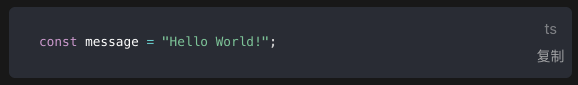

# 从零实现一个VuePress插件

参考：https://github.com/mqyqingfeng/Blog/issues/250

在搭建 VuePress 博客的过程中，也并不是所有的插件都能满足需求，所以本篇我们以实现一个代码复制插件为例，教大家如何从零实现一个 VuePress 插件。

## 准备

### 本地插件、社区插件

（这里应当**先读**：https://v2.vuepress.vuejs.org/zh/guide/plugin.html#%E5%AE%98%E6%96%B9%E6%8F%92%E4%BB%B6）

开发插件第一个要解决的问题就是如何本地开发，我们查看 VuePress 1.0 官方文档的「[开发插件](https://vuepress.vuejs.org/zh/plugin/writing-a-plugin.html)」章节，并没有找到解决方案，但在 VuePress 2.0 官方文档的「[本地插件](https://v2.vuepress.vuejs.org/zh/guide/plugin.html#本地插件)」里，却有写道：

> 推荐你直接将 配置文件 作为插件使用，因为几乎所有的插件 API 都可以在配置文件中使用，这在绝大多数场景下都更为方便。

> 但是如果你在配置文件中要做的事情太多了，最好还是将它们提取到单独的插件中，然后通过设置绝对路径或者通过 require 来使用它们：

```ts
module.exports = {
  plugins: [
    path.resolve(__dirname, './path/to/your-plugin.js'),
    require('./another-plugin'),
  ],
}
```

那就让我们开始吧！

### 插件设计

现在我们可以设想下我们的代码复制插件的效果了，我想要实现的效果是：

在代码块的右下角有一个 Copy 文字按钮，点击后文字变为 Copied！然后一秒后文字重新变为 Copy，而代码块里的代码则在点击的时候复制到剪切板中，期望的表现效果如下：


## 开始开发

### 初始化项目

我们在 `.vuepress` 文件夹下新建一个 `vuepress-plugin-code-copy` 的文件夹，用于存放插件相关的代码，然后命令行进入到该文件夹，执行 `npm init`，创建 `package.json`，此时文件的目录为：

```ts
.vuepress
├─ vuepress-plugin-code-copy 
│  └─ package.json
└─ config.js        
```

我们在 `vuepress-plugin-code-copy`下新建一个 `index.js` 文件，参照[官方文档插件示例](https://vuepress.vuejs.org/zh/plugin/writing-a-plugin.html)中的写法，我们使用返回对象的函数形式，这个函数接受插件的配置选项作为第一个参数、包含编译期上下文的 ctx 对象作为第二个参数：

```ts
module.exports = (options, ctx) => {
   return {
      // ...
   }
}
```

再参照官方文档 Option API 中的 [name](https://vuepress.vuejs.org/zh/plugin/option-api.html#name)，以及生命周期函数中的 [ready 钩子](https://vuepress.vuejs.org/zh/plugin/life-cycle.html#ready)，我们写一个初始的测试代码：

```ts
module.exports = (options, ctx) => {
    return {
        name: 'vuepress-plugin-code-copy',
        async ready() {
            console.log('Hello World!');
        }
    }
 }
```

此时我们运行下 `yarn run docs:dev`，可以在运行过程中看到我们的插件名字和打印结果：


### 检测代码块

如果是在 Vue 组件中，我们很容易实现这个效果，在根组件 `mounted` 或者 `updated`的时候，使用 `document.querySelector` 获取所有的代码块，插入一个按钮元素，再在按钮元素上绑定点击事件，当触发点击事件的时候，代码复制到剪切板，然后修改文字，1s 后再修改下文字。

那 VuePress 插件有方法可以控制根组件的生命周期吗？我们查阅下 VuePress 官方文档的 [Option API](https://vuepress.vuejs.org/zh/plugin/option-api.html#clientrootmixin)，可以发现 VuePress 提供了一个 clientRootMixin 方法：

> 指向 mixin 文件的路径，它让你可以控制根组件的生命周期

看下示例代码：

```ts
// 插件的入口
const path = require('path')

module.exports = {
  clientRootMixin: path.resolve(__dirname, 'mixin.js')
}
```

```ts
// mixin.js
export default {
  created () {},
  mounted () {}
}
```

这不就是我们需要的吗？那我们动手吧，修改 `index.js`的内容为：

```ts
const path = require('path');

module.exports = (options, ctx) => {
    return {
        name: 'vuepress-plugin-code-copy',
        clientRootMixin: path.resolve(__dirname, 'clientRootMixin.js')
    }
 }
```

在 `vuepress-plugin-code-copy`下新建一个 `clientRootMixin.js`文件，代码写入：

```ts
export default {
    updated() {
        setTimeout(() => {
            document.querySelectorAll('div[class*="language-"] pre').forEach(el => {
								console.log('one code block')
            })
        }, 100)
    }
}
```

刷新下浏览器里的页面，然后查看打印：

> 打印结果：(26) one code block

### 增加按钮元素

接下来就要思考如何写入按钮元素了。

当然我们可以使用原生 JavaScript 一点点的创建元素，然后插入其中，但我们其实是在一个支持 Vue 语法的项目里，其实我们完全可以创建一个 Vue 组件，然后将组件的实例挂载到元素上。那用什么方法挂载呢？

我们可以在 Vue 的[全局 API ](https://github.com/mqyqingfeng/Blog/issues/vuepress.vuejs.org)里，找到 `Vue.extend`API，看一下使用示例：

```ts
// 要挂载的元素
<div id="mount-point"></div>
```

```ts
// 创建构造器
var Profile = Vue.extend({
  template: '<p>{{firstName}} {{lastName}} aka {{alias}}</p>',
  data: function () {
    return {
      firstName: 'Walter',
      lastName: 'White',
      alias: 'Heisenberg'
    }
  }
})
// 创建 Profile 实例，并挂载到一个元素上。
new Profile().$mount('#mount-point')
```

结果如下：

```html
// 结果为:
<p>Walter White aka Heisenberg</p>
```

### 封装Vue组件

那接下来，我们就创建一个 Vue 组件，然后通过 `Vue.extend` 方法，挂载到每个代码块元素中。

在 `vuepress-plugin-code-copy`下新建一个 `CodeCopy.vue` 文件，写入代码如下：

```ts
<template>
    <span class="code-copy-btn" @click="copyToClipboard">{{ buttonText }}</span>
</template>

<script>
export default {
    data() {
        return {
            buttonText: 'Copy'
        }
    },
    methods: {
        copyToClipboard(el) {
            this.setClipboard(this.code, this.setText);
        },
        setClipboard(code, cb) {
            if (navigator.clipboard) {
                navigator.clipboard.writeText(code).then(
                    cb,
                    () => {}
                )
            } else {
                let copyelement = document.createElement('textarea')
                document.body.appendChild(copyelement)
                copyelement.value = code
                copyelement.select()
                document.execCommand('Copy')
                copyelement.remove()
                cb()
            }
        },
        setText() {
            this.buttonText = 'Copied!'

            setTimeout(() => {
                this.buttonText = 'Copy'
            }, 1000)
        }
    }
}
</script>

<style scoped>
.code-copy-btn {
    position: absolute;
    bottom: 10px;
    right: 7.5px;
    opacity: 0.75;
    cursor: pointer;
    font-size: 14px;
}

.code-copy-btn:hover {
    opacity: 1;
}
</style>
```

该组件实现了按钮的样式和点击时将代码写入剪切版的效果，整体代码比较简单，就不多叙述了。

我们修改一下 `clientRootMixin.js`：

```ts
import CodeCopy from './CodeCopy.vue'
import Vue from 'vue'

export default {
    updated() {
        // 防止阻塞
        setTimeout(() => {
            document.querySelectorAll('div[class*="language-"] pre').forEach(el => {
              	// 防止重复写入
                if (el.classList.contains('code-copy-added')) return
                let ComponentClass = Vue.extend(CodeCopy)
                let instance = new ComponentClass()
                instance.code = el.innerText
                instance.$mount()
                el.classList.add('code-copy-added')
                el.appendChild(instance.$el)
            })
        }, 100)
    }
}
```

这里注意两点，第一是我们通过 `el.innerText` 获取要复制的代码内容，然后写入到实例的 `code` 属性，在组件中，我们是通过 `this.code`获取的。

第二是我们没有使用 `$mount(element)`，直接传入一个要挂载的节点元素，这是因为 `$mount()` 的挂载会清空目标元素，但是这里我们需要添加到元素中，所以我们在执行 `instance.$mount()`后，通过 `instance.$el`获取了实例元素，然后再将其 `appendChild` 到每个代码块中。关于 `$el`的使用可以参考官方文档的 [el 章节](https://cn.vuejs.org/v2/api/index.html#el) 。

此时，我们的文件目录如下：

```ts
.vuepress
├─ vuepress-plugin-code-copy 
│  ├─ CodeCopy.vue
│  ├─ clientRootMixin.js
│  ├─ index.js
│  └─ package.json
└─ config.js   
```

至此，其实我们就已经实现了代码复制的功能。

## 扩展 - 插件选项

有的时候，为了增加插件的可拓展性，会允许配置可选项，就比如我们不希望按钮的文字是 Copy，而是中文的「复制」，复制完后，文字变为 「已复制！」，该如何实现呢？

前面讲到，我们的 `index.js`导出的函数，第一个参数就是 options 参数：

```ts
const path = require('path');

module.exports = (options, ctx) => {
    return {
        name: 'vuepress-plugin-code-copy',
        clientRootMixin: path.resolve(__dirname, 'clientRootMixin.js')
    }
 }
```

我们在 `config.js`先写入需要用到的选项：

```ts
module.exports = {
    plugins: [
      [
        require('./vuepress-plugin-code-copy'),
        {
          'copybuttonText': '复制',
          'copiedButtonText': '已复制！'
        }
      ]
    ]
}
```

我们 `index.js`中通过 `options`参数可以接收到我们在 `config.js` 写入的选项，但我们怎么把这些参数传入 `CodeCopy.vue` 文件呢？

我们再翻下 VuePress 提供的 Option API，可以发现有一个 [define API](https://vuepress.vuejs.org/zh/plugin/option-api.html#define)，其实这个 define 属性就是定义我们插件内部使用的全局变量。我们修改下 `index.js`：

```ts
const path = require('path');

module.exports = (options, ctx) => {
    return {
        name: 'vuepress-plugin-code-copy',
        define: {
            copybuttonText: options.copybuttonText || 'copy',
            copiedButtonText: options.copiedButtonText || "copied!"
        },
        clientRootMixin: path.resolve(__dirname, 'clientRootMixin.js')
    }
 }
```

现在我们已经写入了两个全局变量，组件里怎么使用呢？答案是直接使用！

我们修改下 `CodeCopy.vue` 的代码：

```ts
// ...
<script>
export default {
    data() {
        return {
            buttonText: copybuttonText
        }
    },
    methods: {
        copyToClipboard(el) {
            this.setClipboard(this.code, this.setText);
        },
        setClipboard(code, cb) {
            if (navigator.clipboard) {
                navigator.clipboard.writeText(code).then(
                    cb,
                    () => {}
                )
            } else {
                let copyelement = document.createElement('textarea')
                document.body.appendChild(copyelement)
                copyelement.value = code
                copyelement.select()
                document.execCommand('Copy')
                copyelement.remove()
                cb()
            }
        },
        setText() {
            this.buttonText = copiedButtonText

            setTimeout(() => {
                this.buttonText = copybuttonText
            }, 1000)
        }
    }
}
</script>
// ...
```

最终的效果如下：



## 代码参考

完整的代码查看：https://github.com/mqyqingfeng/Blog/tree/master/demos/VuePress/vuepress-plugin-code-copy

其实本篇代码是参考了 `Vuepress Code Copy Plugin`这个插件的代码，点击[查看源码地址](https://github.com/znicholasbrown/vuepress-plugin-code-copy)。


