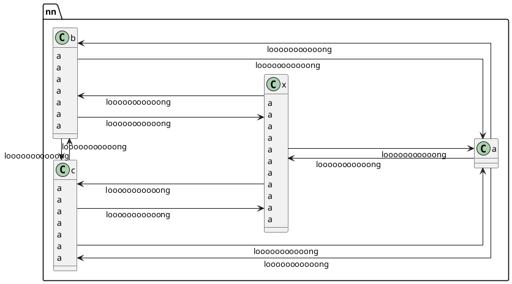

# PlantUML

## 在线使用

我见过有两种，一种需要编码，另一种不需要编码

### 不需要编码 —— Gravizo

关于在线渲染的使用见：“plantUML by Gravizo” 笔记

就是这样的：

```html
 if "Some Test" then;
  -->[true] "activity 1";
  if "" then;
    -> "activity 3" as a3;
  else;
    if "Other test" then;
      -left-> "activity 5";
    else;
      --> "activity 6";
    endif;
  endif;
else;
  ->[false] "activity 2";
endif;
a3 --> if "last test" then;
  --> "activity 7";
else;
  -> "activity 8";
endif;
@enduml
'>
```

虽然说不需要编码，但其中肯定会涉及到一些不能用在url上的字符。所以使用这种方案的话，某些字符还是需要进行编码再使用的

### 需要编码 —— plantuml.com

这种需要使用 `encode = require('plantuml-encoder').encode("...")` 获取编码后的内容，再进行请求

## 图表优化
### 常用样式

[连接线风格](http://blog.lujun9972.win/blog/2020/04/22/plantuml-tips%E4%B9%8B%E8%AE%BE%E7%BD%AE%E8%BF%9E%E6%8E%A5%E7%BA%BF%E9%A3%8E%E6%A0%BC/index.html)

- skinparam linetype ortho
- skinparam linetype polyline

### 案例

一个四节点互连图 (应该用样式修改来替代a填充)



## 程序类型

### 前端渲染 or 服务器渲染

在 Mdit-Plugins 的实现中 (VuePress-Hope-Theme 主题)

通过查看网络数据，发现：mdEnhance 配置里的六类图表中，~~仅一个提前渲染，五个都是Browser渲染~~，六个都没有在服务端提前渲染（图标的标注是错的，plantuml是通过img标签由第三方服务器进行渲染的，差点被误导了）

（按理说也都能提前渲染的，但就是比较麻烦，我也折腾过。例如需要设置服务器的虚拟document环境，例如 jsdom 等。然后mermaid又可能遇到报错：）


### SVG or IMG or ASCII

支持性

- 其中，Plantuml 三种都支持，如 Obisidian-Plantuml 中，就支持这三种，图片后缀.png。而 VuePress-Hope-Theme 中使用图片，图片后缀.svg。

  - Obsidian-PlantUML默认：第三方服务器：Web .png Img

  - VuePress-Hope-Theme：第三方服务器：Web .svg Img


渲染增量

- Mermaid：一般渲染为 svg_html
  - 渲染增量：一个demo中，原始字符 (上百字符) -> svg_html (十五万字符)
  
- Markmap：一般渲染为 svg_html
  - 渲染增量：一个demo中，原始语法 (近千个字符) -> svg_html (十五万字符)
  
- Plantuml - Img
  - 渲染增量：以 https://www.plantuml.com 服务器结构为例，原始语法 (数百字符) -> url (编码为url可用字符，五百字符) -> 图片 (几十KB)
  
    ```typescript
    var plantumlEncoder = require('plantuml-encoder')
    
    var encoded = plantumlEncoder.encode('A -> B: Hello') // var plain = plantumlEncoder.decode('SrJGjLDmibBmICt9oGS0')
    console.log(encoded) // SrJGjLDmibBmICt9oGS0
    
    var url = 'http://www.plantuml.com/plantuml/img/' + encoded
    ```
  
- Plantuml - ASCII

- Plantuml - Svg

### Jar or 服务器 or 纯Js

#### Mdit-Plugins (服务器)

代码：https://github.com/mdit-plugins/mdit-plugins/blob/6d7e069e4f8283f069ac8db00f545c90a654bcff/packages/plantuml/src/options.ts

还是以 Mdit-Plugins 为例：

从他的配置里可以看出，他这里用的是服务器的方式


#### Obsidian-PlantUML (服务器+Jar)

代码：https://github.com/joethei/obsidian-plantuml/blob/master/src/main.ts

另一个例子是 Obsidian-PlantUML，支持本地 Jar 以及设置Plantuml两种模式

#### 官方 js demo (纯js)

代码：https://github.com/plantuml/plantuml.js/blob/main/examples/01-basic/index.html

（这里需要本地 `npm i` 安装，话说这玩意总感觉首次加载比用服务器还慢）

```html
<!DOCTYPE html>
<html lang="en">
  <head>
    <meta charset="utf-8">
    <meta name="viewport" content="width=device-width, initial-scale=1.0">
    <title>PlantUML.js Basic Example</title>
    <!-- Require cheerpj dependency -->
    <script src="https://cjrtnc.leaningtech.com/2.3/loader.js"></script>
    <!-- Require PlantUML.js -->
    <script src="node_modules/@sakirtemel/plantuml.js/plantuml.js"></script>
  </head>
  <body>
    
    <script type="text/javascript">
        plantuml.initialize('/app/node_modules/@sakirtemel/plantuml.js').then(() => {
            const element = document.getElementById('plantuml-diagram')
            const pumlContent = `
                @startuml
                Bob -> Alice: Hello!
                @enduml
            `
            const url = plantuml.renderPng(pumlContent).then((blob) => {
                element.src = window.URL.createObjectURL(blob)
            })
        })
    </script>
  </body>
</html>
```

然后正常的控制台输出流程

```bash
CheerpJ runtime ready
Run main for com/plantuml/wasm/v1/RunInit loader.js:2442:12
PlantUML Version: 1.2023.2beta4 cheerpOS.js:1772:11
Init ok. cheerpjPath is /app/node_modules/@sakirtemel/plantuml.js/ cheerpOS.js:1772:11
(0 ms) Starting processing
(2012 ms) ...text loaded... cheerpOS.js:1772:11			# 文本加载
(2024 ms) ..compiling diagram... cheerpOS.js:1772:11	# 
(2182 ms) ...parsing ok... cheerpOS.js:1772:11			# 解析
(2183 ms) ...processing... cheerpOS.js:1772:11
(2183 ms) ...loading data... cheerpOS.js:1772:11
(4333 ms) ...image drawing... cheerpOS.js:1772:11		# 绘图
(4790 ms) Done! cheerpOS.js:1772:11
Rendering finished in 4800 ms
```

## 源码

#源码

这是模块源码，node_modules/@sakirtemel/plantuml.js/plantuml.js：

```typescript
const plantuml = (() => {
    const initialize = async (cheerpjPath = "/app/plantuml-wasm") => {
        await Promise.all([
            cheerpjInit({ preloadResources: _runtimeResources() }),
            _preloadPlantumlFiles(cheerpjPath.replace("/app", ""))
        ])

        // to make cjcall work, first we load the java package like this
        await cheerpjRunMain("com.plantuml.wasm.v1.RunInit", `${cheerpjPath}/plantuml-core.jar`, `${cheerpjPath}/`)        
    }

    const renderPng = (pumlContent) => {
        return new Promise((resolve, reject) => {
            const renderingStartedAt = new Date()
            const resultFileSuffix = renderingStartedAt.getTime().toString()
            cjCall("com.plantuml.wasm.v1.Png", "convert", "light", `/files/result-${resultFileSuffix}.png`, pumlContent).then((result) => {
				const obj = JSON.parse(result);
				if (obj.status=='ok') {
					cjFileBlob(`result-${resultFileSuffix}.png`).then((blob) => {
                        const transaction = cheerpjGetFSMountForPath('/files/').dbConnection.transaction('files', 'readwrite')
                        transaction.objectStore('files').delete(`/result-${resultFileSuffix}.png`)

                        transaction.oncomplete = () => {
                            console.log('Rendering finished in', (new Date()).getTime() - renderingStartedAt.getTime(), 'ms');
                            resolve(blob)
                        }
					})
				}
            })
        })
    }

    const _runtimeResources = () => {
        return ["/lt/runti......urity.provider.js"]
    }

    const _preloadPlantumlFiles = async (urlBasePathForFiles) => {
        // just do explicit fetch here for further cache hits
        // this code may evolve into bundling all resource files and pass it to cheerpj
        return await Promise.all([
            fetch(`${urlBasePathForFiles}/plantuml-core.jar.js`),
            fetch(`${urlBasePathForFiles}/plantuml-core.jar`)
        ])
    }

    return { initialize, renderPng }
})()
```

这是模块的官方使用示例：index.html（需要本地 `npm i` 安装，并运行服务器）

```html
<!DOCTYPE html>
<html lang="en">
  <head>
    <meta charset="utf-8">
    <meta name="viewport" content="width=device-width, initial-scale=1.0">
    <title>PlantUML.js Basic Example</title>
    <!-- Require cheerpj dependency -->
    <script src="https://cjrtnc.leaningtech.com/2.3/loader.js"></script>
    <!-- Require PlantUML.js -->
    <script src="node_modules/@sakirtemel/plantuml.js/plantuml.js"></script>
  </head>
  <body>
    
    <script type="text/javascript">
        plantuml.initialize('/app/node_modules/@sakirtemel/plantuml.js').then(() => {
            const element = document.getElementById('plantuml-diagram')
            const pumlContent = `
                @startuml
                Bob -> Alice: Hello!
                @enduml
            `
            const url = plantuml.renderPng(pumlContent).then((blob) => {
                element.src = window.URL.createObjectURL(blob)
            })
        })
    </script>
  </body>
</html>
```

现在需要在ts中使用这个模块。需要注意ts的类型检查问题、以及该模块实际上是以 IIFE 的立即执行函数表达式的形式导出。

创建 plantuml.d.ts

```typescript
// plantuml.d.ts
declare module '@sakirtemel/plantuml.js/plantuml' {
  interface PlantUML {
    initialize: (cheerpjPath?: string) => Promise<void>;
    renderPng: (pumlContent: string) => Promise<Blob>;
  }

  const plantuml: PlantUML;

  export default plantuml;
}
```

创建/修改 tsconfig.json

```json
{
  "compilerOptions": {
    "module": "commonjs",
    "target": "es2020",
    "lib": ["es2020", "dom"],
    "typeRoots": ["node_modules/@types", "types"]
  },
  "include": ["src/**/*"],
  "exclude": ["node_modules", "**/*.spec.ts"]
}
```

然后使用

```typescript
import plantuml from '@sakirtemel/plantuml.js/plantuml';

async function initAndRender(): Promise<void> {
  try {
    await plantuml.initialize(); // 初始化 PlantUML
    const blob = await plantuml.renderPng('@startuml\nAlice -> Bob: Hello\n@enduml'); // 渲染 PlantUML 内容
    console.log('Blob created:', blob);
  } catch (error) {
    console.error('Error during initialization or rendering:', error);
  }
}

initAndRender();
```

### 使用

主要是用的人好少……https://github.com/search?q=sakirtemel%2Fplantuml.js&type=code，github搜代码，也就只看到四个用法，其中两个是Plantuml的示例，其中有三个都是在html中使用，只有一个是在js中使用


