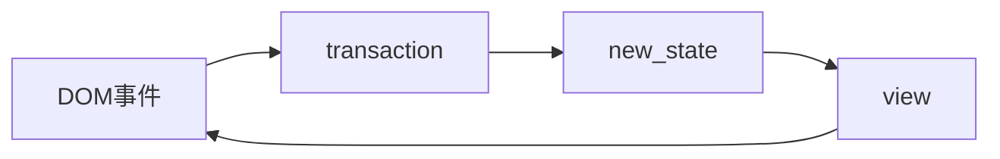

# CodeMirror 官网引导 - 系统指南（Guide）

https://codemirror.net/docs/guide/

## 架构概述

### 模块化（Modularity）

CodeMirror 被设置为独立模块的集合，这些模块一起提供了一个功能齐全的文本和代码编辑器。从好的方面来说，这意味着您可以挑选和选择您需要的功能，如果需要，甚至可以用自定义实现替换核心功能。不利的一面是，这意味着设置编辑器需要您将一堆片段放在一起。

组装部分并不难，但您必须安装并导入所需的部分。核心包是：

- [`@codemirror/state`](https://codemirror.net/docs/ref/#state)，它定义了表示[编辑器状态](https://codemirror.net/docs/ref/#state.EditorState)和 对该状态的[更改](https://codemirror.net/docs/ref/#state.Transaction)的数据结构。
- [`@codemirror/view`](https://codemirror.net/docs/ref/#view)，一个知道如何向用户显示编辑器状态并将基本编辑操作转换为状态更新的[显示组件。](https://codemirror.net/docs/ref/#view.EditorView)
- [`@codemirror/commands`](https://codemirror.net/docs/ref/#commands)，为它们定义了很多编辑命令和一些[键绑定](https://codemirror.net/docs/ref/#commands.defaultKeymap)。


这就是一个最小可行的编辑器的样子：

```javascript
import {EditorState} from "@codemirror/state"
import {EditorView, keymap} from "@codemirror/view"
import {defaultKeymap} from "@codemirror/commands"

let startState = EditorState.create({
  doc: "Hello World",
  extensions: [keymap.of(defaultKeymap)]
})

let view = new EditorView({
  state: startState,
  parent: document.body
})
```

您在编辑器中期望的许多东西，例如[行号间距](https://codemirror.net/docs/ref/#view.lineNumbers)或[撤消历史记录](https://codemirror.net/docs/ref/#h_undo_history)，都是作为通用核心的扩展实现的，需要显式添加到要启用的配置中。为了便于入门，该[`codemirror`](https://codemirror.net/docs/ref/#codemirror)包引入了基线编辑器所需的大部分内容（语言包除外）。

```javascript
import {EditorView, basicSetup} from "codemirror"
import {javascript} from "@codemirror/lang-javascript"

let view = new EditorView({
  extensions: [basicSetup, javascript()],
  parent: document.body
})
```

这些包作为[ES6 模块](https://developer.mozilla.org/en-US/docs/Web/JavaScript/Guide/Modules)分发。这意味着如果没有某种捆绑器（将模块化程序打包到单个大 JavaScript 文件中）或模块加载器，目前运行该库是不切实际的。如果您不熟悉捆绑，我建议您查看[rollup](https://rollupjs.org/)或 [Webpack](https://webpack.js.org/)。


### 功能核心，命令式外壳（Functional Core, Imperative Shell）

指导 CodeMirror 架构的一种态度是，**功能**性（纯）代码创造新的价值而不是产生副作用，它比**命令式**代码更容易使用。
但是浏览器 DOM 显然是**命令式**的，与 CodeMirror 集成的许多系统一样。

为了解决这个矛盾，库的状态表示是严格函数式的——[文档](https://codemirror.net/docs/ref/#state.Text)和 [状态](https://codemirror.net/docs/ref/#state.EditorState)数据结构是不可变的，对它们的操作是纯函数，而[视图组件](https://codemirror.net/docs/ref/#view.EditorView)和命令接口将它们包装在一个命令式接口中。

这意味着即使编辑器移动到新状态，旧状态值也会保持不变。在处理状态更改时，同时拥有旧状态和新状态通常非常有用。这也意味着直接更改状态值，或以命令方式编写附加[状态字段等](https://codemirror.net/docs/ref/#state.StateField)扩展不会达到您希望的效果（并且可能只会破坏事物）。

TypeScript 接口试图通过将数组和对象属性标记为`readonly`. 当使用普通的旧 JavaScript 时，可能更难记住这一点。但作为一般规则，除非在文档中明确描述，否则不支持在库创建的对象中重新分配属性。

```javascript
let state = EditorState.create({doc: "123"})
// BAD WRONG NO GOOD CODE:
state.doc = Text.of("abc") // <- DON'T DO THIS
```


### 状态和更新（State and Updates）

[该库以受Redux](https://redux.js.org/)或 [Elm](https://guide.elm-lang.org/architecture/)等方法启发的方式处理更新 。除了少数例外（如组合和拖放处理）， [视图](https://codemirror.net/docs/ref/#view.EditorView)的状态完全由其[`state`](https://codemirror.net/docs/ref/#view.EditorView.state)属性中的[`EditorState`](https://codemirror.net/docs/ref/#state.EditorState)值决定。

[通过创建](https://codemirror.net/docs/ref/#state.EditorState.update)描述对文档、选择或其他状态[字段](https://codemirror.net/docs/ref/#state.StateField)的更改的 [事务](https://codemirror.net/docs/ref/#state.Transaction)，该状态的更改发生在功能代码中 。然后可以 [分派](https://codemirror.net/docs/ref/#view.EditorView.dispatch)这样的事务，它告诉视图更新其状态，此时它将其 DOM 表示与新状态同步。

```javascript
// (Assume view is an EditorView instance holding the document "123".)
let transaction = view.state.update({changes: {from: 0, insert: "0"}})
console.log(transaction.state.doc.toString()) // "0123"
// At this point the view still shows the old state.
view.dispatch(transaction)
// And now it shows the new state.
```

典型用户交互期间的数据流如下所示：



视图监听事件。当 DOM 事件进入时，它（或绑定到键的命令，或由扩展注册的事件处理程序）将它们转换为状态事务并分发它们。这建立了一个新的状态。当新状态被提供给视图时，它会自行更新。

### 扩展（Extension）


### 文档偏移（Document offsets）


## 数据模型

### 文件变更（Document-changes）

### 选择（selection）

### 配置（Configuration）

### 处理（Transactions 机翻是交易？）

使用状态 [`update`](https://codemirror.net/docs/ref/#state.EditorState.update)方法创建的交易结合了许多效果（都是可选的）：

- 它可以应用[文档更改](https://codemirror.net/docs/ref/#state.TransactionSpec.changes)。
- 它可以显式移动 [选择](https://codemirror.net/docs/ref/#state.TransactionSpec.selection)。请注意，当有文档更改但没有明确的新选择时，选择将 通过这些更改隐式[映射。](https://codemirror.net/docs/ref/#state.EditorSelection.map)
- 它可以设置一个[标志](https://codemirror.net/docs/ref/#state.TransactionSpec.scrollIntoView)，指示视图将（主要）选择头滚动到视图中。
- 它可以有任意数量的 [注解](https://codemirror.net/docs/ref/#state.TransactionSpec.annotations)，用于存储描述（整个）交易的额外元数据。例如，[`userEvent`](https://codemirror.net/docs/ref/#state.Transaction^userEvent) 注释可用于识别为某些常见操作（如键入或粘贴）生成的事务。
- 它可以有[effects](https://codemirror.net/docs/ref/#state.TransactionSpec.effects)，这是独立的附加效果，通常在某些扩展的状态上（例如折叠代码或启动自动完成）。
- 它可以通过提供一组[全新](https://codemirror.net/docs/ref/#state.StateEffect^reconfigure)的扩展或[替换](https://codemirror.net/docs/ref/#state.Compartment.reconfigure)配置的 特定[部分](https://codemirror.net/docs/ref/#state.Compartment)来影响状态的配置。

要完全重置状态（例如加载新文档），建议创建新状态而不是事务。这将确保不会出现不需要的状态（例如撤消历史事件）。


## The View


### 视口（Viewport）


### 更新周期（Update-cycle）


### DOM结构（Dom-structure）


### 风格和主题（Styles-and-themes）


### 命令（Commands）


## 扩展CM（Extending-codemirror）

有许多不同的方法可以扩展 CodeMirror，并且为给定的用例选择正确的方法并不总是显而易见的。本节介绍编写编辑器扩展需要熟悉的各种概念。

### 状态字段（State-fields）

（可参考：[OB-状态字段](../Plugin_Obsidian/01. Obsidian插件开发.md/###状态字段 `StateField` - OB) ）

扩展通常需要在状态中存储额外的信息。撤消[历史](https://codemirror.net/docs/ref/#commands.history)需要存储可撤消的更改，代码[折叠](https://codemirror.net/docs/ref/#h_folding)扩展需要跟踪已折叠的内容，等等。

为此，扩展可以定义额外的[状态字段](https://codemirror.net/docs/ref/#state.StateField)。存在于纯功能[状态](https://codemirror.net/docs/ref/#state.EditorState)数据结构中的状态字段必须存储不可变值。

状态字段使用类似于[reducer](https://redux.js.org/basics/reducers/)的东西与状态的其余部分保持同步。每次状态更新时，都会用字段的当前值和交易调用一个函数，它应该返回字段的新值。

```javascript
import {EditorState, StateField} from "@codemirror/state"

let countDocChanges = StateField.define({						// 定义一个状态字段 —— countDocChanges
  create() { return 0 },
  update(value, tr) { return tr.docChanged ? value + 1 : value }
})

let state = EditorState.create({extensions: countDocChanges})	// 根据该状态字段 创建一个编辑器状态
state = state.update({changes: {from: 0, insert: "."}}).state	// 更新状态
console.log(state.field(countDocChanges)) 						// 打印状态字段
```

您通常会希望使用[注释](https://codemirror.net/docs/ref/#state.Annotation)或 [效果](https://codemirror.net/docs/ref/#state.StateEffect)来传达您的状态字段正在发生的事情。

尝试避免采取将状态放入实际状态字段的步骤可能很诱人——声明一个状态有点冗长，并且为每个状态更改触发整个事务可能感觉有点重量级。但在几乎所有情况下，将您的状态绑定到编辑器范围的状态更新周期中是一个*非常*好的主意，因为它使保持所有内容同步变得容易得多。


### 影响视图（Affecting-the-view）

[视图插件](https://codemirror.net/docs/ref/#view.ViewPlugin)为扩展提供了一种在视图中运行命令式组件的方法。这对于事件处理程序、添加和管理 DOM 元素以及执行依赖于当前视口的操作等非常有用。

这个简单的插件**在编辑器的角落显示文档大小**。

```javascript
import {ViewPlugin} from "@codemirror/view"

const docSizePlugin = ViewPlugin.fromClass(class {
  constructor(view) {
    this.dom = view.dom.appendChild(document.createElement("div"))	// 创建一个dom元素
    this.dom.style.cssText =
      "position: absolute; inset-block-start: 2px; inset-inline-end: 5px"
    this.dom.textContent = view.state.doc.length					// 用来显示文档的长度
  }

  update(update) {
    if (update.docChanged)
      this.dom.textContent = update.state.doc.length				// 视图刷新时更新文档的长度
  }

  destroy() { this.dom.remove() }
})
```

视图插件通常不应保持（非派生）状态。它们最适合作为对保存在编辑器状态中的数据的浅层视图。

当状态被重新配置时，不属于新配置的视图插件将被销毁（这就是为什么，如果他们对编辑器进行了更改，他们应该定义一个`destroy`方法来撤消这些更改）。

当视图插件崩溃时，它会自动禁用以避免关闭整个视图。


### ~~装饰文档（Decorating-the-document）~~

==（详见 Decoration 专题）==

如果没有另行通知，CodeMirror 会将文档绘制为纯文本。*修饰*是一种机制，扩展可以通过这种机制影响文档的外观。它们有四种类型：

- [标记装饰](https://codemirror.net/docs/ref/#view.Decoration^mark)将样式或 DOM 属性添加到给定范围内的文本。
- [小部件装饰](https://codemirror.net/docs/ref/#view.Decoration^widget)在文档中的给定位置插入一个 DOM 元素。
- [替换装饰](https://codemirror.net/docs/ref/#view.Decoration^replace)隐藏部分文档或用给定的 DOM 节点替换它。
- [线条装饰](https://codemirror.net/docs/ref/#view.Decoration^line)可以将属性添加到线条的环绕元素。

装饰是通过 [facet](https://codemirror.net/docs/ref/#view.EditorView^decorations)提供的。每次更新视图时，此方面的内容都用于设置可见内容的样式。

装饰保存在[sets](https://codemirror.net/docs/ref/#state.RangeSet)中，这也是不可变的数据结构。此类集合可以 跨更改[映射](https://codemirror.net/docs/ref/#state.RangeSet.map)（调整其内容的位置以补偿更改）或 在更新时[重建](https://codemirror.net/docs/ref/#state.RangeSetBuilder)，具体取决于用例。

提供装饰的方式有两种

-   直接
-   通过将范围集值放在构面中（通常通过 从字段[派生](https://codemirror.net/docs/ref/#state.StateField^define^config.provide)），或间接地，通过提供从视图到范围集的函数。

只有直接提供的装饰集可能会影响编辑器的垂直块结构，但只有间接（indirectly）提供的装饰集才能读取编辑器的视口。例如，如果你想只装饰 可见内容（[visible content](https://codemirror.net/docs/ref/#view.EditorView.visibleRanges)），这可能很有用。
此限制的原因是视口是从块结构计算的，因此在读取视口之前必须知道这一点。


### 扩展架构（Extension-architecture）

要创建给定的编辑器功能，您通常需要组合不同类型的扩展：用于保持状态的状态字段、用于提供样式的基本主题、用于管理输入和输出的视图插件、一些命令，可能是用于配置的方面.

一种常见的模式是导出一个函数，该函数返回使您的功能正常工作所需的扩展值。使它成为一个函数，即使它（还）不接受参数也是一个好主意——它使得以后添加配置选项成为可能，而不会破坏向后兼容性。

由于扩展可以引入其他扩展，因此考虑多次包含您的扩展时会发生什么会很有用。对于某些类型的扩展，例如键盘映射，只做多次它正在做的事情是合适的。但通常那样会很浪费，甚至会破坏某些东西。

通常可以通过重复删除相同的扩展值来多次使用扩展，只要做正确的事情——如果你确保只创建一次静态扩展值（主题、状态字段、视图插件等），并且总是从你的扩展构造函数返回相同的实例，你只会在编辑器中得到它们的一个副本。

但是当您的扩展允许配置时，您的其他逻辑可能需要访问它。当扩展的不同实例有不同的配置时，你会怎么做？

有时，这只是一个错误。但通常可以定义协调它们的策略。方面为此工作得很好。您可以将配置放在模块私有的方面，并使其 [组合](https://codemirror.net/docs/ref/#state.Facet^define^config.combine)功能协调配置或在不可能时抛出错误。然后需要访问当前配置的代码可以读取该方面。

有关此方法的说明，请参见[斑马条纹](https://codemirror.net/examples/zebra)示例。


