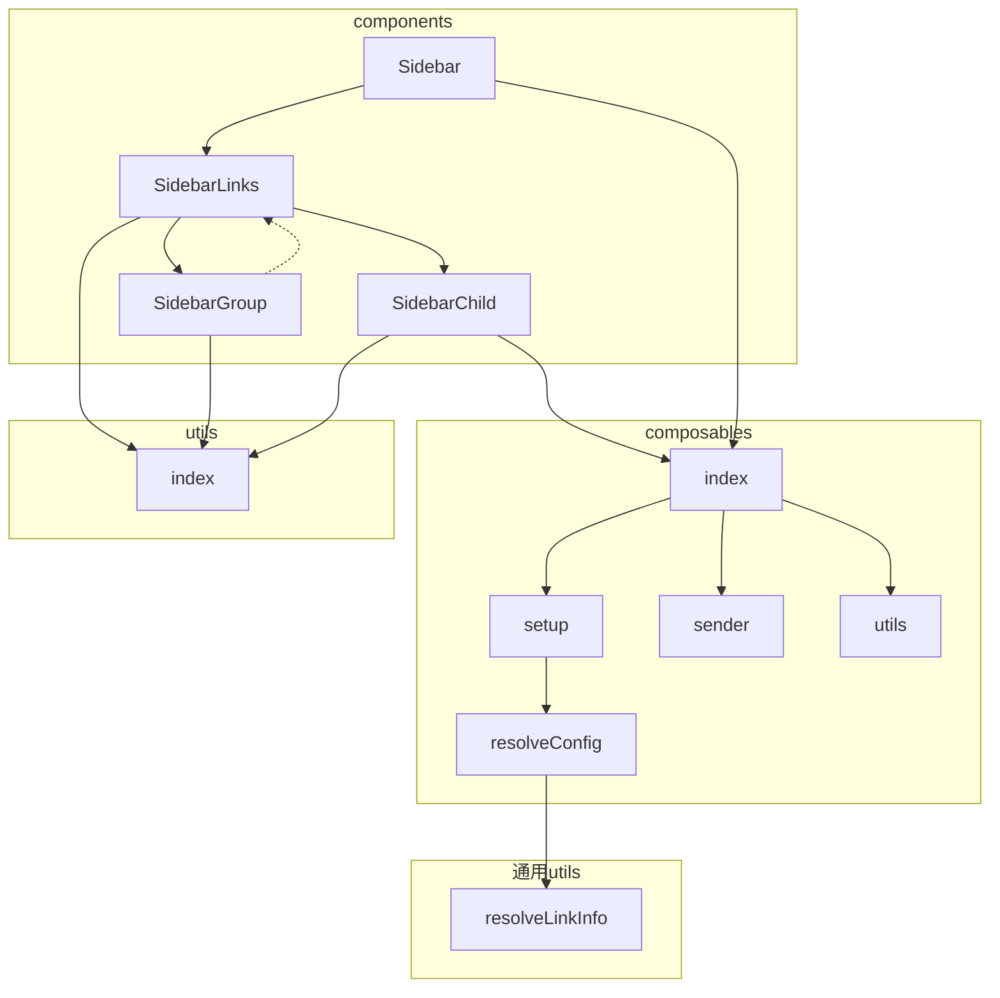

# Vuepress Hope主题 源码分析

## 贡献指南

https://theme-hope.vuejs.press/zh/contribution.html，这个位置有点迷，研究走了点弯路后，我才看到有这么一页，居然要点 "常见问题" 才能在这个完整版的侧边栏底部看到

### 项目文件结构

本项目是一个 monorepo，使用 pnpm 管理。

- docs: 放置各插件与主题的文档，每个子文件夹为一个项目
- demo: 主题演示项目
- packages: 放置各**插件与主题**的代码，每个子文件夹为一个项目

```js
.
├── .github → GitHub 配置
├── .husky → husky 配置
│
├── demo → 演示项目
│
├── docs → 文档目录
│ ├── auto-catalog → auto-catalog 插件文档
│ ├── blog → blog2 插件文档
│ ├── comment → comment2 插件文档
│ ├── components → components 插件文档
│ ├── copy-code → copy-code2 插件文档
│ ├── feed → feed2 插件文档
│ ├── lightgallery → lightgallery 插件文档
│ ├── md-enhance → md-enhance 插件文档
│ ├── photo-swipe → photo-swipe 文档
│ ├── pwa → pwa2 插件文档
│ ├── reading-time → reading-time2 插件文档
│ ├── remove-pwa → remove-pwa 插件文档
│ ├── rtl → rtl 插件文档
│ ├── sass-palette → sass-palette 插件文档
│ ├── shared → vuepress-shared 文档
│ ├── search-pro → search-pro 插件文档
│ ├── seo → seo2 插件文档
│ └── theme → 主题文档
│
├── docs-shared → 文档的通用文件
|
├── packages → 项目源代码
│ ├── auto-catalog → auto-catalog 插件
│ ├── blog2 → blog2 插件
│ ├── comment2 → comment2 插件
│ ├── components → components 插件
│ ├── copy-code2 → copy-code2 插件
│ ├── create → create-vuepress-theme-hope 助手
│ ├── feed2 → feed2 插件
│ ├── lightgallery → lightgallery 插件
│ ├── md-enhance → md-enhance 插件
│ ├── photo-swipe → photo-swipe 插件
│ ├── pwa2 → pwa2 插件
│ ├── reading-time2 → reading-time2 插件
│ ├── remove-pwa → remove-pwa 插件
│ ├── rtl → rtl 插件
│ ├── sass-palette → sass-palette 插件
│ ├── search-pro → search-pro 插件
│ ├── seo2 → seo2 插件
│ ├── shared → 共享文件
│ ├── sitemap2 → sitemap2 插件
│ └── theme → vuepress-theme-hope 主题
│
├── scripts → 命令脚本
│
├── ... → 一些配置文件
│
├── LICENSE → 协议
├── package.json → 项目根 package.json
├── README.md → 项目介绍
├── SECURITY.md → 安全政策文件
│
└── tsconfig.* → TypeScript 配置文件
```

### 文档修改

你可以直接在 docs 文件夹内找到对应项目，并修改对应的 Markdown。

确保 `pnpm lint` 与 `pnpm lint:md` 命令没有错误后，即可提交到 GitHub 发起 PR。

> 预览文档
>
> 由于文档使用的是本地主题和插件，因此你需要先通过 `pnpm build` 构建本地项目。
>
> 之后在 `docs` 目录下的正确文档项目文件夹打开终端，运行 `pnpm docs:vite-dev` (使用 vite) 或 `pnpm docs:webpack-dev` (使用 webpack)。

### 项目修改

每个项目的结构都大致如下：

```js
.
├── lib → 编译后的输出文件
│    ├── client → 客户端侧代码
│    └── node → Node.js 侧代码
└── src → 源文件
     ├── client → 客户端侧代码
     ├── node → Node.js 侧代码
     └── shared → 客户端和 Node.js 的共享文件
```

VuePress 同时运行在客户端和 Node 端。 Node 侧有像 `fs` 这样的 node 模块，而客户端运行在有`document``windows``navigator`等全局变量的浏览器中，你应该清楚一段代码运行在哪里。

- `client` 目录存储在浏览器中运行的代码
- `node` 目录存储在 Node.js 中运行的代码
- `shared` 目录存储在客户端和 Node 中使用的文件，因此代码不应引用任何浏览器全局变量或 node 模块。

为了更好的性能，所有插件在发布时都会使用 rollup 进行打包并压缩。

### 提交

项目使用 `husky` 添加了额外的 Git Hooks 进行验证：

- 在 `precommit` 阶段我们使用 `lint-staged` 配合对应 Linter 对改动的代码进行检验

  这意味着你需要保证你的代码按照项目要求进行格式化，可以通过 Linter。

- 在 `commit-msg` 阶段我们使用 `commitlint` 对提交备注进行校验。

  这意味着你需要保证你的提交注释符合语义化提交 (Semantic)

> 提示
>
> 如果你不能通过上述 Git Hooks，你将无法完成 `git commit`。
>
> 如果你已经进行贡献了一些内容，但无法完成提交且不会修复，你可以在提交时添加 `--no-verify` Flag 绕过 Git Hooks。

> husky 个人补充
>
> 对应的是项目中的 `/.husky` 文件夹，尚不知道是 github 专用还是通用的，不知道是前端专用的还是通用的

## main-repo 父项目

简化：看起来多，但如果将 "可选" 插件的末枝去掉，主干是theme文件夹

### 目录结构

#### 项目根目录

https://github.com/vuepress-theme-hope/vuepress-theme-hope

- /， **main-repo**

  - (主要目录)

    - /demo/， 插件使用示例，演示项目
      - 一些插件/

    - /docs/， 插件使用文档
      - 一些插件/

    - /packages/， 插件源码
      - 一些插件/

  - （其他非主要目录）

    - /.github/

    - /.husky/

    - /.vscode/
      - extensions.json
      - launch.json
      - setting.json

    - /docs-shared/， 文档的通用文件（但内容是代码啊）

    - /scripts/， 命令脚本

    - ~~/node_modules/~~

    - /LICENSE,  协议
    
    - /package.json,  项目根 package.json
    
    - README.md,  项目介绍
    
    - /SECURITY.md,  安全政策文件
    
    - /tsconfig.*,  TypeScript 配置文件
    
    - /...


#### 插件目录（都是一些monorepo组织的子项目）

一些插件，对应的介绍页：https://vuepress-theme-hope.github.io/v2/zh/config/plugins/intro.html#%E6%8F%92%E4%BB%B6%E9%80%89%E9%A1%B9

注意：/demo或docs或packages/xxx/，这一层都是 **sub-repo**

- /demo或docs或packages/

  - (Mr.Hope 提供的插件部分)

    - auto-catalog/， 自动目录页

    - blog2/， 博客插件

    - comment2/， 评论与浏览量

    - components/， 一些开箱即用的插件

    - copy-code2/， 一键复制代码块

    - copyright2/， 在用户复制时追加版权信息，或禁用站点的复制与选择

    - feed2/， Feed 支持 插件

    - md-enhance/， 更多 Markdown 语法

    - photo-swipe/， 基于 Photo Swipe 的图片浏览插件

    - pwa2/， 增强 PWA 支持

    - reading-time2/， 阅读时间与字数统计

    - remove-pwa/， 面向全部插件和主题的 Sass 配置插件

    - seo2/， SEO 增强插件

    - sitemap2/， Sitemap 插件？(docs不包含)

  - (一些没被主题捆绑的插件)

    - create/， (docs不包含)

    - lightgallery/， 基于 lightgallery 图片浏览插件

    - redirect/， 重定向插件

    - [vuepress-plugin-remove-pwa](https://vuepress-theme-hope.github.io/v2/remove-pwa/zh/): 移除 PWA 插件

    - search-pro/， 客户端搜索插件

  - (其他没介绍的)

    - rtl/,  未知插件

    - sass-palette/

    - shared/,  docs是vuepress-shared 文档，packages是共享文件

    - theme/， 一些主题配置


有一些插件不在在个路径，例如官方插件：

- [@vuepress/plugin-active-header-links](https://vuejs.press/zh/reference/plugin/active-header-links.html): 自动更新路由 Hash
- [@vuepress/plugin-container](https://vuejs.press/zh/reference/plugin/container.html): 自定义容器
- [@vuepress/external-link-icon](https://vuejs.press/zh/reference/plugin/external-link-icon.html): 为 Markdown 的外部链接添加外部链接图标。
- [@vuepress/plugin-git](https://vuejs.press/zh/reference/plugin/git.html): 基于 Git 的信息插件
- [@vuepress/plugin-nprogress](https://vuejs.press/zh/reference/plugin/nprogress.html): 进度条
- [@vuepress/plugin-prismjs](https://vuejs.press/zh/reference/plugin/prismjs.html): 基于 prism.js 的代码高亮插件
- [@vuepress/plugin-theme-data](https://vuejs.press/zh/reference/plugin/theme-data.html): 主题配置的 Composition API 插件

### 根 package.json 脚本

1. 构建项目: `pnpm build`
   - 使用 rollup 打包并压缩代码，并输出到 `lib` 文件夹
   - 使用 `rollup-plugin-copy` 复制其他文件到 `lib` 文件夹
2. 开发项目: `pnpm dev`
   - 使用 `tsc` 编译 TypeScript 文件到 `lib` 文件夹
   - Use `cpx` 复制其他文件到 `lib` 文件夹

```json
"scripts": {
    // 注意：请不要混用构建和开发命令，因为它们的构建方式完全不同
    // 否则你可能需要执行 `pnpm clean` 命令来清除上一次的命令结果
    
    // 其他自带通用命令：i、un、publish
    
    // 构建 (packages子项目会各自生成lib文件夹)
    "build": "cross-env NODE_ENV=production pnpm run --stream -r build",
    "build:no-bundle": "concurrently \"tsc -b tsconfig.build.json\" \"pnpm run copy\"",
    
    // 开发
    "dev": "concurrently \"tsc -b tsconfig.build.json --watch\" \"pnpm run dev:copy\"",
    "dev:copy": "pnpm run --parallel -r dev:copy",
    
    // 通用
    "clean": "pnpm run --stream -r clean",
    "commit": "pnpm git-cz",
    "copy": "pnpm run --parallel -r copy",
    
    // 文档类 (docs子项目会各自生成dist文件夹)
    "docs:vite-build": "pnpm run -r docs:vite-build",
    "docs:webpack-build": "pnpm run -r docs:vite-build",
    
    // lint类，格式化项目
    "lint": "pnpm lint:prettier --write && pnpm lint:eslint --fix && pnpm lint:stylelint --fix", // prettier、eslint 和 stylelint 格式化
    "lint:check": "pnpm lint:prettier && pnpm lint:eslint && pnpm lint:stylelint",
    "lint:eslint": "eslint . --ext .js,.ts,.vue",
    "lint:md": "markdownlint **/*.md", // 如果你修改了 Markdown，则需要运行
    "lint:prettier": "prettier --check .",
    "lint:stylelint": "stylelint packages/*/src/**/*.{css,scss}",
    
    // 其他类
    "packages:bootstrap": "tsx scripts/bootstrap.ts",
    "packages:check-update": "pnpm dlx npm-check-updates -u --deep --timeout 600000",
    "packages:update": "pnpm up -r",
    "prepare": "husky install",
    "release": "pnpm clean && pnpm build && pnpm release:bump && pnpm release:publish && pnpm release:sync",
    "release:bump": "bumpp -r --execute=\"pnpm commit-and-tag-version && git add CHANGELOG.md\" --commit \"chore(release): publish v%s\" --all --tag --push",
    "release:publish": "cross-env NODE_OPTIONS=\"--experimental-json-modules\" tsx scripts/release.ts",
    "release:sync": "cross-env NODE_OPTIONS=\"--experimental-json-modules\" tsx scripts/sync.ts",
    "test": "vitest --coverage"
  },
```

## sub-repo 通用子项目

每个项目的结构都大致如下：

```js
.
├── lib → 编译后的输出文件
│    ├── client → 客户端侧代码
│    └── node → Node.js 侧代码
└── src → 源文件
     ├── client → 客户端侧代码
     ├── node → Node.js 侧代码
     └── shared → 客户端和 Node.js 的共享文件
```

VuePress 同时运行在客户端和 Node 端。 Node 侧有像 `fs` 这样的 node 模块，而客户端运行在有`document``windows``navigator`等全局变量的浏览器中，你应该清楚一段代码运行在哪里。

- `client` 目录存储在浏览器中运行的代码
- `node` 目录存储在 Node.js 中运行的代码
- `shared` 目录存储在客户端和 Node 中使用的文件，因此代码不应引用任何浏览器全局变量或 node 模块。

为了更好的性能，所有插件在发布时都会使用 rollup 进行打包并压缩。

## sub-repo 主题子项目 (theme)

### 主题专题

侧边栏专题：

- /packages/theme/： 主题 sub-repo，主题子项目
  - src/
    - client/： 客户端侧代码
      - components/
      - composables/
      - layouts/
      - styles/
      - utils/
      - modules/
        - blog/： 博客
        - encrypt/
        - info/
        - navbar/： 导航栏
        - outlook/
        - [sidebar/](https://github.com/vuepress-theme-hope/vuepress-theme-hope/tree/main/packages/theme/src/client/modules/sidebar/)： 侧边栏
      - export.ts
      - index.ts
      
    - node/： Node.js 侧代码
    - presets/： 预设数据和设置
    - shared/： 客户端和Node.js的共享文件
    - … .ts
  - lib/： 项目编译后的文件目录？
    - client| node| presets| shared
  - `__test__/`： 测试代码
  - templates/： 一些通用的svg、css、scss
  - node_modules/
  - package.json
  - README.md
  - ...

### 文件结构专题


### 侧边栏专题 (旧)

- /packages/theme/src/client/utils/，一些通用的东西
  - resolveLinkInfo.ts： 解析链接信息，有能生成目录结构的函数
    - 被调用：PageNav.ts、autoLink.ts、navbarConfig.ts、resolveConfig.ts

- [/packages/theme/src/client/modules/sidebar/]((https://github.com/vuepress-theme-hope/vuepress-theme-hope/tree/main/packages/theme/src/client/modules/sidebar/))： 侧边栏
  - components/： 侧边栏组件的源代码
    - Sidebar.ts： 侧边栏主体
    - SidebarChild.ts： 文件
    - SidebarGroup.ts： 文件夹
    - SidebarLinks.ts： 链接

  - composables/： 包含一些可复用的Vue 3 Composition API 函数
    - index.ts
    - render.ts
    - resolveConfig.ts： 配置解析器，调用了 resolveLinkInfo
    - setup.ts
    - utils.ts

  - styles/
  - utils/


依赖



### 侧边栏专题

- ~~文件结构数据的传递链：~~
  - client/utils::resolveLinkInfo (导航栏侧边栏通用结构, 但会被再次大改) -> ???getSidebarData ->
    setup.ts ->
    @vueuse/core::computedWithControl & resolveConfig::resolveSidebarItems (加工为侧边栏专用结构) -> 
    setupSidebarItems (每次访问网站只计算一次并存起来) -> setup.ts::useSidebarItems (而保存的值会取多遍) ->
    index.ts -> Sidebar::sidebarItems -> SidebarLinks::props.config -> SiderbarGroup与SidebarChild

- ~~文件调用链：~~
  - index.ts -> setup.ts -> …… ->
    Sidebar -> SidebarLinks -> SiderbarGroup
  - Sidebar -> sidebar::index -> sidebar::setup -> sidebar::resolveConfig -> utils::resolveLinkInfo
- 函数调用栈方式表达（函数调用自顶向下，数据传递自底向上）
  - 首次访问
    - sidebar/setup::setupSidebarItems，存于 sidebarItems
      - sidebar/resolveConfig::resolveSidebarItems
        - **(KEY) @temp/theme-hope/sidebar::sidebarData**
        - (若文件类型) utils/linkInfo::resolveLinkInfo x md文件个数
          - utils/linkInfo::utils/resolvePrefix x md文件个数
      - utils/linkInfo::resolveLinkInfo x N
  - 取
    - sidebar/setup::useSidebarItems


侧边栏的可替换组建

- 组件:
  - `@theme-hope/modules/sidebar/components/Sidebar` 侧边栏
  - `@theme-hope/modules/sidebar/components/SidebarChild` 侧边栏链接子项
  - `@theme-hope/modules/sidebar/components/SidebarGroup` 侧边栏分组链接
  - `@theme-hope/modules/sidebar/components/SidebarLinks` 侧边栏链接
- 杂项:
  - `@theme-hope/modules/sidebar/composables/index` 侧边栏可组合 API
  - `@theme-hope/modules/sidebar/utils/index` 侧边栏通用函数


