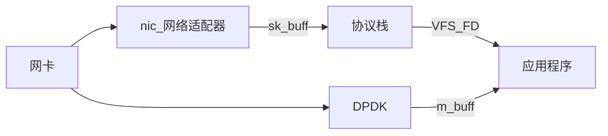

# 数据结构与算法

## 磁盘存储链式的B树与B+树

### 内存与磁盘

|              | SRAM     | DRAM     | SSD      | HDD                 |
| ------------ | -------- | -------- | -------- | ------------------- |
| 存储信息     | 触发器   | 电容     | 闪存芯片 | 磁盘 (机器臂磁头读) |
| 破坏性读出   | 非       | 是       |          |                     |
| 需要刷新     | **不要** | 需要     |          |                     |
| 送行列地址   | 同时送   | 分两次送 |          |                     |
| 运行速度     | **快**   | 慢       |          |                     |
| 集成度       | 低       | 高       |          |                     |
| 发热量       | 大       | **小**   |          |                     |
| 存储成本     | 高       | **中**   | 较低     | 极低                |
| 断电数据丢失 | 是       | 是       | **否**   | **否**              |

比较

|          | 寄存器、缓存                                 | 内存                                                         | 磁盘-机械                                                    | 磁盘-固态                                                    |
| -------- | -------------------------------------------- | ------------------------------------------------------------ | ------------------------------------------------------------ | ------------------------------------------------------------ |
| 速度     | 超快                                         | 快                                                           | 很慢                                                         | 慢                                                           |
| 实现细节 | **SRAM**、静态随机存储器 断电会数据丢失 | **DRAM**、动态随机存储器 断电/不刷新电路会数据丢失      | **HDD** 机械臂和旋转磁盘 慢在物理移动的寻址 断电数据不丢失 | **SSD** 闪存芯片、顺序访问 断电数据不丢失               |
| 适合结构 | (同内存)                                     | 红黑树 重要的是减少IO、比较、交换等。 而非寻址次数 | B/B+树 重要的是减少寻址次数，降低树的层高 而且范围查询更好 | 红黑树速率可能更高 但B+树有范围查询， 看具体场景选用 |

GPT4

> - 内存（DRAM）：存储需要尽量减少比较、交换等次数，而非寻址次数。适合红黑树、二叉树。
> - 机械硬盘：存储需要的是减少寻址次数（很慢，需要机械活动）。适合B+树。（机械的顺序是随机的几百倍左右）
>
> 但我存在以下疑问：
>
> - 内存的寻址成本也大吧（cache miss、段页式转换等），随机读写肯定也比顺序要慢，只是可能没机器相差那么夸张吗？或者说比起比较和内存操作来说，寻址的成本没那么高？
> - 固态硬盘呢？固态的的随机存储性能原理是怎么样的？（固态硬盘顺序仍能到达随机的10倍左右）B+树在固态中的地位会不会没有像在机器硬盘中那么明显？是否在固态硬盘中，红黑树等类型也会相当不错甚至优于机器硬盘？
>
> 答
>
> - 内存（DRAM）
>   - 虽然寻址成本存在（比如缓存未命中、段页式转换等），但是相比于机械硬盘，这些成本相对较小。内存的寻址速度非常快，而且内存的随机访问和顺序访问的**速度差异相对较小**。因此，对于内存来说，更重要的是减少比较、交换等操作的次数，这就是为什么像红黑树这样的平衡搜索树在内存中使用更为广泛。
> - 对于固态硬盘（SSD）来说，它的工作方式与机械硬盘有很大的不同。机械硬盘的读写速度受到**物理因素（如磁头移动）的限制**，因此寻址成本很高。而固态硬盘则是基于**闪存**技术，没有机械部件，因此寻址成本相对较低，随机访问和顺序访问的速度差异也小于机械硬盘。
>   - 但是，固态硬盘的写入操作有一定的寿命限制，因此需要通过一些策略（如写入平衡）来延长其使用寿命。（通常会尽量将数据写入到相同的闪存块）
>   - B+树在固态硬盘中的效果可能不如在机械硬盘中明显，但是由于其高效的**范围查询**能力，仍然被广泛使用。红黑树等平衡搜索树在固态硬盘中的效果可能会比在机械硬盘中更好，因为固态硬盘的随机访问性能更好。
>   - 对于数据结构的选择，B+树在SSD中的地位仍然是非常重要的。这是因为B+树的设计在顺序读写方面非常优秀，能够充分利用SSD的性能。尽管红黑树等平衡二叉树在内存中的性能很好，但在硬盘存储中，尤其是在SSD中，由于其随机读写的特性，性能可能并不理想。当然，这也取决于具体的应用情况，某些特定的应用可能会有不同的最优数据结构。
>
> 总的来说，选择哪种数据结构，需要根据具体的应用场景和存储设备的特性来决定。例如：
>
> - 如果需要频繁进行大范围的查询，可能会选择B+树
> - 如果需要频繁进行小范围的查询和更新，可能会选择红黑树

### B/B+树

B树可以是多叉树（没定义多少叉）。一棵M阶B树，满足以下条件：

1. 每个结点至多拥有M颗子树，根结占至少拥有两颗子树
2. 除了根节点以外，其全每个分支结点至少拥有M/2棵子树
3. **所有的叶结点都在同一层上**
4. 有k棵子树的分支结点则存在k-1个关键字，关键字按照递增顺序进行排序
   （技巧：k-1是因为是按空隙插的，建议M/分叉数选偶数，关键字会是奇数，便于选择最中间的一个节点，便于分裂）
5. 关键字数量满足 $ceil(M/2)-1<= n<= M-1$

两层 1024叉 x 4K = (1024 \* 1024)个叶子 \* 4K = 4G存储

## 红黑树

### 三种应用场景

#### epoll - 底层的红黑树实现

检测IO是否就绪（需要注意：epoll不是仅网络的，是文件系统，文件IO。他的源码是放在 `linux-4.4.240/fs/eventpoll.c` 里的）

这个场景为有哪些数据可选？

- 多层hash
  - 存储空间：FD少时，内存占用大
  - 查找性能：层数加长度 $\log(D+L)$，不一定比红黑树快，寻址较少
- 红黑树
  - 存储空间：FD少时，占用较小。占用为线性
  - 查找性能：$\log(D)$
  - 场景：
    - 数量不确定
    - ……
- 数组
- b/b+树

为什么最后选择了红黑树？

- 查找
- 对数两不确定
- KV存储

##### epoll 实现

（找老师要pdf）

#### sk_buf - 红黑树使用

##### sk_buff 实现

sk_buff结构体：双链表、时间戳、红黑树

#### 内存块 - 红黑树组织

描述一块内存

- start & end
- start & len

红黑树用start当key，block为存储

#### 其他

- 定时器：fd与信息映射
- 消息队列：订阅
- 流控
- ……等等

### 原理

红黑树，一般不用自己写，懂原理就行，极少情况才会让你手写。

## hash

hash在后端开发不同阶段的妙用

1. STL中hash的应用
2. hash在数据库中应用
3. 反向代理中的负载均衡
4. 性能优化利器 - 布隆过滤器
5. 缓存横向扩展 - 分布式一致性hash

hash两大应用特征：

- 映射关系
- 强随机分布性

两用

- 分布性hash
- 一致性hash

### STL与算法

- #### STL

  - unordered_*
    - unordered_map
    - unordered_set
    - ……
  - 与红黑树比较
    - ……

- #### 算法

  - 设计类
    - 拆分
    - 利用hash特性（映射关系、强随机分布性）
  - 确定某个字符是否出现过
    - 最长不重复出现字符的子字符串。
      方法：例如 “abbcd” -> "bcd"，滑动窗口 (错位同向双指针) +hash (hash主要是128长度存储每个ascii码上次在滑动窗口内出现的位置)

### 数据库

- #### redis

- #### mysql

  - B+
    - 聚集索引B+树
    - 辅助索引B+树
  - 自适应的hash索引
    - 等值查询
    - 通过缓存池的B+树页
    - innodb存储引擎自动根据访问频次以及模式来为某些页构建哈希索引

### hashtable

- #### 组成

  - hash函数
  - 数组
  - 运算：$hash(key)\% size=index$

- #### hash

  - 映射关系
  - 强随机分布性
  - 选择
    - siphash| 因为redis的key通常是有规律的| role:id
    - murmurhash2、city

- #### 冲突

  - 冲突的原因| 抽屉
  - 负载因子| used/size
  - 解决冲突
    - 合理范围内 (负载因子0-1)
      - 链表法
      - 最小堆、红黑树、跳表
    - 超出合理范围
      - 扩容
      - 缩容

### 反向代理中的负载均衡

分布式api网关 - nginx

请求

- 有状态的
- 无状态的

鉴权的功能

把ip进行hash：hash有映射关系和强随机分布性两个大特征，这里利用了映射关系（可以用二元组、五元组、六元组来做hash）

### 性能优化

负载均衡、缓存

- MySQL。提升访问MySQL访问性能。根据 “读多写少 or 写多读少”，来修改MySQL代码
  - 写多读少（确保数据正确的落盘）
    - MyCat
    - 分布式关系型数据库
  - 读多写少（读大于写10倍以上）
    - 布隆过滤器
      - 缓存MsySQL已经存在的缓存。MySQL有自带的自适应hash缓存，但那个需要是自动的非自定义的，如果是 “预约” 式提前缓存就不行了
      - 判断MySQL是否包含。如果不包含，直接返回。如果包含，先访问缓存数据库，如果还没有再访问MySQL
    - memcached、redis缓存
    - 缓存穿透（黑客可能会有缓存穿透攻击）
- 存储的时候（rocksdb）
  - 数据存储在内存和磁盘当中
  - 如何查询k对应的v
  - 先在内存中查询，然后去查询布隆过滤器，通过则在磁盘中查询

### 布隆过滤器

- 组成 / 实现

  - 位图

  - 多个hash函数

  - $hash(key)\%size=inde$

  - bitmap[index]=1
  - 位图+多个hash函数。如果看新请求的多个hash后的位图的1位，是否有一个为0，若有，则不在缓存当中

- 作用

  - 能确定某个key一定不存在
  - 概率确定某个key存在
  - 局限/缺点：**不能删除**数据（可增或不变）

- 应用

  - 参数
    - n：预测往布隆过滤器存储多少元素
    - p：误判率
    - m：位图的大小
    - k：哈希函数的个数
  - 根据 n 和 p 确定 m 和 k
  - bool constain(key)
  - void insert(key)

### 横向扩展（分布一致性hash）

- 计算型横向扩展
- 存储型横向扩展

