# Markdown

# 目录

[toc]

# 数学公式 LaTeX

网站工具：https://latex.codecogs.com/eqneditor/editor.php

## 数学公式 LaTeX

$$换行使用

==行内数学公式：Typora要在偏好设置里开启`内联公式`（建议同时开启上标、下标、高亮）==

### 基本算式

| 作用       | 符号        | 算式                                                         | markdown                                                     |
| ---------- | ----------- | ------------------------------------------------------------ | ------------------------------------------------------------ |
| 分数       | \frac       | $\frac{7x+5}{1+y^2}$                                         | \frac{7x+5}{1+y^2}                                           |
| 下标       | _           | $z=z_l$                                                      | z=z_l                                                        |
| 上标、求方 | ^           | $\frac{1}{i^2}$                                              | \frac{1}{i^2}                                                |
| 开方       |             | $\sqrt{2};\sqrt[n]{3}$                                       | \sqrt{2};\sqrt[n]{3}                                         |
| e求方      | e{}         | $\frac{d}{dx}e{ax}=ae{ax}\quad \sum_{i=1}^{n}{(X_i - \overline{X})^2}$ | \frac{d}{dx}e{ax}=ae{ax}\quad \sum_{i=1}^{n}{(X_i - \overline{X})^2} |
| 顶线       | \overline   |                                                              |                                                              |
| 矢量       | \vec{}      | $\vec{a} \cdot \vec{b}=0$                                    | \vec{a} \cdot \vec{b}=0                                      |
| 点乘       | \cdot       | $\vec{a} \cdot \vec{b}=0$                                    | \vec{a} \cdot \vec{b}=0                                      |
| 省略号     | \cdots      | $\cdots$                                                     | \cdots                                                       |
| 积分       | \int        | $\int ^2_3 x^2 {\rm d}x$                                     | \int ^2_3 x^2 {\rm d}x                                       |
| 微元符号   | {\rm d}     | $\int ^2_3 x^2 {\rm d}x$                                     | \int ^2_3 x^2 {\rm d}x                                       |
| 求极限     | lim_        | $limn→+∞nlimn→+∞n  \lim_{n\rightarrow+\infty} n$             | limn→+∞nlimn→+∞n  \lim_{n\rightarrow+\infty} n               |
| 右箭头     | \rightarrow |                                                              |                                                              |
| 无限       | \infty      |                                                              |                                                              |
| 求和符号   | \sum        | $\sum \frac{1}{i^2}$                                         | \sum \frac{1}{i^2}                                           |
| 小于等于   | \leq        |                                                              |                                                              |
| 大于等于   | \leqslant   |                                                              |                                                              |

### 三角函数

|   算式   | markdown |
| :------: | :------: |
| $\sin a$ |   \sin   |

### 对数函数

|    算式     | markdown  |
| :---------: | :-------: |
|   $\ln15$   |   \ln15   |
| $\log_2 10$ | \log_2 10 |
|   $\lg 7$   |   \lg7    |

### 关系运算符

|    运算符    |  markdown  |
| :----------: | :--------: |
|  $\pm;\mp$   |  \pm;\mp   |
|   $\times$   |   \times   |
|    $\div$    |    \div    |
|    $\sum$    |    \sum    |
|   $\prod$    |   \prod    |
| $\neq;\not=$ | \neq;\not= |
| $\leq;\geq$  | \leq;\geq  |
|  $\bigcap$   |  \bigcap   |

### 希腊字母

|                         大写                          | markdown |                             小写                             |  markdown   |
| :---------------------------------------------------: | :------: | :----------------------------------------------------------: | :---------: |
|           |    A     |      |   \alpha    |
|           |    B     |        |    \beta    |
|    |  \Gamma  |      |   \gamma    |
|    |  \Delta  |      |   \delta    |
|           |    E     |  |  \epsilon   |
|                                                       |          |  | \varepsilon |
|           |    Z     |        |    \zeta    |
|    |  \Theta  |      |   \theta    |
|           |    I     |        |    \iota    |
|           |    K     |      |   \kappa    |
|   | \Lambda  |    |   \lambda   |
|           |    M     |            |     \mu     |
|           |    N     |            |     \nu     |
|       |   \Xi    |              |     \xi     |
|           |    O     |         |  \omicron   |
|       |   \Pi    |              |     \pi     |
|           |    P     |             |    \rho     |
|    |  \Sigma  |           |   \sigma    |
|           |    N     |              |     \nu     |
|           |    T     |             |    \tau     |
|  | \Upsilon |         |  \upsilon   |
|      |   \Phi   |             |    \phi     |
|                                                       |          |          |   \varphi   |
|           |    X     |             |    \chi     |
|      |   \Psi   |             |    \psi     |
|    |  \Omega  |           |   \omega    |

# Mermaid

参考：

- https://zhuanlan.zhihu.com/p/172635547
- Mermaid官网：https://mermaid-js.github.io/mermaid/#/

**Mermaid[1]** 是一种简单的类似 Markdown  的脚本语言，通过 JavaScript 编程语言，将文本转换为图片。因此，真正实现画图功能的并不是 Typora 本身，它只是内置了对 Mermaid 的支持。

## 打印版本

输入 `info` 就行（其实Typora里报错会直接显示版本，但在Obsidian不行）

```mermaid
info
```


## 流程图

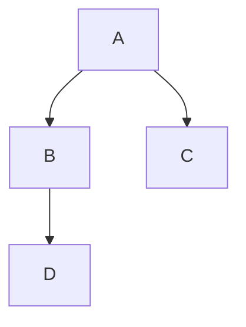

## 时序图

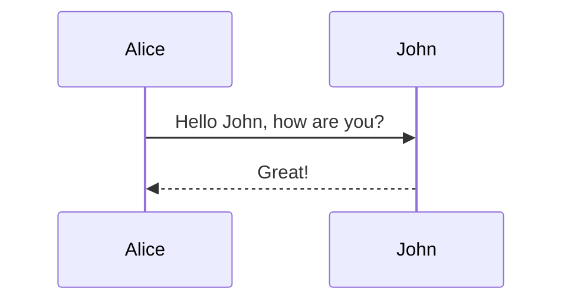

## 状态图


## 类图

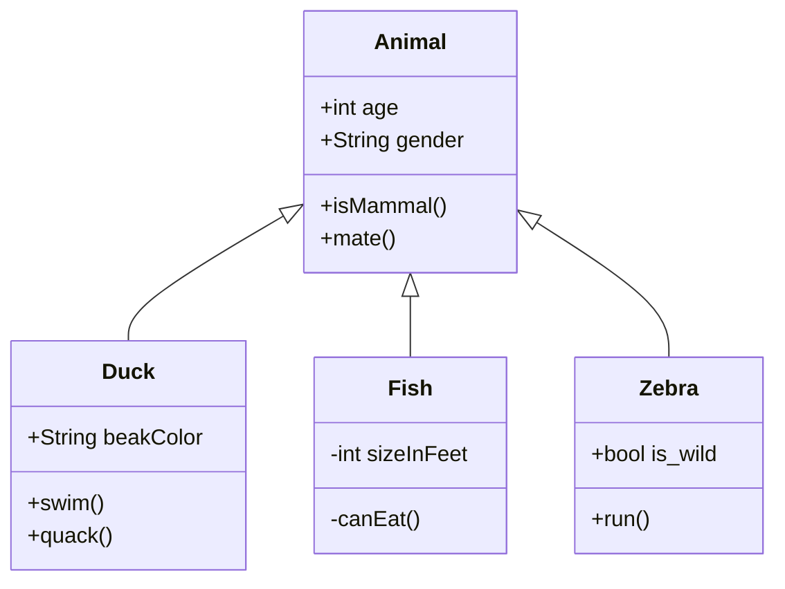


## 甘特图

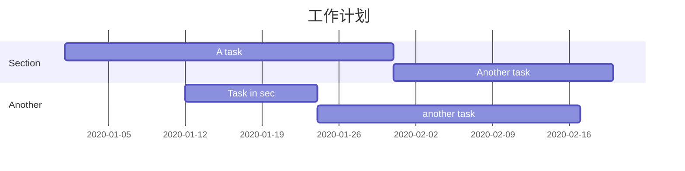

## 饼图

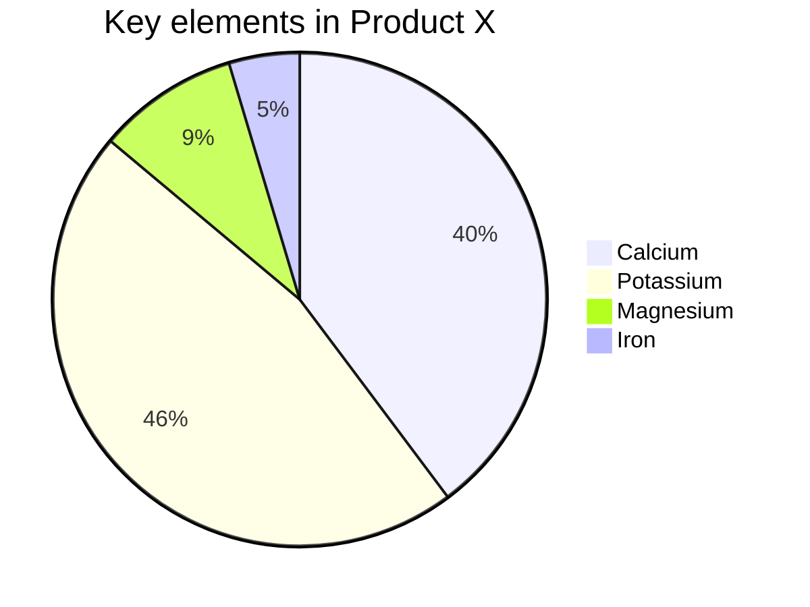

# ~~画流程图~~（旧版，新版见上）

详见Mermaid，不知道是不是更新了，早期好像不能画类图这种，现在很多类型了

## 流程图 - mermaid

### 方向

```
【T：Top，B：Bottom，R：Right，L：Left】
TB 从上到下
BT 从下到上（TD同TB）
LR 从左到右
RL 从右到左
```
示例
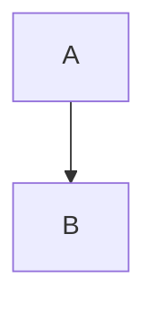
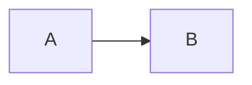

### 图形

```
id + [文字描述]矩形
id + (文字描述)圆角矩形
id + >文字描述]不对称的矩形
id + {文字描述}菱形
id + ((文字描述))圆形
```
效果
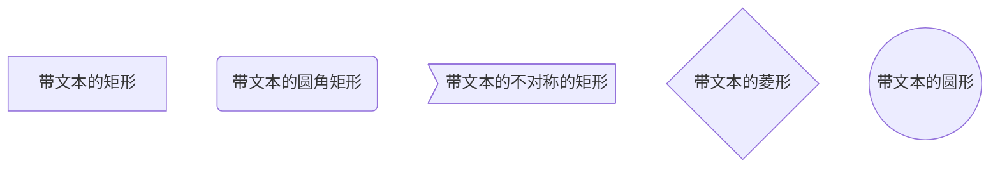

### 连接线与标注
```
A --> B A带箭头指向B
A --- B A不带箭头指向B
A -.- B A用虚线指向B
A -.-> B A用带箭头的虚线指向B
A ==> B A用加粗的箭头指向B
A -- 描述 --- B A不带箭头指向B并在中间加上文字描述
A -- 描述 --> B A带箭头指向B并在中间加上文字描述
A -. 描述 .-> B A用带箭头的虚线指向B并在中间加上文字描述
A == 描述 ==> B A用加粗的箭头指向B并在中间加上文字描述
```
效果
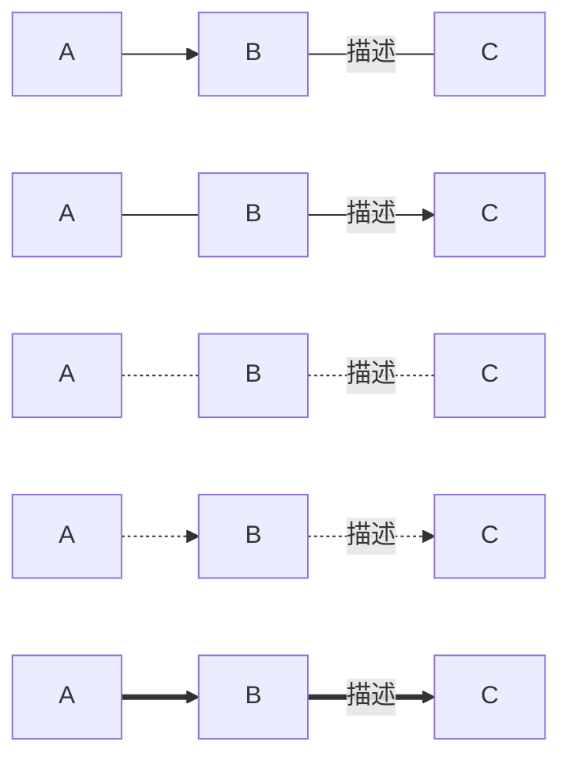

### 子流程图

```
subgraph title
    graph definition
end
```
效果
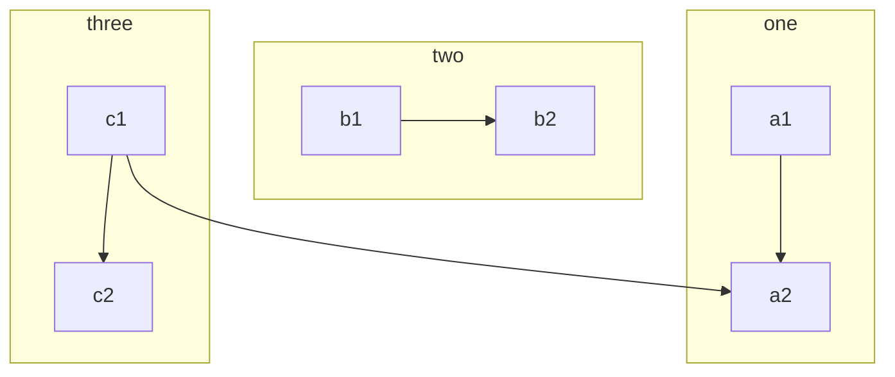

### 自定义样式

```
语法：style id 具体样式
```

效果

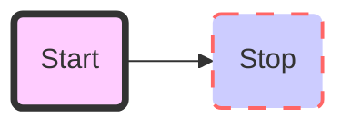

## 标准流程图 - flow

### 竖向

```flow
st=>start: 开始框
op=>operation: 处理框
cond=>condition: 判断框(是或否?)
sub1=>subroutine: 子流程
io=>inputoutput: 输入输出框
e=>end: 结束框

st->op->cond
cond(yes)->io->e
cond(no)->sub1(right)->op
```

### 横向

```flow
st=>start: 开始框
op=>operation: 处理框
cond=>condition: 判断框(是或否?)
sub1=>subroutine: 子流程
io=>inputoutput: 输入输出框
e=>end: 结束框

st(right)->op(right)->cond
cond(yes)->io(bottom)->e
cond(no)->sub1(right)->op
```

## UML时序图 - sequence

```sequence
title: 我是标题
participant A
participant B
A-B:实线：主动发送信息，如request请求
A--B:虚线：表示返回信息
A->B:实心箭头：同步消息，如Ajax同步请求
A-->>B:非实心箭头：异步消息，如Ajax请求
```

实例（部分）

``` sequence
participant 客户端
participant 控制器
participant 业务
participant 数据库

客户端->控制器:提交数据店铺
Note right of 客户端:提交数据javascript进行验证
控制器->控制器:验证数据完整性
Note left of 控制器:返回错误的字段信息
控制器-->客户端:数据不完整
控制器->业务:保存店铺到数据库
```

# UML图在线渲染 —— plantUML by Gravize

# HTML相关

## CVG画函数图像

### SVG生成方法

首先用`Mathematica`/`Matlab`绘图并导出 SVG

```mathematica
Plot[Sin[x], {x, -4, 4}, PlotPoints -> 2] Export["sin.svg", %] 
```

接下来使用 [svgo](https://github.com/svg/svgo) 做一下压缩：

```sh
svgo --pretty sin.svg
```

得到的代码直接复制进来即可

### 示例图像

<svg xmlns="http://www.w3.org/2000/svg" xmlns:xlink="http://www.w3.org/1999/xlink" width="480" height="223pt" viewBox="0 0 360 223">     <defs>         <symbol overflow="visible" id="a">             <path d="M5.29-2.191H.55v-.82h4.74zm0 0"/>         </symbol>         <symbol overflow="visible" id="b">             <path d="M3.234 0v-1.715H.125v-.805l3.27-4.636h.714v4.636h.97v.805h-.97V0zm0-2.52v-3.226L.992-2.52zm0 0"/>         </symbol>         <symbol overflow="visible" id="c">             <path d="M5.035-.844V0H.305a1.54 1.54 0 01.101-.61c.121-.324.313-.64.578-.953.266-.312.649-.671 1.149-1.085.777-.637 1.304-1.141 1.578-1.516.273-.371.41-.723.41-1.055 0-.347-.125-.644-.375-.883-.246-.238-.574-.359-.973-.359-.421 0-.761.129-1.015.383-.254.254-.383.605-.387 1.055L.47-5.117c.062-.672.293-1.188.699-1.54.402-.355.945-.53 1.625-.53.687 0 1.23.19 1.629.57.402.383.601.855.601 1.418 0 .285-.058.566-.175.844-.118.277-.313.566-.582.875-.274.304-.723.726-1.356 1.257-.527.442-.867.743-1.015.903a2.868 2.868 0 00-.372.476zm0 0"/>         </symbol>         <symbol overflow="visible" id="d">             <path d="M3.727 0h-.88v-5.602c-.21.204-.488.407-.831.606a5.902 5.902 0 01-.926.457v-.852c.492-.23.922-.511 1.289-.84.367-.328.629-.648.781-.957h.567zm0 0"/>         </symbol>         <symbol overflow="visible" id="e">             <path d="M.906 0v-1H1.91v1zm0 0"/>         </symbol>         <symbol overflow="visible" id="f">             <path d="M.414-3.531c0-.844.09-1.528.262-2.043.176-.516.433-.914.777-1.192.344-.28.774-.421 1.297-.421.383 0 .719.078 1.008.23.289.156.531.379.719.672.187.289.335.644.445 1.062.11.418.16.985.16 1.692 0 .84-.086 1.52-.258 2.035-.172.516-.43.914-.773 1.195-.344.281-.778.422-1.301.422-.691 0-1.234-.246-1.625-.742-.473-.594-.71-1.567-.71-2.91zm.906 0c0 1.176.137 1.957.41 2.347.278.387.614.582 1.02.582.402 0 .742-.195 1.016-.586.277-.39.414-1.171.414-2.343 0-1.18-.137-1.961-.414-2.348-.274-.387-.618-.582-1.028-.582-.402 0-.726.172-.965.516-.304.433-.453 1.238-.453 2.414zm0 0"/>         </symbol>         <symbol overflow="visible" id="g">             <path d="M.414-1.875l.922-.078c.07.45.23.785.476 1.012.25.226.551.34.903.34.422 0 .781-.16 1.074-.477.293-.32.438-.742.438-1.27 0-.504-.141-.898-.422-1.187-.282-.29-.649-.434-1.106-.434a1.526 1.526 0 00-1.3.692L.57-3.383l.696-3.68h3.558v.844H1.97l-.387 1.922c.43-.3.879-.45 1.352-.45a2.14 2.14 0 011.582.65c.43.433.644.992.644 1.671 0 .649-.187 1.207-.566 1.68-.457.578-1.086.867-1.88.867-.651 0-1.183-.18-1.593-.547-.41-.363-.648-.847-.707-1.449zm0 0"/>         </symbol>     </defs>     <path d="M7.66 35.668l5.371 8.715 5.367 9.754L23.77 64.78l5.37 11.371 5.372 11.914 5.367 12.274L50.62 125.2l5.371 12.198 5.367 11.786 5.371 11.195 5.372 10.426 5.367 9.492 5.37 8.414 5.372 7.203 5.371 5.883 5.367 4.465 5.371 2.98 5.371 1.453 5.368-.105 5.37-1.656 5.372-3.18 5.37-4.66 5.368-6.063 5.371-7.37 5.371-8.567 5.367-9.625 5.372-10.535 5.37-11.286 5.372-11.851 10.738-24.668 5.371-12.434 5.367-12.234 5.371-11.856 5.371-11.28 5.372-10.536 5.367-9.629 5.37-8.566 5.372-7.371 5.367-6.063 5.371-4.656 5.371-3.184 5.371-1.652 5.368-.105 5.37 1.449 5.372 2.984 5.367 4.465 5.371 5.879 5.371 7.203 5.371 8.418 5.367 9.492 5.372 10.426 5.37 11.191 10.739 23.985 5.371 12.418 5.371 12.441 5.367 12.277 5.371 11.914 5.371 11.368 5.372 10.644 5.367 9.758 5.37 8.715" fill="none" stroke-width="1.6" stroke-linecap="square" stroke="#5e81b5" stroke-miterlimit="3.25"/>     <path d="M7.66 111.129v-4" fill="none" stroke-width=".2" stroke="#666" stroke-miterlimit="3.25"/>     <use xlink:href="#a" x="1.66" y="123.128" fill="#666"/>     <use xlink:href="#b" x="7.66" y="123.128" fill="#666"/>     <path d="M29.14 111.129v-2.402M50.621 111.129v-2.402M72.102 111.129v-2.402M93.578 111.129v-4" fill="none" stroke-width=".2" stroke="#666" stroke-miterlimit="3.25"/>     <use xlink:href="#a" x="87.58" y="123.128" fill="#666"/>     <use xlink:href="#c" x="93.58" y="123.128" fill="#666"/>     <path d="M115.059 111.129v-2.402M136.54 111.129v-2.402M158.02 111.129v-2.402M179.5 111.129v-4M200.98 111.129v-2.402M222.46 111.129v-2.402M243.941 111.129v-2.402M265.422 111.129v-4" fill="none" stroke-width=".2" stroke="#666" stroke-miterlimit="3.25"/>     <use xlink:href="#c" x="262.42" y="123.128" fill="#666"/>     <path d="M286.898 111.129v-2.402M308.379 111.129v-2.402M329.86 111.129v-2.402M351.34 111.129v-4" fill="none" stroke-width=".2" stroke="#666" stroke-miterlimit="3.25"/>     <use xlink:href="#b" x="348.34" y="123.128" fill="#666"/>     <path d="M.5 111.129h358M179.5 220.813h2.398M179.5 210.84h4" fill="none" stroke-width=".2" stroke="#666" stroke-miterlimit="3.25"/>     <use xlink:href="#a" x="156.5" y="213.34" fill="#666"/>     <g fill="#666">         <use xlink:href="#d" x="162.5" y="213.34"/>         <use xlink:href="#e" x="168.062" y="213.34"/>         <use xlink:href="#f" x="170.84" y="213.34"/>     </g>     <path d="M179.5 200.867h2.398M179.5 190.898h2.398M179.5 180.926h2.398M179.5 170.957h2.398M179.5 160.984h4" fill="none" stroke-width=".2" stroke="#666" stroke-miterlimit="3.25"/>     <use xlink:href="#a" x="156.5" y="163.484" fill="#666"/>     <g fill="#666">         <use xlink:href="#f" x="162.5" y="163.484"/>         <use xlink:href="#e" x="168.062" y="163.484"/>         <use xlink:href="#g" x="170.84" y="163.484"/>     </g>     <path d="M179.5 151.012h2.398M179.5 141.043h2.398M179.5 131.07h2.398M179.5 121.098h2.398M179.5 111.129h4M179.5 101.156h2.398M179.5 91.188h2.398M179.5 81.215h2.398M179.5 71.242h2.398M179.5 61.273h4" fill="none" stroke-width=".2" stroke="#666" stroke-miterlimit="3.25"/>     <g fill="#666">         <use xlink:href="#f" x="162.5" y="63.772"/>         <use xlink:href="#e" x="168.062" y="63.772"/>         <use xlink:href="#g" x="170.84" y="63.772"/>     </g>     <path d="M179.5 51.3h2.398M179.5 41.328h2.398M179.5 31.36h2.398M179.5 21.387h2.398M179.5 11.418h4" fill="none" stroke-width=".2" stroke="#666" stroke-miterlimit="3.25"/>     <g fill="#666">         <use xlink:href="#d" x="162.5" y="13.916"/>         <use xlink:href="#e" x="168.062" y="13.916"/>         <use xlink:href="#f" x="170.84" y="13.916"/>     </g>     <path d="M179.5 1.445h2.398M179.5 221.758V.5" fill="none" stroke-width=".2" stroke="#666" stroke-miterlimit="3.25"/> </svg>

## R代码画图（Rmarkdown软件）

可以直接把R代码和执行结果复制进文档里

# CSS拓展

## 自定义CSS样式方法

### 创建base.user.css

### 主题文件配置

文件 > 偏好设置 > 打开主题文件夹 > 将CSS文件放到打开的目录中 > 重启Typora

## 自动编号功能

### 版本1

```css
/* 正文标题区: #write */
/* [TOC]目录树区: .md-toc-content */
/* 侧边栏的目录大纲区: .sidebar-content */

/** 
 * 说明：
 *     Typora的标题共有6级，从h1到h6。
 *     我个人觉得h1级的标题太大，所以我的标题都是从h2级开始。
 *     个人习惯每篇文章都有一个总标题，有一个目录，所以h2级的标题前两个都不会计数。
 *     一般情况下，我虽然不使用h1级的标题，但是为了以防万一，h1级的标题前两个也都不会计数。
 *     若想启用h1级标题，就取消包含“content: counter(h1) "."”项的注释，然后将包含“content: counter(h2) "."”的项注释掉即可。
 */ 
/** initialize css counter */
#write, .sidebar-content,.md-toc-content{
	/* 设置全局计数器的基准 */
	/* 因为我喜欢从h2级标题用起，所以这里设置为h2 */
    counter-reset: h2
}

#write h1, .outline-h1, .md-toc-item.md-toc-h1 {
    counter-reset: h2
}

#write h2, .outline-h2, .md-toc-item.md-toc-h2 {
    counter-reset: h3
}

#write h3, .outline-h3, .md-toc-item.md-toc-h3 {
    counter-reset: h4
}

#write h4, .outline-h4, .md-toc-item.md-toc-h4 {
    counter-reset: h5
}

#write h5, .outline-h5, .md-toc-item.md-toc-h5 {
    counter-reset: h6
}

/** put counter result into headings */
#write h1:before,
.outline-h1>.outline-item>.outline-label:before,
.md-toc-item.md-toc-h1>.md-toc-inner:before {
    counter-increment: h1;
    content: counter(h1) ". "
}

/* 使用h1标题时，去掉前两个h1标题的序号，包括正文标题、目录树和大纲 */
/* nth-of-type中的数字表示获取第几个h1元素，请根据情况自行修改。 */
#write h1:nth-of-type(1):before,
.outline-h1:nth-of-type(1)>.outline-item>.outline-label:before,
.md-toc-item.md-toc-h1:nth-of-type(1)>.md-toc-inner:before,
#write h1:nth-of-type(2):before,
.outline-h1:nth-of-type(2)>.outline-item>.outline-label:before,
.md-toc-item.md-toc-h1:nth-of-type(2)>.md-toc-inner:before{
	counter-reset: h1;
	content: ""
}

#write h2:before,
.outline-h2>.outline-item>.outline-label:before,
.md-toc-item.md-toc-h2>.md-toc-inner:before {
    counter-increment: h2;
    content: counter(h2) ". "
}

/* 使用h2标题时，去掉前两个h2标题的序号，包括正文标题、目录树和大纲 */
/* nth-of-type中的数字表示获取第几个h2元素，请根据情况自行修改。 */
#write h2:nth-of-type(1):before,
.outline-h2:nth-of-type(1)>.outline-item>.outline-label:before,
.md-toc-item.md-toc-h2:nth-of-type(1)>.md-toc-inner:before,
#write h2:nth-of-type(2):before,
.outline-h2:nth-of-type(2)>.outline-item>.outline-label:before,
.md-toc-item.md-toc-h2:nth-of-type(2)>.md-toc-inner:before{
	counter-reset: h2;
	content: ""
}

#write h3:before,
h3.md-focus.md-heading:before, /** override the default style for focused headings */
.outline-h3>.outline-item>.outline-label:before,
.md-toc-item.md-toc-h3>.md-toc-inner:before {
	text-decoration: none;
    counter-increment: h3;
    /* content: counter(h1) "." counter(h2) "." counter(h3) ". " */
    content: counter(h2) "." counter(h3) ". "
}

#write h4:before,
h4.md-focus.md-heading:before,
.outline-h4>.outline-item>.outline-label:before,
.md-toc-item.md-toc-h4>.md-toc-inner:before {
	text-decoration: none;
    counter-increment: h4;
    /* content: counter(h1) "." counter(h2) "." counter(h3) "." counter(h4) ". " */
    content: counter(h2) "." counter(h3) "." counter(h4) ". "
}

#write h5:before,
h5.md-focus.md-heading:before,
.outline-h5>.outline-item>.outline-label:before,
.md-toc-item.md-toc-h5>.md-toc-inner:before {
	text-decoration: none;
    counter-increment: h5;
    /* content: counter(h1) "." counter(h2) "." counter(h3) "." counter(h4) "." counter(h5) ". " */
    content: counter(h2) "." counter(h3) "." counter(h4) "." counter(h5) ". "
}

#write h6:before,
h6.md-focus.md-heading:before,
.outline-h6>.outline-item>.outline-label:before,
.md-toc-item.md-toc-h6>.md-toc-inner:before {
	text-decoration: none;
    counter-increment: h6;
    /* content: counter(h1) "." counter(h2) "." counter(h3) "." counter(h4) "." counter(h5) "." counter(h6) ". " */
    content: counter(h2) "." counter(h3) "." counter(h4) "." counter(h5) "." counter(h6) ". "
}

/** override the default style for focused headings */
#write>h3.md-focus:before,
#write>h4.md-focus:before,
#write>h5.md-focus:before,
#write>h6.md-focus:before,
h3.md-focus:before,
h4.md-focus:before,
h5.md-focus:before,
h6.md-focus:before {
    color: inherit;
    border: inherit;
    border-radius: inherit;
    position: inherit;
    left:initial;
    float: none;
    top:initial;
    font-size: inherit;
    padding-left: inherit;
    padding-right: inherit;
    vertical-align: inherit;
    font-weight: inherit;
    line-height: inherit;
}
```

### 版本2

```
/** initialize css counter */
#write {
counter-reset: h1
}
h1 {
counter-reset: h2
}
h2 {
counter-reset: h3
}
h3 {
counter-reset: h4
}
h4 {
counter-reset: h5
}
h5 {
counter-reset: h6
}
/** put counter result into headings */
#write h1:before {
counter-increment: h1;
content: counter(h1) ". "
}
#write h2:before {
counter-increment: h2;
content: counter(h1) "." counter(h2) ". "
}
#write h3:before,
h3.md-focus.md-heading:before /** override the default style for focused headings */ {
counter-increment: h3;
content: counter(h1) "." counter(h2) "." counter(h3) ". "
}
#write h4:before,
h4.md-focus.md-heading:before {
counter-increment: h4;
content: counter(h1) "." counter(h2) "." counter(h3) "." counter(h4) ". "
}
#write h5:before,
h5.md-focus.md-heading:before {
counter-increment: h5;
content: counter(h1) "." counter(h2) "." counter(h3) "." counter(h4) "." counter(h5) ". "}
#write h6:before,
h6.md-focus.md-heading:before {
counter-increment: h6;
content: counter(h1) "." counter(h2) "." counter(h3) "." counter(h4) "." counter(h5) "." counter(h6) ".
"}
/** override the default style for focused headings */
#write>h3.md-focus:before,
#write>h4.md-focus:before,
#write>h5.md-focus:before,
#write>h6.md-focus:before,
h3.md-focus:before,
h4.md-focus:before,
h5.md-focus:before,
h6.md-focus:before {
color: inherit;
border: inherit;
border-radius: inherit;
position: inherit;
left:initial;
float: none;
top:initial;
font-size: inherit;
padding-left: inherit;
padding-right: inherit;
vertical-align: inherit;
font-weight: inherit;
line-height: inherit;
}
```

## MyDiyCSS

- 在该.md文件的文件夹下有备份的css文件
- 在md文件夹下也有

# 仿mermaid流程图即时解析画UML新方案

比如

```
graph TB

class Moveable（接口） A
	move()
class Car（类） B
	move()
class Car2（代理类） C
	super.move()
class Car3（代理类） D
	car.move()
	
B t--实现--> A l--实现--> D
B --组合--r> D
C t--继承--r> B
```

注意：空格是重要关键字

# 代码块语法高亮原理和自定义风格

CodeMirror
