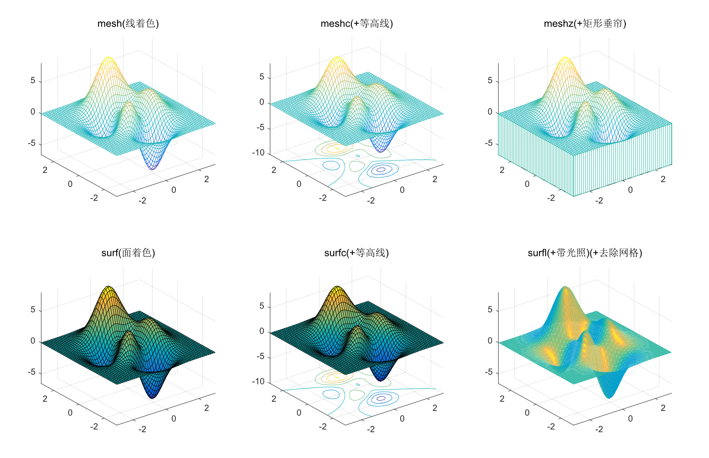

# Matlab

# 目录

[TOC]

# 软件

## 软件

内核与python，c，c++同

工作区：中间命令行窗口，右上工作区存储变量，右下命令历史结果记录

上方的+可以快速新建脚本、函数、类

> **这里没数组，有矩阵，起始不是0而是1！**

## 命令行

### 常用命令

- `clc`/`右键 > 清理命令行窗口`清理命令行窗口
- `close all`关闭所有绘图窗口并清除图形（能清除`hold on`前的图形）
- `clear all`清除所有缓存的变量
- `方向键上`重复输入历史命令
- `方向键上 + Ctrl/Shift选择`重复输入多条历史命令
- `tab`方法提示（编辑器同）

### 彩蛋

> #### 输入

- `why`						回答

> #### 二维画图类

- `logo`						logo
- `spy`						狗
- `image`					图像

> #### 三维画图类

- `membrane`		  三维logo
- `cplxdemo`			螺旋
- `vibes`					噪波？
- `cruller`				 莫比乌斯环

> #### 三维模型类

- `penny`				  硬币
- `kont`   				  max异形结
- `teapotdemo`	   茶壶！！
- `earthmap`		   地球

> #### 模拟类

- `life`		       	 生命游戏
- `travel`   			旅行商问题
- `truss`	  	  	 弯曲桁架
- `lorenz`	      	洛伦兹吸引子
- `xpbombs`		    扫雷
- `ric_gui`			电路及图像模拟 

## 编辑器

- `tab`方法提示。但很难用

## 调试相关

- `查看数据属性`：双击右上角工作区中的缓存变量可以查看属性，如数据的属性

- `查看对象属性`：双击右上角工作区中的缓存变量可以查看属性，如对象（线、点等）的属性

# MATLAB语言

## 学习

- B站：正月点灯笼
- 不知道哪来的MATLAB文档：https://www.mathworks.com
- 中文文档：https://ww2.mathworks.cn/help/matlab/ref/legend.html#d120e650336

## 语言与特性

不用定义变量类型（和py相似）

## 环境、项目与文件、导包

### 自带模块——绘图

绘图函数【这个也可以直接点绘图菜单来选择】

#### 画图

**可通过软件的绘图菜单查看各种图的绘制函数的用法**

符号注：

> `x, y, z`均表示一维矩阵，且长度相同
>
> `X, Y, Z`均表示二维矩阵，且尺度相同

曲线图

```matlab
bar(x,y)				% 二维柱状图
plot(x,y) 				% 二维曲线图（其实是折线图，下同）
plot([0.5,0.5],[0,1]); 	% 二维曲线图——画竖直线方法
plot3(x,y,z) 			% 三维曲线图（使用工具菜单能旋转视图！）
% 把x和y从一维矩阵变为二维，从而可以计算平面上所有点所对应的z值
```

曲面图

```matlab
[X,Y] = meshgrid(x,y) 	% 一维数据生成二维数据，（X,Y）为自变量、表示平面上的所有点
mesh(X,Y,Z)				% 三维曲面图形（线着色）
surf(X,Y,Z) 			% 三维着色图形（面着色）
shading interp			% 去除曲面网格
```

极坐标

```matlab
polar(x,y); % xy分别是角和半径
```

#### 动画效果

```matlab
h = plot(...)
set(h,'XDate',X,'YDate',Y); 	% 重设x和y的值
drawnow; 						% 实时绘画
```

#### 多图绘制

连续绘图

```matlab
plot(x,y1,'green-o',x,y2,'black'); 	% 连续画线、一次性版本（与颜色标记）
hold on;hold off; 					% 连续画线、多次性版本（重新划线开关），也能用close all清除之前的图形
```

多窗口绘图

```matlab
figure(2) 									% 创建一个新的窗口，参数默认
figure('PropertyName',propertyvalue,...)	% 创建新窗口时设置属性，如figure('name', '窗口名')、窗口大小等等
```

分区绘图

```matlab
subplot(行数，列数，要画的序列); 			% 分区绘图
subplot(2,2,[3,4]); 				  % 分区绘图-合并分区绘图
```

#### 坐标轴相关

```matlab
axis equal; 					% x和y轴等同单位长度
axis tight;						% 紧凑（图形填满坐标空间）
axis([x1,x2,y1,y2]); 			% 坐标轴尺寸固定范围
grid on; grid off; 				% 打开和关闭图像背景网格
title(); 						% 标题
xlabel(); ylabel();zlabel('Z') 	% XYZ轴轴标

% 图例：详见https://ww2.mathworks.cn/help/matlab/ref/legend.html#d120e650336
```

#### 其他

```matlab
shading interp				% 去除曲面网格
```

### 常用模块

## 类型与方法

### 类型分类

- 数字
- 矩阵

### 一些常量

- `pi`
- `exp(1)`表示e^1，即e

### 数字变量

> #### 数字方法

- 加减乘除
- 平方
- 对数
    - `log()`，`log2()`、`log10()`，log()默认In
    - `log(a)/log(b)`，不能直接`logb(a)`
- 取余
    - `mod()`

> #### 逻辑方法

- 与或非
    - 与`&&`
    - 或
    - 非
- 比较
    - `~=`不等于（不是`!=`）

### 矩阵变量matrix与运算

> #### 定义

- 一维矩阵
    - `x = [1, 2, 3]`或`x = [1 2 3]`一个三维vector向量、一维矩阵，可用空格代替逗号
    - `x = 1:2:10`快速构造一维矩阵（`[start[:step]:stop]`不同于python的`range(start, stop[, step])`或`for`结构，很反人类）
    - `x = linspace(0,10,101)`快速构造一维矩阵（`linspace(start, stop[, 点个数=100])`）
- 二维矩阵
    - `x = [1, 2, 3; 4, 5, 6]`二维矩阵，用英文分号分隔
    - `[X,Y] = meshgrid(x,y)`一维矩阵构建为二维矩阵

> #### 矩阵方法

矩阵加法

`A*B`矩阵叉乘

`A.*B`矩阵点乘法（一般不用矩阵叉乘）

`A./B`矩阵点除

## 语法

### 基本

脚本

> 自己封装函数
>
> 分号可以让该行代码结果不显示

### 输入输出与获取

输入

```matlab
x = input('提示语句'); % 注意是单引号
```

输出

```matlab
格式化输出
    fprintf('%f+%f=%f\n',x,y,x+y) % 简写x+y也行，但不标准
    格式化符号：%f浮点，%g整数
自动换行输出
	disp(variable1,variable2);
```

### 流程控制

if条件判断

```matlab
if 条件
	% 代码1
elseif
	% 代码2
else
	% 代码3
end
```

switch条件判断【无需break？？？】

```matlab
switch 变量
	case 值1
		% 代码1
	case 值2
		% 代码2
end
```

while循环【用于控制循环的i又称为计数变量/计数器，counter】

```matlab
while 条件
	% 代码
end
```

for循环函数【有点类似于 `py` 的 `for in` 列表解析】

```matlab
for i=1:5 % 简写，等于1:1:5。或i=矩阵x也行
	% 函数
end
```

## 函数与封装

### 自定义函数

```matlab
function name()
end
```

辗转相除法不需要比大小！

### 自定义类

无

# 实例

> #### 三维曲线图——螺旋线

```matlab
close all;clear all;clc
z=linspace(0,10,101);
x=sin(z);y=cos(z);
plot3(x,y,z,'g','LineWidth',2) 		% 画线（绿色，LineWidth=2是线的宽度）
hold on 							% 连续绘画
plot3(x,y,z,'p','MarkerSize',10) 	% 画星星（蓝色，MarkerSize=10是星星标记的大小）
```


> #### 三维网格图（mesh&surf）

```matlab
[a,b,c]=peaks(50); 		% peaks(N)生成一个凹凸有致的曲面，每个数据均为50x50的矩阵（demo数据模板）
figure(2) 				% 打开新的窗口

% 分区绘图，subplot(行数，列数，要画的序列)
subplot(2,3,1);
mesh(a,b,c);axis tight;title('mesh(线着色)');
subplot(2,3,2);
meshc(a,b,c);axis tight;title('meshc(+等高线)');
subplot(2,3,3);
meshz(a,b,c);axis tight;title('meshz(+矩形垂帘)');
subplot(2,3,4);
surf(a,b,c);axis tight;title('surf(面着色)');
subplot(2,3,5);
surfc(a,b,c);axis tight;title('surfc(+等高线)');
subplot(2,3,6);
surfl(a,b,c);axis tight;title('surfl(+带光照)(+去除网格)');shading interp;
% shading interp; 去除曲面网格
```



> #### 三角夹逼&一阶等价无穷小

```matlab
% 基本变量与计算值
x0=pi/3.85;
Bx = sqrt(1/(1+(tan(x0)^2)));
By = Bx*tan(x0);
Dy = tan(x0);

% 全局设置
close all;hold on;
axis equal; 
axis tight;
axis([0,1,0,Dy]); % x1,x2,y1,y2
% plot('LineWidth',2)

% 绘制标注
text(1,0,'A','FontSize',15)
text(0,0,'O','FontSize',15)
text(0,1,'E','FontSize',15)
text(Bx,By,'B','FontSize',15)
text(Bx,0,'C','FontSize',15)
text(1,Dy,'D','FontSize',15)
text(1.02,Dy/2,'tan x','FontSize',12,'color','red')
text(Bx,By/2,'sin x','FontSize',12,'color','red')
text(0.9,0.5,'x','FontSize',12,'color','red')
text(Bx/2+1/2,By/2,'$2sin \frac{x}{2}$','interpreter','latex','FontSize',12,'color','red') % 使用LaTeX解释器
text(Bx/2,0.04,'cos x','FontSize',12)
text(Bx/2,By/2,'1','FontSize',12)
text(0.06,0.04,'x','FontSize',12)

% 绘制线
X = linspace(0,1,101);
Y = X*tan(x0);
Zero = linspace(0,0,101);
One = linspace(1,1,101);
OD = plot(X,Y);
OA = plot(X,Zero);
OE = plot(Zero,X);
AD = plot(One,linspace(0,tan(x0),101));
AB = plot(linspace(Bx,1),linspace(By,0));
BC = plot(linspace(Bx,Bx,101),linspace(0,By,101));

% 绘制线 - 极坐标
x = linspace(0,pi/2,101);
r = One;
AE = polar(x,r);
```


```matlab
% 全局变量
xmin = -pi/2;
xmax = -xmin;
ymin = -pi/2;
ymax = -ymin;

% 全局设置
close all;hold on;grid on;
axis equal; % 保护逆运算对称性
axis([xmin,xmax,ymin,ymax]);
plot([0,0],[ymin,ymax],'color','black');
plot([xmin,xmax],[0,0],'color','black');

% 绘制
x = linspace(xmin,xmax,101);
x2 = linspace(xmin+0.01,xmax-0.01,101);
y_x = plot(x,x,'DisplayName','x');
y_sin = plot(x,sin(x),'DisplayName','sin(x)');
y_tan = plot(x,tan(x2),'DisplayName','tan(x)');
y_atan = plot(x,atan(x),'DisplayName','arctanx','LineStyle','- -');
y_asin = plot(x,asin(x),'DisplayName','arcsinx','LineStyle','- -');
y_In = plot(x,log(1+x),'DisplayName','In(1+x)','LineStyle','- -');
y_e = plot(x,exp(x)-1,'DisplayName','e^x-1');

legend([y_x,y_sin,y_tan,y_atan,y_asin,y_In,y_e],'Location','northwest'); % 开启部分图例
```

颜色归纳版

```matlab
% 全局变量
xmin = -pi/2;
xmax = -xmin;
ymin = -pi/2;
ymax = -ymin;

% 全局设置
close all;hold on;grid on;
axis equal;  % 保护逆运算对称性
axis([xmin,xmax,ymin,ymax]);
plot([0,0],[ymin,ymax],'color','black');
plot([xmin,xmax],[0,0],'color','black');

% 绘制
x = linspace(xmin,xmax,101);
x2 = linspace(xmin+0.01,xmax-0.01,101);
y_x = plot(x,x,'DisplayName','x','color','r');
y_sin = plot(x,sin(x),'DisplayName','sin(x)','color','b');
y_tan = plot(x,tan(x2),'DisplayName','tan(x)','color','m');
y_atan = plot(x,atan(x),'DisplayName','arctanx','LineStyle','- -','color','m');
y_asin = plot(x,asin(x),'DisplayName','arcsinx','LineStyle','- -','color','b');
y_In = plot(x,log(1+x),'DisplayName','In(1+x)','LineStyle','- -','color','k');
y_e = plot(x,exp(x)-1,'DisplayName','e^x-1','color','k');

legend([y_x,y_sin,y_tan,y_atan,y_asin,y_In,y_e],'Location','northwest'); % 开启部分图例
```

> #### 二阶等价无穷小

```matlab
xmin = -pi;
xmax = -xmin;
ymin = -pi/8;
ymax = pi*15/8; % 长宽均为2pi
%
close all;hold on;grid on;
axis equal; % 保护逆运算对称性
axis([xmin,xmax,ymin,ymax]);
%
x = linspace(xmin,xmax,101);
plot(x,1/2*power(x,2),'DisplayName','x^2/2');
plot(x,1-cos(x),'DisplayName','1-cos(x)');
x1 = linspace(-1,xmax,1001);
plot(x1,x1-log(1+x1),'DisplayName','x-ln(1+x)'); % x>-1
plot(x,exp(x)-1-x,'DisplayName','e^x-1-x');
%
legend('show');
```


> #### 三阶等价无穷小

```matlab
close all;hold on;grid on;
subplot(1,3,1);hold on;grid on;title('低倍率放大(等比例)');
s = 1;
xmin = 0;
xmax = pi/2/s;
ymin = 0;
ymax = pi/2/s;
%
axis equal; % 保护逆运算对称性
axis([xmin,xmax,ymin,ymax]);
%
x = linspace(xmin,xmax,101);
plot(x,1/6*power(x,3),'DisplayName','x^3/6');
plot(x,x-sin(x),'DisplayName','x-sin(x)');
x1 = linspace(-1,1,501);
plot(x1,asin(x1)-x1,'DisplayName','arcsin(x)-x'); % -1<x<1

plot(x,power(x,3)/3,'DisplayName','x^3/3');
plot(x,x-atan(x),'DisplayName','x-arctan(x)');
xpi = linspace(-pi/2,pi/2,101);
plot(xpi,tan(xpi)-xpi,'DisplayName','tan(x)-x'); % -pi/2<x<pi/2
%
legend('show','Location','northwest');
%
%
%
%
subplot(1,3,2);hold on;grid on;title('低倍率放大（y轴拉伸2倍）');
xmin = 0;
xmax = pi/2;
ymin = 0;
ymax = pi/2/2;
%
% axis equal; % 保护逆运算对称性
axis([xmin,xmax,ymin,ymax]);
%
x = linspace(xmin,xmax,101);
plot(x,1/6*power(x,3),'DisplayName','x^3/6');
plot(x,x-sin(x),'DisplayName','x-sin(x)');
x1 = linspace(-1,1,501);
plot(x1,asin(x1)-x1,'DisplayName','arcsin(x)-x'); % -1<x<1
plot(x,power(x,3)/3,'DisplayName','x^3/3');
plot(x,x-atan(x),'DisplayName','x-arctan(x)');
xpi = linspace(-pi/2,pi/2,101);
plot(xpi,tan(xpi)-xpi,'DisplayName','tan(x)-x'); % -pi/2<x<pi/2
%
legend('show','Location','northwest');
%
%
%
%
subplot(1,3,3);hold on;grid on;title('高倍率放大（y轴拉伸40倍）');
xmin = 0;
xmax = pi/2/5;
ymin = 0;
ymax = pi/2/200;
%
% axis equal; % 保护逆运算对称性
axis([xmin,xmax,ymin,ymax]);
%
x = linspace(xmin,xmax,101);
plot(x,1/6*power(x,3),'DisplayName','x^3/6');
plot(x,x-sin(x),'DisplayName','x-sin(x)');
x1 = linspace(-1,1,501);
plot(x1,asin(x1)-x1,'DisplayName','arcsin(x)-x'); % -1<x<1
plot(x,power(x,3)/3,'DisplayName','x^3/3');
plot(x,x-atan(x),'DisplayName','x-arctan(x)');
xpi = linspace(-pi/2,pi/2,101);
plot(xpi,tan(xpi)-xpi,'DisplayName','tan(x)-x'); % -pi/2<x<pi/2
%
legend('show','Location','northwest');
```


> #### 其他

接受 颜色参量 的绘图函数中的 颜色参量 通常采用以下三种形式之一：

- （ 1 ）字符串。代表 plot 颜色或线型表中的一种颜色，比如， ’ r ‘ 代表红色； 

- （ 2 ）三个输入的行向量。它代表一个单独的 RGB 值，比如 [.25  .50  .75] ； 

- （ 3 ）矩阵。如果 颜色参量 是一个矩阵，其元素作了调整，并把它们用作当前颜色映象的下标。 

    函数 **pcolor** 可以用来显示一个颜色映象。例如：

    » n=32;

    » colormap(hsv(n))

    » pcolor([1:n+1;1:n+1] ’ )


