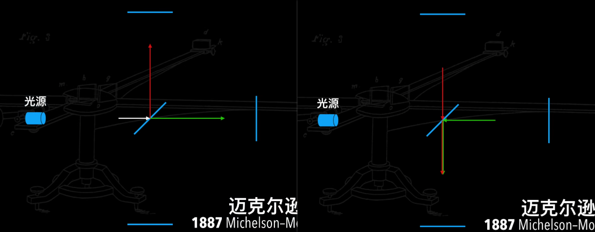

# 光速不变公设

## 光速不变根本就没有“证明”？

光速不变理论是相对论的两个公设之一（另一个是伽利略相对性原理），我个人更倾向于将其称为公设而不是理论

参考：

- https://www.bilibili.com/video/BV1hJ411P7Wi/

相对论现象：

- 因果速度
- 钟慢尺缩
- 相对质量

### 相对性原理 和 光速不变理论

### 明确边界、公设

首先要明确边界。可以用公设

#### 定义

公设/公理/前提假设

> "公设，就是指在某一特定的科学领域中所共有的一个不证自明的假设。"

通常是无法证明，且当前无法证伪的东西

#### 几何原理公设 (5条)

1. 从一点向另一点可以引一条直线
2. 任意线段能无限延伸成一条直线
3. 给定任意线段，可以以其一个端点作为圆心，该线段作为半径作一个圆
4. 所有直角都相等
5. 如果一条线段与两条直线相交，在某一侧的内角和小于两直角和，那么这两条直线在不断延伸后，会在内角和小于两直角和的一侧相交

#### 非欧几何公设 (4条)

- 在几何原理的基础上去除了第五公设

  > 长期以来，数学家们发现第五公设和前四个公设比较起来，显得文字叙述冗长，而且也不那么显而易见。有些数学家还注意到欧几里得在《几何原本》一书中直到第29个命题中才用到，而且以后再也没有使用。也就是说，在《几何原本》中可以不依靠第五公设而推出前28个命题。因此，一些数学家提出，第五公设能不能不作为公设，而作为定理？能不能依靠前四个公设来证明第五公设？这就是几何发展史上最著名的，争论了长达两千多年的关于“平行线理论”的讨论。由于证明第五公设的问题始终得不到解决，人们逐渐怀疑证明的路子走的对不对？第五公设到底能不能证明？ 

#### 牛顿三大定律公设 (3条)

1. 伽利略的相对性原理

2. 绝对时间

   > "时间，是绝对的、真正的和数学的，而且由于其本性而在均匀地、与任何外界事物无关地流逝着。"

3. 绝对空间

   > "空间，就其本性而言，是与外界任何事物无关而永远是相同的和不动的。"

#### 相对论公设 (2条)

1. 伽利略的相对性原理
2. 光速不变原理

### 为什么光速不变

光速不仅不变，而且还是有限的……如果光速是无限的，很多力也是超距作用，其实也就没有很多后面的东西了

#### 数学解：麦克斯韦 —— 电磁转换推导

$$
\begin{aligned}
高斯电场定律：
    & \oint_{S}\overrightarrow E\cdot d\overrightarrow A=\frac{Q_{enc}}{\varepsilon _0}
    && 讲电荷量总和=空间电荷/一个常数\\
高斯磁场定律：
    & \oint_{S}\overrightarrow B\cdot d\overrightarrow A=0
    && 讲磁通量外表面总和=0 (不存在磁单极子)\\
法拉第定律：
    & \oint_{C}\overrightarrow E\cdot d\overrightarrow l=-\frac{d\Phi_B}{dt}
    && 变化的电场可以产生磁场 \\
安培-麦克斯韦定律：
    & \oint_{C}\overrightarrow B\cdot d\overrightarrow l=\mu_0\varepsilon_0\frac{d\Phi_B}{dt}+\mu_0I_{enc}
    && 变化的磁场可以产生电场 \\
\end{aligned}
$$

其中第四条中，有个波动方程
$$
\mu_0\varepsilon_0=\frac{1}{V^2}\\
V=\frac{1}{\sqrt{\mu_0\varepsilon_0}}=3\times10^8 m/s
$$

但这就能证明光速不变吗？

> 这里推导出来的数学解有一个问题，真空电容率、真空磁导率、麦克斯韦方程组中，这里根本没有提参考系
>
> 没提参考系那能不能证明光速对于任何参考系来说都不变？不行，要是这样被证实了也不会提出以太的概念了

之前认为这里的光速都是相对于 “以太” 来说的

> 以太：
>
> 假设的一个全局的、静止的，参考系

#### 实验解：迈克尔逊莫雷实验检测没有以太

证明不存在该现象：

> 光速相当于以太恒定，而地球又相当于以太做匀速直线运动。
>
> 那么光在垂直和水瓶两个分量上的速度就不一样
>
> 

但这就能证明光速不变吗？

> 这个实验的目的是证明以太不存在。
>
> 如果要证明光速不变，那么要证明光速对任何参考系来说都不变。但是这个实验中，观察者是同一个接收源！无法证明

那能设计出实验证明吗？似乎没办法？

> 那能不能用钟慢效应的之类实验反过来证明？
>
> 好像还是只能说这个现象验证的相对论的推导，没办法反过来证明。
>
> 哪怕反过来了，“钟慢效应” 就变成了公设了，因为这个东西也是属于无法证明也现在无法证伪的东西。

## “时间之谜”！如何正确的理解“光速不变”！

参考：https://www.bilibili.com/video/BV1Tr4y1M72F/

### 多普勒效应、光的红移

虽然速度不变，但是评论是可以变的

多普勒效应本来是应用在水波和声音上，但光也有

这里要注意**区分这三者的关系**：观察者、波源、介质：

| 观察者 | 波源   | 即观察者与波源 | 即观察者与介质 | 结果                     |
| ------ | ------ | -------------- | -------------- | ------------------------ |
| 静止   | 静止   | 静止           | 静止           | 频率不变、波速不变       |
| 静止   | 右运动 | **运动**       | 静止           | 频率**变低**、波速不变   |
| 右运动 | 右运动 | 静止           | *运动*         | 频率不变、波速*变慢*     |
| 右运动 | 静止   | **运动**       | *运动*         | 频率**变低**、波速*变慢* |

再来看光：若光的频率可变但速度不可变，则：

- 观察者和波源有相对运动
- 观察者和介质无相对运动

> 话说能不能提这么一个假说：
>
> 对于任意观察者都有一个独立的介质
>
> 但这应该是违反了伽利略相对性原理

再来看迈克尔逊-莫雷实验，实验结果是光速不变

- 那么要么实验位置从未移动
- 要么以太和实验位置一起移动，之间没发生相对运动

就显然不可能，于是得到：**光没有介质**、以太不存在

### 视角变换

- 伽利略变换
- 洛伦兹变换

> 麦克斯韦方程组在洛伦兹变换下是协变的，在伽利略变换下是不协变的。
>
> 举例：
>
> > 观察者A在一个不带电的球X上，观察者B在一个绕X旋转的带负电的球Y上。
> >
> > A看来Y运动产生磁场，B看来X运动但自己不运动，只存在电场而没有磁场。
>
> 后者无法变换两者视角，而前者可以

