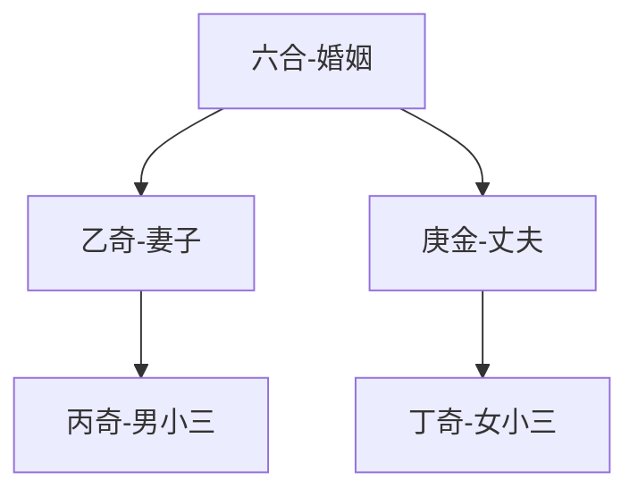

# 奇门遁甲

视频时长：04:57:32

https://www.bilibili.com/video/BV1Qi4y1M7oc?from=search&seid=2778291314383422749

https://www.youtube.com/channel/UCo3Pg32gjnbV_VDl5KFJIyw

笔记者：

> 学前记：
>
> - 你认为占卜是玄学还是神学？
>
>   玄学。即：
>
>   - 并非心诚则灵心不诚则不灵，更不会曰灵时则心诚
>
> - 你认为概率统计学预测概率高，还是玄学预测概率高
>
>   对于趋势明显、条件足够多的情况，概率统计学。而没有足够条件、或条件之间构不成直接作用，概率统计学无用。
>
> - 玄学是够能够被观测
>
>   能。即：
>
>   - ”xxx曾非常准地占卜xxx成功“。如果说信息不是捏造，那么这就是一个活生生被观测到的事实。而成功可被观测，失败不可被观测，反而不合理。
>   - 但事实上，并没有一个在记录下的统计结果
>   - 可被观测，符合科学规律
>
> - 大数据玄学
>
>   认可

# 目录

# 序言

## 奇门遁甲

> 甲：首，统帅
>
> 遁甲：隐遁统帅甲
>
> 奇：三奇
>
> 门：人事，八个门
>
> 奇门遁甲：本质是信息学+逻辑学

## 一些作品

### 歌诀《烟波钓叟歌》

引用其中12句：（介绍奇门遁甲来龙去脉）

> - 轩辕黄帝战蚩尤
> - 逐鹿经年苦未休
> - 偶梦天神授符诀
> - 登坛致祭谨虔修
> - 龙龟出自河洛水（河出图，洛出书，圣人则之——《周易》，神龙负图出洛水）
> - 彩凤衔书碧云里（衔的就是奇门遁甲）
> - 因命风后演成文（让风后写成文，故也叫风后奇门）
> - 一千八十当时制（一年360天中每个时辰一个奇门局，但每4个奇门局相同，故360*12/4 = 4320个奇门局）
> - 太公删成七十二（姜子牙再简化，一年24个节气中每个节气的15天三等分为三个元（5天），即72个元局）
> - 逮于汉代张子房（到了西汉张良（张子房），发现每4局相同，简化为18局）
> - 一十八局为精艺（18局分成了两部分，阳遁局和阴遁局。冬至一阳生，到夏至前夕阳气不断上升，叫阳遁局，阳一局到阳九局。反之，阴一局到阴九局）

### 《抱朴子》东晋葛洪

葛洪：东晋知名道人

> 九秘：九字护身法，又名六甲咒语、六甲秘祝、奥义九字
>
> 错误版本
>
> > （面）“临兵斗者皆阵列前行”
> >
> > 列 者 临
> >
> > 在 皆 斗
> >
> > 前 阵 兵
>
> 版本指正
>
> > 这个有挺多版本：“临兵斗者皆阵列前行”、“临兵斗者皆数组前行”、“临兵斗者皆阵列在前”
> >
> > 查了下：知乎+维基
> >
> > 查《抱朴子》宋刊本、明刊本、正统道藏、中华道藏，皆作
> > “临兵斗者皆阵列前行”
> >
> > “临兵斗者皆阵列在前”在河洛民俗界被认为是传入日本后误抄所致
>
> 其他补充
>
> > 五石散配方为丹砂、雄黄、白矾、曾青、磁石。——葛洪《抱朴子》
> >
> > 信石的提纯物为砒霜，三国时期名士将外表相似的信石头当做矾石的代替品，五石散由普通中药变为毒品。

### 《神机制敌太白阴经》唐朝李荃

> 比较详细地讲如何使用奇门遁甲排兵布阵
>
> 可读

### 《秘藏通玄变化六阴洞微遁甲真经》北宋赵普

赵普：曾为赵匡胤重要部下

> 民间也称作《奇门遁甲秘笈大全》
>
> 可读

### 《金函玉镜奇门遁甲秘笈大全》明朝刘伯温

刘伯温：朱元璋的谋臣

> 可读

### 当代张志春三本

> 建议初学者先读近代的著作

#### 《神奇之门》

#### 《开悟之门》

#### 《未知之门》

## 奇门遁甲类型

按时间

- 年家奇门，以年起局，来判断流年的情况
- 月家奇门，以月起局，来判断流月的情况
- 日家奇门，以日起局，来判断日子的情况
- 时家奇门，以时辰起局

按排盘方法

- 转盘法奇门，三奇六仪等参数，用转盘落宫的方式来排盘
- 飞盘法奇门，八卦九宫、三奇六仪等参数，按排序数飞入到各个宫里

该课程学习时家奇门转盘法，其他不作介绍

# 参数

## 64参数

天地人64个参数

- 空间参数：八卦九宫（8+9=17）
- 时间参数：天干地支（10+12=22）
- 三类参数：（9+8+8=25）
  - 外环境参数：九星（9）
  - 人际关系参数：八门（8）
  - 不可知外力：八神（8）

## 参数详解

## 阴阳和五行

### 一阳生一阴生

冬至一阳生，对应的64卦为`地雷复卦`，复卦也叫一阳生

> 一    一
> 一    一
> 一    一
> 一    一
> 一    一
> **一一一**

夏至一阴生，对应的64卦为`天风垢卦`，垢卦也叫一阴生

> **一一一**
> **一一一**
> **一一一**
> **一一一**
> **一一一**
> 一    一

### 八卦九宫图

> 九宫上画太极，左盘为阳局，右盘为阴局（离属于右，坎属于左（太极飞地））
>
> > ​                南
> >
> > ​        巽    离    坤
> >
> > 东    震  中五  兑    西
> >
> > ​        艮    坎    乾
> >
> > ​                北

### 五行

#### 五行类象

> ”天法地、地法天、天法道、道法自然“ ——《道德经》
>
> 天文五行
>
> ​		从远到近：火星、木星、土地球、金星、水星
>
> 地面五方
>
> | 五行  | 木   | 火   | 土   | 金   | 水   |
> | ---- | ---- | ---- | ---- | ---- | ---- |
> |五方|东|南|中|西|北|
> |五季|春|夏|长夏|秋|冬|
> |五脏|肝|心|脾|肺|肾|
> |五官|目|舌|口|鼻|耳|
>

#### 五行数

> 《尚书 · 洪范篇》：
>
> 一曰水，天一生水（1,6）
> 二曰火，天二生火（2,7）
> 三曰木，天三生木（3,8）
> 四曰金，天四生金（4,9）
> 五曰土，天五生土（5,10）

#### 五行九官

> 顺时针连接红字的五行，为五行相生相泄
>
> 画五角星，则为五行相克相耗
>
> > 木    **火**    **土**
> >
> > **木**    土    **金**
> >
> > 土    **水**    金

#### 五行关系

> 相生相泄（相生反过来就是相泄）
>
> 相克相耗（相克反过来就是相耗）

#### 五行旺衰（旺相休囚死）

> 同我为旺（兴旺态）
> 生我为相（兴旺态）
> 我生为休（衰弱态）
> 我克为囚（衰弱态）
> 克我为死（衰弱态）
>
> | 五行        | 旺           | 相           | 休           | 囚             | 死           |
> | ----------- | ------------ | ------------ | ------------ | -------------- | ------------ |
> | 木行        | 旺于春（木） | 相与冬（水） | 休于夏（火） | 囚于季夏（土） | 死于秋（金） |
> | 其他 [书略] | ……           | ……           | ……           | ……             | ……           |
>
> 注：被克方十分兴旺，则会反克。如木和金，木旺金囚

#### 五行在奇门局的应用

问求职的，出生年月在火，工作岗位在坎水

月在土，克水囚火，不利

## 天干地支

### 十天干

#### 十天干

遁甲三奇六仪：`甲乙丙丁戊己庚辛壬癸`

[^癸]: gui3

#### 遁甲 三奇 六仪

甲、乙丙丁、戊己庚辛壬癸

遁甲是隐遁统帅

#### 三奇

| 三奇 | 别称 | 管辖     | 作用             | 别称（作用相关） |
| ---- | ---- | -------- | ---------------- | ---------------- |
| 乙奇 | 日奇 | 总参谋长 | 甲木之妹嫁于庚金 | 美人奇           |
| 丙奇 | 月奇 | 总警卫长 | 甲木之子克杀庚金 | 儿子奇           |
| 丁奇 | 星奇 | 总后勤长 | 甲木之女柔克庚金 | 女儿奇           |

#### 六甲统帅

甲在60甲子表里有6个，前三甲后三家

- 甲子戊 - 大统帅
- 甲戊己
- 甲申庚
- 甲午辛
- 甲辰壬
- 甲寅癸

#### 三奇六仪排兵

- 三奇六仪形成一个圈（遁甲躲起来）
- 阳遁局：逆布三奇顺飞六仪：戊己庚辛壬癸丁丙乙
- 阴遁局：顺布三奇逆飞六仪

#### 布阵九宫

特点为线上三数和为15

> 4      9      2
>
> 3      5      7
>
> 8      1      6

记法：

> 8341，9276，中间5
> 或
> 戴九履一，左三右七，二四为肩，六八为足，五居中

#### 排布三奇六仪实战

阳三局

> | 戊   | 己   | 庚   | 辛   | 壬   | 癸   | 丁   | 丙   | 乙   |
> | ---- | ---- | ---- | ---- | ---- | ---- | ---- | ---- | ---- |
> | 3    | 4    | 5    | 6    | 7    | 8    | 9    | 1    | 2    |
>
> 阳三局
>
> > 己    丁    乙
> >
> > 戊    庚    壬
> >
> > 癸    丙    辛

阴四局

> | 戊   | 己   | 庚   | 辛   | 壬   | 癸   | 丁   | 丙   | 乙   |
> | ---- | ---- | ---- | ---- | ---- | ---- | ---- | ---- | ---- |
> | 4    | 3    | 2    | 1    | 9    | 8    | 7    | 6    | 5    |
>
> 阴四局
>
> > 戊    壬    庚
> >
> > 己    乙    丁
> >
> > 癸    辛    丙

从九宫图中

> 判断戊己的顺序关系，即倒推出是什么局

#### 天干类象

| 天干 | 五行 | 方位 | 脏腑 | 体表 | 五味 | 类象 | 颜色 | 性格 | 得令时 | 失令时 |
| ---- | ---- | ---- | ---- | ---- | ---- | ---- | ---- | ---- | ---- | ---- |
|甲|阳木|东方|胆|头部|酸味|统帅|青绿|干健直爽，自负，体型高大|为栋梁|闲置材料|
|乙|阴木|东方|肝|脖 肩|甜酸|妻子\|中医\|女子|浅绿|柔和，体质软嫩|茂盛|枯萎|
|丙|阳火|南方|小肠|肩 头|苦辣|权威者\|男小三|紫红|火烈，清廉| 成绩辉煌 |灰心丧气|
|丁|阴火|南方|心脏|胸 舌|苦|玉女\|女小三|淡红|温和，有心机，形体秀丽|明察秋毫|忧愁焦虑|
|戊|阳土|中央|胃|肋 鼻|甘辛|聚财\|天门|深黄|刚烈，形体厚实|豪放果敢|发呆|
|己|阴土|中央|脾|腹 面|甘辛|坟墓\|地户|浅黄|温顺，形体沉稳|教化万物|洁身自好|
|庚|阳金|西方|大肠|筋骨|辛辣|丈夫\|干警\|仇人\|大刀具|白(金属)|锐利，体型高大|强硬|丧失威望|
|辛|阴金|西方|肺|胸 股|苦辣|错误\|罪人\|镜子\|小刀具|浅白|镇静，体型方正| 良好材料 |变成瓦砾|
|壬|阳水|北方|膀胱|小腿|咸|流动\|物流\|化学工业|深黑|柔险，可共患难但难于同甘甜|助人利物|妨人害国|
|癸|阴水|北方|肾|足|咸|流动\|地下水\|石油\|性生活\|胎儿|浅黑|阴柔，易涉及阴谋|狐假虎威|灰心乞怜|

#### 阳干阴干

五阳干：甲乙丙丁戊，利动不利静，利客不利主

五阴干：己庚辛壬癸，利静不利动，利主不利客

绝大多数情况下：阳干组合往往比较好，阴干组合往往不好

#### 天干五合（5对）

阳干阴干一一对应就是了

甲乙丙丁戊
己庚辛壬癸

> 甲己合土（木-土）
>
> 乙庚合金（木-金），乙庚合通常为夫妻
>
> 丙辛合水（火-金）
>
> 丁壬合木（火-水）
>
> 戊癸和火（土-水）

#### 七杀冲克（4对）

阳干阴干一一斜着对应

甲乙丙丁戊
己庚辛壬癸

> 庚甲、辛乙、壬丙、癸丁
>
> 只有四对，为什么叫七杀，如：甲到庚一个为7个天干，“甲乙丙丁戊己庚”，其他同理

#### 天干在奇门局的应用

每个奇门局有两个天干

- 下面的叫`地盘天干`（表驻扎），是问事以前发生的事情
- 上面的叫`天盘天干`（表出去），是当前的情况和未来走向的情况
- 地盘天干和天盘天干相互作用为`十干克应`

### 十二地支

#### 十二地址

> 十二地支：`子(zǐ)、丑(chǒu)、寅(yín)、卯(mǎo)、辰(chén)、巳(sì)、午(wǔ)、未(wèi)、申(shēn)、酉(yǒu)、戌(xū)、亥(hài)`
>

#### 干支历法

> 阳历：地球绕太阳转
> 阴历：月亮绕地球转
>
> 天干和地址相配，但阳配阳，阴配阴，只有120/2 = 60对，即60甲子

#### 十二地支类象

| 地支 | 五行     | 方位 | 地                                   | 人                                     | 物                                                           | 吉                         | 凶                                 |
| ---- | -------- | ---- | ------------------------------------ | -------------------------------------- | ------------------------------------------------------------ | -------------------------- | ---------------------------------- |
| 子   | 阳水     | 北方 | 池塘\|河流\| 与水有关场所       | 妇女                                   | 老鼠\|燕子\|蝙蝠\| 蜗牛\|甘薯\|水萝卜\|浮萍             | 聪明                       | 淫逸                               |
| 丑   | **阴土** | 东北 | 伤员\|桥梁\| 供电\|礼堂\|坟墓   | 贵人\|神佛\| 尊敬的长辈           | 牛\|驴\|钥匙\| 首饰\|珍宝\|鞋类                         | 喜庆\|升官晋级             | 刑狱\|官司\| 背井离乡\|疾病   |
| 寅   | 阳木     | 东北 | 山林\|桥梁                           | 丈夫\|女婿\| 贵人\|清官\|公职人员 | 老虎\|豹子\|猫\| 棺材\|文书\|单据\|香炉                 | 文书\|信息                 | 丢东西\|疾病 \|官司\|是非     |
| 卯   | 阴木     | 东方 | 大街\|道路                           | 兄弟\|姑娘\|手工业者                   | 轮船\|汽车\| 门窗\|兔子\|蛐蛐                           | 车船平安                   | 官司口舌之争\| 车和船遇到危险 |
| 辰   | **阳土** | 东南 | 高岗\|土坝\| 坟墓\|麦地\|寺庙   | 圣人\|道士                             | 瓷器\|土缸\|皮毛                                             | 医生\|医药                 | 屠夫\|官司                         |
| 巳   | 阴火     | 东南 | 弯曲的道路\|香火                     | 少女\|少妇\|乞丐                       | 书画\|花果\|砖瓦\| 瓷器\|蛇\|蚯蚓\|蝉\|萤火虫           | 文书\|票据                 | 生病\|噩梦                         |
| 午   | 阳火     | 南方 | 娱乐场所\| 大厅\|电影院\|会议室 | 骑马的人\| 女秘书\|圣人\|死者     | 家电\|书画\|衣服\|锦旗                                       | 信息\|文笔                 | 惊慌\|口舌之争                     |
| 未   | **阴土** | 西南 | 大院\| 墙垛\|坟墓\|田野         | 老妇人\| 寡妇\|老男子\|牧师       | 羊\|老鹰\|衣服\| 药物\|食物\|酒具                       | 酒食\| 宴会\|美好的事 | 疾病\|考服\|官灾                   |
| 申   | 阳金     | 西南 | 神社\|佛堂\|麦地                     | 行人\|士兵\|凶人                       | 交通工具\|铁器\| 金银\|猿猴\|狮子                       | 好消息\|好事情             | 道路损毁\|毛病\|破产               |
| 酉   | 阴金     | 西方 | 高压塔\|石柱                         | 少女\|卖酒的人                         | 金银\|珍宝\| 毛皮\|口罩\|鸡\|鸽                         | 高兴聊天 和美地聚会   | 疾病\|分离                         |
| 戌   | **阳土** | 西北 | 山岭\|寺庙\| 坟墓\|监狱\|厕所   | 长者\| 善人\|僧人\|道士           | 砖瓦\|瓷器\|医药\|狗\| 尸骨\|钥匙\|大豆\|驴\|高粱\|荞麦 | 办事顺畅                   | 办事虚诈\| 争斗\|牢狱之灾     |
| 亥   | 阴水     | 西北 | 江河\|仓库\| 寺庙\|楼台\|厕所   | 小孩\|乞丐\| 醉酒\|罪人\|盗贼     | 麻布\|丝绸\| 笔墨\|毛发\|鱼虾蟹                         | 婚配\|求亲\|求说           | 争斗\|难缠                         |

#### 地支六冲（6对）

相冲不是冲克，不一定是坏事

在奇门局里位置都是相对的

子丑寅卯辰巳
午未申酉戌亥

> 子午冲，子水北，午火南
>
> 丑未冲，丑东北，未西南
>
> 寅申冲，寅东北，申西南
>
> 卯酉冲，卯木东，酉金西
>
> 辰戌冲，辰东南，戌西北
>
> 巳亥冲，巳东南，亥西北

#### 地支相刑（6对）

六个相刑会影响三奇六仪中的六仪

> 子卯相刑（戌），午午相刑（辛）
>
> 未戌相刑（巳），辰辰相刑（壬）
>
> 寅申相刑（庚），寅巳相刑（癸）

#### 地支相合

##### 地支三合（4组）

12地支分四组，每三个构成一个三合局

合是有利的

> 申子辰合水局（金水土）
>
> 亥卯未合木局（水木土）
>
> 寅午戌合火局（木火土）
>
> 巳酉丑合金局（火金土）

##### 三会局（4组）

12地支每3个构成一个方位，构成一个季节

> 左侧为春季和东方
> 上侧为夏家和南方
> 右侧为秋季和西方
> 下测为冬季和北方
>
> > ​        巳    午    未
> >
> > 辰    口    口    口    申
> >
> > 卯    口    口    口    酉
> >
> > 寅    口    口    口    戌
> >
> > ​        丑    子    亥

##### 地支二合（6对）

未申酉戌亥子 丑寅卯辰巳午

对称项相连，有六对

> 丑子合土（土水）
> 寅亥合木（木水）
> 卯戌合火（木土）
> 辰酉合金（土金）
> 巳申合水（火金）
> 午申合土（火土）

#### 应用相关

首要：时令的应用

> 如：发生在子月，即子月旺，子月对应水，整个奇门局里的水都是旺的
>
> 如：卯这一宫逢空，对面的酉去对冲，就可能把卯空给冲掉，事情要落实。若卯月卯日，空被填实，事情也能落实

### 十二长生

|      | 数量 | 能量状态   |
| ---- | ---- | ---------- |
| 五行 | 5    | 旺相休囚死 |
| 九星 | 5    | 旺相休囚废 |
| 天干 | 12   |            |

天干和12地支组合，12地支为12个不同时令，天干在不同时令有不同能量状态

#### 天干十二态

十二态分三种

| 天干十二态         | 能量变化过程   | 备注                                                     |
| ------------------ | -------------- | -------------------------------------------------------- |
| 生、浴、带、官、旺 | 能量上升的过程 | 全称：长生、沐浴、冠带、临官、帝旺。趋势最强的为：生官旺 |
| 衰、病、死、墓、绝 | 能量下降的过程 | 特别要注意“墓”，代表在地下、有玄机、有不确定性           |
| 胎、养             | 能量孕育的过程 |                                                          |

#### 天干 x 地支（十二态）

| 地支       |      | 亥   | 子   | 丑     | 寅   | 卯   | 辰     | 巳   | 午   | 未     | 申   | 酉   | 戌     |
| ---------- | ---- | ---- | ---- | ------ | ---- | ---- | ------ | ---- | ---- | ------ | ---- | ---- | ------ |
| `时令五行` |      | 阴水 | 阳水 | 阴土   | 阳木 | 阴木 | 阳土   | 阴火 | 阳火 | 阴土   | 阳金 | 阴金 | 阳土   |
| `时令`     |      | 春   | 春   | 春     | 夏   | 夏   | 夏     | 秋   | 秋   | 秋     | 冬   | 冬   | 冬     |
| `方位`     |      | 东   | 东   | 东     | 南   | 南   | 南     | 西   | 西   | 西     | 北   | 北   | 北     |
| 甲阳木     | 东   | 生   | 浴   | 带     | `官` | `旺` | 衰     | 病   | 死   | **墓** | 绝   | 胎   | 养     |
| 乙阴木     | 东   | 死   | 病   | 衰     | `旺` | `官` | 带     | 浴   | 生   | 养     | 胎   | 绝   | **墓** |
| 丙阳火     | 南   | 绝   | 胎   | 养     | 生   | 浴   | 带     | `官` | `旺` | 衰     | 病   | 死   | **墓** |
| 丁阴火     | 南   | 胎   | 绝   | **墓** | 死   | 病   | 衰     | `旺` | `官` | 带     | 浴   | 生   | 养     |
| 戊阳土     | 中   | 绝   | 胎   | 养     | 生   | 浴   | 带     | `官` | `旺` | 衰     | 病   | 死   | **墓** |
| 己阴土     | 中   | 胎   | 绝   | **墓** | 死   | 病   | 衰     | `旺` | `官` | 带     | 浴   | 生   | 养     |
| 庚阳金     | 西   | 病   | 死   | **墓** | 绝   | 胎   | 养     | 生   | 浴   | 带     | `官` | `旺` | 衰     |
| 辛阴金     | 西   | 浴   | 生   | 养     | 胎   | 绝   | **墓** | 死   | 病   | 衰     | `旺` | `官` | 带     |
| 壬阳水     | 北   | `官` | `旺` | 衰     | 病   | 死   | **墓** | 绝   | 胎   | 养     | 生   | 浴   | 带     |
| 癸阴水     | 北   | `旺` | `官` | 带     | 浴   | 生   | 养     | 胎   | 绝   | **墓** | 死   | 病   | 衰     |

特点与记法：

> 天干五行除了土，官旺皆为时令五行处。土旺于火
>
> 天干五行都入墓于土
>
> 阳顺阴逆，阳死阴生
>
> 就能记住12态

注：

> 如甲木：最旺盛时，官、旺对应的寅木、卯木。旺相的状态。而墓在土。
>
> 丙火和戌土、丁火和己土的十二态一样

#### 天干 vs 地支（五行&方位）

天干和地支分别都有五行和方位，区别：

五行

> 天干五行一般是天干自身的五行
>
> 地支五行一般是指时令五行
>
> 八卦五行一般是指八卦九宫上的五行，这五行本身有有方位，这是固定的

方位

> 地支方位是指地支在九宫里的位置，是永恒不变的
>
> > ​        巳    午    未
> >
> > 辰    口    口    口    申
> >
> > 卯    口    口    口    酉
> >
> > 寅    口    口    口    戌
> >
> > ​        丑    子    亥
>
> 而天干在九宫里的位置则是会变的，有18个奇门局（阴阳各9局），根据固定九宫数字和18局铺排三奇六仪
>
> > 4      9      2
> >
> > 3      5      7
> >
> > 8      1      6
>
> 例阳三局：（实际上天干在奇门局九宫里还分天盘天干和地盘天干）
>
> > 己    丁    乙
> >
> > 戊    庚    壬
> >
> > 癸    丙    辛
>
> 天干的方位主要和五行所关联，应该没其他特别的用处
>
> > 东木、南火、西金、北水、中土
>
> 八卦九宫五行的也有方位，或者说，本来就是九宫里的属性
>
> > 木    **火**    **土**
> >
> > **木**    土    **金**
> >
> > 土    **水**    金

#### 九宫十二态

画出九宫，12地址、天干12态后

以甲木为例，其状态是顺时针，为阳顺。而乙木则为阴逆。

阳顺阴逆，阳死阴生。即：

> 午位，甲木死处为乙木生，且为逆生长。（注意生死并未非正对面的！）
>
> 此时，乙木的官、旺位置依然为寅木、卯木。（只是位置反了）
>
> 墓依然在土，不过才未土变成戌土。

## 八卦九宫

八卦图是奇门遁甲的底图

### 先天八卦

#### 来历——伏羲八卦

先天八卦，也叫伏羲八卦

伏羲氏是我国古籍中记载的最早的王之一

复习下历史——传说时期

> 三皇五帝时期（公元前?年-公元前3077年）
>
> 关于上古传说史中的三位圣王三皇，有各种说法：
>
> > - [伏羲](https://zh.wikipedia.org/wiki/伏羲)、[神农](https://zh.wikipedia.org/wiki/神農)、[女娲](https://zh.wikipedia.org/wiki/女媧)（《[史记](https://zh.wikipedia.org/wiki/史记)·三皇本纪》—[司马贞](https://zh.wikipedia.org/wiki/司马贞)补、《春秋运斗枢》、《春秋元命苞》）
> > - [伏羲](https://zh.wikipedia.org/wiki/伏羲)、[神农](https://zh.wikipedia.org/wiki/神農)、[黄帝](https://zh.wikipedia.org/wiki/黃帝)（《[尚书·序](https://zh.wikipedia.org/wiki/尚书_(书))》、《[帝王世纪](https://zh.wikipedia.org/wiki/帝王世紀)》）
> > - [伏羲](https://zh.wikipedia.org/wiki/伏羲)、[神农](https://zh.wikipedia.org/wiki/神農)、[燧人](https://zh.wikipedia.org/wiki/燧人)（《[尚书大传](https://zh.wikipedia.org/wiki/尚书大传)》、《礼纬含文嘉》）
> > - [伏羲](https://zh.wikipedia.org/wiki/伏羲)、[神农](https://zh.wikipedia.org/wiki/神農)、[祝融](https://zh.wikipedia.org/wiki/祝融)（《[白虎通](https://zh.wikipedia.org/wiki/白虎通)》）
> > - [伏羲](https://zh.wikipedia.org/wiki/伏羲)、[神农](https://zh.wikipedia.org/wiki/神農)、[共工](https://zh.wikipedia.org/wiki/共工)（《[通鉴外纪](https://zh.wikipedia.org/wiki/通鑒外紀)》）
>
> 关于上古传说史中的五位圣王五帝，有各种说法：
>
> > - [黄帝](https://zh.wikipedia.org/wiki/黃帝)、[颛顼](https://zh.wikipedia.org/wiki/顓頊)、[喾](https://zh.wikipedia.org/wiki/嚳)、[尧](https://zh.wikipedia.org/wiki/堯)、[舜](https://zh.wikipedia.org/wiki/舜)（《[史记](https://zh.wikipedia.org/wiki/史記)·五帝本纪》、《[世本](https://zh.wikipedia.org/wiki/世本)》、《[大戴礼记](https://zh.wikipedia.org/wiki/大戴礼记)》、《[易传](https://zh.wikipedia.org/wiki/十翼)》、《[礼记](https://zh.wikipedia.org/wiki/禮記)》、《[春秋](https://zh.wikipedia.org/wiki/春秋_(史书))[国语](https://zh.wikipedia.org/wiki/國語_(書))》）
> > - [少昊](https://zh.wikipedia.org/wiki/少昊)、[颛顼](https://zh.wikipedia.org/wiki/顓頊)、[喾](https://zh.wikipedia.org/wiki/嚳)、[尧](https://zh.wikipedia.org/wiki/堯)、[舜](https://zh.wikipedia.org/wiki/舜)（《[尚书·序](https://zh.wikipedia.org/wiki/尚书_(书))》、《[白虎通义](https://zh.wikipedia.org/wiki/白虎通義)》）
> > - [黄帝](https://zh.wikipedia.org/wiki/黃帝)、[庖牺（伏羲）](https://zh.wikipedia.org/wiki/伏羲)、[神农](https://zh.wikipedia.org/wiki/神農)、[尧](https://zh.wikipedia.org/wiki/堯)、[舜](https://zh.wikipedia.org/wiki/舜)（《[战国策](https://zh.wikipedia.org/wiki/戰國策)》）
> > - [黄帝](https://zh.wikipedia.org/wiki/黃帝)、[颛顼](https://zh.wikipedia.org/wiki/顓頊)、[太昊（伏羲）](https://zh.wikipedia.org/wiki/太昊)、[少昊](https://zh.wikipedia.org/wiki/少昊)、[炎帝](https://zh.wikipedia.org/wiki/炎帝)（《[礼记](https://zh.wikipedia.org/wiki/禮記)·月令》、《[吕氏春秋](https://zh.wikipedia.org/wiki/呂氏春秋)》、《[淮南子](https://zh.wikipedia.org/wiki/淮南子)》）
> > - [黄帝](https://zh.wikipedia.org/wiki/黃帝)、[颛顼](https://zh.wikipedia.org/wiki/顓頊)、[喾](https://zh.wikipedia.org/wiki/嚳)、[尧](https://zh.wikipedia.org/wiki/堯)、[少昊](https://zh.wikipedia.org/wiki/少昊)（《[资治通鉴外纪](https://zh.wikipedia.org/wiki/通鉴外纪)》）
> > - 青帝灵威仰，赤帝赤熛怒，白帝白招矩，黑帝协光纪，黄帝含枢纽[[4\]](https://zh.wikipedia.org/wiki/三皇五帝#cite_note-4)。（《[史记正义](https://zh.wikipedia.org/wiki/史記正義)》）
>
> 尧舜禹时期
>
> > - 帝尧生于公元前2317年甲申，卒于公元前2200年辛巳
> > - 帝舜生于公元前2277年甲子，卒于公元前2178年癸卯
> > - 夏禹生于公元前2257年，卒于公元前2165年

先天八卦记载

> 古者包牺氏之王天下也，仰则观象于天，俯则观法于地，观鸟兽之文与地之宜，近取诸身，远取诸物，于是始作八卦。——《周易 · 系辞传》

#### 先天八卦方位

> 当时处于中原大地，四周观看
>
> | 方位 | 图                                                           | 卦名           | 原因                                                         |
> | ---- | ------------------------------------------------------------ | -------------- | ------------------------------------------------------------ |
> | 东方 |  | **离卦**、火卦 | 升阳的地方，靓丽（古字靓丽的丽可写成离）                     |
> | 西方 |  | **坎卦**、水卦 | 月亮（月卦），且为大江大河发源地，水过不去，也指坎坷         |
> | 南方 |  | **乾卦**、天卦 | 阳光充足，古人认为向太阳即向天看                             |
> | 北方 |  | **坤卦**、地卦 | 与南边相反、阴（阴卦）                                       |
> | 西北 |  | **艮卦**、山卦 | 黄土高原、山脉、被阻挡（艮即阻挡）                           |
> | 东南 |  | **兑卦**、泽卦 | 沿海地区，有大水（海卦）、海边喜悦（悦卦，悦古字为兑）       |
> | 西南 |  | **巽卦**、风卦 | 四川云南、季风多，（巽就是顺风的意思）                       |
> | 东北 |  | **震卦**、雷卦 | 肥沃的黑土地，原因之一为春夏之交闪电打雷多，闪电把空气大量氮气电解成氮离子，顺着雨水成为氮肥 |
>
> 九宫方位（该图上南下北）（注意：古人是上南下北，很违于常识）
>
> > 兑    乾    巽
> >
> > 离            坎
> >
> > 震    坤    艮
>
> 或（该图上南下北）
>
> >         
> >
> >                
> >
> >         

#### 先天八卦数

先天八卦数

> 7      8      4
>
> 6              3
>
> 5      1      2

特点：

> 对着加数字和等于9
>
> 连线是个S形
>
> 1234：阳消阴长、5678：阴长阳消

### 后天八卦

#### 来历——文王八卦

周文王改动

历史背景：

> 夏商周时期，商改周，西伯候（周文王）欲讨伐商纣王
>
> 商纣王关了周文王7年，在此期间，写下周易的六十四卦卦辞、改动八卦图
>
> 该八卦图蕴有军事政治、农业生产、风水的含义
>
> 后其儿子周武王使用，武王伐纣，建立大周王朝

#### 后天八卦方位

一般文王八卦图习惯画成八卦九宫图（该图上南下北）

`图里的左上应该为4，写错了`

孔夫子在《周易》易传部分写了八句话，解释其军事和政治意义：

> 帝出于震（春天从东出发）
>
> 齐乎巽（冬夏与东南组织军事队伍）
>
> 相见乎离（部队和部队在南方的夏天彼此见面相互熟悉）
>
> 致役乎坤（西南方向的夏秋之交致役，即干活，收割粮食）
>
> 说言乎兑（念成“悦言以兑”，在西边在秋天要说好听的话。）
> （周文王要他儿子周武王给商纣王说好听的话、同时要求他儿子献出一部分土地黄金美女给商纣王。目的让周文王能尽早获释）
>
> 战乎乾（西北方向，在秋冬之交开战）
>
> 劳乎坎（冬天在北边用酒水（坎）犒劳三军）
>
> 成言乎艮（东北冬春之交建立新的政权）

也可以解释农业播种收获储藏整个过程

> 略

历史复习：华夏民族历史大战

> 华夏民族历史第一次大战：逐鹿大战，黄帝大战蚩尤
>
> 华夏民族历史第二次大战：牧野大战，武王伐纣
>
> 话说商汤灭夏之战不算......（战于黄河流域，商汤取代夏桀）

#### 后天八卦数——河图

和洛书的数字排列一样（和为15）

> 朱熹所认为的生成数是河图、九宫数是洛书

奇门局三奇六仪排兵就是按这个来

> 4      9      2
>
> 3      5      7
>
> 8      1      6

记忆：

> 谣：戴九履一，左三右七，二四为肩，六八为足，五居中央
>
> 左盘的8341，恰好和毛主席的警卫部队的番号相同
>
> 其三阶行列式结果：360

### 对比

#### 意义

> 先天八卦是一个本体的卦，中华大地天文地理的总结
>
> 文王八卦图要应用八卦的力量，有军事、政治、农业意义

#### 八卦方位

先天八卦

> 兑    乾    巽
>
> 离            坎
>
> 震    坤    艮

后天八卦

> 巽    离    坤
>
> 兑            震
>
> 艮    坎    乾

#### 八卦数与连线

先天八卦数，连线为S，中心对称

> 7      8      4
>
> 6              3
>
> 5      1      2

后天八卦数，连线为双螺旋（456稍微断开），中心对称

> 4      9      2
>
> 3      5      7
>
> 8      1      6

### 八卦

#### 八卦类象

> 巽    离    坤
>
> 兑            震
>
> 艮    坎    乾

| 卦   | 类象                                   | 人物类象                                                     | 地方类象                                                     | 时间             | 五行 | 五味 | 颜色 | 数字                    | 人体 | 物体                 | 动物               |
| ---- | -------------------------------------- | ------------------------------------------------------------ | ------------------------------------------------------------ | ---------------- | ---- | ---- | ---- | ----------------------- | ---- | -------------------- | ------------------ |
|      |                                        |                                                              |                                                              | 0000             | 0000 | 0000 | 0000 | 000000                  | 0000 | 000000               | 000000             |
| 乾   | 天\|太阳\|万物之始\|巨大无比\|光明刚健 | 国家元首\|单位一把手\|主要领导人\|父亲\|长辈\|老者\|社会大人物\|老男 | 首都\|大都市\|省会城市\|中枢之地\|后天西北\|先天南\|为上方、高处 | 秋冬\|戌月\|亥月 | 金   | 辛辣 | 白   | 先天1\|后天6\|金行数4 9 | 头   | 金银首饰\|圆硬的东西 | 马\|象\|狮子\|天鹅 |

其他略，实在太长了......

#### 三爻卦记忆

顺口溜

> 乾三连、坤六断、离中虚、坎中满、兑上缺、巽下断、艮覆碗、震仰盂

## 节气、三元、奇门局

姜子牙的72奇门局利用节气来定奇门局

24节气（一节气15天），每个三等分为三元（一元5天，上元、中元、下元）

张良取1/4，终得18局（阳遁9局、阴遁9局）

### 60甲子

| 甲       | 乙   | 丙       | 丁   | 戊       | 己   | 庚       | 辛   | 壬       | 癸   |
| -------- | ---- | -------- | ---- | -------- | ---- | -------- | ---- | -------- | ---- |
| **甲子** | 乙丑 | 丙寅     | 丁卯 | 戊辰     | 己巳 | 庚午     | 辛未 | 壬申     | 癸酉 |
| 甲戌     | 乙亥 | **丙子** | 丁丑 | 戊寅     | 己卯 | 庚辰     | 辛巳 | 壬午     | 癸未 |
| 甲申     | 乙酉 | 丙戌     | 丁亥 | **戊子** | 己丑 | 庚寅     | 辛卯 | 壬辰     | 癸巳 |
| 甲午     | 乙未 | 丙申     | 丁酉 | 戊戌     | 己亥 | **庚子** | 辛丑 | 壬寅     | 癸卯 |
| 甲辰     | 乙巳 | 丙午     | 丁未 | 戊申     | 己酉 | 庚戌     | 辛亥 | **壬子** | 癸丑 |
| 甲寅     | 乙卯 | 丙辰     | 丁巳 | 戊午     | 己未 | 庚申     | 辛酉 | 壬戌     | 癸亥 |

10天干配10地支后，有两地支空亡。空亡即：事情没有落实 

#### 三元

60甲子，每5天一个元，即12元

四个上元、四个中元、四个下元

上元：**甲子**  乙丑  丙寅  丁卯  戊辰、、己卯  庚辰  辛巳  壬午  癸未、、甲午  乙未  丙申  丁酉  戊戌、、己酉  庚戌  辛亥  **壬子**  癸丑

中元：己巳  庚午  辛未  壬申  癸酉、、甲申  乙酉  丙戌  丁亥  **戊子**、、己亥  **庚子**  辛丑  壬寅  癸卯、、甲寅  乙卯  丙辰  丁巳  戊午

下元：甲戌  乙亥  **丙子**  丁丑  戊寅、、甲申  乙酉  丙戌  丁亥  **戊子**、、甲辰  乙巳  丙午  丁未  戊申、、己未  庚申  辛酉  壬戌  癸亥

#### 六旬

60甲子中，每5个一个元，每10个一个旬（对应表中一行）

6个旬其实也是奇门局中的六仪、六甲统帅

分别为：

> 前三甲：甲子戊旬、甲戌己旬、甲申庚旬
>
> 后三甲：甲午辛旬、甲辰壬旬、甲寅癸旬

### 节气

#### 二十四节气

时间以2014年数据为例：

| 春季     | 日期 | 时间  | 夏季     | 日期 | 时间  | 秋季     | 日期  | 时间  | 冬季     | 日期  | 时间  |
| -------- | ---- | ----- | -------- | ---- | ----- | -------- | ----- | ----- | -------- | ----- | ----- |
| **立春** | 2.4  | 6:03  | **立夏** | 5.5  | 21:59 | **立秋** | 8.7   | 22:02 | **立冬** | 11.7  | 20:06 |
| **雨水** | 2.19 | 1:59  | **小满** | 5.21 | 10:59 | **处暑** | 8.23  | 12:45 | **小雪** | 11.22 | 17:38 |
| **惊蛰** | 3.6  | 0:02  | **芒种** | 6.6  | 2:03  | **白露** | 9.8   | 1:01  | **大雪** | 12.7  | 13:04 |
| **春分** | 3.21 | 0:57  | **夏至** | 6.21 | 18:51 | **秋分** | 9.23  | 10:29 | **冬至** | 12.22 | 9:35  |
| **清明** | 4.5  | 4:46  | **小暑** | 7.7  | 12:14 | **寒霜** | 10.8  | 16:47 | **小寒** | 1.5   | 18:24 |
| **谷雨** | 4.20 | 11:55 | **大暑** | 7.23 | 5:41  | **霜降** | 10.23 | 19:57 | **大寒** | 1.20  | 11:51 |

节气记法：

> 《二十四节气歌》
>
> 春雨惊春清谷天，夏满芒夏暑相连，
>
> 秋处露秋寒霜降，冬雪雪冬小大寒。

#### 节气定奇门局

先判断是阳还是阴，再加数字

每个宫里的九宫数字都有规律

|               |              |                                               |
| ------------- | ------------ | --------------------------------------------- |
| 左盘 - 阳遁局 | 右上角为4381 | 宫内数字1从右往左递增，以1->3->2->1的顺序换行 |
| 右盘 - 阴遁局 | 左上角为9276 | 宫内数字1从右往左递增，以1->2->3->1的顺序换行 |

## 九星八门八神

### 八门

八门是人际关系有关

八门一般写在奇门局每个卦宫左边的中间部分

#### 八门位置

开休生伤杜景死惊

顺时针连线（开为始），八门在奇门局的相对位置（排队顺序）不变

八门位置（位置会变、排序顺序不变）

> 当开门位置在乾金宫，位置：
>
> > 杜    景    死
> >
> > 伤            惊
> >
> > 生    休    开

九宫位置（此位置固定不变）

> 巽木宫    离火宫    坤土宫
>
> 
>
> 震木宫        土        兑金宫
>
> 
>
> 艮土宫    坎水宫    乾金宫

#### 八门特点

> 吉：开门、休门、生门
>
> 凶：死门、惊门、伤门
>
> 中：杜门、景门

#### 值使门

每个时辰有一个领班的门

该门比普通门强

#### 八门的旺相休囚死

按五行的旺相休囚死的判断

八门五行：

开门属于金行，位于乾金宫则旺

#### 八门的凶吉

歌诀：

> 欲求财利往**生**方，葬猎须知**死**路强。
>
> 征战远行**开**门吉，休门见**贵**最为良。
>
> **惊**门官讼是非多，**杜**门无事好逃藏。
>
> **伤**门搏斗能捉贼，**景**门饮酒好思量。

#### 八门万物类象

| 八门 | 方位 | 凶吉 | 方位   | 类象                                                         | 利于                                                       | 不利                     |
| ---- | ---- | ---- | ------ | ------------------------------------------------------------ | ---------------------------------------------------------- | ------------------------ |
| 开门 | 西北 | 吉   | 乾金宫 | 法院\|银行                                                   | 开业\|征战\|远行\|考学\|婚娶\|乔迁\|营造\|贸易\|生育\|治病 |                          |
| 休门 | 北方 | 吉   | 坎水宫 | 政府\|公务员\|一家人                                         | 见贵人和领导\|当官上任\|嫁娶\|乔迁\|经商\|营造             | 断狱\|断官司\|行刑       |
| 生门 | 东北 | 吉   | 艮土宫 | 房产\|利润\|工资\|生命力                                     | 求财\|征战\|出行\|嫁娶\|贸易\|生育\|治病\|种植\|养殖\|房产 | 丧葬\|祭奠               |
| 伤门 | 东方 | 凶   | 震木官 | 交通工具\|刑警                                               | 经商\|出行\|赴任\|营建\|嫁娶                               | 讨伐\|捕鱼\|打猎\|抓盗贼 |
| 杜门 | 东南 | 中   | 巽木宫 | 纪检&安全部\|防洪抢险\|学理工                                |                                                            |                          |
| 景门 | 南方 | 中   | 离火宫 | 道路\|文书\|证件\|传媒\| 广告\|信息\|面试\|考分\| 教练\|比分\|字画\|酒业\|开会 | 出谋划策\|推荐贤良\|火攻杀敌                               |                          |
| 死门 | 西南 | 凶   | 坤土宫 | 死亡\|坟墓\|地皮\|地产\|地段                                 | 送葬\|死战                                                 |                          |
| 惊门 | 西方 | 凶   | 兑金   | 律师\|官司\|演唱\|相声                                       | 打官司\|抓盗贼                                             |                          |

#### 八门兴衰

同五门兴衰，复习下五行往衰：

> 金：旺于秋金，相与季夏土、休于冬水、囚于春木、死于夏火

#### 门迫

门五行克宫五行

> 如：开门（金）在震木宫
>
> 后果：
>
> 吉门克宫，吉门不成就
>
> 凶门克宫，门更凶

#### 门制

宫五行克门五行

> 如：开门（金）在离火宫
>
> 后果：
>
> 吉门受克吉不就
>
> 凶门被克凶不起来

### 九星

外环境参数

#### 九星方位

> 天文九星方位
>
> > 四辅    天纪    虎贲[^ben1]
> >
> > 河北                七公
> >
> > 华盖    北极    天厨
>
> 奇门遁甲九星（位置会变，但顺时针排序的顺序不变）
>
> > 天辅    天英    天芮[^rui4]
> >
> > 天冲    天禽    天柱
> >
> > 天任    天蓬    天心
>
> 记法
>
> > 蓬任冲辅、英芮柱心、禽

#### 九星类象

| 九星   | 阴阳 | 故乡       | 吉凶           | 类象                                             | 临宫                                                         |
| ------ | ---- | ---------- | -------------- | ------------------------------------------------ | ------------------------------------------------------------ |
| 天蓬星 | 阳星 | 北方坎水宫 | 凶星\|强盗之星 | 盗贼\|要犯\|黑帮大佬 \|大盗在暗中出没\|喜阴 | 不利于经商\|容易遇到盗贼\|易破产 \|易生病\|可以屯兵防守\|可以加固城池/堤防 |
| 天仁星 | 阳星 | 东北艮土宫 | 吉星           | 稳重、厚道之人                                   | 安民、立都、当官、见贵人、民众、从商、嫁娶、诸事吉祥         |
| 天冲星 | 阳星 | 东方震木宫 | 次要吉星       | 航空\|航天\|发射\|起飞\|利农事、助人             | 利于点将出星、击鼓攻战                                       |
| 天辅星 | 阳星 | 东南巽木宫 | 吉星           | 大学\|老师\|服装\|时尚\|读书学习好时机           | 利于升学、教化、经商、嫁娶、营造                             |
| 天英星 | 阴星 | 南方离火宫 | 中星\|小凶星   | 传媒\|易躁\|易血光                               | 出谋划策\|利见大人\|不利于求财、考官、嫁娶、乔迁             |
| 天芮星 | 阴星 | 西南坤土宫 | 凶星\|病星     | 疾病\|学员\|寺庙\|宗教\|疾病死亡有关             | 易得病、出毛病\|不利用兵、嫁娶、乔迁、营造，可拜师交友       |
| 天柱星 | 阴星 | 西方兑金宫 | 凶星           | 破财伤人\|临九天破敌\|喜收割、斗争               | 不利出战、可养兵\|不利经商、易破财伤人\|宜固堡垒、屯兵       |
| 天心星 | 阴星 | 西北乾金宫 | 吉星           | 为首脑服务\|功于心计\|具智慧\|善治病             | 利于谋略、治病                                               |

# 实战

## 婚姻

### 婚姻模式

重要参数：

### 婚姻指标：六合

## 身体

