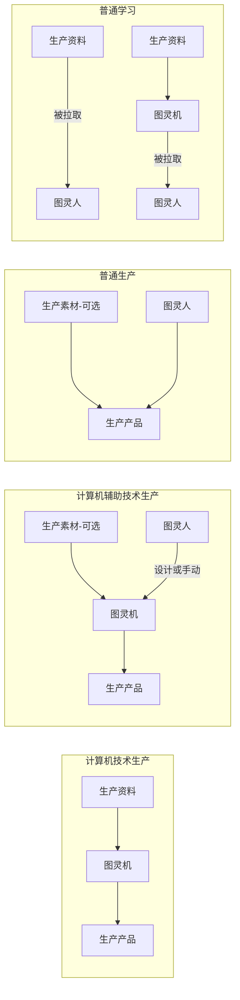
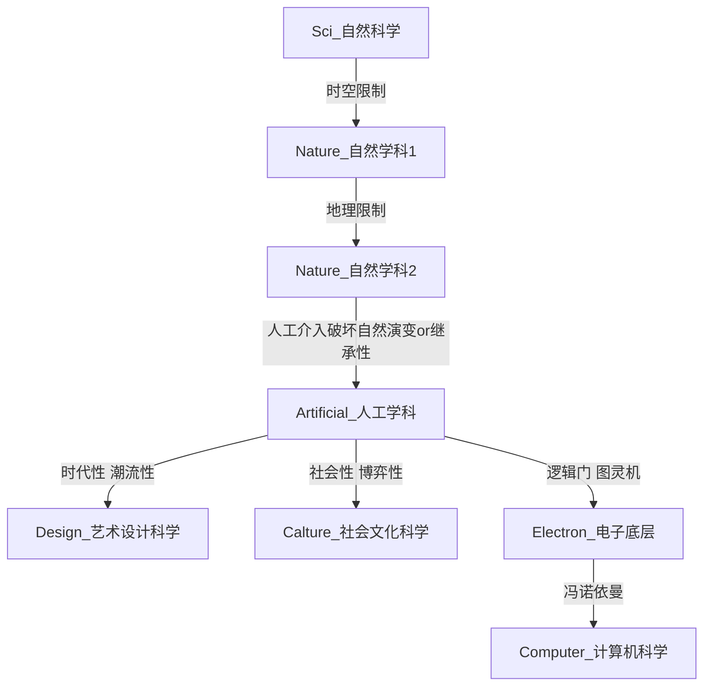
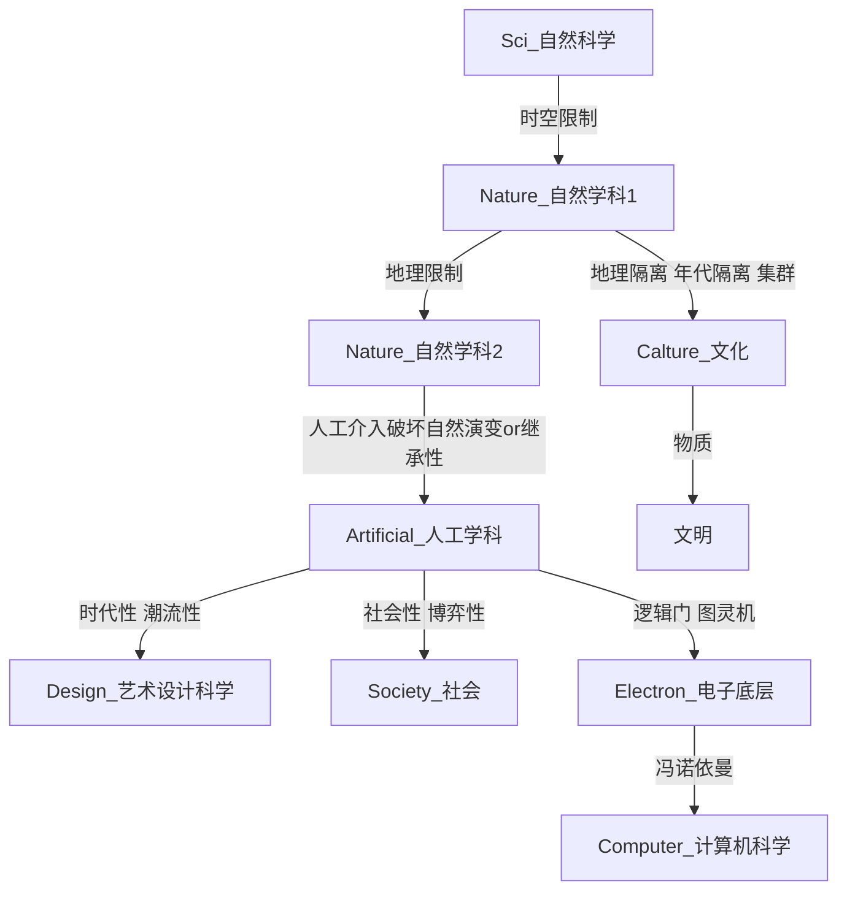
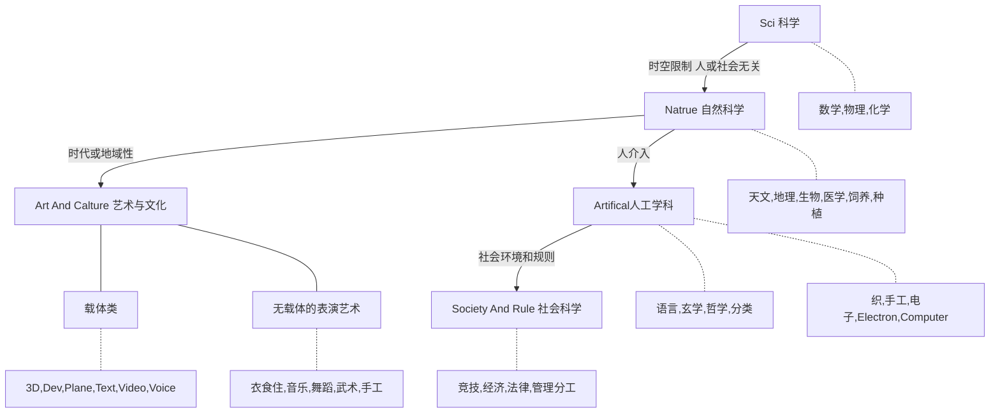

# 文件分类系统

# 目录

# V3~~（思考中）~~

工程类要不要弄个工程编号来模拟数据库管理？

例如：No_Res_ProjectName_Level_Time_Version_Copyright(复制权即版权)

## 整体

### 新特性

#### 类的思想

- 按计算机类的思想去设计
- 分类的划分更科学、也更清晰，明确而无歧义
  - 不建立分歧，细化使之准确
  - 原来的文档型、归档型、软件型的后分支是不同的，现在将他们规范相同
    规范相同后将树结构的一大缺点给克服了——前多个分支可以**完全变成空间结构**
    可以使用一套新的文件定位系统，用多个同候选的多选下拉框来确定一个或多个文件的所在区域（不是准确位置，后几个分支还是不确定的）

#### 逻辑切分的优缺点

- 优点
  - 比较适合树形结构，非黑即白，不容易产生灰色类
- 缺点
  - 若真出现即黑即白的分类项会很难办
    - 例如：开放-隐私-半开放半隐私
  - 难以获取冲突的分类规则
    - 例如：两个盒子均装有黑球和白球，你只能从盒子分类和黑白球分类两种分法二选一
    - 例如：你不能即能找你电脑上的全部相册，又能找你电脑上所有关于舞蹈的文本视频音乐等资料
    - 多个固定Tag，做乘法可以弥补一下
  - 难以获取特定的分类项。例如：获取每个领域的极限者（tag可以做到）
    - 树的话，可以暂用 “特殊分类” 来弥补一下
- 特点
  - 映射到B树时，每层的分支项数量总是接近2\^n*3\^m+o

#### 统一层和离散层

尽量前几层分支是统一层，后面变为离散层

一般是前三层是统一层就好

#### 知识灌输的虚拟概念

假设已经有脑机接口，且可完成知识灌输

注意这里不完全等于信息灌输，比如电影是需要有节奏的，波荡起伏的剧情需要时间缓冲，我们看电影或翻剧一般不会选择快进就是这个原因

而知识并没有这个顾虑，其重视的是信息，而不是体验，传输过程是越快越好

（既然电影需要考虑情绪的cd，你知识不需要考虑大脑理解能力的cd吗？有的要有的不要，比如数学问题的解题思路这种需要开发你大脑的主观能动性，但像法律或字典词典百科这种则不需要，直接灌输进你的记忆里，甚至可以理解为你大脑多了块存储芯片）

情报同理，情报的传达

再假设这种知识的存储扩展名为：`.info`

#### 疏远切分原则

这里是指相似度较高的东西应该分类在一起

比如之前拟定的一个Rule的法则性分类，包括了自然科学、法律、竞技

但学其中一项的人，和会不会其他项没有关系。这自然是违背了疏远切分原则

基于性能分类则比较吻合，类别的接近性甚至会比学科的接近性更高！

由此原则可以得出先分类别比先分学科要好！

#### 系统管理原则

比如所有笔记由一个系统管理，那他们应该尽可能地在同一个文件夹里

教程类、资源类也是

#### 参考分类项

可能需要被分隔的项目

- 可数据化艺术设计
- 哲学
- 经济学
- 法学
- 教育学
- 文学
- 历史学
- 理学（数学、物理、化学）
- 工学
- 农学
- 医学
- 生物学
- 地理学
- 军事学
- 管理学
- 计算机
- 体育
- 行为艺术（舞蹈、唱歌、武术表演、歌剧）
- 输入法
- 电子
- 仿真（电路、数学）
- 社会工程
- 竞技（棋牌桌球电子）
- 极限运动
- 驾驶
- 手工
- 生活记录
- 软件
- 民俗学（祭祀、传统仪式、京剧等）

### 切分点参考项

有顺序的，从先到后

#### 文件空间（存储空间）

第一分支参考项

| 切分规则（4）                            | 切分类型 | 模糊性 | 改进 |
| ---------------------------------------- | -------- | ------ | ---- |
| 归档化/云盘化/压缩化/低冗余              | 是否     |        |      |
| 高效性/系统性/本地性/难移殖性/路径稳定性 | 是否     |        |      |
| 变动性/定期检查归档备份                  | 是否     |        |      |
| 内容稳定/安全性                          | 是否     |        |      |
| 公有私有/共享或加密                      | 是否     |        |      |

其中Private一般有两种原因，可由此分切分为两个部分

- 一是个人或客户的版权问题不可共享
- 二是个人或用户的隐私问题不可共享（是个异类，不属于公开库的分类结构）

#### 基于性能（存储性能，并行）

（类似文件空间但性能侧的着重点不同）

之前文件空间也包含过这种分类。那时将System、Soft和其他Res分离开，而这里着重将Res本身再作拆分

这些的切分的限制往往要差距达到百倍以上才作区分。例如一个普通文本也就几十KB，一张照片几MB，一段音频，一部电影几百MB

大小参考

| 内容类型 | 参考大小         | 参考参数                  |
| -------- | ---------------- | ------------------------- |
| 纯文本   | 30KB / 3wB       | 3w英文字符 / 1w汉字       |
| 图片     | 3.8MB ~ 几百MB   | 100wpx 非压缩png ~ 照片集 |
| 音乐     | 几MB \~ 二十多MB | Flac                      |
| 电影     | 2GB左右 ~ 几十GB | 720p 2h ~ 4K              |

举例：Info切割

| 切割项        | 内存性能 | 包含                                        | 补充                                                       |
| ------------- | -------- | ------------------------------------------- | ---------------------------------------------------------- |
| InfoDoc       | 较低     | Pdf NoteBook Paper Favorites | 收藏夹有两种情况，拷贝整个网页下来、仅保存链接。这里是前者 |
| InfoFavorites | 超级低   |                                             | 收藏夹有两种情况，拷贝整个网页下来、仅保存链接。这里是后者 |
| InfoVideo     | 较大     |                                             |                                                            |

举例：在万能图灵机的基础上分开Data类和Obj类，就是因为他们性能需求不同

| 切割项                  | 内存性能                         | 举例           |
| ----------------------- | -------------------------------- | -------------- |
| Info                    | ~~超级低~~（那Info_Vdieo怎么办） | 信息           |
| Data                    | 极低，内存可以很大               | 软件素材和产出 |
| Obj                     | 较高                             | 工业素材和产出 |
| Space（Perform 演绎型） | 极高，需要存储时空，或直接存储人 |                |
| World                   | （Cannot，法则无法存储）         | Sci，描述性    |

#### 编码方式（媒体性能，对Data的扩展）

补充：文件区分类型的原理是除了纯文本文件，其他文件都是有文件头的

==注意区分：到底是编写文字的工程还是已有的文字资料（Info）。但真的好区分创作者和使用者吗？用Private不行吗==

只分大的文件类型，小的不分，比如jpg和png就别区分了

怎么看是大的还是小的文件类型？

- 主要是**性能差距**特别明显的一般是大的文件分类，要作区分
- 二是在现实生活中不区分的，比如png和jpg在现实中不还都是图片，一样的。但png和mp4在现实中是不一样的，那就要做拆分了

| id（性能从高到低） | 文件名     | Data     | 再包含 | 编码方式/扩展名                                              | 补充                                                         |
| ------------------ | ---------- | -------- | ------ | ------------------------------------------------------------ | ------------------------------------------------------------ |
| 1                  | Info       | 否，虚拟 | **是** | info                                                         | 知识如果能存在大脑里，就没必要存硬盘里。素材则不然           |
| 2                  | Doc        | **是**   | 否     | 纯文本字符编码（无文件头） Pdf、Word、Rtf等富文本编码   | 字符编码类型是存在Windows的文件系统目录里的                  |
| 2                  | Dev        | **是**   | 否     | cpp/py/exe 等 pro/ipy工程文件 等                        | Dev和Soft都与exe后缀有关，但性质不同 Dev是工程，Soft是产出而且是会被层次提升的部分 |
| 3                  | Plane      | **是**   | 否     | png/jpg 等 ImageSet 等                                  |                                                              |
| 4                  | Voice      | **是**   | 否     | mp3/flac 等                                                  |                                                              |
| 5                  | Video      | **是**   | 否     | mp4/avi 等 VideoSet 等                                  |                                                              |
| 6（当全息Video算） | 3D         | **是**   | 否     | obj/fbx 等                                                   |                                                              |
| 7                  | Soft       | **是**   | **是** | exe/apk/app(mac) 等Soft dll/plugin 等Plugin iso/cdr/虚拟机文件集 等System | 虚拟机在System不在Virtual，毕竟只能虚拟System                |
| 9                  | Obj        | 否，虚拟 |        | object                                                       |                                                              |
| 10                 | Space      | 否，虚拟 |        | spcae                                                        |                                                              |
| 11                 | World      | 否，虚拟 |        | law（一般无法存储）                                          |                                                              |
|                    | ~~Folder~~ |          |        | ~~无~~                                                       | ~~应该是在Windows的文件系统目录里~~                          |

补充：文件头

- 就算改了扩展名，文件头也是不变的。这也是为什么修改了扩展名后文件依然能成功打开
- bmp图片，用记事本打开他，能看到 BM 头
- png图片，计事本打开乱码，但通过查看文件十六进制，也能看出来 png 头

> Q：这一分类切分方法没什么问题，问题是他的下级分类采用什么方式？
>
> - 依然采用编码切分方式
> - 采用领域切分方式
>
> 两者只能选择其一
>
> A：两种分类各有利弊
>
> - 如果采用编码的方式。缺点是Info中会比较拥挤，大量学科是属于非生产性，比如心理学、哲学等
> - 如果采用领域的方式。缺点是形式不统一，Soft类别几乎确定其子分类会采用按编码分类，而Info如果采用了领域分类，两者不平衡
>
> 最后方案：生产类按编码，非生产类再按领域中除去生产类的部分

#### 分类系统（系统管理原则，并行）

##### 系统整合

~~通用（主要是 “知识系统” + “素材分类” + “学科分类” + “生活记录” 几个派系）~~

- 手机电脑文件管理
- 展室分类
  - 储物室杂物室物品分类
- 收藏夹
  - 小说网收藏夹 / 藏书室书籍报刊管理
  - 画室网站收藏夹 / 画廊物品分类
  - 网页收藏夹
  - 视频网站收藏夹

##### 系统不整合，多系统并行

~~整合思路~~

整合难度太大，可能还得分类

- 优先分类，素材 > 知识 > 生活

> | 系统                         | 文件名            | 个人/官方                      | 实物/数据             | 不同系统的侧重和区别 | 举例                                                         | 包含项                 |
> | ---------------------------- | ----------------- | ------------------------------ | --------------------- | -------------------- | ------------------------------------------------------------ | ---------------------- |
> | 笔记/知识系统                | InfoDoc/InfoVideo | **版权隐私 私密隐私**     | 数据_笔记/视频/收藏夹 | **能查者不记**，外脑 | 知识笔记、视频或画廊网站提供的个人收藏夹、网页收藏夹 日记、个人计划、旅游行扎 | Data 其他知识领域 |
> | 个人素材库                   | DataRes/DataTool  | **版权隐私** **私密隐私** | 数据                  |                      | 本地资源库、包括素材库和软件库 手机电脑文件             | Data System与     |
> | 用品空间                     | ObjRes/ObjTool    | **版权私密** **私密隐私** | **实物**              | 需要被自己使用       | 个人作品展示柜 储物室                                   |                        |
> | ————                         | ————              | ————                           | ————                  | ————                 | ————                                                         |                        |
> | 百科知识系统                 | InfoDoc/InfoVideo | 官方                           | 数据_笔记/视频        |                      | 报纸、图书库、藏书室、书籍报刊                               |                        |
> | 在线素材库 作品分享系统 | DataRes/DataTool  | 官方整合                       | 数据                  | Tag为主              | 线上资源库、包括素材库和软件库 视频网站                 |                        |
> | 展示空间                     | ObjRes/ObjTool    | 官方整合                       | **实物**              |                      | 画廊、博物馆、水族馆、动物园、产品体验馆                     |                        |

附：

> - 官方的意思还有一层：面向大众；要么内容准确、要么集成于大众
> - 个人的意思还有一层：需要耗费自己的存储空间或个人领地空间

拟定

- 笔记系统
  - 文字型（查阅方便、占用低等特点）
    - 收藏夹（非本地、仅指向资源）
  - 视频型
- 资源库
  - 软件库
  - 素材库
- ~~用品空间~~

##### 以知识系统为主其他系统为副的混合结构

[略]

#### 组成部分/构成部分（内容）

第二分支参考项

| 切分规则（4）     | 切分类型                | 模糊性               | 改进 |
| ----------------- | ----------------------- | -------------------- | ---- |
| ~~是否参与生产~~  |                         | ~~万物皆可生产素材~~ |      |
| 组成部分/生产职责 | 3种（工具、素材、信息） |                      |      |
| ~~是否包含载体~~  | 不分                    | ~~全都是啊~~         |      |
| ~~是否设计~~      | 是否，模糊不采用        | 艺术设计和工业设计？ |      |
| ~~是否行为~~      | 是否，模糊不采用        |                      |      |

#### 产品类别

第三分支参考项

| 切分规则                   | 切分类型              | 模糊性                                                       | 改进                                   |
| -------------------------- | --------------------- | ------------------------------------------------------------ | -------------------------------------- |
| ~~过程还是结果~~           | ~~是否~~              | ~~录音棚唱歌和舞台唱歌不是同一样东西咯~~ ~~舞台表演和拍电影不是同一样东西咯~~ | ~~优先归类、录制类不算~~               |
| ~~是否**可**结果化~~       | ~~是否~~              | ~~（注意录制类不算）~~                                       | ~~非结果化的东西都是技艺类吧~~         |
| **可**结果化/非技艺/非现场 | 是否                  | （注意录制类不算）                                           |                                        |
| ~~结果是否为电子载体~~     | ~~是否~~              | ~~不高~~                                                     | ~~与万能图灵机冲突，分离了一些东西~~   |
| ~~是否**可**用电子载体~~   | ~~是否~~              |                                                              | ~~是否能随意复制，复制的原材料是什么~~ |
| **可**数据化/复制限制      | 是否/5种              |                                                              |                                        |
| 生长性/生长方向            | 3种（否、多元、单一） |                                                              |                                        |
| ~~起源/依赖~~              | ~~数量不定~~          | ~~数量不定~~                                                 | ~~更具体的切分~~                       |
| 地球/生物/社会依赖         | 3种                   |                                                              |                                        |
| ~~人的介入~~               | ~~是否~~              | ~~人和生物之间的模糊性~~                                     | ~~用信息继承代替~~                     |
| 信息继承/文化积累          | 是否                  | 全都是啊                                                     |                                        |
| ~~社会性~~                 | ~~是否~~              | ~~艺术是否依赖社会性，建朝前是否有社会性~~                   | ~~用标准委员会和群体规则来分辨~~       |
| ~~存在标准委员会~~         | ~~是否~~              |                                                              | ~~违反疏远切分原则~~                   |
| 存在载体                   | 是否                  |                                                              |                                        |

#### ==可复制性==

附：四种复制限制 + 一种不可复制

> | 文件夹  | 可保存性 | 复制~~/产出~~ | 原材料数 | 原材料类型 | 复制误差性 | 对应性            | 内容描述          | 内容举例                                     | 限制补充                                                     | 优先级 |
> | ------- | -------- | ------------- | -------- | ---------- | ---------- | ----------------- | ----------------- | -------------------------------------------- | ------------------------------------------------------------ | ------ |
> | Data    | 是       | 数据型        | 无限     | 无         | **无**     | 无                | 数据化艺术+开发   | 文字、三维、平面、影视、故事性设计，程序设计 | 主要看复制不看产出，生产需要投入而复制不用                   | 1      |
> | Make    | 是       | 制造型        | **有限** | 实体数据   | 有         | 无                | 工业设计          | 工科，工业和艺术不同，数据化是有没意义的     | 不包括可数据化的制造型                                       | 2      |
> | Rule    | 是       | 规则型        | 无       | 无         | 不可       | **对应群体/标委** | 规则制造者+遵循者 | 理科、法律、游戏                             | 必须有标准委员会才算，规则是抽象且唯一的 规则不能复制成两种规则，除非标委会分裂了 | 3      |
> | Perform | **否**   | 演绎型        | 无限     | 体力和精力 | 有         | **对应次数**      | 不可数据化艺术    | 武术、舞蹈、唱歌（这里是的部分）             | 现场型，特殊规定可录制但录制产出不算制造产出                 | 4      |
> | Exp     | ？       | 经验型        | 无限     | 天赋和练习 | 有         | **对应个人**      |                   |                                              | ？？？？？？                                                 | 5      |
>

> Q：绘画算演绎吗？复制是有误差性的喔！
>
> A：优先级。如果可数据化，则按数据化后来算
>
> 或者说按高级形态来归类，绘画中的PC绘画属于高级形态。这里的高级是借用计算机术语，指与底层对立，没有踩捧的意思

> Q：制造经验怎么说？
>
> A：优先级。经验是最低优先级的。一般是指不可产出不可演绎的经验

> Q：仿真类怎么说？电子仿真、数学仿真、物理受力仿真
>
> A：Data的二级载体——Virtual/Simulation

> Q：规则型能入Data_Text吗？也是和文字打交道啊
>
> A：不同
>
> - 规则不仅仅是文字，还得有标委会保准规则的准确性和一致性、要有监察司保证监督、要有武力机构保证惩罚可以实施。属于文字以外的东西
> - 不属于数据化艺术或开发程序之一
> - 规则属于整体，其文字不可分隔，就像电影不可分割成画面和音乐
> - 规则具有对应性，对应于群体和标委，而数据型没有对应性
>
> Q：要不Rule还是拆开吧，语言标准也算作是Rule的说。自然科学、法律、竞技怎么看都很疏远啊

学科领域类别——第三分支参考项

> [略]

#### ~~创造者使用者~~

- 计算机辅助：即是创造者也是使用者
- 规则制定者：创造者
  学法者：使用者
- Sci研究、描述性知识研究：使用者（可以假设宇宙规律一个宇宙神所创造的）
- 演绎类：创造者

缺点：

- 切分破坏结构
  - 制法者和用法者不应分开吧
- 同时性
  - 程序开发者即是创造者也是使用者

#### 可复制性 x 基于性能（同级or包含）

| 基于性能 | 可复制性       | 可保存性 |
| -------- | -------------- | -------- |
| Info     | Data           | 是       |
| Data     | Data           | 是       |
| Obj      | Make           | 是       |
| ？       | Rule           | 是       |
| ？       | Exp            | 否       |
| Space    | Perform 演绎型 | 否？     |

### 特殊规定

#### Private与Public的不对称性

Private是有两种原因的，可由此分切分为两个部分

- 一是个人或客户的版权问题不可共享
- 二是个人或用户的隐私问题不可共享（是个异类，不属于公开库的分类结构）

由此，Private比Public多一个项，就是有隐私不可共享所带来的

笔记只在Private不在Public

#### Info和Data的不对称性

前面说了Info和Data首先是根据存储性能拆分

但两者还有一个区别，Info中Doc和Video能存储的领域包罗万象，是非常良好的知识载体

而Plane、Voice、3D、Virtual这种类别能存储的领域寥寥无几，只能充当素材载体而难以充当知识载体

| 存储类型           | 知识载体 | 素材载体 |
| ------------------ | -------- | -------- |
| Doc                | 是       | 否       |
| Video              | 是       | 是       |
| Plane、3D、Virtual | 否       | 否       |

#### 分歧并统一的总结

- Private
  - **(Same)**
  - Live
- Public
  - InfoDoc (1)
    - Data
      - **(可数据化艺术+编程)**
    - Other1
  - InfoVideo (1)
    - Data
      - **(可数据化艺术+编程)**
    - Other1
  - DataSoft (2)
    - Data
      - **(可数据化艺术+编程)**
    - Other2
  - DataRes (3)
    - **(可数据化艺术+编程)**
    - System
    - 等???????????????

### 其他

#### 非拆分项：只能Tag

这种Tag有一个共同点：往往Tag项只占总体的**20%或以下**，不适合切分。切分往往是需要较平均，或者切分后每项的体量均比较大且没有更好的切分方法

这里的20%是在分类系统中的情况。Computer虽然在宏观上符合前者，但在分类系统中往往占50%以上

| 只能Tag   | 补充                           |
| --------- | ------------------------------ |
| 历史      | 任何学科都有一个学科史         |
| HS        | 总不能为了这个标签来一个切分吧 |
| Extra极限 |                                |
| 天才      | 和极限差得不多                 |
| Study？   |                                |

#### 非拆分项：有岐拆分

略

#### ==切分顺序==

先空间是毋庸置疑的，分便数据的分享和加密

后应该是基于性能，也是方便数据的分享和性能

先领域还是先载体有待斟酌，还有二重载体的问题，举例：

- 各领域的pdf和笔记资料/视频教学资料 > 设计领域 > 设计载体
- 程序 > 设计程序 > 三维载体的设计程序

好像主要是设计类的需要二重载体，其他领域根本不需要二重载体！！！！！！

区分：信息存储载体（一重载体）设计存储载体（二重载体）

这么看来 Info 和 Res、Tool 的后支分类不同，应当要放弃后前分支相同的限制了

Info一重载体：各种Doc格式+Video

Tool一重载体：System、Soft、Tool

Res一重载体：无，直接就是领域了吧

Art二重载体：Text、Plane、Model、Video、Voice

举例：

- 开发工程：Private文件空间 > Res生产组成 > Default一级载体 > Data生产类别 > Dev二级载体（5层）
- 三维学习资料：Public文件空间 > Info生产组成 > Video一级载体 > Data生产类别 > 3D二级载体（5层）
- 象棋：Public文件空间 > Info生产组成 > Doc一级载体 > Perform生产类别 > 0
- 数学：Public文件空间 > Info生产组成 > Doc一级载体 > Exp生产类别 > 0

举例改：

- 开发工程：Private文件空间 > Res生产组成 > Default一级载体 > Data生产类别 > Dev学科
- 三维学习资料：Public文件空间 > Info生产组成 > Video一级载体 > Data生产类别 > Art学科 > 3D二级载体（5层）
- 象棋：Public文件空间 > Info生产组成 > Doc一级载体 > Perform生产类别 > 竞技学科 > 棋类
- 数学：Public文件空间 > Info生产组成 > Doc一级载体 > Exp生产类别 > 0

### 设计思路

> #### 已解决问题

> Q：会出现同类型文件由于文件空间不同而分散出开
>
> A：Public和Private的后分支必然相同，保证这点后可以通过技术手段在查看时合并两者。
> 而且Public和Private之间的界限比较分明，很容易判断资源处于哪边
> 当然，Local和Shared的后分支也一定相同？？？

### 特殊类别

#### SystemSoft的功能

扩展名用于区分不同文件类型的文件，其本质是使用的编码方式不同，也是File Header参数的不同

- Data类
- 其他学科领域
- 系统本应实现的功能？统一归类为交互设计？
  - IO：输入法驱动硬件检测等
    - IOHardwate
      - Dirve
        - 鼠标、数位板、键盘、屏幕等等
      - HardwareTest（主板接口检测信息，或是高强度调用cpu/gpu/disk进行压力测试）
    - IOVirtual
      - Camera（）
      - InputMethod（实时编码器）
      - Screen
      - Sound
      - Web
  - View/Browser（文件格式解码器/代码解析器，根据扩展名或协议区分）
    - Text（解码为图像显示）
    - Browser（解码为图像显示，可读取本地html嘛）
    - Plane（解码为图像显示）
    - 3D（解码为图像显示）
    - Video（解码为流媒体显示_视音频）
    - Voice（解码为流媒体显示_音频）
    - UnZip（解码为文件）
  - Down
  - Tidy
    - Explorer
    - 等
  - Translate

#### 格式和领域

冲突吗，好像冲突？

## 第一分支：文件空间（4+3）

### 新特性

#### 文件空间

- 着重空间领域的体现，不同空间领域有着不同的本质区别，而不仅仅只是不同的文件夹分支
- 文件空间概念
  - 主要核心——完全按照空间性质来划分文件，这个空间简称 **“文件空间”**
  - 本地：分为待归档文件空间和固定文件空间
  - 待归档空间比如：虚拟机、工程
- 更重视 “归档” 思想

### 分类界限

| 文件夹名     | 盘符 | 归档化/云盘化 /压缩化/低冗余 | 高效性/系统性/本地性/难移殖性 /路径稳定性/非安全性/内容非稳定性 | 变动性/定期 检查归档备份 | 公有私有化 /共享或加密 | 举例                        |
| ------------ | ---- | --------------------------------- | ---------------------------------------------- | ----------------------------- | --------------------------- | --------------------------- |
| System       | C    | *不归档*                          | **是**                                         | 否                            | *不处理*                    | --                          |
| LocalSoft    | D    | *不归档*                          | **是**                                         | 否                            | *不处理*                    | --                          |
| LocalPrivate | D    | 待归档                            | 基本无需                                       | **是**                        |||
| LocalPublic  | D    | 待归档                            | 基本无需                                       | **是**                        | **公开**                    | 依赖环境 (JDK、JRE)、虚拟机 |
| Private      | E    | **已归档**                        | 无需                                           | 否                            | 隐私                        | 生活照片                    |
| Public       | E    | **已归档**                        | 无需                                           | 否                            | **公开**                    | 图片、影视、音乐            |
| U            | F    | **已归档**                        | 无需                                           | 否                            | --                          | U盘，着重edc。如输入法      |
|              |      | 不归档(归档过)                    |                                                |                               |                             |                             |

附说明

> CD盘分开：是因为系统重装后可以让一部分软件不需要重装
>
> DE盘分开：如下（参考https://zhuanlan.zhihu.com/p/86116170）
>
> | 区分项       | D                                                | E                    |
> | ------------ | ------------------------------------------------ | -------------------- |
> | 速度需求     | 是                                               | 否                   |
> | 路径稳定性   | 是，避免资料盘消失后系统和软件不能正常运行       | 否                   |
> | 存储媒介     | 闪存                                             | 机械                 |
> | 文件系统     | FAT32（U盘和SSD都是闪存，但SSD还是选用NTFS较好） | NTFS                 |
> | 文件系统性质 | 需要减少读写次数                                 | 数据保护 加密 恢复等 |
>
> EF盘分开：F盘小而快
>
> 内容稳定性：是指丢了也不心痛
>
> 公有私有化：是指是否需要分享到局域网或广域网、是否需要加密

### 设计思路

> #### 已解决问题

> Q：半隐私处理
>
> A：三种拟定方案
>
> - **Private设隐私权，Public完全公开**（选用方案）
> - ~~Public设隐私权，Private完全隐私~~
> - ~~Private/Public完全隐私或公开，Power设隐私权~~（缺点：三个文件夹、定义较模糊）
> - ~~Private与Public均设隐私权，以例如局域网的某一隐私权来界定两种隐私权~~

> Q：频繁变动文件的分类？归档化 or 本地化？例如：笔记、工程、虚拟机
>
> A：方案
>
> - 区分文件修改和文件内容修改（注意工程应将工程文件夹、虚拟机文件夹视为一个文件整体）
>   **禁止在归档盘内修改文件或项目整体的内容**
> - 区分快速修改和长期且频繁修改，如工程、笔记、ps项目等，可能每次修改时长都在数小时至几天以上，而且往往一分钟内往往保存多次
>   **禁止在归档盘进行长期且频繁的文件修改**
> - 像音乐文件和视频文件这种

> #### 未解决问题

> Q：归档化、云盘化、压缩化之间矛盾吗？比如图集，压缩必要性不大？可直接读取压缩包内的图片？
>
> Q：Public中的图片、影视、音乐是否不符合归档的类型？
>
> - 软件读取资源时可能会在同目录下产生缓存文件，如.LNK(大写)文件，存在冗余风险（有时这个文件在C盘但有时就在你打开的那个文件的旁边）
> - 读取时并没有先clone
> - 随时会增添（删改则比较少）

## 第二分支 - 组成部分（4）

 ~~生产职责与生产类型~~

### 新特性

#### 图灵人 (虚拟概念)

- 图灵人是万能的，但也不全是万能的
- 与图灵机的区别
  - 不同：无法输入--处理-->输出。即自身不具备加工素材的能力。呼吸、消化的能力并非图灵人所具备的。自身的能量的无限的，所以不需要能量来源
  - 不同：可以输入而不输出
  - 相同：可以直接输出？
- 人应该是图灵完备的，分为输入知识、输出生产力
- 区分人的生产力和工具生产力
  - 人的生产力属于抽象概念，工具生产力是具体概念
    - 人生孩子是具体概念、不属于人的生产力，此时的 “人” 概念上归类为工具
    - 而帮分娩的手术医生概念上归类为人，手术机械、其他同时和孕妇都属于他的工具
  - 人的生产力是灵魂的生产力，是生产能动力
    - 不触碰任何东西、不生产或加工实物。需要借助手、身体、软件、设备等来实现具体上的生产力

#### 智慧生物 (虚拟概念)

生物可以学习，例如教猩猩算术和画画、教宠物大小便的区域

这里对这种现象进行扩展：所以事物均可学习，无论动植物、微生物还是死物。

那么就有一些奇怪的资料了：

- 药草鉴别：教小动物分辨野外哪些植物是可食而无毒的
- 捕猎和反捕猎：有点黑客攻防那味了
- 高效率交流：动物要有真正意义上的语言了

#### 万能图灵机 (虚拟概念) 的程序概念

- 生产的概念被放弃了，取之替代的是在图灵机中的组成部分

- 查看资源是否在属于万能图灵机的程序过程中的组成部分

  - 举例：图片二进制 --查看器--> 屏幕图像，这在广义上属于程序，但他不属于生产！
  - 满足了加工，这个加工的过程如果有人为的影响并且以人为主导，那还属于计算机辅助技术
  - 举例：教程 --人--> 知识，图灵人

- 计算机辅助的扩展

  - 原定义

    > 计算机辅助技术(CAT，computer aided technology)
    >
    > 是 以计算机为工具，辅助人在特定应用领域内完成任务的理论、方法和技术。“辅助”是**强调人的主导作用**
    >
    > 它包括
    >
    > 1. 计算机辅助设计(CAD)
    > 2. 计算机辅助制造(CAM)
    > 3. 计算机辅助教学(CAI)
    > 4. 计算机辅助质量控制(CAQ)
    > 5. 计算机辅助绘图等
    >
    > ——百度百科

  - 这个模板套在哪都可以成立，不一定是辅助与生产相关的东西

  - 你下棋也可以ai分析辅助，饮食也可以计算机计算热量，或者是计算积分等

#### 图灵人 + 图灵机

图灵机和图灵人的区别

> 1. 图灵机不能自主生产，必须有人来操作（包括人最开始的给机器通电）
>    如果图灵机完全不需要人的存在，那就意味着他进化成了图灵人
> 2. 图灵人的处理阶段是隐藏的，暂时来说人还不能自主的修改大脑的程序
>    但图灵机我们可以去关注和修改他的程序
> 3. 这里的图灵人主要是指自己这一个体，或者其他能代替自己去做某项工作的其他人

联合运行（一共有四种情况）

| 文件夹名    | 情况           | 图灵人                 | 图灵机             | 举例                |
| ----------- | -------------- | ---------------------- | ------------------ | ------------------- |
|             | 普通学习       | 输入状态               | 输入 - 处理 - 输出 | 实体资料、HS、Teach |
|             | 普通生产       | 输出状态               | ————               | 实体资料            |
| CAtoProduct | 计算机辅助生产 | 输出状态，且为主导地位 | 输入 - 处理 - 输出 | Res、~~Project~~    |

图解

#### 放弃工程的概念——万物皆可工程

- 概念定义：归档盘内去除了Project文件夹，是否Project仅取决于是否修改文件或文件夹整体以及是否长期工作
- 分类模糊问题
  - 一个文件是否工程只是相对而言的，特别是当你共享时
  - 你的笔记或你的多媒体作品等，在你这可能作为工程，因为你要去维护和更新他们
    但在其他人的使用中，他可能不再对其进行修改，对他们而言这些文件不再是属于“工程”
  - 别人眼里的非工程，对你而言你一样可以将其解析、反编译、重剪视频音频等
- 但Local盘不去除Project文件夹，Local有些文件是不必要归档的。例如冗余文件、本地临时文件，他们只待清理而不待归档？？？？？？

#### 放弃生产的概念——万物皆可素材、万物皆可生产

- 概念定义
  - 生产流程：素材(可选) -> 工具 -> 产品，素材是输入(不一定必须要有)，工具是程序，产品是输出。这和计算机程序是一样的
  - 万物皆可为素材，而并非万物皆被用与素材！
  - 万物皆可被生产，而并非万物皆可用于生产！
  - 比如：程序资料往往不被用于作为素材的部分
  - 比如：教程资料往往不被用于直接充当生产素材
- 分类模糊问题
  - 图片可以纯欣赏、也可以当成生产资料
  - 他人的论文可以纯研究、也可以作为素材称为你新论文中的引用
  - 素材和产品是相对而言的，产品又可以重新当作素材，这个过程具有**自反馈性**
  - 设计又是否属于生产类别呢？当然这可以通过使用广义上的生产概念定义来解决
    新定义：被拓展了的生产力概念：包括生产能力、行为能力、理解能力、思考能力、创造力等
- 既然万物皆素材，那素材的分类只能通过一种方法——优先归纳
  - 例如：程序可以当生产素材、但普通的生产素材往往不能当程序。程序的优先级更高
  - 数据生产素材
  - 数据非生产素材
  - 生产素材
  - 非生产素材

#### 第二分支分类性质变革

对比V2和V3，V3的第一和第三分支只是在原本的基础上新增一些特性和更完善的分类界定规则，

但只有第二分支是完全改变的概念。V2的原概念在V3中被坍塌为一个大分类了——素材

| 版本对比 | V2本质                                 | V3本质                                 | 新增                          |
| -------- | -------------------------------------- | -------------------------------------- | ----------------------------- |
| 分支1    | 文件空间                               | 文件空间                               | 多了强制归档化和clone使用要求 |
| 分支2    | 这些数据会被用来干什么、在生产中的用法 | **是否包含载体项、在运行中的组成部分** |                               |
| 分支3    | 这些数据的载体                         | 这些数据的载体                         |                               |
| 分支4    | 开始分歧                               | 未分歧                                 |                               |

包含载体项的东西

| 文件夹名     | 内容      | 是否包含   | 区别                                                         | 举例                         | 优先级 |
| ------------ | --------- | ---------- | ------------------------------------------------------------ | ---------------------------- | ------ |
| Res          | 素材      | 是         | 表示载体的存储类型                                           |                              | 2      |
| Tool         | 软件      | 是         | 表示能处理这些载体的工具                                     | 建模软件、建模机器或雕刻刀等 | 1      |
| InfoVideo    | 教程/信息 | 是         | 表示处理这些载体的操作方法或了解信息！而非~~存储教程的载体~~ | 视频教程、HS、线下实体课     | 1      |
| InfoDoc      | 教程/信息 | 是         | 表示处理这些载体的操作方法或了解信息！而非~~存储教程的载体~~ |                              | 1      |
| ~~娱乐素材~~ |           | 是（多余） | 表示载体的存储类型                                           |                              |        |
| ~~HS~~       |           | 否         |                                                              |                              |        |

#### 双载体

本来想只单载体的，但貌似不允许

### 分类界限

包含载体项的东西

| 文件夹名 | 内容      | 是否包含 | 区别                                                         | 举例                         | 优先级 |
| -------- | --------- | -------- | ------------------------------------------------------------ | ---------------------------- | ------ |
| Res      | 素材      | 是       | 表示载体的存储类型                                           |                              | 2      |
| Tool     | 软件      | 是       | 表示能处理这些载体的工具                                     | 建模软件、建模机器或雕刻刀等 | 1      |
| Info     | 教程/信息 | 是       | 表示处理这些载体的操作方法或了解信息！而非~~存储教程的载体~~ | 视频教程、HS、线下实体课     | 1      |

| 文件夹名 | 内容      | 是否包含 | 区别                                                         | 举例                         | 优先级 |
| -------- | --------- | -------- | ------------------------------------------------------------ | ---------------------------- | ------ |
| Res      | 素材      | 是       | 表示载体的存储类型                                           |                              | 2      |
| Tool     | 软件      | 是       | 表示能处理这些载体的工具                                     | 建模软件、建模机器或雕刻刀等 | 1      |
| Info     | 教程/信息 | 是       | 表示处理这些载体的操作方法或了解信息！而非~~存储教程的载体~~ | 视频教程、HS、线下实体课     | 1      |

Info下层多一层（信息存储载体，里面再包一层处理的信息的载体，出现双载体的情况）

- 【Teach】专题
- 【HS】专题
- Pdf、chm
- Notebook
- Paper
- Story
- 网页收藏夹

Tool下多一层

- System
- Soft
- Tool
- Object，实物

Res下多一层？？？？？？

- 用Plane存储的3D的资料，这种说法？？
  以前的做法的无视领域，例如三维的法线贴图、置换贴图、HDRI贴图都放Plane里了。因为这些素材有可能是领域无关的

DataSoft和ObjectSoft冲突

DataInfo和ObjectInfo不冲突

DataRes和ObjectRes不冲突

### 设计思路

> #### 废除旧案

载体复合集（原理）

| 文件夹名   | 生产职责 | 组成部分 | 是否设计 | 是否行为 | 描述                                         | 举例                       |
| ---------- | -------- | -------- | -------- | -------- | -------------------------------------------- | -------------------------- |
|            | 设计开发 |          | 是       | 是       | 带设计的，数据或物理上的生产                 | 三维、平面、影视、**手工** |
|            | 生活技能 |          | 否       | 是       | 纯生产，这里的生产还能可供欣赏的表演或竞技   | 棋类、球类、游戏、驾驶     |
| Res        | 素材素材 |          | 否       | 是       | 有可能被当作生产力素材，也有可能与生产无关   |                            |
| Teach Text | 纯粹知识 |          | 否       | 否       | 不生产，有可能加强生产力，也有可能与生产无关 | Sci、自然科学              |
|            | 纯设计   |          | 是       | 否       | 设计抽象概念而不生产                         |                            |
| Hs/Play    | 不生产   |          | 否       | 否       | 不生产，与生产无关                           | HS、Play                   |

载体复合集（包含虚拟载体）

| 文件夹名          | 0    | 场景             | 是否参与生产 | 举例                                                |
| ----------------- | ---- | ---------------- | ------------ | --------------------------------------------------- |
| Hs/Play           |      |                  | 否           | 对生产毫无帮助                                      |
| Teach             |      |                  | 不一定       | 培养具有生产力的人1                                 |
| Text（不等于Doc） |      |                  | 不一定       | 培养具有生产力的人2                                 |
| Res               |      | 生产素材         | 不一定       | 生产所需要的资源、生产素材、生产原料                |
| Soft              |      | 生产工具（广义） | 不一定       | 除了生产力软件，也包括剪刀、CNC、打印机这种物理工具 |
| ~~Tool~~          |      |                  |              |                                                     |
| ~~Project~~       |      |                  |              |                                                     |

附

> 生产力：这里是被拓展了的生产力概念，包括生产能力、行为能力、理解能力、思考能力、创造力等

> #### 未解决问题

> Q：系统
>
> A：在新分类中归类到广义生产工具中
> 另外：Plugin依赖Soft依赖System，非自动话脚本的Soft也依赖于人，普通工业工具直接依赖人或智控系统等

> Q：电子类即可以手工焊接也能全自动化

> Q：如何归类是否属于生产类的？
>
> A：看是否满足生产流程：素材(可选) -> 工具 -> 产品，素材是输入(不一定必须要有)，工具是程序，产品是输出
> 举例：下个棋、跳个舞要什么素材，要什么工具；人就是素材、就是工具；所以不属于生产类的

> Q：三维参考图、三维HDRI图放哪，Plane还是3D

## 第三分支：发展与起源（4，开始离散）

 (/依赖基础)

### 新特性

该整个分支就是新特性，以前没有

#### 优先分类继承树

- 概念定义
  - 注意：不是所有的优先分类体系都能用优先分类继承树来表示，有些优先分类之间没有共点，例如按开发公司分类和按处理载体分类这种

    要构建优先分类继承树有一个前提：所有分类之间都直接或间接都有一个相同的祖先

#### 结合前面的分类

- 分类模糊问题的解决
  - 对弈中的象棋围棋，存成棋谱则为Res。其中的思路则为Info
  - 舞蹈武中的动作，存成动作格式则为Res。但其中经验则为Info

#### 新概念，新自造词，新扩展词

艺术vs美学vs哲学

- 参考：[【知乎】艺术和美学究竟是什么关系？](https://www.zhihu.com/question/28474479)、《美学原理》
- 关系：交叉关系
- 区别
  - 与自然的关系：美的研究对象包括艺术中的美和自然中的美，艺术是人创造的，所以有此分别
  - 与美丑的关系：艺术也可以是丑的，还可以不美也不丑，艺术还和社会有关系，很多艺术问题都不是美学问题
  - 与哲学的关系：艺术美学(aesthetics of literature and art)是哲学的一个重要分支，也称为艺术哲学
  - 美學是對感受、知覺的品質的研究，而藝術是對沿襲歷史傳承實踐製作藝術品的研究

艺术vs文化

- 艺术和文化应该是统一的，有本书就叫《艺术与文化》（《Art and Cultrure》），Google有个网页就叫[艺术与文化](https://artsandculture.google.com/?hl=zh-CN)

文化vs文明

- 文化和文明是属性不同的两个部分，文明是物质文化，文化则是精神文化和社会文化
  文化包括文明。文明是文化的最高形式或高等形式，文明是在文字出现、城市形成和社会分工之后形成的
  文化偏重于精神和规范，而文明偏重于物质和技术
  很多人认为文化和文明是同义的，不少人类学家和民族学家持这种意见，尤其在19世纪英法两国把“文化”与“文明”视为同义词

设计vs艺术

- 饮食也算是艺术设计，只不过不主要表现在视听觉上，主要是味触香色

- 设计除了是美术设计 (艺术设计)，还包括功能设计 (工业设计)。其中工业设计不依赖于社交，而艺术设计有可能依赖于社交

社会vs规则

- 社会规则的概念定义
  - 这里定义必须出现一个标准机构（标准制定委员会），由人来制定才算
- 举例
  - 交易中的以物换物不算，统一货币的出现才算有了契约
    （那银两这中贵金属算吗？应该也算，毕竟一开始的贝壳，当银两出现时就有了统一铸币权）
  - 根据这个标准，游戏竞技和战争中的国力和策略竞技显然不同，前者中有契约，后者没有，天道制定的规律不叫契约
    当然多国商定或潜规则下的就属于，例如：五十步的作战礼仪、不斩来使、不斩妇儒

### 分类界限

| 文件夹名                       | 学科领域             | 起源/依赖                                                   | 本质性质 / 生长性                                | 举例                                                         | 特征补充                                     |
| ------------------------------ | -------------------- | ----------------------------------------------------------- | ------------------------------------------------ | ------------------------------------------------------------ | -------------------------------------------- |
| Sci                            | 科学                 | 宇宙定律。理论无路径依赖                                    | 永恒不变、不易更迭                               | 数学、物理力学 应用物理、化学                           |                                              |
| Nature                         | 自然                 | 自然。不依赖于人类或社会 自然上路径依赖                | 自然**生长** 野蛮**生长**                   | 天文、地理、进化 生物、医学、饲养、种植~~、历史~~       | 往往与历史有关                               |
| Art And Calture           | 艺术 艺术与文化 | 无。人，时代潮流 重精神、多元多风格发展                | 根据审美 横跳**生长** 根据地理 各向**生长** | 平面三维文章、八大艺术、娱乐 衣食住（服装饮食建筑）、舞蹈、音乐 | 具有时代性、地域性                           |
| Artificial And Technology | 工业 人工学科   | 归一与继承发展 技术上路径依赖  (人工语言也不例外) | 人为迫使 合理**生长** 精益求精 归一**生长** | 人工/自然语言、生产、 玄学、哲学、分类 ~~行（交通）、生活环境质量~~ | 重实用，军商家用 过程去人化，产品生活化 |
| Society And Rule          | 社会                 | 大社交环境、多方博弈 依赖于标准制定委员会              | 社会需求 完善**生长**                            | 经济、竞技(棋球)、 法律、分工管理                       | 且具有秩序、契约 公正平等               |
|                                |                      |                                                             |                                                  |                                                              |                                              |
| Electron                       | 电子底层             | 逻辑门、图灵机                                              | Artificial类派生                                 | 光刻机制造、逻辑门 （没电路板没逻辑门，也算）           |                                              |
| Computer                       | 计算机科学           | 电子底层、冯诺依曼 编解码工具和编译器解释器            | Electron类派生                                   | 程序，输入法？                                               |                                              |

表附

> 判断类别看两点：起源和发展
>
> - 起源
>
>   - 先起源再发展，起源一般看最初形态
>   - 举例
>     - 法律起源：契约说
>     - 艺术起源：模仿说、游戏说、表现说（/求偶说）、巫术说、劳动说、多元决定论
>     - 文化起源
>     - 文明起源
>
> - 发展
>
>   - 发展的特性：隔离后(多国/年代)趋于不同性和必然性
>
>   - 必然性指必然会产生，不同性指产生后的发展会有所差异
>
>   - 历史
>
>     - 历史进程是为何产生的？历史进程不等于时间进程，时间进程是宇宙规律，历史进程是进步或衰退
>
>       可能是生物的进化、也可能是发展和传承，为什么而发展，这个才是关键
>
>       因个人品质或社交活动而生长
>

表二

| 文件夹                                | 发展     | 人的介入 | 社会性              | 成果化/非技艺/非现场 | 结果且可数据化 | 举例                                                         |
| ------------------------------------- | -------- | -------- | ------------------- | -------------------- | -------------- | ------------------------------------------------------------ |
| Sci1                                  | 否       | **否**   | **否**              | 归纳型               | -              | 应用物理、化学                                               |
| Sci2                                  | 否       | **否**   | **否**              | 归纳型               | -              | 数学、物理力学                                               |
| Sci3                                  | **多元** | **否**   | **否**              | 归纳型               | -              | 天文、地理、进化、生物（医饲）                               |
| Artificial1 （Society And Rule） | 单一     | 是-物质  | 是-格式塔/帝王/竞争 | 否                   | -              | 帝皇心学、分工管理、人工/自然语言 经济、竞技(棋球)、战争兵法 |
| Artificial2                           | 单一     | 是-物质  | **否**              | **是**               | -              | 社会秩序、法律、生产、 玄学、哲学、分类 ~~行（交通）、生活环境质量~~ |
|                                       |          |          |                     |                      |                |                                                              |
| Art And Calture1                      | **多元** | 是-精神  | 可能是              | 否                   | -              | 衣食住、建筑、化妆、舞蹈                                     |
| Art And Calture2                      | **多元** | 是-精神  | 可能是              | **是**               | **是**         | 平面三维文章、娱乐、音乐                                     |
| Electron                              | 单一     | 是       | 否                  | **是**               | **是**         |                                                              |
| Computer                              | 单一     | 是       | 否                  | **是**               | **是**         |                                                              |

表附

> 载体除了是否存在物质形式、是否抽象，还指这个载体在该领域下是否能影响
>
> 例如天文、地理、以前的自然进化（基因工程可影响），我们认为不可影响
>
> Q：经济有影响吗
>
> 理论上编舞这种也可以数据化，毕竟有动作的数据格式，但一般来说编舞还是不用计算机辅助更方便些
>
> 艺术成果、设计成果、工业成果

### 设计思路

> #### 废除旧案

旧案1

旧案2

旧案3

| 文件夹名            | 领域名                   | 本质性质 / 生长性                                  | 依赖/起源                                                    | 举例                                                         |
| ------------------- | ------------------------ | -------------------------------------------------- | ------------------------------------------------------------ | ------------------------------------------------------------ |
| **Sci**             | 科学                     | 永恒不变、不易更迭                                 | 宇宙定律，理论无路径依赖                                     | 数学、物理、化学                                             |
| **Nature**          | 自然学科                 | 自然形成、自然**生长** 自然形成、野蛮**生长** | 自然，而不依赖于人类或社会 自然上路径依赖，往往与历史有关 | 天文、地理 进化、生物、饲养、种植~~、历史~~             |
|                     |                          |                                                    |                                                              |                                                              |
| **Art And Calture** | 艺术与文化 艺术设计 | 审美有关、横跳**生长** 地理差异、各向**生长** | 时代潮流，具有时代性、地域性 重精神、多元多风格发展     | 平面三维音乐文章、八大艺术、娱乐 衣食住（服装饮食建筑）、动作（舞蹈） |
| **Artificial**      | 人工学科 工业设计   | 人为所造、合理**生长** 生活发展、归一**生长** | 技术上路径依赖 (人工语言也不例外) 重实用、归一与继承发展，去人化，军商家用 | 人工/自然语言、生产、玄学、哲学、分类 ~~行（交通）、生活环境质量~~ |
| Society And Rule    | 社会科学                 |                                                    | 依赖大社交环境、多方博弈 且具有秩序、契约               | 经济、竞技(棋球)、 法律？自然语言？分工管理             |
|                     |                          |                                                    |                                                              |                                                              |
| Electron            | 电子底层                 | Artificial类派生                                   | 逻辑门、图灵机                                               | 光刻机制造、逻辑门 （没电路板没逻辑门，也算）           |
| Computer            | 计算机科学               | Electron类派生                                     | 电子底层、冯诺依曼， 需要编解码工具和编译器解释器       | 程序，输入法？                                               |

一些原有分类

> 八大艺术：绘画、雕刻、建筑、音乐、文学、舞蹈、戏剧、电影、游戏
>
> 十二门类：略
>
> 均不采用，这个分类的容易变动、不稳定；区分不依赖逻辑、不能用来概括任何情况
>
> 比如斗牛和摔牛表演算艺术吗，该怎么归类

优先分类继承树

附

> 地方文化具有地理和时间性，例如中华文化、罗马文化、中世际复古文化

> #### 已解决问题

> Q：文章应该属于艺术、那普通文档和笔记呢？
>
> A：笔记和文档是上一级的，内容包罗各类载体相关的信息，不属于载体类。艺术文章才属于载体类

> #### 未解决问题

> Q：自然语言和人工语言都应该属于语言学，这里却将他们分开了
>
> Q：雕刻和三维建模、设计和CAD、绘画和PC绘画，都分别属于空间塑造、设计、平面，但这里却将他们分开
> 物理和应用物理也是
>
> Q：分类为“自然科学”和“人工科学”的话，自然科学应有人工科学的成分，比如语言（不过语言比较多历史残留问题）
> 或者分类为“文化科学”和“人工科学”会比较好？
>
> Q：单机和竞技区分？竞技属于于社会相关吗，好像属于
>
> Q：【分歧】武术属于表演类的还是什么类，要区分杀敌用的和表演类的吗？战争/兵法资料属于什么类？单机游戏和竞技游戏呢？
>
> A：比较接近的应该是竞技类
>
> Q：宇宙规则和人造规则要归到同一系中吗

引用概念：独居动物、单位集群

独居动物：独居动物（solitary animal）是指在有单位集群的种的社会中不属于集群而单独行动的个体。

单位集群：系作为构成种社会因素的某一种形态，一般是指由两性组成的、具有明确范围和结构的集群。

复杂社会结构

文明的前提条件，需要人口密度够大，相互交流

“《假如人类是独居动物》”

> Q：先有的社会性还是先有的人为性？
>
> A：动物也有社会性、像工蚁的社会结构。
>
> |            | 社会性/分工性 | 传承性/人为性 |
> | ---------- | ------------- | ------------- |
> | 语言/文字  | 是            | 是            |
> | 普通制造   | 否            | 否            |
> | 工业制造   | 否            | 是            |
> | 法律、经济 | 是            | 是            |
>
> 附：
>
> 人类语言和动物语言不同：
> 动物的“语言”则是与生俱来的本能，不用学习
> 人类的语言分两种。语言能力也是先天具备的，但是掌握什么语言，则是后天学会的。此语言非彼语言
> 比如哑巴只会啊啊啊，但兴奋的声音、痛苦的声音、急躁的声音，别人也能分辨得出来，这种表达性是先天的，更准确来讲这属于一种 “粗糙的信息”

## 第四分支 - 载体空间

### 新特性

#### 万能图灵机 (虚拟概念) 的存储概念

- 介绍

  - 这里的虚拟计算机是指一种高级的假设的计算机，与普通计算机相同的是，本质是图灵机

  - 你可以将他理解成一个大数据库，本质也是读写数据

  - 但与普通计算机不同，虚拟计算机可以存储包括物理的东西，即不仅仅能存储二进制数据也能存储物理的模拟信号，甚至可以存储空间。

    例如可以将一本书或一栋图书馆博物馆放进去，可以将一个幻想的异世界放进去

- 三个性质

  - **无限类型的内存与空间**（~~无限内存~~）资料空间
    - 原理可以理解为我们编程时可以创建多种数据类型，而这些数据类型可以为物理数据类型，
    - 在虚拟计算机中拥有无限的空间、唱片、光盘、实体书籍等，你可以去创建他们。你不用关心这是怎么创建的
  - **任意修改的读写器**（~~无限效率~~）
    - 而这些类型都可以任意修改，连设置空间属性、修改实体书籍这种事情都可以做得到。你不用关心这是怎么修改的
    - 而且他们还可以进行类型转换，例如模拟信号和数字信号的互转
  - **万能的读写接口**
    - 这台计算机可以输入和输出任意的数据类型，你可以凭空让他输出一本实体书给你，也可以输入一张唱片进去

- 三个原则

  - **有限利用原则**
    - 万能图灵机理论上应该还是无限效率、和无限内存的，也就是算法的空间效率和时间效率都不是需要考虑的问题
    - 但是这并不以为着你的数据可以不考虑空间和效率、可以产生过多的冗余
    - 抽象还抽象，还是要在具体上实现的
    - 万能图灵机概念只混淆载体空间，不混淆文件空间也有这个原因。区分变与不变、冗余与不冗余，隐私和公开，是符合设计模式的
  - **性能差异性**
    - 传统计算机存在的性能差异，在万能图灵机上也有
    - 万能图灵机只是很快，但不可能做到传输信息量高的东西和传输信息量低的东西所耗费的时间一样（除非是什么诡异的算法）
    - 那样的话时间就为0了，不符合有限利用原则
  - **自身不可编程性**
    - 是因为万能图灵机内置完美程序。不可再编程，并不是限制，而是因为根本没有这个必要，神之造物是完美的
    - 这是指不可编写该图灵机自身的程序，但你可以通过该图灵机来给其他机器编程

- 三个性质的作用

  - 混淆载体空间。主要混淆电子数据（二进制数据）与物理数据（书籍唱片胶卷等）两者

    电子数据：其实就是指二进制数据、“硬盘、磁盘、光盘” 其实都属于这一类。但唱片这种不是，那是真的物理信号

    使得实体归类也能运用这一个分类系统

  - 真正意义上的万物皆文件，万物都是万能图灵机的万能内存中的数据

#### 三四分支为整体

前面说了，前面的分支是不变的。这里的不变是三四分支联动后不变。否则从第四分支开始是会存在差异的

#### Design文件夹大变动：删除Virtual、移走Dev

~~Virtual？？？？？？（仿真）~~

### 分类界限

==**改：不叫艺术类，叫 “可数据化类产品的设计”**==

计算机辅助技术的载体（产品载体或素材载体，两者是相对而言的）

| 文件夹名/**虚拟载体类** | 内涵                           | 载体（万能图形机中这些载体可互换）               | 举例             |
| ----------------------- | ------------------------------ | ------------------------------------------------ | ---------------- |
| **艺术类**              |                                |                                                  |                  |
| 3D                      | 三维                           | 电子数据、实体模型（、动作数据）                 | 模型             |
| Text                    | 文字（特指艺术文章，不指笔记） | 电子数据、纸张、书籍                             |                  |
| Dev（不属于艺术吧）     | 程序（包括游戏）               | 包含电子数据的复合数据                           | 程序、电子游戏？ |
| Plane                   | 图片                           | 电子数据、纸张、菲林                             | 相片、漫画、PPT  |
| Voice                   | 声音                           | 电子数据、唱片                                   |                  |
| Video                   | 音像/影视                      | 电子数据、电影胶卷、图片序列                     | 电影、动画       |
| ————                    | ————                           | ————                                             | ————             |
|                         | 舞蹈                           | （舞蹈不等于动作数据，复制具有误差性）           | 舞蹈、武术       |
|                         | 弹琴                           | （弹琴不等于乐谱，复制具有误差性）               |                  |
| ？仅物质                |                                |                                                  |                  |
| Object（New）           | 世界空间                       | 仅包含实体数据，必定不包含电子数据               | 实体硬盘、球类   |
| Self（New）             | 自己的身体                     | 人的身体（灵魂操作万能图灵机，这不包括你的身体） | 只有自己         |
|                         | 花草树木                       |                                                  |                  |
| ————                    | ————                           | ————                                             | ————             |
| **生活类**              |                                |                                                  |                  |
|                         | 植物                           |                                                  |                  |
|                         | 球类                           |                                                  |                  |
|                         | 生物                           |                                                  |                  |
|                         | 布料                           |                                                  |                  |
|                         | 物质材料                       |                                                  |                  |
|                         | EDC                            |                                                  |                  |
|                         | 驾驭系（车等）                 |                                                  |                  |
| ————                    | ————                           | ————                                             | ————             |
| **社会类**              |                                |                                                  |                  |
|                         | 语言                           |                                                  |                  |
|                         | 文化                           |                                                  |                  |
|                         | 历史                           |                                                  |                  |
| ~~Bit~~                 | ~~二进制~~                     |                                                  |                  |

| 载体                    | 计算机必要性 |
| ----------------------- | ------------ |
| Dev                     | 必须         |
| Plane、3D、Voice、Video | 辅助         |
| Sci                     | 无需         |
| SciSimulation           | 辅助         |

附

> 复合集指：可能包括文字、ppt、影视、手工工具、电子数据等多种元素在内的合集
> 注意：文件附属数据不属于复合集
>
> - 例如电影：必然含有影视，电影封面和电影信息分别是图片和文字，但他们都属于影视的文件附属信息
> - 例如音乐：必然含有音乐，专辑的封面和音乐信息，亦是同理
> - 例如程序：必然含有程序，程序资源如图片、模块、音效都属于该程序工程的一部分
>
> 用万能图灵机的概念来理解
>
> - 复合集就是一个包含了多种类基本类型的复合类
> - 而附属数据只是基本类的一些内置属性
>
> 这里的载体是指工程的生产结果的载体，而不是工具的载体
>
> - 比如建模的产品的是3D虚拟载体
>
> 电子数据
>
> - 又分三类
> - 依赖于引导程序、依赖于系统、依赖于软件

### 设计思路

> #### 已解决问题

> 每个分类又有两个隐藏的子分类，clone使用和非clone使用
>
> 目前主要是多媒体工程和程序工程两种是需要clone使用的，其他普通则不需要

> Q：【分类歧义】图片、漫画/图集、动画的区分
> 因为无论漫画/图集还是动画，本质都是图像序列串
>
> A：从概念上，动画的序列串数量是无限的。只是因为人眼机能有限，具有1/24s的视觉残留，所以才使得动画的序列串有限了
> 概念上序列串是无限的，则分类到Video中

> Q：【分类歧义】像图文Pdf这种，究竟属于文字还是图片？
>
> A：肯定是属于文字，但是原因和区分线在哪呢？

> Q：后续按内涵分支还是按载体分支，如果都分，谁在前？
>
> A：先按载体分，内涵空间 + 载体空间，先将空间领域规范好
> 而且这样一来在电脑文件系统里也不需要再考虑其他的载体空间

> Q：感觉程序不应该和其他的放一类，程序是否属于计算机辅助技术？
>
> A：属于的。应该看是否存在非计算机辅助的编程，没错——手码二进制的机器程序。连汇编也是属于计算机辅助的编程

> Q：Doc/Teach和Soft/Res在包含载体上的区别？
>
> A：

> #### 未解决问题

> Q：【分类歧义】DocTeach属于Doc还是Teach？
>
> A：属于Doc，因为Doc的范围比Teach要小

> Q：第三分支有分歧，例如Soft和Doc，关于生活技能的，Doc可以有，但Soft往往没有

> Q：知识载体怎么办

> Q：多载体怎么办，比如ps其实gif和plane都能处理，但plane的权重更高。比如blender也是。
> 那要是出现一个什么都能处理的管理器，且权重都差不多，类似于资源管理器的软件，那怎么分类？

## 其他

### 生物分类学：界门纲目科属种

## 查询类

### V1

#### 前四分支组合名（第一分支不参与）

- 格式：依赖 - 载体 - 职责
- 格式：第四分支 + 第三分支 + 第二分支
- 例如：计算机 编程 笔记、艺术 建模 教程、艺术 绘画 工具

#### 查询表

| 内容           | 分类      |
| -------------- | --------- |
| 母猪的产后料理 | 生物 医学 |
| 脸部化妆       | 艺术 人   |
| 服装设计       | 艺术 人   |

#### Tree

- LocalPrivate
- LocalPublic
- Private
- Public
  - Res
  - Tool
  - InfoVideo
  - InfoDoc
- 生活记录呢？在哪

---

- Sci
  - Math
  - Physics
  - Chemistry
- Nature
  - Astronomy
    - 观星
  - Geography
    - 气候、GIS
  - Biology
    - Medicine，医学（医学为生物修复，修理为机器修复）
    - Feeding，饲养
    - Plant，种殖
- Art
  - 1
    - Text（艺术字算Text还是算失量的Plane）？？？？？？？？？（感觉是非五官的感官刺激，颅内高潮或阿尔法波这种算吗，改善心情算吗）（应当区分语言文字、文章(不仅仅是故事)、艺术字三者）
    - Model、Building、Landscape（Space Design）
    - Plane
    - Video
    - Voice
    - Story，情节、编剧
  - 2
    - Dance、Opera
    - Music
- Data
  - Dev
    - 爬虫
    - 开发
    - 黑客
    - 网页
- Artificial
  - Other
    - 衣食住行？？？？？
    - 总历史？？？？？
    - 战争兵法？？？？
    - 幼教、育儿？？？？？？
  - Organization / Rule
    - Law，法律
    - Economics，经济
    - Language，语言
  - Athletics
    - Play，娱乐竞技，比赛第二，友谊第一（球 棋 电子）
    - Manager，管理（结构组织、分配、使服从）
    - 帝王心学、帝王之学（使服从）
    - 将帅之学、鸡汤学、画大饼（调兵遣将，使振奋）
    - 媚术、婊术（使迷恋、使痴迷）
    - 骗术、谈判学-律师算不？（使困惑）
    - 博弈学（获利）
  - Make
    - Heavy Industry（武器）
    - Light Industry（纺织）
    - 材料工业（冶炼、高分子）
    - 高精工业（光刻机、集成工艺、电子）
  - Extre？？？？？【特殊分类】
    - 滑雪
    - 滑翔
    - 手指极限
      - Zippo
      - 蝴蝶刀
      - 悠悠球
      - 转笔

## 系统软件适配

### 新特性

#### 使用表格筛选

基于前几个分支的路径固定性

#### 空间向的快速访问

例如：

> Dev - QtDev
>
> Soft - DesignerSoft
>
> ​        \- PlaneSoft
>
> Other

# 最终方案

## Tree

- LocalPrivate
- LocalPublic
- Private
- Public
  - InfoDoc
  - InfoVideo
  - Res
  - Soft

---

- Info_Doc + Info_Video（被提升）==**（内容的编码方式）**==
  （==【特殊规定1】Info虚拟扩展==：这里的Doc和Video是因为Info是个虚拟概念，这里是使用了Doc和Video来模拟这个虚拟概念）
  - Virtual
    - Info，非生产学科信息
      - 生活类
      - 法律
      - 手工
      - 竞技
      - 驾驶
      - ......
    - Obj，工科
    - Space，非产生艺术
      - **包含极限运动**
    - World，理科
      - Sci
      - Social，社会
  - Data
    - Doc
    - Dev
    - Plane
    - Voice
    - Video
    - 3D
    - Soft
  - **Live**
  - **HS**
- Res==**（存储的编码方式）**==，在Local里可以是Worksapce或有用缓存（soft‘ worksapce对应soft软件的位置，两边基本对称）
  - Virtual
    - Info**（层次提升）**
      （==【特殊规定2】层次提升==，这里有两个文件夹会被层次提升到上两层）
    - Obj
    - Space
    - World
    - System**（此system是系统仿真而非系统开发的意思）**
  - Data
    - Doc
      - ==Worksapce（DocPath）==
    - Dev
      - Platform
        - System（Platform or Type，本着分散的原则，最终敲定是Platform）
          - ==Workspace（VMwarePath）==
      - Type
        - ==Workspace（ProjectPath）==
      - Language
    - Plane
    - Voice
    - Video
    - 3D
    - Soft**（层次提升）**
- Soft，软件资源（被提升）==**（能处理的编码方式，不可归档）**==
  - Virtual，生产的东西比较抽象，其载体不属于也**不能转换为现实模型，而不是不能转换为数字模型**
    （Soft的现实模型可以当作一块存储芯片处理，也能是现实工具，不在此列？）
    （VMWare的现实模型是电脑，Dev的载体的现实模型就是文本）
    - Info，记笔记的软件
    - Obj
    - Space
    - World，计算机仿真
      - IO？
      - Hard？
  - Data
    - Doc
    - Dev，开发软件的软件
      （==【特殊规定3】Soft权利移交==，一般来讲素材类别和生产类别是统一的，比如图片素材生产图片。而这里的Soft将生产exe的职责交由给了Dev）
      （这和使用Plane生产3D、使用Voice、Plane生产Video不同。这里涉及了一个权力移交、文件夹合并的特殊规定）
      - Platform
        - System（Platform or Type，本着分散的原则，最终敲定是Platform）
      - Type
      - Language
    - Plane
    - Voice
    - Video
    - Virtual（特指虚拟电脑）
    - 3D
    - ~~Soft~~（空）
      - ~~Plugin**（层次提升）**~~（将Plugin删了吗的）

附

> 层次提升：指由于当前文件夹再包含相似的结构，将该文件夹的路径提升到前面去
>
> 此时，被提升文件夹的原路径为空，或者说是个跳转链接

 

> Q：Virtual和Data就不能向上提升一层吗？
>
> A：理想状态下是要区分开来解深度的，但主要是顾虑一些管理系统不能同时读取两个文件夹来自动合并
> 不符合设计初衷的无奈之举
>
> Q：反正Doc的移植性异常的高，再加第四特殊规则不就好了吗？
>
> A：有道理唉

> 是否能存在一个环境变量的Path路径
>

