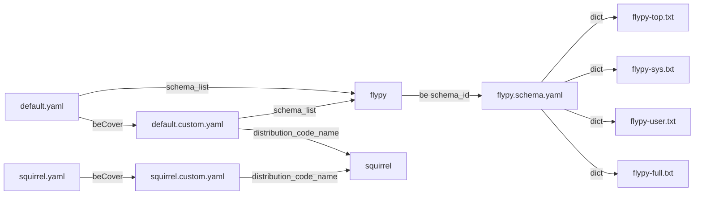

# 小鹤

下载自：http://flypy.ysepan.com/ 的 [小鹤音形“鼠须管”for macOS.zip](http://ys-N.ysepan.com/116124318/319108762/k5813784464PFHhgiuj481/小鹤音形“鼠须管”for macOS.zip?lx=xz) （虽然说是for macOS，但实际上Window也可用）

## 目录

- build/
- lua/
- default.custom.yaml
- default.yaml
- flypy.schema.yaml
- flypy_full全码字.txt
- flypy_sys.txt
- flypy_top.txt
- flypy_user.txt
- rime.lua
- squirrel.custom.yaml
- squirrel.yaml

## yaml (入口)

### 五个yaml的关系

三类文件

- .yaml文件：
  这类文件是RIME输入法的主要配置文件，用于定义输入法的整体行为和特性。
  它包含了输入法的基本设置、候选词的排序规则、短语替换、按键绑定等。通过修改.yaml文件，可以对输入法进行自定义配置和个性化调整。
- .custom.yaml文件：
  .custom.yaml文件是用户自定义的配置文件，用于覆盖主要的.yaml文件中的设置。通过在.custom.yaml文件中进行修改，用户可以对输入法的行为进行个性化调整，而无需修改原始的.yaml文件。这样做的好处是，当输入法升级或更新时，用户的自定义设置不会被覆盖。
- .schema.yaml文件：
  .schema.yaml文件是用于定义输入法的输入方案（Schema）的配置文件。
  输入方案定义了输入法的候选词生成规则、编码方式、词库等。通过修改.schema.yaml文件，可以对输入法的输入方案进行调整和扩展，以满足用户的特定需求。

关系



### default.yaml

```yaml
# Rime default settings
# encoding: utf-8

config_version: "0.38"

schema_list:
  - schema: flypy

switcher:
  caption: 〔方案选单〕
  hotkeys:
    - Control+grave
    - Control+Shift+grave
    - F4
  save_options:
    - full_shape
    - ascii_punct
    - simplification
  fold_options: true
  abbreviate_options: true
  #option_list_separator: '／'

menu:
  page_size: 5

punctuator:
  full_shape:
    ' ' : { commit: '　' }
    ',' : { commit: ， }
    '.' : { commit: 。 }
    '<' : [ 《, 〈, «, ‹ ]
    '>' : [ 》, 〉, », › ]
    '/' : { commit: 、 }
    '?' : { commit: ？ }
    ';' : { commit: ； }
    ':' : { commit: ： }
    '''' : { pair: [ '‘', '’' ] }
    '"' : { pair: [ '“', '”' ] }
    '\' : { commit: 、 }
    '|' : '｜'
    '`' : ｀
    '~' : ～
    '!' : { commit: ！ }
    '@' : '＠'
    '#' : '＃'
    '%' : '％'
    '$' : [ ￥, '$', '€', '£', '¥', '¢', '¤' ]
    '^' : { commit: …… }
    '&' : ＆
    '*' : '＊'
    '(' : （
    ')' : ）
    '-' : －
    '_' : ——
    '+' : ＋
    '=' : ＝
    '[' : [ 「, 【, 〔, ［ ]
    ']' : [ 」, 】, 〕, ］ ]
    '{' : [ 『, 〖, ｛ ]
    '}' : [ 』, 〗, ｝ ]
  half_shape:
    ',' : { commit: ， }
    '.' : { commit: 。 }
    '<' : [ 《, 〈, «, ‹ ]
    '>' : [ 》, 〉, », › ]
    '/' : { commit: 、 }
    '?' : { commit: ？ }
    ';' : { commit: ； }
    ':' : { commit: ： }
    '''' : { pair: [ '‘', '’' ] }
    '"' : { pair: [ '“', '”' ] }
    '\' : { commit: 、 }
    '|' : '|'
    '`' : '`'
    '~' : { commit: ～ }
    '!' : { commit: ！ }
    '@' : '@'
    '#' : '#'
    '%' : { commit: '%' }
    '$' : { commit: "$" }
    '^' : { commit: …… }
    '&' : '&'
    '*' : { commit: '*' }
    '(' : （
    ')' : ）
    '-' : '-'
    '_' : ——
    '+' : '+'
    '=' : '='
    '[' : { commit: '【' }
    ']' : { commit: '】' }
    '{' : { commit: '｛' }
    '}' : { commit: '｝' }

key_binder:
  bindings:
    # Emacs style
    - { when: composing, accept: Control+p, send: Up }
    - { when: composing, accept: Control+n, send: Down }
    - { when: composing, accept: Control+b, send: Left }
    - { when: composing, accept: Control+f, send: Right }
    - { when: composing, accept: Control+a, send: Home }
    - { when: composing, accept: Control+e, send: End }
    - { when: composing, accept: Control+d, send: Delete }
    - { when: composing, accept: Control+k, send: Shift+Delete }
    - { when: composing, accept: Control+h, send: BackSpace }
    - { when: composing, accept: Control+g, send: Escape }
    - { when: composing, accept: Control+bracketleft, send: Escape }
    - { when: composing, accept: Alt+v, send: Page_Up }
    - { when: composing, accept: Control+v, send: Page_Down }
    # move by word
    - { when: composing, accept: ISO_Left_Tab, send: Shift+Left }
    - { when: composing, accept: Shift+Tab, send: Shift+Left }
    - { when: composing, accept: Tab, send: Shift+Right }
    # flip page
    - { when: has_menu, accept: minus, send: Page_Up }
    - { when: has_menu, accept: equal, send: Page_Down }
    - { when: paging, accept: comma, send: Page_Up }
    - { when: has_menu, accept: period, send: Page_Down }
    # hotkey switch
    - { when: always, accept: Control+Shift+1, select: .next }
    - { when: always, accept: Control+Shift+2, toggle: ascii_mode }
    - { when: always, accept: Control+Shift+3, toggle: full_shape }
    - { when: always, accept: Control+Shift+4, toggle: simplification }
    - { when: always, accept: Control+Shift+5, toggle: extended_charset }
    - { when: always, accept: Control+Shift+exclam, select: .next }
    - { when: always, accept: Control+Shift+at, toggle: ascii_mode }
    - { when: always, accept: Control+Shift+numbersign, toggle: full_shape }
    - { when: always, accept: Control+Shift+dollar, toggle: simplification }
    - { when: always, accept: Control+Shift+percent, toggle: extended_charset }
    - { when: always, accept: Shift+space, toggle: full_shape }
    - { when: always, accept: Control+period, toggle: ascii_punct }

recognizer:
  patterns:
    uppercase: "[A-Z][-_+.'0-9A-Za-z]*$"
    reverse_lookup: "[a-z`]*`+[a-z`]*"
    punct: ""

ascii_composer:
  good_old_caps_lock: true
  switch_key:
    Shift_L: inline_ascii
    Shift_R: commit_text
    Control_L: noop
    Control_R: noop
    Caps_Lock: clear
    Eisu_toggle: clear
```

### default.custom.yaml

```yaml
customization:
  distribution_code_name: Squirrel
  distribution_version: 2019-06-23
  rime_version: 1.5.3
patch:
  schema_list:
    - schema: flypy # 添加小鹤音形

#
# 可用的按键有 Caps_Lock, Shift_L, Shift_R, Control_L, control_R
# Mac 系统上的鼠须管不能区分左、右，因此只有对 Shift_L, Control_L 的设定起作用
#
# 已输入编码时按切换键，可以进一步设定输入法中西文切换的形式
# 可选的临时切换策略有三：
# inline_ascii 在输入法的临时西文编辑区内输入字母、数字、符号、空格等，回车上屏后自动复位到中文
# commit_text 已输入的候选文字上屏并切换至西文输入模式
# commit_code 已输入的编码字符上屏并切换至西文输入模式
# 设为 noop, 屏蔽该切换键
#
# 如果要把Caps Lock 设为只改变字母的大小写而不做中西文切换，可将 Caps_Lock 对应的切换方式设为 noop
# 如果要以Caps Lock 切换到西文模式，默认输出小写字母，请置 ascii_composer/good_old_caps_lock: false
# 如果要以Caps Lock 切换到西文模式，默认输出大写字母，请置 ascii_composer/good_old_caps_lock: true

  ascii_composer/good_old_caps_lock: true
  ascii_composer/switch_key:
    Caps_Lock: noop
    Shift_L: commit_code
    Shift_R: noop
    Control_L: noop
    Control_R: noop

  key_binder/bindings:
    - when: paging
      accept: bracketleft
      send: Page_Up
    - when: has_menu
      accept: bracketright
      send: Page_Down
```

### flypy.schema.yaml

```yaml
# Rime schema settings
# encoding: utf-8

schema:
  schema_id: flypy
  name: 小鹤音形
  version: "10.9.4"
  author:
    - 方案设计：何海峰 <flypy@qq.com>
  description: |
    小鹤音形输入法

punctuator:
  import_preset: default

switches:
  - name: ascii_mode
    reset: 0
   # states: [ 中文, 英文 ]
  - name: full_shape
   # states: [ 半角, 全角 ]
  - name: simplification
   # states: [ 简, 繁 ]
    reset: 0
  - name: ascii_punct
   # states: [ 。，, ．， ]
    reset: 0

engine:
  processors:
    - ascii_composer
    - recognizer
    - key_binder
    - speller
    - punctuator
    - selector
    - navigator
    - express_editor
  segmentors:
    - ascii_segmentor
    - matcher
    - abc_segmentor
    - punct_segmentor
    - fallback_segmentor
  translators:
    - punct_translator
    - table_translator
    - lua_translator@date_translator
    - lua_translator@time_translator
    - table_translator@custom_phraseVD
    - table_translator@custom_phraseXT
    - table_translator@custom_phraseYH
    - table_translator@custom_phraseQMZ
    - reverse_lookup_translator
    - history_translator@history
    - lua_translator@calculator_translator
  filters:
    - simplifier
    - simplifier@simplification
    - uniquifier

speller:
  alphabet: "abcdefghijklmnopqrstuvwxyz;'"
  initials: ';abcdefghijklmnopqrstuvwxyz'
  finals: "'"
  #delimiter: " '"
  max_code_length: 4
  auto_select: true   #顶字上屏
  auto_select_pattern: ^;.$|^\w{4}$
  auto_clear: max_length #manual|auto|max_length 空码按下一键确认清屏|空码自动清|达到最长码时后码顶上清屏

translator:
  dictionary: flypy
  enable_charset_filter: false
  enable_sentence: false
  enable_completion: false # 编码提示开关
  enable_user_dict: false
  disable_user_dict_for_patterns:
    - "^z.*$"
 

history:
   input: ;f
   size: 1 #重复前几次上屏
   initial_quality: 1 #首选
   
simplification:
  opencc_config: s2tw.json
  option_name: simplification
  tips: all #简繁对照

custom_phraseVD:
  dictionary: ""
  user_dict: flypy_top
  db_class: stabledb
  enable_sentence: false
  enable_completion: false
  initial_quality: 0 #用户词和系统词重码 置顶
  
custom_phraseXT:
  dictionary: ""
  user_dict: flypy_sys
  db_class: stabledb
  enable_sentence: false
  enable_completion: false
  initial_quality: -1 #本表词和系统词重码居后

custom_phraseYH:
  dictionary: ""
  user_dict: flypy_user
  db_class: stabledb
  enable_sentence: false
  enable_completion: false
  initial_quality: -1 #用户词和系统词重码居后
  
custom_phraseQMZ:
  dictionary: ""
  user_dict: flypy_full
  db_class: stabledb
  enable_sentence: false
  enable_completion: false
  initial_quality: -1 #和系统词重码时居后

reverse_lookup:
  dictionary: flypydz
  comment_format:
   # - xform/^/〔/
   # - xform/$/〕/
    - xform/ / /


key_binder:
  import_preset: default #方案切换相关
  bindings:
    - {accept: bracketleft, send: Page_Up, when: paging} # [上翻页
    - {accept: bracketright, send: Page_Down, when: has_menu} # ]下翻页
    - {accept: comma, send: comma, when: paging} #注销逗号翻页
    - {accept: period, send: period, when: has_menu} #注销句号翻页
    - {accept: semicolon, send: 2, when: has_menu} #分号次选
  #  - {accept: Release+semicolon, send: semicolon, when: has_menu} #如启用此行，则分号引导符号功能无效
    - {accept: Release+period, send: period, when: composing} #句号顶屏
    - {accept: Release+comma, send: comma, when: composing} #逗号顶屏
    - {accept: "Tab", send: Escape, when: composing}
    - {accept: "Shift_R", send: Escape, when: composing}
    - {accept: "Shift+space", toggle: full_shape, when: always} #切换全半角
    - {accept: "Control+period", toggle: ascii_punct, when: always} #切换中英标点
    - {accept: "Control+j", toggle: simplification, when: always} #切换简繁

recognizer:
  import_preset: default
  patterns:
    #uppercase: "[A-Z][-_+.'0-9A-Za-z]*$"
    uppercase: "" #中文状态大写锁定直接上屏
    reverse_lookup: "[a-z`]*`+[a-z`]*"
    punct: ""
    expression: "^=.*$"

menu:
  page_size: 5 #候选项数
  
style:
  horizontal: true #竖排为false
```

### squirrel.yaml

### squirrel.custom.yaml

## 码表

### flypy_full全码子.txt

### flypy_sys.txt (主要码表)

### flypy_top.txt

### flypy_user.txt


