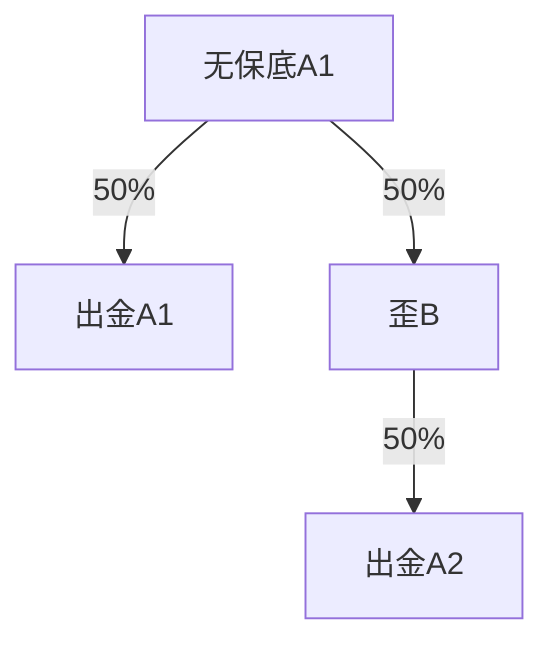
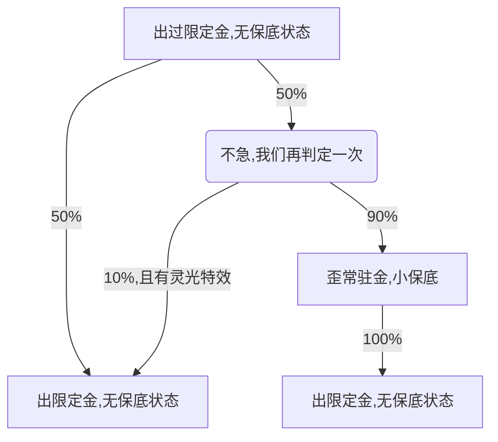
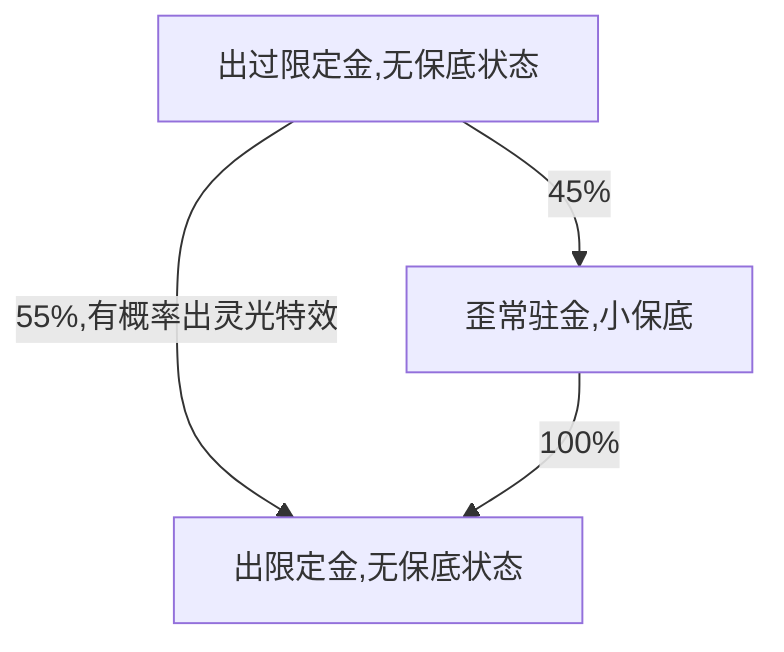
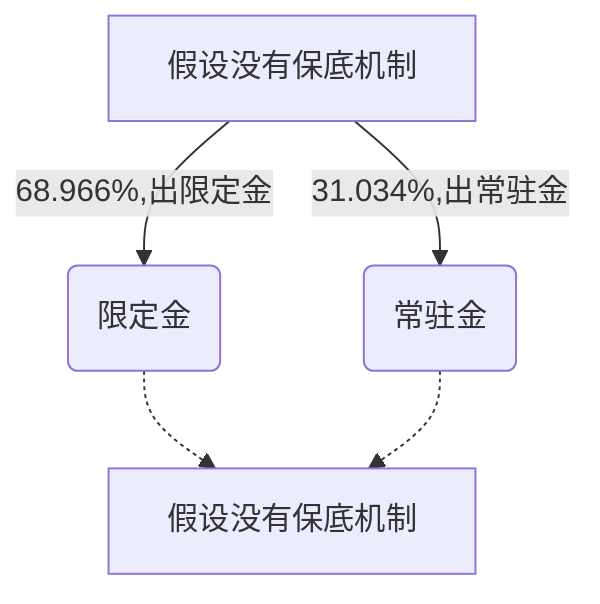

# 马尔可夫链算新抽卡概率

## 原流程

### 流程

50%歪，50不歪。若歪则下一次必定不歪

### 期望概率

方式一：状态转移方程组

$$
1. 状态转移方程\\~\\
\pi =
\begin{bmatrix}
\pi(A) &\pi(B)
\end{bmatrix}
\times
\begin{bmatrix}
&toA &toB\\
fromA &0.5 &0.5\\
fromB &1.0 &0.0
\end{bmatrix}
= 
\begin{bmatrix}
\pi(A) &\pi(B)
\end{bmatrix}

\\~\\

2. 展开得到方程组\\~\\
\begin{cases}
0.5\pi(A)+1.0\pi(B) &= \pi(A)\\
0.5\pi(A)+0\pi(B) &= \pi(B)\\
\pi(A)+\pi(B) &= 1
\end{cases}

\\~\\

3. 解方程组\\~\\
\begin{cases}
\pi(A) &= \frac 23 \approx 66.667\% \\
\pi(B) &= \frac 13 \approx 33.333\%
\end{cases}
$$

方式二：马尔可夫链，并使用概率转移矩阵来进行计算（更适合计算机运算的方法）
$$
\begin{align}
    概率转移矩阵P&=
    \begin{bmatrix}
    &toA &toB\\
    fromA &0.5 &0.5\\
    fromB &1.0 &0.0
    \end{bmatrix}
    \\~\\

    一次转移&=
    \begin{bmatrix}
    1 &0\\
    \end{bmatrix}
    \cdot P=
    \begin{bmatrix}
    0.5 &0.5\\
    \end{bmatrix}
    \\~\\

    二次转移&=
    \begin{bmatrix}
    1 &0\\
    \end{bmatrix}
    \cdot P^2 =
    \begin{bmatrix}
    1 &0\\
    \end{bmatrix}
    \cdot
    \begin{bmatrix}
    0.75 &0.25\\
    0.5 &0.5
    \end{bmatrix}
    =
    \begin{bmatrix}
    0.75 &0.25\\
    \end{bmatrix}
    \\~\\
    
    很多次转移&=
    \begin{bmatrix}
    1 &0\\
    \end{bmatrix}
    \cdot P^N =
    \begin{bmatrix}
    0.66667 &0.33333\\
    \end{bmatrix}
\end{align}
$$

## 新概率

### 流程

完整的程序机制：

可以将上图简化，完全等效为：

我们也可以，抛弃保底机制，转化为纯期望模型：

### 期望概率

状态转移方程组
$$
1. 状态转移方程\\~\\
\pi =
\begin{bmatrix}
\pi(A) &\pi(B)
\end{bmatrix}
\times
\begin{bmatrix}
&toA &toB\\
fromA &0.55 &0.45\\
fromB &1.0 &0.0
\end{bmatrix}
= 
\begin{bmatrix}
\pi(A) &\pi(B)
\end{bmatrix}

\\~\\

2. 展开得到方程组\\~\\
\begin{cases}
0.55\pi(A)+1.0\pi(B) &= \pi(A)\\
0.45\pi(A)+0\pi(B) &= \pi(B)\\
\pi(A)+\pi(B) &= 1
\end{cases}

\\~\\

3. 解方程组\\~\\
\begin{cases}
\pi(A) &= \frac {100}{145} = \frac {20}{29} \approx 68.966\%\\
\pi(B) &= \frac {45}{145} = \frac {9}{29} \approx 31.034\%
\end{cases}
$$

## 最终结论

1. 当我们看到：歪了以后有 $10\%$ 概率变歪为不歪，会觉得 $10\%$ 好多啊

2. 当我们看到：非保底出up的概率从 $50\%$ 提高到了 $55\%$，会觉得提高了 $5\%$，还行吧，聊胜于无

3. 当我们看到：新概率相较于旧概率，平均的up出金率提高了 “惊人的” $2.299\%$。就感觉少了。
   （即每一百个金/每66.67个Up角色，会多2.299个Up角色）

4. 平均多少抽多一个金？

   在没有修改概率的时间线中，不欧不非的你会在 5.0 版本后抽了43个金。其中28.667个Up角色了，14.333个非Up角色。
   而在新时间线中，这个机制在期望上能让不欧不非的你会抽到29.655个金，相较于另一个时间线的自己刚好少一个常驻金，而多一个Up金。

所以说，为什么在前瞻中要把概率提高说得那么绕，而不是简单地跟你说概率提高了多少多少，就是让你觉得概率提高了好多

