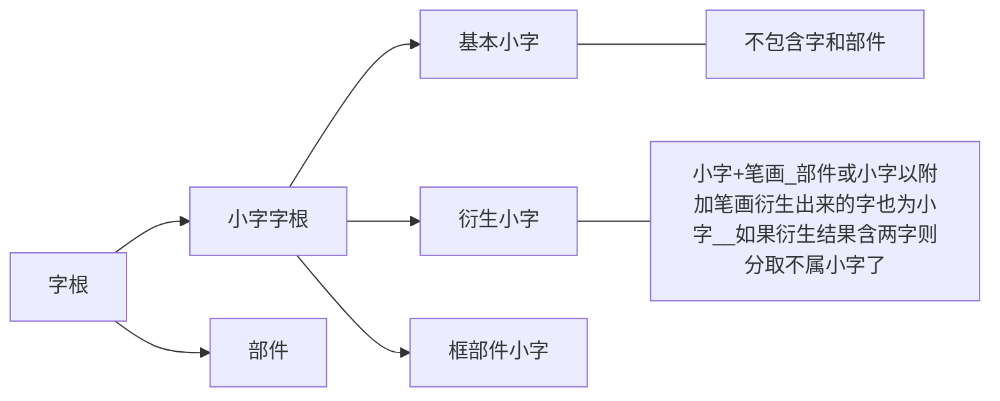

# 小鹤音形

# 目录

# 小鹤音形

官网文档：https://help.flypy.com/#/xh

输出 orm调出入门学习

速度参考：https://www.bilibili.com/video/BV1Vv411B7ke

## 教程类

### 形拆分

#### 小字 - 拆法规则

一、小字字根的特点

用规则定义字根，记的是规则，而不是具体的字根，大大减少了记忆量。

二、小字字根的定义

小字字根范围以《通用规范汉字表》为准。小字分：基本小字、衍生小字、框部件小字三种。

1. 基本小字：一个字如果不再包含字或部件则为小字
2. 衍生小字：部件或小字以附加单笔画方式衍生出来的字也为小字，如果衍生结果含两字则分取

#### 小字 - 衍生小字注意点

① 单笔画不一定只是一次只衍生一笔，也可以是在不同隔离区各附加一笔

- 十(基本小字)→米(衍生小字)，左上、右上、左下、右下四个不同隔离取单笔衍生的
- 十(基本小字)→木(衍生小字)
- 人(基本小字)→火(衍生小字)

但不能在同一个隔离区附加两笔或两笔以上

- 例如“斗”就不是小字，“十”(基本小字)无法衍生出“斗”(非小字)

② 衍生笔画只能是相接或相离，不能相交。

- 月ytka(基本部件)→用yskl(非小字) ×
- 土tuua(基本部件)→王what(衍生小字) √
- 三sjae(基本小字)→王what(衍生小字) ×

③ 衍生小字如果衍生结果含两字则分取

- 兀wuae→元yree，此时“元”包含两个字了，二和儿，所以“元”就不是小字。

注意:这里必须是两个“字”，一个部件+一个字不算

- 王what→主vudw，这里“主”是衍生小字（不是基本小字），虽然有两个部分“点横”和“土”，但“”不是字，所以不属于含两字则分取的范围。

④ “日”只能向上衍生

- 日→~~旦~~→~~亘~~
- 日→~~旧~~
- “旦、亘、旧”这些都不是小字。

“日”向上衍生的比如

- 日→白→百。这些就是小字。

#### 小字 - 框部件小字注意点

框部件小字：一个字除部件“口二门口勺”之外，不再含其它部件或字，则为小字，含则分取

① 开口框在字中开口时才为部件

- “皿、且、甲”这些字是基本小字、不算框部件小字，自己拆分时，首形不能取门。

小字其他注意点：多音字小字永远只取一个音，“长“ 按chang算，键位只取i，“重”按zhong算，键位只取v

#### 小字 - 捋一下不是小字的部件

（先判断不是衍生小字，再判断是否基本小字）

- 求，包含水
- 田，包含框和十
- 羊，包含八
- 石，包含口
- 虫，包含中
- 缶，包含午
- 鬼，包含私
- 革，包含
- 鱼、山、日、月、目，没按音托
- 彳、亍、豸

#### 规则 - 字根序介绍

1. 字根序：即从首笔开始与其它笔画(不论顺序)组成字根则为首字根，首字根笔画之外剩余笔画再按剩余首笔画组成字根，直到最末组成的为末字根。

2. 笔顺序：即字根必须在字的笔顺上才为字根，取首末笔顺序字根

3. 首末笔所在字根序，即首末笔能和其它笔画(不论顺序)组成字根则为字根。

   字根序“戌”的拆法:戊一笔顺序“戌”的拆法:一`

   笔顺序“戌”的拆法：一  点

   首末笔所在字根序“戌”的拆法:戊戊

   “蒙朦”这一系列的字，末形拆捺，而不拆“豕”就是字根序的原因。

#### 规则 - 鹤形拆分规则

1. 首末取码，取大优先，无则取笔画

   注意点：很多人错误地理解为优先取小字，实际在取码时，小字和部件是同等关系的，

   “鞍”小字是“廿”，部件是“革”，“革”比“廿”大。所以取“革”

2. 相交不拆

   字根如与其它笔画相交，则不取。注意：相接不算相交。“十”里面的横和竖算相交，“丁”的横和竖算相接

3. 插隔不取:

   ① 插入不取：好比一个三面包围 “二” 或四面包围“口”的结构中间插入一个单笔画

   插入的注意点:
   一、插入一定要三包围或全包围，“平” 里面的干算被插，“米” 里面的 “十” 不算被插，因为十的四个隔离区没有三包围或全包围

   二、插入一定要单笔画，“巫”里面的“工”符合三包围的条件，但不算被插，因为“人”是两笔，不是单笔画。

   ② 隔离不取：字根只要被一个结构(可能是字也可能不是)隔离，拆分时就不被认为是字根。“半”中的“、,”就被隔离了。

4. “又i”优先：

   以“又主”为部首的字，首码先取

#### 规则 - 衍生小字拆分

附加一个单笔画的方式衍生的小字，作为一个字需要拆分时，分取单笔画与衍生前的部分;其它小字拆分参照主规则。

- “主” 拆 “点王”，不拆 “文土”（**无视取大优先**）
- “方” 拆 “点万”，不拆 “文折”（**无视取大优先**）
- “卞” 拆 “点下”，不拆 “文卜”（**无视取大优先**）

“玉”拆“王、”。此时“王”完全符合被单笔画插入，但仍旧取“王”是因为**无视了“插单不取”**。

### 拆法疑惑

http://react.xhup.club/search

丧（shu 十）

忍（刃心）

带（ddf 带上丰　冖　巾）

剩（ugqd 千）

~~速  suz suzu~~

~~白  bdpo~~

~~鹤  hedn~~

~~于  yual~~

~~灼  vohu~~

~~虫  isvd~~（中点）

~~之  vidn~~（三笔）

~~可  kedk~~（口）

点捺问题

| 小字     | 点                 | 捺                 |
| -------- | ------------------ | ------------------ |
| 失  uipf | 天  tmad（不穿点） | 夫  fuan（穿头捺） |
| 矢  uipt | 不  buad（不穿点） | 大  daun（穿头捺） |
|          |                    | 未  wwan（穿头捺） |
|          |                    |                    |
|          |                    | 水  uvln           |
|          |                    | 之  vidn           |
|          |                    |                    |
|          |                    | 豕  uian（左边弯） |
|          |                    | 朦  mgou/mgon      |
|          |                    | 蒙  mgcu/mgcn      |
|          |                    | 象  xldn           |

人的变形

> | 该  gdyr            | 向右 |
> | ------------------- | ---- |
> | 提  tifr            | 向左 |
> | 页  year            | 向下 |
> | 领  lkrr / 令  lkrs | 向上 |

求  qqad

碗  wjuv（不是巳）

里？？lila

间？？jmmo

么me

笔顺问题

戌  xuwa

武  wuav

### 个人总结

## 简字简词

### 一简字

#### 一重

去我二人他一是出哦平

啊三的非个和就可了

在小才这不你没

---

记忆1：

一二三

你我他

哦啊非

这可才不是在个和平的（日子），小人就没出去了

记忆2：

一二三、你我他、哦和啊

这是、可是、才是、不是、就是

是在、是个、是非、是了、是的

这是、这才、这个、这不、这可

没人、没出去、没了

小平

---

~~搜狗小鹤：~~

去我**而**人他一是出哦平

啊**是**的**飞**个**好**就**看**了

在**想**才**中吧**你**吗**

#### 一简字二重

oei 启用二重简码分类

期位嗯入它又时出；哦；平；

按随打发管化见块立

子性此之吧哪嘛

记忆：

### 二简

#### 二简字（共383个）

阿 爱 安 昂 奥 把 白 办 帮 报 被 本 蹦 比 边 表 别 滨 并 拨 部 擦 菜 参 藏ｃ藏ｚ草 测 岑 曾 差 拆 产 超 车 陈 成 吃 冲 抽 处 揣 传 窗 吹 纯 戳 次 从 凑 粗 窜 催 村 错 大 代 但 当 到 得 得 等 地 点 跌 定 丢 动 都 读 段 对 顿 多 额 欸 恩 嗯 而 法 反 放 费 分 风 佛 否 副 嘎 该 干 刚 高 各 给 跟 更 共 够 古 挂 怪 关 光 贵 滚 过 哈 还 含 行ｘ行ｈ好 何 黑 很 横 红 后 户 话 坏 换 黄 会 混 或 几 加 间 将 叫 接 进 经 久 据 卷 均 卡 开 看 抗 靠 克 剋 肯 坑 空 口 酷 夸 快 宽 况 亏 困 扩 拉 来 浪 老 乐 类 冷 里 连 两 料 列 林 另 刘 龙 楼 路 乱 论 落 率 吗 买 慢 忙 毛 么 每 们 梦 米 面 秒 灭 民 名 末 某 目 那 难 囊 闹 呢 内 嫩 能 泥 年 鸟 捏 您 宁 牛 弄 怒 暖 虐 挪 女 欧 怕 排 盘 旁 跑 配 撇 盆 碰 批 片 票 品 凭 破 剖 普 其 恰 前 强 桥 且 亲 请 穷 求 区 全 却 群 然 让 绕 热 任 仍 日 容 肉 如 软 若 撒 赛 散 扫 色 森 僧 啥 晒 山 上 少 设 深 生 事 受 数 帅 拴 双 谁 水 顺 说 四 送 搜 苏 算 岁 所 她 太 谈 汤 套 特 疼 体 天 调ｔ调ｄ贴 听 同 头 图 团 推 托 挖 外 完 王 为 问 翁 喔 握 无 系 下 先 想 笑 些 新 熊 修 需 选 学 亚 眼 样 要 也 以 因 应 哟 用 有 与 元 月 云 咋 再 早 则 贼 怎 增 扎 占 长ｉ长ｖ找 着 真 正 只 中 周 主 抓 拽 转 装 追 桌 字 总 走 组 最 做

---

阿 爱 安 昂 奥 把 白 办 帮 报 被 本 蹦 比 边 表 别 滨 并 拨 部 擦 菜 参 藏ｃ藏ｚ草 测 岑 曾 差 拆 产 超 车 陈 成 吃 冲 抽 处 揣 传 窗 吹 纯 戳 次 从 凑 粗 窜 催 村 错 大 代 但 当 到 得 得 等 地 点 跌 定 丢 动 都 读 段 对 顿 多 额 欸 恩 嗯 而 法 反 放 费 分 风 佛 否 副 嘎 该 干 刚 高 各 给 跟 更 共 够 古 挂 怪 关 光 贵 滚 过 哈 还 含 行ｘ行ｈ好 何 黑 很 横 红 后 户 话 坏 换 黄 会 混 或 几 加 间 将 叫 接 进 经 久 据 卷 均 卡 开 看 抗 靠 克 剋 肯 坑 空 口 酷 夸 快 宽 况 亏 困 扩 拉 来 浪 老 乐 类 冷 里 连 两 料 列 林 另 刘 龙 楼 路 乱 论 落 率 吗 买 慢 忙 毛 么 每 们 梦 米 面 秒 灭 民 名 末 某 目 那 难 囊 闹 呢 内 嫩 能 泥 年 鸟 捏 您 宁 牛 弄 怒 暖 虐 挪 女 欧 怕 排 盘 旁 跑 配 撇 盆 碰 批 片 票 品 凭 破 剖 普 其 恰 前 强 桥 且 亲 请 穷 求 区 全 却 群 然 让 绕 热 任 仍 日 容 肉 如 软 若 撒 赛 散 扫 色 森 僧 啥 晒 山 上 少 设 深 生 事 受 数 帅 拴 双 谁 水 顺 说 四 送 搜 苏 算 岁 所 她 太 谈 汤 套 特 疼 体 天 调ｔ调ｄ贴 听 同 头 图 团 推 托 挖 外 完 王 为 问 翁 喔 握 无 系 下 先 想 笑 些 新 熊 修 需 选 学 亚 眼 样 要 也 以 因 应 哟 用 有 与 元 月 云 咋 再 早 则 贼 怎 增 扎 占 长ｉ长ｖ找 着 真 正 只 中 周 主 抓 拽 转 装 追 桌 字 总 走 组 最 做

阿 爱 安 昂 奥 把 白 办 帮 报 被 本 蹦 比 边 表 别 滨 并 拨 部 擦 菜 参 草 测 岑 曾 差 拆 产  陈 成 吃 冲 抽 处 揣 传 窗 吹 纯 戳 次 从 凑 粗 窜 催 村 错 大 代 但 当 到 得 得 等 地 点 跌 定 丢 动 都 读 段 对 顿 多 额 欸 恩 嗯 而 法 反 放 费 分 风 佛 否 副 嘎 该 干 刚 高 各 给 跟 更 共 够 古 挂 怪 关 光 贵 滚 过 哈 还 含 好 何 黑 很 横 红 后 户 话 坏 换 黄 会 混 或 几 加 间 将 叫 接 进 经 久 据 卷 均 卡 开 看 抗 靠 克 剋 肯 坑 空 口 酷 夸 快 宽 况 亏 困 扩 拉 来 浪 老 乐 类 冷 里 连 两 料 列 林 另 刘 龙 楼 路 乱 论 落 率 吗 买 慢 忙 毛 么 每 们 梦 米 面 秒 灭 民 名 末 某 目 那 难 囊 闹 呢 内 嫩 能 泥 年 鸟 捏 您 宁 牛 弄 怒 暖 虐 挪 女 欧 怕 排 盘 旁 跑 配 撇 盆 碰 批 片 票 品 凭 破 剖 普 其 恰 前 强 桥 且 亲 请 穷 求 区 全 却 群 然 让 绕 热 任 仍 日 容 肉 如 软 若 撒 赛 散 扫 色 森 僧 啥 晒 山 上 少 设 深 生 事 受 数 帅 拴  谁  顺 说  送 搜 苏 算 岁 所 她 太 谈 汤 套 特 疼 体 天 贴 听 同 头 图 团 推 托 挖 外 完 王 为 问 翁 喔 握 无 系 下 先 想 笑 些 新 熊 修 需 选 学 亚 眼 样 要 也 以 因 应 哟 用 有 与 元   咋 再 早 则 贼 怎 增 扎 占 找 着 真 正 只 中 周 主 抓 拽 转 装 追 桌 字 总 走 组 最 做

四双

超车

水云月

行ｘ行ｈ

藏ｃ藏ｚ

调ｔ调ｄ

长ｉ长ｖ

#### 二简词（共337个）

##### 首选 271

> | a    | 安全 按照 安排 挨饿 爱惜 安保 安定 安静 安慰 安逸 按错 按理 按时 暗算 黯然 昂贵 凹凸 拗口 |
> | ---- | ------------------------------------------------------------ |
> | b    | 不同 比赛 必须 并且 本来 保证 必要                           |
> | c    | 才能                                                         |
> | d    | 东西 地方 到了 代表                                          |
> | e    | 而且 儿子 而已                                               |
> | f    | 非常 发现  方面 反正 放弃                                    |
> | g    | 过去 根本 功能 过程                                          |
> | h    | **后天** 回去 后面                                           |
> | i    | 出现 成为 产品 传统                                          |
> | j    | **今天** 结果 解决 几乎 简单                                 |
> | k    | 可能                                                         |
> | l    | 论坛 了解 联系                                               |
> | m    | 没有 目前 **明天** 明显 美丽                                 |
> | n    | 那些 难道 那样 努力                                          |
> | o    |                                                              |
> | p    | 漂亮                                                         |
> | q    | 其中                                                         |
> | r    | 日期 认为 日本 人们 容易                                     |
> | s    | 似乎 思想                                                    |
> | t    | 同学 特别 台湾 **天天**                                      |
> | u    | 所以 事情 身体  所谓 上面                                    |
> | v    | 这样 这么  知道 **只能** 准备                                |
> | w    | 我们 问题 为了 完全 完成                                     |
> | x    | 现在 喜欢 需要 希望 习惯                                     |
> | y    | 因为  一下 应该 一直 要求 一定 原来                          |
> | z    | 自己 怎么 **昨天** 自然 走了 怎样 作品                       |

安排 相当 首先 讨论 方便 期间 不再 人类 欧洲 随便 成本 确定 不然 平台 在线 一片 文字 奇怪 从来 恐怕 无奈 唯一 精彩 算了  采取 貌似 害怕 反对 反而 聪明 培训 下次 正确 思考 错误 反应 天气 微软 统一 认真 郁闷 配置 简直 头发 掌握 儿童 缺乏 计算  浪费 好处 偶尔 沟通 顺便 看出 西安 亲自 承诺 湖南 分配 恐怖 云南 安静 公平 何必 参考 安慰 骄傲 重码 为此 热闹 偶像 脑子  现金 几位 烦恼 折腾 相反 千万 放松 脾气 热爱 认可 其次 节奏 而不 无线 否认 缘分 认同 昆明 解放 金额 况且 欧阳 代替 偶然  咋不 从不 为止 骗人 暧昧 只怕 耳机 恶劣 必要 人品 下周 怎能 开头 饿死 热线 讽刺 而非 按时 默认 玩儿 恶搞 反馈 切换  额外 安逸 二者 昂贵 安定 猥琐 每周 呕吐 认得 噩梦 恶毒 拼音 费了 暂且 随你 索赔 洒脱 恩爱 索取 暗自 爱惜 安保 从头 全额  黯然 配送 险恶 繁体 五笔 暗算 西欧 儿科 恶心 恩赐 唯恐 挨饿 神似 安分 普洱 按理 凹凸 奇偶 拗口 存盘 恶评 按错 不饿 才行  干嘛 重启 双拼 网盘 最快 而是 什么sm	 

我们 没有 现在 这样 自己 因为 所以 怎么 问题 今天 日期 这么 喜欢 一下 应该 东西 而且 地方 需要 事情 希望 可能 非常 到了  知道 那些 认为 为了 出现 一直 成为 目前 日本 发现 结果 要求 产品 论坛 不同 一定 **只能** 其中 难道 完全 准备 比赛 过去 人们  方面 原来 才能 明天 同学 必须 根本 特别 身体 那样 漂亮 昨天 安全 解决 功能 了解 台湾 回去 儿子 自然 努力 似乎 联系 而已  所谓 代表 走了 几乎 怎样 并且 明显 上面 本来 容易 完成 反正 按照 美丽 作品 过程 天天 思想 习惯 后面 简单 传统 保证 放弃  安排 相当 首先 讨论 方便 期间 不再 人类 欧洲 随便 成本 确定 不然 平台 在线 一片 文字 奇怪 从来 恐怕 无奈 唯一 精彩 算了  采取 貌似 害怕 反对 反而 聪明 培训 下次 正确 思考 错误 反应 天气 微软 统一 认真 郁闷 配置 简直 头发 掌握 儿童 缺乏 计算  浪费 好处 偶尔 沟通 顺便 看出 西安 亲自 承诺 湖南 分配 恐怖 云南 安静 公平 何必 参考 安慰 骄傲 重码 为此 热闹 偶像 脑子  现金 几位 烦恼 折腾 相反 千万 放松 脾气 热爱 认可 其次 节奏 而不 无线 否认 缘分 认同 昆明 解放 金额 况且 欧阳 代替 偶然  咋不 从不 为止 骗人 暧昧 只怕 耳机 恶劣 必要 后天 人品 下周 怎能 开头 饿死 热线 讽刺 而非 按时 默认 玩儿 恶搞 反馈 切换  额外 安逸 二者 昂贵 安定 猥琐 每周 呕吐 认得 噩梦 恶毒 拼音 费了 暂且 随你 索赔 洒脱 恩爱 索取 暗自 爱惜 安保 从头 全额  黯然 配送 险恶 繁体 五笔 暗算 西欧 儿科 恶心 恩赐 唯恐 挨饿 神似 安分 普洱 按理 凹凸 奇偶 拗口 存盘 恶评 按错 不饿 才行  干嘛 重启 双拼 网盘 最快 而是 什么sm	 

##### 次选 66

 支持 这些 虽然 选择 情况 学习 链接 得到 投资 每天 电脑 推荐 绝对 真正 公司 速度 刚刚 任务 随着 下面 否则 尽管 更新 前面  伤害 附件 仍然 慢慢 分别 追求 指定 味道 困难 搜索 背景 规则 完美 修改 试试 渐渐 极其 淘汰 总算 与其 恰恰 修正 束缚 极致  悠闲 推倒 尝尝 微信 感觉 假如 程度 面前 回复 从前 推广 征服 世纪 主意 意志 小时 只是 只会

### 系列字词/近似字词

口旁：吧（b;或bak\_）嘛（m;或mak\_）吗（ma\_）呢（ne_）

- 一简：啊哦
- 二简：吗呢
- 三简：吧

- 二简：间
- 三简：门

- 二简：进
- 三简：远近

- 哪〇一般都是3码，那〇4码

## 练习区

### 慢

小字：

豕（shǐ）长嘴猪、豚（tún）小猪、彘（zhì）大猪

尽  jbid、尺  iiun 

不是小字：

首：古(十)、走(土)

尾：页(人)

湿湿湿湿湿

俐俐俐俐俐2

解解解解解

猜猜猜猜猜

鞋鞋鞋鞋20

球球球球2

具具具具

斯斯斯斯

毫毫毫毫

冬冬冬冬00

紊紊紊紊紊，

却却却却却

现现现现现现

佛佛佛佛佛佛佛2

累累累累累2

雅雅雅雅雅雅雅雅雅雅雅雅雅雅

裹裹裹裹裹裹裹裹裹裹裹

羹羹羹羹羹羹羹羹

孙思邈孙思邈孙思邈孙思邈孙思邈孙思邈孙思邈孙思邈孙思邈
景仰景仰景仰景仰景仰景仰景仰
未央宫未央宫未央宫未央宫（wei！no moyanggong）
椽柱椽柱椽柱椽柱椽柱椽柱椽柱irm chuan
扼制齿扼制齿扼制齿扼制齿扼制齿扼制齿扼制齿扼制齿、舌
负手负手负手负手负手负手负手负手负手
往复察看往复察看往复察看往复察看往复察看往复察看往复察看
门闩门闩门闩门闩门闩无闩无闩闩闩闩无闩无闩闩闩闩无闩urm shuān
亘亘亘gfa gèn横亘横亘

无词：

回忆

#### 慢字

，。“

壁  biu biut（尸vp土）

及  jip jipn（撇折捺）

蛊

父 fubx

顾（厂 gui）

登（折 dgv）

盈盈盈盈盈盈盈盈盈盈盈

羊腿羊腿羊羊羊羊羊羊羊羊羊羊羊羊

#### 慢词

骤降骤降骤降骤降骤降骤降

时间，uij

程度，id;

充分，isf;

假如，jr;

相思，xls;

#### 不认字

籽蒿，liao4hao1

嶙峋，lin2xun2

双手，shuang1(ul)

唱歌：chang4

不朽：xiu3

病恹恹：yan1

禅寺：chan2si4

逶迤：wei3yi2，细 瘦 逶迤

禅寺：chan2si4

簇新：cu4

豕（ui4an）

干哕（hv4kx）

窸窣（xibx1subu1）

豢养（hr4yh3）

摇曳（yc2ye4）

藤蔓（téng **wàn**，不是蔓man4，多音字）

摩挲（magu1sadu1）

翕（xi1r）

齑粉（ji1wl）

掀（xm1fr）

羞惭（can2）

邪崇（sui4ex）

揖（yi1fe）

木椽（chuán，irmu）

禳解（rh2p）

嗟叹（jp1kg）

馁（nwu）

倏（uurq; ）

羌笛（ql1y）

惯怅（igx）

咱俩（zan lia，zjlx）[zán] [zá] [liǎng] [liǎ]

确凿（què záo）

#### 笔顺错误

九（撇 jqp）

断（米 drm）

憋（点 bpd）

#### 全码区

领、鹤、颊

#### 难点小字

弋（yì）式贰

戈（gen）战

戋（jian）钱

戊（wuad）感（gjx和gjx都行）、戌（戊一）

戌（xu1）感（gjx和gjx都行）

毁（hvj 臼 jiù）

革？？？genl（廿niàn）

耒（lěi）耗

切（七）

烧（uche 兀）

郡（jyye 尹）

