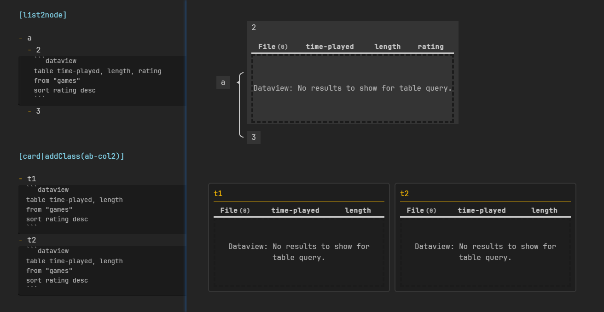
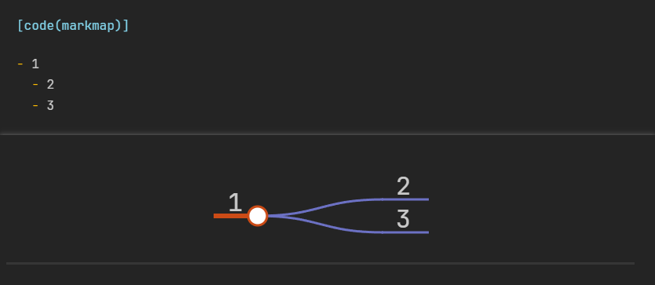
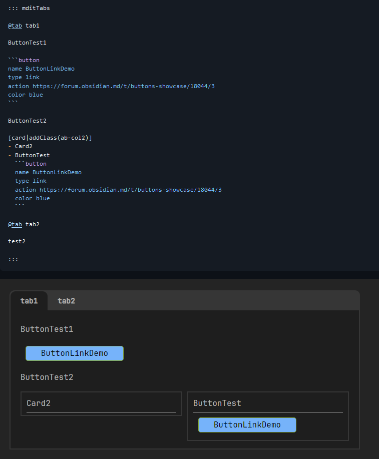
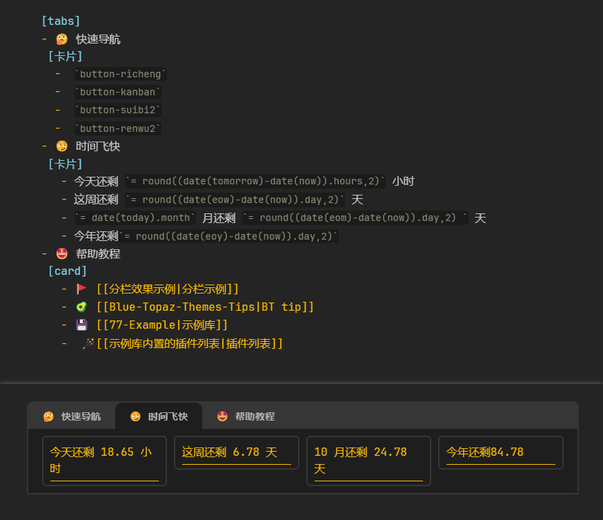
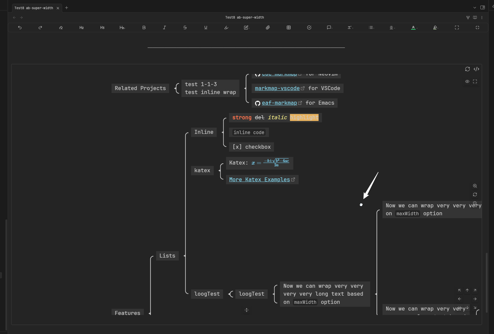

# 精彩用例

## 配合其他插件

### Callout语法

anyblock嵌套callout正常，callout嵌套anyblock在阅读模式下暂不正常

### DataView

### Mindmap-Nexgen

这个案例中，anyblock负责选择范围，mindmap nexgen负责渲染  

（In this case, anyblock is responsible for selecting the scope and mindmap nexgen is responsible for rendering）

### Meta-Bind (V3.1.7+才支持，感谢 Meta-Bind 作者的帮助)

[](https://private-user-images.githubusercontent.com/25877214/373980881-37723dd5-73d6-4d6a-a0e0-50b683ba452c.png?jwt=eyJhbGciOiJIUzI1NiIsInR5cCI6IkpXVCJ9.eyJpc3MiOiJnaXRodWIuY29tIiwiYXVkIjoicmF3LmdpdGh1YnVzZXJjb250ZW50LmNvbSIsImtleSI6ImtleTUiLCJleHAiOjE3MjgyNTIwODMsIm5iZiI6MTcyODI1MTc4MywicGF0aCI6Ii8yNTg3NzIxNC8zNzM5ODA4ODEtMzc3MjNkZDUtNzNkNi00ZDZhLWEwZTAtNTBiNjgzYmE0NTJjLnBuZz9YLUFtei1BbGdvcml0aG09QVdTNC1ITUFDLVNIQTI1NiZYLUFtei1DcmVkZW50aWFsPUFLSUFWQ09EWUxTQTUzUFFLNFpBJTJGMjAyNDEwMDYlMkZ1cy1lYXN0LTElMkZzMyUyRmF3czRfcmVxdWVzdCZYLUFtei1EYXRlPTIwMjQxMDA2VDIxNTYyM1omWC1BbXotRXhwaXJlcz0zMDAmWC1BbXotU2lnbmF0dXJlPWRjYzQyY2JmMDgyNzlmY2JmNmVmZjRhODlkYTAxOGZhMWUzZGRiYmMxODBiNjBlMzE2MWQ5MDRiYzRjYzFmYzgmWC1BbXotU2lnbmVkSGVhZGVycz1ob3N0In0.Rb3nWT0-m4OOg7f9BYbK2Va1KD1A8HR3WrjWKPszA-U)

### Buttons

### dataview的内联js (dataview inline dvjs) (V3.1.7+才支持)

### Diagram-Zomm-Drag

可以配合DiagramZommDrag实现渲染结果的缩放与拖拽

（这里的处理器是nodes加超级样式ab-super-width）

## 其他妙用

### 假如Obsidian不支持Callout语法，如何自行开发

略，自行想象

### 代码块内的反链

这个用法是用户开发出来的……并不是我一开始预设的行为：

[https://forum-zh.obsidian.md/t/topic/39261](https://forum-zh.obsidian.md/t/topic/39261)

有点 “歪门邪道”，虽然我个人不建议这样用，这里只是举例用于展示插件的灵活性

## 有待优化

兼容性问题：挺少的

- 表格类插件可能有一点影响
- callout包含anyblock在阅读模式下存在问题

