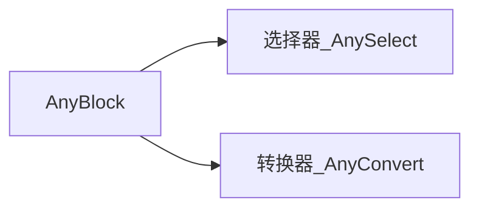
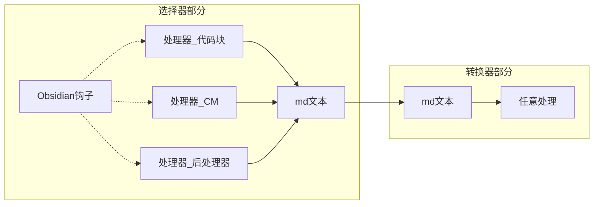
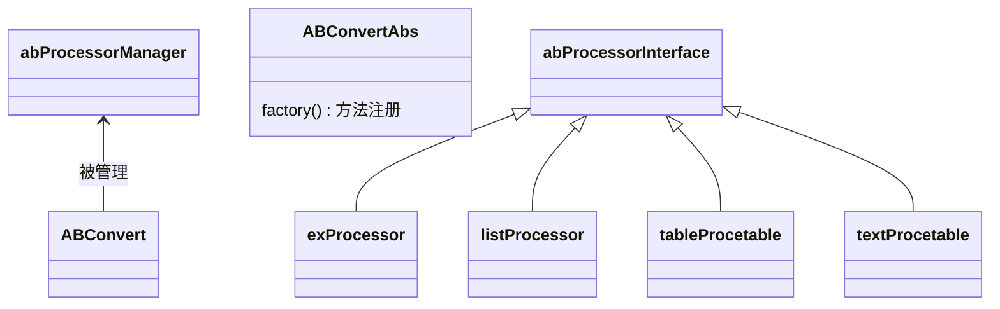
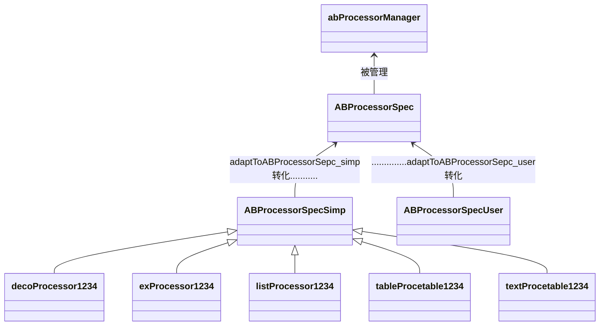

# 开发随笔

## For 开发者

这个是我自己开发的 md-it 和 obsidian 通用插件，为了通用性，技术栈混合使用 CodeMirror、Obsidian Plugin、Markdown-it、VuePress Markdown 扩展。

可适用于：

- 我的个人网站、VuePress、VuePress-Hope-Theme 文档构建
- Obsidian 插件
- 规划未来开发的使用 Markdown-it 进行渲染的笔记软件
- 软件内文档查看的临时显示（我之前有个开发的软件就是这样的）


后来发现，还是应该尽量脱耦，不然可能以后不用md-it呢？也说不准

ab的转化部分其实就是输入txt并输出html，理论上这玩意也是个md渲染引擎。应该弄个回调函数，然后自己处理一部分，再通过回调让原来处理另一部分。

 

技术相关：

如果你想学习开发插件，或了解更多该插件使用相关的技术，见：“MarkdownAbout” 相关的笔记（导航主页里的 “文档解析渲染/文档技巧”）。包含了 VuePress、CodeMirror、Markdown-it、Obsidian Plugin 等诸多东西

## 开发过程，记录与学习笔记

### 软件构成



### 处理流程



转换器部分中

> txt、html、json类/list类、都可以互相转换或自己转化成自己

### 类图

虽然是 TypeScript，而且代码整体更偏向于面向过程，但面向对象思维和类图还是要有的。

而且V1版本的模块化不够好，有是有模块化，但当时没想着功能要和Ob插件接口分离，没想着不去依赖底层

#### V3.0.0

V3做了以下改进：

1. 不再按文件区分处理器，而是更严格的按类区分。文件名改用主类名
2. 不再直接通过Interface直接派生出许多，而是通过多层类来继承
3. 更加分离公有方法和私有方法



#### V2.2.0

处理器



## 1.5.3 版本更新问题

### 如何回溯旧版

参考：[Obsidian中文论坛 - Obsidian如何回退版本](https://forum-zh.obsidian.md/t/topic/8821)

直接使用旧安装包安装是无效的，会回到最新版本

1. 下载旧版
   - https://github.com/obsidianmd/obsidian-releases/releases/download/v0.14.15/Obsidian.0.14.15.exe 或者去 https://github.com/obsidianmd/obsidian-releases/releases 下载你需要的历史版本.(部分地方需要科学手段)
2. 卸载重装
   - 下载到你需要的版本后，卸载新版 `C:\Users\{用户名}\AppData\Local\Obsidian\Uninstall Obsidian.exe`。然后，双击安装旧版。
3. 如果不成功，请尝试：
   - 关闭软件，把 `C:\Users\{用户名}\AppData\Roaming\obsidian`  文件夹内的缓存清空（这里存放的是缓存文件,如果有担心,可以把里面的内容复制到桌面备份，防止意外）
   - vault 中 `.obsidian配置文件里workspace` 会影响版本，导致回退失败。可以删除缓存和workspace回退

### Bug修复日志。Obsidian V1.5.8 新版本导致异常

AnyBlock 在实时模式下的转化有延迟。

1. 开启插件的一瞬间，当前打开的文档是生效的（正常）

2. 切换文件后，新打开的文档可能不生效，当你要关闭这个文档时才会重新生效（不正常）

   所以有时需要切换其他标签页再切回来，或者重新停启插件，才看看到正常的效果

#### Obsidian 异常版本定位

- 20221026，V1.0.3，正常
- 20221020，V1.1.8，正常
- 20221024，V1.1.9，覆盖安装异常 -> 清缓存后正常
- 20231014，V1.4.16，覆盖安装异常 -> 清缓存后正常
- **20231026，V1.5.3，正常**
- **20240222，V1.5.8，异常**
- 20240331，V1.5.12，异常
- 20240718，V1.6.7，异常（这个是在写到这里时，现在的最新的Obsidian版本）

（覆盖安装的话版本可能有问题，进行版本定位时应该卸载、并删除缓存文件夹，再安装，才作准）

#### 原因猜想

一开始始怀疑：

> 另外发现一个1.6版本和旧版的区别：
>
> - 一是1.6安装时会多一个弹窗让你选择安装路径（以前Electron的一个诟病就是不能选择安装路径）
>
> - 二是安装默认路径的变更：
>
>   ```bash
>   `C:\Users\{用户名}\AppData\Local\         Obsidian\`	# 旧
>   `C:\Users\{用户名}\AppData\Local\Programs\Obsidian\`	# 新 1.5.3、1.5.8、1.5.12、1.6.7、……
>   ```

进一步调试怀疑：

>奇怪的是：新旧版本的输出日志没有任何区别，看起来插件运作是一切正常的。
>
>后来怀疑是生命周期被改了

#### 修复

原来代码：
`this.app.workspace.on('file-open', ……` 就是保证打开新文件的时候，给你把新文件的内容解析替换掉，很符合常规逻辑

现在代码新增：
`this.app.workspace.on('layout-change', ……` 这才能保证新打开文件时，顺利将新文件的内容处理一遍

更新前后，打开文件时这两个钩子都会被触发。但是旧版本需要第一个钩子处处理，新版本需要在第二个钩子处处理

